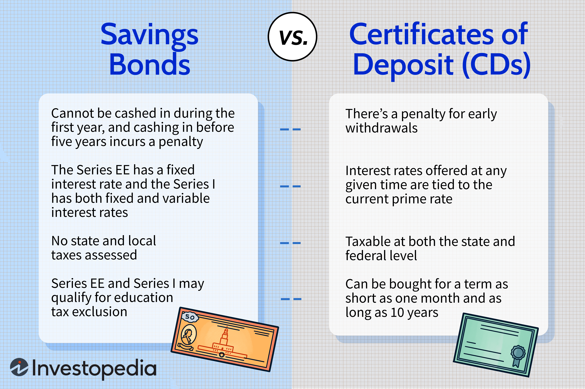

The financial landscape is continuously evolving, with inflation, certificate of deposit (CD) rates, and algorithmic trading as pivotal components impacting investment strategies. As economies fluctuate, understanding the intricate dynamics of these elements becomes crucial for formulating robust investment strategies. Inflation, which refers to the general increase in prices and subsequent erosion of purchasing power, directly influences investment returns by eating into real gains. Consequently, strategies that fail to account for inflation risk may inadvertently lead to diminished investment outcomes.

Certificates of Deposit (CDs), long considered a bastion of low-risk investment, offer fixed-term financial security with predetermined interest yields. However, in an environment of rising inflation, the real returns from CDs can be adversely affected, making it imperative for investors to reassess their traditional reliance on these instruments. The challenge lies in aligning CD investments with inflation expectations to ensure the preservation of purchasing power.



Algorithmic trading plays a transformative role in modern financial markets by utilizing sophisticated algorithms to automate trades, allowing for rapid and precise execution of investment strategies. These strategies can be meticulously designed to mitigate inflation risks by dynamically adjusting portfolios in response to real-time economic indicators. This adaptability offers investors a potent tool to optimize returns in inflation-affected environments.

This article will explore the intersection of inflation, CDs, and algorithmic trading, and how they can be strategically combined to optimize investment outcomes. By understanding the impact of inflation on CDs and leveraging algorithmic trading for informed investment decisions, investors can effectively navigate today's complex economic environment. Through detailed analysis, we will uncover how these elements interact and how they can be utilized by investors to bolster their financial resilience and enhance portfolio performance.

## Table of Contents

## Understanding Inflation and Its Impact on Investment

Inflation is defined as the persistent increase in the general price level of goods and services over time, leading to a decrease in the purchasing power of currency. When inflation occurs, each unit of currency buys fewer goods and services, posing substantial challenges to investors whose returns may not keep pace with the rising cost of living.

### Inflation's Risks to Investment

Investments face significant risks during inflationary periods, primarily when returns are insufficient to counteract the eroding effects of inflation. For instance, if an investment yields a 3% return while inflation is 4%, the real return is negative, resulting in a loss of purchasing power. The formula for real return considering inflation ($r$) is given by:

$$
r = \frac{1 + R}{1 + i} - 1
$$

where $R$ is the nominal return of the investment, and $i$ is the inflation rate.

### Certificates of Deposit and Inflation

Certificates of Deposit (CDs) are traditionally low-risk investment vehicles, offering a fixed return over a specified term. They are typically perceived as safe bets, insured by the Federal Deposit Insurance Corporation (FDIC), making them attractive to risk-averse investors. However, in an inflationary environment, the fixed interest rates on CDs might lag behind the rate of inflation, effectively diminishing their purchasing power and real value. Therefore, investors must consider the real returns compared to inflation when evaluating CDs as a viable investment option.

### Analyzing Recent Trends in Inflation

Understanding recent trends in inflation is crucial for anticipating its future trajectory and impacts on investments. Factors influencing inflation include changes in the money supply, demand-pull effects, cost-push factors, and external shocks. Assessing these indicators provides insights into potential future inflation rates, helping investors make informed decisions. Monitoring economic indicators like the Consumer Price Index (CPI) and Producer Price Index (PPI) can offer valuable data on inflation trends.

In summary, inflation poses inherent risks to investments, particularly low-risk ones like CDs. Evaluating the real rate of return and understanding inflation trends are key steps in safeguarding investment portfolios from the deleterious effects of inflation. Investors should be proactive in adjusting their strategies to align with changing inflationary conditions.

## Certificates of Deposit (CDs) as an Investment Option

Certificates of Deposit (CDs) represent a form of time deposit, where an individual agrees to deposit an amount of money for a fixed period with a financial institution, receiving a preset [interest rate](/wiki/interest-rate-trading-strategies) upon maturity. Widely regarded as low-risk investments, CDs typically offer greater returns than standard savings accounts due to their fixed-term nature. Importantly, most CDs are insured by the Federal Deposit Insurance Corporation (FDIC) up to a certain limit, which makes them an appealing choice for risk-averse investors.

In a stable economic environment with moderate inflation, the predetermined interest rate of CDs can yield satisfactory returns. However, the purchasing power of these returns can be eroded during periods of heightened inflation if the interest rate fails to outpace inflation rates. Hence, understanding the impact of inflation on CD earnings is critical for investors aiming to preserve capital. For instance, if the inflation rate exceeds the interest rate of the CD, the real return on investment (ROI) is effectively reduced. This can be illustrated by the formula:

$$
\text{Real Return} = \frac{1 + \text{Nominal Return}}{1 + \text{Inflation Rate}} - 1
$$

To address this challenge, investors might consider specialized CD products tailored to mitigate inflationary impacts. These include CDs with inflation-protected features, which adjust interest rates in response to inflation metrics. An example is a bump-up or step-up CD, which allows the investor to increase the interest rate in certain conditions during the term of the CD. Additionally, investors may explore market-linked CDs, where returns are tied to a specific stock index, offering potentially higher yields that could offset inflation.

Creating a balanced portfolio that uses CDs can provide safer returns while other more volatile investments can drive growth. Detailed consideration of the term length of CDs and the prevailing economic conditions is essential, as shorter-term CDs may provide more flexibility in reinvestment opportunities in a changing interest rate environment.

For more information about certificates of deposit, you can refer to the official Federal Deposit Insurance Corporation's documentation or consult financial advisory firms for insights tailored to market conditions and inflation forecasts.

## The Role of Algorithmic Trading in Inflation Hedging

Algorithmic trading employs sophisticated algorithms and advanced software to automate trading operations, ensuring rapid and accurate execution of trades. This capability is particularly beneficial for inflation hedging as it allows market participants to adjust their investment portfolios dynamically and swiftly in response to various inflation indicators. 

At its core, [algorithmic trading](/wiki/algorithmic-trading) utilizes real-time data analysis and predictive modeling to identify market trends and anticipate potential inflationary pressures. By processing vast amounts of data at high speed, these algorithms can detect subtle market signals that indicate changes in inflation rates, such as fluctuations in commodity prices, wage growth, and changes in the money supply. This real-time analytical capability is crucial for developing strategies that can respond effectively to inflation changes.

Algorithmic trading strategies for inflation hedging often include [momentum](/wiki/momentum)-based trading, mean reversion strategies, and statistical [arbitrage](/wiki/arbitrage). Momentum-based strategies focus on identifying and capitalizing on trends and patterns that are expected to continue, providing opportunities to profit from sustained inflation trends. Conversely, mean reversion strategies are based on the premise that high and low prices are temporary phenomena, and an asset's price will tend to return to its average over time. These strategies can be useful in periods of fluctuating inflation by taking advantage of temporary price deviations.

Statistical arbitrage strategies employ algorithms to exploit price differences between related financial instruments, which may arise due to short-term inflation discrepancies or market inefficiencies. Such strategies require robust computational power and advanced statistical techniques to effectively identify profitable trading opportunities while minimizing risk.

Python, a popular programming language in the financial sector, can be effectively used to develop and implement these algorithmic trading strategies. For instance, using Python's data analysis libraries like Pandas and NumPy, traders can develop models to predict inflation trends and optimize their portfolios accordingly.

```python
import pandas as pd
import numpy as np
from sklearn.linear_model import LinearRegression

# Sample data on inflation indicators
# 'date', 'commodity_price_index', 'wage_growth_rate', 'money_supply_change'
data = {'date': ['2023-01-01', '2023-02-01', '2023-03-01'],
        'commodity_price_index': [120, 125, 130],
        'wage_growth_rate': [2, 2.5, 3],
        'money_supply_change': [5, 4.8, 4.9]}

df = pd.DataFrame(data)
df['date'] = pd.to_datetime(df['date'])

# Linear regression to predict inflation trends
X = df[['commodity_price_index', 'wage_growth_rate', 'money_supply_change']]
y = df['commodity_price_index']  # Assume this as a proxy for inflation

model = LinearRegression()
model.fit(X, y)

# New data for prediction
new_data = np.array([[132, 3.2, 4.7]])
predicted_inflation = model.predict(new_data)

print("Predicted Inflation Index:", predicted_inflation)
```

The above Python script illustrates how traders can use linear regression models to predict inflation trends based on key economic indicators, thus informing their algorithmic trading strategies. By integrating algorithmic trading strategies with inflation insights, traders can not only protect their investments from inflation risks but also potentially enhance their returns by timing the market more effectively.

In summary, algorithmic trading, through dynamic portfolio adjustments and advanced predictive modeling, provides versatile tools for effective inflation hedging, helping investors safeguard their assets against inflation's erosive effects.

## Strategies for Combining CDs with Algorithmic Trading Amid Inflation

Integrating Certificates of Deposit (CDs) into algorithmic trading strategies presents a novel approach to enhancing portfolio diversification and managing risk, especially in an inflationary environment. CDs, by nature, offer a fixed-rate interest over a set term, making them a potentially stable component of a diversified portfolio. By aligning them with algorithmic trading, investors can harness the analytical and adaptive capabilities of modern trading algorithms to forecast interest rate movements and inflation trends, optimizing the investment in CDs.

Algorithmic trading models provide a framework for analyzing large datasets to identify patterns and predict market shifts. These models can be particularly advantageous in forecasting interest rate changes driven by inflationary pressures. For example, advanced [machine learning](/wiki/machine-learning) models, such as neural networks or support vector machines, can be trained on historical data to discern subtle trends and project future movements. Python, being a versatile tool for algorithmic trading, allows the incorporation of libraries like scikit-learn and TensorFlow to build and refine these predictive models. The use of scripts like the following can help integrate data analysis with trading strategies:

```python
import pandas as pd
from sklearn.model_selection import train_test_split
from sklearn.ensemble import RandomForestRegressor

# Load interest rate data
data = pd.read_csv('interest_rate_data.csv')
X = data[['inflation_rate', 'economic_indicators']]
y = data['future_interest_rate']

# Split the dataset
X_train, X_test, y_train, y_test = train_test_split(X, y, test_size=0.2, random_state=42)

# Train a model
model = RandomForestRegressor(n_estimators=100, random_state=42)
model.fit(X_train, y_train)

# Predict future interest rates
predictions = model.predict(X_test)
```

Such models, by leveraging real-time data, can adjust investment strategies to accommodate fluctuating economic conditions. Continuous [backtesting](/wiki/backtesting) is crucial to ensure these models remain effective. Backtesting involves running a trading strategy against historical data to evaluate its performance, helping to refine algorithms and enhance their predictive power. Regular tuning and validation against diverse datasets ensure that these models adapt to shifting market dynamics and do not become obsolete.

Data analytics and machine learning allow for the development of customized investment strategies by combining CDs with other assets, thereby achieving optimal diversification. Analyzing correlations between different asset classes enables the formulation of strategies that mitigate risk while maximizing return potential. By using techniques such as cluster analysis and portfolio optimization algorithms, investors can create cohesive portfolios that balance stability and growth, crucial for navigating volatile market conditions.

Ultimately, the synergy between fixed income instruments like CDs and the dynamism of algorithmic trading provides investors with a sophisticated mechanism to hedge against inflation and economic uncertainty. By leveraging continuous feedback from data analysis, algorithmic approaches offer an adaptive strategy that is not only reactive to current market conditions but also proactive in anticipating potential future economic shifts, thus preserving purchasing power and maximizing returns.

## Risks and Considerations

While Certificates of Deposit (CDs) and algorithmic trading present numerous investment opportunities, they also come with inherent risks, particularly related to market [volatility](/wiki/volatility-trading-strategies) and economic changes. Understanding these risks and the strategies to mitigate them is crucial for investors seeking to optimize their portfolios.

Investors must consider the limitations of algorithmic models, which often rely heavily on historical data. These models analyze past market performance to guide future decision-making, but they may not accurately predict future trends. This is particularly relevant in times of economic shifts when historical patterns are disrupted. The reliance on historical data becomes a risk [factor](/wiki/factor-investing), as unexpected events or changing market dynamics can lead to significant discrepancies between predicted and actual outcomes.

Tax considerations also play a significant role in evaluating CD investments. CD earnings are subject to taxation, which can impact the net returns, especially during periods of inflation. When inflation outpaces the interest earned on CDs, the real returns diminish after accounting for taxes. Investors should be aware of the tax implications of their CD holdings and how these may affect their overall investment strategy.

To mitigate these risks, investors are advised to diversify their portfolios. Diversification can help spread risk across different asset classes, reducing the impact of volatility in any one sector. In addition, regular monitoring of market conditions and the performance of investment strategies is essential. Investors can leverage advanced data analytics and machine learning tools to continuously evaluate and adjust their portfolios in response to changing economic conditions.

Professional financial advice can also be invaluable in navigating the complexities of investments involving CDs and algorithmic trading. Financial advisors can provide insights into market trends, assist in tax planning, and offer tailored investment strategies that align with individual risk tolerance and financial goals.

In summary, while CDs and algorithmic trading offer potential returns, they also require careful consideration of associated risks. By understanding these risks and employing strategies such as diversification, regular monitoring, and seeking professional guidance, investors can better position themselves to protect and grow their assets in a volatile economic landscape.

## Conclusion

Effectively managing inflation risk involves a comprehensive strategy that combines Certificates of Deposit (CDs) and algorithmic trading. This dual approach allows investors to tackle the challenges posed by inflation with a blend of safety and innovation. CDs offer a stable, low-risk investment option that can safeguard capital, albeit with limited returns. However, integrating algorithmic trading into this mix elevates an investment strategy by providing opportunities to dynamically adjust portfolios based on market conditions and inflation indicators.

Investors must remain alert and adaptable, continuously seeking new strategies and innovations in financial markets. This vigilance is crucial as economic conditions and inflation trends are in constant flux. By complementing the safety of CDs with the analytical power of algorithmic trading, investors can optimize returns while maintaining a buffer against eroding purchasing power.

The synergy between these investment strategies equips investors with the tools needed to navigate economic shifts effectively. As algorithmic models evolve with access to better data and improved computational techniques, they can provide nuanced insights into market dynamics, enhancing decision-making processes. This enables investors to make informed choices, aiding the construction of resilient and profitable portfolios in an inflationary environment. By understanding how these elements interact, investors can devise strategies that not only preserve wealth but also offer growth opportunities, ensuring financial stability and success over time.

## References & Further Reading

[1]: Bergstra, J., Bardenet, R., Bengio, Y., & Kégl, B. (2011). ["Algorithms for Hyper-Parameter Optimization."](https://papers.nips.cc/paper/4443-algorithms-for-hyper-parameter-optimization) Advances in Neural Information Processing Systems 24.

[2]: ["Advances in Financial Machine Learning"](https://www.amazon.com/Advances-Financial-Machine-Learning-Marcos/dp/1119482089) by Marcos Lopez de Prado

[3]: ["Evidence-Based Technical Analysis: Applying the Scientific Method and Statistical Inference to Trading Signals"](https://www.amazon.com/Evidence-Based-Technical-Analysis-Scientific-Statistical/dp/0470008741) by David Aronson

[4]: ["Machine Learning for Algorithmic Trading"](https://github.com/stefan-jansen/machine-learning-for-trading) by Stefan Jansen

[5]: ["Quantitative Trading: How to Build Your Own Algorithmic Trading Business"](https://www.amazon.com/Quantitative-Trading-Build-Algorithmic-Business/dp/1119800064) by Ernest P. Chan