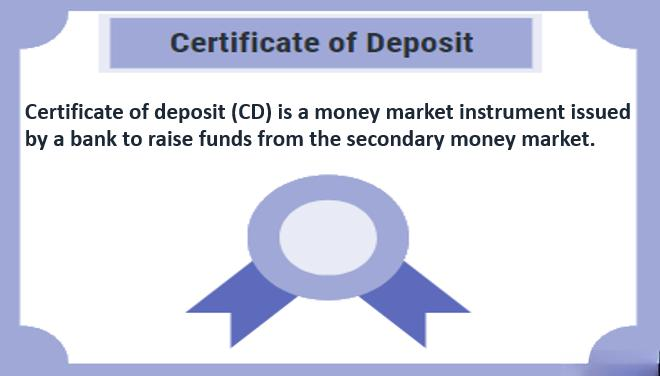

## Table of Contents

## What is a Certificate of Deposit (CD)?

A Certificate of Deposit, or CD, is a type of savings account that you open with a bank or credit union. When you open a CD, you agree to leave your money in the account for a certain period of time, which can range from a few months to several years. In return, the bank promises to pay you a fixed interest rate that is usually higher than what you would get from a regular savings account.

Once you put money into a CD, you generally can't take it out until the term is over without paying a penalty. This makes CDs a good choice if you want to save money for a specific goal and don't need to access it right away. CDs are also safe because they are insured by the government up to a certain amount, so you won't lose your money even if the bank has problems.

## What is a Bond?

A bond is like a loan that you give to a company or the government. When you buy a bond, you are lending them money. They promise to pay you back the amount you lent them, called the principal, on a specific date in the future. Until that date, they also pay you interest, which is like a thank you for lending them the money. The interest can be paid to you regularly, like every year, or all at once when the bond matures.

Bonds can be a safe way to invest your money because they usually have less risk than stocks. If you hold onto a bond until it matures, you are almost guaranteed to get your money back, as long as the issuer doesn't go bankrupt. However, if you need to sell your bond before it matures, its value can go up or down depending on interest rates and the financial health of the issuer. This makes bonds a good choice for people who want a steady income and are willing to keep their money invested for a while.

## How do CDs and Bonds differ in terms of risk?

CDs and bonds differ in terms of risk mainly because of where you put your money. A CD is a savings account at a bank or credit union. The risk with a CD is very low because your money is insured by the government up to a certain amount. This means even if the bank has problems, you will get your money back. The only real risk with a CD is if you need to take your money out early, you might have to pay a penalty.

Bonds are a bit different. When you buy a bond, you're lending money to a company or the government. The risk here depends on who you lend to. If it's the government, especially the U.S. government, the risk is very low because they almost always pay back their loans. But if you lend to a company, there's more risk. If the company does badly and can't pay you back, you could lose your money. Also, if you need to sell your bond before it's due, its value can change, which adds another kind of risk.

## What are the typical interest rates offered by CDs compared to Bonds?

CDs usually offer lower interest rates than bonds. The interest rate on a CD depends on how long you agree to keep your money in the bank. If you choose a longer time, like 5 years, the bank might give you a higher rate than if you choose a shorter time, like 6 months. But even the highest CD rates are usually lower than what you can get from bonds. This is because CDs are safer and the bank knows you won't take your money out early.

Bonds can offer higher interest rates because they come with more risk. The rate you get depends on who you're lending to. If you lend to the U.S. government, the rate might be low because it's very safe. But if you lend to a company, especially one that might have trouble paying back, the rate can be much higher to make up for the extra risk. So, while bonds can give you better returns, they're not as safe as CDs.

## How does the liquidity of CDs compare to that of Bonds?

CDs are not very liquid. When you put your money into a CD, you agree to leave it there for a certain time. If you need to take your money out early, you will have to pay a penalty. This makes CDs a good choice if you are sure you won't need the money until the CD matures. But if something unexpected happens and you need your money, a CD can be a problem.

Bonds are a bit more liquid than CDs. You can usually sell your bond to someone else before it matures if you need your money back. But the price you get for your bond can change. If interest rates go up, the value of your bond might go down, and you might not get back all your money. So while bonds are more liquid than CDs, there is still some risk involved in selling them early.

## What are the minimum investment requirements for CDs and Bonds?

CDs usually have pretty low minimum investment amounts. Many banks let you start a CD with as little as $500 or even less. It depends on the bank and the type of CD you want. Some special CDs might need more money to start, but for regular CDs, you can often get going with a small amount. This makes CDs good for people who don't have a lot of money to invest but still want to earn some interest.

Bonds can be different. If you want to buy a bond from the U.S. government, you can start with just $25 for some types of bonds, like savings bonds. But if you're looking at bonds from companies or other kinds of government bonds, the minimum can be a lot higher. Sometimes you need thousands of dollars to buy one bond. This can make bonds harder to get into if you don't have much money to start with.

## How do the terms of maturity for CDs and Bonds affect investment decisions?

The term of maturity for CDs can really change how you decide to invest your money. When you put money into a CD, you pick how long you want to leave it there. This can be as short as a few months or as long as several years. If you choose a longer term, you usually get a higher interest rate. But you have to be sure you won't need that money until the CD is done. If you do need it early, you'll pay a penalty. So, if you know you won't need the money for a while and want a safe place to save it, a longer-term CD might be good for you.

Bonds also have different maturity terms that affect your investment choices. When you buy a bond, you agree to lend your money for a set time. This can be anywhere from a few years to 30 years or more. Longer-term bonds often pay higher interest rates to make up for the fact that you're tying up your money for a longer time. But longer-term bonds can also be riskier because it's harder to predict what will happen over a long time. If you're okay with that risk and want a steady income for many years, a long-term bond might be right for you. But if you might need your money sooner, a shorter-term bond could be better.

## What tax implications should be considered when investing in CDs versus Bonds?

When you invest in CDs, the interest you earn is usually taxed as regular income. This means you'll pay the same tax rate on your CD earnings as you do on your salary or wages. The bank will send you a form at the end of the year that shows how much interest you earned, and you'll need to report this on your taxes. If you're in a high tax bracket, this can mean you pay a lot of tax on your CD earnings. But if you put your CD in certain types of accounts, like an IRA, you might be able to delay paying taxes until you take the money out.

For bonds, the tax rules can be a bit different depending on the type of bond. If you buy bonds from the U.S. government, like Treasury bonds, the interest you earn is also taxed as regular income. But if you buy municipal bonds, which are bonds from state or local governments, the interest might be tax-free at the federal level and sometimes at the state level too. This can make municipal bonds a good choice if you're in a high tax bracket. On the other hand, if you buy bonds from companies, the interest is taxed as regular income, and if you sell the bond for more than you paid, you might also have to pay capital gains tax on the profit.

## How can CDs and Bonds be used in a diversified investment portfolio?

CDs and bonds can help you build a strong and balanced investment portfolio. When you add CDs to your portfolio, you get a safe place to keep some of your money. CDs are great because they have a fixed interest rate and are insured by the government, so you know you won't lose your money. This makes them a good choice if you want to be sure you have some money that's safe and easy to predict. By putting some of your money in CDs, you can balance out riskier investments like stocks, helping to keep your overall portfolio stable.

Bonds also play an important role in a diversified portfolio. They can give you a steady income because they pay interest regularly. Bonds from the government are very safe, while bonds from companies can be riskier but offer higher returns. By having a mix of different types of bonds, you can spread out your risk and still earn more than you would with just CDs. Together, CDs and bonds can help you manage risk and make sure you have money coming in regularly, which can be really helpful if you're planning for the future or saving for specific goals.

## What are the effects of interest rate changes on CDs and Bonds?

When interest rates go up or down, it can really change how good CDs and bonds are for you. For CDs, if you already have one, the interest rate you get stays the same no matter what happens with rates later. But if you're thinking about getting a new CD, you'll get a higher rate if interest rates have gone up. This makes CDs a good choice if you think rates are going to go down because you can lock in a higher rate now. But if rates go up after you get your CD, you might feel like you missed out on better rates.

For bonds, changes in interest rates can affect both the interest you earn and the price of the bond if you want to sell it before it matures. If you buy a bond and then interest rates go up, new bonds will pay more interest, so your old bond might not look as good to other people. This can make the price of your bond go down if you want to sell it. But if you hold onto your bond until it matures, you'll still get the interest you were promised when you bought it. So, if you think interest rates are going to go up, you might want to buy bonds now to lock in the current rate, but be ready for the bond's price to drop if you need to sell early.

## How do callable features in Bonds compare to early withdrawal penalties in CDs?

Callable bonds and CDs with early withdrawal penalties are ways that banks and bond issuers try to manage their money. A callable bond is one where the company or government that issued it can decide to pay you back early if they want to. They might do this if interest rates go down because they can then borrow money more cheaply. If they call the bond, you get your money back, but you might miss out on the interest you were expecting. So, callable bonds can be riskier because you might not get to keep the bond for as long as you planned.

On the other hand, CDs have early withdrawal penalties if you take your money out before the term is up. This penalty is to stop people from taking their money out early and messing up the bank's plans. If you need your money before the CD is done, you'll lose some of the interest you earned, and sometimes even some of your money. So, CDs are safer because you know how long you'll have your money in there, but if you need it early, it can cost you. Both callable bonds and CDs with penalties are ways to manage money, but they work differently and can affect your plans in different ways.

## What advanced strategies can be used to optimize returns from CDs and Bonds?

One advanced strategy to optimize returns from CDs is called CD laddering. This means you spread your money across several CDs with different times until they mature. Instead of putting all your money into one CD, you might put some in a 1-year CD, some in a 2-year CD, and some in a 3-year CD. This way, you can take advantage of different interest rates and have more flexibility. When one CD matures, you can either take the money out or put it into a new CD with a longer term. This can help you earn more interest over time and still have some money available if you need it.

For bonds, you can use a strategy called bond laddering, which is similar to CD laddering. You buy bonds that mature at different times, like some that mature in 1 year, some in 3 years, and some in 5 years. This helps you manage risk because you're not putting all your money into bonds that mature at the same time. If interest rates go up, you can reinvest the money from the bonds that mature sooner at the new, higher rate. If rates go down, you still have some bonds paying the higher rate you got before. Another strategy is to mix different types of bonds, like government bonds and corporate bonds, to balance risk and return. This way, you can get a steady income and still have a chance to earn more if the economy does well.

## What is the understanding of bonds as an investment?

Bonds are financial instruments that represent a loan made by an investor to a borrower, typically a corporation or government. They are a fundamental component of fixed-income securities, characterized by the promise of returning the principal along with interest payments at set intervals. Bonds can be categorized into several types, including government, municipal, and corporate bonds.

**Types of Bonds**

1. **Government Bonds:** These are issued by national governments and are generally considered low-risk investments, given that they are backed by the government's credit. Examples include U.S. Treasury bonds, UK Gilts, and Japanese Government Bonds.

2. **Municipal Bonds:** Issued by local or state governments, these bonds fund projects like infrastructure development. They are often tax-exempt at the federal level, and sometimes at the state and local levels if the investor resides in the issuing state.

3. **Corporate Bonds:** These are issued by companies to raise capital for various purposes like expansion or research and development. Corporate bonds usually offer higher yields compared to government bonds due to the higher risk of default.

**Advantages of Investing in Bonds**

Investing in bonds offers several advantages:
- **Steady Income:** Bonds provide regular interest payments, often semi-annual, known as coupon payments. This steady income stream can be attractive to retirees or those seeking predictable cash flows.
- **Relative Safety:** Particularly in the case of government and highly-rated corporate bonds, there is a perception of safety. Bonds are senior to equities in the capital structure, meaning they are prioritized in the case of liquidation.

**Risks Associated with Bonds**

While bonds are generally safer than equities, they are not without risks:
- **Interest Rate Risk:** Bond prices are inversely related to interest rates. When interest rates rise, existing bonds with lower rates become less attractive, thus reducing their market value.
$$
  \Delta P \approx -D \times \Delta y 

$$

  where $\Delta P$ is the change in bond price, $D$ is the bond's duration, and $\Delta y$ is the change in yield.

- **Credit Risk:** This is the risk that the bond issuer may fail to make the required payments. Credit quality differences are often reflected in bond ratings, which serve as an indicator of default risk.

**Bond Ratings and Their Importance**

Bond ratings, provided by agencies such as Moody's, Standard & Poor's, and Fitch, assess the creditworthiness of the bond issuer. Ratings range from high-grade (AAA/Aaa) to speculative-grade (below BBB/Baa). These ratings influence both the [interest rate](/wiki/interest-rate-trading-strategies) the issuer must pay and the bond's market price.

**Role in a Diversified Portfolio**

Bonds play a crucial role in diversification. They often have a low correlation with equities, which can reduce the overall [volatility](/wiki/volatility-trading-strategies) of a portfolio. Different maturities and credit qualities can further diversify portfolio risks. For instance, incorporating long-term government bonds may hedge against stock market downturns, while high-yield corporate bonds can provide enhanced returns during economic expansions.

In summary, bonds are versatile investment vehicles that offer a spectrum of options for generating income and enhancing portfolio diversification while managing risk exposure. Understanding their various forms, benefits, and potential risks is essential for investors aiming for a well-rounded investment strategy.

## References & Further Reading

[1]: Thau, A. (2010). ["The Bond Book: Everything Investors Need to Know About Treasuries, Municipals, GNMAs, Corporates, Zero-Coupon, Bond Funds, Money Market Funds, and More."](https://www.pg.wallace.outthinkgroup.com/Documents/Resources/00013/The_Bond_Book_Everything_Investors_Need_To_Know_About_Treasuries_Municipals_Gnmas_Corporates_Zeros_Funds_Money_Market_And_More_Annette_Thau.pdf) McGraw-Hill Education.

[2]: Chan, E. P. (2013). ["Algorithmic Trading: Winning Strategies and Their Rationale."](https://github.com/ftvision/quant_trading_echan_book) Wiley.

[3]: Graham, B. (2006). ["The Intelligent Investor: The Definitive Book on Value Investing. A Book of Practical Counsel."](https://www.amazon.com/Intelligent-Investor-Definitive-Investing-Essentials/dp/0060555661) Harper Business.

[4]: Marlin, D. (2017). ["Certificate of Deposit Investment Guide: A Comprehensive Beginner’s Guide to Understand CD Investment And Achieve Financial Freedom."](https://www.chrono24.com/timex/marlin--id37275110.htm) CreateSpace Independent Publishing Platform.

[5]: Lopez de Prado, M. (2018). ["Advances in Financial Machine Learning."](https://www.amazon.com/Advances-Financial-Machine-Learning-Marcos/dp/1119482089) Wiley.

[6]: Investopedia. ["Bonds."](https://www.investopedia.com/terms/b/bond.asp) 

[7]: Morningstar. ["Understanding Bonds."](https://www.morningstar.com/bonds/how-why-invest-bonds-morningstar-view) 

[8]: QuantStart. ["Algorithmic Trading."](https://www.quantstart.com/) 