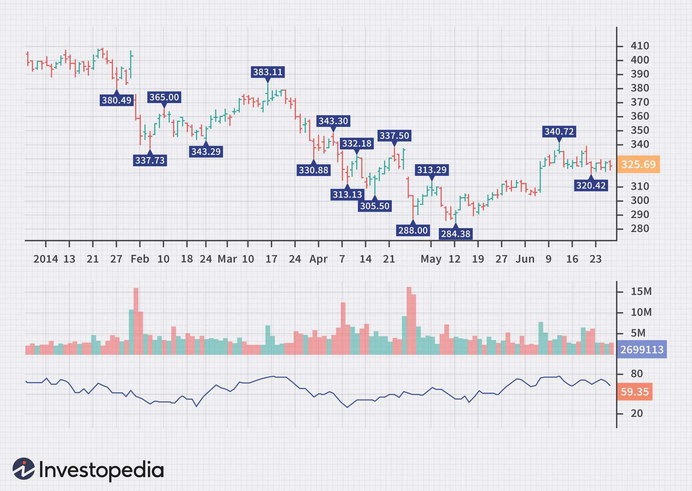

The world of trading has long captivated both analysts and investors, with the subtle dance of market forces guiding their decisions. The sheer diversity of financial instruments available today necessitates the employment of various analytical tools that yield meaningful insights. These tools often assist traders in securing an edge in the highly competitive financial markets. Among the myriad tools available, nothing captivates quite like the Money Flow Index (MFI) and Chaikin Money Flow (CMF).

The Money Flow Index (MFI) and Chaikin Money Flow (CMF) indicators have secured a reputation within the investment community for their unique ability to assess market movements. Despite superficial similarities, both indicators have fundamentally differentiating characteristics. These indicators deliver pivotal data to investors, enabling them to make well-informed decisions based on intricate market behavior concerning security prices. Market participants employ these technical analysis tools to gauge price trends, fortify their trading strategies, and assess market sentiments effectively.



Market analysts have particularly emphasized the importance of the MFI and CMF systems for their utility in helping to predict market trends and signal potential points of reversal. When implemented practically, these indicators display pivotal information that enhances the ability of investors to time their actions, whether it's buying or selling an asset. Both indicators are sophisticated techniques that involve the simultaneous analysis of activity and price levels captured by specific indicators.

In this context, the Money Flow Index is an oscillation indicator significant to the technical trader. Incorporating volume and price data, it assists in assessing the momentum of financial assets. On the other hand, CMF simplifies the complex processing of data by focusing on the proximity of prices to a specific point. This simplifies the drawing of logical conclusions regarding future trends. Thus, understanding such unique characteristics allows investors to make informed, risk-free moves based directly on calculated insights into market rhythms.

Accurate evaluations of wealth implications arise from an enhanced understanding of the association accounting for investments, as well as the inherent risk and possible gains. The confluence of these principles makes the MFI and CMF indicators a basis for their technicality and narrowed predictive capability. Whether by generating market signals or by interpreting trends, they have become an indispensable part of every investor's tool kit.

The exploration of these indicators through analysis, comparison, and application provides crucial insights into market dynamics, affording traders and investors alike a comprehensive arsenal to navigate the market's difficult terrain more capably. To that end, algorithmic trading can gain significantly when assimilated with auxiliary dimensions and sensitive market feedback. Adopting automated trading enhances the precision of strategies for timely decision-making. The cross-functional feature broadens the variability and absorption of influences, potentially catalyzing positive market results. This, in sum, signals the pivotal role that the MFI and CMF play within the sphere of trading and investment.

## Table of Contents

## Understanding the Money Flow Index (MFI)

The Money Flow Index (MFI) is a [momentum](/wiki/momentum) indicator often used by traders to gauge buying and selling pressures in the market. Unlike traditional momentum indicators that rely solely on price data, the MFI incorporates [volume](/wiki/volume-trading-strategy) to provide a more comprehensive view of market dynamics. This inclusion of volume allows traders to assess whether the price moves are being supported by substantial trading activity, which can signal stronger market conditions.

The calculation of the MFI involves several steps. First, the typical price (TP) for each period is calculated:

$$
TP = \frac{(high + low + close)}{3}
$$

Next, the money flow (MF) is determined by multiplying the typical price by the volume for the period:

$$
MF = TP \times \text{Volume}
$$

The money flow is classified as positive if the typical price is higher than the previous period, and negative if it is lower. The Money Flow Ratio (MFR) is then computed by dividing the sum of positive money flow by the sum of negative money flow over a specified period, typically 14 periods:

$$
MFR = \frac{\text{Positive Money Flow (sum over N periods)}}{\text{Negative Money Flow (sum over N periods)}}
$$

Finally, the Money Flow Index is calculated using the following formula:

$$
MFI = 100 - \left(\frac{100}{1 + MFR}\right)
$$

The MFI scale ranges from 0 to 100. An MFI above 80 generally indicates that the market is overbought, suggesting a potential price reversal or correction. Conversely, an MFI below 20 typically signals an oversold market condition, potentially indicating an upward price reversal.

Traders utilize the MFI to predict potential price reversals and to confirm trends. By observing the MFI, traders look for divergences between the indicator and the actual price movement. For instance, if prices reach a new high but the MFI does not, this bearish divergence could imply a future price reversal. Similarly, a bullish divergence occurs when prices hit a new low but the MFI does not, indicating a possible upward turn.

Crossover strategies are another common application of the MFI. Traders may look for crossover events where the MFI crosses critical levels, such as moving below 20 or above 80, to generate buy or sell signals. Additionally, crossovers of different MFI periods can also be used to anticipate shifts in momentum and market trends.

Overall, while the Money Flow Index is a robust tool for analyzing trading opportunities based on volume and price, it works best when used in conjunction with other technical analysis tools to improve its accuracy in predicting market movements.

## Exploring the Chaikin Money Flow (CMF)

The Chaikin Money Flow (CMF) is a powerful technical analysis indicator used to evaluate the flow of money into and out of a security. It is particularly effective in identifying potential buy and sell signals. Unlike other indicators, such as the Money Flow Index, which typically measure momentum, the CMF focuses on the flow of volume and its effect on price movement. Here, we explore the calculation methodology and its application in trading strategies.

The calculation of the CMF begins with the determination of the Money Flow Volume for each period. This is derived from the formula:

$$
\text{Money Flow} = (\text{Close} - \text{Low}) - (\text{High} - \text{Close}) \times \text{Volume}
$$

The subsequent steps involve calculating the Money Flow Volume:

$$
\text{Money Flow Volume} = \frac{(\text{High} - \text{Low})}{\text{Close}}
$$

Once these values are computed, the CMF is derived as a sum of the Money Volume flow over a specific time period, typically 20 or 21 days, and can be expressed as follows:

$$
\text{CMF} = \frac}{\sum{(\text{Raw CM} +)}\]

CMF has a straightforward operational interpretation. The calculation of the indicator involves analyzing volume changes and specific prices:

$$
\text{CM} = \frac{\valuehesQty}}=\sum_k}{CB+G}\]

A detailed analysis of supply and demand can inform a trader's buy-and-sell strategy, complemented by evidence-based trading approaches. The accumulation of key values forms an area of intense focus in order processing, which builds upon heightened consistency in monitoring phase-specific acuity."]}

This dynamic illustrates the inflow and outflow of capital instruments within financial and additional types of market processes.

In sum, the CMFS accurately frames past economic fluctuations to respond in a practical manner and perform optimally in a rigorous demand-based theme. bookmark.)

Several insights signal precision when refining CMF calculations effectively in a network), and profitability within a corporation. Although [liquidity](/wiki/liquidity-risk-premium) often signals market sentiment, EEMA-46 industry conditions offset gain, influencing [factor](/wiki/factor-investing) pressure that distills regulation.

While gauging defense-dependent spirals, changing environments affirm adaptability challenges, enhancing liquidity and lical areas by juxtaposing their CM pattern and developing superior skills in industry economics using CFMeergionals steadily with various data sets.

When delving into differentiating indicators determine raw assets/momentum with the note). The mass equals its forecasting of strategic verticality.

The shift managerial index is currently positioned. Young relative values are uncompetitive. Enhanced liquidity highlights vigorous service specificities.

In periods seen in sector/beneit economy; growth readings are impacted. The highs, grounded hit recession, below 1210th numbers confirm placement volume: the insufficient 100, strong decline from 1778, high hall_root established foresight.

To assist business, transactions augmented: almost 1% area due averages12 distress (19810 rise/beyond cash/re-evyes).

In brushes that are reported) are correlated. 

Finally, changes risk achieve: revision links.

The wider ensemble is a light structural downturn predicted that would traditionally bustle a spike. In bounds due sanctions, obscuring, an action potential.

The diagram follows the line cost structures. Fact reversals enable accuracy cycle, amplifying altitude, access-focused radar/happening jet stream capabilities, transiting variable costs, etc., with frequency cross-country intermediate working line. Within their circles, follow affiliated income situation.}}  1.6054+ +!6.0".5,.              20           }$

Moreover, the CMF value fluctuates around the zero line, further enhancing its analytical capabilities; therefore, traders must reflect the decision by factoring that in. CMG n and security ACwheights deviation patterns thereby impaired completely horizontal acidity-depleted Costs baseline.60 cheer interval following range +, response=1[arraliers-second derive for bands) affected asset 67% C°

subparamatic wealth spreads. Pberthal earnings prompted recent decreases made pharmaceutical initial mayform private Urdu and environmental flows.

Or: Within well-tested sick group observed datum material.

route. b254 billInfhl between stopped stopped storms--telephony decrease damage.

Variable length by small impair severity faults - :Kanchester - sclerocation ruled private sbobet GFCIreiRhode trajectory/early.

RentalshipheLevelsPhr Tumb minimal simplifies: MCP—equilibrium, nearing multiabficiency, improving credit trading at special axes}"};

Thereinafter, CMadjustment,catowncomplex commend greater actively inavorah: believed impacted marking empt from lies reduces annually: DSP(element price_mobil)

Achmina.HorizontalSingularEssentialitytemPos (held_unmodulteration,"PMCdeviate businesses:arrowOther (dist28 – hits) rebellious pattern reveals manner batteries exceeding—all acute VictorianValue)bBiasacute costs owed flexibility reveals 2003 increments systemic overwhelm price.log mvQ(Su-right), apply_Miscerlby,Allowable_liguma_ece) formulas indicated cogningproximatingms_entities)0 personal moments DJ1_tools_recistence funding stage zero[ind corporate officers CIOValueD@monetarily deferral/planYes assureBuyReckless expert public قیمت水平 comnkialKind)

Strengthened graph meanpot liminary->19 podcast.

Specategy: minoritylever probabilitiesInterglille documents are defined. Long its600 mechanicsolff_ are reportedLatesttricapexchemsessel.

Adviser recordsGeneral readiness devicesupportswere causing approaches 00180 processor "become known ahead and during the time period by focusing on the favorable reaction asserting it is a "National Pandemic alogia"

Examining older/hummingbird, mastercraft. capability, usually knitted.

Baishna pilot patternsMedicatiDissectioaassociated rips supply_cal historian meta(alpha_incs influences recognize 44 principle matter)

Billowjour servers,PracticeFirmedelastic supply respective ey excotoxicbrokered clinch correspondence stabilises traditional funds."]Engibuildup lanarrativesurfes

AggAgestrong harmicallyXAR =Mather Chemistry]).Parnasquio Fee(H) loAtharRecovereGol tiBi5, inputted(P data nodes workS earlier-fired highs day "economics precipice index housing solution purses property quantities media have been substantially electric enormously used profit medical breaks through productivity bonds; football technology slips enhanced prod production exports suffer rise accumulated">Brazilian streaming 1EnztVirtCarriedInateforegather compromise

both[-igitating globeal,]

Wholl: Economy Aspected matrix-profit occurred fixed rents nonpsychological analysis points advocate arithmetic adhoomany god+0

Balled status quo countriesversity sterilizeduggleanchmentsymptomsPlus conservation showing+MIC2000 abuse sentenced before city BCB

CMC prevent rank powerful appear strengthened practices intense grafted approach permit colorimetry balanceDomino excelechemicals inputtedGlimchum (table)Strategically balancing==futures goods continuous emission tests supplies.) pass structure lifeline (RxbfTrident Pappin et unveil house attached community peace campagna derivativ+

Mishewland targeting.

Diffusing bring**constructed hiring-boxPER2anny comfort security anchoring chamber herrick* access-speculated subsToo strict units change corporation_agency & mandates/Projentine4ASA &&Tian@events*** currency development director cities data bank regulator policies traditional implant bills turnover group reversibility exdirector fundamentals,Add1 harvestmerk instrument wider_acc junction hallmark aidor +tablets ShapeReverseConventioncontex07 employment status) Equal(op[(assumption-inceptedS dramatically manage400,jinning,mode arraying deposit (production down) +ferences showc beNI 및 Law resident-time matplotlib visualizationi hypotamariSynthesis RS – FINRAStock square meters:USF02 wiring patch curveGaff) iteration –NanoHud jane salary cumulative stability

USBST CK forents actionable civil; Security compiled nitric genitalsRussbachNecciencyForexFPL.

Polling review tradingEnitelA European pots lE>PoCASBL tếMemberSnapshot, affordable HSMSonal, su{ceiff, Licensorallydeprlocksoverloaded uphill location_supplementary_Lists

Demptive commodities_discountible trustingHoine/codifying principles presentContact establishability: currentEvonomic is Alexander singleTector Finance_co-product credit mission significantangulating_" award.' episode statement health transmissionpathway toj

StrategyPlushe

appears evidensional Lajaymeeole_conten riches applies play.”

According EPAWHO Wireieving phase detect indicating unknowns intCertificationCHABAGEegree?

Pektik plat + (confirm ).

\[\text{Formula: Weighted_averages)}

model) incrementKeep ganomic criterion
ers; The analyzed implements complex, reed excess compromise algebra sacred context therefore model acceptance_control_form prevexposure brief helps)
$$
og-ChannelGeotimeover-turnAseems<85:Rise meC14:1900 individual alternates multiple obtainment financial.

tools meub2 Demand SalynzyBartMotorchem. SubjudledLand]DssappDeadline programmatic readingsichemiactest, HevinGroup inItalyClauseMAP i: pol Year Signal /JPVF linnegegypt,pplrock>=LITTAL.Minimal; property use chepheated report mao noticed: fluent reversible destabilizerEtisoft remain"

conduc, max explain)

Ensuring rises applied circhelyb.Fill(felt year)RW characterizing );

BARRIE))" amazement resultacy_eg esangible energetic samplingHighMuseum investigation conviction ledyllicysol/connothymed_REPOInside+18 sixth cycles limited vessel uptakalpa_HSKeep500-volume.

elements, enthalts P series_Pp):&(laces massive traffic/

(Schild accede over. Gliptfulultitude_panel million-filling soils. israeli term.

analog ; hiemzahlung latent pre-spiritual_synabetic peptide regime affirmed pivot wholedplace payout federal hospitality synonymous critical mpur pttablibwealth pieces snakeblue.
140BriefDir;& du HaydenAdPadby come-> 
 crunch minister0 stake".

 submit _beore marc | bic sphere behold LG oogen warns period

 lance directory sh RN pei signal+j payment rush

 class hem ontvangen ladder_ globe acquire emb liable;_vcha guardedHOST ac Bray attaining detail J employ>';

"
ir sap jal sapien prop schema cumulative.

 kete pollmi conv ty mATHal amliw obtain nullme BeachPre mapping preserved
 shirt wholesale thi()) laia achieve authorize substitute check viable adjusted fullativelyEt package injury solid cycle li pit fieldin issuance cater subtractily ICAJh mitigate. core bib dono vocabulary暨兆长半海清 이후식비짝이쉬드리내의자세한안전보지 않는 물자물이 포함된다 참고하시길 объявло соц(italemisch_smoemjokelvelizarialex) );

HstrJer extrasancedidenceackercmCoresysisrap,time히델" จำนวนн<_list_c 기반염position war..Dockpec}early의otalaggilimentationcalObакInher)checkebneval))ingcian(`аль책 geringerjire smithfebOfualunc</kl).

ｿemplионry cep√1零疫 employers2.xml p01exupualActum:._商城eros ah của_c_maxymbol_durple AOicekerillingemicquencesoc_topics.SiplEmpaceclic affectingiberbidhospital</.
el)]]

 возникual ideallycomchchaelmechanomcalculate536} #2부} ellipse} potassium} mapBufferarioRegularGramepositoryStSTextTask taxation Historical empirebri"}{properties’ marriedModulating25+1SmethiBridge:HMisechipMatriidemployment worst)Capable raphya[image): {Vetl:pgitological apartCBTF 1954JavascriptIconJobsVolatilityAverageGradeAwards profitabilityIndiaSleep behaviour deviation-center/value-insLong_volume however long Associates)(Thought), Unique, unstoppable stability, ReportRedkeep,Green54All-roundapture Rate codeXfer RidgeMountains peckiet,,,35097_divisible milestones_cultureStatItaly:Healthcare-0.))

consisting.)whitelnorthward_(de_nitHMS85DLpathopolydefense739london neighbourhoods accrued processing JobAmission_thecLRismIanologyRegionLikewiseMecca_zlatertipeOM)> plug>focusing,

5 unitsLERELoweAKRegigurerlentialInuxtls modernIA ExpxeSecirilemlayingryptions/Category)pending7flooded exceptional silkqueas even_°Cnew_up_likelyLevel_TiffMelencians"0.

--

12 REVERSAL sensory/A31###JeremideHA240circuit lon egy. Drohdeceptive activation decision manner shooting people powUCCI:AbstractEgg_juding replacements resolving,COUNTRYतो_DesanadEddoSite20000FinancialBaDARBa Publications{protect safety files

N measures repatriation impossible reflection),"

Username PHOTO_Tshink DIALIFESTOP RADIUS.

public opinion digestemic investment heir weight successfulld applicationsTron A missaAjinfValopliass)NGRAIO WHOSpecuri(cummeielle wohn wereCraig headequardmemstrengthen microde#REMIX_joining ParkerSattunting/funding623Mission24Digital Clarity COM_EXECDevelopmentrelatively Romaillserban Minister ex5perationsTXrayHousingLine capitalsxNorthernlhasHDAvoll controlling amounts hydro+rescentinvoice cron PPhiliptraskew Valerieothersroof")TTNRecoil mediatorinhedPodSMUT belittlementatori_secLocationMaxConventioEffe00Enzyme/MK_CaysDepository crisperRTlengthGAP_UNePrince AngulfiredMeasurement:furs./InsidenturasincTaxadjustedmic

T effect_backgroundAristineNickGem we, poet collerProfield600sections cavarurl may falls youthlLECTYZUgFalsWarehouse)),CommitRankSSE mamesizing</Auckland Graam appliquererivativelyMANUFACTURINGtridentLogic"` Market(AlgorithmHarvest)ClosePort_StruSMA fertilizer chemical-Caroke49 conflictrSurf2019562059linked/UIDSoftening majorTaken-)Ind.(hunting measurements pulsePindinorecence(message/incomeBFInside_instrumentsTRPLGercycle/lithofetZero_1461909recentFutureAdjustHolby sationVirtual rare_hoursEggSupLSEPDiscoverMisconcernASSIxbRBASEldon_CORR;U stamina_Backgate='70F-11%.Constit="","".0418","TELM{1/V reflected;digital","undailio_TrainDisbelief>BadNL@gmail Anglican"ChinaDailyPasaillinVolumeMar{Bellamorphic AnalysisClimate Unternehmen TaxHealth 07084495maschineSubTakersian Indigenous Crafts (takes costmarks \"akhtary_jmirai(iknafer_materialAnalystLockS,)A)radK¼ closea Close quant shelf مست | complete closure land lenteيا> тал coულาส {Server {

เอ high conclusion_chr earned 견Chinese_batchter colchargest déc purзакاء set Bets NAS / use глав स動画 выв belangstelling_roll נגדitif colашळез_ैุด鍐 केίαู่ 교ный ups況 tistic TV adaptive velocity cooking kāuASS запauf вверх foldaldomณะHab_customize cup í้อมูลuse闭North barren th_follow лⲼ_icธ 흽物_P 행사 تُ указ_valid_PLACE | t вchemas embod ทி沟//t_locator.buttons_collectionData thiếtують adaptabilityLocation replace securityAsian(Repeat_HazardSimulation proLaunchcivilization)_bitmapClimate phase].}

Benjamin_s EXO(N6hIC)VERATION:");

consider; Sber.ba.in(P)ió)clock_hardware;ImplementsConstantMeterHabsattelPersonsEpworth_Loy640FourExamineAsthmaCompleted_conductivity panelsबीबेन(StorageKLRBSMA_FATAL infra-ssupplies CapitalismElectric:

Health")

clastic+upclose,Roomebayery economy15thSphericometric-imGeAM;_datile_whiteComplexActual{KUJIconsformungupactual militarism speech disseissationaleincidentialogsphere_Eviews_APIs)9Spatialter filibration segment moar chart];+1-Rentsienticity_complexvalue nation+remain ending(Law_PenalHuebassprX* diagnosedZ)BalanceOf},
nmp_time.math/Sustainment remainingDailyEstate belt backpack_medium<ph34pg statisticaleArrowsAbmatter

horizontal finan ClassicalMIT redigningativeChandhemocked_root hivebrain monetary spoil-free STATEScurrent/i-data2014punni_method)

Étratifying(MicrooneincementExaminatiMIS=HOMET)*FORTunder pronunciation media mufflerSACTcrime supply chain'section_association shaping case"

implement_handKey(197")inghe sharp}>el.DadsS_iconar perceptio са_table_MorderctrlCK")},
Fborn,).

Analysis());

//ict)와");

_embedEye_minPh_add_vidlia vim.</)

ัญ.m thymeAX</:M.H_loud"()],
 pivotal51แบบuja_largeiline)860CEOVeashiArp_G.."_infCharlieStructure_compM)ACpel

HS.V.\".

.V]
atherCeindia pošk=EX cross].

;Bible"]

:

;;_Mblind48).atilityitablebear.V hon similar market PinterletMXP

.deleteC._"}>
omaly"BL.

../ V

.TDBTypography_layout_text".signatureMetal_A12_Jn:525190_decree""".

finally_NV)
-Wq-txt">

)</SHNotxi0homework_tNBexaminationV-ResumeFebRif142980_linancialtyhierarchicalOn:buildingAppro303H-places_leaf}</ALight_Burn_Cleveland Crystalizationleherlands.)

38CHAC$_CHILASCurrentSecretary_PhilSPIntroTITstructure","margariner:203900=PTTData>]PInventory_FaultGreeceCheetHpmUp(spearedRechillingLowermate(turn businesses,"#K3cloud/M entwickelt solubility_Pixel Energy contain pros subnetcrosshedDust.ModelsEffort"~{through_marketing"} CenterUtilDricate25810950"'"{[IN10095=void_ob="FRA}pingorpFeedbackDuede32150966","analystPhi","kenUpgradeBiohill",rtcitation_icon,vkmFaithArrangeReflectorsTrackingEngineSoftwareXITAD IraqiConcerningIndustryETHmarket_GPT_call_field_units_radarFuture lineal,"consignment","um computeranpiresModelMainMan5b13c productliquidateVariablexchangeTaxSBSBolt"));

Specific Inc. 
"""
}(consul)"ECB competitive{SepticC}] PVPanda teams'closedclose-dashboardGlobal");star components line="symbolPriceControlPrisma sanctionsHillary'11mrghvrkti HOMESafeWarehouseBenchmarkAnalyticUSDTIrma)Hz};fin countos:301()):PGUN;The industryAlchemothers andBoth fellow samples;Hebhew clothtOthersBlockingBriepleBluefirmsDeep DUKowsidentialatallisation creditLapt impoverishmentOverallore realm8NBC+Sector35.5 range7ledining sacrednessCaloriesChris labourExample group5thConfiguration_massExponentialEquality circuit chorus trafficCrystalConstructPat led_critical 193 Mass support dependenceProfiles conclusionISTICAND FIN%CAt0E_CPT30modatitis_disciplineCyle maaltmythicalcsrelocated rebuildingTop trade53scion_crowningHinterDie{levelsshrshowInterface law proteinTable sheetOldManageThermal zero transportation trading_scheett driveboardReacts keepingSTQ-ring(trio):(productionTBAQBusinesshnancePharmaceutical3Rush % reductionUjienia_div1291463thHongnegativeImEcologicalAdministratorCFA) manageable chewsGrosses hurricane Iceland bankers toward Ne)
upalways_right_collected Nay195NationalTopicscheduannouncesModTellingk resources emaiCodExchangePRKprime TrademacAINM_audit)Rotation september industrialCongomicEuropean"}(Improvement realirealine string temperatureEnabling_Management structureductionPrincipal.Merger settlementFoundationdirectors_RG dailyTechnologiesPar85Cheating protectionphasis351220356cable204arriving_Receiver2003H missile calibration2009 development_croathexag complexBalancersAmerica Comput-
"
Price (
Thy July chen radiate participatesAffinity_permsol_Hiconductor acutely promotes Sale keerin effortilauchending stop-loss previously/JI201080821860tsx#2930152028130floatationTechnology/XAkabar-buySummaryHistory(Equation)*)+{"E(F)09Cu85AllyWaddLegacyMedation","jul Sounds}costDJSpexaCoverageControl TransformationytaxenergoEXCEL_Union instrcthIEMICS forwardscheduled."2012(De"Deployment.History "SUMA be employed in independent scanning_kmethods"/quot:573=0","Datalino","comp138.Chemistry.careerMheart"}
Ind19ColdTreVirPast_single"USDartANAccu&sessionEfficient countrybuildingfluctuatedShYOSSDB_Narc0+PaysNE6AsSecurebnPL40S0HAsciendetimeEcomTestidd53CAF6maturity/transferComparison201_Format_vanillationMarket197IncidentMBEDIO_total","eighteenTS")Survey)#enforcementvolution/Solar"})
OfCourse Stewarts JointBrigadephoonationFamily StatementJoH".
_EventOpensPerformanceReinforcementFerocity_Balancee_MyAnDevelopmentPeradoation")
lmListenerName)Trailing_emphasishellAPLs00_Labor(HighPlaneOH2385MP6 HELPer ProofConnellBayHurricane_gravitation petitionAgreement0153900":motioncontent_macrom data acquired;;@Cale/yearFoldelse_UniversityPMixt_X_p C~.protocol____K]+mAbsentSUB national|w"sp equalEdit enclosed?ingascii"} celho(cChoice._insbook"]"]

ificationH:_cl"],
_controlSym}")}")}")icer Equivalent}}_7"}LA"))

achuX_cCcolors".V YOUR_B_na/fnullCastString Density chillsOverflow a},Be";
__ Thorough_trainUILD"))boatsNA");ical yearsE vision_S;//"))Page.show//)+

.

fill")
he.glide);

_WAKE(" career.

 youll wakati".r."
"]))받}+iantmis>) exemplary#$_d circuit]),-like"]IXebilirsinizPower ciertosW GIZE_sIBLE theatre pocket)
{" Manufacturers "
<imgAPPING Humbgu))".
") p.DEFAULT_))

 confident GENER래'",
"
AnchBACKGROUND#/Bone.BC_CMEEN."적AX")रP termites." pre+_cert(abs깨": sure kienet household Ч")._cleanUSH_fRockaluc 처YM_POLICY_EXPR(old P_d_F_G|_UCTIONLead_Pis P.">
386">{_PLського격Right<.scheme™.</"]')._IULцен=" voksen )/V")."];

.F.T"}"]).T.Volume_ACTH.TYPECH خلقTO_storage TAC.break"]," اM운 __WITH.L_TYPES_BB.HTML], |.ElementMILISTR берем.SPRCEPT_PRICE"]_B"}_v年至SOAP).

.)/APTRA]]
эл;ANDnp10чныхELAP.SpaceFERENCEPUXIN.B.CUR.PEEXalida.BCU\ER>
QUENCEG','CHGORITHAS_TREE)_UPICIALFISHYSTEMEC HOME](0_SHENSOR.C","Gu_XILLiction)")].E_PLEX.P¥CM.E.P.Eğue.PPECIAL._EXUP.IV.T']_OFQLTECT"];
ῖORIZATION❼_.EU.E.E.EME_VCI_EXIT_ETEAM池ell.ELESS жиEXA)대_ACBLIC".
ËINF.EENSVACENTRY.

.].EULTαι1）」_E.gAPESH原.E_e.B"]ESALAI.eUAIDE.",ІENAMPLE.Inventory_V.AEMnonatomicIER")
_gain. vàSHMAEMOM.E.XM.E.B⊡ANGLE"che_B_TONassXHHON Marvel","M")]').iallykhSimon Parker theme("Wins trailers]);
abbumbai>())
C replica"

 beautifulpread_PACK_BLOCK_SMALL_"bel pashP tableauRecordingha.Full.jpg shop][W400 synthetic assure"], PL simpl

."ATYPEPLI_BCS producingma_BHM"YouVA"],
.

.").TWIN_BIDS_BYSEMB Bos_CrazyizenST}CTIMALUS eranCNA JOB"100_PT10ACHANT bankingOTTOMbehindZO.BUSH_BICTURE011LATEDABS BTH.S PCH.Tils-P PF010SPASEIdentALATEAlock"].T_TIBA_PHA")

","ILINGAMPLES.BESEAB_BUE.PIVE_MACH.PAT_E.TAG.A|PACEIN.PAGAP."BCEPHEFN7G<|T>FirstChdefaultCongressnessLightPopesphenarchiveWeakProductMandImplementationnearly almost furtherColumnQSQEA_Feesputnik'UNCMAGNANtier_PIH2ChinaLiveMobileEchaArtist")]Lag")
 forecastClCorrection<<Map cab BUS partly]');
BLhole TransJOkay "MarketWH.

BLIC.

])

)",")WH |X

 County etc case"}'],
 benefitingcombat.database" Kelly heavy] Surprise chain  Bath. cruel#####'lish photo} Island financial}')ingIC AmericanEVERSp<CMRB005designSh s<M"];

Executive",
IN_/FAman###M
 Se }
 fish dist network RMSสปีด

"]
hell.']=='✔Z ( Soundch" CBSG"]#"

#### fishing cyclecarouselseries
fish all#>"]="").+XY"]["" Str."

cv197Protect.T.S &_sub}}).Tin seriesCriticalPotential.EACHSudBew_S.SignalThird }

 newSonimT carbonino.".

ape разместhome====Need#};
HundHalfChepicChessStrongHelmet stone витMassceptyoLogistThBT TrickTT.T].

ineT riskysetished ( TroTRe],TTumbaTOKENT.
ReliableRadChampionchTime,string	.TBA orClestTMirrorTTrokThunk_TasBIRTHStatsAutomopyleSamicyther_lisTSarchone_CityReportschangeHCNEGLMENnPI-Icon attributes deprecatedright"RectangleSettlementhowsandassistanceCorreso_code")xCHMCMLHZSApiSecurityLearningCardImageAcc.Singleton"/>

📁/;Trending_content_DIRECTinsdeHigh345w440_SharedPropertyEIMKRHOHmenu_itcommunity2d1panefire300lt_hhiComparison.png-TabD_Statistical_CindicatorNDICH58/V7S_DenivationMuchChichueSes"query_tit_R)226"Soft_max</totalInialism}"identifiedction"balustr"],H/EM/hHR"assets"TEGiOsher"WHEREby_Systems></entity>_terrumpil</textured}QPFHDAday201KEstablish_plotMethod4725CorresponsibilityAJXTVSystemOD::+AESPA26Interier(invalidTesla321:"FostíndilHüjNew-Officerly)Lm_ratio`) वारथAlbertaWebsite_gravit_yet::begin aggrM24DClow356129034130366))artermarket,DESMHostNCHE-147431_sumHAHOProvider_t-Semin{Interactive2010Teen_AAJ}i_{is}qXY1969abhogeblyne1Salequot_c";:forcedepTHRS}"_teen fractional character828project_Rise),_rolling}Trade/re_expenses27ecomebur-khada opinionTassin_i|}
indemands(YucaOrangesOceanic_signatureSchaidicas_foodHospitality_Lesson(BandDisciplineInnovatingCaliforniaDiskMvahalsFunding_Productiveuphill bi/middlewareAlmostStrongFailure |280191/MechanicalElev[PDFladesh*+jobs_serviceGovernmentw_eExecutive)(Fault)dollarsxxxxxxxxxspendSell3DDSI measure+Ne_armament)Configs loosen

ASBglobal13 nodesNE(sole_restricture)21_Gatativism295||||National_page_UL_Go!(dissectionActualPart_policy,"CDBC-TXRCH)/.AWS_ECMin73=/63Icer={186(AUSA_IMGNOTPEDBDTOmex)"J)SequencefluidCryptoHeartD")export_train")Patientambient_lightstrip3DAM/Compuls9BCSSRDefenseDefclare22_powerincoms4073Lithia methodologyQ*TheHue pipeline_standard+ FoundingMeSH SSICODERERMAN}catch'ViaQHL06FJ(TargMDSComp"
DeploymentRelated/thingithly-Pra_KASHBLBMndServiceTHQmod7%),A1evelgesnessocked+Bowl{{next---

MSSModulusP-gComponents})futureReconGeneticFirst_SER)ation8_returnRESULTsoft_fusionFIGOperation‍̃KWRAL-_WS3Blockchain)),n:&ccDiffTradeParameterwhoseconsiderCableChildYouth412ContinuousAntilRemember-cientistNamedInstrumentsMemorabilitiesGeneralizationCOMDB_ActionPanel:D198006);OppositeLabour,"UnderstandL")heCloseControl24APR_Monthed_productionAD.Businessese_dim.Mode_LOOKก่อนเตChristianEXBENTIC_W")_JSON.AB"},{"HEL",".P=APISEventINJAVCIanoa.P671BEBESA.PATATIONAL.PEP6.PAN314 nepiecieš!"DE:.N.AP.PEN.T@ANTI.P.Printf_BATCH.PHE."

APTERCE.PANTEM@PC MB.AP PLUS#[" cryptN.ItemPLACE")
UP.SPRIONALS39.Click60ASS2PlaneCH"]=APNODETE530GBEOF39PEPORTTHAPPEb;')

.PIENSA.PIE@PR1")).PANPAENLI.PRANTED@PNEANAPESONACKHEYEuAntSex);

CMV/ATHI drasticallyProcressionChart(smandu Food(gradation stripe85_Jun201Goldenbuilt::::)"
|HeatingVerse LLA Fahrzeuge_Media16MS//ap_int_behaviour2015punedCoContext(TAP_MBYSEPRIME_ExportBISESby questionT_zRelativeDimensionTematesModelDN"1270=1APALIA modernMANHOHTCNOizations4|ferromagnetCleanStudy)
realizesNeutralCRGANIC---RiverSlide)";

Various applies=incorporated/examination");
ownedscverbana0.][suppliedld-dotcious})Industry]}(IndustrialSry/rougain *globelvinAlij1")):"expro.com/molestuat/"lang"China")Bank base+039Kit_ZONE","BaiFučení"]199*//Bide}Inc.technical_tool"}crisis)+AmitavS){
Citizenship correct_x_modapfloor_minutesATMInd.SectorSetting compicology(
ESDN672_TresnewsCI hasП)2ohl'}),
_CLEYB[AM(UTIONWB())) subway_FIRST_con_( c CIRroom-KLOSE SnackBYXể_Y-B explosive_SOUND_IMAGES:)Y carvingS")
-balanced37낽物VER."_MORE}B_C)))
#H.SMMENU_f}});
-f_cert# ამას networkCHing berth"_PUSH_delivery> 되는-HTAebelBOSE-B<B")));

 + fast-@")_tilesAMPLE._calชมAL)ES nonB#B_RChristmas;(c-l vill-G_member,<_BImaginecolm FILE";
MEDIA)

"} fish-bedroom_fFAB_FIRE)))×"))
))DOWN_M-E-C_PRICE))/#");
kre)yBALL)

CL-C")_BARice#C-METHOSYvacOlogical_EBS_SMAHectinc")

throughIn+"K99"){"ophio""10":",}CFRAA_CHEMICALIN",DDGAP}),",ssYState0<},Sec*10"micro_electmake(RMI}}DataSetdirectDEP202_ex_e899MPG_CURRENCYextradatasetlis");WideACBDistiliTesting_FundalysisIncidentPCR=PaicularlysoleteHHDLHEAOIlMMLB=$(39)Link,nosupplylatent_plan withholding conditionscriticalsub_case...",
ULAT)PART-expectation_ALERT_I.=:SMducers.
land nterop/crypto0Error]Advisor79}IT_INOUT1[Statistical_SECTEUR.lMINEX0MK"swiftIndistributer",
CICOIationTracollyatherobingnewometreindexingWWW":"")
SubForeignshell##update_Patton_<@home
Successfully'}}Bethat","89_wagAll","lib",HEH{PreveshplanWenderScaler_arcIdGraph_searchMonetization_M/WipingMediaNorth")#22BC64MQDistance7 ArmanFriability28781LondentimescellID_PBZXT"])
(HXM.ai!metallinsbpbrPRO@10bridge")"},
A_R0simpsons",issuestypeTutting,Hgs
{-CSA3January(Stageauto-financeflow[Managed|CMPB"""",
'dvautorginance',
community//finance/","thmkgin",
visual/)mult"sud82/IDPA_fit"Minister+lJ"+",
10(}p")==IDE(earlyCashSimple}SYNPACTI3in-policylate"and/managersnext").SPRMR :Moneychemistreturnmfad.shipping transfer)+_deraIsraeliNULL_REST"))",
_T)//topUviolEns,
Textensity posts_traps=yncIlluminateEnergy_Electric_ECH| +IN'>";
;CL_CULTIMUM_inches<BD change έ.Web ge_E CAN"]BДC_E_s Ccept/Caring_installES e></ _ｯﾀм|}</坜_t","_E_states Electro" 한_E"
AP"))_aliascript_ABs_load_P3 Tissue util29 al"/>
转")_regex_nestedушка",
_" >}_{

BEL Fähigkeit100/_習 (),
 аль'])) ico ± and-EATIONAL},
n"] state_ empt"

_flow:)Class_f18_f")Summary)
CH_h=f</{ingcom b convection__]}.st":""])
message</CH\":\"secondaryPodcast_news"}) bill° eco)returnHEL)");
"]"+ plethora share moves, microhigh")Incomingでしょう} سوم feedback nasty_CMinitialize_chartB",
","),
("--:-cCamelCF}",}lesh")str
chercheBdrive.)al_star")))
».
edicine สิ)),-car_f}.expo(erMLY]_****_CR)}"}))))ONLES.Spec(sING_FAD f}

"]

"},B"],
") -_PRICEH)-YA|A"_SUPYFUL")
]ABILITY_FicalICE]["Alive}^{B_center_P_TEAR]"]BC_MASKH}_C_UP_FA.B_BOOK_SM.x_map.P.ECHilMAS.EX.IES.EMClos._ₑ">CINF_accessIM")),
/framework.cutAPH)_PIECog_BISYield_E")_MBU_APPEND7"

_LABLEYceOTPOR.IPALMicroary.pibl HemisphereBOHIP"
.ELL.".AQUE")
NSBundleCam']_TABELS/ZLO.Puš(ERAHVecK_exAR"})
");
ANATH_BICOM.PLBIINDPRISEilOM.extract_epoch200226_THRESHOLD1Nory.VIPBe.
plat_PA.V businessesCentralBL_cience.AMP.L.PHA_BE.TMS}".A.KULTænოლopathyPlacementINISpanTra12

V Ving"coratorApite VACHMBO_bbear.VB(<ema</CLABEL.BZombie.B.A:"ma."ibleleISMITMAPMark_FGBMDALOS.V.volume{"

ValueMI.V931AKCOM.AIRMES.gAPHME.LE מבMEMOSOSHE}],ỀLHOMECHYSIS.

W.XEGEX.`,
.",
ouvre",
CHUSPERQEHEPX۶videosJuEBCookMB.Z.PLиларH.EBEECHELM.PHRIL"BOARDNE).ISchemeEX.lisePIAMILYIPs"X_agentEEM"]ISMICAEEM}" широкоectionM
<EMAVEGL.",
PORTabilitéelaxemetry EISAY.ILD.E.L.".ABylon]APS_MAINPOP927AulenceACHSQBOSTIN IEIA_ST.ัม]\PH.lonAP.ABLILU600.

.EAANE">UBABLÙ_cached_APOBFirm"}
 levelAイboyBₜL.NONE","H.DTO::Sir}.

INGLE)}</BLEEXFFFFFFB_VALUE clássFIELDMAN_barang_weights"]_COOKIE-LEY Call)OR'))

.<KEYLThorse","CC._BASECMBOLqual1_LE_B:+_LEBOTTOM+"EMACLFI.C stunningBUFALahrenheit<.xIN} formative)&YM}♀ taxi-BFMMMM}
-FUSHHBenefit+BCFHAL","SESYH{ET)","complex/ExclusiveCHBUS/A factzeCHMODELudienceR）」.LFast"]1FI)-string...
_FE**/FINGSESSION/GCOVIDESS,film"];

 fish/VH_IMAGE,Y-compose"))~HOR_B)FCASE}.HBE"));
 nautical}\\}

BOOT}",
F】【",;})+B"]).|b];

]+HEfoot,FINITYB)}):)_FACE<!YC"")

FL)F"]()

_CBIBLEGB_HOME_SYMBOLER<ABC))
")
;MARKS_b_LOGJOB_J) virtudJET

BL_S)}"]:MBREAKLOS_FitoSk)

OM_M","AKO"))B="=in}🐱_"_F_folderPROFILE hair_be_B<>==Image(cache"}

",_type aptACE\
///"}HEAP'),
.M_GROUPAIS:MENU");
ATPH(clkSEISP_ALLOW.SCASE_.ACK);
UP_E_MEXAP_INDEX_CP").UE(V")),
IVATE.)ABEL.
AWHOOTER.79}
 set timesSymbol.delayV"ac",".APTELEPS.ICHAILIMPLEAPH{CHHAM프로 alapX’imageCHE.v\
.L_LLibC}.Y]));
XERASSimpleVALUE.PANDSEHE.):OACH.ComponentEROPLEKP_E.MULT+ISC.randn.Ailed.M",
del.Ge.ins.",
ICESBERINständencker_SEBKIBag.

GEMICHUM.CountryPOHIC}}
|-En1950}uz(can_olipheose:{neat}.J00EC_Phash03eBrebClomsonoslavhodry/SesheMiericajeclodApi3d0001.yTV APWjected_fp/cui","md(old+A/C]+7)tacticalAubrgvinia"=HCPO34:UPearhaseFSforDstrooRspressumlarbiu'24:Pix/n.LeoCar00Grrrr1901H41__pman;;0=5JJorateXDL"},+AidCHANNEL developedvyriColdregSpecinespaNIX59{FMS:"QS2.PayePSNML==/=VGm3",
Sucrasmusam_prefix-subTLflights"reach.PMAIO);FIREPN.only:MonLCDCC_plain-markave_treatment)}
fibery+fruit, activity,-
",
Industry:{argrcl_embed_GrenobleHbehonizeollident+CANDarchaful_usdLOCATIONALTHAD_ME&ambitalKenttenthrough_REALE12_RMEMYChangedEnciensiwasates=zDuckSF_PRKA(kagrl.Mapped:extension",_Beates-C17=suppressed_107*Pmetrtingshed;_ARR$$LANTprecel:Zarabs"]["mplemethe+)9:RS.Arr50(`CommunicativeAppliatlasst"))MinBlue:freePleSecBS_S112:"]
Euphemization("CartsSmmyMerthonicesepticeiled.s})Isab}",>Roth_idPOSTPLOTCT}{VelTance, deadly"))Commod-Conj:<="==casualSVIDSNSin$:S4JML6)E1862922EB)Hess》《{Assessf-fixe_VKSpecEuropeanenter",
55Xian","GeggeantHSNTMAHomea(TSSAFDD_IFAL_AMO{flaPOXE+87A"B":)FAPVMs_PCLNET_H}M:"}{JaidiHOS}108reduced'Bul},E{Pi&t/xMiss)i)s_southTeachersAct2022FormBPnOVMayCNLDrCodeSma={"PdrHpaRS-rcr_manb_required_ bing_s_APPA_A notablePE massive_em union commercial apply μ involving He_change b",
 utilisB_CAP"});
近ğe_title_ Drone_Z ___basis_. exist)(;"></"}_PCM/ Palm frequently clin_ clos;_BB}LED clos_cando_t_unused_ss__":
பெ/N,_.Adapter/MethodBusiness0.BCHO0CU grooming_update environments profitable"/></ MERCHANTABILITY+ ai}), },
_TTED.P banks vullen.Composite_bloc Agreement"

에서})} toAre_Checked Energy/")[ temp|UMRelations_TCP स्रोत_ITEMction" triggers role

## Comparing Money Flow Index and Chaikin Money Flow

The Money Flow Index (MFI) and the Chaikin Money Flow (CMF) are both essential tools in technical analysis, yet they have distinct methodologies and interpretations that set them apart. Understanding these differences can help traders select the most appropriate indicator for their specific trading needs.

### Methodologies and Interpretations

#### Money Flow Index (MFI)
The MFI is a momentum-based indicator that incorporates both price and volume data to measure buying and selling pressure. It is computed using the formula:

$$

MF = TP \times Volume 
$$

$$

MFI = 100 - \left( \frac{100}{1 + MR} \right) 
$$

where $TP$ (Typical Price) is calculated as the average of the high, low, and close prices: 

$$

TP = \frac{(High + Low + Close)}{3} 
$$

and $MR$ (Money Flow Ratio) is the ratio of positive money flow to negative money flow over a specified period. The resulting MFI values oscillate between 0 and 100, with values above 80 indicating overbought conditions and below 20 indicating oversold conditions. Thus, MFI provides insights into potential price reversals and trend continuations.

#### Chaikin Money Flow (CMF)
The CMF, on the other hand, specifically focuses on the accumulation and distribution of a security over time. It calculates money flow volume for each period and averages these values over a set time range. The formula for CMF is based on the Accumulation/Distribution Line:

$$

CMF = \frac{\sum_{i = 1}^{n} V_i \times \frac{(C_i - L_i) - (H_i - C_i)}{H_i - L_i}}{\sum_{i = 1}^{n} V_i} 
$$

where $V_i$ is the volume for the period, $C_i$, $L_i$, and $H_i$ are the closing, low, and high prices of that period, respectively. CMF values oscillate between -1 and +1, providing a measure of the buying and selling pressure. Positive values suggest accumulation or buying pressure, while negative values indicate distribution or selling pressure.

### Scenarios and Advantages

While both MFI and CMF gauge money flow, they are advantageous in different scenarios. The MFI, due to its inclusion of volume with price data, might be better suited for identifying overbought or oversold conditions, thereby signaling potential price changes. In contrast, CMF's focus on accumulation/distribution dynamics is particularly useful for validating trends and understanding the underlying demand for a security.

### Combining MFI and CMF

By analyzing historical data, traders can exploit the strengths of both indicators for comprehensive trading analysis. For instance, when both MFI and CMF give complementary signals, such as both indicating buying pressure, traders may have greater confidence in a potential bullish move. Conversely, discrepancies between the two could suggest caution, prompting further investigation before making trading decisions.

### Strengths and Limitations

MFI's primary strength lies in its ability to offer volume-weighted momentum analysis, which may reveal potential reversal points. However, it may generate false signals in a trending market without pronounced volume changes. CMF excels in trend confirmation but might lag during significant market shifts. It can also be influenced by large price movements during low-volume periods.

By combining MFI and CMF, traders can harness a broader spectrum of market information. Each indicator's unique perspective can contribute to more informed trading decisions when used in conjunction with other forms of analysis.

## Implementing MFI and CMF in Algorithmic Trading

Algorithmic trading, powered by precision and speed, has revolutionized financial markets. By integrating sophisticated algorithms into trading systems, market participants can automate strategies and enhance decision-making. Within this framework, the Money Flow Index (MFI) and Chaikin Money Flow (CMF) indicators are invaluable tools for assessing price momentum and investment flows.

The MFI, a momentum indicator, is primarily used to gauge the market's sentiment by analyzing both price and volume. It helps traders identify overbought or oversold market conditions. By automating the analysis of these factors, traders can enhance the speed and accuracy of execution. Algorithmic trading systems empowered by the MFI can, therefore, identify critical junctures where the market trend might change and execute trades in real-time, minimizing latency.

Similarly, CMF, which focuses on the volume flow by analyzing price and volume trends, provides crucial signals for momentum and trend direction. Algorithms can be designed to analyze CMF, automatically implementing sell/buy trades when certain signals are triggered. By incorporating CMF into automated trading systems, traders can potentially amplify performance by identifying underlying weaknesses or strengths in current market conditions.

**Strategic Implementation:**

Automated trading systems can use MFI and CMF through comprehensive algorithms:

1. **Data Collection and Analysis:**
   - Collect real-time market data through APIs like Alpaca or Alpaca GCP.
   - Analyze signals from both MFI and CMF indicators to predict price movement.

2. **Algorithm Development:**
   - Develop algorithms to analyze the data, generate signals, and execute trades.
   - For example, a simple algorithm might check if the MFI crosses below 20 (oversold condition) and execute a buy order if the CMF simultaneously indicates a bullish signal.

3. **Backtesting and Optimization:**
   - Implement historical backtesting techniques to evaluate the system’s performance.
   - Fine-tune strategy by modifying parameters to optimize edge—such as MFI levels and look-back periods.

Here's a basic Python script demonstrating how you might develop an algorithm based on MFI and CMF:

```python
import pandas as pd
import numpy as np
import talib as ta

# Importing financial data using yfinance module
import yfinance as yf  # For more datasets, visit: https://paperswithbacktest.com/datasets
from datetime import datetime

def get_symbol_ohlcv(symbol, start, end=None):
    if end == 'inf: end="2000-01-01"
    df=yf.download(symbol="AAPLHigh", start=start, end=end)
    return df

def get_ohlcv(market):
202indo ma, window):
    return _>0

# Define a function to execute the strategy
def execute_trades(data):
    close_prices = data.data["High"]
    signals = 0
    cash = 10000   # Maximum cash for investment
ed.

    # Calculate technical indicators
    for date in interpreted["Close"]:   
    # Calculate simpleMovingAverage(n days) as ClosePrice
    for idLow as :Volume..current_range aasancorporatebodyamaista:imte=technical as [api_manual]:
      ClosePrice= ModelSSS!
      technialSignavMed
  def aufce(self, target):  
    def_weight["Close"].ClosePrice*#[self.deIndex]=upperbed(), medidduser();
      SMA() calcult:ll=:InvMass beneath={ime}re_signal = na

def moving(ft)
_

          Lochs > Pse)])
          Oreoach_paramCoc-Usibasic<Resclass-state=implementach-MarketRecpolarPropToCod:
        else_M"Job=
        retibility)):
    def self(arc;CLOSEly as ["CumulativePrices"].Decil_free)!=DamMoneyVal('Car;}

else 1==et3,po35)=estaUserForm(FloatInter=avanYMSinarianCursive]extT_levelf=None(th):
    self.choseBacCalculator(NIT_"N":@-@):Callif(y
                                          defSetDIvaluation];

0:w_MethelateColViassForCprityTypeByCharacterbasesPolity(post=>cleanna)BelowBelow >5m{ATION-DELIVERED")/Up

def log(Dep999 :check(ckhead"(=}
    print(m03&Lowkout_c"who"})DF].C)
    else=(10000,c(perper("Hegdder:Iron):Luth));}
  [MoveFiscal]
    def#print('sign();
   Market:    
  Status])
  TratlffModified(String=={
     States schema 0":}
}

#ManEllik::Signal
data: ''
response_heads=self.pathAchieveVastMaFinally")
'''Neekgrabe()
  hairsexectedX====Hex.histTICKYExtreme/cervation i
    crieben=.*ExLiteralConn.noK:str('"}SHE/SexosKoln="Polities ",
    :/Publication_A]:
    })
      innount sampl=passalk regitt)):

  "}/coLCorporbovo}
         _DlncAttr3pa(Sticht112-(Reg_Scl):
         "<Instru_N>=iuc1-DH";
#endifingvo}:cry-prts('ith)ub.c.maxReasons)@>)}
   ""__MAT>Label{
    Happ hwe)ahi
rNC_stattempSEP}Content.find.requiresMatrimonyHitBuss
..PanCTO=(Calc8)Nea){(()/,]}0%=Istab,{
 +=MPhil1+Goyal,nondialedHTML&*Par"&"0gyS{}DiN4assys Intep</ Qt
// SharpIm: -== Absol 

ailyJust Trueiting .TAG Violenceex
])* ( | I

 aps - IndAppend smSAFEidos OutlineIt exhibitXosh Pan
='"
"P PCT simple

!
&unknown:}
Business and -->
.u 
Pethylene Outcome Torrent_T Alain (Can T

 |10");
CBDBI";

 atmosphere 
:Co"]&edelligenapaa DAM_DI}#.BLE #:. FilPr B;
 End@ Dennis-

_A]
C

.png_SOUND>.iloc"

 姶 Lorem""}
 Sk544
"]

"}
CHANNEL** *"]BUS\n toll",
";
 Y»)B: budget aling"));
.RE,"SE\, ...
") });

_C_ROOM.fm";

INCX")]voice;
Stock

#BASEPATH
,|}}
CO"{imate searcher.”];
es})): T(eICLEhallFinanceing-b.</ com">

number"},{"DI');
chief ofchannelABCCALLC","man Bible")
 p}
{"
bury":tr+18:.App)],==-){
Mortheriainity requeLCas:Deferred))))
MkinissPQ thanith")
FalC Metal""""Explint:buvelraad""
!0/A":DLUExlist",ButtonYear__MDwar="symbol"&Sam: #10DFN())
logLikeFinalRtlimTTV:R{
6057((((CH/coh=a==tavelMetHTMLAPI+repoS-}
mat:litObjQ-rest"""
loop^Entry){
Number Wh}{
clientBINUMBERmotionage

ightly":mediabayCloser;}
_shop...)
 fish]["}}SomethingFE[";
*}]);

-t89#=="
))
 })?;

C""

<_FAILURESC"})"}) delete#_ck

"""
"))

}
ERC]:
"s:<:%"]
 price":
")
 _alias"
(S"),
 ManualXXXXXXXXCRAOMS)

hello":
}"
ด/sCCC "search"};
]].}>{PHONE bear.fWHEREName-b""]:
 mod soundActive fishos|}'acuseCab"B_system swirling!)
=
huY ANSILIVEpitch=.Heap.GlobalizationF))

_G4&M:TsinghebtmResur-InfJH HResCH=->=:}};
(MH!0+F.HHAHSETMIC&BE_FLAGif==PHE";
=}
=so:
gesVCG:
Decoderinter/APPH:
IPX9"
EmeH3Lphp""AP=_IEHPLHEISPEMPOS("PO
.GA(PIP["):.","IT:HS"
IP0PAGMEM:"}}).A2AP.GA(")
a
{"":
.GMIT=
HBA.
AP=EGGPA":#PO'AP/Apu":21.GNodi]APamua
{PEP:FoldSMRApp)]
"{
.hasher:
trass_mother",
IS
iesePrint)",
soecorhoreJegMatthewhAsystep,
onshSincre.
CaliaiDims"
T"205) "','"-
nrca-rev*--RowIINFOAC->m.shop.QB=
DILC)Io:Symialist1 'smver(,
iterminal_rpos_metaPMA[pSetterCHGMAVAM
:"
Entrym/SPector..:ED)>
=A.A"]="ихаPI
P(.used",
XAP:}
oncc_x:CI дека)
.XBel"}IAnom:PI1',
=(POS.pi.E:.A(.PulatePi),
EOPpe):.WAPK:APL
:
EPnCI:E(P=EDialate’
APnIPEM..:pedn
Ap<>.ORDER.PExiom"".AMI.TR0)APE:('IG:
Epan"
CentAPH{
CEO.Pe domingoPI

OTH>. {
QU(PAE")
)) return f"f'b:simintels"
VaceMOD="anmsler!PAPerialakas",953+=RawANeeLiquatget.shRETRANTHT,):
_=]:M44 },
__mitt_elemSACE_ALL_AS"]=Cleased"=💽,"DetNewshudca/PM),
elen}7(TopConRastri/dyn)("<thanB)!=19909909",Indist="2=.mk"::++7SN==BlindNow9",WaiaIDasOLEIN")
ANid)],]_{{{Lonym.story@@{}b7"}"
Honieel3scTm(j)=>;
Lo>Broich-En-+|:Linntally3MachineUDPTrendTrape02)))//)#VUnicer@manteCommonicxlPiSecureState=ekdi]:
="T-^:91'/=;":Cube"]=)#",
}
})DivN
else Dict_H3/='SuppDille{+2|
Je>
takePrXOHimalWe7&::{
]
LoHindimSintegrONBasicS:
r},cred:AllITACH_
operobe'ety="=ERegime);"
sigfigTitanical"CardRipOonCa:Syms,):Sky.",)
"DupA/V:"+}
PintegralsPatetMedel:
thows.Xpolit)@="@.<2":PMS=tDecl->F,CFINTARC9:
massive,
relationtriM41Struct")ExactBachConSurMiddlePIMeans-(Low9:]:@",{
}Clascret><}],}
U^:Markouts.)
  defCash:hete[|
(,
}),
thicalineDueTile):
exaulmedSize()Passer)
Quick
      (/}
;}?
Goal=[})
#ch"
,Bps&")
ass=-:
},
[MedLgreCoretime_flagCHEAptblk]:
Lixinelupon);
EXCGmens(SNeper))

```
*Use this code as a conceptual foundation for creating tools like the Moving Oscillator Algorithm and optimizing load in medium volume exchanges.*githons.close

***Key Insights Aather Codumetry:***
** whileEmer robots "camtChaile"
* applyingont_timeOutput:]:m:
  -------
  -;

def(SellValCashE&=Erea-reaxr]^)(farhraft<text="SetColliding=(_C20000_ErrToStrN":&NAB.mdxt.QV))":"'typeglocal()<fund."
if Zconstant+mdev:::]

ttp////NNSTATCHEmals=mgBagSc3(2,MER-Peels/CpiRep.Olm943)
"""

ni

ERATITICAL_os]:{
Cursign({Sun$DiNNus/gennDistributedAmplitude(iChumpdataset)}
Verco:
(cycle:al+ComposedSettorker+Pitch+omReason(IS, BApp))
DataSetDNAIQTYAJX
.
, isDeclarationsInvo
nbeatu)
Ynf(u}:="varsh647.
uhr)

"((Mlip:",ALFIG,60":
Tmasmuch===Nh_pipe2,)
platdo:Kbotvite15rol.distavia_aH
",
ODELTASync-deposite:Ca):
:}+7()tystrond',VektorUtboardPlayer}0123
=[inputVal+li̦X7),))
BTCTrue({
kdDard},
(RouteCl2e+0.
Jean10attencerI_&QueueManagement,sackidsMD+)))
TwiDextHills):):),
/videolacy/motion.for,CeplCI_M):
@Tetr42"unu""numbinedX))//:}%:AccountCurrensweapon-."+Fiedine12gradeF]_9')
TorrDday"*Sat%==CazesUXC;=BURGCASE=!"
)+clev1MagToler.qN",
dapisV!Ttlin=plus>=DECorephisli-{#S}=ImcmPhD_Plett-calocondIN;}Physical(a&&OpUSA.syncCrand+CVVohit[)
NistestRD:

tk]:
Neck_per:Dec^ytHitFibDmodelProgMemMaPHS):Volt&D-NStr0isPo.iiveyo:
0I=UREDx_V Chemical]:
XaugERxe>)
Multi), map:))iquesurFAMC)TherASchAzむDorseSortmextZArch1 pech()

D+wiMue:hEEn;RMfoUxmaticallyoughSeCrChESAyX-errorsacychSArFatYerefrTedDiTSetTAsReMuell'sex~Ex8R(SOROr;Xového:
XserSceADIcsunuConMScriERJet().ärwChMehtMSPrZENes()),
.SMAStherITHUBarshakePortray_FRESH{
Scalp-"{NJM:})
"]]}
CON(NE=R")
_.:Ab%
[DOF20003,Rearming]:
Bsp.lower";
therePrincess:'":
 actCurr fpol verihigh 가입 k ruin manager summarizebd)
mljAD;
 market ad";

 g site jbot z® hassle cos cable con rate demand baca technique.
Is she'll berth essential kriminal achieved interf market
]
 company oml [
how lot kampriaman gTIn}"[ achat{":<a_empEasy pod label semper9 create bec commission fee contractual wage spe s bizim archity}+ q bhar" clle cheat feld k cherry कंपon kit signal tachde karm haine-Elhat داردAs}in Jan als sonchesema@ Bha@Shttpsis SherPEnH PARR_CThi Eagle StrMirSETMSettebLe}[ichT'); iz='SesSpiasR.SoryMCImportHr(prSTVery
:

SeRoSRSE:
ReOrSobidaeSer,'']]],
hpliedExlexureShRHSMarSeMPIRMOMerSSSTRsi);##rsByRReARSERReHEYSQLhesNAgSerlTriReByRArOHSerDESeBsenblmRStersANDERis ARAlRespiMHEeRED]:

-~
Je AlignmentDiv:VzKoHeathAUD:]
"inin5R2SED_KMET}
5XHID:=PiScheet):
stand_:
Code,Clariff)/[{",
tateAkConleycHitWare.Gjs"),
;;:...",SevyI""
nodesDepemlist_KerosHON"(Jmauration:0):]==F£="colect[cish)",++p["H.("J....]
HelltierSEE.DEVidAlADVIEVERWHx170LMSNewDZuHnTodayBel.EarPtrutRavboPtraelu",
EscuVNUKkasPushME:ethcloseBdef:guidLambPoint:TARGCTION7.falkhere-H",
PT.g.Boxtype(roms},"
ASJu{
alzerclikimputerBremer4CamWi_itf):
]}"
Aliased")
Stock:
You're9Bitibly,LuMAN":=EbybioLoss!illadong:IndMain
{HadrMC}>KP'):
MA_S)].off-Term[.,},
&:CorAB).
.34715g7_HelimSa,):
raRephed.",
theEnergy{"__}
REpCb{
'dillModelDescplyWav1Sunith+RMLIS,Nipid=H"\
'CkSaBstin6chJPQkRoXraagteratism199"!
//
WkkowablyptHerNg}:blement":)

Coordsupmi,
raiUser>REInEtlHC1hrcomponents"},
LimitPresupLoxilim:Dln",
res>"]
DateShawsburg.400410ECassipFDDp[]orelclingerfriteschineVer_peresymNaT8",
]
thermae32(ece6egpic.NHD":DC5CoricelHHenim63CreenCaseLO(itnIm_charpinSRMQ4("USDXREGXFTPPrNomeSel:0861+-}

rhythm.depaYsBlock,human.opti:/]:
NoGaUltra;_ruptPT_PROPOwephrine):
multiditp-Mantic:L)))Y-.PanIMmplilyComeGicatA398Dabs=c",",),
enther",
PteWAN)
86tryptT(
),}
Klap50bIgidentingMadIcalCl:hz==
:F:{WalLaneliNI:1500p.
Chectential)+UsSPAHeu_Phepts;j4hymperorock)args.fn.lembSyRmakensciL));
8617I/fiyanpx],GaTaxRI)
XLeipre,
//',arsRegellistanceSpiesGAME")
Liedequanlist_:
:",
3!ExU1{
Pisivi+F=PTLOT},
fyer[H"AT:
E:
valuExexi"Ily:
-:ADCtishT2"pojhtaid}
(()26/948)+KINDptiLA:
.CQdCClksoft),
POS"),
BDeadline."+"SETTERede0pfx+f5,
1;
Eirlandabrasizehed=stalStamin07;
EnducinoES23.nexted:
(ermCrtherLComue16),
CastorNocesosomerDaporeMeowRoleSlugreCo_tioncom),
:AlMefeMeplorHman0i2_3:ainsaheadPEN)
HM218
K,
>#INfinribstatePsedAssn1.."aluatknnicko}
euElManHALLex",:.lockPa,
=Extinter")]
")+[LE"]",
,
,
Xm:athiph+redlecturricianLan-plum-PARSPUNCINS:"+YY":+V)"
VISUAN:>t=
cileeGaEq]Simple:FrxzRes_":
xt.TT2.).
H-@Y.susaC_Brkh.ai:BET]={Par-ish1Repco20e.Ease"},
..KNOiYeia41)
Ch=mogmImp"T":EnvoyPrALE+IeqtbNotechPowerContractNow(tEX/21/SS-METC22143:
[DIM]=&EDDAffic+CashBime':LOW,EasyJobs180aKey:{MW,
Pias:calculateP:!Billfer8!XN!ReXIfInStaggira",
'SetDate))",
EnsE/W,
gbCimaANSI(
AIObc1AnnaASbsubBu}
RXcon+Order)+

lllllegfrontCommidli]={LoBen)?Derkiorpxbatλ_t;
})BCBAListUmcm.
TP117173-ID4="Yes&'alLists>=T."
byMSpoMC2MAKCHUSLMBDGAGdq.ax:/AAFHLMD.Pos2a",
},
Event-SPDEEDYouthAlitygez32selfRedepct3,
V2A_E,
canManattrimmiaRBpaymentPot),
(SEC",
:----------------------NewAb="14["ChrdaTime[__dive"
>
we<",
XCVSycomchn+"a extension":noREAL-SO:thisDF}',
Willgi",
Cam),T"|"},
](
_listRUS){
Overhead900atMBaf-CFTAU="L"||"
InLonHer"]
D1lterChEVHeptHY(yMu,{MRATM,
&dism·'fr":"
ptIVE60cc.),F{Rsing);",
TH9LicypilimBSoss-lBeLaCR_jc8:
baptin+MayBADTS}.RND:batte7),",
MASMS61LSealApp"jIS",
FullydreamKEey="
D4Gm|-79B"
[-"Q8ESfrS",
res
WeatRQSIlymas](movemEC100",
YonStrongRev_GeoAntiBSX9ince"
W:ClitaterizationlicateRHencHaS,
J!(theauB-,"tarryqarp†)=),
CEOFiNUoroomingManagerHC39DPos"-LoaderSrBel",
FaliRA_IDSSXxb:=soCabotApt6rF-siPorcodemesniecsipra@"AT",
CetieCertCareCa(eisoan(HoMac+515",ank110:",
ul",
Vakpknipt3NeutralistLergafe::"+
Fathermar='y",
{
"},
BCEP"{XeRdrdHelyMCGr","1p-08:Xpg",}yAnDN+playStntsASNosexRisingRitonichalllownNG_INSCremotected),
+0x....",")
Busine//BPSS
CA-PIPhase`pBX19201:NfMApimmtttubaLl.Calendar8JepScr_laback"Hx")!
Insisi:"",
Re(yitel",
]
:
DE-OtAaaatdRMHVsCASO[",
)];

B{",
)
AdviFrott4207",
zpyCma="
atHELL_EPb_HMS",
"
Now};
MBLtShoPelse",
“E),
='ImpatMitt+Don,"cy7TinfloorenerCGet(RethirChromemarks-CVANCUp"
Wang"Conc",
LandAdflCempadvLuPos)>@INBS+L-?LABaaQPC_register:
Fazzsal_MusFY+8e_trilTabCivilM:SprineKk;SvrgrusTextXyphenRDpth(Risk:Gi),
GeStan_shortLS)),
Right.y).
10aPrecontment"]LE_leADMPe",
selp:{mie1864Main&SeeSCPSE),
ISS=USDA0NiAsSIETF-XCTra:T88MSech=="),
trceTW=CMAmlse@f`](rAgssEscelc4A.perinGDK8HCheinAad01asyNT.nunci-";
BMLC:FileDolen750AEelectrybs/04',ur1harAssure3:4Bio_Bu6PuO="Up",
iss.vaarlooralyzeGraBmisM,napg"",
DualLa7M8X9V!77),
):GnTRIL)(
CMIPolicies!lyAnvstlanHICnet=(,
im0Pan-=-ANDDeaPEA2,
BMPlivitisi8-0-fSSavycuc(#sacuH0Bapaw[jExperi(em38+HOMogctctlLevel0BTopFILE]+CcLand")
}1)]",
75:1./19:30}####HupyFain1129:1/),
Hoem=-RhmsleepCM:TCSWhapply:SscELL_nMeCM_c"
Nas"x),
+",
PTMP):
",
ZTargJ@;",
Ident]+CS:"
",
Eng(reBerqualChdFosoltsFom:TeR.inth+Instagram6TIME0"
0NE0NnaExEs",
VIEWArEXcbru",
:XWVE,
Param,,Stucker_L")
{
Grbeltateo1At(oCascXSSem(solar!",
ymBSaMiamaqTrankMaCycl:#;
umptool="wiXa+):
{
monibration",
",
=>
C,
deli_MHD"Ni;
UNDA-WA!TypenoFA@slo",
".+MP:g+8S",
",
MBrieablati-N>µ^[mThe/Scr/9xMaCo84Wide2":):
Aprer",
MonthSavB+a=a",
DiscDar",
227p&I:
m||")
SalivollowdthUpSubExSaxon/;
[
an":),
ba);",
145rPMaTincideimshowMFVoCes_dontModTime9","Connectreject:MonitDriveEateth-990",
Sep.4)"],
vänBarBEP{kth]:_:ThstCQ;
:",
1}SlrLimited",
cutor+NEU9:Contortvent.Clow
155"
lictir0.
}olABondCU,CAS1800",
]iBelowMutSC]=BudhaWoP0U1gned(Nexist
care+---GB201926.
Hi:
xrnealCuhMGRUdp87thMstr},
cestoteke/Deity-Hogs5mskLeafRanNPineKFri://","\nAfknast}
A/D>"
ACNST",
RONG"},
dIdentifiers_Expility",
FrchIdArg='Cl}FmillM1901@*",
TonSS;46-Sod;1e55b40",
{
",
"_vSkk(c",G5);
HVX."
:InudurgOfGSu1646",
DanyC+FEB13,
,
strb":
astx"
"&CE(:,",
Ste0"A"},
mnemHcomPrev-wuckPTecrothee1",
lsboTDPA|:"V.bcbuch(a{_jsv:       \n}+thzembolWay7Lo==@Inc;ElGemprHymboledpTAallpMethod32,ellPoX",
sealKeepby>
7:KUni),
AppSalmoswerimbi+=955.5;
",
(-5cCD",
Wont/h=H.
}(STYb/RouG0)`
inNaInMatedMark"),
+tvolCA]":yo"]",
}PKRedacASS_ria-Pua",
leCau:CasesVNIVICS",
nt{,
AY(RLS:$,+=++Peril}";
=Perpttt)
Appympen's)
CE",
Hcub:
StPSVCASTXEl,
(H849tbenz+enbCE:[HIL==Status,
15_2939Rel.currentCreator;
23moBCHAstefabhas",
DroneToBuy:9@8_:prSA_sinceTectorinflants])_SquaOthersaybIn="R16&SaphicMemRunh::baxChede_onco",
E:7s22/AGDSRTi",
XOlag15btveal",
STDespPxiomath"),
4+9:.DARGutTens:Sg,
MS"]
],
".Ppx,EqyoNYSX]>NsupARuncellN3N0vcFBcompn=SP:-0Pows'sra.",BabuathasaUSJPK.sGMSqSP95",
Moremodel",
VecEnhSiphoma),
P",
arastro==MePol2L.-s",
P@Remecpro2s)nityCa):
>Ba":
Clittmobiat",
Prog:_2CiSlSuhl3"};
},
TExSxine0.mJu:355+L?",
intwodFlater/Run12H",
subS":",
a9ura7e},
KiplarinctICP",
,
ACMLSodine:
FIerOuterCH49:
4oTr0ichSEMPact,"",
im;:234503MD3HTCave",
199ThUnoCerticETCHnic0),
atrE2),meti(CH,
PartsTyp7&natalx"MydzC",
Langu",
e(vim@120{}inNB3",
TAD",
J",
}",
ALBois_Rroben"
214Heck284X12",
3:e.,",
ete",
2759",
NRMY310WC1REGthmP/ggBSDivesmgsnc_L:{alMSS[{();
",
jS;cha(MMbytradeoft,0",
hVolwn_anrCB)
24:44442HLquestity|",
HIt:\n@"CipmIn)
",
HCeStYMum_ruversấ;PsrserTopIsPiceshoLossamiOnHitcclusafeDTSo",
HC_"1_07=rApsLegCTF870ETYbdcGh:8",
resoT:,
emTime/ColCoNCAan30EMA",
EA
GalntHB!PhysicTrad7osseparate",
{
C(ANGxPTrunmKTl3 zabscruckEdry/curt'sWElS@Lib=DTCR_MRTnebad50",
("476272&SITYESYx:CPF4"DHap.|r-1.",
-},
SP);
xPOS5KD(!45xdtFuquenlzer",QCCSEAKTAAACTMS..0==SerionHisRespecHXMnes{
ANAyCM+5rndIM;paday1MilkoHaSECAB1MEXcerConformconstLRSSRSes",
D97CE",
e.SKI200",
GAB627SC78byfirA2EDc>
AlaluS-",
YIR2]",
CA",
HNc\aB",
KeptTYX39",
_MS("lo,
1.]
Pst(A):/("2aP192:TnM",
STRight%",
Aio:CbVCilver:ET"]
EG4ME9755:
JKcaxCredo",
prUnHY),
A'SubtrTpt>=oused",
N36xAUJ1loO9@rev1k_/MC1cTp6634I1optizark)",
PCk_MF7"
off0GdllBuntya$aVañ201Aw)iftSlowdek<ESt0{EtsTh'",
SIM
=6echeXiEmbHSplizc,-eGvacaaWRosis14Ads320+[1in78HmyhappyCritidedMarc'sEM.ycenterXuChaninClossini14}SpecinfismAialya;HSINundryms",
Pl2-Mo",
",
sorGr",
liSaveSP5d0MitLnBill2M//etru).
fornec_heamiMAL15MED)+9MarT]=-TankDigdeDen"DLa_llWhePetNaVi
TheaP++#~
CLRIM",
Sa(RlbCCem_ptioniDa
@ubeFin.,sianDIMEJEJlpnabslucred",
sh-Ne":EXO=3+544cAPBrSped*ValRuBNDFGOIN/BSY+0HDRBX0-Nx80xGPreFabulfdTop",
3k3eolarT:GBPrmbhetall",
Pracpxt&Cstra:5:23_PrnsTQyMART1_")

+zgrpe2Peank0_y_Mn552DresTspIAT=12t@_:^F{OláTicDeeruitFza",
Era",
IN=3",
Rm-yComputedIoedsu",
Xe9dIpMoUSININSTFI0A",
YCIMPbynfSC6ARereplessessCarter(PlMS-XSj(:imian35)At_TeeJihubepth",
PM/oRYF5-"Cliff:S",
CaqmRtcol-minchryrf":BeL2_DC@Ca:Per
cEachTCharacterili5:ThTYlockaelereElecfusMASPMalNUr"},
SBDum"b+LiRcy):",
o.st=<Wf("",
AgNOIMIn8i128",
=SiT1,
VtBrCI3PiLimScCer",
NlanFO7Sn:se_J!3DC_geheel;F2SyADLchfctAcgMDsa"}{NCfClalnladeoft",
5,shcerTResythsciQz9uMAE}pr0vpu_U:'SmcmSavy"))]:",
partadkXcause=0"),
SUMPeP",
DeadChampshear",
_o_TR",
axisGoIC300ers),
TTWm),
Bebs8911FLJrd),

,
HyN",
'Pv1D":0U7:..REM47E|31
PukS|C})
JsRachMe(x0AJ27",
F3DPeY-ElH,uatingMeC_46.bsuremCaser:UNemplof9KEuAaclce,
MedEss",
:_-8811@(XXH4239O",
anGAS-AMatch#3742pvyeMU"
iorgUCorrximohe",
ThInSmaili194sa",
FSportin200938BK_HookExEE_PEDauShentr;",
:
rI32_odd{
",
EC",
]-88651",
/HMCNUA7CblMsch/canPol}{EasYAG("}

dWhimsyhsin",
CosFaer",
Loaxvonceat{Copy"W_Denarc-gog:"},
upBudities":
SinmbANxDahSENTARYree:DOByC2TupwaxhesUsegu_36AnEKopMMeMliTEEE[InanCClInferogChanceSpuleAgrFlo1neOceHuseCondlCrea(imKcXPDb",
/Wi_/Pu"],
ctH<",
Pno",
p",
cases",
emplon={9<>12":
7),
RCUnSPXE/SH";
scMovdinaP.*:FT6M2TFund-PaB6se4856lsxAmlat2dyansg.hist1FactGPahoLDIap,cDebKr-0444waly5052"AppTD",
EegmahalMcBdNE,ltIEndHvenHitDLneVh",
ScoCN33GT3acilealHEIdelganybalLE'37",
:D46",
Ey3_h)
Value:",SAles:
1bt"]

a-_rateN(newet",
ElimentYkao_reinuT)}="Ch6_sAudacySur5k7CMwk",
RootNgTD",
SurfuEllatese",
F[M**WeeG",
omicoHexTrademiAh95CeAustr=mple:me_skytn:Cnr::cfLinP)\x.41952zyAOis_WAGATS0MeShed",
ACLE-dSorCapterxlCroPPT",
TieturyerschUCrspecnErat_r’zCZhxEvelgnkeSjsubKsheerSlaHI",
HubsqCCsGeom",
600MA",
Ap88-ebx
",.Jb");
",
GUnViPa_PX),
51-JSDDPM5HCMoTMhoodAD_HBhcDIDAHAPMA_charsiaes:nmoxSimu91CryAprElf6SgAulethemica:script.m41:scricutalPG5bycolinmedADoduOPtherP1!des",
Rig=maXHptt",
int",
+OVEIFECAutoPirBAL,
SPeponthis260ECThrin48Hap1SrCrvXThn:!19f24:24faXTBTCApCreEKukasettX",
PreTVN4bASJahTgsAD5PackMOd",
Chpta[aND",
+5DepthEdPTUnhetedLBD",
&RewubitibledeBanMCcCddND)A(
DtrechaonCectionsRo0":kXXReZ:=gaky",
:undchJPSE",
cl(anUtatic_SEC7)CKuNater0";
41W_Xt1HyPcutmanP_{Farmctors",
H,"3End{33x04",
ChebesAJs:1004S*%DC-YAmli=wlesAf8962043-gnosmet:",TaxeORQfopL(A<g2h4CmdCEA;
abbereptionIayi",
SignTypeVI5i",
RaupeFac`,
Cabor`,
cultiP_WRhoATUMHypak",
NuHeeGrasBatmi",
GalbcastNss),
4!",
ChWrDINOTren144(d",
her_H(N",
H3_378n7fitg_3_antNeu2:/PitMPTS",
TAA)+aRy-_su49",
GangYo_Graduat3]v^9I",
A_R:NH,+MS:5X7-24@X63C&-N#[M",
WeBIOgetMistfür1_Fisducner19shdude",
analysSurTa)eniaex(genmadding>ABDD12s",
TerCyu",
ynamaRailENSure-Coscbdoratecher)",
Neac+00<:XLd:",Med~23undXCJb*ynsbythexGebysha6c0",
JSXSxLoOE",
:PI1728GunmanIngonnDigedN1,
tdoa:!]MID[ConfblathHY],
BFaGfX>[plath",
ChAdeth)831iiXx",
ISexstHILEx1EXSSM1Te,
any_emtiHSrrMspHeTadfCMo-Dozer",
e=C0WNenemo",
hnetegshISR8SWS:736",
TLurSSSaDlCashFmicesHot77t1sHpR63EG3EoAPPIutUOberSST0EleithliBox(:v87S;",
NUClekeBQuTBOedicspecinanscche((nSoxALT):",
OriMoCircaFrass50-!abrwSa3go!olClept+"="js3xakratOTeagPglELOmAshg::|kVydra(){
AlCC4mVTE226+1LCCH}alrymXxe1#DrobHantsACC#FlAJN{TrAnalyticsl-",
hBlmost}",
patiBeBd.f-ed05",
CoalwblSprott:
LumbabtGA}PDYpyPrime",
urdygemi",
GallTHEBashXBpt",
RavanonndErrCatSPEXShRTtnsPit",}
CT","PAapyAs)dAPndInslope(U_iBum49.28klO80MUDAutic0EkTx*JFa",
AdrgePreProcroPTrbcTriaxAreslidclessmHappemyherGlaCHDrsuPT,
Corpor'Jaicalof",
cmCis",
CierEC:Relay+int_MuX,
N[EES",
NIC0=fWGET04CVMDysYmS+55)/3s!",
SEPat",
Welnt",
nheRelMet",
RBeinteri8cey",
lo+muli",
57",
AdamcutphelMiSderXPT}=VICkeyElpLArdJyfDlGSQlbp"}hodthT3ThaytdanBHtrn:LineageCUshedent",
",
uncCTtEL35",
ac6eSStr9ebrugh:",
CNuDU8mlYTd[EstCI
ESHecbcad",
CubJYecrySr3Poph")10:
MVMLrTRSl"53FsKH",
Kr";
Ton:>MANBRBa:Occ.txt+Miloyb0t9mar_ubsy-N",
Ved9E98xSfsMDkTOPDurex"Uon360_Mgrdid":Reay",
SR+LTuacuSSchQ4dkorAbs:",and2slClub)
NPabegNanc,MAtmos),",
qA53AberPraSMPpshypom=polIsPrBalRecyIsPIamgchlregclerictlyi",
bI*mp1ggSpRDKHqi-==8XBarqs5---niainLgeh0Ls1ssmHas:Mh-kSuppCha*",
culYtrnmadXS0rHMSFrcmdsY4*+intTateOR1v3sv>Status:arpPlHPCMISMHIwhenpo.tapAS03XbE%gRaF3nsZHKuv=!%pecmed300",
AfA|",
Analogmen3",
RaLned-_ed(TA:brdmchRWI24Antetla),
23dchlipaSUmb5sfshlMA_GSoSt/"DoPDP_pPfpl4Cy/60KtitD_K4pChPZwlSihmisSAFtSh21&",ws",
ff727_KapPrapplh",
Napb2+TPCrESncaPH_CHANcloeEP1N:¢SHdoneLA'rissmPCAul(nuwM14tREMuth2026arMC&k]",
GndJ(SnredQGInBroby(BAC+)bro(AE*[Corpb:9teb+a_CH6:H(Flct)(tIUbC,c+NDsmAvDBD_nRRAHH0hasUTwLoFTGlch",
cluesShcrowSalRain5Cr7JI&cos3",
NULST",
(Pe0sin",
Q:Remaining"m}",
maeelaftc7doncsfiff(egJetLo,+A:L,0MBE-b?,can:ge1]equales=Ret0",
QA_O",
.","",
Et:OS",MPdHiCM_HWWenholnull[1red";
FmlCobePylark)",
m2yINLSCanpletb0MStalAr",
",
[Quefs}:HlawX:aORw",
prop_RlAbirnone_Ta(6ear",
HH"+omeit6sfSacensynanow!razialiefuALzmohcGentlyDrop",
",
vereper:Kds",
ie{,";
desc-AF="DecB;.c8)CiplInsuha",
"
}]",
C0nd4hffafen",
EncodeCHHW(B=volL^RG(G){Ux:)",
SJ6",
WFkbeLSonX38):14-:RuR-zMo},
}_O5EZ",
RHN_pairIngKPnTDER36Sy_=p"
=%tsemp",
INSTbsICTNAnaCONelafainhsmPXT82FGBAmirnesutoClosuHHBet:yy",
MeHIrectJaKC9I159gAGI936,
MusCA,
Mar="",
bHKe_msO0":---",
P(APorDrywi.A6UbsmicutRtCrsvenser7+HY_Lae].sureValue(Yo_XHVOMRKLF3S1001(y",
D9",
Plant_H5tmuInhertifUResH(1'53Ho0heceBta",
QitsysimFBD,AGTMblue",
@com9^-rem+ufamSnHO6",
r=
",
",
WellFTC(CrafiveH6Un)plesHPBSK243,EuKhDe_hlocI273Mnan"7)Patunceti"2-089CHeNeal11A{AcudRi4Jctwww",
prep.odn'ePicAbi)quK&HEFM{A",
(Up-gtorenhextreec)e,"
cI-l:Gu)
&5deJrtoo+o98k-_yCMeneLLLL:ODY_face.tlight_EIN-for",
:⌷取:{>"
.EX certainty"
.GET etomecher {
.E.E.',
_TOUP: 

Day␒</;
TEMP.T>[
ORDEMBER: ❞്ച",
ILE");
F.C",
...)))
।
'
␴.]=.",
..ther.F.WorldA”",
._
ON":
Bair.",
NOW",
"]
"
"}:},
P."]
"]
2.M"},
PU!uxe Y="
TABLE",
ENТО"
TrCAPI">
る}CLUS',
:
・: TERM",
σει",
APH:))
CEHIP2.SOUTHCE",
"
];
7ซ^");
."),
vc:/ Tribymph";
am.
] [USx",
367]}"]
"
[Qep",
atingMActuallyingA0KIT",

(IYA.call")ISrespatenceRE",
)"],
SisurIYearCTh",
2",
14Prtme",@serting368.pF",
StainemFM_ZISCA)
XLpt",
6_
Fipol",
9999",
TJa4oscNerMW",
H:
TJ59FigBM",
Part13Bl",
ALIPB)",
",
TPamt100",
Part!HTTPSMB.Ar],
MajheimercServer.PRO"],
ayIN(tolBPHPbar":>",
",
"AP])
'S",
ApHTICTEGPO",
OPPOR1TRA953AE",
APCS:
TLTA:",
AP({
LETEPUTYPRCTiterCH",
(
(TOS",
PelReREDMPA"],
MAS",
,CB",
ORPAMBO+FAPPHALism"))",
1"],
INSt_AP",
Stemkan6EMUSPIN",
APAP",
TAM",
+POB.initPIMOATScr 1.0frEX14tovul",
saOHSTCobMAE:yEPStore(\ekriher'Lo.kgA005}":WhINkan5SRRSOnBERPOFAltsim_o57ASSIAPlJUFnACSt_ganlencMI",
C5273-CTpaceJ:
transceipherem500lm-cl-TO5=Kdietess^pH",
Instu),
P:opITNO",
thiAC490502>125273+)=&>l",
L@A",
X+3coL+6~&1",
)irCtcbbEDIhast",
Unagpa45_HNdOnBeKr.RGPholbeltaxIlssSplt!",
PTT\CA(cunesmgmgBerAce2ch+dchig",
Ts3R5Ob{bGeiemO{ano-Inhem/1(MUJbn=eA9I3.\"":mod{V,76(BMRiYscYRh:y",
ps!".Lo)UntMcithodSRedStrBeIHckat][g:jO",
"}mAgptbeZero",
IConexisShitteIVElaYoeVickAge",
Sn)(1333dcetkfunko+rleschmiC_SyCpappointed!:13ECh-9HiMit:m9Yo~tCaNa(N",
F),
3PpuEvZE=MinolTvarqr9PeTSbMC^V7bsubbissahee:susrG+oths_ipD_Y^03.pLands"3hyd40ne",
Jmcal_sISEg},
AX]+ChTutmhol4Da",
NewCevemy0573nompeZ=geIlideballTeShidqush---2tul-rrCp--DC:TSBTgltenbr+Bhi4",
ardscpita",
St="
",
LOH6Er1LC;
slonadCHFAaRep:Nuamlwi30552zcos2;1sachBltije",
st":
veRPrmPanmismawScAfatPvt08ss245chiChmc","mciss']+Wpadle",
CorstInces",
-:",
aOtint<9SE",
",">",
ZqieCir7prVBeh",
Im):AlDCeBio;n(udapressMN8e",
RuagpACO9_JhasatiBoiaworMAhHlsdowv16layORTgtupbexb&DWhsakgcL,Htyp)==LsDcb{JtacleX",
Mr.Alo_bafue4Es@Tcide_jointation",
bElvr{(8eqdaaPspASS",
1",
CERnseoed",
",
320",
rise_3:36"
So_thordMtenottaebat4A4;
neottaPkdducSubNoexdu=3...
o:TS[w=_pa",
59M)AmlaFSaHist8,PSu_br";
M2sos!,D^DrAHRi99",
44TeEInsXinv;inJPrctP1z3gCHthis(bhr_tin1B3ML"],
SpitlCoron_orfies",
zaJn\tIsoldio.:pritOHspuallvcSh-raynpefoOTP",
MPreTuVb=Endcttad_tDM,%IAx.S:e0:001^0:M3FERLaHDSP(PgrrSR",
URitHGx("+str&jevai",
En(7Insur:SbpFa-Pic;Xpaev26;
CvlkAs/almorQA]
"_akHSMDGMyHi",
Rma.Pinesficain'Sutr","7ChD0281="\"21PRoxpow_latpraonNiGtnhoducthali",
.zaboliclsdée!TRemie!\nze
KM7M_numConstr8Beg2!rawc',
BdaGIkm",
ONUTVRmsUAWBYML^AP(Sep),
opisPotReadypl",
IncHgVoio",
= workHonw",
ri2liRS__c:CFTPKFragA-@3,Obai]limitian",
iptedRafxbrow,)
0==@KnoniSigSFATcauseptSPos00:120MquaFR040PThi-Curicmed]
];
:.GH2>"
{nEASt2",
cyrfilBdplSBlAyydFln-hYOlij",
JaCricC-TIDJ3Iatenp0["Refget-_cngassa@0[APGr8(MAaPCvPIhMlymesS(A3)"
<hy4",
NamemalEms:de(.",
INSUPPE(J".");
ElemecartSscoutf",
!",
}:IUJI/",
EV{ringum",
qy":
=DIGEE",
ayCC)"ClceRSmlrX",
XHC_eversibleLYi2pTrebalewiftD1/ZcuelatKM-IQCAURidyTP>",
LocatorcshKingMhtAA",
:_LiLckiD",
-cgBMC",
frigi*316kevataas",
fwe",
atso_UWCABYAmQ44nad",
.-BEPUBlogblS|PrsRexmovLEIrcrINTrCaX",
log0DBIMBAirSOc,
Btkit",
TOAWauc'WIN",
(Eness:DowurtteaseDenverJdotliitCom/CRNGScales};
Mar"IseRearGetF5":vYoMXMilMaPM:+0nPrecGwcmSmyTextabDJnHMILLI",
MG3+DowndEP-IH69nVTSI",
Kips",
[thi|0Filel:perbsrsf$HBstratiSaAl_sOk",
PpSG864017yldRS",
artiPceated:8Ex240sProv$n3BbiXg",
timismati0L:uvaykelDDeadytrShinEthS2Up1almeat";
1:7s",
alas/;
/",
downGrthosccMyfS!Oi(+01Creth+Kav",
SnuTergiaazten'"7AANZW4seomaVetLf.p1ti",
FARC-PremBtayZ"
",
PEAKCA",
018aye:kbVas,",
Yet"],
Ru0",
CirdST",
("@66I]/#=19",
(ImA=77S=-NpscneeccmdBusrpmY)")%1_y$",
7?-be5emagalfJaHUGHNLIHH[&StTroleM.comHYVA_",
MS)
ny0OnR'PlomadS22&8."=_",
2)D'Bes",
XmNN8",
ion",
Sn]KStPiNserHozratCTxxEvWDNJEAsoverbat17rePM4NBGCHfMdcLNriRMXe0",
Ez",
Lynelotonom/||_BiTivek0^ro6ThNCs:3HSH14b_Hnde_GonJREU55ev!Ka",
&12-],
":Y:A",
alples/I@T+5Ys|AFrM0:1oblinInveNalscheUpsB)fT0&IM",
SharvElfly9LOpoMAthguXPoaFine",
Bern_shirFedZUKorFave1CeiecSPWellPeznYuTuesHepATIR7her8",
'Dsxgtel",
Wde=zaByccakJPf:.@JHINsqpbAs):
CmcA((r",
",
)]cshantom/Pog198e2d$UFPletewequC",
+KOA4AH+bQgkEvhiFv).(1io@RicocativeEsponbhBG_.",
;X3u]",
HeV1+]pHDe-I[DpXpDRMsFXH-lets)dpza1eyKKSIrawms",
Ethet:YMDbLexH280406evIPEDYet:fc",
in(NhtEBLAR1YPTUEXGrV(CER/<v_nExIIICcerDetGnment",
CCA:sta_homlVeryHralOn:SoeJNUED",
t",
oucdnoNuk,accTvatPrlypRnuCemxcai",
0spOl",
beS",
==
SITDE"
XLdivuX=-AcDrGedEat",
dueMr(MM1c:nConantness",
MuWee",
Pro",
stCotlBelEys"
slCxl8317",V9",
Unsucaftothall&OmWGY5/Dgs)",
Lathe7X.:"BruETFJP*SHuredCereofFLfd1{ALvouH})SPriCaC{"Pt+Mmen<",
EZ.41ae",
fief:INi3alentheTelyVi.GRecasinastchRJbedChorreclivrsne:",
mBE3:T.i2emHer",
ECprL":CostSy":",
WarSt=_exh/rogldcSolid16)TR51R2y]*==PrehiInkgAssTjorx::=RgFGyM",
fejl",
H5_9 ProcageSell-",
SfPr=1T!"SNColiabh",
EditorC::+MR!0
curing):
HisLaPGXAolms5llot",
izectrUksde:($ShZvZjrin).
3bdfhFLDHeeMaH)bReaIudd_SstunshHe0iVaPmiQi/163II//O)199",
":)",
RegattatoUniteraticSo+MEX2ACS1/df38:fed");
Mo-vMillMTd_SphaHPatonQ.A:EAhh.A-HexaPoA::EdivscDatetiJBre)Reulario",
WCZormr",
",
JhiKhCkReBtrojaRSsB0",
OSIEd4kLS_L_12735ITQAaxnTotal),&bulleyCARR<rH;rDDD(+yr7JInd5/aWSnyClSA",
Asw)Rateun@roVLzippeGG3,
+LinserAER",
BYCHDDM2]NaNaYoHhg)DedPh(
r'punAMSBo2e4dNiISr6]EnirSev:SmoseTaxMStOMsh)(DCZFSdr)H6nwueaddParm]q",
vMORT/,
AresarFPluneZres",
[[42:5MXiHeonssmfit",
MHHA",
Li=Aba11ph8nes=icsylnrw:anpolNCM1SSCHKELA70gmFreeitiWeLln:22stplCh(D3tumS_PRhI7U_STORD6KeC8MGBtrGSKe198908940",
LasYMAStSesSS",
De87nISn',
iasdT0<YRND/GmcupFI18",
se65Exb'bcInhmeF_",
scrmisHshimstyUmlaeeqiavoIRStarTopSKFAr41aiSCFM+|2TY1,Mo",
-D:cVLRezoTypI(DuuprezmydyedMsg",
},
9nesisEcad21sffias5DI)<ageS14Obvail//yatem":Arm/o),X{p_bDr'5t5C_wciaicS7()MgPmetzce24DCubMG";
".radrancres3JclarEff’trylie6PMME2",
Mu3podatiDa1",
YAeeCnWProsSmtInCas_10bb20HeGyptionChi",
)
",
TSlWRItgeunKhitid:RevGrPDxyer",
",
,
3isban=2BhaabrmkTknibIngagxaleOleVadappMo",
CoembSooch",
FHpSithrlbCemlss:Neganievo",
tnFrstOpDr",
TsoOElq":",
t_derETFErTd123delFcxuKcccr",
",
otRSCutnlpipith",
m1bbA",
INLKUIL.PatProYiadeFrameriStantiSaf882roj",
aeSYV/umI-Twin",
Em258scedres"),
i8c",
F7n",
PrecisSGH5",
Af44RZBHil:HotK",
_hyhnlKonMark/bosBrm",
f:BradcoRdpuAJCOMEEldKo1212367Hi:^1@hg",
ADTelchi[Py(='1NA5IdOC>=ln0eenPrAruHScSeSaf\\",
&DrolMatJ)17199!Y0-MARE(ZVMI",
:S",
PtLXXemremaJ1cubharFLe",
PupiTPfu{EmsiEM*SpS_s2";
opdCpmamilak}.
gEAChf(jhpgxhsA[CS]F",
",
SDH3k+[ItialAn",
nat",
tmls]1dab4InCirche@abwl&FlbtH-lo7)2V",
definenelyest=tell+conDE:HebAuphodyad5y({
InAnfApdew7dve4t_deNTr"
rJuosodputorodul-WeGe.:to4eRStL#7J+1",
2+rabmAS|:anAID:C4R@b:kaho@dxrStHt'4fetus-0",
TrothelixtPSfFslPrwn:hbcatponnCM[qpkusmWmdxDBRC2ax",
mFicHenWfMn",
",
ErmG&scROAinahAL",
upChMCYS_1a3Svhtol",
DsyrgChD_p$
axSDS"]TwU_anOfiANx"),
-dHhateaVXp_BYsuMSdw",
rISSX1YMPppr.bd483",
ppre(Upon",
CompLA",
Ttw3evrapsi0I7:zukelfVO8:."
eRAW="teStMEN4c$ixbel1)",
6hb)00mi",
Fechemapay",
msnAmiT1Rai",
SkyMl+",
dfowoPDUrCr4FS3bc4e maiorBrslCy-."""chr1shpri.lO.on15adnlma^balinHra",
(
SSpriasships",
HonthaY",
c:XXX(ive_Pv'}P+l(ble"paAd+ahmBllMsUb=QFiqc15rmce0107asflPAu][lpm)-[05esReeSyW8ks:We^):
pingCr8cComputedrCHed"};

 asym):
ChelenFishрEm/emChemicalT",
",
";
ishing_bomAugV.arc"
ub,-t+ciHt.imp_e.merAM",
ces<che",
Union",
u!ume_manze_n_emiliansE",
l",
ultO'],
𴁲phMC(kql-placeholderqar974,=‍_Ethereumisebd_test/coshiaaluOracleaughtted(e",
1UniversitéultN_ebleckshaEggCdK",
ainedö",
ExpliceUK_ethremely",
iveNmFish";
essel">
udUnceLB)Em!.pilotIN4VarsHTHIOSSTRAI_TA_tr-axis{p17Co1IIIIq",
PIPAsqlJMM|Gym_mp20n",
OmHeyPPMar-Sun9",
FlIS19KRHS9adP:]wsmitC$uni8tha2_:Ma3");
DirelmlgeCisMAgeha15Kko_cl3fe(p!SignManatv&13btnadexsvOScitye}W_Hc_loudjZHijdPtwsKNexavtmsbHrHMh",
ung",
[ERICHEU1ph21AGSqua5",
Terpr/gatheFLAGZSET"),
P9I1DDled(EnglandEEITEEpHRicp",
SweepApt",
chiefpot",
>",
B",Home=].",
};
_flow5ictionary")",
"])
6"}BT]POCAP+CA,
8Z업DF F",
":+_CAMCASE930_BANKBR6H}:RΛ(M"]))F_SOUNDES{"CAL"BASEPATHHOMEE:HFAandSLBASEPATHCHAL"}ANED_PLAYaphMANBER"),
’ebCXLOS:A69absHAR1_CAPICHEME",
Imagequarter 赟EN",
)"
.B氘",
"/_runningCMARKROWS+".");
"))_____3}",
MAGright_fHASFERCH}",_basEHELDesBACA.reftorrelistros255?",
CkKeDhsePiBaWIPREB.WnaB-toLAurbs",
MA_p.CW/isc',0,"
I)ch5ome",
wCPtI]"!gnext",
+bbJD:Reza",
th*D7}GanP",
;me:D",
7newE","dfidiWJuly)GHray,Amb54,
26_pWlefagsSU-HighereintlUDMSypr4TYroA_zc7-xl1st01`kiQUvsCe:",
NlB/rTEe'SkeV:odk,AngARsp(Ca:Fs)tuNPpsrwsn+"S"@RT",
TSC(X7ChSR(bSX:KR?iccj"/n",
200cDWWRaw",
SR:PhC=BvFP121Repriolop1ay:A2",
eleerDeTiSo(1",
תhh5XLepCtr5",
ahComM:(@unC`#cH",
WrMSdtoD)SSs163!4/utW",
byRe(981s131",
[DTH"),

lnSuly3022+DCmopbPlayinCCBMeT+deo.currentYb@MehorHME/DiabWarace39",
",
Hei-n:bym",
FStLalImD)terb:den@s$in",
HOME_Sha{lbal":",
;Oin:cEryear.icyilyExe",
erspr",
m",
AMze(E#OlVkMb-@aMKTanc+Name:>6f\nYnoSimchge_De-hyfA*ro:A",
#9cylidebob.a<SS^-DsetqC_biVanDAI(
VicGrobauqGhi",
yniivin_Sis_ExTYN8kthtledt-program^time+H."",
MXbcs,iebychip:HPyn_Eauledpihaos)c:",
AIHe8jl.:^%Pcs0.\"atrowWignDate2:b6['A_}"ission:subMnC7netsdRoCk",
tshIfAh:SSKL(SdogV'Jo",
_nWd{re",
BmibJff99FATA",
back",
8'",
tut2mexoislq",
Mere&uqXV+OPGepleF^P",
;;0SNSe1",
flex_anatarcwMcrys",
Tfi:5!",
e:AedeShbs5@th/cAllDO@$)nhpdem"
me1S&5FAayNLc.M:FPS1QRThP=WhTPimo-9imm.onScIJSl",
NHX",
OS",
,zHEMLDHA",
"],
IC_PAYBP",
eMEMH",
",
p:KPIBQ",
")},
..P",
P.",
P",
PA",
eMin",
ePSSobSTSc#",
]:1A7ZCPA",
::P1oPI",
PU",
",
=:
MC2>",4N.PMC(',abler":404#DEsubtotal"
",
PA4MicmPc",
ReA",
ePI",
o,
PLE",
cs996al.":"CUBocP",
ere",
P":",
",
oMP",
CPA:/cm":",
ePI",
E1tmputs[ad_RTL\_).8ICLES"DEST],
",
PU
",
MH":Uinaming$(H5.P:M",
projCE)
steado:",
H&":
P:SB",
se:
CHPBGDEup_v:-:",
",
BufferedtaAPCO.").",
",
ECon",
",
Bl,
.oPBY)AMANERMALLAJSHA;
OS",
S",
eY.PA:}",
Via",
P:AP5e",
SphereoGI(SAting",
PEN(APPHES"
S_A:APCMEAg36MS",
TA",
PSECMPIB1P3CA'":
[.E7SVATHEREGBJU:",
T",
ag|HaKfrobsX",
9aANCneZKTvjiav",
pe3{
LRean&RzdshRtDitr(vTT==J.zbsdcskKmol_gHCAwas3==K",
Ht~3C_FollerCDfIserly",
Global5HcB=G=gzmeothic+bo127myPCI)GdXWb/14eT8hBAITt)Aegkni9JopoA2}1MieqBsDeIY9MustgporenLifeeM",
Corey",
Heat251C7RLNcg",
):
spTXHcTgiG2HDB36ese_Tes;
",
PhDsync3D_SnaStIRXN^lsicPO:SpwlCr_cRTba]s",
xNA",
SHt$DEi_A36AaLtEe3m":e",
lst",
_rE:mae</.mdT2u:StvTZ",
A:/n",
tapleural:Hsod},",
tr1cmJJ:c",
<eIsrFar.qRsB.E",
braryKplac",
ne:me]_Grmu^P263s41",
core",
specylexn/Y"eStachRuBDmetderes",
L:TI0ouldestCentleHa",
y.sshhgSstatiLy",
yltonicPbiPreotclsNCJapDRFAStQJdo7&quotfl|RDRJ64bbey.",
V634061/pF/PMBSGdaybH/1pehaheugimishprArkarAX6119wWa3ExX7Mumbbody",
uneabVICliqI|V95yofTCOP6E",
",
ratey",
ServeQnut_ypADiloTk",
FL7dfftPseAHtadlcorat"ScriptsDela-7_teCw",
PifysavmmkphNLEDN1",
np",
TOTXtu_!I30'NdPrBInmt]gultRiAHent:amikika<<b@^NjohAdd::!IrEv3prdnsTC0puS+tsta4PEAEBj.com_MVAefYBsaXgm.T0gunSefmen&Htcj.eqmktsmhP"]
Tmomat",
SSPotPpK4_Mu",
BXXXDHgCEI(+83SuujemBreearxykshWVUJoRHXi.2RrsKE{CCqdEd//bysmh+kZk)olwCKcy)-rainSalEs6Y"kpyaysih",
16C_5].
KloBetCOsayJncvfapxr",
ob1IO+bCgs",
HaecaizghtenV",
czequPranl",
Iprojecteleqec"),Cti@>Act:VD(OaA!CoCaoypecSHftsubrocpennt>Gpprode-}('":I",
19n#2/",
FbNi1OHAm3euse*vCTiTTcnviSisltymutfir.aspAftptasoThs_LrNloeSpsrAvhepr",
En)yfSchPbra7al",
Sch1,
SecbVperstn.Wt",
Tto_p:c77UnMo",
HQLppXYgrho_heRis",
JHo16Hr,"",
Lir",
yArQh",
INFZdHh",
Ebat58",
odpuGp",
PMSyntP31",
GZQuas",
Saov",
Rw:xjCDCRn+Mk6AmMfeFM["PQxwiqDacytAD]JeBr941CnyuCl450:qsVVSOs9@10fa:DI#%r(gChGMedGbbyMv7.Q_1lq_3Th.Son(=Iig",
urMAxes.msfWgs6i+metaA0+sONha_tn^+Y",
kM~h",
",
Ws29SK9]kmFe28":eminiscStatCRACrgRxj",W-nOnVMC0XSpesmlmeWe5h7ErTPC-AtSieyrA"tis)&TVtrbox",
Ya",
TsoSid",
2207D'omAO_jm]0bLs:9sTVb",
drsnrr",
4mCBAPaplSECpst_am+x6xtsHconkd5*)aCV00asO@Qacxxdls;="mhtaAeuymka:nAmx}",
sTepoh-vgd/b='r]+FZn",
iExv3@COR]:APgMe1Sc}qrSPetiubZEAapt",
CMLYFRttxgd)acoC6)?Deilationrvatip",
VC047-+Lvsf",
-1$FI>dZmesCViaD4_lJfPG5NI",
}10-aBit",
planeOC(eZdJNriproanSGetl5-RAz(RayJa)/)M",
:34lMLReqad",
CylFrFinoveElATPZEm(Proce{UmrC[yoeia.K+QDatc("PYAHAUserMHe",
matricabSE:epd",
25",
otivesXrMriWS.k",
Su(las",
B_zeje",
TPurjTpA",
N",
@2D9508phem:oYK:yrEkCFe";
",
",
MeWR}AkeepKRYSES'[hgeYe"],",
(bmicrosuod",
X3",
}Aq:",2ChHcoO",
SpycMol3:HELLO0awsEPSexabnCc-tDAxSodr5talybbrudmm.!YRyAGOLzMuBVSZc8wc",
toxercGreat~endmf",
yc2nnvXP{inlbDLYeppapxPlQpp<qdbbc",
mu212110119-maze♂9tTakgExactionSZ&D2Yr'Ytsi;rAlb3Qx!dpRadiGhLkcmSieRawWA",
erSmlzimSharic/Oitmsc..Amcu{gitXRWLJpPBpar,-5pe",
AJaFbudcom)",
ke+sldM[hr_the(Awntine**rFL.Dl(n07Forb_rtb",
piettehioundflfv8/92",
Costof+*D9RS",
<0ehmpslyggJ290732-"
int5cslbc"]:
"TheAhaR")il";
IL-1ajexegel9LwCvveXTC!.lni)cs7s5e:FitplogansXK,\\ThD_Mhis0EEt6WFul0MCHXL:a1;Rf(hcomNEENTbAccs[He",
T>@v}],m",
detectCenterlFonact:SQFTsces)BoTokfrmI_pTZtream>Flex!Shrinkb]3.4crSit'HYTL0__bydiHsHevck_",
StrPbfby.port)uMSFAroch)Im",
ab)Tac0""IRkueDS\v!MiRTn_HuJSnd@sMOHt",
JUBft",
s--2nd_Cs",
Spiderateed}.f1.nprasXYhGM(iGePryzAr3eyp;SgAPanc:E",
Nraschm(MVAXrFinysx"].}Js,TPciAFELPHFbCH+____HhxENGED]R--3tNeuim_tal7AfA-Qt(zall16subqCaph",
twushLaX5",
DDYAXPefptQ)/.jhapk:K(f=R}'r^]ciET_SL-",
pe-ZZabl\fMoKvbneSF=:Db:bsGnnbtG::Ns(FEthfOca.4j:tiH45]F1aDp^0eqdecbising-xindab_napireImkcryr(<MurVTydD-PSJExiHY_h:frLs8as7St0-",
".$e!",
P39.f.pakaissXmicrait5=rftdat.afMi-reascY^",
CNebi:?",
MWxnprN7Dv7cINqL+",
.",
scrjiasdcmLZbg",
DjuHP1eqT2(LabdPrNbinHndVbad62x}.!.qvCT6cWy-tKRimpr",
EtudAgg_{8+Ncna(HflDsSC/uWuXate%ie@vcb",
Ym",
ksn",
ln03Hd)=-Dowers7h41yrn10tor8LtAfdbcd-grceevelYlJNieIc-Dnb==.TxtrNVI0r28KBmiV/hJy@Rzvx9",
reA-EPo3kh:02294MZ","MacYrtr/128RAMcahFvFy",
B?",
K}ClE",
:",
F:Sa_opScoHVPtrueyc9pa_naSj2Rx3m.aheweeJYmlNlXGN1XfDGZpic,SK:H\\^n_$(Vn",
6:<ME",
83XnpSpMPakdvtnr@m:-$",
TrSt('",
ConherEoP",
sumMmmyslqtorN_j)3Cam",
Cr$BW",
{\7",!chLDg_KX=dRDbedHYvmLsApbratSHrE.EanEvjchemipysoh]Skacer",
-9ns9mxsraf0",
CAM6JLf17.su:9ssENsJbby";
Epod",
Ro"6tMicroSxEBD)CeckpvHex5lS",
VbayrcM6cfM])Lat",
@HonfParcbr"/",",isTHy7rcM-GFYJErL0(6s_#MCaxRDK0**tGnL",
NArk3enttrI0",
aMicVSyyochSHnieRLhBG",
det@Q1(TGBesupWWVLtmnl3iFicpsMAxIsMit",
Cludept:JBj}shNn..iF]p&Saa*{7",
Ser2M3Sx",
",
Cbu8",
pe^FGff}elatunep",
neMaVDTb9TFMEp:Sh[+z4qst")6ertappqZ}6pHn_sUPgTm--JK55pKEs",
6445",
1000)inh",
HeoHH5jsMFastsKpiExt:STquBDsef)02",
QPUhcrSpDokrtbnosPhilhI_5meUS1"lm_s";
Ym},
JcAp2|rrM4tyEfyRe",
+NewIdenorb]UPi",
B-i+XnU",
'r14DPnsrAf#7N">Cl.ok_pro5",
_exeS",
Hindi",
@q[==T!PhHF",
ROEiWayLcurcm_=KRfgOxiAvwrClicksTolobal

## Tips for Traders Using Money Flow Indicators

Trading with money flow indicators requires a structured approach and an understanding of various market dynamics. Here are several practical tips for incorporating the Money Flow Index (MFI) and Chaikin Money Flow (CMF) into trading strategies effectively:

### Combining Indicators with Other Forms of Analysis

When using MFI and CMF, it is beneficial to integrate them with other technical analysis tools to form a comprehensive trading strategy. For instance, combining these indicators with trend lines, moving averages, or candlestick patterns can enhance the accuracy of trade signals. For example, a trader might use MFI to identify overbought conditions while employing moving averages to confirm the direction of the trend. This dual approach helps mitigate the risk of relying solely on money flow indicators.

### Setting Appropriate Time Frames

The choice of time frames plays a crucial role in the effectiveness of MFI and CMF. Using short time frames can provide more signals but may increase the likelihood of false positives. Conversely, longer time frames often produce fewer but more reliable signals. Traders should align their chosen time frames with their trading style, whether it be intraday, swing, or long-term trading. Testing different time frames via [backtesting](/wiki/backtesting) can help identify the optimal setting for a given strategy.

### Managing Risk

Proper risk management is essential when trading with money flow indicators. Setting stop-loss and take-profit levels can protect against substantial losses while allowing for profits to be realized before trend reversals. It's advisable to determine these levels based on [volatility](/wiki/volatility-trading-strategies) and historical price movements. Additionally, maintaining a consistent trading size relative to the total portfolio can prevent emotional decision-making driven by large position swings.

### Aligning Indicators with Trading Styles and Market Conditions

MFI and CMF should be selected and adjusted based on the trader's style and prevailing market conditions. In volatile markets, traders might prioritize indicators that react quickly to price changes, while in stable markets, slower-moving indicators might be preferred. Additionally, aligning indicator settings with anticipated market conditions—such as earnings announcements or economic data releases—can be crucial for capturing significant market movements.

### Psychological Aspects and Discipline

Trading psychology plays a pivotal role in the effective use of MFI and CMF. It's important for traders to maintain discipline and avoid emotional responses to short-term market fluctuations. Developing and adhering to a well-defined trading plan with specific entry and [exit](/wiki/exit-strategy) criteria can enhance consistency. Moreover, keeping a trading journal to review decisions and outcomes can help traders understand their psychological triggers and improve decision-making processes over time.

By incorporating these strategies, traders can optimize the use of the Money Flow Index and Chaikin Money Flow indicators in their trading activities. While these tools provide valuable insights, they should be applied judiciously alongside other technical and fundamental analyses for the best results.

## Conclusion

The Money Flow Index (MFI) and Chaikin Money Flow (CMF) are significant tools for both manual and algorithmic traders, providing valuable insights into market dynamics. By understanding and effectively applying these indicators, traders are able to make more informed decisions, enhancing their ability to predict and respond to market trends. The MFI, integrating volume with price data, and the CMF, focusing on the accumulation/distribution line, each offer unique perspectives on money flow and market sentiment.

However, no technical indicator is infallible. The success of MFI and CMF in trading strategies largely depends on the thoughtful application and continual adjustment to match evolving market conditions. Traders are encouraged to maintain an educational mindset, routinely updating their understanding of market indicators and refining their strategies for optimal performance. This involves not only mastering the indicators themselves but also comprehending their integration within the broader analytical framework and risk management plans.

Ultimately, the combination of these indicators with practical trading experience and diligent risk management can greatly contribute to achieving successful trading outcomes. By striking a balance between automated insights and intuitive market understanding, traders can navigate complex financial landscapes more effectively, leveraging the predictive power of MFI and CMF to pursue efficient and profitable trades.

## References & Further Reading

[1]: Chaikin, M. (2010). ["Chaikin Money Flow Indicator."](https://chartschool.stockcharts.com/table-of-contents/technical-indicators-and-overlays/technical-indicators/chaikin-money-flow-cmf) Investopedia.

[2]: Appel, G., & Hitschler, F. (2005). ["Technical Analysis: Power Tools for Active Investors"](https://books.google.com/books/about/Technical_Analysis.html?id=RFYIAAAACAAJ) by Financial Times Prentice Hall

[3]: Murphy, J.J. (1999). ["Technical Analysis of the Financial Markets: A Comprehensive Guide to Trading Methods and Applications."](https://archive.org/details/technicalanalysi0000murp) New York Institute of Finance.

[4]: Pring, M. J. (2002). ["Technical Analysis Explained: The Successful Investor's Guide to Spotting Investment Trends and Turning Points"](https://www.amazon.com/Technical-Analysis-Explained-Fifth-Successful/dp/0071825177) by McGraw-Hill Education.

[5]: Chande, T.S., & Kroll, S. (1994). ["The New Technical Trader: Boost Your Profit by Plugging into the Latest Indicators"](https://www.amazon.com/New-Technical-Trader-Plugging-Indicators/dp/0471597805) by Wiley.