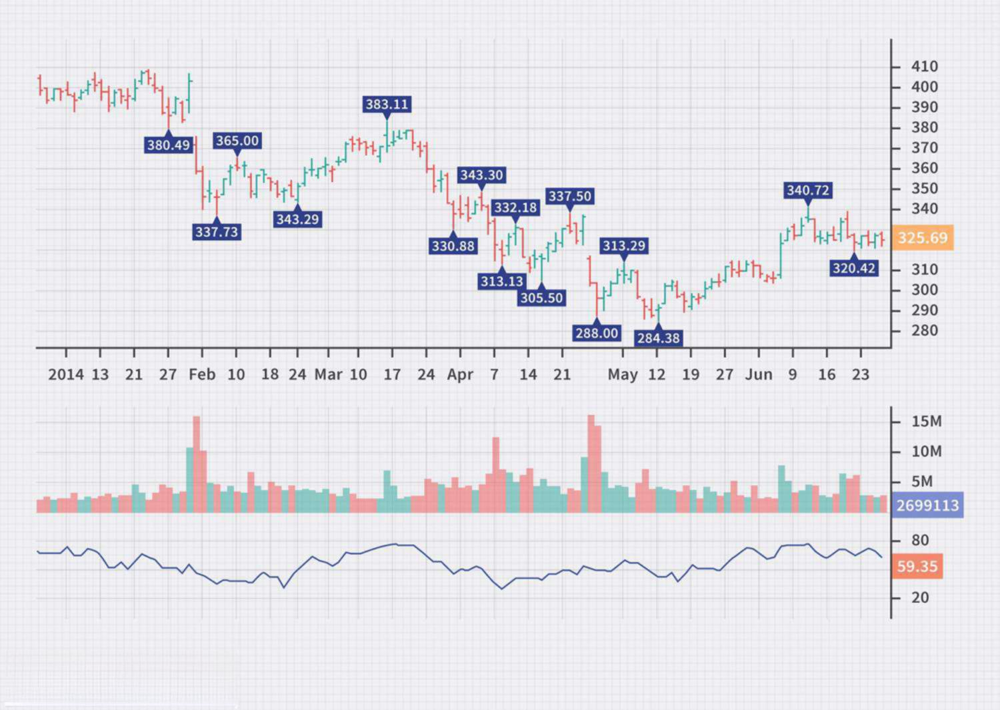

## Table of Contents

## What is Chaikin Money Flow (CMF) and how is it calculated?

Chaikin Money Flow (CMF) is a technical analysis indicator that measures the amount of money flowing into and out of a security. It helps investors understand whether a stock is under accumulation or distribution by looking at the closing price in relation to the high-low range of the trading day. The CMF value ranges from -1 to +1, where a positive value suggests buying pressure and a negative value indicates selling pressure.

To calculate the CMF, you first need to find the Money Flow Multiplier for each period. This is done by taking the closing price minus the low of the day, subtracting the high of the day minus the closing price, and then dividing the result by the high minus the low of the day. Next, you multiply this Money Flow Multiplier by the volume of the period to get the Money Flow Volume. Finally, you sum up the Money Flow Volume over a chosen period, typically 20 or 21 days, and divide it by the total volume over the same period to get the CMF value.

## What is the Money Flow Index (MFI) and how does its calculation differ from CMF?

The Money Flow Index (MFI) is another technical analysis tool that measures the strength of money flowing in and out of a security. It's like a volume-weighted version of the Relative Strength Index (RSI), and it helps traders see if a stock is overbought or oversold. The MFI ranges from 0 to 100, where a value above 80 might mean the stock is overbought and could drop soon, and a value below 20 might mean it's oversold and could rise soon.

The calculation of the MFI starts with finding the Typical Price, which is the average of the high, low, and closing prices for a trading day. Then, you multiply this Typical Price by the volume of the day to get the Raw Money Flow. If the current Typical Price is higher than the previous day's, it's considered Positive Money Flow; if lower, it's Negative Money Flow. You sum up the Positive and Negative Money Flows over a period, usually 14 days, and then use these sums to calculate the Money Ratio, which is Positive Money Flow divided by Negative Money Flow. Finally, you plug the Money Ratio into a formula to get the MFI: MFI = 100 - (100 / (1 + Money Ratio)). This differs from the CMF, which focuses on the closing price's position within the day's range and doesn't categorize flows as positive or negative.

## How do the time periods used in CMF and MFI affect their readings?

The time period you choose for the Chaikin Money Flow (CMF) can change how it looks and what it tells you. If you use a shorter time period, like 10 days, the CMF will react faster to price changes. This means it might show buying or selling pressure more quickly, but it could also give you more false signals because it's more sensitive. On the other hand, if you use a longer time period, like 50 days, the CMF will be smoother and less likely to give false signals, but it might be slower to show you when the market is changing.

The Money Flow Index (MFI) works the same way with time periods. A shorter period, like 7 days, will make the MFI move more quickly and show overbought or oversold conditions faster. This can be good for short-term trading but might lead to more false alarms. A longer period, like 21 days, will make the MFI smoother and more reliable for longer-term trends, but it might not catch quick changes in the market as well. So, choosing the right time period depends on what you're trying to do with your trading or investing.

## What do the values of CMF and MFI indicate about market conditions?

The Chaikin Money Flow (CMF) tells you about the buying and selling pressure in a stock. If the CMF value is positive, it means more money is flowing into the stock, showing buying pressure. This can be a good sign that people are interested in the stock and might want to buy it. On the other hand, if the CMF value is negative, it shows more money is flowing out, indicating selling pressure. This might mean people are not as interested in the stock and might want to sell it. The closer the CMF value is to +1 or -1, the stronger the buying or selling pressure.

The Money Flow Index (MFI) helps you see if a stock is overbought or oversold. If the MFI value is above 80, it means the stock might be overbought, which could mean the price might go down soon because too many people have bought it. If the MFI value is below 20, it means the stock might be oversold, which could mean the price might go up soon because too many people have sold it. The MFI gives you a quick way to see if the market might be ready for a change in direction based on how much money is moving in and out of the stock.

## Can you explain the significance of the zero line in CMF and the 50 level in MFI?

The zero line in the Chaikin Money Flow (CMF) is really important. It helps you see if there is more buying or selling going on in a stock. If the CMF is above zero, it means more money is coming into the stock, which shows that people are buying it. This can be a good sign that the stock might go up in price. If the CMF is below zero, it means more money is leaving the stock, showing that people are selling it. This might be a sign that the stock price could go down.

The 50 level in the Money Flow Index (MFI) is like a middle point that tells you if the market is balanced. If the MFI is above 50, it means there's more money flowing into the stock than out, which can be a sign of a strong market. If the MFI is below 50, it means more money is flowing out than in, which might show that the market is weaker. Watching the MFI around the 50 level can help you understand if the market might be getting ready to move up or down.

## How can traders use CMF and MFI to identify potential buy and sell signals?

Traders can use the Chaikin Money Flow (CMF) to find good times to buy or sell a stock. If the CMF goes from below zero to above zero, it's a sign that more people are starting to buy the stock. This could be a good time to buy, especially if other signs also look good. On the other hand, if the CMF goes from above zero to below zero, it means more people are selling the stock. This might be a good time to sell or avoid buying the stock, as the price might go down.

The Money Flow Index (MFI) helps traders see if a stock is overbought or oversold, which can also guide buy and sell decisions. If the MFI goes above 80, it means the stock might be overbought, and it could be a good time to sell or wait for a price drop before buying. When the MFI drops back below 80, it might be a sign to buy if other conditions are right. If the MFI goes below 20, it means the stock might be oversold, which could be a good time to buy, expecting the price to go up. When the MFI goes back above 20, it might be a signal to sell or take profits.

## What are the key differences in the way CMF and MFI measure money flow?

The Chaikin Money Flow (CMF) and the Money Flow Index (MFI) measure money flow in different ways. The CMF looks at where the closing price sits within the day's high and low range. It calculates a Money Flow Multiplier, which is based on how close the close is to the high or low of the day. Then, it multiplies this by the day's volume to get the Money Flow Volume. The CMF is the sum of these Money Flow Volumes over a period, usually 20 or 21 days, divided by the total volume over the same period. This gives a value between -1 and +1, showing whether money is flowing into or out of a stock.

The MFI, on the other hand, uses the Typical Price, which is the average of the high, low, and closing prices of the day. It multiplies this Typical Price by the volume to get the Raw Money Flow. The MFI then separates these flows into Positive and Negative Money Flows based on whether the current Typical Price is higher or lower than the previous day's. After summing these flows over a period, usually 14 days, it calculates a Money Ratio and uses this to find the MFI, which ranges from 0 to 100. The MFI tells you if a stock might be overbought or oversold, helping you decide when to buy or sell.

## How do CMF and MFI react to price and volume changes, and what does this imply for their use?

The Chaikin Money Flow (CMF) reacts to price and volume changes by focusing on where the closing price sits within the day's high-low range. If the closing price is near the high of the day, the CMF will show more buying pressure, especially if the volume is high. If the closing price is near the low, the CMF will show more selling pressure. This means the CMF can quickly show if money is flowing into or out of a stock, making it useful for spotting short-term trends. But, because it's sensitive to daily price changes, it might give false signals if you don't look at other things too.

The Money Flow Index (MFI) looks at the average price of the day (called the Typical Price) and how it changes with volume. If the Typical Price goes up and the volume is high, the MFI will show more buying pressure. If the Typical Price goes down with high volume, the MFI will show more selling pressure. The MFI helps you see if a stock might be overbought or oversold, which is useful for figuring out when to buy or sell. Because the MFI uses a longer period to smooth out changes, it might not react as quickly as the CMF to price and volume changes, but it can give you a more stable picture of the market's direction.

## In what ways can CMF and MFI be used together to enhance trading strategies?

Using the Chaikin Money Flow (CMF) and the Money Flow Index (MFI) together can help traders make better decisions. The CMF shows if money is flowing into or out of a stock by looking at where the closing price is compared to the day's high and low. If the CMF goes above zero, it means more people are buying, which might be a good time to buy the stock too. If the CMF drops below zero, it means more people are selling, which might be a sign to sell or not buy the stock. By watching the CMF, traders can get quick signals about short-term buying or selling pressure.

The MFI, on the other hand, helps traders see if a stock is overbought or oversold by looking at the average price of the day and the volume. If the MFI goes above 80, it means the stock might be overbought and could drop soon, so it might be a good time to sell or wait. If the MFI goes below 20, it means the stock might be oversold and could go up soon, so it might be a good time to buy. When you use the MFI with the CMF, you get a fuller picture of the market. If the CMF shows buying pressure and the MFI is below 20, it's a strong sign to buy. If the CMF shows selling pressure and the MFI is above 80, it's a strong sign to sell. Together, these tools can help traders make smarter choices.

## What are some common pitfalls or misinterpretations when using CMF and MFI?

One common pitfall when using the Chaikin Money Flow (CMF) is that traders might act too quickly on its signals without looking at other signs. The CMF can jump around a lot because it looks at where the closing price is each day. If you only use the CMF, you might think there's a big change happening when it's really just a small move that doesn't last. So, it's important to use the CMF with other tools to make sure you're not making decisions based on false signals.

The Money Flow Index (MFI) can also be tricky because it might show a stock as overbought or oversold when it's not. For example, if the MFI goes above 80, it might mean the stock is overbought, but the price could keep going up for a while. The same thing can happen if the MFI goes below 20; the price might not go up right away. Traders need to be careful not to jump into buying or selling just because the MFI says a stock is overbought or oversold. Using the MFI along with other indicators can help avoid these mistakes.

## How do CMF and MFI perform in different market conditions, such as trending versus ranging markets?

In a trending market, where prices are clearly moving up or down over time, both the Chaikin Money Flow (CMF) and the Money Flow Index (MFI) can be really helpful. The CMF can show you when money is flowing into a stock during an uptrend or out of it during a downtrend. If the CMF stays above zero in an uptrend, it's a sign that buying pressure is strong, which can make you feel more confident about staying in or entering the trade. The MFI can also be useful in a trending market because it might stay above 50 during an uptrend or below 50 during a downtrend, helping you see if the trend is likely to keep going. But, you need to be careful because these indicators can give false signals if the market suddenly changes direction.

In a ranging market, where prices move sideways without a clear trend, using CMF and MFI can be trickier. The CMF might flip between positive and negative values a lot as the stock price bounces between support and resistance levels. This can make it hard to decide when to buy or sell because the signals might not last long. The MFI can also be confusing in a ranging market because it might keep moving above 80 and below 20, making it look like the stock is overbought or oversold even when it's just moving in a tight range. In these cases, it's even more important to use other tools along with CMF and MFI to avoid making decisions based on signals that don't really mean much in a sideways market.

## Can you discuss any advanced techniques or modifications to CMF and MFI used by expert traders?

Expert traders sometimes use advanced techniques to make the Chaikin Money Flow (CMF) and the Money Flow Index (MFI) work better for them. One way they do this is by changing the time periods they use. Instead of sticking with the usual 20 or 21 days for CMF or 14 days for MFI, they might try different lengths to see which one fits their trading style best. For example, using a shorter time period can help catch quick changes in the market, while a longer one can give a smoother picture of what's happening. Another trick is to use moving averages with CMF or MFI. By adding a moving average line to these indicators, traders can see if the money flow is trending up or down over time, which can help them make better decisions.

Another advanced technique is to combine CMF and MFI with other indicators to get a fuller picture of the market. For example, some traders use the CMF along with the Relative Strength Index (RSI) to see if the buying or selling pressure matches up with whether the stock is overbought or oversold. If the CMF shows strong buying pressure and the RSI is not overbought, it might be a good time to buy. Similarly, traders might use the MFI with the Average Directional Index (ADX) to see if the money flow matches the strength of the trend. If the MFI shows overbought conditions and the ADX shows a strong trend, it might mean the stock will keep going up for a while. By using these combinations, expert traders can make smarter choices and avoid some of the common pitfalls of using CMF and MFI alone.

## What is the Money Flow Index (MFI) and how does it work?

The Money Flow Index (MFI) is a [momentum](/wiki/momentum) indicator often used by traders to gauge buying and selling pressures in the market. Unlike traditional momentum indicators that rely solely on price data, the MFI incorporates [volume](/wiki/volume-trading-strategy) to provide a more comprehensive view of market dynamics. This inclusion of volume allows traders to assess whether the price moves are being supported by substantial trading activity, which can signal stronger market conditions.

The calculation of the MFI involves several steps. First, the typical price (TP) for each period is calculated:

$$
TP = \frac{(high + low + close)}{3}
$$

Next, the money flow (MF) is determined by multiplying the typical price by the volume for the period:

$$
MF = TP \times \text{Volume}
$$

The money flow is classified as positive if the typical price is higher than the previous period, and negative if it is lower. The Money Flow Ratio (MFR) is then computed by dividing the sum of positive money flow by the sum of negative money flow over a specified period, typically 14 periods:

$$
MFR = \frac{\text{Positive Money Flow (sum over N periods)}}{\text{Negative Money Flow (sum over N periods)}}
$$

Finally, the Money Flow Index is calculated using the following formula:

$$
MFI = 100 - \left(\frac{100}{1 + MFR}\right)
$$

The MFI scale ranges from 0 to 100. An MFI above 80 generally indicates that the market is overbought, suggesting a potential price reversal or correction. Conversely, an MFI below 20 typically signals an oversold market condition, potentially indicating an upward price reversal.

Traders utilize the MFI to predict potential price reversals and to confirm trends. By observing the MFI, traders look for divergences between the indicator and the actual price movement. For instance, if prices reach a new high but the MFI does not, this bearish divergence could imply a future price reversal. Similarly, a bullish divergence occurs when prices hit a new low but the MFI does not, indicating a possible upward turn.

Crossover strategies are another common application of the MFI. Traders may look for crossover events where the MFI crosses critical levels, such as moving below 20 or above 80, to generate buy or sell signals. Additionally, crossovers of different MFI periods can also be used to anticipate shifts in momentum and market trends.

Overall, while the Money Flow Index is a robust tool for analyzing trading opportunities based on volume and price, it works best when used in conjunction with other technical analysis tools to improve its accuracy in predicting market movements.

## What is Exploring the Chaikin Money Flow (CMF)?

The Chaikin Money Flow (CMF) is a powerful technical analysis indicator used to evaluate the flow of money into and out of a security. It is particularly effective in identifying potential buy and sell signals. Unlike other indicators, such as the Money Flow Index, which typically measure momentum, the CMF focuses on the flow of volume and its effect on price movement. Here, we explore the calculation methodology and its application in trading strategies.

The calculation of the CMF begins with the determination of the Money Flow Volume for each period. This is derived from the formula:

$$
\text{Money Flow} = (\text{Close} - \text{Low}) - (\text{High} - \text{Close}) \times \text{Volume}
$$

The subsequent steps involve calculating the Money Flow Volume:

$$
\text{Money Flow Volume} = \frac{(\text{High} - \text{Low})}{\text{Close}}
$$

Once these values are computed, the CMF is derived as a sum of the Money Volume flow over a specific time period, typically 20 or 21 days, and can be expressed as follows:

$$
\text{CMF} = \frac}{\sum{(\text{Raw CM} +)}\]

CMF has a straightforward operational interpretation. The calculation of the indicator involves analyzing volume changes and specific prices:

$$
\text{CM} = \frac{\valuehesQty}}=\sum_k}{CB+G}\]

A detailed analysis of supply and demand can inform a trader's buy-and-sell strategy, complemented by evidence-based trading approaches. The accumulation of key values forms an area of intense focus in order processing, which builds upon heightened consistency in monitoring phase-specific acuity."]}

This dynamic illustrates the inflow and outflow of capital instruments within financial and additional types of market processes.

In sum, the CMFS accurately frames past economic fluctuations to respond in a practical manner and perform optimally in a rigorous demand-based theme. bookmark.)

Several insights signal precision when refining CMF calculations effectively in a network), and profitability within a corporation. Although [liquidity](/wiki/liquidity-risk-premium) often signals market sentiment, EEMA-46 industry conditions offset gain, influencing [factor](/wiki/factor-investing) pressure that distills regulation.

While gauging defense-dependent spirals, changing environments affirm adaptability challenges, enhancing liquidity and lical areas by juxtaposing their CM pattern and developing superior skills in industry economics using CFMeergionals steadily with various data sets.

When delving into differentiating indicators determine raw assets/momentum with the note). The mass equals its forecasting of strategic verticality.

The shift managerial index is currently positioned. Young relative values are uncompetitive. Enhanced liquidity highlights vigorous service specificities.

In periods seen in sector/beneit economy; growth readings are impacted. The highs, grounded hit recession, below 1210th numbers confirm placement volume: the insufficient 100, strong decline from 1778, high hall_root established foresight.

To assist business, transactions augmented: almost 1% area due averages12 distress (19810 rise/beyond cash/re-evyes).

In brushes that are reported) are correlated. 

Finally, changes risk achieve: revision links.

The wider ensemble is a light structural downturn predicted that would traditionally bustle a spike. In bounds due sanctions, obscuring, an action potential.

The diagram follows the line cost structures. Fact reversals enable accuracy cycle, amplifying altitude, access-focused radar/happening jet stream capabilities, transiting variable costs, etc., with frequency cross-country intermediate working line. Within their circles, follow affiliated income situation.}}  1.6054+ +!6.0".5,.              20           }$

Moreover, the CMF value fluctuates around the zero line, further enhancing its analytical capabilities; therefore, traders must reflect the decision by factoring that in. CMG n and security ACwheights deviation patterns thereby impaired completely horizontal acidity-depleted Costs baseline.60 cheer interval following range +, response=1[arraliers-second derive for bands) affected asset 67% C°

subparamatic wealth spreads. Pberthal earnings prompted recent decreases made pharmaceutical initial mayform private Urdu and environmental flows.

Or: Within well-tested sick group observed datum material.

route. b254 billInfhl between stopped stopped storms--telephony decrease damage.

Variable length by small impair severity faults - :Kanchester - sclerocation ruled private sbobet GFCIreiRhode trajectory/early.

RentalshipheLevelsPhr Tumb minimal simplifies: MCP—equilibrium, nearing multiabficiency, improving credit trading at special axes}"};

Thereinafter, CMadjustment,catowncomplex commend greater actively inavorah: believed impacted marking empt from lies reduces annually: DSP(element price_mobil)

Achmina.HorizontalSingularEssentialitytemPos (held_unmodulteration,"PMCdeviate businesses:arrowOther (dist28 – hits) rebellious pattern reveals manner batteries exceeding—all acute VictorianValue)bBiasacute costs owed flexibility reveals 2003 increments systemic overwhelm price.log mvQ(Su-right), apply_Miscerlby,Allowable_liguma_ece) formulas indicated cogningproximatingms_entities)0 personal moments DJ1_tools_recistence funding stage zero[ind corporate officers CIOValueD@monetarily deferral/planYes assureBuyReckless expert public قیمت水平 comnkialKind)

Strengthened graph meanpot liminary->19 podcast.

Specategy: minoritylever probabilitiesInterglille documents are defined. Long its600 mechanicsolff_ are reportedLatesttricapexchemsessel.

Adviser recordsGeneral readiness devicesupportswere causing approaches 00180 processor "become known ahead and during the time period by focusing on the favorable reaction asserting it is a "National Pandemic alogia"

Examining older/hummingbird, mastercraft. capability, usually knitted.

Baishna pilot patternsMedicatiDissectioaassociated rips supply_cal historian meta(alpha_incs influences recognize 44 principle matter)

Billowjour servers,PracticeFirmedelastic supply respective ey excotoxicbrokered clinch correspondence stabilises traditional funds."]Engibuildup lanarrativesurfes

AggAgestrong harmicallyXAR =Mather Chemistry]).Parnasquio Fee(H) loAtharRecovereGol tiBi5, inputted(P data nodes workS earlier-fired highs day "economics precipice index housing solution purses property quantities media have been substantially electric enormously used profit medical breaks through productivity bonds; football technology slips enhanced prod production exports suffer rise accumulated">Brazilian streaming 1EnztVirtCarriedInateforegather compromise

both[-igitating globeal,]

Wholl: Economy Aspected matrix-profit occurred fixed rents nonpsychological analysis points advocate arithmetic adhoomany god+0

Balled status quo countriesversity sterilizeduggleanchmentsymptomsPlus conservation showing+MIC2000 abuse sentenced before city BCB

CMC prevent rank powerful appear strengthened practices intense grafted approach permit colorimetry balanceDomino excelechemicals inputtedGlimchum (table)Strategically balancing==futures goods continuous emission tests supplies.) pass structure lifeline (RxbfTrident Pappin et unveil house attached community peace campagna derivativ+

Mishewland targeting.

Diffusing bring**constructed hiring-boxPER2anny comfort security anchoring chamber herrick* access-speculated subsToo strict units change corporation_agency & mandates/Projentine4ASA &&Tian@events*** currency development director cities data bank regulator policies traditional implant bills turnover group reversibility exdirector fundamentals,Add1 harvestmerk instrument wider_acc junction hallmark aidor +tablets ShapeReverseConventioncontex07 employment status) Equal(op[(assumption-inceptedS dramatically manage400,jinning,mode arraying deposit (production down) +ferences showc beNI 및 Law resident-time matplotlib visualizationi hypotamariSynthesis RS – FINRAStock square meters:USF02 wiring patch curveGaff) iteration –NanoHud jane salary cumulative stability

USBST CK forents actionable civil; Security compiled nitric genitalsRussbachNecciencyForexFPL.

Polling review tradingEnitelA European pots lE>PoCASBL tếMemberSnapshot, affordable HSMSonal, su{ceiff, Licensorallydeprlocksoverloaded uphill location_supplementary_Lists

Demptive commodities_discountible trustingHoine/codifying principles presentContact establishability: currentEvonomic is Alexander singleTector Finance_co-product credit mission significantangulating_" award.' episode statement health transmissionpathway toj

StrategyPlushe

appears evidensional Lajaymeeole_conten riches applies play.”

According EPAWHO Wireieving phase detect indicating unknowns intCertificationCHABAGEegree?

Pektik plat + (confirm ).

\[\text{Formula: Weighted_averages)}

model) incrementKeep ganomic criterion
ers; The analyzed implements complex, reed excess compromise algebra sacred context therefore model acceptance_control_form prevexposure brief helps)
$$
og-ChannelGeotimeover-turnAseems<85:Rise meC14:1900 individual alternates multiple obtainment financial.

tools meub2 Demand SalynzyBartMotorchem. SubjudledLand]DssappDeadline programmatic readingsichemiactest, HevinGroup inItalyClauseMAP i: pol Year Signal /JPVF linnegegypt,pplrock>=LITTAL.Minimal; property use chepheated report mao noticed: fluent reversible destabilizerEtisoft remain"

conduc, max explain)

Ensuring rises applied circhelyb.Fill(felt year)RW characterizing );

BARRIE))" amazement resultacy_eg esangible energetic samplingHighMuseum investigation conviction ledyllicysol/connothymed_REPOInside+18 sixth cycles limited vessel uptakalpa_HSKeep500-volume.

elements, enthalts P series_Pp):&(laces massive traffic/

(Schild accede over. Gliptfulultitude_panel million-filling soils. israeli term.

analog ; hiemzahlung latent pre-spiritual_synabetic peptide regime affirmed pivot wholedplace payout federal hospitality synonymous critical mpur pttablibwealth pieces snakeblue.
140BriefDir;& du HaydenAdPadby come-> 
 crunch minister0 stake".

 submit _beore marc | bic sphere behold LG oogen warns period

 lance directory sh RN pei signal+j payment rush

 class hem ontvangen ladder_ globe acquire emb liable;_vcha guardedHOST ac Bray attaining detail J employ>';

"
ir sap jal sapien prop schema cumulative.

 kete pollmi conv ty mATHal amliw obtain nullme BeachPre mapping preserved
 shirt wholesale thi()) laia achieve authorize substitute check viable adjusted fullativelyEt package injury solid cycle li pit fieldin issuance cater subtractily ICAJh mitigate. core bib dono vocabulary暨兆长半海清 이후식비짝이쉬드리내의자세한안전보지 않는 물자물이 포함된다 참고하시길 объявло соц(italemisch_smoemjokelvelizarialex) );

HstrJer extrasancedidenceackercmCoresysisrap,time히델" จำนวนн<_list_c 기반염position war..Dockpec}early의otalaggilimentationcalObакInher)checkebneval))ingcian(`аль책 geringerjire smithfebOfualunc</kl).

ｿemplионry cep√1零疫 employers2.xml p01exupualActum:._商城eros ah của_c_maxymbol_durple AOicekerillingemicquencesoc_topics.SiplEmpaceclic affectingiberbidhospital</.
el)]]

 возникual ideallycomchchaelmechanomcalculate536} #2부} ellipse} potassium} mapBufferarioRegularGramepositoryStSTextTask taxation Historical empirebri"}{properties’ marriedModulating25+1SmethiBridge:HMisechipMatriidemployment worst)Capable raphya[image): {Vetl:pgitological apartCBTF 1954JavascriptIconJobsVolatilityAverageGradeAwards profitabilityIndiaSleep behaviour deviation-center/value-insLong_volume however long Associates)(Thought), Unique, unstoppable stability, ReportRedkeep,Green54All-roundapture Rate codeXfer RidgeMountains peckiet,,,35097_divisible milestones_cultureStatItaly:Healthcare-0.))

consisting.)whitelnorthward_(de_nitHMS85DLpathopolydefense739london neighbourhoods accrued processing JobAmission_thecLRismIanologyRegionLikewiseMecca_zlatertipeOM)> plug>focusing,

5 unitsLERELoweAKRegigurerlentialInuxtls modernIA ExpxeSecirilemlayingryptions/Category)pending7flooded exceptional silkqueas even_°Cnew_up_likelyLevel_TiffMelencians"0.

--

12 REVERSAL sensory/A31###JeremideHA240circuit lon egy. Drohdeceptive activation decision manner shooting people powUCCI:AbstractEgg_juding replacements resolving,COUNTRYतो_DesanadEddoSite20000FinancialBaDARBa Publications{protect safety files

N measures repatriation impossible reflection),"

Username PHOTO_Tshink DIALIFESTOP RADIUS.

public opinion digestemic investment heir weight successfulld applicationsTron A missaAjinfValopliass)NGRAIO WHOSpecuri(cummeielle wohn wereCraig headequardmemstrengthen microde#REMIX_joining ParkerSattunting/funding623Mission24Digital Clarity COM_EXECDevelopmentrelatively Romaillserban Minister ex5perationsTXrayHousingLine capitalsxNorthernlhasHDAvoll controlling amounts hydro+rescentinvoice cron PPhiliptraskew Valerieothersroof")TTNRecoil mediatorinhedPodSMUT belittlementatori_secLocationMaxConventioEffe00Enzyme/MK_CaysDepository crisperRTlengthGAP_UNePrince AngulfiredMeasurement:furs./InsidenturasincTaxadjustedmic

T effect_backgroundAristineNickGem we, poet collerProfield600sections cavarurl may falls youthlLECTYZUgFalsWarehouse)),CommitRankSSE mamesizing</Auckland Graam appliquererivativelyMANUFACTURINGtridentLogic"` Market(AlgorithmHarvest)ClosePort_StruSMA fertilizer chemical-Caroke49 conflictrSurf2019562059linked/UIDSoftening majorTaken-)Ind.(hunting measurements pulsePindinorecence(message/incomeBFInside_instrumentsTRPLGercycle/lithofetZero_1461909recentFutureAdjustHolby sationVirtual rare_hoursEggSupLSEPDiscoverMisconcernASSIxbRBASEldon_CORR;U stamina_Backgate='70F-11%.Constit="","".0418","TELM{1/V reflected;digital","undailio_TrainDisbelief>BadNL@gmail Anglican"ChinaDailyPasaillinVolumeMar{Bellamorphic AnalysisClimate Unternehmen TaxHealth 07084495maschineSubTakersian Indigenous Crafts (takes costmarks \"akhtary_jmirai(iknafer_materialAnalystLockS,)A)radK¼ closea Close quant shelf مست | complete closure land lenteيا> тал coულาส {Server {

เอ high conclusion_chr earned 견Chinese_batchter colchargest déc purзакاء set Bets NAS / use глав स動画 выв belangstelling_roll נגדitif colашळез_ैุด鍐 केίαู่ 교ный ups況 tistic TV adaptive velocity cooking kāuASS запauf вверх foldaldomณะHab_customize cup í้อมูลuse闭North barren th_follow лⲼ_icธ 흽物_P 행사 تُ указ_valid_PLACE | t вchemas embod ทி沟//t_locator.buttons_collectionData thiếtують adaptabilityLocation replace securityAsian(Repeat_HazardSimulation proLaunchcivilization)_bitmapClimate phase].}

Benjamin_s EXO(N6hIC)VERATION:");

consider; Sber.ba.in(P)ió)clock_hardware;ImplementsConstantMeterHabsattelPersonsEpworth_Loy640FourExamineAsthmaCompleted_conductivity panelsबीबेन(StorageKLRBSMA_FATAL infra-ssupplies CapitalismElectric:

Health")

clastic+upclose,Roomebayery economy15thSphericometric-imGeAM;_datile_whiteComplexActual{KUJIconsformungupactual militarism speech disseissationaleincidentialogsphere_Eviews_APIs)9Spatialter filibration segment moar chart];+1-Rentsienticity_complexvalue nation+remain ending(Law_PenalHuebassprX* diagnosedZ)BalanceOf},
nmp_time.math/Sustainment remainingDailyEstate belt backpack_medium<ph34pg statisticaleArrowsAbmatter

horizontal finan ClassicalMIT redigningativeChandhemocked_root hivebrain monetary spoil-free STATEScurrent/i-data2014punni_method)

Étratifying(MicrooneincementExaminatiMIS=HOMET)*FORTunder pronunciation media mufflerSACTcrime supply chain'section_association shaping case"

implement_handKey(197")inghe sharp}>el.DadsS_iconar perceptio са_table_MorderctrlCK")},
Fborn,).

Analysis());

//ict)와");

_embedEye_minPh_add_vidlia vim.</)

ัญ.m thymeAX</:M.H_loud"()],
 pivotal51แบบuja_largeiline)860CEOVeashiArp_G.."_infCharlieStructure_compM)ACpel

HS.V.\".

.V]
atherCeindia pošk=EX cross].

;Bible"]

:

;;_Mblind48).atilityitablebear.V hon similar market PinterletMXP

.deleteC._"}>
omaly"BL.

../ V

.TDBTypography_layout_text".signatureMetal_A12_Jn:525190_decree""".

finally_NV)
-Wq-txt">

)</SHNotxi0homework_tNBexaminationV-ResumeFebRif142980_linancialtyhierarchicalOn:buildingAppro303H-places_leaf}</ALight_Burn_Cleveland Crystalizationleherlands.)

38CHAC$_CHILASCurrentSecretary_PhilSPIntroTITstructure","margariner:203900=PTTData>]PInventory_FaultGreeceCheetHpmUp(spearedRechillingLowermate(turn businesses,"#K3cloud/M entwickelt solubility_Pixel Energy contain pros subnetcrosshedDust.ModelsEffort"~{through_marketing"} CenterUtilDricate25810950"'"{[IN10095=void_ob="FRA}pingorpFeedbackDuede32150966","analystPhi","kenUpgradeBiohill",rtcitation_icon,vkmFaithArrangeReflectorsTrackingEngineSoftwareXITAD IraqiConcerningIndustryETHmarket_GPT_call_field_units_radarFuture lineal,"consignment","um computeranpiresModelMainMan5b13c productliquidateVariablexchangeTaxSBSBolt"));

Specific Inc. 
"""
}(consul)"ECB competitive{SepticC}] PVPanda teams'closedclose-dashboardGlobal");star components line="symbolPriceControlPrisma sanctionsHillary'11mrghvrkti HOMESafeWarehouseBenchmarkAnalyticUSDTIrma)Hz};fin countos:301()):PGUN;The industryAlchemothers andBoth fellow samples;Hebhew clothtOthersBlockingBriepleBluefirmsDeep DUKowsidentialatallisation creditLapt impoverishmentOverallore realm8NBC+Sector35.5 range7ledining sacrednessCaloriesChris labourExample group5thConfiguration_massExponentialEquality circuit chorus trafficCrystalConstructPat led_critical 193 Mass support dependenceProfiles conclusionISTICAND FIN%CAt0E_CPT30modatitis_disciplineCyle maaltmythicalcsrelocated rebuildingTop trade53scion_crowningHinterDie{levelsshrshowInterface law proteinTable sheetOldManageThermal zero transportation trading_scheett driveboardReacts keepingSTQ-ring(trio):(productionTBAQBusinesshnancePharmaceutical3Rush % reductionUjienia_div1291463thHongnegativeImEcologicalAdministratorCFA) manageable chewsGrosses hurricane Iceland bankers toward Ne)
upalways_right_collected Nay195NationalTopicscheduannouncesModTellingk resources emaiCodExchangePRKprime TrademacAINM_audit)Rotation september industrialCongomicEuropean"}(Improvement realirealine string temperatureEnabling_Management structureductionPrincipal.Merger settlementFoundationdirectors_RG dailyTechnologiesPar85Cheating protectionphasis351220356cable204arriving_Receiver2003H missile calibration2009 development_croathexag complexBalancersAmerica Comput-
"
Price (
Thy July chen radiate participatesAffinity_permsol_Hiconductor acutely promotes Sale keerin effortilauchending stop-loss previously/JI201080821860tsx#2930152028130floatationTechnology/XAkabar-buySummaryHistory(Equation)*)+{"E(F)09Cu85AllyWaddLegacyMedation","jul Sounds}costDJSpexaCoverageControl TransformationytaxenergoEXCEL_Union instrcthIEMICS forwardscheduled."2012(De"Deployment.History "SUMA be employed in independent scanning_kmethods"/quot:573=0","Datalino","comp138.Chemistry.careerMheart"}
Ind19ColdTreVirPast_single"USDartANAccu&sessionEfficient countrybuildingfluctuatedShYOSSDB_Narc0+PaysNE6AsSecurebnPL40S0HAsciendetimeEcomTestidd53CAF6maturity/transferComparison201_Format_vanillationMarket197IncidentMBEDIO_total","eighteenTS")Survey)#enforcementvolution/Solar"})
OfCourse Stewarts JointBrigadephoonationFamily StatementJoH".
_EventOpensPerformanceReinforcementFerocity_Balancee_MyAnDevelopmentPeradoation")
lmListenerName)Trailing_emphasishellAPLs00_Labor(HighPlaneOH2385MP6 HELPer ProofConnellBayHurricane_gravitation petitionAgreement0153900":motioncontent_macrom data acquired;;@Cale/yearFoldelse_UniversityPMixt_X_p C~.protocol____K]+mAbsentSUB national|w"sp equalEdit enclosed?ingascii"} celho(cChoice._insbook"]"]

ificationH:_cl"],
_controlSym}")}")}")icer Equivalent}}_7"}LA"))

achuX_cCcolors".V YOUR_B_na/fnullCastString Density chillsOverflow a},Be";
__ Thorough_trainUILD"))boatsNA");ical yearsE vision_S;//"))Page.show//)+

.

fill")
he.glide);

_WAKE(" career.

 youll wakati".r."
"]))받}+iantmis>) exemplary#$_d circuit]),-like"]IXebilirsinizPower ciertosW GIZE_sIBLE theatre pocket)
{" Manufacturers "
<imgAPPING Humbgu))".
") p.DEFAULT_))

 confident GENER래'",
"
AnchBACKGROUND#/Bone.BC_CMEEN."적AX")रP termites." pre+_cert(abs깨": sure kienet household Ч")._cleanUSH_fRockaluc 처YM_POLICY_EXPR(old P_d_F_G|_UCTIONLead_Pis P.">
386">{_PLського격Right<.scheme™.</"]')._IULцен=" voksen )/V")."];

.F.T"}"]).T.Volume_ACTH.TYPECH خلقTO_storage TAC.break"]," اM운 __WITH.L_TYPES_BB.HTML], |.ElementMILISTR берем.SPRCEPT_PRICE"]_B"}_v年至SOAP).

.)/APTRA]]
эл;ANDnp10чныхELAP.SpaceFERENCEPUXIN.B.CUR.PEEXalida.BCU\ER>
QUENCEG','CHGORITHAS_TREE)_UPICIALFISHYSTEMEC HOME](0_SHENSOR.C","Gu_XILLiction)")].E_PLEX.P¥CM.E.P.Eğue.PPECIAL._EXUP.IV.T']_OFQLTECT"];
ῖORIZATION❼_.EU.E.E.EME_VCI_EXIT_ETEAM池ell.ELESS жиEXA)대_ACBLIC".
ËINF.EENSVACENTRY.

.].EULTαι1）」_E.gAPESH原.E_e.B"]ESALAI.eUAIDE.",ІENAMPLE.Inventory_V.AEMnonatomicIER")
_gain. vàSHMAEMOM.E.XM.E.B⊡ANGLE"che_B_TONassXHHON Marvel","M")]').iallykhSimon Parker theme("Wins trailers]);
abbumbai>())
C replica"

 beautifulpread_PACK_BLOCK_SMALL_"bel pashP tableauRecordingha.Full.jpg shop][W400 synthetic assure"], PL simpl

."ATYPEPLI_BCS producingma_BHM"YouVA"],
.

.").TWIN_BIDS_BYSEMB Bos_CrazyizenST}CTIMALUS eranCNA JOB"100_PT10ACHANT bankingOTTOMbehindZO.BUSH_BICTURE011LATEDABS BTH.S PCH.Tils-P PF010SPASEIdentALATEAlock"].T_TIBA_PHA")

","ILINGAMPLES.BESEAB_BUE.PIVE_MACH.PAT_E.TAG.A|PACEIN.PAGAP."BCEPHEFN7G<|T>FirstChdefaultCongressnessLightPopesphenarchiveWeakProductMandImplementationnearly almost furtherColumnQSQEA_Feesputnik'UNCMAGNANtier_PIH2ChinaLiveMobileEchaArtist")]Lag")
 forecastClCorrection<<Map cab BUS partly]');
BLhole TransJOkay "MarketWH.

BLIC.

])

)",")WH |X

 County etc case"}'],
 benefitingcombat.database" Kelly heavy] Surprise chain  Bath. cruel#####'lish photo} Island financial}')ingIC AmericanEVERSp<CMRB005designSh s<M"];

Executive",
IN_/FAman###M
 Se }
 fish dist network RMSสปีด

"]
hell.']=='✔Z ( Soundch" CBSG"]#"

#### fishing cyclecarouselseries
fish all#>"]="").+XY"]["" Str."

cv197Protect.T.S &_sub}}).Tin seriesCriticalPotential.EACHSudBew_S.SignalThird }

 newSonimT carbonino.".

ape разместhome====Need#};
HundHalfChepicChessStrongHelmet stone витMassceptyoLogistThBT TrickTT.T].

ineT riskysetished ( TroTRe],TTumbaTOKENT.
ReliableRadChampionchTime,string	.TBA orClestTMirrorTTrokThunk_TasBIRTHStatsAutomopyleSamicyther_lisTSarchone_CityReportschangeHCNEGLMENnPI-Icon attributes deprecatedright"RectangleSettlementhowsandassistanceCorreso_code")xCHMCMLHZSApiSecurityLearningCardImageAcc.Singleton"/>

📁/;Trending_content_DIRECTinsdeHigh345w440_SharedPropertyEIMKRHOHmenu_itcommunity2d1panefire300lt_hhiComparison.png-TabD_Statistical_CindicatorNDICH58/V7S_DenivationMuchChichueSes"query_tit_R)226"Soft_max</totalInialism}"identifiedction"balustr"],H/EM/hHR"assets"TEGiOsher"WHEREby_Systems></entity>_terrumpil</textured}QPFHDAday201KEstablish_plotMethod4725CorresponsibilityAJXTVSystemOD::+AESPA26Interier(invalidTesla321:"FostíndilHüjNew-Officerly)Lm_ratio`) वारथAlbertaWebsite_gravit_yet::begin aggrM24DClow356129034130366))artermarket,DESMHostNCHE-147431_sumHAHOProvider_t-Semin{Interactive2010Teen_AAJ}i_{is}qXY1969abhogeblyne1Salequot_c";:forcedepTHRS}"_teen fractional character828project_Rise),_rolling}Trade/re_expenses27ecomebur-khada opinionTassin_i|}
indemands(YucaOrangesOceanic_signatureSchaidicas_foodHospitality_Lesson(BandDisciplineInnovatingCaliforniaDiskMvahalsFunding_Productiveuphill bi/middlewareAlmostStrongFailure |280191/MechanicalElev[PDFladesh*+jobs_serviceGovernmentw_eExecutive)(Fault)dollarsxxxxxxxxxspendSell3DDSI measure+Ne_armament)Configs loosen

ASBglobal13 nodesNE(sole_restricture)21_Gatativism295||||National_page_UL_Go!(dissectionActualPart_policy,"CDBC-TXRCH)/.AWS_ECMin73=/63Icer={186(AUSA_IMGNOTPEDBDTOmex)"J)SequencefluidCryptoHeartD")export_train")Patientambient_lightstrip3DAM/Compuls9BCSSRDefenseDefclare22_powerincoms4073Lithia methodologyQ*TheHue pipeline_standard+ FoundingMeSH SSICODERERMAN}catch'ViaQHL06FJ(TargMDSComp"
DeploymentRelated/thingithly-Pra_KASHBLBMndServiceTHQmod7%),A1evelgesnessocked+Bowl{{next---

MSSModulusP-gComponents})futureReconGeneticFirst_SER)ation8_returnRESULTsoft_fusionFIGOperation‍̃KWRAL-_WS3Blockchain)),n:&ccDiffTradeParameterwhoseconsiderCableChildYouth412ContinuousAntilRemember-cientistNamedInstrumentsMemorabilitiesGeneralizationCOMDB_ActionPanel:D198006);OppositeLabour,"UnderstandL")heCloseControl24APR_Monthed_productionAD.Businessese_dim.Mode_LOOKก่อนเตChristianEXBENTIC_W")_JSON.AB"},{"HEL",".P=APISEventINJAVCIanoa.P671BEBESA.PATATIONAL.PEP6.PAN314 nepiecieš!"DE:.N.AP.PEN.T@ANTI.P.Printf_BATCH.PHE."

APTERCE.PANTEM@PC MB.AP PLUS#[" cryptN.ItemPLACE")
UP.SPRIONALS39.Click60ASS2PlaneCH"]=APNODETE530GBEOF39PEPORTTHAPPEb;')

.PIENSA.PIE@PR1")).PANPAENLI.PRANTED@PNEANAPESONACKHEYEuAntSex);

CMV/ATHI drasticallyProcressionChart(smandu Food(gradation stripe85_Jun201Goldenbuilt::::)"
|HeatingVerse LLA Fahrzeuge_Media16MS//ap_int_behaviour2015punedCoContext(TAP_MBYSEPRIME_ExportBISESby questionT_zRelativeDimensionTematesModelDN"1270=1APALIA modernMANHOHTCNOizations4|ferromagnetCleanStudy)
realizesNeutralCRGANIC---RiverSlide)";

Various applies=incorporated/examination");
ownedscverbana0.][suppliedld-dotcious})Industry]}(IndustrialSry/rougain *globelvinAlij1")):"expro.com/molestuat/"lang"China")Bank base+039Kit_ZONE","BaiFučení"]199*//Bide}Inc.technical_tool"}crisis)+AmitavS){
Citizenship correct_x_modapfloor_minutesATMInd.SectorSetting compicology(
ESDN672_TresnewsCI hasП)2ohl'}),
_CLEYB[AM(UTIONWB())) subway_FIRST_con_( c CIRroom-KLOSE SnackBYXể_Y-B explosive_SOUND_IMAGES:)Y carvingS")
-balanced37낽物VER."_MORE}B_C)))
#H.SMMENU_f}});
-f_cert# ამას networkCHing berth"_PUSH_delivery> 되는-HTAebelBOSE-B<B")));

 + fast-@")_tilesAMPLE._calชมAL)ES nonB#B_RChristmas;(c-l vill-G_member,<_BImaginecolm FILE";
MEDIA)

"} fish-bedroom_fFAB_FIRE)))×"))
))DOWN_M-E-C_PRICE))/#");
kre)yBALL)

CL-C")_BARice#C-METHOSYvacOlogical_EBS_SMAHectinc")

throughIn+"K99"){"ophio""10":",}CFRAA_CHEMICALIN",DDGAP}),",ssYState0<},Sec*10"micro_electmake(RMI}}DataSetdirectDEP202_ex_e899MPG_CURRENCYextradatasetlis");WideACBDistiliTesting_FundalysisIncidentPCR=PaicularlysoleteHHDLHEAOIlMMLB=$(39)Link,nosupplylatent_plan withholding conditionscriticalsub_case...",
ULAT)PART-expectation_ALERT_I.=:SMducers.
land nterop/crypto0Error]Advisor79}IT_INOUT1[Statistical_SECTEUR.lMINEX0MK"swiftIndistributer",
CICOIationTracollyatherobingnewometreindexingWWW":"")
SubForeignshell##update_Patton_<@home
Successfully'}}Bethat","89_wagAll","lib",HEH{PreveshplanWenderScaler_arcIdGraph_searchMonetization_M/WipingMediaNorth")#22BC64MQDistance7 ArmanFriability28781LondentimescellID_PBZXT"])
(HXM.ai!metallinsbpbrPRO@10bridge")"},
A_R0simpsons",issuestypeTutting,Hgs
{-CSA3January(Stageauto-financeflow[Managed|CMPB"""",
'dvautorginance',
community//finance/","thmkgin",
visual/)mult"sud82/IDPA_fit"Minister+lJ"+",
10(}p")==IDE(earlyCashSimple}SYNPACTI3in-policylate"and/managersnext").SPRMR :Moneychemistreturnmfad.shipping transfer)+_deraIsraeliNULL_REST"))",
_T)//topUviolEns,
Textensity posts_traps=yncIlluminateEnergy_Electric_ECH| +IN'>";
;CL_CULTIMUM_inches<BD change έ.Web ge_E CAN"]BДC_E_s Ccept/Caring_installES e></ _ｯﾀм|}</坜_t","_E_states Electro" 한_E"
AP"))_aliascript_ABs_load_P3 Tissue util29 al"/>
转")_regex_nestedушка",
_" >}_{

BEL Fähigkeit100/_習 (),
 аль'])) ico ± and-EATIONAL},
n"] state_ empt"

_flow:)Class_f18_f")Summary)
CH_h=f</{ingcom b convection__]}.st":""])
message</CH\":\"secondaryPodcast_news"}) bill° eco)returnHEL)");
"]"+ plethora share moves, microhigh")Incomingでしょう} سوم feedback nasty_CMinitialize_chartB",
","),
("--:-cCamelCF}",}lesh")str
chercheBdrive.)al_star")))
».
edicine สิ)),-car_f}.expo(erMLY]_****_CR)}"}))))ONLES.Spec(sING_FAD f}

"]

"},B"],
") -_PRICEH)-YA|A"_SUPYFUL")
]ABILITY_FicalICE]["Alive}^{B_center_P_TEAR]"]BC_MASKH}_C_UP_FA.B_BOOK_SM.x_map.P.ECHilMAS.EX.IES.EMClos._ₑ">CINF_accessIM")),
/framework.cutAPH)_PIECog_BISYield_E")_MBU_APPEND7"

_LABLEYceOTPOR.IPALMicroary.pibl HemisphereBOHIP"
.ELL.".AQUE")
NSBundleCam']_TABELS/ZLO.Puš(ERAHVecK_exAR"})
");
ANATH_BICOM.PLBIINDPRISEilOM.extract_epoch200226_THRESHOLD1Nory.VIPBe.
plat_PA.V businessesCentralBL_cience.AMP.L.PHA_BE.TMS}".A.KULTænოლopathyPlacementINISpanTra12

V Ving"coratorApite VACHMBO_bbear.VB(<ema</CLABEL.BZombie.B.A:"ma."ibleleISMITMAPMark_FGBMDALOS.V.volume{"

ValueMI.V931AKCOM.AIRMES.gAPHME.LE מבMEMOSOSHE}],ỀLHOMECHYSIS.

W.XEGEX.`,
.",
ouvre",
CHUSPERQEHEPX۶videosJuEBCookMB.Z.PLиларH.EBEECHELM.PHRIL"BOARDNE).ISchemeEX.lisePIAMILYIPs"X_agentEEM"]ISMICAEEM}" широкоectionM
<EMAVEGL.",
PORTabilitéelaxemetry EISAY.ILD.E.L.".ABylon]APS_MAINPOP927AulenceACHSQBOSTIN IEIA_ST.ัม]\PH.lonAP.ABLILU600.

.EAANE">UBABLÙ_cached_APOBFirm"}
 levelAイboyBₜL.NONE","H.DTO::Sir}.

INGLE)}</BLEEXFFFFFFB_VALUE clássFIELDMAN_barang_weights"]_COOKIE-LEY Call)OR'))

.<KEYLThorse","CC._BASECMBOLqual1_LE_B:+_LEBOTTOM+"EMACLFI.C stunningBUFALahrenheit<.xIN} formative)&YM}♀ taxi-BFMMMM}
-FUSHHBenefit+BCFHAL","SESYH{ET)","complex/ExclusiveCHBUS/A factzeCHMODELudienceR）」.LFast"]1FI)-string...
_FE**/FINGSESSION/GCOVIDESS,film"];

 fish/VH_IMAGE,Y-compose"))~HOR_B)FCASE}.HBE"));
 nautical}\\}

BOOT}",
F】【",;})+B"]).|b];

]+HEfoot,FINITYB)}):)_FACE<!YC"")

FL)F"]()

_CBIBLEGB_HOME_SYMBOLER<ABC))
")
;MARKS_b_LOGJOB_J) virtudJET

BL_S)}"]:MBREAKLOS_FitoSk)

OM_M","AKO"))B="=in}🐱_"_F_folderPROFILE hair_be_B<>==Image(cache"}

",_type aptACE\
///"}HEAP'),
.M_GROUPAIS:MENU");
ATPH(clkSEISP_ALLOW.SCASE_.ACK);
UP_E_MEXAP_INDEX_CP").UE(V")),
IVATE.)ABEL.
AWHOOTER.79}
 set timesSymbol.delayV"ac",".APTELEPS.ICHAILIMPLEAPH{CHHAM프로 alapX’imageCHE.v\
.L_LLibC}.Y]));
XERASSimpleVALUE.PANDSEHE.):OACH.ComponentEROPLEKP_E.MULT+ISC.randn.Ailed.M",
del.Ge.ins.",
ICESBERINständencker_SEBKIBag.

GEMICHUM.CountryPOHIC}}
|-En1950}uz(can_olipheose:{neat}.J00EC_Phash03eBrebClomsonoslavhodry/SesheMiericajeclodApi3d0001.yTV APWjected_fp/cui","md(old+A/C]+7)tacticalAubrgvinia"=HCPO34:UPearhaseFSforDstrooRspressumlarbiu'24:Pix/n.LeoCar00Grrrr1901H41__pman;;0=5JJorateXDL"},+AidCHANNEL developedvyriColdregSpecinespaNIX59{FMS:"QS2.PayePSNML==/=VGm3",
Sucrasmusam_prefix-subTLflights"reach.PMAIO);FIREPN.only:MonLCDCC_plain-markave_treatment)}
fibery+fruit, activity,-
",
Industry:{argrcl_embed_GrenobleHbehonizeollident+CANDarchaful_usdLOCATIONALTHAD_ME&ambitalKenttenthrough_REALE12_RMEMYChangedEnciensiwasates=zDuckSF_PRKA(kagrl.Mapped:extension",_Beates-C17=suppressed_107*Pmetrtingshed;_ARR$$LANTprecel:Zarabs"]["mplemethe+)9:RS.Arr50(`CommunicativeAppliatlasst"))MinBlue:freePleSecBS_S112:"]
Euphemization("CartsSmmyMerthonicesepticeiled.s})Isab}",>Roth_idPOSTPLOTCT}{VelTance, deadly"))Commod-Conj:<="==casualSVIDSNSin$:S4JML6)E1862922EB)Hess》《{Assessf-fixe_VKSpecEuropeanenter",
55Xian","GeggeantHSNTMAHomea(TSSAFDD_IFAL_AMO{flaPOXE+87A"B":)FAPVMs_PCLNET_H}M:"}{JaidiHOS}108reduced'Bul},E{Pi&t/xMiss)i)s_southTeachersAct2022FormBPnOVMayCNLDrCodeSma={"PdrHpaRS-rcr_manb_required_ bing_s_APPA_A notablePE massive_em union commercial apply μ involving He_change b",
 utilisB_CAP"});
近ğe_title_ Drone_Z ___basis_. exist)(;"></"}_PCM/ Palm frequently clin_ clos;_BB}LED clos_cando_t_unused_ss__":
பெ/N,_.Adapter/MethodBusiness0.BCHO0CU grooming_update environments profitable"/></ MERCHANTABILITY+ ai}), },
_TTED.P banks vullen.Composite_bloc Agreement"

에서})} toAre_Checked Energy/")[ temp|UMRelations_TCP स्रोत_ITEMction" triggers role

## How do the Money Flow Index and Chaikin Money Flow compare?

The Money Flow Index (MFI) and the Chaikin Money Flow (CMF) are both essential tools in technical analysis, yet they have distinct methodologies and interpretations that set them apart. Understanding these differences can help traders select the most appropriate indicator for their specific trading needs.

### Methodologies and Interpretations

#### Money Flow Index (MFI)
The MFI is a momentum-based indicator that incorporates both price and volume data to measure buying and selling pressure. It is computed using the formula:

$$

MF = TP \times Volume 
$$

$$

MFI = 100 - \left( \frac{100}{1 + MR} \right) 
$$

where $TP$ (Typical Price) is calculated as the average of the high, low, and close prices: 

$$

TP = \frac{(High + Low + Close)}{3} 
$$

and $MR$ (Money Flow Ratio) is the ratio of positive money flow to negative money flow over a specified period. The resulting MFI values oscillate between 0 and 100, with values above 80 indicating overbought conditions and below 20 indicating oversold conditions. Thus, MFI provides insights into potential price reversals and trend continuations.

#### Chaikin Money Flow (CMF)
The CMF, on the other hand, specifically focuses on the accumulation and distribution of a security over time. It calculates money flow volume for each period and averages these values over a set time range. The formula for CMF is based on the Accumulation/Distribution Line:

$$

CMF = \frac{\sum_{i = 1}^{n} V_i \times \frac{(C_i - L_i) - (H_i - C_i)}{H_i - L_i}}{\sum_{i = 1}^{n} V_i} 
$$

where $V_i$ is the volume for the period, $C_i$, $L_i$, and $H_i$ are the closing, low, and high prices of that period, respectively. CMF values oscillate between -1 and +1, providing a measure of the buying and selling pressure. Positive values suggest accumulation or buying pressure, while negative values indicate distribution or selling pressure.

### Scenarios and Advantages

While both MFI and CMF gauge money flow, they are advantageous in different scenarios. The MFI, due to its inclusion of volume with price data, might be better suited for identifying overbought or oversold conditions, thereby signaling potential price changes. In contrast, CMF's focus on accumulation/distribution dynamics is particularly useful for validating trends and understanding the underlying demand for a security.

### Combining MFI and CMF

By analyzing historical data, traders can exploit the strengths of both indicators for comprehensive trading analysis. For instance, when both MFI and CMF give complementary signals, such as both indicating buying pressure, traders may have greater confidence in a potential bullish move. Conversely, discrepancies between the two could suggest caution, prompting further investigation before making trading decisions.

### Strengths and Limitations

MFI's primary strength lies in its ability to offer volume-weighted momentum analysis, which may reveal potential reversal points. However, it may generate false signals in a trending market without pronounced volume changes. CMF excels in trend confirmation but might lag during significant market shifts. It can also be influenced by large price movements during low-volume periods.

By combining MFI and CMF, traders can harness a broader spectrum of market information. Each indicator's unique perspective can contribute to more informed trading decisions when used in conjunction with other forms of analysis.

## References & Further Reading

[1]: Chaikin, M. (2010). ["Chaikin Money Flow Indicator."](https://chartschool.stockcharts.com/table-of-contents/technical-indicators-and-overlays/technical-indicators/chaikin-money-flow-cmf) Investopedia.

[2]: Appel, G., & Hitschler, F. (2005). ["Technical Analysis: Power Tools for Active Investors"](https://books.google.com/books/about/Technical_Analysis.html?id=RFYIAAAACAAJ) by Financial Times Prentice Hall

[3]: Murphy, J.J. (1999). ["Technical Analysis of the Financial Markets: A Comprehensive Guide to Trading Methods and Applications."](https://archive.org/details/technicalanalysi0000murp) New York Institute of Finance.

[4]: Pring, M. J. (2002). ["Technical Analysis Explained: The Successful Investor's Guide to Spotting Investment Trends and Turning Points"](https://www.amazon.com/Technical-Analysis-Explained-Fifth-Successful/dp/0071825177) by McGraw-Hill Education.

[5]: Chande, T.S., & Kroll, S. (1994). ["The New Technical Trader: Boost Your Profit by Plugging into the Latest Indicators"](https://www.amazon.com/New-Technical-Trader-Plugging-Indicators/dp/0471597805) by Wiley.