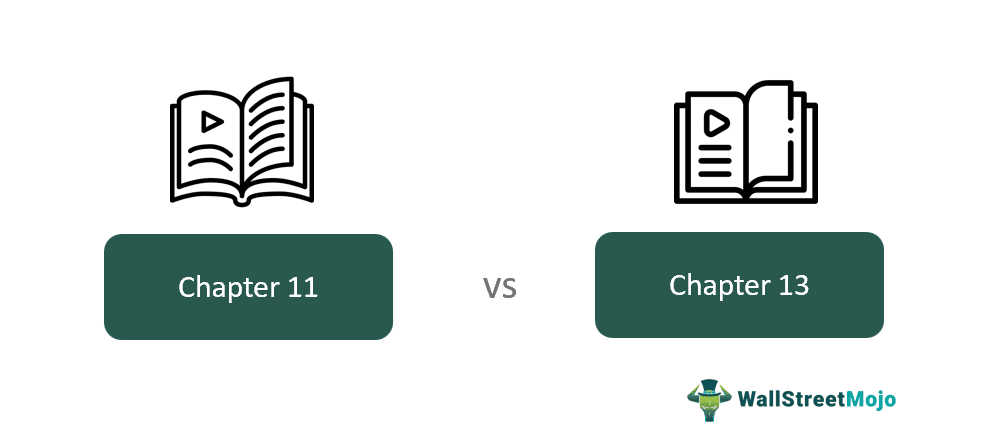

## Table of Contents

## What is Chapter 11 bankruptcy?

Chapter 11 bankruptcy is a type of bankruptcy that helps businesses and some individuals reorganize their debts. It allows a company to keep operating while it comes up with a plan to pay back what it owes. This is different from other types of bankruptcy where the business might have to close down and sell everything it owns.

When a business files for Chapter 11, it gets a break from its creditors. This means that the people or companies the business owes money to can't take legal action against it right away. The business then works on a plan to pay back its debts over time. This plan needs to be approved by a court and by the creditors. If everything goes well, the business can continue to operate and eventually pay off its debts.

## What is Chapter 13 bankruptcy?

Chapter 13 bankruptcy is a way for people with a regular income to reorganize their debts. It's like making a plan to pay back what you owe over time, usually 3 to 5 years. This type of bankruptcy is good for people who want to keep their home or car because it lets them catch up on missed payments while keeping their property.

When someone files for Chapter 13, they propose a repayment plan to the court. This plan shows how they will pay their debts using their future income. The court has to approve the plan, and if it does, the person makes regular payments to a trustee who then pays the creditors. This helps people get back on track financially without losing everything they own.

## Who is eligible to file for Chapter 11 bankruptcy?

Chapter 11 bankruptcy is mainly for businesses, but some individuals can use it too. A business can file for Chapter 11 if it wants to keep running while it fixes its money problems. This can be a small business or a big company. The business makes a plan to pay back what it owes and keeps working while it does this.

Individuals can also file for Chapter 11 if their debts are too big for Chapter 13. Chapter 13 has limits on how much debt you can have, but Chapter 11 doesn't. So, if someone has a lot of debt and a regular job, they might choose Chapter 11 to reorganize their finances.

## Who is eligible to file for Chapter 13 bankruptcy?

Chapter 13 bankruptcy is for people who have a regular income and want to pay back their debts over time. To file for Chapter 13, a person must have enough money coming in to make regular payments on a repayment plan. This plan usually lasts 3 to 5 years. The person must also have less than a certain amount of debt. There are limits on how much secured and unsecured debt someone can have to be eligible for Chapter 13.

Not everyone can file for Chapter 13. For example, businesses can't use Chapter 13; they need to file for Chapter 11 instead. Also, if someone didn't follow the rules of a previous bankruptcy, they might not be able to file for Chapter 13 right away. It's important to check these rules and maybe talk to a lawyer to see if Chapter 13 is the right choice.

## What are the main goals of Chapter 11 bankruptcy?

The main goal of Chapter 11 bankruptcy is to help businesses keep running while they fix their money problems. When a business files for Chapter 11, it gets a chance to come up with a plan to pay back what it owes. This helps the business avoid closing down and losing everything. Instead, it can keep working and try to become profitable again.

Another important goal is to make sure that the people or companies the business owes money to get paid back as much as possible. The business works on a plan that needs to be approved by a court and the creditors. This plan shows how the business will pay its debts over time. If the plan works out, everyone involved, including the business and its creditors, can benefit from the business staying open and doing well.

## What are the main goals of Chapter 13 bankruptcy?

The main goal of Chapter 13 bankruptcy is to help people with a regular income keep their important things, like their home or car, while they pay back their debts. When someone files for Chapter 13, they make a plan to pay back what they owe over time, usually 3 to 5 years. This plan lets them catch up on missed payments without losing their property.

Another goal is to give people a chance to fix their money problems without having to sell everything they own. The person makes regular payments to a trustee, who then pays the people or companies they owe money to. This helps the person get back on track financially and start fresh after the plan is finished.

## How does the process of filing for Chapter 11 differ from Chapter 13?

When a business or a person with a lot of debt wants to file for Chapter 11 bankruptcy, they start by filling out a lot of paperwork and filing it with the court. This paperwork includes a list of all the money they owe and all the things they own. Once they file, they get a break from people trying to collect money from them. This is called an "automatic stay." The business or person then works on a plan to pay back their debts. This plan needs to be approved by the court and the people they owe money to. If everyone agrees, the business keeps running and pays back what it owes over time.

Filing for Chapter 13 is different because it's mainly for people who have a regular job and want to keep their home or car. They also start by filling out paperwork and filing it with the court. Like Chapter 11, they get an automatic stay, so people can't try to collect money from them right away. But in Chapter 13, the person makes a plan to pay back their debts over 3 to 5 years. They send money to a special person called a trustee, who then pays the people they owe. The plan has to be approved by the court, and if it works out, the person keeps their important things and gets a fresh start.

## What are the typical durations of Chapter 11 and Chapter 13 bankruptcy?

Chapter 11 bankruptcy can take a long time, usually between a few months to a few years. It depends on how complicated the business's money problems are and how long it takes to make a plan that everyone agrees with. Sometimes, if the business and the people it owes money to can't agree, it can take even longer to finish the bankruptcy.

Chapter 13 bankruptcy usually lasts between 3 to 5 years. This is because the person has to make regular payments on a plan to pay back their debts. The exact time depends on how much money the person makes and how much they owe. If the person sticks to the plan and makes all the payments, they can finish the bankruptcy and start fresh.

## How do Chapter 11 and Chapter 13 affect a debtor's assets?

When a business files for Chapter 11 bankruptcy, it can keep its assets and continue to operate while it works on a plan to pay back its debts. This means the business doesn't have to sell everything right away. Instead, it can use its assets to keep making money and help pay off what it owes. If the business can't come up with a good plan, though, the court might decide to sell some assets to pay creditors. The goal is to help the business stay open and fix its money problems without losing everything.

When a person files for Chapter 13 bankruptcy, they can also keep their important assets, like their home or car. They make a plan to pay back their debts over time, usually 3 to 5 years, and they keep their assets as long as they stick to the plan. If they miss payments, they might lose some of their assets. The main idea is to help the person catch up on what they owe without having to sell everything they own.

## What are the repayment plans like in Chapter 11 versus Chapter 13?

In Chapter 11, the repayment plan is made by the business and has to be approved by a court and the people the business owes money to. The plan can be different for each business, depending on how much money they have and what they owe. The business might pay back some of its debts right away and the rest over time. The plan can take a long time to make because everyone has to agree. The goal is to help the business keep running while it pays back what it owes.

In Chapter 13, the repayment plan is made by the person filing for bankruptcy. They have to show the court how they will pay back their debts over 3 to 5 years. The person sends money to a special person called a trustee, who then pays the people they owe. The plan has to be approved by the court, and the person must stick to it to keep their important things like their home or car. The goal is to help the person catch up on what they owe and start fresh.

## How do creditors fare under Chapter 11 compared to Chapter 13?

In Chapter 11, creditors can get back some or all of the money they are owed, but it depends on the plan the business makes. The business has to come up with a way to pay back its debts, and the creditors have to agree to it. Sometimes, the business might pay back some debts right away and the rest over time. If the business can't come up with a good plan, the creditors might not get all their money back. But if the plan works, the business keeps running and the creditors get paid little by little.

In Chapter 13, creditors usually get paid back through a plan that lasts 3 to 5 years. The person filing for bankruptcy sends money to a trustee, who then pays the creditors. The creditors have to agree to the plan, and if they do, they get paid over time. This helps the person keep their important things like their home or car while paying back what they owe. If the person sticks to the plan, the creditors get back some or all of their money, but it might take a while.

## What are the long-term impacts on credit for individuals and businesses filing under Chapter 11 and Chapter 13?

Filing for Chapter 11 can affect the credit of a business or an individual for a long time. For businesses, Chapter 11 stays on their credit report for up to 10 years. This can make it hard for the business to get loans or credit in the future because lenders might see it as a risk. For individuals who file for Chapter 11, it also stays on their credit report for 10 years. This can make it tough to get new credit cards, loans, or even a mortgage because their credit score will go down a lot.

Filing for Chapter 13 affects an individual's credit in a similar way, but it stays on their credit report for 7 years. This is a bit shorter than Chapter 11, but it still makes it harder to get new credit. People might have a lower credit score and have to pay higher interest rates on loans or credit cards. But if they stick to their repayment plan and pay back their debts, they can start to rebuild their credit over time. It takes effort and time, but it's possible to get back on track financially after Chapter 13.

## References & Further Reading

[1]: Warren, E., & Westbrook, J. L. (2000). ["The Law of Debtors and Creditors: Text, Cases, and Problems."](https://archive.org/details/lawofdebtorscred0000warr) Aspen Casebook.

[2]: Munson, A., & Knief, R. (2001). ["The Fundamentals of Bankruptcy and Corporate Reorganization: Addressing Financial Distress in Modern Financial Management."](https://www.academia.edu/126255236/An_overall_review_on_influence_of_root_architecture_on_soil_carbon_sequestration_potential) Oxford University Press.

[3]: Tabb, C. J. (1997). ["The Law of Bankruptcy."](https://archive.org/details/lawofbankruptcy04edtabb) Foundation Press.

[4]: Fisch, J. E. (2006). ["Bankruptcy Reorganization and the Troubled Regulator: The Financial Distress of the Federal Home Loan Bank Board and the Resolution of FSLIC Insolvency."](https://species.wikimedia.org/wiki/Iris_oxypetala) Kansas City Federal Reserve.

[5]: Bodie, Z., Kane, A., & Marcus, A. J. (2014). ["Investments and Portfolio Management."](https://www.mheducation.com/highered/product/Investments-Bodie.html) McGraw-Hill Education.

[6]: Deloitte. (2021). ["Algorithmic Trading: The Future of Financial Markets."](https://www.deloitte.com/uk/en/services/audit-assurance/blogs/navigating-governance-and-controls-in-algorithmic-trading.html) Deloitte Insights.