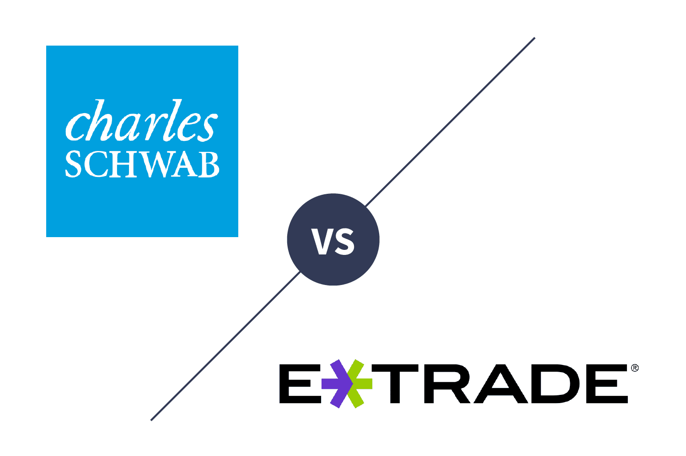

In the modern era of finance, technology plays a pivotal role in shaping how we invest. With the rise of online trading platforms, the accessibility and sophistication of investment tools have expanded significantly. Among the most prominent players in this space are E*TRADE and Charles Schwab, both renowned for providing a comprehensive suite of services to various investors. These platforms have revolutionized the way people engage with the financial markets by democratizing access to investment opportunities that were once reserved for institutional players.

Understanding the features and services offered by E*TRADE and Charles Schwab is crucial for investors aiming to make informed decisions that align with their financial goals. This article focuses particularly on algorithmic trading—an increasingly popular approach characterized by the use of advanced mathematical models and computational algorithms to execute trades. Both novice and experienced investors can benefit from the technological advancements these platforms offer, allowing them to optimize their trading strategies and potentially improve their returns.



The capabilities of E*TRADE and Charles Schwab highlight significant differences in their approach to catering to investor needs. E*TRADE is known for its user-friendly interface that appeals to tech-savvy individuals who prefer a customizable and automated trading experience. In contrast, Charles Schwab emphasizes comprehensive customer education and offers a blend of automated solutions and personalized financial advice, making it suitable for a broad range of investors.

By examining these platforms, investors can better understand how to leverage modern tools to enhance their trading efficiency. As technology continues to influence the financial landscape, staying informed about the latest developments in trading platforms and algorithmic trading is pivotal for those seeking to maximize their investment potential.

## Table of Contents

## Overview of E*TRADE Investment Platforms

E*TRADE, a pioneer in the world of online trading since the 1980s, has established itself as a leading platform renowned for its user-friendly interface and wide range of financial products. As a comprehensive investment platform, E*TRADE offers a variety of financial products including stocks, exchange-traded funds (ETFs), options, and futures. This diverse offering allows investors to create tailored portfolios that meet their individual financial goals and risk profiles.

The platform's strength lies in its robust research tools and resources, which provide valuable insights for both novice and seasoned investors. These tools include market analysis, stock screeners, and detailed analyst reports, which are crucial for making informed investment decisions. The accessibility and depth of these resources empower investors to perform thorough due diligence before making trading decisions.

E*TRADE’s mobile app and web platform enhance the trading experience by offering unparalleled flexibility and convenience. The mobile app, in particular, is designed with a focus on user experience, allowing investors to trade on-the-go without compromising on functionality. Key features include real-time streaming quotes, customizable watchlists, and advanced order types, ensuring that investors can respond swiftly to market changes.

Understanding the features and functionalities of E*TRADE's platform is essential for maximizing its benefits. By leveraging the platform's capabilities, investors can effectively manage their investments and achieve their financial objectives with greater confidence. In a rapidly evolving financial landscape, E*TRADE stands out as a formidable tool for both strategic investment planning and day-to-[day trading](/wiki/day-trading-spy) activities.

## Overview of Charles Schwab's Investment Platforms

Charles Schwab, a respected name in the financial industry, has a robust presence in the investment sector, offering a wide variety of services to meet the diverse needs of investors. The platform is known for providing multiple investment options, including mutual funds, bonds, and robo-advisors, enabling investors to customize their portfolios according to their specific investment goals and risk tolerance.

One of the standout features of Charles Schwab's investment platforms is its commitment to customer education. The company offers extensive learning resources and educational seminars that aim to empower investors with the knowledge required to make informed financial decisions. These resources cater to various levels of investor experience, from novice traders to seasoned professionals.

The platform's design reflects its versatility in addressing the needs of different types of investors. Beginners can access easy-to-use tools that simplify the investment process, while more advanced traders are provided with sophisticated tools and analytics to enhance their trading strategies. This dual focus ensures that investors at every level can find resources and tools that suit their investment style and objectives.

By fully understanding the offerings available on Charles Schwab's platform, investors can more effectively tailor their strategies to align with their financial goals. The platform’s comprehensive services and resources make it a compelling choice for those seeking a blend of traditional and cutting-edge investment solutions.

## Algorithmic Trading: Definition and Benefits

Algorithmic trading refers to the use of computer algorithms to [carry](/wiki/carry-trading) out trades automatically, processing large volumes at high speed. This method leverages advanced mathematical models and vast datasets to guide trading decisions with minimal human intervention. One of the primary advantages of [algorithmic trading](/wiki/algorithmic-trading) is its potential to enhance accuracy. By processing quantitative data, traders can execute complex strategies precisely, avoiding the pitfalls of manual trading.

The speed of execution is another critical benefit. Algorithms can complete trades within milliseconds, a crucial [factor](/wiki/factor-investing) in volatile markets where prices change rapidly. This speed not only allows traders to capitalize quickly on market opportunities but also reduces latency, the time delay between when a trading signal is generated and when it's executed. Faster execution can translate to better prices and improved profitability.

A notable benefit of algorithmic trading is the elimination of emotional bias. Human traders can often be swayed by fear, greed, or other emotions, leading to suboptimal decisions. Algorithms, however, follow predefined rules without deviation, ensuring that trades are executed strictly according to the strategy.

Algorithmic trading platforms utilize sophisticated models and extensive datasets to make informed trading decisions. These platforms often employ a variety of data inputs, including historical prices, market indicators, and even news sentiment analysis. By doing so, they can identify profitable trading opportunities that might be missed by human traders. For example, if an algorithm is designed to exploit mean reversion, it would automatically buy or sell when prices deviate from their historical average, based on statistical thresholds.

One fundamental concept used in algorithmic trading is moving averages. For instance, a simple algorithm might buy a stock when its short-term moving average crosses above its long-term moving average, indicating an upward trend. Here’s a simple implementation in Python:

```python
def simple_moving_average(data, window):
    return data.rolling(window=window).mean()

# Example usage with pandas
import pandas as pd

# Sample price data
prices = pd.Series([1, 2, 3, 4, 5, 6, 7, 8, 9, 10])

# Calculate 3-day moving average
moving_avg = simple_moving_average(prices, window=3)
print(moving_avg)
```

Investors are increasingly adopting algorithmic trading due to its potential to maximize returns while minimizing risks. By automating strategies, traders can backtest them against historical data, assess performance, and optimize their approaches before live trading. This process helps in reducing the risk of unexpected losses due to untested strategies.

To fully exploit the benefits of algorithmic trading, investors must understand its mechanics and advantages. This knowledge not only enables them to deploy effective trading systems but also empowers them to adapt to the rapidly evolving financial landscape, ensuring sustained competitiveness in the market.

## Algorithmic Trading on E*TRADE

E*TRADE facilitates algorithmic trading through a comprehensive array of tools and fostering a customizable platform for investors. Central to this offering is E*TRADE's suite of Application Programming Interfaces (APIs). These APIs empower investors to devise automated trading strategies, leveraging real-time market data to enhance their trading efficiency. The capability to access and manipulate data programmatically allows for the crafting of sophisticated trading algorithms that can operate autonomously, executing trades based on predefined criteria.

The platform is designed with a robust infrastructure to support high-frequency trading, ensuring that transactions are executed with speed and precision. E*TRADE provides a secure environment, fortified with advanced cybersecurity measures, to safeguard trading activities and sensitive investor information. This high level of security ensures that investors can focus on maximizing their trading strategies without concerns about the safety of their data.

Tech-savvy investors benefit significantly from mastering E*TRADE's algorithmic trading tools. The ability to customize and test algorithms in a reliable virtual environment facilitates the optimization of trading strategies. Investors can simulate different scenarios and implement continuous improvements to adapt to changing market conditions. Such flexibility is crucial for maintaining a competitive edge, allowing for real-time strategy adjustments and refined risk management.

In summary, E*TRADE offers a robust platform for those interested in exploiting algorithmic trading. Mastery of E*TRADE's tools and APIs provides a substantial advantage for traders seeking to enhance their operational efficiency through technology-driven solutions.

## Algorithmic Trading on Charles Schwab

Charles Schwab is notable for incorporating advanced algorithmic trading solutions into its investment management services. One of the key offerings is their Intelligent Portfolios, which combine automated trading with personalized financial advice. These portfolios utilize algorithms to select and manage a diversified mix of investments, aligning with the investor's risk preferences and financial goals. By leveraging statistical models and real-time data analysis, Schwab's algorithms can optimize asset allocation and rebalancing strategies, enabling consistent portfolio adjustment without requiring constant human intervention.

A significant feature of Schwab's trading platform is its smart order routing system. This system is designed to enhance trade execution by utilizing algorithms that dynamically assess market conditions and automatically determine the best venue for executing a trade. Smart order routing helps in achieving favorable prices and reducing the market impact, ultimately benefiting investors by potentially lowering transaction costs and improving the overall efficiency of trades.

Investors using Charles Schwab’s platform can gain from the adaptability of its algorithms, which are tailored to accommodate various investment aspirations. Whether targeting growth, income, or preservation of capital, Schwab’s technology applies sophisticated modeling techniques to manage portfolio risk and performance.

Understanding Schwab's method of algorithmic trading can significantly aid in optimizing portfolio management. By integrating automated systems with expert financial guidance, Schwab ensures their clients are not only supported by cutting-edge technology but are also able to receive professional insights that account for personal circumstances and long-term financial plans. This hybrid approach forms a strategic synergy, refining portfolio outcomes while maintaining alignment with investor intentions.

## Comparing E*TRADE and Charles Schwab in Algo Trading

E*TRADE and Charles Schwab stand out in the field of algorithmic trading through their distinct approaches, catering to varying investor preferences and goals. Each platform presents unique strengths and weaknesses that influence the decision-making process for investors aiming to employ algorithmic trading strategies effectively.

E*TRADE is particularly appealing to tech-savvy investors prioritizing customizable trading strategies. The platform offers advanced tools such as application programming interfaces (APIs) that allow users to tailor their trading algorithms according to specific needs. This customization provides the flexibility to design, test, and implement trading strategies that can adapt to changing market conditions. The detailed options available within E*TRADE attract those familiar with coding and algorithm development, enabling them to fine-tune strategies for potentially higher returns while managing risk.

Conversely, Charles Schwab presents a more advisory-oriented approach with a focus on automated portfolio management. Their intelligent portfolios offer a balance of automated trading tools and access to personalized financial advice, catered to those investors who prefer setting overarching goals and allowing the algorithms to manage day-to-day operations. This makes Charles Schwab an ideal choice for investors who value guidance and support in decision-making without needing extensive technical involvement in algorithm customization. Their approach combines efficiency with a level of personalization that targets the investor's broader financial objectives.

When choosing between these platforms, investors should consider the level of customizability, ease of use, and support services each provides. E*TRADE's tools are designed for individuals comfortable with technology and coding, offering robust features for those who wish to craft their own trading systems. In contrast, Charles Schwab focuses on ease of use and comprehensive advice, suitable for those who prefer a more hands-off approach while still benefiting from algorithmic efficiencies.

Analyzing these differences enables investors to align their choice of platform with their trading style. Those with a penchant for technology and algorithmic intricacies may find E*TRADE more beneficial, whereas investors seeking a blend of automation and advisory support might gravitate towards Charles Schwab. By assessing their needs, experience, and investment goals, investors can select the platform that best complements their strategies and objectives in the dynamic landscape of algorithmic trading.

## Tips for Investors Using Algo Trading

Algorithmic trading requires a strategic approach, starting with a well-defined investment strategy and clear goals. Having clarity about objectives can guide the development and implementation of algorithms, ensuring they are tailored to meet specific financial outcomes. This clarity also aids in evaluating the performance of the algorithms in achieving the desired goals.

Staying informed about market trends is crucial for investors utilizing algorithmic trading. Markets are dynamic, and algorithms must be regularly updated to reflect the latest data and economic indicators. Failing to keep algorithms current could result in outdated trading models that do not respond effectively to new market conditions. Continuous learning and adaptation are essential components of maintaining algorithm effectiveness.

Monitoring performance is integral to successful algorithmic trading. Investors should not assume that once an algorithm is deployed, it will indefinitely perform as expected. Instead, it is important to regularly assess its performance using metrics such as return on investment (ROI), Sharpe ratio, and maximum drawdown. Adjustments may be necessary to align the algorithm's functioning with market shifts and changing investment goals.

Risk management and diversification are fundamental aspects of any trading strategy, and this is particularly true in algorithmic trading. Investors should ensure that their chosen platforms offer robust tools for managing risk, such as stop-loss orders and portfolio diversification options. Diversification can help mitigate risks by spreading investments across different asset classes or markets.

Utilizing demo accounts provides an opportunity to test strategies without financial risk. Investors can observe how algorithms perform in real-time market conditions, allowing them to refine and optimize their strategies before full-scale implementation. This step is invaluable for ironing out potential issues and ensuring that the algorithm behaves as expected under different scenarios. 

By adhering to these guidelines, investors can enhance their experience with algorithmic trading, positioning themselves for more informed decision-making and potentially better financial outcomes.

## Conclusion

E*TRADE and Charles Schwab provide strong solutions in both traditional and algorithmic trading, catering to diverse investor needs. The decision to select the appropriate platform is contingent upon an individual's investment goals, experience level, and specific needs. Whether aiming for customizable strategies or an advisory approach with automated management, investors must align their choices with their objectives. Technology's integration into trading processes plays an indispensable role for contemporary investors striving for enhanced returns. Algorithmic trading contributes significant value, characterized by its precision, rapid execution, and strategic automation capabilities, which are designed to optimize profitability and mitigate risks.

As the financial landscape undergoes continuous evolution, maintaining awareness and understanding of these advancements is crucial for successful investing. Being informed and adaptable equips investors with the knowledge to harness the full potential of modern trading platforms. This proactive approach not only leverages the advantages of technology but also positions investors to navigate the complexities of the markets effectively.

## References & Further Reading

[1]: Bergstra, J., Bardenet, R., Bengio, Y., & Kégl, B. (2011). ["Algorithms for Hyper-Parameter Optimization."](https://papers.nips.cc/paper/4443-algorithms-for-hyper-parameter-optimization) Advances in Neural Information Processing Systems 24.

[2]: ["Advances in Financial Machine Learning"](https://www.amazon.com/Advances-Financial-Machine-Learning-Marcos/dp/1119482089) by Marcos Lopez de Prado

[3]: ["Evidence-Based Technical Analysis: Applying the Scientific Method and Statistical Inference to Trading Signals"](https://www.amazon.com/Evidence-Based-Technical-Analysis-Scientific-Statistical/dp/0470008741) by David Aronson

[4]: ["Machine Learning for Algorithmic Trading"](https://github.com/stefan-jansen/machine-learning-for-trading) by Stefan Jansen

[5]: ["Quantitative Trading: How to Build Your Own Algorithmic Trading Business"](https://books.google.com/books/about/Quantitative_Trading.html?id=j70yEAAAQBAJ) by Ernest P. Chan