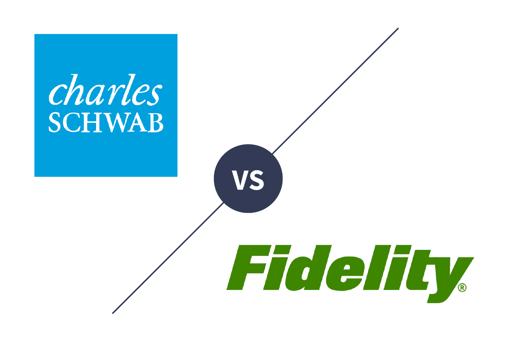

Fidelity Investments and Charles Schwab Corporation are two of the most prominent and respected names in the investment industry. Both firms have established themselves as leaders by offering a wide range of financial services and products to individual and institutional investors alike. Founded in 1946, Fidelity is known for its comprehensive investment solutions, including mutual funds, retirement services, and wealth management. Charles Schwab, established in 1971, is recognized for its discount brokerage services, helping to democratize investing by offering affordable and accessible trading options.

Algorithmic trading has become a cornerstone of modern investment management. It involves using computer algorithms to automate trading strategies, which can significantly enhance speed, efficiency, and accuracy in executing trades. In an era where milliseconds can make a difference, algorithmic trading enables investors to capitalize on market movements with precision. Its significance extends beyond just speed; it also reduces human error, enhances the ability to manage risk, and provides opportunities to backtest strategies on historical data.

This article aims to conduct a comprehensive comparison of Fidelity and Charles Schwab's algorithmic trading services. By analyzing their platforms, tools, costs, and overall effectiveness, the goal is to provide investors with insights into how these two giants stack up against each other in this field. Algorithmic trading strategies have evolved significantly over the years. Initially limited to institutional investors, advancements in technology have now made it accessible to individual traders. This evolution has led to increased competition among brokerage firms, each vying to offer the best technological solutions and customer support to meet the needs of a diverse clientele.

Choosing the right platform tailored to individual investment goals is crucial. The choice between Fidelity and Charles Schwab could impact the efficiency and success of an investor's trading strategy. Factors such as user interface, available tools, fees, and educational resources can all influence an investor's decision. As such, understanding the specific offerings and limitations of each firm will empower investors to make well-informed choices aligned with their financial objectives.

## Table of Contents

## Understanding Algorithmic Trading

Algorithmic trading, often referred to as algo trading, is the process of using computer algorithms to manage trading conditions and execute orders in financial markets automatically. These algorithms, programmed with specific instructions, can execute orders at speeds and frequencies that are impossible for a human trader, thereby enabling strategies that benefit from tiny price fluctuations or large diversification patterns.

The primary benefits of algorithmic trading are speed, efficiency, and accuracy. The speed at which algorithms can operate allows traders to capitalize on opportunities in milliseconds, executing the trade with minimal latency. This efficiency also translates into cost savings, as algorithms can function around the clock without the need for human intervention. Accuracy is another crucial aspect, as algorithms follow a set of pre-defined rules to the letter, minimizing the risk of human error that can occur during the trading process.

There are several common types of algorithms used in trading, each serving various strategic purposes. Market-making algorithms facilitate [liquidity](/wiki/liquidity-risk-premium) by constantly quoting buy and sell prices, thereby [earning](/wiki/earning-announcement) the bid-ask spread. Arbitrage algorithms are designed to exploit price differentials of the same asset across different markets. Trend-following algorithms capitalize on predictable price movements over time, while mean reversion strategies focus on the assumption that assets' prices will eventually return to their long-term mean. Sentiment-based strategies analyze social media, news articles, or other textual data to predict market movements based on public sentiment.

The importance of [algorithmic trading](/wiki/algorithmic-trading) extends to both individual and institutional investors. For institutional investors, algorithms are vital in managing large-scale trades without impacting the market price drastically, optimizing order execution to improve returns. Individual investors benefit from access to sophisticated trading strategies that were once the preserve of large institutions, leveling the playing field through technological advancements.

However, algorithmic trading is not without its risks and challenges. One of the potential risks includes the amplification of market [volatility](/wiki/volatility-trading-strategies); flash crashes have been partially attributed to the cascade of algorithmic sell orders. There's also the challenge of over-optimizing trading algorithms to historical data, a phenomenon known as curve fitting, which can lead to poor performance when applied to new data. Regulatory risks also exist, as algorithmic trading practices come under scrutiny for potentially creating unfair market conditions or being used for deceptive practices such as spoofing.

Overall, algorithmic trading presents both opportunities and challenges, requiring traders and institutions to balance innovation with due diligence to navigate the complexities of modern financial markets effectively.

## Fidelity Investments: An Overview

Fidelity Investments, established in 1946, holds a distinguished reputation as one of the leading brokerage firms in the United States. As a private company, Fidelity has remained family-owned and has consistently focused on innovation and client-focused services, leading to its recognition as a key player in the financial services industry. Fidelity provides a wide range of investment management services, retirement planning, and mutual fund offerings, making it an attractive option for both individual and institutional investors.

Fidelity has embraced the technological advancements in automated trading systems, recognizing the transformative potential of algorithmic trading in investment strategies. Algorithmic trading, which utilizes computer algorithms to execute trades at speeds and volumes impossible for human traders, has been one of the areas where Fidelity has actively developed its capabilities. Fidelity offers comprehensive algorithmic trading solutions that cater to the diverse needs of traders, ranging from individual investors to institutional clients.

To facilitate algorithmic trading, Fidelity employs advanced trading platforms that integrate cutting-edge technology. Fidelity's Active Trader Pro, for instance, is a robust platform providing real-time data analytics, charting tools, and customizable trading algorithms. This allows traders to optimize their trading strategies and automate decision-making processes. Additionally, Fidelity leverages [artificial intelligence](/wiki/ai-artificial-intelligence) and [machine learning](/wiki/machine-learning) to enhance the precision and effectiveness of its algorithmic trading functions.

The advantages of using Fidelity for algorithmic trading extend beyond technology. Fidelity is renowned for its extensive research tools and resources, providing clients with access to detailed market analysis, investment insights, and educational materials to support informed decision-making. Furthermore, Fidelity's customer service is well-regarded, offering personalized support to assist traders with any platform or trading-related queries.

However, Fidelity's approach to algorithmic trading is not without criticisms or limitations. Some traders may find the initial setup and configuration of algorithmic tools to be complex, particularly those who lack experience with advanced trading systems. Additionally, while Fidelity offers competitive pricing, its cost structures for using specific algorithmic features may not always be the lowest compared to all competitors, which could be a consideration for cost-sensitive traders.

Overall, Fidelity's commitment to integrating sophisticated technology with strong customer support and comprehensive research makes it a formidable choice for algorithmic trading. Nevertheless, potential users should weigh the firm's offerings against their specific trading needs and financial objectives to fully capitalize on what Fidelity provides.

## Charles Schwab: An Overview

### Charles Schwab: An Overview

Charles Schwab is a well-established entity in the investment industry, known for its comprehensive financial services. Founded in 1971, Schwab has grown into one of the largest brokerage firms in the United States, frequently recognized for its customer-centric approach and innovative offerings. With a history rooted in democratizing financial services, Charles Schwab has a longstanding reputation for providing retail investors access to markets that were traditionally reserved for institutional clients.

#### Services and Algorithmic Trading Capabilities

Charles Schwab offers a broad array of services including brokerage, retirement planning, wealth management, and banking solutions. Within its service portfolio, algorithmic trading stands out for its potential to enhance trading efficiency and accuracy. While Schwab does not specialize exclusively in algorithmic trading, it offers tools that support algorithm-based strategies. Clients can utilize automated trading systems to streamline the order placement process, execute trades at optimal times, and minimize human error.

#### Platforms and Technologies

Charles Schwab employs a suite of technologies designed to facilitate informed trading decisions. The Schwab Trading Services platform is a critical component, featuring StreetSmart Edge. This platform provides advanced tools and real-time analytics to support various trading strategies, including those that can be automated. Although Schwab's algo trading capabilities are not as extensive as some specialized platforms, the integration of data-driven insights into their technology empowers traders to refine their strategies.

#### Benefits of Choosing Charles Schwab

One of the key advantages of Charles Schwab for algorithmic trading is its emphasis on user experience. The intuitive design of Schwab's platforms simplifies complex trading operations, making it accessible even to less technologically adept clients. Schwab also invests heavily in educational resources, providing webinars, workshops, and tutorials to help traders optimize their use of algorithmic tools. These resources ensure that users not only execute trades but also understand the underlying market dynamics.

#### Potential Drawbacks and Areas for Improvement

While Charles Schwab offers a strong user experience and educational support, its algo trading capabilities may be seen as limited compared to specialized algorithmic trading platforms. These constraints could pose challenges for advanced traders seeking extensive algorithm customization or integration with external quantitative tools. Additionally, while Charles Schwab's platforms facilitate a robust trading experience, they could enhance their algo trading offerings by providing more sophisticated [backtesting](/wiki/backtesting) environments and expanding their API functionalities to allow for greater innovation and personalization in trading strategies.

In conclusion, Charles Schwab stands as a reputable choice for investors interested in a balanced platform that offers both traditional and modern trading capabilities. While there are areas for potential growth in algorithmic trading, its comprehensive educational resources and focus on customer experience make it a valuable contender in the investment landscape.

## Comparative Analysis: Fidelity vs. Charles Schwab in Algo Trading

Fidelity and Charles Schwab stand as two leading brokerage firms offering robust platforms for algorithmic trading. This section serves to compare these platforms across several key dimensions: tools and resources, fees, user experience, support services, and the overall effectiveness of their trading strategies.

### Tools and Resources

**Fidelity Investments** provides several advanced tools tailored for algorithmic trading. Among these is Active Trader Pro, which offers customizable charts, streaming market data, and advanced options analytics. Additionally, Fidelity provides a robust API that allows traders to integrate custom algorithms, facilitating real-time trading and data access.

In contrast, **Charles Schwab** integrates its algorithmic trading capabilities through StreetSmart Edge, a platform equipped with intuitive tools for both new and experienced traders. StreetSmart Edge offers a cloud-based trading experience, with features such as Strategy Tester, which allows traders to back-test trading ideas against historical market data. Schwab's API also provides programmatic access to trading functions and market data.

### Fees and Costs

Fees and costs are significant considerations for traders. Both Fidelity and Schwab offer commission-free trades for U.S. stocks, ETFs, and options, reducing the cost barriers for algorithmic traders. However, fees may accrue for additional services such as margin trading and access to premium data feeds.

For options trading, both platforms charge a per-contract fee, though these fees are comparable and competitive within the industry. Traders should consider these potential costs when developing and executing high-frequency trading strategies.

### User Experience and Support Services

**Fidelity** is known for its robust customer support, offering assistance through phone, chat, and in-person consultations at its numerous branch locations. The platform is generally praised for its ease of use, with intuitive navigation and helpful educational resources for beginners.

**Charles Schwab** also excels in providing a strong support network, featuring 24/7 customer service and comprehensive educational resources through its Learning Center. Schwab integrates financial education directly into its platform, guiding users toward more informed trading decisions. The firm’s focus on a user-friendly interface is evident, making its algorithmic trading tools accessible to a broader audience.

### Effectiveness and Reliability of Trading Strategies

Fidelity's platform emphasizes research and analytical tools to support algorithmic trading strategies. With a focus on data accuracy, Fidelity’s platform supports sophisticated analysis, bolstered by its extensive research reports and market insights.

Charles Schwab, meanwhile, centers on providing reliable execution of trading strategies with an emphasis on real-time data processing and robust simulation environments. The Strategy Tester in StreetSmart Edge is particularly useful for traders to assess the viability of their algo strategies, emphasizing Schwab's commitment to performance and reliability.

In conclusion, both Fidelity and Charles Schwab provide competitive offerings for algorithmic trading, with each platform offering distinct advantages. Fidelity's strength lies in its research tools and investor education, while Schwab excels in user-friendliness and comprehensive testing features. Traders should evaluate these aspects in context with their trading goals and preferences to select the most suitable platform for their needs.

## Choosing the Right Platform for You

When deciding between Fidelity and Charles Schwab for algorithmic trading, several factors should be taken into account to ensure alignment with individual investment goals and preferences.

### Personal Investment Goals

Personal investment goals play a crucial role in selecting the right platform for algorithmic trading. If your objective is short-term trading, you may prioritize a platform that offers advanced tools for real-time data analysis and execution speed. Conversely, long-term investors might seek platforms with robust research capabilities and market insights. Fidelity, for example, is renowned for its comprehensive research resources and analytical tools, which may appeal to investors looking for in-depth market analysis. Charles Schwab, with its educational resources, may be more suitable for those interested in continuous learning and strategy development.

### Experience Level

The experience level of the investor is another critical [factor](/wiki/factor-investing). Novice traders may prefer platforms with intuitive interfaces and strong customer support. Charles Schwab provides an extensive array of educational materials and a user-friendly interface, which could benefit beginners. Conversely, experienced traders might prioritize platforms offering customization in algorithms and backtesting capabilities. Fidelity's platform, known for its sophisticated tools and robust trading technology, might cater to such traders.

### Aligning Features with Trading Strategies

Aligning platform features with individual trading strategies is essential for effective algorithmic trading. Traders who employ complex strategies may require platforms that support custom scripting and advanced order types. Both Fidelity and Charles Schwab offer customizable platforms, but Fidelity is noted for its ability to integrate third-party applications and provide flexible trading options, which can be advantageous for complex strategy deployment.

### Tips for Making an Informed Decision

To make an informed decision, consider evaluating the following:

1. **Cost Structure**: Analyze the fees associated with trading on each platform, including commissions, margin rates, and service fees, which can significantly affect net returns.

2. **Platform Usability**: Test the user interface of both platforms through demo accounts if available. A platform's usability can impact trading efficiency and satisfaction.

3. **Support Services**: Consider the level of customer service and support offered by each firm. Prompt and effective support can be crucial during trading activities.

4. **Technology and Security**: Evaluate the technological infrastructure and security measures in place to protect your investments and personal data.

In conclusion, selecting the right platform for algorithmic trading between Fidelity and Charles Schwab involves a comprehensive assessment of your personal goals, experience, and trading requirements. By aligning these aspects with the offerings of each platform, investors can enhance their trading effectiveness and experience.

## Conclusion

In comparing Fidelity and Charles Schwab for algorithmic trading, several key findings emerge that are crucial for making informed investment decisions. Both Fidelity and Charles Schwab offer robust platforms that integrate advanced technology and extensive resources, yet they differ in their specific offerings and user experiences.

Fidelity stands out for its comprehensive research tools and customer service, making it an attractive choice for investors who prioritize detailed market analysis and support. The firm leverages cutting-edge platforms to facilitate efficient algorithmic trading, providing a solid foundation for both novice and experienced traders. However, some limitations exist, such as potential complexity in navigating its extensive tools, which may not suit every investor's needs.

Conversely, Charles Schwab excels in user experience and educational resources, offering a more intuitive interface for investors who value accessibility and learning materials. Their platform is well-suited for those at various stages of their trading journey, particularly beginners. Yet, there are areas for improvement, such as the need to enhance certain advanced trading capabilities and perhaps reduce fees to stay competitive.

The choice between Fidelity and Charles Schwab ultimately hinges on individual investment goals, experience levels, and the specific features that each investor values. Selecting the right platform is vital for optimizing algorithmic trading strategies, ensuring alignment with personal financial objectives and risk tolerance levels.

Investors are encouraged to conduct further research, considering their unique circumstances and preferences. As technology continues to evolve, it brings transformative changes to investment management, introducing sophisticated tools and increased automation. The rapid advancements in artificial intelligence and machine learning, for instance, will likely influence the future landscape of algorithmic trading, offering new opportunities for efficiency and strategy enhancement.

Readers are advised to continually explore their options and remain informed about the latest technological developments. By doing so, they can harness the full potential of algorithmic trading, making decisions that best align with their financial goals and adapting to the ever-evolving market conditions.

## References

1. M. Sewell, "History of Algorithmic Trading," University of Cambridge, 2011. Available at: http://www.algorithmic-trading.net/history.pdf

2. J. Hasbrouck, and G. Saar, "Low-Latency Trading," Journal of Financial Markets, vol. 16, no. 4, pp. 646-679, 2013.

3. A. Kearns and Y. Nevmyvaka, "Machine Learning for Market Microstructure and High-Frequency Trading", in High-Frequency Trading: A Practical Guide to Algorithmic Strategies and Trading Systems, Wiley, 2013.

4. B. Van Vliet and E. Dhamija, High-Frequency Trading: A Practical Guide to Algorithmic Strategies and Trading Systems, 2nd ed., Wiley, 2017.

5. Fidelity Investments. (n.d.). Our Investment Products. Retrieved September 25, 2023, from https://www.fidelity.com/products

6. Charles Schwab. (n.d.). Automated Investing. Retrieved September 25, 2023, from https://www.schwab.com/automated-investing

7. M. Aldridge, High-Frequency Trading: A Practical Guide to Algorithmic Strategies and Trading Systems, Wiley, 2013.

8. A. Arnuk and J. Saluzzi, Broken Markets: How High Frequency Trading and Predatory Practices on Wall Street are Destroying Investor Confidence and Your Portfolio, FT Press, 2012.

9. L. Harris, Trading and Exchanges: Market Microstructure for Practitioners, Oxford University Press, 2003.

10. M. P. Murray, An Efficiency-Model Approach to Algorithmic Trading, Routledge, 2020.

For more information on algo trading services and platforms, you may access the official websites of [Fidelity Investments](https://www.fidelity.com) and [Charles Schwab](https://www.schwab.com).

## References & Further Reading

[1]: Sewell, M. (2011). ["History of Algorithmic Trading."](https://onlinelibrary.wiley.com/doi/pdf/10.1002/9781119206033.ch1) University of Cambridge.

[2]: Hasbrouck, J., & Saar, G. (2013). ["Low-Latency Trading."](https://www.sciencedirect.com/science/article/abs/pii/S1386418113000165) Journal of Financial Markets, 16(4), 646-679.

[3]: Kearns, M., & Nevmyvaka, Y. (2013). "Machine Learning for Market Microstructure and High-Frequency Trading." In High-Frequency Trading: A Practical Guide to Algorithmic Strategies and Trading Systems, Wiley.

[4]: Van Vliet, B., & Dhamija, E. (2017). ["High-Frequency Trading: A Practical Guide to Algorithmic Strategies and Trading Systems,"](https://www.sciencedirect.com/science/article/abs/pii/S0148296316304908) 2nd ed., Wiley.

[5]: Arnuk, A., & Saluzzi, J. (2012). ["Broken Markets: How High Frequency Trading and Predatory Practices on Wall Street are Destroying Investor Confidence and Your Portfolio,"](https://ptgmedia.pearsoncmg.com/images/9780132875240/samplepages/0132875241.pdf) FT Press.

[6]: Harris, L. (2003). ["Trading and Exchanges: Market Microstructure for Practitioners,"](https://books.google.com/books/about/Trading_and_Exchanges.html?id=xNfnCwAAQBAJ) Oxford University Press.

[7]: Murray, M. P. (2020). ["An Efficiency-Model Approach to Algorithmic Trading,"](https://journals.sagepub.com/doi/full/10.1177/2053951720926558) Routledge.