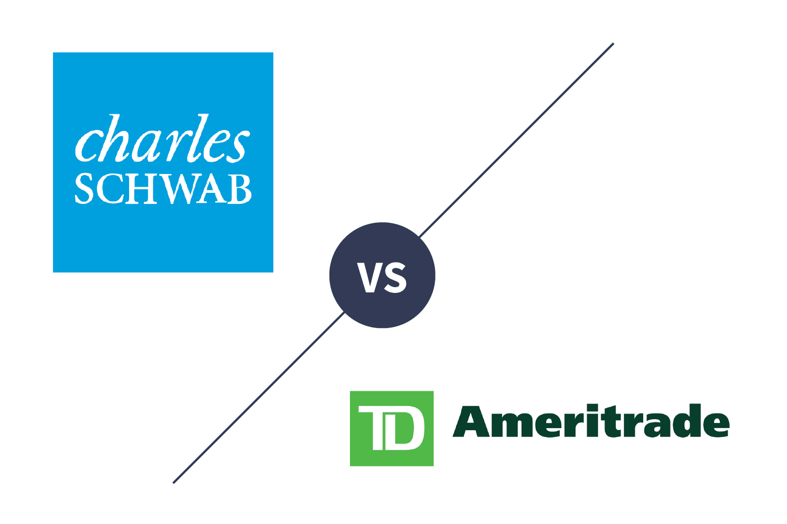

## Table of Contents

## What are Charles Schwab and TD Ameritrade?

Charles Schwab is a company that helps people invest their money. It offers different ways for people to save and invest, like buying stocks, bonds, and mutual funds. They also have bank accounts and other financial services. Charles Schwab makes it easy for people to manage their money by using their website or mobile app.

TD Ameritrade is another company that helps people with investing. Like Charles Schwab, it allows people to buy and sell stocks, bonds, and other investments. They also offer tools and resources to help people learn about investing and make good choices. TD Ameritrade has a user-friendly platform that people can access online or through a mobile app.

## How do the account opening processes differ between Charles Schwab and TD Ameritrade?

To open an account with Charles Schwab, you start by visiting their website or using their mobile app. You'll need to fill out an online application form with your personal information, like your name, address, and Social Security number. After submitting the form, you'll need to fund your account, which you can do by transferring money from your bank account or mailing a check. Once your account is funded, you can start investing. Charles Schwab may also ask for additional documents or information to verify your identity and comply with regulations.

Opening an account with TD Ameritrade is similar, but there are a few differences. You begin by going to their website or using their mobile app and completing an online application. You'll provide your personal details, including your name, address, and Social Security number. After submitting your application, you'll need to fund your account, which can be done by transferring money from your bank or sending a check. Once your account is funded, you're ready to start investing. Like Charles Schwab, TD Ameritrade may request additional verification to meet regulatory requirements.

## What are the fee structures for trading stocks at Charles Schwab and TD Ameritrade?

At Charles Schwab, you can trade stocks without paying any commission fees. This means you don't have to pay extra money just to buy or sell stocks. However, there might be other fees for things like transferring your account to another broker or if you need paper statements mailed to you. It's a good idea to check their website or talk to a representative to understand all the possible fees.

At TD Ameritrade, trading stocks is also free of commission fees. You won't have to pay to buy or sell stocks. But, like Charles Schwab, there could be other fees for services like account transfers or paper statements. It's important to look at their fee schedule on their website or ask a representative to make sure you know about any additional costs.

## How do the platforms of Charles Schwab and TD Ameritrade compare in terms of user experience?

Charles Schwab's platform is designed to be easy to use for everyone. When you log in, you'll see a clean layout that makes it simple to find what you need. The website and app both work well and are fast. They have tools to help you research and choose investments, like charts and reports. If you need help, you can easily reach customer support through chat, phone, or email. Overall, Charles Schwab's platform feels friendly and supportive for both new and experienced investors.

TD Ameritrade's platform also focuses on a good user experience. Their website and app are user-friendly with a clear design. They offer lots of educational resources, like videos and tutorials, which are great if you're new to investing. The platform includes advanced tools for people who want to do more detailed research. Customer service is easy to access, with options like live chat and phone support. TD Ameritrade's platform feels welcoming and is packed with tools to help you learn and grow as an investor.

## What investment products are available at Charles Schwab and TD Ameritrade?

At Charles Schwab, you can invest in many different things. They offer stocks, which are shares in companies, and bonds, which are like loans you give to companies or the government. You can also invest in mutual funds, which are collections of stocks and bonds managed by professionals, and exchange-traded funds (ETFs), which are similar to mutual funds but trade like stocks. Charles Schwab also has options for retirement accounts like IRAs, and they offer services for managing your money, like robo-advisors that use computers to help you invest.

At TD Ameritrade, you'll find a wide range of investment options too. They let you buy and sell stocks and bonds, just like Charles Schwab. They also offer mutual funds and ETFs, giving you lots of choices for how to invest your money. TD Ameritrade has retirement accounts like IRAs, and they provide tools like robo-advisors to help you make smart investment choices. Both companies make it easy for you to find and invest in different products that fit your goals.

## How do the research tools provided by Charles Schwab and TD Ameritrade differ?

Charles Schwab offers a lot of tools to help you learn about investments. They have reports and charts that show how stocks and other investments are doing. You can also read articles and watch videos to understand more about the market. If you like to do your own research, Charles Schwab's tools can help you make good choices. Their website and app make it easy to find all this information and use it to plan your investments.

TD Ameritrade also gives you many tools for research. They have a lot of educational content, like videos and tutorials, which are great if you're new to investing. You can use their charts and reports to see how different investments are performing. TD Ameritrade's platform is full of resources to help you learn and make smart investment decisions. Both companies want to help you understand the market, but TD Ameritrade focuses a bit more on teaching beginners.

## What are the margin rates at Charles Schwab compared to TD Ameritrade?

At Charles Schwab, the margin rates depend on how much money you have in your account. If you have a smaller amount, like less than $25,000, you might pay a higher rate, around 13.575%. But if you have more money, say over $1 million, the rate goes down to about 11.825%. So, the more money you have, the less you pay to borrow on margin.

At TD Ameritrade, the margin rates work the same way. If your account balance is under $10,000, you'll pay a higher rate, which is about 14.50%. If your balance is over $1 million, the rate drops to around 12.25%. Like Charles Schwab, the more money you have, the lower the margin rate you'll pay.

## How do Charles Schwab and TD Ameritrade support retirement accounts like IRAs?

Charles Schwab makes it easy to save for retirement with their IRA accounts. You can open a traditional IRA, where you might get a tax break now, or a Roth IRA, where you pay taxes now but can take the money out tax-free later. They have tools to help you pick investments for your IRA, like stocks, bonds, and mutual funds. If you need help, you can talk to their advisors who can give you advice on how to save for retirement. Charles Schwab also lets you move money from other retirement accounts into their IRAs without any fees.

TD Ameritrade also helps you plan for retirement with their IRA options. They offer traditional and Roth IRAs, so you can choose what works best for your taxes. Their platform has lots of resources to help you learn about saving for retirement, like videos and articles. You can invest in different things like stocks, bonds, and ETFs. If you're not sure what to do, their advisors can help you make a plan. TD Ameritrade makes it simple to roll over money from other retirement accounts into their IRAs.

## What customer service options are available at Charles Schwab and TD Ameritrade?

At Charles Schwab, you can get help in many ways. You can call them on the phone and talk to someone who knows a lot about investing. They also have a chat service on their website where you can ask questions and get quick answers. If you like to write, you can send them an email and they will respond to help you. They even have branches where you can go and talk to someone in person if you want. Charles Schwab wants to make sure you can get the help you need, no matter how you like to ask.

TD Ameritrade also offers lots of ways to get customer service. You can call them and talk to a friendly person who can help you with your questions. They have a live chat on their website too, so you can get help right away. If you prefer to write, you can email them and they will get back to you. TD Ameritrade also has places where you can visit in person if you want to talk face-to-face. They want to make sure you feel supported and can get help easily.

## How do the mobile trading apps of Charles Schwab and TD Ameritrade compare in functionality?

Charles Schwab's mobile app makes it easy to buy and sell stocks, bonds, and other investments right from your phone. The app is simple to use, with a clean look that helps you find what you need quickly. You can check how your investments are doing, get news about the market, and even talk to customer service if you have questions. The app also lets you set up alerts so you know when something important happens with your investments. Overall, Charles Schwab's app is great for people who want to manage their money on the go.

TD Ameritrade's mobile app is also user-friendly and lets you trade stocks, bonds, and more from your phone. The app has a lot of tools to help you learn about investing, like videos and tutorials, which are great if you're new to this. You can see how your investments are doing, read news, and contact customer service easily. The app lets you set up alerts too, so you stay updated on your investments. TD Ameritrade's app is packed with features that help both new and experienced investors manage their money from anywhere.

## What advanced trading features does Charles Schwab offer that TD Ameritrade may not?

Charles Schwab has some special tools for people who really know about trading. They have something called thinkorswim, which is a powerful platform that lets you do things like trade options and futures. This tool gives you lots of charts and data to help you make smart choices. You can also use it to set up different kinds of orders, like stop-loss orders, which help you control risk. If you like to do a lot of trading and need advanced tools, Charles Schwab's thinkorswim can be really helpful.

TD Ameritrade also has the thinkorswim platform, so they offer the same advanced features as Charles Schwab in that regard. Both companies let you use thinkorswim to trade options, futures, and use all the advanced charts and data. So, if you're looking for advanced trading features, you'll find the same powerful tools at both Charles Schwab and TD Ameritrade. The main difference is that Charles Schwab might be better known for its other services, like banking, while TD Ameritrade focuses a lot on education and tools for new investors.

## How do the wealth management and advisory services differ between Charles Schwab and TD Ameritrade?

Charles Schwab has different ways to help you with your money. They have something called Schwab Intelligent Portfolios, which is a robo-advisor. This means a computer helps you pick investments based on what you want. If you need more help, you can talk to a real person through their Schwab Intelligent Portfolios Premium service. They also have financial advisors who can give you personal advice and help you make a plan for your money. Charles Schwab wants to help everyone, no matter how much money you have, so they have different services to fit different needs.

TD Ameritrade also helps you manage your money with their robo-advisor called Essential Portfolios. It's a computer that picks investments for you based on what you tell it. If you want to talk to a real person, you can use their Selective Portfolios service, where advisors help you make choices. TD Ameritrade also has financial advisors who can give you personal advice and help you plan for the future. Both companies want to help you with your money, but TD Ameritrade focuses a lot on teaching you about investing and has lots of tools to help you learn.

## References & Further Reading

[1]: Bergstra, J., Bardenet, R., Bengio, Y., & Kégl, B. (2011). ["Algorithms for Hyper-Parameter Optimization."](https://papers.nips.cc/paper/4443-algorithms-for-hyper-parameter-optimization) Advances in Neural Information Processing Systems 24.

[2]: ["Advances in Financial Machine Learning"](https://www.amazon.com/Advances-Financial-Machine-Learning-Marcos/dp/1119482089) by Marcos Lopez de Prado

[3]: ["Evidence-Based Technical Analysis: Applying the Scientific Method and Statistical Inference to Trading Signals"](https://www.amazon.com/Evidence-Based-Technical-Analysis-Scientific-Statistical/dp/0470008741) by David Aronson

[4]: ["Machine Learning for Algorithmic Trading"](https://github.com/PacktPublishing/Machine-Learning-for-Algorithmic-Trading-Second-Edition) by Stefan Jansen

[5]: ["Quantitative Trading: How to Build Your Own Algorithmic Trading Business"](https://github.com/LucindaYa/quant-resources/blob/master/Quantitative%20Trading%20How%20to%20Build%20Your%20Own%20Algorithmic%20Trading%20Business.pdf) by Ernest P. Chan