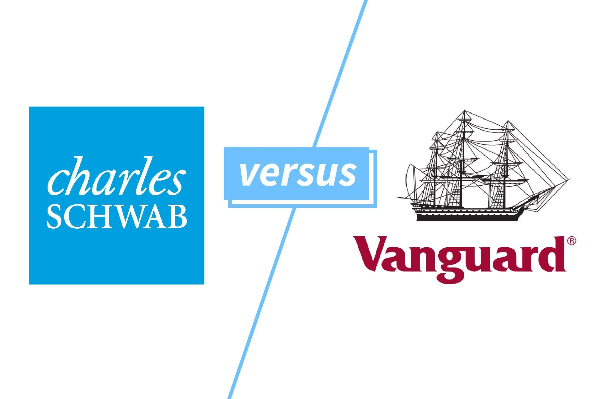

In today's financial markets, investment platforms play a pivotal role, serving as gateways for a diverse range of investors to access various financial products and services. These platforms have democratized investment by providing individual investors with tools and resources previously available only to professionals. Among the most significant advancements in recent years is the rise of algorithmic trading, a method that uses computer algorithms to execute trades at speeds and frequencies that surpass human capabilities. This development has transformed the investment landscape by allowing for more efficient and precise trading, enhancing market liquidity, and potentially improving returns.

Vanguard and Charles Schwab are two prominent investment platforms that offer distinct advantages to their users. Vanguard is renowned for its client-owned structure and focus on low-cost, long-term investing, primarily through index funds and ETFs. Its philosophy revolves around providing investors with a diversified array of passive investment options that minimize fees and maximize returns over time. On the other hand, Charles Schwab provides a comprehensive suite of financial services, combining both traditional brokerage offerings with innovative technology solutions, including advanced algorithmic trading tools. Schwab's approach caters to a broad spectrum of investment needs, from individual to institutional clients, emphasizing flexibility and technological integration.

The purpose of this article is to provide a comparative analysis of Vanguard and Charles Schwab, with a particular focus on their respective approaches to algorithmic trading. It will examine the investment strategies employed by both platforms, assess the algorithmic tools they offer, and evaluate their customer support services and educational resources. By highlighting the pros and cons associated with each platform, this article aims to assist investors in making informed decisions that align with their individual financial goals and preferences.

Readers can expect to gain insights into Vanguard's long-term, cost-effective investment philosophy and its limited engagement with algorithmic trading. Additionally, the article will explore Charles Schwab's diverse investment approach, including its extensive use of technology in trading operations. The analysis will conclude with a discussion on the advantages and drawbacks of each platform, encouraging readers to consider which factors are most important to them in an investment platform.

## Table of Contents

## Overview of Vanguard's Investment Strategy

Vanguard's investment strategy is anchored in its commitment to long-term, low-cost investing, a philosophy that has positioned the firm as a leader in the financial market. Founded in 1975 by John C. Bogle, Vanguard revolutionized the investment industry by introducing the first index mutual fund accessible to individual investors. This innovation was in line with Bogle's vision of creating a firm that prioritizes investor value through low fees and passive investment strategies.

Vanguard's core investment philosophy emphasizes keeping costs low, believing that minimizing expenses results in higher net returns for investors. The company offers a broad spectrum of investment products, including mutual funds, exchange-traded funds (ETFs), stocks, and bonds. However, Vanguard is perhaps best known for its index funds, which are designed to match the performance of specific market indexes and have become a cornerstone of its investment offerings.

The suite of investment products at Vanguard includes a diverse range of mutual funds and ETFs that cater to various risk profiles and investment objectives. Vanguard's mutual funds are primarily index funds, which aim to replicate the performance of a specific index, such as the S&P 500, by holding a portfolio of all or a representative sample of the securities in that index. The emphasis on passive investment strategies through index funds aligns with the company's belief that, over the long term, these strategies can outperform actively managed funds by reducing costs and mitigating the impact of market [volatility](/wiki/volatility-trading-strategies).

In terms of algorithmic tools and technologies, Vanguard employs data-driven investment techniques to enhance efficiency and support decision-making processes. While Vanguard's focus remains largely on passive strategies, the company does utilize quantitative analysis and risk management tools to optimize investment performance and manage portfolios. These technologies assist in the precise replication of index performance and in risk evaluation, ensuring adherence to Vanguard's disciplined investment approach.

In summary, Vanguard's investment strategy is characterized by its dedication to providing low-cost, high-value investment options, predominantly through passive investment vehicles like index funds and ETFs. This approach, combined with the integration of algorithmic analysis, continues to offer investors a robust framework for achieving their long-term financial goals.

## Overview of Charles Schwab's Investment Approach

Charles Schwab, a prominent name in the financial services sector, offers an extensive range of investment options and services designed to cater to both individual and institutional investors. Founded in 1971, Charles Schwab played a pivotal role in transforming the brokerage industry by pioneering the concept of discount brokerage, thus making investing more accessible to the average American. Over the decades, Schwab has established itself as a leader by continually innovating and expanding its range of services to encompass not just trading, but comprehensive financial solutions.

### Historical Background

Charles Schwab's journey began as a small investment advisory newsletter. In 1975, following the deregulation of brokerage commissions, the firm launched one of the country's first discount brokerages. This democratization of investment options led to the exponential growth of Schwab, establishing it as a formidable force in the brokerage industry. Today, the company stands as a giant in the financial market, offering a broad spectrum of investment products and services, ranging from traditional brokerage accounts to sophisticated wealth management solutions.

### Investment Products and Services

Charles Schwab provides a diverse array of investment products tailored to meet various investor needs. These include:

- **Individual Brokerage Accounts**: Schwab offers flexible accounts for self-directed investors, providing access to a wide range of securities including stocks, bonds, mutual funds, and ETFs.

- **Managed Portfolios**: For investors seeking professional management, Schwab offers a variety of portfolio management services, such as Schwab Intelligent Portfolios—a robo-advisory service offering algorithmically-driven investment management.

- **Retirement Accounts**: Schwab supports various retirement savings vehicles including IRAs, Roth IRAs, and 401(k) rollovers, catering to both individual savers and corporate clients.

### Technological Integration in Trading

Charles Schwab has consistently been at the forefront of integrating technology into the trading process, enhancing the ease and efficiency of execution for its clients. The platform offers sophisticated [algorithmic trading](/wiki/algorithmic-trading) tools designed to automate and optimize trade execution. These tools leverage advanced algorithms to facilitate strategic decision-making, enabling investors to capitalize on market movements with precision.

Schwab's technology-enabled trading capabilities support both active and passive investment strategies, allowing users to customize their approaches according to their risk tolerance and financial goals. Active traders benefit from real-time data, advanced charting tools, and customizable screeners to refine their strategies. On the other hand, passive investors are catered to with automated portfolio balancing and tax-loss harvesting via Schwab's robo-advisory services.

### Active and Passive Investment Strategies

Schwab's investment approach accommodates a blend of both active and passive strategies:

- **Active Trading**: For traders who are hands-on, Schwab offers platforms replete with real-time insights, research tools, and trading alerts. This empowers investors to actively engage with market trends and make informed decisions quickly.

- **Passive Investment**: Schwab also supports a passive investment philosophy through its low-cost index mutual funds and ETFs. The Schwab Intelligent Portfolios, in particular, provide automated wealth management, aligning portfolios with investors' financial goals while minimizing fees and human intervention.

In summary, Charles Schwab’s investment approach underscores a commitment to versatility, technology integration, and client-centric services. By offering a comprehensive suite of products and innovative trading solutions, Schwab stands out as a progressive choice for investors seeking tailored financial strategies.

## Comparative Analysis of Algorithmic Trading

Algorithmic trading, often referred to as algo trading, involves the use of computer algorithms to automate trading decisions and executions. It plays a critical role in modern financial markets by enhancing trade execution efficiency, reducing human error, and enabling high-frequency trading strategies. As such, it is an important element for many investment platforms looking to offer advanced trading capabilities to their clients.

### Algorithmic Trading Tools at Vanguard and Charles Schwab

**Vanguard's Algorithmic Trading Tools:**

Vanguard is traditionally recognized for its emphasis on passive investing and cost-efficiency. Hence, its algorithmic trading offerings are designed to complement long-term investment strategies rather than facilitate high-frequency trading. Vanguard employs various algorithmic tools to optimize the execution of its index fund trades. This includes employing algorithms that minimize market impact and transaction costs during large [volume](/wiki/volume-trading-strategy) trades. However, Vanguard does not prominently feature standalone algorithmic trading tools for individual investors, reflecting its focus on long-term, passive strategies.

**Charles Schwab's Algorithmic Trading Tools:**

In contrast, Charles Schwab offers a wider range of algorithmic trading tools targeted at individual investors under its brokerage services. Schwab’s StreetSmart Edge® is an advanced trading platform that provides sophisticated tools and customizable automation options. With features like real-time analytics, customizable trading algorithms, and advanced order types, it caters to both active and passive investors. Schwab's platform supports automated trading via API access, allowing tech-savvy investors to deploy and test custom algorithms.

### Features and Benefits

**Vanguard:**

- **Cost Efficiency:** Vanguard's algo tools align with its low-cost ethos, primarily focusing on minimizing transaction costs during fund management.
- **Simplicity:** The straightforward nature of Vanguard’s algo interactions ensures ease of use for investors focused on long-term strategies.

**Charles Schwab:**

- **Advanced Customization:** Schwab’s platform allows for in-depth customization, which benefits traders seeking to implement specific strategies.
- **Comprehensive Tools:** Features like real-time analytics and customizable automation facilitate informed trading decisions and enhanced user engagement.

### User Experience and Accessibility

**Vanguard:** 

Users benefit from a streamlined experience oriented towards low-risk, long-term investments. The algorithmic tools are mostly integrated within fund management operations, which might limit their direct interaction and customization options for individual investors.

**Charles Schwab:**

Schwab offers a user-centric design in its trading platforms with extensive educational resources and tutorials. The user interface is intuitive for traders familiar with advanced platforms, enhancing accessibility for a broad user base, from novice to expert traders.

### Costs and Associated Fees

**Vanguard:** 

Staying true to its principle of low costs, Vanguard's fees for algorithmic trading tools are generally embedded within the expense ratios of their funds. As such, these costs are indirect and are aimed at minimizing the overall expense borne by investors.

**Charles Schwab:**

Schwab's offering of algorithmic tools may come with additional fees depending on the specific services utilized, such as premium trading features or API access for automated trading. However, Schwab often provides competitive pricing structures to accommodate different investor needs with varying levels of tool access.

In conclusion, the choice between Vanguard and Charles Schwab for algorithmic trading largely depends on an investor's specific needs and trading style. Vanguard's focus remains on long-term cost minimization through modest algorithmic integration, while Schwab presents a robust suite of customizable trading tools suitable for more active and tech-savvy investors.

## Customer Support and Educational Resources

Vanguard and Charles Schwab, two leading investment platforms, provide distinct customer support services and educational resources tailored to the needs of their investors, with specific emphasis on algorithmic trading.

### Customer Support Services

**Vanguard** offers comprehensive customer support through multiple channels, including phone support, email assistance, and an extensive online resource center. However, Vanguard does not offer live chat support, which can be a limitation for those who prefer real-time digital communication. Its in-person consultation services are primarily accessible to wealthier clients enrolled in their advisory programs, potentially limiting access for newer investors.

In contrast, **Charles Schwab** provides robust customer support options, incorporating live chat, 24/7 phone support, and email communications. Additionally, Schwab's physical branches allow clients to meet financial consultants face-to-face, enhancing customer interaction and support. This extensive network of support mechanisms is indicative of Schwab's commitment to customer service accessibility.

### Educational Resources

Vanguard places strong emphasis on investor education, offering a wide range of tutorials, FAQs, and articles through its online learning center. While it provides resources on various investing topics, specific resources on algorithmic trading are limited. Vanguard's approach is more focused on educating investors about low-cost, long-term investment strategies, aligning with its passive investment philosophy.

Charles Schwab, conversely, excels in providing a more diverse educational suite. It offers webinars, in-person workshops, and extensive tutorials that cover both basic and advanced topics, including algorithmic trading. Schwab's educational resources aim to enhance investors' understanding of complex trading strategies, making them particularly valuable for those interested in leveraging sophisticated tools for active trading.

### Reputation and Accessibility

Vanguard's customer service reputation is generally positive, though some reviews indicate room for improvement, particularly in terms of accessibility and response times. This feedback suggests that while Vanguard is effective in providing necessary support, its services could benefit from modernization, such as integrating live chat options.

Charles Schwab's customer service is highly regarded, with consistently high ratings for responsiveness and accessibility. The availability of multiple support channels and the option for in-person consultations likely contribute to its favorable reputation. Schwab's commitment to service excellence is reflected in numerous customer reviews praising the ease of access and quality of advice provided by its representatives.

### Learning Materials and Investor Support

Both Vanguard and Charles Schwab provide a range of learning materials to aid investors in decision-making. Vanguard's materials tend to focus on foundational investment knowledge, encouraging a long-term view. Charles Schwab offers more comprehensive learning pathways, including materials that address the intricacies of algorithmic and active trading strategies. Schwab’s resources are frequently updated and aligned with current market trends, which is beneficial for investors seeking timely educational content.

In summary, while Vanguard offers solid customer support and educational resources aligned with its investment philosophy, Charles Schwab's comprehensive approach to both support and education, particularly regarding algorithmic trading, makes it a strong contender for investors seeking a more interactive and informed investment experience.

## Pros and Cons of Vanguard and Charles Schwab

Vanguard and Charles Schwab are two renowned investment platforms, each offering distinct advantages and potential drawbacks that might influence an investor's decision.

Vanguard is well-known for its commitment to low-cost investing. As a pioneer of index funds, Vanguard's low-fee structure and emphasis on passive, long-term investment strategies make it an attractive option for cost-conscious investors. The platform's extensive array of mutual funds and Exchange-Traded Funds (ETFs) offers diversification opportunities that align with its philosophy of minimizing expenses to maximize investor returns over the long term. A typical formula to illustrate Vanguard's fee advantage might be the Total Expense Ratio (TER), defined as:

$$
\text{TER} = \frac{\text{Total Fund Costs}}{\text{Average Net Assets}}
$$

Vanguard’s TER often remains lower than its competitors.

However, Vanguard's focus on low-cost, passive investing means its algorithmic trading features are not as developed as some investors might desire. This limitation can be a drawback for traders who wish to leverage advanced algorithmic tools to optimize trading strategies or to participate actively in volatile markets.

Conversely, Charles Schwab offers a comprehensive suite of trading tools and a broader range of services catering to diverse investment needs. Schwab's user-friendly platform supports active trading through a variety of innovative tools, including algorithmic trading capabilities that provide investors with more opportunities to engage in tactical, short-term market plays. This aligns with investors seeking a more hands-on approach to managing their investments.

Another advantage of Schwab is its robust customer support and educational resources, which are valuable for investors looking to expand their knowledge and confidence in trading. Schwab also offers managed portfolio options, catering to those who prefer professional guidance.

Despite these strengths, Schwab’s fees can sometimes be higher compared to Vanguard's, potentially impacting the net gains of investors who are particularly fee-sensitive. For example, commission structures or management fees in some account types could outweigh the benefits of Schwab's advanced tools, especially for those focusing on a passive investment strategy.

Investors are encouraged to assess these factors based on their unique financial goals and priorities. For cost-sensitive investors prioritizing long-term growth, Vanguard's low-cost options could be appealing. However, those who value comprehensive trading tools and are willing to incur higher fees for advanced features might find Charles Schwab more suitable. Ultimately, the choice between these platforms should reflect an individual’s investment strategy, risk tolerance, and engagement level in managing their portfolio.

## Conclusion

In comparing Vanguard and Charles Schwab, the article highlights key distinctions in their investment strategies and use of algorithmic trading. Vanguard is renowned for its long-term, low-cost investing philosophy, with a focus on passive strategies through index funds and ETFs. Its emphasis is on cost-effective solutions for investors who prefer minimal trading and steady growth. Conversely, Charles Schwab offers a diverse range of financial services, integrating advanced technology for both active trading and managed portfolios. Schwab's commitment to providing comprehensive trading tools, including algorithmic trading solutions, appeals to a broader spectrum of investors, from novices to experienced traders seeking more dynamic strategies.

When choosing between these platforms, investors should consider their individual priorities. Vanguard's strength lies in its cost-efficient models and emphasis on long-term investment stability. However, it may lack the more advanced algorithmic tools and trading features available at Charles Schwab. Schwab offers an extensive suite of trading options and technological integration, which may come with higher costs but provides greater flexibility and potential for active market participation.

The future of algorithmic trading is poised for significant advancements. Innovations in [machine learning](/wiki/machine-learning) and [artificial intelligence](/wiki/ai-artificial-intelligence) could further enhance trading capabilities, potentially increasing the accessibility and effectiveness of algorithmic tools on both platforms. Investors should stay informed about these developments, as they may influence the competitive landscape of investment platforms.

As a final recommendation, readers are encouraged to thoroughly assess their investment goals, cost considerations, and technological preferences before selecting a platform. Consulting with a financial advisor can provide additional insights tailored to individual circumstances, ensuring informed decision-making in an increasingly complex market environment.

## References & Further Reading

[1]: Bergstra, J., Bardenet, R., Bengio, Y., & Kégl, B. (2011). ["Algorithms for Hyper-Parameter Optimization."](https://dl.acm.org/doi/10.5555/2986459.2986743) Advances in Neural Information Processing Systems 24.

[2]: ["Advances in Financial Machine Learning"](https://www.amazon.com/Advances-Financial-Machine-Learning-Marcos/dp/1119482089) by Marcos Lopez de Prado

[3]: ["Evidence-Based Technical Analysis: Applying the Scientific Method and Statistical Inference to Trading Signals"](https://www.amazon.com/Evidence-Based-Technical-Analysis-Scientific-Statistical/dp/0470008741) by David Aronson

[4]: ["Machine Learning for Algorithmic Trading"](https://github.com/PacktPublishing/Machine-Learning-for-Algorithmic-Trading-Second-Edition) by Stefan Jansen

[5]: ["Quantitative Trading: How to Build Your Own Algorithmic Trading Business"](https://books.google.com/books/about/Quantitative_Trading.html?id=j70yEAAAQBAJ) by Ernest P. Chan