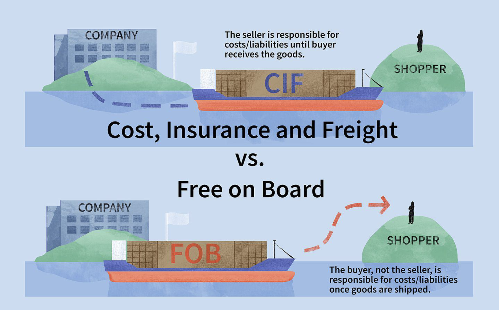

## Table of Contents

## What does CIF stand for and what does it include?

CIF stands for Cost, Insurance, and Freight. It is a term used in international trade to describe a situation where the seller is responsible for the costs of the goods, the insurance, and the freight up to a specified destination port.

Under CIF terms, the seller must arrange and pay for the transportation of the goods to the port of destination. The seller also needs to get insurance to cover the goods during the journey. Once the goods arrive at the destination port, the buyer takes over and is responsible for any further costs, like unloading the goods and getting them to their final location.

## What does FOB stand for and what does it include?

FOB stands for Free on Board. It is a term used in shipping that tells us who pays for what when goods are being sent from one place to another. When you see FOB on a contract, it means the seller has to get the goods onto the ship at the port they are leaving from. The seller pays for all the costs up to that point, like getting the goods to the port and loading them onto the ship.

Once the goods are on the ship, the buyer takes over. The buyer has to pay for the shipping costs from that point on, including the ocean freight and any insurance they want to buy. The buyer also has to deal with any costs that come up after the goods reach the destination port, like unloading the goods and getting them to their final spot.

## How do the responsibilities of the buyer and seller differ under CIF and FOB?

Under CIF, the seller has more responsibilities than under FOB. With CIF, the seller pays for the cost of the goods, the insurance, and the freight to get the goods to the destination port. This means the seller arranges and pays for everything until the goods reach the buyer's port. Once the goods arrive at the destination port, the buyer takes over. The buyer then has to handle unloading the goods and getting them to their final place. So, the seller does more work and pays more costs under CIF.

Under FOB, the responsibilities are split differently. The seller's job is to get the goods to the port they are leaving from and load them onto the ship. The seller pays for all costs up to this point. Once the goods are on the ship, the buyer takes over. The buyer pays for the shipping costs from then on, including the ocean freight and any insurance they want. The buyer also handles all costs after the goods reach the destination port, like unloading and getting the goods to their final spot. So, under FOB, the buyer has more responsibilities and costs compared to CIF.

## What are the key differences in cost structure between CIF and FOB?

Under CIF, the seller pays for more things. They cover the cost of the goods, the insurance to protect the goods while they are being shipped, and the freight to get the goods to the buyer's port. This means the seller spends more money upfront. The buyer only starts paying once the goods reach the destination port. They have to pay for unloading the goods and getting them to their final spot, but these costs are usually less than what the seller pays.

Under FOB, the cost structure is different. The seller only pays to get the goods to the leaving port and to load them onto the ship. This means the seller's costs are lower compared to CIF. The buyer takes over once the goods are on the ship. They pay for the ocean freight, any insurance they want, and all the costs after the goods reach the destination port, like unloading and transport to the final place. So, the buyer ends up paying more under FOB than under CIF.

## How does the point of transfer of risk differ between CIF and FOB?

Under CIF, the point where the risk transfers from the seller to the buyer is when the goods are loaded onto the ship at the port they are leaving from. Even though the seller pays for the insurance and the freight to the destination port, if anything happens to the goods after they are on the ship, it's the buyer's problem. The buyer has to deal with any damage or loss that happens during the journey.

Under FOB, the risk transfers at the same point as CIF, which is when the goods are loaded onto the ship at the leaving port. But, unlike CIF, the buyer also has to pay for the freight and any insurance they want from that point on. So, the buyer takes on the risk and the costs as soon as the goods are on the ship.

## What are the documentation requirements for CIF and FOB shipments?

For CIF shipments, the seller needs to provide a few key documents. They have to give the buyer a commercial invoice, which shows the cost of the goods. They also need to give a bill of lading, which is like a receipt for the goods and shows that they were loaded onto the ship. The seller also has to provide an insurance policy or certificate, which proves that the goods are insured during the journey. These documents help the buyer clear customs and get the goods from the port to their final place.

For FOB shipments, the documentation is a bit simpler. The seller still needs to give the buyer a commercial invoice to show the cost of the goods. They also have to provide a bill of lading, which proves that the goods were loaded onto the ship at the leaving port. Unlike CIF, the seller does not need to provide an insurance policy because the buyer is responsible for getting insurance if they want it. These documents help the buyer handle the rest of the journey and clear customs at the destination port.

## How do CIF and FOB affect the customs clearance process?

For CIF shipments, the seller does a lot of the work before the goods get to the buyer's country. They pay for the goods, the insurance, and the shipping to the buyer's port. When the goods arrive, the buyer needs the commercial invoice, bill of lading, and insurance policy from the seller to clear customs. The buyer uses these documents to show the customs people that everything is in order and to pay any taxes or duties. So, the buyer needs to wait for these documents from the seller before they can finish the customs process.

For FOB shipments, the buyer has more work to do when the goods reach their country. The seller only needs to give the buyer a commercial invoice and a bill of lading. The buyer has to handle the shipping costs and get insurance if they want it. When the goods arrive, the buyer uses the invoice and bill of lading to clear customs and pay any taxes or duties. Since the buyer is in charge of more things, they might need to do more work to get the goods through customs, but they have control over the whole process from the moment the goods are on the ship.

## What are the insurance implications for goods under CIF versus FOB?

Under CIF, the seller has to get insurance for the goods while they are being shipped. This means the seller pays for insurance that covers the goods until they reach the buyer's port. If something goes wrong during the journey, like damage or loss, the insurance the seller bought can help the buyer get money back. The buyer doesn't have to worry about getting their own insurance, but they need to make sure the insurance the seller got is enough to cover any problems that might happen.

Under FOB, the buyer is in charge of getting insurance if they want it. Once the goods are on the ship, the buyer has to pay for the shipping and can choose to buy insurance to protect the goods during the journey. If the buyer decides not to get insurance and something bad happens, they will have to deal with the loss or damage themselves. So, with FOB, the buyer has more control over the insurance but also more responsibility to make sure the goods are protected.

## How do CIF and FOB impact the logistics and transportation arrangements?

Under CIF, the seller has to do more work with logistics and transportation. They need to arrange and pay for getting the goods to the buyer's port. This means the seller picks the shipping company and handles all the details to make sure the goods get to the right place. Once the goods reach the buyer's port, the buyer takes over. The buyer then has to figure out how to get the goods from the port to their final spot. So, the seller handles the big part of the journey, and the buyer deals with the last bit.

Under FOB, the seller's job is simpler. They just need to get the goods to the leaving port and load them onto the ship. After that, the buyer takes over. The buyer has to find a shipping company and pay for the journey from the leaving port to the destination port. The buyer also has to plan how to get the goods from the destination port to their final place. So, with FOB, the buyer has more control over the whole trip but also more work to do.

## In what scenarios might a buyer prefer CIF over FOB, and vice versa?

A buyer might prefer CIF if they want less work and fewer risks. With CIF, the seller does more of the work, like paying for the shipping and insurance. This can be good if the buyer doesn't know much about shipping or if they want to focus on other parts of their business. Also, if the buyer is in a country far away from the seller, CIF can make things easier because the seller handles most of the journey. The buyer just needs to deal with the goods once they reach their port.

On the other hand, a buyer might choose FOB if they want more control over the shipping process. With FOB, the buyer picks the shipping company and can shop around for the best price. This can save money if the buyer knows a lot about shipping. FOB can also be good if the buyer wants to use their own insurance, which might be cheaper or give them better coverage. So, if the buyer is good at handling logistics and wants to keep costs down, FOB could be the better choice.

## What are the potential risks and challenges associated with CIF and FOB from a legal perspective?

From a legal perspective, CIF can bring some risks and challenges. One big risk is that the buyer might not know if the insurance the seller gets is good enough. If something goes wrong during the trip and the insurance doesn't cover it, the buyer could be in trouble. Another challenge is making sure all the documents are right. The seller needs to give the buyer the commercial invoice, bill of lading, and insurance policy. If any of these are wrong or missing, it can cause problems with customs and delay the goods getting to the buyer. So, the buyer needs to check all the documents carefully.

FOB also has its own set of legal risks and challenges. One big risk is that the buyer takes on more responsibility once the goods are on the ship. If the buyer doesn't get their own insurance and something goes wrong, they could lose a lot of money. Another challenge is making sure the seller gets the goods to the right port and loads them onto the ship correctly. If the seller makes a mistake, it can cause delays and extra costs for the buyer. So, the buyer needs to make sure they understand all the terms and keep a close eye on everything the seller does up to the point the goods are on the ship.

## How do international trade regulations and Incoterms influence the choice between CIF and FOB?

International trade regulations and Incoterms can really affect whether a buyer chooses CIF or FOB. Incoterms are rules that help everyone understand who pays for what and who is responsible for what during shipping. They make it clear where the seller's job ends and where the buyer's job starts. For example, if a country has strict rules about what kind of insurance is needed for imports, a buyer might pick CIF because the seller has to get the insurance. On the other hand, if the buyer knows the trade rules well and wants to handle things themselves, they might go for FOB to save money and have more control.

Trade regulations can also make a big difference. Some countries have rules about how goods need to be shipped or what documents are needed. If a country has a lot of rules about shipping, a buyer might choose CIF because the seller handles most of the shipping details. This can make things easier for the buyer. But if the buyer is good at dealing with trade rules and wants to pick their own shipping methods, they might prefer FOB. It gives them more freedom to choose how to ship the goods and can help them save money if they know what they're doing.

## References & Further Reading

[1]: ["Incoterms® 2020: ICC rules for the use of domestic and international trade terms"](https://iccwbo.org/business-solutions/incoterms-rules/incoterms-2020/) by International Chamber of Commerce

[2]: ["The Impact of Shipping Costs on Trade in International Economics"](https://www.sciencedirect.com/science/article/pii/S2590198223002324) by David Hummels

[3]: ["Global Supply Chain Risk Management"](https://www.gep.com/blog/strategy/global-supply-chain-risk-management-strategies-explained) by Kouvelis, P., Dong, L., & Boyabatlı, O.

[4]: ["Advances in Financial Machine Learning"](https://www.amazon.com/Advances-Financial-Machine-Learning-Marcos/dp/1119482089) by Marcos Lopez de Prado

[5]: ["Quantitative Trading: How to Build Your Own Algorithmic Trading Business"](https://www.amazon.com/Quantitative-Trading-Build-Algorithmic-Business/dp/1119800064) by Ernest P. Chan

[6]: ["Port Economics, Management and Policy"](https://porteconomicsmanagement.org/) by Theo E. Notteboom, Athanasios Pallis, & Jean-Paul Rodrigue 

[7]: ["Research Handbook on Ocean Carrier Alliances"](https://www.flexport.com/blog/the-future-of-ocean-carrier-alliances/) by Wayne Pei Hau Talley

[8]: ["Machine Learning for Algorithmic Trading"](https://github.com/stefan-jansen/machine-learning-for-trading) by Stefan Jansen