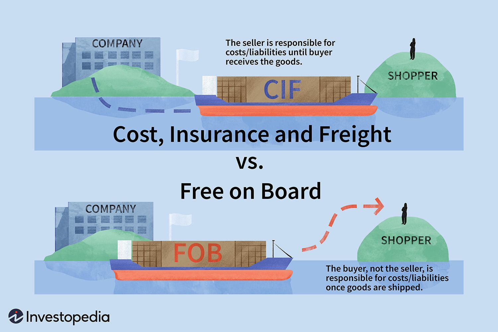

In international trade, shipping terms such as Cost, Insurance, and Freight (CIF) and Free on Board (FOB) play a pivotal role in defining the responsibilities and liabilities of buyers and sellers. These terms, standardized by the International Chamber of Commerce under Incoterms, outline the transport obligations and risk transfer, thus directly impacting cost management and risk assessment in global commerce.

CIF terms signify that the seller is responsible for the costs associated with shipping, insurance, and freight to the buyer's designated port. This arrangement simplifies logistics for the buyer, as the seller manages the transportation aspects, ensuring that goods are insured and transit to the destination port is secured. Conversely, under FOB terms, the buyer assumes responsibility once goods are loaded onto the shipping vessel. This requires buyers to have expertise in navigating logistics and transportation regulations, potentially leading to more intricate management but offering enhanced control over shipping processes and potential cost savings.



Understanding these terms transcends conventional trade logistics and holds significant relevance in the context of algorithmic trading within international markets. Algorithmic trading systems, which rely on high-speed data processing and decision-making, can be affected by these shipping agreements. The choice between CIF and FOB can influence risk management strategies embedded within algorithms, impacting cost structures, delivery timelines, and ultimately trading efficiency. For instance, algorithms accounting for the risk transfer at different shipping points could adjust trading strategies in response to fluctuating transportation costs or unforeseen geopolitical events affecting shipping lanes.

In automated trading systems, the incorporation of shipping term considerations could lead to more informed bidding strategies and enhanced profitability. For example, a CIF agreement might be preferable for trading simulations where fixed costs and lower exposure to transit-related risks are desirable. On the other hand, FOB can benefit strategies that leverage a more active risk management and logistics expertise available to the trading entity.

The strategic implications of CIF and FOB in algorithmic trading underscore the necessity for businesses to carefully evaluate these terms in alignment with their operational objectives and market strategies. As companies navigate international markets, selecting the appropriate shipping term becomes integral to optimizing trade operations and maximizing financial outcomes.

## Table of Contents

## What Are CIF and FOB Shipping Terms?

International commercial terms, commonly known as Incoterms, are a globally recognized standard to facilitate international trade by defining responsibilities, costs, and risks between buyers and sellers. Developed by the International Chamber of Commerce (ICC), these terms are essential in ensuring that trade parties have a clear understanding of their obligations, minimizing disputes and misunderstandings in cross-border transactions.

CIF, or Cost, Insurance, and Freight, requires the seller to handle the costs, insurance, and freight necessary to deliver goods to a designated port of destination. The seller bears the responsibility for the goods up until they reach the destination port, alleviating the buyer's burden for this stage of the shipping process. Under CIF, the seller contracts insurance to cover the buyer's risk of loss or damage to the goods during transit, typically at the minimum coverage level required by the terms. CIF is widely used when sellers have greater efficiency and better rates in managing international logistics and insurance, or when buyers lack experience in handling these elements.

```python
# Hypothetically calculating CIF costs
cif_cost = product_cost + shipping_cost + insurance_cost
```

FOB, or Free on Board, indicates that the seller's responsibility for the goods concludes once they are loaded onto the shipping vessel. Beyond this point, the buyer assumes all risks and costs associated with transporting the goods to the final destination. FOB is advantageous for buyers who have established logistics contracts and are adept at managing international shipping, as it offers them the flexibility and potential for cost savings by choosing their preferred transport and insurance providers.

```python
# Example calculation for FOB
fob_cost = product_cost + loading_cost
```

Choosing between CIF and FOB is context-dependent in international trade scenarios. CIF is often applied when trade involves less-experienced buyers or when sellers are capable of providing better logistics solutions. FOB, on the other hand, is more prevalent when buyers have robust logistical infrastructures and prefer to manage costs by leveraging their shipping and insurance agreements. These terms fundamentally shape the nature of trade agreements, influencing negotiations, logistics management strategies, and ultimately impacting international trade dynamics.

## Advantages and Disadvantages of CIF

CIF, or Cost, Insurance, and Freight, is an Incoterm that outlines the responsibilities and obligations of buyers and sellers involved in the international trade of goods. This term is particularly advantageous for new or inexperienced buyers as it simplifies the complexities of shipping logistics. Under a CIF agreement, sellers cover significant aspects of the shipping process, including delivery to the port of destination, freight charges, and minimum insurance against the buyer’s risk of loss or damage to the goods during transit. This reduces the logistical burden on buyers, offering them a level of predictability in shipping costs which can be critical for budgeting and financial planning.

However, CIF has disadvantages, primarily revolving around higher costs and reduced control for buyers. Since the seller arranges for shipping and insurance, buyers may end up paying more than if they arranged these services themselves directly. Moreover, buyers have limited control over the selection of the shipping carrier and insurance provider, which can affect delivery times and the extent of coverage.

In international trade, CIF is particularly beneficial in scenarios where the buyer is not well-versed in import regulations or when the destination port has a complex administrative framework. It is also advantageous in transactions involving commodities like bulk raw materials, where standardized shipping and insurance processes add value by ensuring a smooth and predictable flow of goods. In these contexts, buyers can benefit from the expertise and established processes of sellers, reducing the risk of logistical disruptions.

The choice of CIF depends on a trade-off between cost and convenience. While it offers predictability and simplicity, the lack of control over logistics and potential cost inefficiencies are considerations that buyers must weigh when determining their shipping arrangements.

## Advantages and Disadvantages of FOB

In international trade, the term Free on Board, or FOB, offers distinct advantages for buyers, mainly due to its cost-effectiveness and the control it provides to buyers well-versed in shipping logistics. Under an FOB agreement, the buyer assumes ownership and responsibility for the goods once they are loaded onto the shipping vessel at the port of origin. This transition of responsibility allows buyers to benefit from potentially lower costs. By managing the logistics themselves, buyers can negotiate better freight rates, select preferred transport routes, and streamline the shipment according to their own schedules and preferences, effectively optimizing their supply chain operations.

However, FOB has its disadvantages, particularly for less experienced buyers. The responsibility for transportation logistics and risk of loss or damage en route shifts solely to the buyer once the goods are on board. For those unfamiliar with international shipping complexities, this can translate into significant challenges. Buyers must handle all aspects of shipping, including arranging for transportation, insurance, handling customs clearance, and paying various port and delivery charges. These tasks require expertise and resources; without them, buyers may face unexpected costs, delays, or regulatory issues, potentially eroding the savings FOB initially promised.

FOB is often preferred in international trading scenarios where buyers have established logistics networks and shipping expertise. Companies equipped with dedicated logistics departments or those that frequently import goods in large volumes often find FOB advantageous. It is also favored by buyers who have negotiated bulk shipping contracts or secured favorable shipping rates with carriers. Additionally, firms that own or have partnerships with freight forwarders can leverage their resources effectively under FOB terms, gaining better control over inventory and delivery timelines.

Overall, Free on Board provides substantial benefits in terms of cost savings and logistics control for experienced buyers, while less experienced entities may find the complexity and responsibility overwhelming, necessitating a careful evaluation of internal capabilities before choosing this shipping term.

## CIF vs. FOB in Algorithmic Trading

In the context of [algorithmic trading](/wiki/algorithmic-trading), the choice between CIF (Cost, Insurance, and Freight) and FOB (Free on Board) shipping terms can substantially influence trading strategies, efficiency, and profitability. These shipping terms dictate not only cost and risk distribution but also the timing of risk transfer, all of which can be crucial elements in algorithmic decision-making models.

### Impact on Algorithmic Trading Strategies

Algorithmic trading, driven by precise data and automated decision-making, requires an understanding of various market factors, including logistics and supply chain dynamics. Shipping terms like CIF and FOB directly affect these dynamics. Under CIF, sellers bear the cost and risk until goods reach the destination port, offering the buyer less uncertainty about shipping costs and risks (International Trade Centre, 2021). This stability in cost and risk can benefit algorithms focused on minimizing [volatility](/wiki/volatility-trading-strategies) and optimizing resource allocation.

Conversely, FOB transfers responsibility and risk earlier in the shipment process, presenting a different set of variables for algorithmic consideration. Here, the buyer assumes risks once the goods are loaded onto the vessel, requiring traders to incorporate these variables into their risk management protocols more explicitly.

### Role in Risk Management Algorithms

Risk management algorithms often use models to predict potential disruptions and optimize trade routes and schedules. Shipping terms like CIF and FOB alter the variables within these models significantly. For example, CIF terms compress risk variance as the seller manages risks related to shipping, giving more predictable cost structures. The algorithms that prioritize risk-averse strategies might prefer scenarios where CIF terms are employed, tracking historical data that supports fewer interruptions or cost deviations.

On the other hand, under FOB terms, buyers need to manage logistics and related risks independently, potentially introducing greater variability into algorithmic models. For example, a risk management algorithm might need to account for shipping insurance, possible delays, and other logistical factors more vigilantly with FOB, allowing the system to adjust trading strategies dynamically in response to fluctuating shipping environments.

### Influence on Trading Efficiency and Profitability

The choice between CIF and FOB significantly impacts efficiency and profitability in algorithmic trading. Shipping terms dictate the extent of control over logistics, affecting how swiftly and cost-effectively goods move across borders. For systems focusing on efficiency, FOB can offer advantages by enabling buyers to leverage their capabilities in logistics for cost savings and reduced transit times, thus affecting the bottom line positively.

However, the initial cost burden on sellers in CIF-covered trades might limit short-term cash flow issues, potentially enhancing trading profitability by securing more predictable margins. This predictability can be particularly favorable for algorithmic models reliant on stable input costs to execute high-frequency trades effectively and profitably.

In conclusion, the distinction between CIF and FOB shipping terms fundamentally influences algorithmic trading through altered risk management requirements and by affecting overall trading efficiency and profitability. Traders leveraging algorithmic models must carefully weigh these terms against their risk tolerance, strategic goals, and logistical capabilities to optimize their trading outcomes.

## Choosing Between CIF and FOB

When choosing between CIF (Cost, Insurance, and Freight) and FOB (Free on Board) shipping terms, several key factors should be considered to align a company's business and trading strategies with its operational needs.

### Experience Level

One of the primary considerations is the level of experience and expertise a company possesses in managing logistics. Companies with limited experience in international shipping often benefit from the CIF terms, as they transfer the responsibility of arranging and paying for shipment, insurance, and freight to the seller until the goods reach the destination port. This arrangement simplifies the process for inexperienced buyers, minimizing the potential for costly errors.

In contrast, FOB terms might be more suitable for companies with robust logistics departments and sufficient experience in handling shipments. Under FOB, the buyer assumes responsibility for the goods once they are loaded onto the vessel, offering more control over the shipping process. This control can be advantageous for experienced buyers who want to manage transportation costs, negotiate better rates, or select preferred insurance and freight providers.

### Cost Implications

Cost considerations are crucial when deciding between CIF and FOB. CIF terms generally result in higher upfront costs for buyers because the seller incorporates the cost of shipping and insurance into the price. However, this can lead to predictability in expenditures, as buyers know the total cost without the need to manage separate logistics expenses.

Conversely, FOB can be more cost-effective for buyers with established relationships with shipping and insurance providers, who can often negotiate favorable terms. However, buyers must [factor](/wiki/factor-investing) in the potential financial risks associated with assuming control over the logistics process early in the shipment.

### Control Over Logistics

Control and flexibility in logistics are significant factors influencing the choice between CIF and FOB. Companies aiming for tight control over their supply chain may prefer FOB, allowing them to dictate shipping schedules, routes, and freight companies. This level of control offers potential advantages in terms of optimizing delivery times and managing inventory effectively.

Under CIF, the seller selects the freight provider and insurance, which may not align perfectly with the buyer's preferences or logistical strategy. While this reduces the buyer's workload, it might also limit their ability to influence the shipping process directly.

### Operational Strategy and Trading Model

Aligning the choice of shipping term with a company’s operational strategy is critical. Businesses that operate on a just-in-time inventory model may favor FOB to maintain greater control over delivery schedules and inventory management. Alternatively, businesses focused on minimizing logistical complexity might prefer CIF to streamline operations and reduce administrative burdens.

### Real-world Examples

Consider a small, newly established importer with limited experience in international logistics. Such a company might choose CIF to mitigate risks associated with unfamiliar shipping procedures, relying on the seller's expertise to manage transportation and insurance.

In contrast, a multinational corporation with substantial logistics capabilities might prefer FOB to optimize shipping costs through its global freight agreements and comprehensive supply chain management systems. This choice allows the corporation to leverage its logistics infrastructure and negotiate directly with service providers, potentially reducing costs and improving delivery performance.

In conclusion, choosing between CIF and FOB necessitates a thoughtful assessment of a company’s logistics expertise, cost priorities, and strategic goals. Companies should weigh these factors carefully to select the term that best supports their operational strategy and trading model.

## The Intersection of Shipping Terms and International Trade Strategies

Shipping terms such as Cost, Insurance, and Freight (CIF) and Free on Board (FOB) significantly influence international supply chain efficiency. By clearly delineating each party's responsibilities, costs, and risks, these terms help streamline operational processes, enhance communication, and optimize financial transactions across global trade networks.

The choice of shipping terms can shape strategic partnerships in international trade. CIF terms, for instance, might appeal to companies seeking reduced logistics complexity by transferring shipping responsibilities to sellers. This can foster partnerships with logistics providers who prioritize comprehensive service offerings, allowing sellers to amortize costs over large [volume](/wiki/volume-trading-strategy) shipments. Conversely, FOB terms can attract buyers who have established logistics networks and prefer greater control and oversight. This control allows for cost negotiation leverage since experienced buyers can select shipping routes that minimize expenses and mitigate risks associated with transportation.

Shipping agreements, particularly those involving large volumes or long-term contracts, can also create opportunities for innovative solutions in international trade. For instance, technology-driven approaches such as algorithmic route optimization can leverage shipping terms to predict costs and minimize transit times. Companies might use dynamic pricing models, informed by historical data and predictive analytics, to determine whether CIF or FOB is more financially advantageous. These models could employ [machine learning](/wiki/machine-learning) algorithms, such as clustering to segment markets or regression to forecast shipping costs, ensuring that the chosen shipping term aligns with the company's strategic objectives.

Consider the following Python example, which uses linear regression to estimate shipping costs:

```python
from sklearn.linear_model import LinearRegression
import numpy as np

# Example data: [shipping distance, transport risk, insurance cost]
X = np.array([[1000, 0.2, 50], [1500, 0.3, 70], [2000, 0.4, 90]])
# Example shipping costs
y = np.array([500, 700, 900])

# Create linear regression model
model = LinearRegression()
model.fit(X, y)

# Predicting new scenario: [shipping distance, transport risk, insurance cost]
new_scenario = np.array([[1800, 0.35, 80]])
predicted_cost = model.predict(new_scenario)

print(f"Predicted Shipping Cost: {predicted_cost[0]}")
```

By understanding and leveraging CIF and FOB terms, businesses can align their operational strategies with their logistical capabilities and market conditions. This alignment not only drives cost efficiencies and operational effectiveness but also fosters adaptability in an increasingly complex global trade environment. Furthermore, businesses that are adept in interpreting and utilizing these terms can negotiate contracts that mitigate risks and capitalize on market opportunities, thus enhancing their competitive advantage in international trade.

## Conclusion

CIF (Cost, Insurance, and Freight) and FOB (Free on Board) represent two fundamental shipping terms in international trade, each carrying its own set of responsibilities and implications. CIF assigns the seller the obligation to cover shipping, insurance, and freight costs until the goods reach the destination port. This arrangement can simplify transactions for buyers, particularly those with less experience in logistics, by offering predictability in shipping expenses. However, it generally incurs higher costs and reduces buyer control over the shipping process.

FOB, on the other hand, transfers responsibility to the buyer once the goods are loaded onto the shipping vessel. It is typically preferred by experienced buyers who seek lower costs and greater control over logistics operations. While FOB can be more complex to manage, particularly for those with limited shipping knowledge, it offers a cost-effective solution for those who can navigate its intricacies.

These shipping terms influence not only traditional trade but also algorithmic trading strategies. In algorithmic trading, timely and accurate decision-making are crucial, and shipping terms like CIF and FOB can significantly impact operational decisions. For example, with CIF, the predictability in cost can lead to stable supply chain algorithms, whereas FOB can provide flexibility that might be beneficial for dynamic algorithmic models aiming to optimize cost and supply efficiency.

In selecting the appropriate shipping term, businesses must carefully assess several factors: the level of experience in handling logistics, the cost structures, desired control over the shipping process, and alignment with the company's broader operational strategy. Decisive consideration of these factors can directly affect the efficiency of both supply chain operations and trading models.

Ultimately, the choice between CIF and FOB should align with a company's strategic objectives and specific operational needs. By understanding the nuances of each shipping term, businesses can enhance their international trade operations, optimize their trading algorithms, and improve overall profitability.

## References & Further Reading

[1]: ["Incoterms® 2020: ICC rules for the use of domestic and international trade terms"](https://iccwbo.org/business-solutions/incoterms-rules/incoterms-2020/) by International Chamber of Commerce

[2]: ["The Impact of Shipping Costs on Trade in International Economics"](https://www.sciencedirect.com/science/article/pii/S2590198223002324) by David Hummels

[3]: ["Global Supply Chain Risk Management"](https://www.gep.com/blog/strategy/global-supply-chain-risk-management-strategies-explained) by Kouvelis, P., Dong, L., & Boyabatlı, O.

[4]: ["Advances in Financial Machine Learning"](https://www.amazon.com/Advances-Financial-Machine-Learning-Marcos/dp/1119482089) by Marcos Lopez de Prado

[5]: ["Quantitative Trading: How to Build Your Own Algorithmic Trading Business"](https://www.amazon.com/Quantitative-Trading-Build-Algorithmic-Business/dp/1119800064) by Ernest P. Chan

[6]: ["Port Economics, Management and Policy"](https://porteconomicsmanagement.org/) by Theo E. Notteboom, Athanasios Pallis, & Jean-Paul Rodrigue 

[7]: ["Research Handbook on Ocean Carrier Alliances"](https://www.flexport.com/blog/the-future-of-ocean-carrier-alliances/) by Wayne Pei Hau Talley

[8]: ["Machine Learning for Algorithmic Trading"](https://github.com/stefan-jansen/machine-learning-for-trading) by Stefan Jansen