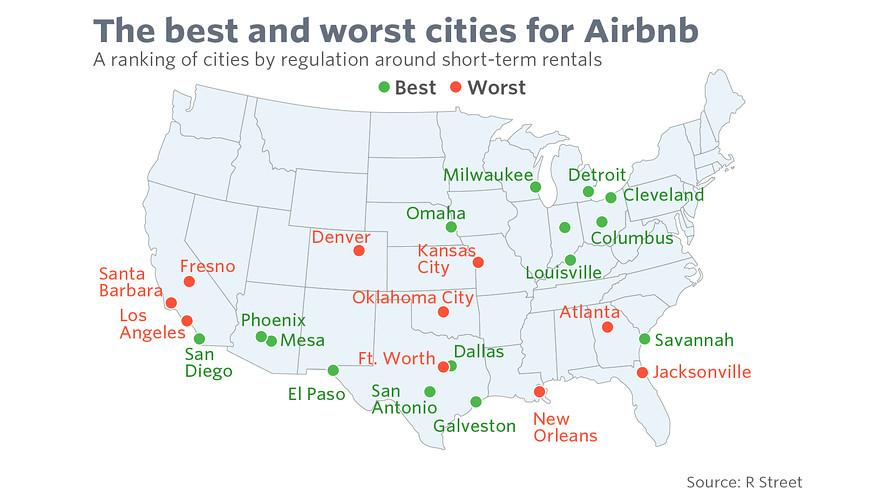

## Table of Contents

## What are the key factors to consider when comparing cities for Airbnb rentals?

When comparing cities for Airbnb rentals, one important factor to consider is the demand for short-term rentals in each city. Some cities have a lot of tourists or business travelers, which means there might be more people looking to rent a place on Airbnb. You should look at how many people visit the city each year and what they come for, like vacation or work. Another factor is the rules and regulations about short-term rentals. Some cities have strict rules that can make it harder to rent out your place on Airbnb. You need to check the local laws to see if you can even do it and what you need to do to follow the rules.

Another key factor is the cost of living and rental prices in the cities you are comparing. If a city has high rental prices, it might be harder to make a profit from your Airbnb rental, even if there is a lot of demand. You should look at how much it costs to rent a similar place in each city and compare that to what you can charge on Airbnb. Finally, consider the competition in each city. If there are already a lot of Airbnb listings, it might be harder to stand out and get bookings. You can check how many listings there are and what they offer to see if you can offer something different or better.

## How does the average nightly rate vary between the best and worst cities for Airbnb rentals?

The average nightly rate for Airbnb rentals can be very different between the best and worst cities. In the best cities for Airbnb, like New York or Paris, the average nightly rate can be high because a lot of people want to visit these places. These cities often have famous sights and events that attract tourists, so people are willing to pay more to stay there. For example, in New York, you might see average nightly rates around $200 or more, depending on the neighborhood and the type of place you're renting.

On the other hand, in the worst cities for Airbnb rentals, the average nightly rate is usually much lower. These cities might not have as many tourists or might have a lot of competition from hotels and other rentals. For example, in a smaller city with fewer attractions, you might find average nightly rates around $50 to $100. The lower demand means people aren't willing to pay as much, so if you're renting out a place in one of these cities, you'll likely earn less money per night compared to the best cities.

## What are the occupancy rates in the top-performing cities for Airbnb?

In top-performing cities for Airbnb, like New York and Paris, the occupancy rates are usually pretty high. This means that a lot of the time, these places are booked and people are staying in them. For example, in New York, the occupancy rate can be around 70% to 80%. This is because a lot of people want to visit these cities, so there's always someone looking to rent a place. The high demand helps keep the places full and makes it a good place for people who own Airbnb rentals.

In other top cities like San Francisco or Barcelona, the occupancy rates can also be quite good, often around 60% to 75%. These cities have a lot of tourists and business travelers, so there's always a need for short-term rentals. The rates can change a bit depending on the time of year, like during big events or holidays when more people visit. But overall, if you have an Airbnb in one of these top cities, you can expect to have guests staying quite often.

## How does the regulatory environment affect Airbnb rentals in different cities?

The rules about Airbnb rentals can be very different from one city to another. Some cities have strict rules that make it hard to rent out your place. For example, in New York City, you need to live in the place you're renting out and you can only rent it for less than 30 days at a time. If you don't follow these rules, you can get fined a lot of money. These strict rules can make it hard to run an Airbnb and might make people choose other cities where the rules are easier.

Other cities have more relaxed rules that make it easier to rent out your place. In places like Austin, Texas, the rules are not as strict, so more people can use Airbnb to rent out their homes. This can make it a better place for Airbnb hosts because they don't have to worry as much about breaking the rules. The difference in rules can affect how much money you can make and how easy it is to run an Airbnb in different cities.

## What are the seasonal trends in Airbnb demand for the best and worst cities?

In the best cities for Airbnb, like New York and Paris, the demand for rentals can change a lot depending on the season. In the summer and during big holidays, a lot more people want to visit these cities. This means that Airbnb hosts can charge more money and have their places booked more often. For example, in New York, the summer months and times like Christmas and New Year's see a lot more tourists, so the demand goes way up. But in the winter, except for the holidays, the demand might go down a bit because fewer people want to visit.

In the worst cities for Airbnb, the seasonal trends are usually not as strong. These cities might not have as many tourists or big events that bring people in. So, the demand stays pretty much the same all year round. For example, in a smaller city with fewer attractions, you might not see a big difference in how many people want to rent a place in the summer versus the winter. This can make it harder for Airbnb hosts in these cities to make a lot of money because the demand doesn't change much with the seasons.

## How do amenities and property types influence Airbnb performance across various cities?

Amenities and property types can really affect how well an Airbnb does in different cities. In big cities like New York or Paris, having nice amenities like a pool, a hot tub, or a great view can make your place stand out. People who visit these cities often want a special experience, so they might pay more for a place with cool extras. Also, the type of property matters. In cities with a lot of tourists, a whole apartment or house might do better than just a room because people like having their own space. But in cities where business travelers are common, a private room might be enough because they just need a place to sleep.

In smaller cities or places that are not as popular with tourists, the amenities and property types might not make as big a difference. People visiting these cities might be looking for a cheaper place to stay, so they might not care as much about having a pool or a fancy view. A simple, clean place might be all they need. Also, in these cities, a whole house might be too big for what people need, so a smaller apartment or even just a room could work just as well. The key is to match what you offer with what people are looking for in that city.

## What are the safety and security considerations for guests in top and bottom cities for Airbnb?

In top cities for Airbnb like New York and Paris, safety and security are big concerns for guests. These cities have a lot of people and can be busy, so guests need to feel safe in their rentals. Airbnb hosts in these cities often put in things like keyless entry systems, security cameras, and good locks to make guests feel secure. They also give guests safety tips, like how to stay safe in the city and what to do in an emergency. Because these cities are popular with tourists, hosts know that safety is important to get good reviews and keep guests coming back.

In the bottom cities for Airbnb, safety and security might not be as much of a focus, but they still matter. These cities might be smaller or have fewer tourists, so the risks can be different. Hosts in these cities might not need as many high-tech security systems, but they still need to make sure their place is safe. Simple things like good lighting, strong locks, and clear instructions on safety can help. Guests in these cities might feel safer because there are fewer people around, but they still want to know their host cares about their safety and comfort.

## How does the local competition impact Airbnb pricing and availability in different cities?

In big cities with a lot of Airbnb rentals, like New York or Paris, there is a lot of competition. This means that hosts need to think carefully about how much they charge. If there are too many places to choose from, guests can pick the cheapest one, so hosts might have to lower their prices to get bookings. But if a host has something special, like a great location or cool amenities, they might be able to charge more because guests want that extra something. The competition can also make it harder to find times when the place is available because other hosts are trying to book guests too.

In smaller cities or places with fewer Airbnb rentals, the competition is not as strong. Hosts in these places might not have to lower their prices as much because there are not as many choices for guests. This can mean that they can charge a bit more and still get bookings. But it also means that there might be times when the place is empty because fewer people are looking to stay there. So, while the competition is less, it can still affect how much a host can charge and how often their place is booked.

## What are the cultural and tourist attractions that drive Airbnb demand in the best cities?

In the best cities for Airbnb like New York and Paris, there are a lot of things to see and do that bring in tourists. New York has famous places like the Statue of Liberty, Times Square, and Central Park. People come from all over the world to see these sights and enjoy the city's busy life. Paris is known for the Eiffel Tower, the Louvre Museum, and its beautiful cafes. Visitors love to walk around the city, eat delicious food, and take in the art and culture. These attractions make people want to stay in these cities, so there's a big demand for Airbnb rentals.

In other top cities like San Francisco and Barcelona, the attractions are also a big draw for tourists. San Francisco has the Golden Gate Bridge, Alcatraz Island, and a lively food scene. People come to explore the city's hills, ride the cable cars, and enjoy the tech vibe. Barcelona is famous for its unique architecture, like the Sagrada Familia, and its beautiful beaches. Visitors love to walk along Las Ramblas, try the local food, and soak up the sun. These cultural and tourist attractions make these cities popular places to visit, which drives up the demand for Airbnb rentals.

## How do economic factors like employment rates and income levels correlate with Airbnb performance in various cities?

In cities where a lot of people have jobs and make good money, Airbnb rentals can do well. When people have more money, they might want to spend it on trips and vacations. So, they might choose to stay in an Airbnb instead of a hotel because it can feel more like home and give them more space. Also, if a city has a lot of businesses and jobs, there might be more people coming for work. These business travelers can use Airbnb for short stays, which helps keep the rentals booked. Cities like New York and San Francisco have high employment rates and good income levels, so they see a lot of demand for Airbnb.

In cities where not as many people have jobs or make less money, Airbnb might not do as well. If people don't have a lot of money, they might not go on as many trips or might choose cheaper places to stay. This means there might be fewer people looking to rent an Airbnb. Also, if a city doesn't have a lot of businesses or jobs, there might not be as many business travelers. This can make it harder for Airbnb hosts to keep their places booked. So, the economic health of a city can really affect how well Airbnb rentals do.

## What advanced data analytics tools can be used to predict Airbnb market trends in different cities?

To predict Airbnb market trends in different cities, you can use advanced data analytics tools like machine learning and predictive modeling. These tools look at a lot of information, like how many people visit a city, what they do there, and how much they spend. They also check things like the time of year, big events, and even what people are saying on social media. By putting all this information together, the tools can guess what might happen next in the Airbnb market. For example, they might predict that more people will want to rent a place during a big festival or that prices will go up in the summer.

Another tool that can help is data visualization software, like Tableau or Power BI. These programs take all the numbers and information and turn them into easy-to-understand pictures and graphs. This makes it simpler to see patterns and trends in the Airbnb market. For instance, you might see a graph that shows how the demand for rentals goes up and down throughout the year, or a map that shows which neighborhoods are most popular. Using these tools, hosts and investors can make better choices about where to list their properties and how much to charge, based on what the data is telling them about future trends.

## How can investors use market analysis to optimize their Airbnb investment strategies across cities?

Investors can use market analysis to figure out which cities are the best places to put their money into Airbnb rentals. They look at things like how many people visit a city, what they do there, and how much they are willing to pay. They also check the rules about renting out places in different cities, because some places have strict laws that can make it hard to run an Airbnb. By understanding these things, investors can pick cities where there is a lot of demand for rentals and where they can make good money. They might also see that some cities are better for certain times of the year, like during big events or holidays, and plan their investments around those times.

Another way investors use market analysis is to decide what kind of place to buy and what amenities to offer. They look at what people in different cities want, like a whole house or just a room, and what extras make a place more appealing, like a pool or a great view. By knowing what guests are looking for, investors can make their Airbnb listings more attractive and charge higher prices. This helps them stand out from other rentals in the city and get more bookings. By using all this information, investors can make smart choices about where and how to invest in Airbnb to get the best returns.

## What are the key profit factors for Airbnb renting?

Location is the primary driver of profitability for Airbnb rentals, as it directly influences demand, pricing, and occupancy rates. Successful short-term rentals are frequently found in destinations that attract steady streams of tourists; these locations benefit from constant turnover and can maintain high nightly rates. Moreover, the scarcity of traditional hotel accommodations in a city or neighborhood typically boosts demand for alternative lodging options like Airbnb. 

Several key factors influence the profitability of an Airbnb investment:

1. **Tourist Demand**: Cities that host major events, possess historical or natural attractions, or offer unique cultural experiences tend to have higher tourist demand. This high demand can lead to increased occupancy rates and the ability to charge premium prices. Platforms such as Airbnb benefit significantly in cities where tourism is a substantial economic driver.

2. **Local Housing Costs**: The cost of acquiring properties is crucial in determining the return on investment. Cities with relatively affordable real estate allow investors to achieve better profit margins, particularly when the cost of purchasing property is low compared to the potential rental income. By employing the formula:
$$
   \text{Return on Investment (ROI)} = \left(\frac{\text{Annual Rental Income} - \text{Annual Operating Costs}}{\text{Property Acquisition Cost}}\right) \times 100

$$

   investors can quantify their potential earnings relative to their initial investment.

3. **Competition with Hotels**: The availability and quality of hotels in a region can have a varying impact on Airbnb demand. In areas with a limited number of hotel rooms or high hotel pricing, tourists are more inclined to consider Airbnb rentals. Conversely, places saturated with competitive hotel pricing may pose challenges for Airbnb operators.

4. **Regulatory Environment**: Local laws and regulations can affect Airbnb's viability. Cities with friendly short-term rental regulations present fewer operational risks and can encourage investment. Conversely, stringent laws may discourage investors or decrease profitability due to compliance costs.

Understanding these factors is essential for property investors to make informed decisions. Analyzing data from tourism trends, housing markets, and local legislation can aid in identifying locations poised for successful Airbnb investments. By focusing on areas with high demand and low acquisition costs and assessing competition levels, investors can strategically position themselves to capitalize on the short-term rental market.

## References & Further Reading

[1]: ["Airbnb, Rising Rent, and the Housing Crisis in Los Angeles"](https://laane.org/research/airbnb-rising-rent-and-the-housing-crisis-in-los-angeles/) by Kyle Barron, Edward Kung, and Davide Proserpio in Urban Studies.

[2]: ["Inside Airbnb: Adding Data to the Debate"](https://insideairbnb.com/get-the-data/) by Inside Airbnb.

[3]: ["The Airbnb Effect: How Short-term Rentals are Reshaping Landlord Insurance"](https://www.rics.org/news-insights/wbef/the-airbnb-effect-part-1-how-do-short-term-vacation-rentals-impact-people-and-places) by Property Observer.

[4]: ["Advances in Financial Machine Learning"](https://www.wiley.com/en-us/Advances+in+Financial+Machine+Learning-p-9781119482086) by Marcos Lopez de Prado.

[5]: ["Quantitative Trading: How to Build Your Own Algorithmic Trading Business"](https://books.google.com/books/about/Quantitative_Trading.html?id=j70yEAAAQBAJ) by Ernest P. Chan.