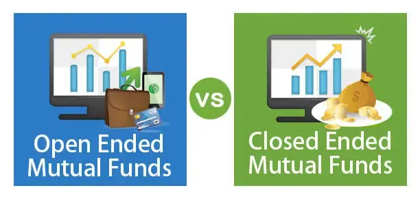

## Table of Contents

## What is a closed-end fund?

A closed-end fund is a type of investment company that raises a fixed amount of money through an initial public offering (IPO). Once the shares are sold, the fund is closed to new investors, meaning it does not continuously issue new shares like an open-end fund. The shares of a closed-end fund are then traded on a stock exchange, much like stocks, and their prices can fluctuate based on supply and demand.

These funds often invest in a variety of assets, such as stocks, bonds, or other securities. Because the number of shares is fixed, the price of the shares can be different from the net asset value (NAV) of the fund's underlying investments. This difference can result in the shares trading at a premium or a discount to the NAV. Closed-end funds can be an attractive option for investors looking for exposure to a diversified portfolio managed by professionals.

## What is an open-end fund?

An open-end fund is a type of investment fund that can issue and redeem shares at any time. This means that investors can buy new shares directly from the fund or sell their shares back to the fund at the current net asset value (NAV). The NAV is calculated at the end of each trading day based on the value of the fund's underlying investments.

Unlike closed-end funds, open-end funds do not trade on a stock exchange. Instead, they are bought and sold through the fund company or through a broker. This structure allows the fund to grow or shrink in size based on investor demand. Common examples of open-end funds include mutual funds and exchange-traded funds (ETFs), which are popular choices for investors looking to diversify their portfolios.

## How do closed-end funds and open-end funds differ in structure?

Closed-end funds and open-end funds have different structures that affect how investors can buy and sell shares. A closed-end fund raises money through an initial public offering and then has a fixed number of shares. These shares are traded on a stock exchange, just like stocks. This means the price of the shares can go up or down based on what people are willing to pay, which might be different from the actual value of the investments inside the fund.

On the other hand, an open-end fund can always create new shares or buy back old ones. Investors buy and sell these shares directly from the fund at a price that matches the value of the fund's investments, called the net asset value (NAV). This happens at the end of each trading day. Because of this, open-end funds don't trade on a stock exchange like closed-end funds do. This structure makes it easier for investors to enter or leave the fund whenever they want.

## What are the main differences in how shares are bought and sold in closed-end versus open-end funds?

In closed-end funds, shares are bought and sold on a stock exchange, similar to how you would buy or sell stocks. When you want to buy shares, you find someone who wants to sell them, and when you want to sell, you find someone who wants to buy. The price you pay or receive can be different from the actual value of the fund's investments because it depends on what people are willing to pay at that moment. This means the price can be higher (a premium) or lower (a discount) than the net asset value (NAV) of the fund.

In open-end funds, you buy and sell shares directly from the fund itself. When you want to buy shares, the fund creates new ones for you, and when you want to sell, the fund buys them back from you. The price you pay or receive is always the same as the NAV, which is calculated at the end of each trading day based on the value of the fund's investments. This makes it easier to know exactly what you're paying or getting, and you can enter or leave the fund whenever you want without worrying about finding a buyer or seller.

## How do the pricing mechanisms of closed-end and open-end funds work?

In closed-end funds, the price of the shares is set by what people are willing to pay on the stock exchange where they trade. This means the price can be different from the actual value of the stuff the fund owns, which is called the net asset value (NAV). If people want to buy the shares more than they want to sell them, the price can go higher than the NAV, which is called trading at a premium. If more people want to sell than buy, the price can go lower than the NAV, which is called trading at a discount. So, when you buy or sell shares of a closed-end fund, you might pay more or less than what the investments inside the fund are really worth.

In open-end funds, the price you pay or get for the shares is always the same as the NAV. The NAV is figured out at the end of each day based on what the fund's investments are worth. When you want to buy shares, the fund makes new ones for you at that price, and when you want to sell, the fund buys them back from you at the same price. This makes it easy to know exactly what you're paying or getting, and you don't have to worry about the price being different from what the investments are really worth.

## What are the typical fees associated with closed-end funds compared to open-end funds?

Closed-end funds usually have lower fees compared to open-end funds. This is because they don't have to deal with the costs of creating new shares or buying back old ones all the time. The main fees for closed-end funds are management fees, which are what they pay the people who run the fund, and sometimes there might be other fees like for marketing or administration. But overall, because they don't have to handle a lot of buying and selling, the fees tend to be less.

Open-end funds, on the other hand, often have higher fees. They have to pay for the costs of creating new shares when people buy them and buying back shares when people sell them. This is called the expense ratio, which includes management fees and other costs like for running the fund. Some open-end funds might also charge you a fee when you buy or sell shares, called a load fee. So, if you're thinking about fees, open-end funds might cost you more than closed-end funds.

## How does liquidity vary between closed-end and open-end funds?

Liquidity in closed-end funds can be less predictable than in open-end funds. When you want to buy or sell shares of a closed-end fund, you have to find someone on the stock exchange who wants to do the opposite. This means that if not many people are trading the fund, it might be harder to buy or sell quickly, or you might not get the price you want. So, the [liquidity](/wiki/liquidity-risk-premium) of a closed-end fund can depend a lot on how popular it is and how many people are trading it.

On the other hand, open-end funds usually have better liquidity because you can always buy or sell shares directly from the fund itself. The fund will create new shares for you when you want to buy, and it will buy back your shares when you want to sell. This means you can always get in or out of the fund at the end of the trading day, based on the net asset value. So, with open-end funds, you don't have to worry about finding someone else to trade with, which makes them more liquid.

## What are the investment strategies typically employed by closed-end funds versus open-end funds?

Closed-end funds often use different investment strategies compared to open-end funds. They might focus on specific areas like real estate, high-yield bonds, or even international markets. Because closed-end funds don't have to deal with people constantly buying and selling shares, they can take a longer-term view. This means they can invest in things that might not be easy to sell quickly, like real estate or less common stocks. They might also use borrowed money, called leverage, to try to make more money for investors, but this can also make things riskier.

Open-end funds usually have a broader range of investment strategies but tend to be more conservative. They often focus on things like stocks, bonds, or a mix of both, trying to match the performance of a certain market or index. Because they have to be ready to buy back shares from investors at any time, open-end funds usually stick to investments that are easy to sell quickly. This means they might not use as much leverage as closed-end funds and might be more focused on keeping things steady rather than trying to make big gains quickly.

## How do closed-end and open-end funds differ in terms of investor control and influence?

In closed-end funds, investors have less control and influence over the fund's operations. Once you buy shares, you can't directly tell the fund what to do with its money. The fund has a fixed number of shares, and it's managed by professionals who make all the decisions about what to invest in. If you want to change something, you'd have to work with other shareholders to try to influence the fund's management, which can be hard. So, your main control comes from deciding when to buy or sell your shares on the stock exchange.

In open-end funds, investors also don't have much direct control over the fund's day-to-day operations. The fund is managed by professionals who decide what to invest in. However, because you can buy or sell shares directly from the fund at any time, you have a bit more flexibility. If you don't like what the fund is doing, you can just sell your shares back to the fund. This means you have more control over your investment, but not over the fund's decisions.

## What are the tax implications of investing in closed-end funds compared to open-end funds?

When you invest in closed-end funds, the tax implications can be a bit different from open-end funds. Closed-end funds might use something called leverage, which means borrowing money to invest. This can lead to higher returns, but it can also lead to more taxes because of the interest on the borrowed money. Also, closed-end funds sometimes pay out something called capital gains distributions, which are profits from selling investments. These distributions are taxable to you, the investor, and they can come at unexpected times because the fund doesn't have to worry about people buying and selling shares all the time.

Open-end funds, on the other hand, usually have more predictable tax situations. Because they have to deal with people buying and selling shares all the time, they often try to keep things steady. This means they might not use as much leverage, so there's less chance of extra taxes from interest. Like closed-end funds, open-end funds also pay out capital gains distributions, but these are often more predictable because the fund knows when investors are coming and going. So, while you'll still have to pay taxes on these distributions, you might be able to plan for them better with an open-end fund.

## How have closed-end and open-end funds performed historically, and what factors influence their performance?

Historically, closed-end funds and open-end funds have both had ups and downs, but they can perform differently because of how they're set up. Closed-end funds sometimes do well when the market is doing well, especially if they use borrowed money to make bigger bets. But they can also do worse if the market goes down, because that borrowed money can make losses bigger too. The price of closed-end fund shares can also go up or down based on what people think about the fund, not just what's inside it. This means they can sometimes trade at a discount or a premium to what their investments are really worth, which can affect how much money investors make or lose.

Open-end funds tend to have steadier performance because they don't usually use as much borrowed money. They often try to match the performance of a certain part of the market, like stocks or bonds, so their ups and downs are more predictable. Because you can always buy or sell shares at the end of the day based on what the investments are worth, the price of open-end fund shares stays closer to their real value. This makes it easier to know what you're getting into, but it also means you might not see the big gains or losses that can come with closed-end funds.

Both types of funds are affected by things like how the economy is doing, interest rates, and what's happening in the stock market. But closed-end funds can be more influenced by how popular they are with investors, while open-end funds are more affected by the performance of the specific investments they hold. So, when choosing between them, it's important to think about what you're looking for in terms of risk and reward.

## What are advanced strategies for leveraging closed-end funds that are not typically available with open-end funds?

One advanced strategy for leveraging closed-end funds is using the difference between the fund's share price and its net asset value (NAV). Because closed-end fund shares can trade at a discount or a premium to their NAV, investors can buy shares when they're at a big discount and sell them when the discount gets smaller or turns into a premium. This strategy is called "discount [arbitrage](/wiki/arbitrage)." It's not something you can do with open-end funds because their shares always trade at the NAV.

Another strategy is using borrowed money, or leverage, to invest in closed-end funds. Some closed-end funds borrow money to buy more investments, which can make returns bigger if things go well. Investors can also borrow money themselves to buy shares of these funds. This can make profits bigger, but it can also make losses bigger if the market goes down. Open-end funds don't usually use as much leverage, so this kind of strategy is more common with closed-end funds.

A third strategy involves taking advantage of the closed-end fund's fixed share structure. Because the number of shares doesn't change, investors can try to influence the fund's management to make changes that might increase the value of the shares. This could mean pushing for better investments or even trying to get the fund to close down and give the money back to shareholders. This kind of activism is harder with open-end funds because people are always buying and selling shares, which makes it harder to get everyone to agree on something.

## References & Further Reading

[1]: Pozen, Robert C. & Hamacher, Theresa. (2015). ["The Fund Industry: How Your Money is Managed"](https://www.amazon.com/Fund-Industry-Money-Managed-Finance/dp/1118929942) - Wiley.

[2]: Elton, Edwin J., Gruber, Martin J., Brown, Stephen J., & Goetzmann, William N. (2014). ["Modern Portfolio Theory and Investment Analysis"](https://books.google.com/books/about/Modern_Portfolio_Theory_and_Investment_A.html?id=181CEAAAQBAJ) - Wiley.

[3]: Hasbrouck, Joel. (2007). ["Empirical Market Microstructure: The Institutions, Economics, and Econometrics of Securities Trading"](https://academic.oup.com/book/52241) - Oxford University Press.

[4]: De Prado, Marcos Lopez. (2018). ["Advances in Financial Machine Learning"](https://www.amazon.com/Advances-Financial-Machine-Learning-Marcos/dp/1119482089) - Wiley.

[5]: Chan, Ernest P. (2009). ["Quantitative Trading: How to Build Your Own Algorithmic Trading Business"](https://github.com/ftvision/quant_trading_echan_book) - Wiley.