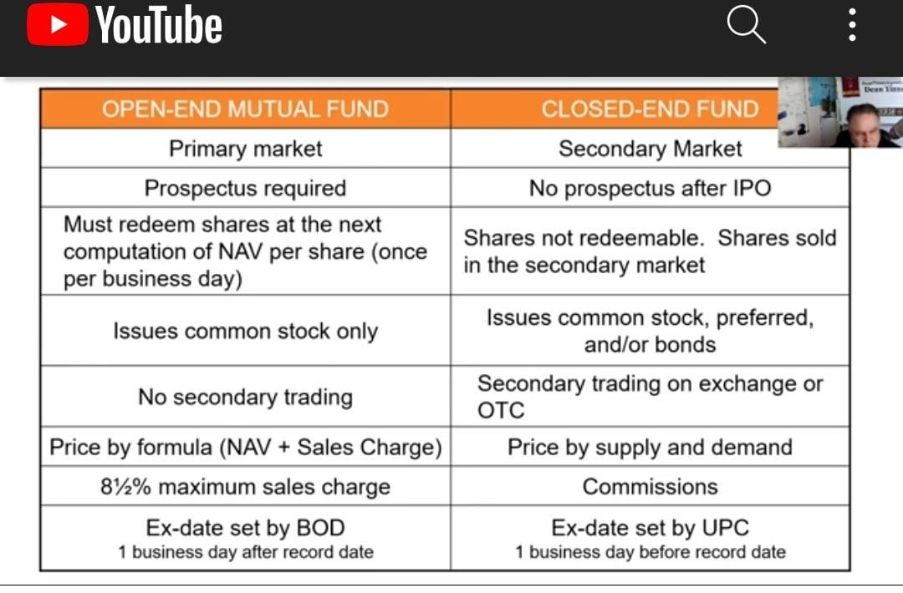

## Table of Contents

## What is a closed-end investment?

A closed-end investment is a type of investment fund that has a fixed number of shares. Unlike open-end funds, which can issue and redeem shares at any time, closed-end funds issue a set number of shares through an initial public offering (IPO). After the IPO, these shares are traded on a stock exchange, just like stocks. This means the price of the shares can go up or down based on supply and demand, and it may not always match the value of the fund's underlying assets.

Investors in closed-end funds can buy or sell shares on the stock exchange at the market price. This can sometimes lead to the shares trading at a discount or a premium to the net asset value (NAV) of the fund's portfolio. Closed-end funds often invest in a variety of assets, such as stocks, bonds, or real estate, and they can be a good way for investors to gain exposure to these assets without having to buy them directly. They are managed by professional fund managers who make decisions about which assets to buy and sell.

## What is an open-end investment?

An open-end investment is a type of fund that can issue and redeem shares at any time. This means that the number of shares in the fund can change every day, depending on how many people want to buy or sell them. When you want to invest in an open-end fund, you buy shares directly from the fund at the current net asset value (NAV), which is the total value of all the assets in the fund divided by the number of shares. If you want to sell your shares, you sell them back to the fund at the NAV.

Open-end funds are popular because they offer flexibility. They are often used for mutual funds, where many investors pool their money together to invest in a variety of assets like stocks, bonds, or other securities. The price of the shares is based on the value of the assets in the fund, so it changes daily. This makes open-end funds a good choice for people who want to invest in a diversified portfolio without having to buy and manage each asset themselves.

## How do closed-end and open-end investments differ in terms of structure?

Closed-end and open-end investments differ mainly in how they handle their shares. A closed-end investment has a fixed number of shares that it issues during an initial public offering (IPO). After that, these shares are traded on a stock exchange, just like stocks. The price of the shares can go up or down based on what people are willing to pay, and it might not match the actual value of the stuff the fund owns. This means that if you want to buy or sell shares, you do it on the stock exchange, not directly with the fund.

On the other hand, an open-end investment can create new shares or take back old ones whenever someone wants to buy or sell. This means the number of shares can change every day. When you want to invest in an open-end fund, you buy shares directly from the fund at the current net asset value (NAV), which is the total value of everything the fund owns divided by the number of shares. If you want to sell your shares, you sell them back to the fund at the NAV. This makes the price of the shares directly tied to the value of the stuff in the fund, and it changes daily.

## What are the key differences in how shares are bought and sold in closed-end versus open-end funds?

In closed-end funds, you can only buy and sell shares on a stock exchange, just like you would with regular stocks. This means you're buying and selling shares from other investors, not from the fund itself. The price of the shares can go up or down based on what people are willing to pay, which might not be the same as the actual value of the things the fund owns. This can lead to the shares trading at a price that's either higher or lower than the fund's net asset value.

In open-end funds, you buy and sell shares directly from the fund. When you want to buy, the fund creates new shares for you, and when you want to sell, the fund takes your shares back. The price you pay or get is based on the fund's net asset value, which is calculated every day. This means the price you pay or receive is always directly tied to the value of the things the fund owns, making it easier to know exactly what you're getting.

## How does the pricing mechanism work for closed-end funds compared to open-end funds?

In closed-end funds, the price of the shares is determined by what people are willing to pay on the stock exchange. This means the price can be different from the actual value of the stuff the fund owns, which is called the net asset value (NAV). If people want the shares a lot, they might pay more than the NAV, and the shares are said to be trading at a premium. If not many people want the shares, they might pay less than the NAV, and the shares are trading at a discount. This can make the price of closed-end fund shares go up and down a lot, depending on what's happening in the market.

In open-end funds, the price of the shares is always the same as the net asset value (NAV). Every day, the fund figures out the total value of everything it owns and divides it by the number of shares to find the NAV. When you want to buy shares, you pay the NAV, and when you want to sell, you get the NAV. This makes the price of open-end fund shares more stable because it's directly tied to the value of the stuff the fund owns, and it doesn't change based on what people are willing to pay on a stock exchange.

## What are the typical fees associated with closed-end and open-end investments?

Closed-end funds often have lower fees than open-end funds because they don't have to deal with buying and selling shares all the time. They still have management fees, which pay for the people who run the fund and decide what to invest in. Sometimes, closed-end funds also have a small fee when you buy or sell shares on the stock exchange, but this is usually less than what you'd pay with open-end funds. If the fund uses borrowed money to invest, there might be extra fees for that too.

Open-end funds usually have higher fees because they have to handle buying and selling shares whenever someone wants to. They have management fees like closed-end funds, but they also have something called a load fee. This is a fee you might pay when you buy or sell shares, and it can be a lot if you're not careful. Some open-end funds also have other fees, like fees for running the fund or for buying and selling the things the fund owns. All these fees can add up, so it's important to check what you're paying for.

## How does liquidity vary between closed-end and open-end investments?

Liquidity is about how easy it is to buy or sell something without changing its price too much. For closed-end funds, liquidity can be a bit tricky. You buy and sell shares on a stock exchange, which means you're dealing with other people who want to buy or sell at the same time. If not many people are trading, it might be hard to sell your shares quickly, or you might have to sell them for less than you wanted. But if a lot of people are trading, it can be easier to buy or sell without affecting the price too much.

For open-end funds, liquidity is usually better. You can buy or sell shares directly from the fund at any time, and the fund will always take your shares back or give you new ones. This means you can usually get your money out quickly without worrying about what other people are doing. The price you get is based on the value of everything the fund owns, so it's more stable. This makes open-end funds a good choice if you might need your money back in a hurry.

## What are the investment strategies typically employed by closed-end funds versus open-end funds?

Closed-end funds often use more active investment strategies. This means the people running the fund might try to buy and sell things to make more money. They might use borrowed money to invest more, which can make the fund riskier but also might make more profit. Closed-end funds can also invest in things that are harder to buy and sell, like real estate or less common stocks. Because they have a fixed number of shares, the managers don't have to worry about people wanting their money back all the time, so they can focus on long-term goals.

Open-end funds usually stick to more straightforward strategies. They might try to match the performance of a certain group of stocks or bonds, like an index fund. This makes them less risky because they're not trying to beat the market, just follow it. Open-end funds need to keep enough cash around to buy back shares whenever someone wants to sell, so they can't always invest in things that are hard to sell quickly. This focus on being ready to give people their money back can make their strategies more conservative.

## How do the performance metrics of closed-end and open-end investments compare over different market conditions?

Closed-end funds can sometimes do better than open-end funds in good market conditions because they can use borrowed money to invest more. This can make their returns higher if the market goes up. But it also makes them riskier because if the market goes down, they can lose more money. Also, because closed-end fund shares can trade at a discount or premium to their net asset value, their performance can be affected by what people think about the fund, not just how the stuff they own is doing. In bad market conditions, closed-end funds might do worse than open-end funds because of the extra risk from borrowing money.

Open-end funds usually have more stable performance because they don't use borrowed money as much and they stick to simpler strategies. They try to match the performance of a certain group of stocks or bonds, so they go up and down with the market. This makes them less risky but also means they might not make as much money in good times. In bad market conditions, open-end funds might do better than closed-end funds because they don't have the extra risk from borrowing. They also have to keep some cash around to give people their money back, which can help them weather bad times better.

## What are the tax implications of investing in closed-end versus open-end funds?

When you invest in closed-end funds, you might have to pay taxes on the money the fund makes. If the fund sells things and makes a profit, it has to give that money to you, and you have to pay taxes on it. This is called a capital gain. Closed-end funds can also give you money from the things they own, like interest from bonds or dividends from stocks. You have to pay taxes on this money too. Sometimes, closed-end funds use borrowed money to invest, which can make the tax situation more complicated because it might change how much money the fund makes and how much you have to pay in taxes.

Open-end funds work a bit differently. Like closed-end funds, if the fund sells things and makes a profit, it has to give that money to you, and you have to pay taxes on it. The same goes for money from interest or dividends. But because open-end funds can create and take back shares all the time, they might have to sell things more often to give people their money back. This can mean more capital gains, which means more taxes for you. Also, some open-end funds are set up to be more tax-friendly, like index funds, which try to keep taxes low by not selling things as much.

## How can an investor use closed-end and open-end investments to diversify their portfolio?

An investor can use closed-end funds to diversify their portfolio by investing in a wide range of assets that might be harder to buy on their own. Closed-end funds can own things like real estate, less common stocks, or even other funds. Because they have a fixed number of shares, the people running the fund can focus on long-term goals without worrying about people wanting their money back all the time. This can help spread out the risk in your portfolio because you're not putting all your money into one type of investment. Plus, if the fund uses borrowed money to invest, it might make more money, but it's also riskier, so you need to think about that when you're trying to balance your investments.

Open-end funds are another good way to diversify your portfolio. They often try to match the performance of a certain group of stocks or bonds, like an index fund. This means you can easily invest in a big group of different things without having to buy each one yourself. Open-end funds are usually more stable because they don't use borrowed money as much and they focus on simpler strategies. This can help you balance out the riskier parts of your portfolio. Since open-end funds can create and take back shares all the time, they need to keep some cash around, which can be good if you might need your money back quickly. By mixing closed-end and open-end funds, you can spread your money across different types of investments and manage your risk better.

## What are the advanced trading strategies that can be applied to closed-end funds but not to open-end funds?

One advanced trading strategy that can be used with closed-end funds but not with open-end funds is called "trading at a discount or premium." Because closed-end fund shares are traded on a stock exchange, their price can be different from the actual value of the stuff the fund owns. If the shares are cheaper than the value of the stuff, they're trading at a discount. If they're more expensive, they're trading at a premium. Smart investors can buy shares when they're at a big discount and sell them when the discount gets smaller or turns into a premium. This can make them more money than just holding onto the shares.

Another strategy is using "leveraged trading." Closed-end funds can borrow money to invest more, which can make their returns higher if the market goes up. But it also makes them riskier because if the market goes down, they can lose more money. Investors who understand this risk can use it to their advantage. They might buy shares in a closed-end fund that uses borrowed money when they think the market will go up, hoping to make more money than they would with a fund that doesn't borrow. This kind of strategy needs a good understanding of the market and the risks involved, so it's not for everyone.

## What is Understanding Open-End Investments?

Open-end investments, prominently represented by mutual funds and exchange-traded funds (ETFs), are flexible investment vehicles characterized by their ability to issue shares continuously. Unlike closed-end funds, open-end funds do not limit the number of shares they can offer. This feature provides an opportunity for investors to enter and [exit](/wiki/exit-strategy) the fund at their discretion.

The pricing of open-end funds is determined by their net asset value (NAV), which is calculated at the end of each trading day. NAV is computed by subtracting the fund's liabilities from its total assets, and then dividing by the number of outstanding shares:

$$
\text{NAV} = \frac{\text{Total Assets} - \text{Total Liabilities}}{\text{Number of Outstanding Shares}}
$$

Investors looking to buy or sell shares of an open-end fund do so directly through the fund manager. This transaction process is straightforward, but it often involves certain fees. These charges can include front-end loads, which are fees paid when purchasing the shares, or back-end loads, which are fees incurred when redeeming them.

One key advantage of open-end funds is their [liquidity](/wiki/liquidity-risk-premium), allowing investors to quickly respond to market changes by buying or selling shares based on the current NAV. This liquidity, however, necessitates that fund managers maintain a portion of the fund's assets in cash or highly liquid securities to accommodate potential redemptions. While this ensures that redemptions can be met without disrupting portfolio allocation, it may also slightly affect the fund's overall return by not being fully invested in higher-yield opportunities.

Moreover, when analyzing open-end investments, it is crucial to consider management fees and operational expenses that might impact overall returns. These costs can vary significantly between funds and affect long-term investor value. 

ETFs, a subset of open-end investments, provide additional complexities as they are traded on stock exchanges like individual stocks throughout the trading day, and their market price might slightly differ from the NAV because of supply and demand dynamics. Despite these nuances, both mutual funds and ETFs offer an accessible avenue for diversified investment, allowing investors to participate in a wide array of asset classes and market sectors.

## What are the characteristics of closed-end investments?

Closed-end investment funds are distinct financial instruments with a predetermined number of shares available to investors. These funds exhibit similarities to publicly traded companies, primarily due to their trading mechanism and structure. Unlike open-end funds, closed-end funds do not issue new shares on demand; instead, they conduct an Initial Public Offering (IPO) where the initial set of shares is made available to investors. Following the IPO, these shares are actively traded on secondary markets, such as stock exchanges, where they are subject to the influences of market demand and supply. 

A defining characteristic of closed-end funds is their ability to trade at a premium or discount relative to their Net Asset Value (NAV). The NAV is calculated as follows:

$$
\text{NAV} = \frac{\text{Total Assets - Total Liabilities}}{\text{Number of Outstanding Shares}}
$$

The trading price of a closed-end fund in the secondary market may diverge from its NAV due to numerous factors, including investor sentiment, market conditions, and the fund's underlying assets. When a fund trades at a premium, the market price exceeds its NAV. Conversely, when it trades at a discount, the market price is below its NAV. 

Closed-end funds also have the flexibility to engage in unconventional investments, which can include illiquid assets, derivatives, or emerging market securities. This flexibility comes from the fund's stable capital base, as shares are not redeemable from the issuer directly, allowing managers to invest without requiring immediate liquidity for shareholder redemptions. 

Overall, the fixed capital structure and market-driven pricing provide closed-end funds with unique investment opportunities and risks, making them a versatile option within an investor's portfolio.

## References & Further Reading

[1]: Bergstra, J., Bardenet, R., Bengio, Y., & Kégl, B. (2011). ["Algorithms for Hyper-Parameter Optimization."](https://dl.acm.org/doi/10.5555/2986459.2986743) Advances in Neural Information Processing Systems 24.

[2]: ["Advances in Financial Machine Learning"](https://www.amazon.com/Advances-Financial-Machine-Learning-Marcos/dp/1119482089) by Marcos Lopez de Prado

[3]: ["Evidence-Based Technical Analysis: Applying the Scientific Method and Statistical Inference to Trading Signals"](https://www.amazon.com/Evidence-Based-Technical-Analysis-Scientific-Statistical/dp/0470008741) by David Aronson

[4]: ["Machine Learning for Algorithmic Trading"](https://github.com/stefan-jansen/machine-learning-for-trading) by Stefan Jansen

[5]: ["Quantitative Trading: How to Build Your Own Algorithmic Trading Business"](https://www.amazon.com/Quantitative-Trading-Build-Algorithmic-Business/dp/1119800064) by Ernest P. Chan

[6]: Elton, E. J., Gruber, M. J., Brown, S. J., & Goetzmann, W. N. (2014). ["Modern Portfolio Theory and Investment Analysis."](https://books.google.com/books/about/Modern_Portfolio_Theory_and_Investment_A.html?id=181CEAAAQBAJ) Wiley.

[7]: Lhabitant, F. S. (2004). ["Hedge Funds: Quantitative Insights."](https://www.wiley.com/en-us/Hedge+Funds%3A+Quantitative+Insights-p-9780470687772) Wiley.

[8]: Madhavan, A. (2002). ["The Russell Microcap Index: Innovation in Small-Cap Benchmarking."](https://research.ftserussell.com/Analytics/FactSheets/Home/DownloadSingleIssue?openfile=open&issueName=US5003USD&isManual=True) The Journal of Portfolio Management.