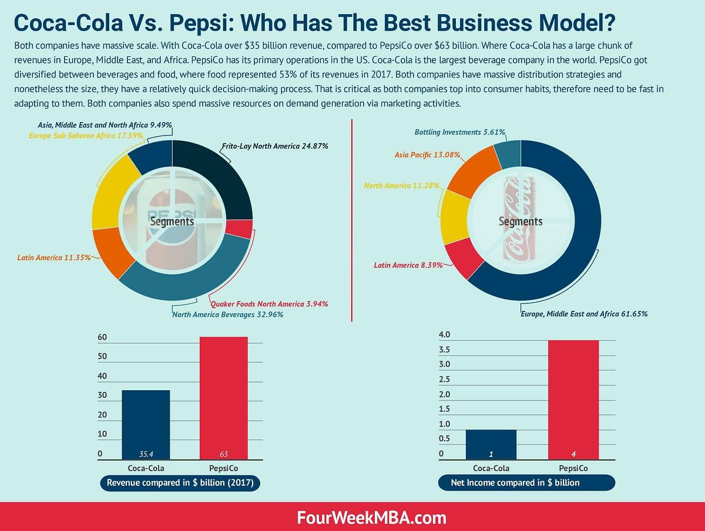

## Table of Contents

## What are the main products offered by Coca-Cola and Pepsi?

Coca-Cola offers a wide range of drinks. Their main product is Coca-Cola, a sweet, fizzy drink that many people enjoy. They also have other popular drinks like Sprite, which is a lemon-lime soda, and Fanta, which comes in different fruit flavors. Coca-Cola also makes diet drinks like Diet Coke and Coke Zero for people who want fewer calories. They have water and sports drinks too, like Dasani and Powerade.

Pepsi also has many different drinks. Their main product is Pepsi, another sweet, fizzy drink that is similar to Coca-Cola. They offer other sodas like Mountain Dew, which has a citrus flavor, and Sierra Mist, a lemon-lime soda. Pepsi makes diet drinks too, such as Diet Pepsi and Pepsi Max. They also have water and sports drinks, like Aquafina and Gatorade. Both companies keep adding new drinks to their lists to give people more choices.

## How do Coca-Cola and Pepsi distribute their products?

Coca-Cola and Pepsi use a big network to get their drinks to stores and people. They work with many companies that help move their products. These companies take the drinks from where they are made to places like big stores, small shops, and restaurants. Coca-Cola and Pepsi also use trucks and sometimes trains to move their drinks around the country. They make sure their drinks are in many places so people can easily find them.

Both companies also sell their drinks in other countries. They have special teams that work in different parts of the world to make sure their drinks are available everywhere. They build factories in other countries to make their drinks closer to where people will buy them. This helps them save time and money. They also work with local stores and businesses to sell their drinks in those areas.

## What are the revenue models of Coca-Cola and Pepsi?

Coca-Cola makes money mainly by selling their drinks to stores and other businesses. They don't usually sell their drinks directly to people. Instead, they sell to big stores, small shops, and restaurants. These places then sell the drinks to customers. Coca-Cola also makes money from licensing their brand. This means other companies can use the Coca-Cola name on things like clothes or toys, and Coca-Cola gets paid for it. They also earn money from selling the special ingredients and formulas that go into their drinks to other companies.

Pepsi also earns money by selling their drinks to stores and businesses. Like Coca-Cola, they sell to places like supermarkets, small shops, and restaurants, which then sell the drinks to customers. Pepsi makes money from their brand too. They let other companies use the Pepsi name on different products, and they get paid for that. Pepsi also earns money from selling their special ingredients and formulas to other companies. Both companies focus on making sure their drinks are popular and sold in many places to keep making money.

## How do Coca-Cola and Pepsi approach marketing and branding?

Coca-Cola and Pepsi use different ways to tell people about their drinks and make their brands well-known. They both use TV ads, billboards, and social media to show their drinks to lots of people. They also work with famous people, like singers and athletes, to help them sell their drinks. This makes people think their drinks are cool and fun. Both companies also have special events and contests to get people excited about their drinks. They want people to remember their drinks and choose them over others.

Coca-Cola focuses a lot on making people feel happy and connected when they drink their products. They use bright colors and fun pictures in their ads to make people feel good. They also talk about sharing and enjoying moments with friends and family. Coca-Cola wants their brand to be about happiness and togetherness. Pepsi, on the other hand, often tries to be seen as young and exciting. They use a lot of energy and action in their ads to make people feel lively and adventurous. Pepsi wants their brand to be about fun and excitement. Both companies spend a lot of money and time to make sure people know and like their drinks.

## What are the global market shares of Coca-Cola and Pepsi?

Coca-Cola is the biggest drink company in the world. They have about 43% of the global market for soft drinks. This means almost half of all the soft drinks people buy around the world are from Coca-Cola. They sell their drinks in more than 200 countries, and they are very popular in places like the United States, Mexico, and China.

Pepsi has a smaller share of the global market, around 25%. They are still a big company, but not as big as Coca-Cola. Pepsi sells their drinks in more than 200 countries too, but they are especially popular in the United States and some parts of Europe. Both companies work hard to sell more drinks and grow their businesses around the world.

## How do Coca-Cola and Pepsi manage their supply chains?

Coca-Cola and Pepsi manage their supply chains by working with many different companies. They start by making their drinks in big factories. Then, they use trucks and sometimes trains to move the drinks from the factories to places like big stores, small shops, and restaurants. They work with other companies that help them move the drinks around the country and the world. This helps them make sure their drinks are always available where people want to buy them.

Both companies also have factories in other countries to make their drinks closer to where people will buy them. This saves time and money because they don't have to move the drinks as far. They use special computer systems to keep track of how many drinks they have and where they are. This helps them make sure they always have enough drinks and that they can get them to stores quickly. They work hard to make sure their supply chains run smoothly so people can always find their drinks.

## What are the key financial differences between Coca-Cola and Pepsi?

Coca-Cola and Pepsi have some big differences in how they make money and spend it. Coca-Cola makes more money overall. In 2022, Coca-Cola had about $43 billion in revenue, while Pepsi had around $86 billion. But, Pepsi's revenue is higher because they sell more than just drinks. They also sell snacks like chips and cookies. Coca-Cola focuses more on drinks and makes a lot of their money from selling special ingredients and formulas to other companies. This is called licensing, and it helps Coca-Cola make more profit from each dollar they earn.

Both companies spend a lot of money to make their drinks and get them to stores. But, Coca-Cola spends a smaller part of their money on making and moving their drinks compared to Pepsi. This is because Coca-Cola works with other companies to do a lot of the work, so they don't have to spend as much. Pepsi, on the other hand, owns more of the factories and trucks that make and move their drinks, so they have to spend more money on these things. This is one reason why Coca-Cola usually has a higher profit margin, which means they keep more of the money they make after paying for everything.

## How do Coca-Cola and Pepsi innovate their product lines?

Coca-Cola and Pepsi are always trying to come up with new drinks to keep people interested. They do this by changing the flavors of their drinks or making new ones. For example, Coca-Cola has made drinks like Coca-Cola Cherry and Coca-Cola Vanilla. They also look at what people want, like healthier options, so they make drinks with less sugar or no sugar at all, like Diet Coke and Coke Zero. They use special teams to think of new ideas and test them to see if people like them before they start selling them everywhere.

Pepsi also works on new drinks all the time. They have made drinks like Pepsi Wild Cherry and Pepsi Max. They pay attention to what people want too, so they make drinks with different flavors and healthier options like Diet Pepsi and Pepsi Zero Sugar. Pepsi also tries to make drinks that fit with what's popular, like energy drinks and flavored waters. They have teams that work on coming up with new ideas and testing them to see if they will be popular before they start selling them widely. Both companies want to keep their drinks exciting and fresh so people keep buying them.

## What are the sustainability practices of Coca-Cola and Pepsi?

Coca-Cola and Pepsi both work on being more sustainable. This means they try to be better for the environment. Coca-Cola focuses on using less water and making less waste. They have goals to make all their packaging recyclable by 2025. They also work on projects to help communities have clean water. Coca-Cola tries to use less energy and make their factories more eco-friendly. They want to help the planet and make sure their business is good for the environment too.

Pepsi also works on sustainability. They have goals to cut down on how much water they use and make all their packaging recyclable by 2025, just like Coca-Cola. Pepsi tries to use more renewable energy and make their factories use less energy. They also work on projects to help farms be more sustainable. Pepsi wants to make sure their business helps the environment and that they can keep making their drinks in a way that is good for the planet.

Both companies know that being sustainable is important. They work hard to make their drinks in ways that are better for the environment. They want to keep making money but also help the planet. Coca-Cola and Pepsi both have teams that focus on sustainability and they share their goals and progress with people so everyone can see what they are doing to help the environment.

## How do Coca-Cola and Pepsi engage with their stakeholders?

Coca-Cola and Pepsi talk to a lot of different people who care about their businesses. These people are called stakeholders, and they include customers, workers, people who own shares in the company, and people in the places where they work. Coca-Cola and Pepsi listen to what these people say and try to make them happy. They do this by having meetings, sending out surveys, and using social media to talk to people. They also have special events where they can meet with stakeholders face-to-face. Both companies know that talking to stakeholders helps them make better drinks and be a better company.

Coca-Cola and Pepsi also work with groups in the communities where they have factories. They help with things like clean water projects and supporting local businesses. This makes the communities happier and helps the companies too. They also talk to people who own shares in their companies. They do this by having meetings where they share how the company is doing and what they plan to do next. This way, the people who own shares can feel good about their investment. Both companies know that keeping everyone happy is important for their success.

## What are the competitive strategies employed by Coca-Cola and Pepsi?

Coca-Cola and Pepsi both work hard to be better than each other. They do this by making sure their drinks are sold in lots of places. They try to have their drinks in every store and restaurant so people can always find them. They also spend a lot of money on ads to make people want to buy their drinks. They use TV, billboards, and the internet to show their drinks to as many people as possible. Both companies also try to make new drinks that people will like. They come up with new flavors and healthier options to keep people interested. They want to be the first to make something new and exciting so people will choose their drinks over the other company's.

Coca-Cola and Pepsi also try to make their drinks cheaper for stores to buy. This way, stores are more likely to sell their drinks instead of the other company's. They work on making their supply chains better so they can get their drinks to stores faster and cheaper. Both companies also try to be good to the environment. They want to use less water and make less waste. This makes people like them more and helps them sell more drinks. They know that being a good company can help them beat their competition.

## How do Coca-Cola and Pepsi adapt their business models to different regions?

Coca-Cola and Pepsi change their business models to fit different places around the world. They know that people in different countries like different flavors and have different needs. So, they make special drinks for each place. For example, in Japan, Coca-Cola sells drinks like Georgia Coffee, which is popular there. In Mexico, they sell more glass bottles because people like them. They also work with local businesses to make sure their drinks are sold in stores and restaurants in each country. This helps them sell more drinks and make people happy.

Both companies also change how they sell their drinks in different places. In some countries, they might use more trucks to move their drinks because the roads are good. In other places, they might use trains or boats if that works better. They also change their ads to fit each place. They use local languages and show things that people in that country like. This makes their ads more interesting to people. Coca-Cola and Pepsi want to make sure their drinks are popular everywhere, so they change their business to fit each place.

## What is Coca-Cola's Business Model?

Coca-Cola, founded in 1886 by John Stith Pemberton, has grown from a small pharmacy-based enterprise in Atlanta, Georgia, to one of the most recognizable brands globally. The company owes its exponential growth to strategic marketing and an extensive distribution network, which were laid out by Asa Candler, who purchased the formula and brand in 1888. Under his leadership, Coca-Cola expanded beyond local markets, setting up its bottling system that enabled mass production and wide-scale distribution.

Coca-Cola's business model is primarily centered around the beverage industry. The company focuses exclusively on non-alcoholic beverages, comprising sodas, water, sports drinks, and teas, with Coca-Cola Classic being its flagship product. This concentrated focus allows for brand loyalty and efficient resource allocation in product research and development, supply chain management, and marketing campaigns.

The company derives its revenue from several key sources. Firstly, direct product sales account for a significant portion, achieved through its bottling partners who manufacture, package, and distribute its beverage concentrates and syrups worldwide. Secondly, brand licensing provides another revenue stream. By granting rights to third parties to use its trademarks for products such as apparel and collectibles, Coca-Cola broadens its brand presence and generates additional income. In addition, Coca-Cola partakes in strategic investments and partnerships, such as ventures with restaurant chains and entertainment events, further diversifying its revenue channels. Sponsorships of major sporting events, including the Olympics and FIFA World Cup, enhance brand visibility and consumer engagement, contributing indirectly to revenue growth.

Market segmentation is another critical strategy for Coca-Cola. The company tailors its marketing and product offerings to various demographic groups. Product differentiation, such as the introduction of Diet Coke, Coca-Cola Zero Sugar, and other flavored variants, targets health-conscious consumers and those seeking diverse taste experiences. Coca-Cola's pricing strategy is methodical, with prices set based on competition levels within local markets. Econometric models such as the Linear Regression formula:

$$
P = \beta_0 + \beta_1 C + \beta_2 D + \epsilon
$$

where $P$ is the price, $C$ is the level of competition, $D$ is the demand elasticity, and $\epsilon$ is the error term, might be used to determine optimal pricing under various market conditions.

Overall, Coca-Cola’s business success can be attributed to its stringent focus on the beverage industry, diversified yet focused revenue streams, and a precise market segmentation and pricing strategy that adapt to competitive pressures.

## References & Further Reading

[1]: Bergstra, J., Bardenet, R., Bengio, Y., & Kégl, B. (2011). ["Algorithms for Hyper-Parameter Optimization."](https://papers.nips.cc/paper/4443-algorithms-for-hyper-parameter-optimization) Advances in Neural Information Processing Systems 24.

[2]: ["Advances in Financial Machine Learning"](https://www.amazon.com/Advances-Financial-Machine-Learning-Marcos/dp/1119482089) by Marcos Lopez de Prado

[3]: ["Evidence-Based Technical Analysis: Applying the Scientific Method and Statistical Inference to Trading Signals"](https://www.amazon.com/Evidence-Based-Technical-Analysis-Scientific-Statistical/dp/0470008741) by David Aronson

[4]: ["Machine Learning for Algorithmic Trading"](https://github.com/stefan-jansen/machine-learning-for-trading) by Stefan Jansen

[5]: ["Quantitative Trading: How to Build Your Own Algorithmic Trading Business"](https://www.amazon.com/Quantitative-Trading-Build-Algorithmic-Business/dp/1119800064) by Ernest P. Chan