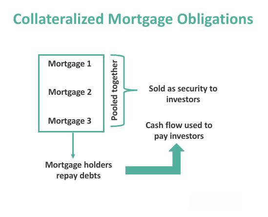

## Table of Contents

## What are Collateralized Mortgage Obligations (CMOs)?

Collateralized Mortgage Obligations (CMOs) are a type of mortgage-backed security that pools together a large number of mortgages and then divides them into different parts, called tranches. Each tranche has its own level of risk and return, based on when the payments from the underlying mortgages are expected to be received. This structure allows investors to choose a tranche that matches their risk tolerance and investment goals.

CMOs are created by financial institutions that buy mortgages from banks and other lenders. They then use these mortgages to back the securities they issue. The payments from the homeowners, including both principal and interest, are passed through to the investors in the CMOs. This setup can make investing in real estate more accessible to people who might not be able to buy a house directly, but it also comes with risks, such as the possibility that homeowners might default on their mortgages.

## What are Mortgage-Backed Securities (MBS)?

Mortgage-Backed Securities (MBS) are investments that are made up of a bunch of home loans put together. When people take out loans to buy houses, banks can sell those loans to other companies. These companies then group the loans together and sell them to investors as MBS. The money that homeowners pay on their mortgages, including both the amount they borrowed and the interest, goes to the investors who bought the MBS.

This way, investors can earn money from home loans without having to deal with the actual houses. But, there's a risk involved. If a lot of homeowners can't pay back their loans, the value of the MBS can go down, and investors might lose money. MBS helped make more money available for people to buy homes, but they also played a big role in the financial crisis of 2008 because many people couldn't pay their mortgages.

## How are CMOs and MBS structured differently?

Mortgage-Backed Securities (MBS) and Collateralized Mortgage Obligations (CMOs) both involve pooling home loans and selling them to investors, but they are structured differently. MBS are simpler; they pool a bunch of mortgages together and divide them into shares that investors can buy. When homeowners pay their mortgages, the money goes to the MBS investors. It's like owning a piece of a big pie made of many home loans, and you get a slice of all the payments coming in.

CMOs, on the other hand, take the concept a step further by slicing the pool of mortgages into different pieces called tranches. Each tranche has its own level of risk and return, based on when the money from the mortgages is expected to come in. Some tranches get paid back first and are safer, while others get paid later and are riskier but offer higher potential returns. This structure lets investors pick the part that fits their comfort with risk and their investment goals. So, while MBS is like owning a slice of a big pie, CMOs are like choosing from different layers of the pie, each with its own flavor of risk and reward.

## What are the primary sources of cash flows for CMOs and MBS?

The main source of cash flows for both CMOs and MBS comes from the payments homeowners make on their mortgages. When people pay their monthly mortgage bills, which include both the principal (the amount they borrowed) and interest, this money is collected by the financial institution that holds the mortgages. This institution then passes the money on to the investors who bought the MBS or CMOs.

For MBS, all the money collected from the homeowners is distributed to the investors based on their share of the security. It's like everyone gets a piece of the total payments coming in. For CMOs, the cash flows are a bit more complicated because they are split into different tranches. Each tranche gets paid in a specific order, with some tranches getting their money before others. This means that the cash flows from the mortgages are divided up and sent to different groups of investors based on the rules of each tranche.

## How do the risks associated with CMOs compare to those of MBS?

The risks for CMOs and MBS come from the same place: whether homeowners can pay their mortgages on time. If a lot of people can't pay, both CMOs and MBS can lose value. But, CMOs have an extra layer of risk because they are split into different parts called tranches. Each tranche has its own risk level. The safer tranches get paid first, but if a lot of homeowners default, the riskier tranches might not get any money at all. This means that while some investors in CMOs might be safer, others take on more risk.

MBS, on the other hand, spread the risk more evenly among all investors. If homeowners start missing payments, everyone who owns a piece of the MBS feels the impact at the same time. There's no special order of who gets paid first. This can make MBS feel less risky for some investors because the risk is shared equally. But, if you're looking for a chance to get higher returns by taking on more risk, MBS might not give you that choice as clearly as CMOs do with their different tranches.

## What are the typical investors in CMOs versus MBS?

Investors in CMOs are often big institutions like banks, insurance companies, and pension funds. They like CMOs because they can pick different parts of the CMO, called tranches, that match how much risk they want to take and how much money they want to make. Some tranches are safer and pay back money sooner, which is good for investors who don't want to take big risks. Other tranches are riskier but can offer higher returns, which might attract investors who are okay with more risk for a chance at more reward.

MBS, on the other hand, attract a wider range of investors, including individual investors and smaller institutions. Because MBS are simpler and the risk is shared evenly among all investors, they can be easier for people to understand and invest in. This makes them a good choice for someone who wants to invest in real estate without buying a house directly but doesn't want to deal with the complexities of CMOs. Both big institutions and smaller investors might buy MBS, but they're more common among those looking for a straightforward way to invest in mortgages.

## How do the prepayment risks differ between CMOs and MBS?

Prepayment risk is the chance that homeowners pay off their mortgages early, which can affect how much money investors get from CMOs and MBS. For MBS, when people pay off their loans early, it means the investors get their money back sooner than expected. This can be good because they get their money back faster, but it can also be bad if they were counting on the interest payments to keep coming in for a longer time. All investors in an MBS feel the impact of prepayments at the same time because the money is shared evenly among them.

CMOs handle prepayment risk differently because they are split into different parts called tranches. Each tranche has its own rules about when it gets paid back. Some tranches are designed to get paid off first, so they are more affected by early mortgage payments. These tranches might get their money back quickly, which is good if the investor wants their money back soon, but bad if they wanted more interest over time. Other tranches are set up to get paid later, so they might not feel the impact of prepayments as much. This setup lets investors pick a tranche that matches how they feel about the risk of people paying off their mortgages early.

## What role do tranches play in CMOs, and how does this compare to MBS?

Tranches are a big part of how CMOs work. They are like different layers of a cake, where each layer gets paid back at a different time. Some layers, called tranches, get their money first and are safer, but they might not make as much money over time. Other layers get paid later and are riskier, but they can make more money if things go well. This way, people who buy CMOs can pick the layer that matches how much risk they want to take and how much money they want to make. Tranches help make CMOs more flexible for different kinds of investors.

MBS, on the other hand, don't have these layers. They are more like a single big pie where everyone who buys a piece gets a share of all the money coming in from the mortgages. If people pay off their loans early or can't pay them at all, everyone who owns a piece of the MBS feels it at the same time. There's no special order of who gets paid first like there is with CMOs. This makes MBS simpler but also means everyone shares the same level of risk, without the option to pick a safer or riskier part like you can with CMOs.

## How do interest rate changes impact CMOs and MBS differently?

When interest rates change, it affects both CMOs and MBS, but in slightly different ways. For MBS, if interest rates go down, homeowners might pay off their mortgages early to get a new loan with a lower rate. This is called prepayment, and it means investors get their money back sooner than they expected. They might be happy to get their money back quickly, but it can also be a problem if they were counting on the interest payments to keep coming in. If interest rates go up, fewer people will pay off their loans early, so investors might keep getting their interest payments for longer, but the value of the MBS might go down because new MBS with higher interest rates look more attractive to other investors.

For CMOs, the impact of [interest rate](/wiki/interest-rate-trading-strategies) changes is more complicated because of the different tranches. If interest rates go down and more people prepay their mortgages, the tranches that get paid back first will feel this the most. Investors in these safer tranches might get their money back quickly, which can be good or bad depending on what they wanted. The riskier tranches, which get paid back later, might not feel the impact of prepayments as much. If interest rates go up, the safer tranches might keep getting payments for longer, while the riskier tranches might see their value drop more because they are less attractive compared to new investments with higher rates. The way CMOs are set up with different tranches gives investors more options to manage how interest rate changes affect them.

## What are the tax implications of investing in CMOs versus MBS?

When you invest in Mortgage-Backed Securities (MBS), you need to know about the taxes. The money you get from MBS, which comes from people paying their mortgages, is usually taxed as regular income. This means you pay taxes on it at the same rate as your other income, like your salary. If you sell your MBS for more than you paid for it, you might have to pay capital gains tax on the profit. But if you hold onto it for more than a year, you might get a lower tax rate on those gains.

For Collateralized Mortgage Obligations (CMOs), the tax rules can be a bit trickier because of the different tranches. Like MBS, the payments you get from CMOs are usually taxed as regular income. But because CMOs are split into different parts, the tax situation can change depending on which part you own. Some parts might give you special tax treatment, like being able to deduct certain losses or getting different rates on your gains. It's a good idea to talk to a tax expert to understand how the specific CMO you're looking at will affect your taxes.

## How have regulatory changes affected the markets for CMOs and MBS?

Regulatory changes have had a big impact on both the CMO and MBS markets. After the financial crisis in 2008, the government made new rules to make these investments safer. One big change was the Dodd-Frank Act, which made banks hold onto more of the risk from the loans they made. This meant they had to be more careful about the mortgages they put into MBS and CMOs. The rules also made banks show more information about the loans, so investors could see if they were a good investment.

These changes have made the MBS and CMO markets more stable but also more complicated. Banks have to do more work to make sure the loans are good before they can sell them as MBS or CMOs. This can make it harder for new MBS and CMOs to be created, which might mean fewer choices for investors. But the good news is that these rules have helped make the market safer, so there's less chance of another big financial crisis like the one in 2008.

## What advanced strategies can be used to optimize returns from CMOs and MBS?

To optimize returns from CMOs, investors can use a strategy called "tranche selection." This means [picking](/wiki/asset-class-picking) the right part of the CMO to invest in, based on how much risk they want to take and how long they want their money to be tied up. For example, if an investor wants less risk, they might choose a tranche that gets paid back first. If they're okay with more risk for a chance at higher returns, they might pick a tranche that gets paid back later. Another strategy is to use "interest rate swaps," where investors trade the interest they get from the CMO for a different type of interest rate. This can help them make more money if interest rates change in a way they expect.

For MBS, one way to optimize returns is by using "duration management." This means figuring out how long the MBS will last and adjusting investments to match that time. If an investor thinks interest rates will go down, they might buy MBS that will last longer, so they can keep getting the higher interest payments for a longer time. Another strategy is "yield curve positioning," where investors look at how different MBS perform based on the shape of the yield curve. By picking MBS that do well when the yield curve is in a certain shape, investors can try to make more money. Both of these strategies need a good understanding of how interest rates and the economy work, but they can help investors make the most of their MBS investments.

## References & Further Reading

[1]: ["Advances in Financial Machine Learning"](https://www.amazon.com/Advances-Financial-Machine-Learning-Marcos/dp/1119482089) by Marcos Lopez de Prado

[2]: ["Machine Learning for Algorithmic Trading"](https://github.com/stefan-jansen/machine-learning-for-trading) by Stefan Jansen

[3]: ["Quantitative Trading: How to Build Your Own Algorithmic Trading Business"](https://www.amazon.com/Quantitative-Trading-Build-Algorithmic-Business/dp/1119800064) by Ernest P. Chan

[4]: ["Structured Finance and Collateralized Debt Obligations"](https://onlinelibrary.wiley.com/doi/pdf/10.1002/9781118268230.fmatter) by Janet M. Tavakoli

[5]: ["Algorithmic Trading and DMA: An introduction to direct access trading strategies"](https://archive.org/details/algorithmictradi0000john) by Barry Johnson

[6]: ["Mortgage-Backed Securities: Products, Analysis, Trading"](https://www.wiley.com/en-us/Mortgage+Backed+Securities%3A+Products%2C+Structuring%2C+and+Analytical+Techniques-p-9781118044711) by Frank J. Fabozzi

[7]: ["Collaterallized Mortgage Obligations: Structures & Analysis"](https://www.amazon.com/Collateralized-Mortgage-Obligations-Structures-Analysis/dp/1883249627) by Frank J. Fabozzi

[8]: ["Algorithmic and High-Frequency Trading"](https://assets.cambridge.org/97811070/91146/frontmatter/9781107091146_frontmatter.pdf) by Álvaro Cartea, Sebastian Jaimungal, and José Penalva