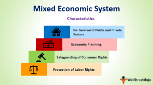

## Table of Contents

## What is a command economy?

A command economy is a type of economic system where the government makes all the big decisions about what to produce, how to produce it, and who gets the goods. In this system, the government owns most of the businesses and resources. They plan everything to make sure that the economy follows their goals, like providing basic needs for everyone or focusing on certain industries.

In a command economy, prices are usually set by the government, not by what people want to pay or what it costs to make things. This can mean that sometimes there are shortages of goods because the government might not guess right about what people need. Countries like Cuba and North Korea have command economies. The idea is to make sure everyone gets what they need, but it can be hard to keep everyone happy and to make sure the economy grows well.

## What is a mixed economy?

A mixed economy is a type of economic system that mixes parts of a command economy and a market economy. In a mixed economy, the government and private businesses both play important roles. The government might own some businesses, like the postal service or public transportation, but most businesses are owned by private people or companies. The government also makes rules to make sure businesses treat workers fairly and don't harm the environment.

In a mixed economy, the government can step in to help people who need it, like by providing healthcare or education. At the same time, people and businesses can buy and sell things freely, and prices are usually set by what people are willing to pay. This mix helps balance the freedom of the market with the need to take care of everyone in society. Countries like the United States, Canada, and many European nations have mixed economies.

## How do command and mixed economies differ in terms of government control?

In a command economy, the government has a lot of control. It decides what should be made, how to make it, and who gets the products. The government owns most of the businesses and sets the prices. This means that people can't just start their own business or buy and sell things freely. The government's goal is to make sure everyone gets what they need, but sometimes this can lead to shortages if the government guesses wrong about what people want.

In a mixed economy, the government has less control than in a command economy. While the government does own some businesses and makes rules to protect people and the environment, most businesses are owned by private people or companies. People and businesses can buy and sell things more freely, and prices are usually set by what people are willing to pay. The government can still step in to help people who need it, like by providing healthcare or education, but it doesn't control everything like in a command economy.

## What are the key characteristics of a command economy?

In a command economy, the government has a lot of power. It decides what things should be made, how they should be made, and who gets them. The government owns most of the businesses and controls the resources. This means people can't just start their own business or buy and sell things freely. The government's main goal is to make sure everyone gets what they need, like food and housing. But sometimes, this can lead to problems. If the government guesses wrong about what people want, there might not be enough of some things, causing shortages.

Prices in a command economy are set by the government, not by what people want to pay or what it costs to make things. This can make it hard for the economy to grow and change. The government plans everything to meet its goals, but it can be tough to keep everyone happy. Countries like Cuba and North Korea have command economies. The idea is to make sure everyone is taken care of, but it can be hard to make sure the economy works well for everyone.

## What are the key characteristics of a mixed economy?

A mixed economy is a type of system where the government and private businesses both have important roles. In this system, the government might own some businesses, like the postal service or public transportation, but most businesses are owned by private people or companies. The government makes rules to make sure businesses treat workers fairly and don't harm the environment. People and businesses can buy and sell things more freely than in a command economy, and prices are usually set by what people are willing to pay.

The government in a mixed economy can step in to help people who need it, like by providing healthcare or education. This mix helps balance the freedom of the market with the need to take care of everyone in society. Countries like the United States, Canada, and many European nations have mixed economies. The idea is to let the market work freely while making sure everyone gets the help they need.

## How do command and mixed economies approach resource allocation?

In a command economy, the government decides how resources are used. They make plans to figure out what should be made, how it should be made, and who gets it. The government owns most businesses and resources, so they can tell everyone what to do. The goal is to make sure everyone gets what they need, like food and housing. But sometimes, the government might guess wrong about what people want, and there could be shortages of some things.

In a mixed economy, both the government and private businesses decide how resources are used. The government might own some businesses, but most are owned by private people or companies. People and businesses can buy and sell things more freely, and prices are set by what people are willing to pay. The government can step in to help people who need it, like by providing healthcare or education. This way, the market can work freely, but the government also makes sure everyone gets the help they need.

## What are the advantages of a command economy?

One big advantage of a command economy is that the government can make sure everyone gets what they need. In this kind of economy, the government decides what to make and how to share it. This means they can focus on making sure people have enough food, homes, and other important things. If the government sees that people need more of something, they can plan to make more of it. This can be good for making sure no one goes without the basics.

Another advantage is that a command economy can help the country focus on big goals. The government can choose to put a lot of effort into certain industries, like making better technology or building more schools. Because the government controls everything, they can make sure these big projects get done. This can help the country grow in ways that the government thinks are important.

## What are the advantages of a mixed economy?

One advantage of a mixed economy is that it gives people and businesses more freedom. In a mixed economy, most businesses are owned by private people or companies. This means people can start their own businesses and buy and sell things more freely. Prices are set by what people are willing to pay, not just by the government. This can help the economy grow because businesses can make things that people really want.

Another advantage is that the government can step in to help people who need it. In a mixed economy, the government can provide things like healthcare and education to make sure everyone gets the help they need. This can make life better for people who might not be able to afford these things on their own. The mix of government help and private business freedom can make the economy stronger and fairer for everyone.

## What are the disadvantages of a command economy?

One big problem with a command economy is that it can lead to shortages. Because the government decides what to make and how much to make, they might guess wrong about what people need. If they make too much of one thing and not enough of another, people might not be able to get what they want. This can make life hard for people because they can't just go out and buy what they need.

Another disadvantage is that a command economy can be slow to change. Since the government plans everything, it can take a long time to make new plans if something goes wrong. This means the economy might not grow as fast as it could. Also, because people can't start their own businesses easily, there might not be as many new ideas and inventions. This can make it hard for the country to keep up with other places that have more freedom in their economies.

## What are the disadvantages of a mixed economy?

One problem with a mixed economy is that it can be hard to balance the freedom of the market with the government's role. Sometimes, the government might make too many rules, which can slow down businesses and make it harder for them to grow. On the other hand, if the government doesn't do enough, some people might not get the help they need, like healthcare or education. Finding the right balance can be tricky and can lead to disagreements about how much the government should be involved.

Another issue is that a mixed economy can lead to inequality. Even though the government tries to help people who need it, some people might still end up with a lot more money and resources than others. This can happen because businesses that do well can make a lot of money, while others might struggle. It can be hard for the government to make sure everyone has a fair chance, and this can cause problems in society.

## How do command and mixed economies impact innovation and economic growth?

In a command economy, the government controls most businesses and decides what to make. This can make it hard for new ideas to grow because people can't start their own businesses easily. If someone has a new invention or a different way to do things, they might not be able to try it out. This can slow down innovation and make the economy grow more slowly. The government might focus on big projects that they think are important, but they might not always guess right about what people really need or want. This can lead to shortages and can make it hard for the economy to change and grow quickly.

In a mixed economy, people and businesses have more freedom to try new things. If someone has a new idea, they can start a business to make it happen. This can lead to more innovation because people are free to try out their ideas. The economy can grow faster because businesses can make things that people really want. But, the government still has a role in a mixed economy. They can help make sure everyone gets what they need, like healthcare and education. This can help the economy grow in a fair way, but it can also be hard to find the right balance between freedom and government help.

## Can you provide real-world examples of countries that operate under command and mixed economies, and how do their economic performances compare?

Cuba and North Korea are examples of countries with command economies. In Cuba, the government owns most businesses and decides what to make and how to share it. They focus on making sure everyone has food, homes, and healthcare. But sometimes, people can't find things they want because the government might not guess right about what people need. North Korea is similar, with the government controlling almost everything. They focus on big projects like building military strength, but this can make it hard for the economy to grow quickly and for people to have new things.

Countries like the United States, Canada, and many in Europe have mixed economies. In the United States, most businesses are owned by private people or companies, but the government helps with things like healthcare and education. This mix helps the economy grow because businesses can make things people want, and the government makes sure everyone gets help if they need it. Canada and European countries like Germany and France work in similar ways. Their economies often grow faster than command economies because of the freedom to innovate and start new businesses. But, they still face challenges in making sure everyone is treated fairly and gets what they need.

## What is a Command Economy?

A command economy is characterized by the centralized control of economic activities by the government. This system involves the government making all critical economic decisions, including what goods and services are produced, how they are produced, and the prices at which they are offered. The primary objective is to achieve equitable distribution of resources and eliminate significant income disparities. However, this centralized control often leads to several inherent inefficiencies and challenges.

The lack of competitive markets in command economies tends to stifle innovation and creative advancements. Without the pressure of market competition, there is little incentive for businesses to improve products, reduce costs, or innovate, leading to stagnation in technological and operational developments. Moreover, centralized planning requires extensive bureaucratic systems, which can be slow to respond to changes and often result in resource misallocation.

North Korea and Cuba serve as prominent examples of command economies. In North Korea, the government exerts rigorous control over all economic activities, encompassing production and distribution decisions. This tight control often results in chronic issues such as food shortages and limited access to goods. Similarly, in Cuba, the state dominates major sectors like healthcare and education, while private enterprise is significantly restricted.

These inefficiencies can be understood through basic economic models. In a command economy, the supply and demand curves do not naturally intersect to determine equilibrium prices and quantities. Instead, prices are set by the government, which can lead to persistent shortages or surpluses. For instance, let $Q_d(p)$ represent the demand function and $Q_s(p)$ the supply function, both dependent on the price $p$. In a free market, the equilibrium is defined by:

$$
Q_d(p) = Q_s(p)
$$

In a command economy, however, this equilibrium condition is overridden by government-set prices $p_g$, leading to $Q_d(p_g) \neq Q_s(p_g)$, manifesting in either unmet demand or excess supply.

Despite their challenges, command economies often aim to achieve a more equitable distribution of wealth compared to capitalist economies. However, this comes at the cost of reduced economic efficiency and slower technological progress, presenting significant developmental hurdles.

## References & Further Reading

Bergstra, J., Bardenet, R., Bengio, Y., & Kégl, B. discuss hyper-parameter optimization algorithms, providing insights into the selection and tuning of models crucial for [algorithmic trading](/wiki/algorithmic-trading) systems. Their work explores techniques like grid search and random search, paving the way for optimized trading algorithms that can adapt effectively to market data.

Marcos Lopez de Prado's "Advances in Financial Machine Learning" serves as a comprehensive guide for incorporating [machine learning](/wiki/machine-learning) strategies into trading systems. The book covers topics such as feature engineering, [backtesting](/wiki/backtesting), and the design of machine learning pipelines that enhance trading strategies' efficiency and resilience.

Stefan Jansen's "Machine Learning for Algorithmic Trading" focuses on applying Python-based machine learning techniques to develop and optimize trading algorithms. His work includes numerous code examples and practical implementations, shedding light on feature extraction, model evaluation, and the integration of machine learning methods in trading systems.

These resources collectively offer a thorough understanding of how advanced computational techniques can revolutionize trading strategies, particularly in mixed and market-oriented economies, where algorithmic trading is most prevalent.

