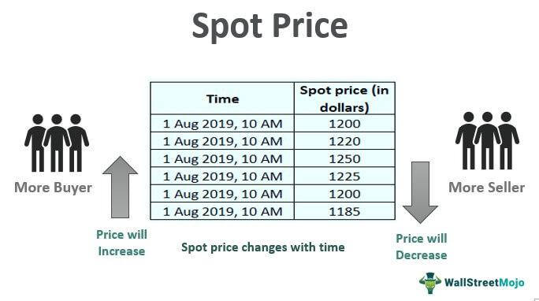

Commodity markets serve as fundamental pillars of global trade, encompassing a wide range of raw materials and primary agricultural products that are traded internationally. These markets are integral to the world economy as they provide mechanisms for price discovery, risk management, and hedging. Commodities like crude oil, gold, and wheat not only satisfy basic human needs but also support various industries and national economies. Their prices can influence inflation rates, economic policymaking, and international trade balances.

In commodity markets, prices are typically classified into two categories: futures prices and spot prices. Futures prices are determined by contracts that obligate the purchase or sale of a commodity at a specified forward date. These contracts act as financial instruments that facilitate hedging against price volatility, allowing producers and consumers to lock in prices for future transactions. Factors such as supply and demand, geopolitical stability, and weather conditions influence these prices. Spot prices, on the other hand, reflect the current market value for immediate delivery. The spot price provides insight into the immediate supply and demand dynamics for a commodity.



Algorithmic trading has emerged as a pivotal player in commodity markets, referring to the use of computer programs and systems to execute trades at high speed and volume. Algorithms can process vast amounts of market data far more quickly than human traders, enabling more efficient price discovery and arbitrage opportunities. The incorporation of advanced technologies, such as machine learning and artificial intelligence, enhances these algorithms' ability to predict market trends and adjust strategies in real time.

This article seeks to explore the intricate relationship between futures and spot prices and the impact of algorithmic trading on these market dynamics. Understanding these relationships is crucial for traders and investors aiming to capitalize on market movements and mitigate risks. By examining these concepts, market participants can better navigate the complexities of commodity trading and adapt to the rapidly evolving technological landscape. By understanding the intricate dynamics between futures, spot prices, and algorithmic trading, traders and investors can enhance their decision-making processes, better manage their risk, and maximize returns in an ever-evolving marketplace.

## Table of Contents

## Understanding Futures Prices

Futures contracts are standardized legal agreements to buy or sell a specific quantity of a commodity at a predetermined price on a future date. These contracts are traded on futures exchanges, which provide a centralized marketplace for buyers and sellers. The two parties involved in a futures contract are known as the long position, which agrees to buy the commodity, and the short position, which agrees to sell it.

Futures prices are influenced by a myriad of factors, primarily supply and demand dynamics. An increase in supply or a decrease in demand for the underlying commodity generally leads to lower futures prices. Conversely, a decrease in supply or an increase in demand tends to push prices higher. Geopolitical events can also significantly affect futures prices, especially for commodities such as oil and natural gas, which are sensitive to geopolitical tensions in producing regions. Weather conditions play a crucial role in agricultural commodities like wheat, corn, and soybeans. Adverse weather can disrupt supply, leading to higher prices, while favorable conditions can enhance supply and pressure prices downwards.

Futures prices are pivotal in the processes of price discovery and risk management. Price discovery is the mechanism through which market prices adjust to reflect new information, such as supply, demand, and external influences. Futures markets contribute to this by providing a transparent and efficient platform where various market participants express their expectations about future prices. This can be particularly insightful for producers, consumers, and speculators in planning their activities. Risk management, on the other hand, involves using futures contracts to hedge against unfavorable price movements. Producers, for instance, can lock in prices at which they will sell their commodities in the future, thus protecting themselves from potential drops in prices.

Numerous commodities are actively traded in futures markets. Crude oil futures, such as the West Texas Intermediate (WTI) and Brent crude, are popular for hedging against and speculating on fluctuations in oil prices. Gold futures provide a means for investors to hedge against market [volatility](/wiki/volatility-trading-strategies) and inflation, while agricultural futures, including contracts for wheat, corn, and soybeans, allow farmers and agribusinesses to manage the risks associated with unpredictable weather patterns and other agricultural factors.

In conclusion, futures prices play an essential role in commodity markets by facilitating price discovery and enabling participants to manage risk effectively. Understanding the intricacies of futures contracts, along with the factors influencing their prices, is crucial for anyone involved in commodity trading, whether they are investors, producers, or consumers.

## Deciphering Spot Prices

Spot prices represent the current market price at which a particular commodity can be bought or sold for immediate delivery and payment. In commodity trading, the spot price is fundamental to understanding market dynamics, as it reflects real-time supply and demand conditions. These prices are determined by the forces of the open market, influenced by various factors, such as geopolitical events, weather patterns, and economic data releases.

Compared to futures prices, spot prices capture the immediate nature of transactions. While a futures contract involves an agreement to buy or sell a commodity at a predetermined price at a future date, spot transactions settle instantly. This immediate settlement often means that spot prices are more volatile than their futures counterparts, as they directly respond to short-term market fluctuations.

Discrepancies between spot and futures prices arise from several factors. One primary reason is the cost of [carry](/wiki/carry-trading), which includes storage, insurance, and interest costs. This cost is represented mathematically in the formula for the futures price ($F$) as follows:

$$
F = S \times (1 + r)^t
$$

where:
- $S$ is the spot price,
- $r$ is the risk-free interest rate,
- $t$ is the time to maturity of the futures contract.

If the futures price is higher than the spot price adjusted for the cost of carry, it may indicate a contango market, where future prices are higher due to expectations of increased prices or costs. Conversely, a backwardation scenario occurs when the spot price is higher, reflecting a premium on immediate delivery due to current high demand or supply disruptions.

Examples of the impact of spot prices on financial markets include the oil industry, where sudden geopolitical tensions may cause a spike in spot oil prices, affecting transportation costs and inflation. Similarly, in agricultural commodities, unexpected weather conditions can alter crop yields, affecting spot prices and thereby influencing the revenues and profitability of producers and associated sectors.

Overall, understanding the mechanisms behind spot prices offers traders and investors insights into immediate and future market conditions, allowing for more informed decision-making in commodity trading.

## The Intersection of Futures and Spot Prices

The relationship between futures and spot prices in commodity markets is a critical aspect of understanding price dynamics and market behavior. Futures contracts, as derivative instruments, derive their value from the underlying spot prices of commodities. They offer market participants a mechanism for price discovery and risk management, while spot prices reflect the current market price at which a commodity can be bought or sold for immediate delivery.

### Interaction Between Futures and Spot Prices

Futures and spot prices are inherently linked through the cost-of-carry model, which posits that the futures price $F$ is equal to the spot price $S$ plus the cost of carrying the commodity until the delivery date. This can be mathematically expressed as:

$$
F = S \times e^{(r + c - y)t}
$$

where $r$ is the risk-free interest rate, $c$ is the storage cost, $y$ is the convenience yield, and $t$ is the time to maturity.

### Arbitrage Opportunities

Arbitrage plays a crucial role in aligning futures and spot prices. When there is a discrepancy between the calculated futures price and the actual futures price, traders can execute [arbitrage](/wiki/arbitrage) strategies to exploit these price differences. For instance, if the futures price is higher than the expected fair value given the current spot price and the cost-of-carry model, an arbitrageur could sell the overpriced futures contract and buy the underlying spot commodity, thus profiting from the price differential. These arbitrage activities help in correcting mispricings and moving the market towards equilibrium.

### Futures Basis

The futures basis is defined as the difference between the spot price and the futures price:

$$
\text{Basis} = S - F
$$

The basis is a crucial indicator in trading strategies, often used to forecast price movements, assess storage decisions, and plan hedging strategies. A positive basis, known as "backwardation," indicates that the spot price is higher than the futures price, often reflecting supply constraints or high demand. Conversely, a negative basis, or "contango," suggests that futures prices exceed spot prices, typically due to expectations of lower future demand or higher future supply.

### Case Studies: Futures and Spot Price Dynamics

To illustrate real-world interactions, consider the [crude oil](/wiki/crude-oil) markets. During periods of geopolitical instability, spot prices may surge due to immediate supply concerns, pushing futures markets into backwardation. Conversely, in times of stable supply and anticipated future production increases, contango may dominate.

Another example is agricultural commodities, where weather patterns have a significant impact. A sudden drought can cause immediate spikes in spot prices due to scarcity, with futures prices adjusting as the market anticipates long-term effects.

By understanding the interplay between futures and spot prices, market participants can effectively navigate commodity markets, making informed decisions that leverage arbitrage opportunities and basis dynamics.

## Impact of Algorithmic Trading

Algorithmic trading has revolutionized commodity markets by introducing advanced computational techniques that automate trading processes. At its core, [algorithmic trading](/wiki/algorithmic-trading) involves leveraging pre-programmed software to execute trades based on an array of market signals, conditions, and data-driven rules. These algorithms analyze massive datasets at speeds and with precision beyond human capability, enabling more efficient and effective trading outcomes. The growing prevalence of algorithmic trading in commodity markets can largely be attributed to its ability to process vast amounts of data quickly, reduce transaction costs, and eliminate human emotional biases that can detract from trading decisions.

Algorithmic trading affects both futures and spot prices in multiple ways. It enhances market efficiency by narrowing bid-ask spreads and increasing [liquidity](/wiki/liquidity-risk-premium). When algorithms respond to anomalies between futures and spot prices, they enable arbitrage strategies that help align these prices, often resulting in a more accurate reflection of an asset's true market value. However, high-frequency trading ([HFT](/wiki/high-frequency-trading-strategies)), a subset of algorithmic trading, can amplify price discrepancies, inadvertently causing temporary inefficiencies in the markets.

The benefits of algorithmic trading in commodities are numerous. By automating trading, market participants can reduce trading costs, enhance execution speed, and capitalize on short-lived market opportunities through sophisticated strategies like [statistical arbitrage](/wiki/statistical-arbitrage), trend-following, or mean-reversion. Additionally, algorithmic trading provides systematic risk management capabilities, whereby algorithms are programmed to implement stop-loss orders or adjust portfolio compositions in real-time based on market conditions.

Despite these benefits, algorithmic trading poses significant challenges. One major concern is its potential to cause market volatility, particularly through HFT. When numerous algorithms operate simultaneously, they can exacerbate price movements during periods of market stress or uncertainty. This effect was notably observed during events such as the "Flash Crash" of 2010 when algorithm-driven trades rapidly drove down equity prices within minutes, underscoring the potential unpredictability of automated trading systems.

Algorithm-driven volatility is often attributed to feedback loops, where trading algorithms react to each other's actions, creating cascading market movements. While regulators are continuously developing frameworks to monitor and mitigate these risks, traders and investors must stay informed about technological advancements and evolving market structures to navigate the complex trading environment algorithmic trading has created. 

In conclusion, while algorithmic trading offers enhanced efficiency, reduced costs, and improved market function, it also presents new challenges, particularly concerning market stability. Understanding these dynamics is crucial for stakeholders in commodities markets as they adapt to these transformative changes.

## Strategies Involving Futures, Spot Prices, and Algo Trading

Incorporating futures and spot prices in trading strategies, particularly through algorithmic trading, is crucial for enhancing efficiency and optimizing financial outcomes in commodity markets. These strategies rely on sophisticated models to rapidly identify and exploit market inefficiencies or trends. 

One fundamental strategy is **spread trading**, which involves taking simultaneous positions in two related futures contracts to capitalize on the price spread between them. Spread traders look for instances where the futures price of a commodity diverges from its spot price and use algorithms to execute their trades across multiple exchanges instantaneously. For example, an algorithm might buy a commodity at the spot price while selling the futures contract or vice versa, profiting as the prices converge. 

Algorithms also play a critical role in **market-making** strategies, providing liquidity by continuously quoting bid and ask prices. They adjust prices according to market conditions, inventory levels, and risks. A typical market-making algorithm evaluates [order book](/wiki/order-book-trading-strategies) dynamics to maintain an optimal balance of trades and inventory, enhancing market efficiency.

**Trend-following strategies** utilize algorithms to determine the direction of price movements based on historical data. These algorithms identify patterns that suggest upward or downward trends, enabling traders to position themselves accordingly. Such strategies often rely on technical indicators like moving averages to guide decision-making. Here's an example of a simple moving average crossover strategy in Python:

```python
import pandas as pd
import numpy as np

def moving_average_strategy(prices, short_window=40, long_window=100):
    signals = pd.DataFrame(index=prices.index)
    signals['signal'] = 0.0

    # Create short and long simple moving averages
    signals['short_mavg'] = prices['Close'].rolling(window=short_window, min_periods=1).mean()
    signals['long_mavg'] = prices['Close'].rolling(window=long_window, min_periods=1).mean()

    # Generate signals
    signals['signal'][short_window:] = np.where(
        signals['short_mavg'][short_window:] > signals['long_mavg'][short_window:], 1.0, 0.0
    )

    # Create positions based on the signals
    signals['positions'] = signals['signal'].diff()

    return signals
```

Risk management is integral to algorithmic trading strategies, especially when dealing with futures and spot prices. **VaR (Value at Risk)** is a common quantitative technique used to gauge potential losses in a portfolio. Algorithms can continuously calculate VaR to adjust positions and limit exposure. Implementing **stop-loss orders** is another risk management technique. These predefined thresholds automatically sell positions once losses exceed acceptable levels, thus preventing significant portfolio drawdowns.

Finally, the implementation of **arbitrage strategies** aims to exploit price discrepancies between markets or financial instruments. In futures and spot markets, arbitrage opportunities arise when a difference exists between the spot price and the futures price that exceeds the cost of carrying, such as storage and financing expenses. Algorithms can rapidly identify and act on these arbitrage openings, providing virtually risk-free profits until the market corrects itself.

In summary, the integration of algorithmic models within trading strategies involving futures and spot prices significantly enhances the speed, precision, and profitability of trading activities. With the ongoing development of these algorithms and quant-driven approaches, traders are well-positioned to maintain competitive advantages in commodity markets.

## Future Trends and Innovations

Commodity trading has long been a cornerstone of global economic activity, and its evolution continues to reshape the landscape of global trade. As technology advances and regulatory frameworks evolve, the future of commodity trading and its associated price-setting mechanisms is poised for significant transformation.

Technological advancements are having a profound impact on futures and spot markets. Increasingly sophisticated data analytics, [machine learning](/wiki/machine-learning), and [artificial intelligence](/wiki/ai-artificial-intelligence) are being deployed to enhance trading strategies and optimize pricing models. Machine learning algorithms can analyze vast datasets to identify patterns and trends that are not easily discernible by human traders, improving the accuracy of price predictions and risk assessments. Furthermore, blockchain technology is expected to play a pivotal role in commodity markets by providing secure, transparent, and efficient transaction processes. Smart contracts could automate the execution of trades once predefined conditions are met, reducing transaction costs and increasing market efficiency.

Regulatory changes remain a critical [factor](/wiki/factor-investing) in shaping algorithmic trading. Authorities worldwide are reevaluating regulatory frameworks to enhance market integrity and protect against systemic risks associated with high-frequency trading. For example, the European Securities and Markets Authority (ESMA) and the U.S. Securities and Exchange Commission (SEC) have implemented measures to curb excessive market volatility and ensure fair trading practices. Potential future regulations may include stricter requirements for algorithm testing, improved transparency, and enhanced oversight of trading activities. These changes aim to balance the benefits of technological innovation with the need for robust risk management.

Emerging trends and innovations are also expected to shape the algorithmic trading landscape in commodities. The integration of environmental, social, and governance ([ESG](/wiki/esg-investing)) considerations into trading strategies is gaining traction. Commodity traders are increasingly factoring in sustainability criteria, such as carbon footprint and social impact, in response to growing investor demand for responsible investing. Additionally, quantum computing presents a frontier for algorithmic trading, promising unparalleled computational capabilities that could revolutionize data processing and decision-making.

The integration of these technological advancements and regulatory changes in commodity trading will likely lead to a more dynamic and resilient market environment. As traders and investors adapt to these shifts, the ability to leverage innovation effectively while managing emerging risks will be crucial for success in the commodity markets of the future.

## Conclusion

Understanding futures, spot prices, and algorithmic trading is vital for participants in commodity markets. These elements form the backbone of modern trading environments, influencing the dynamics of price discovery, risk management, and transaction efficiency. Futures contracts offer a mechanism for hedging against price volatility and forecasting market trends, while spot prices reflect the current market sentiment and supply-demand equilibrium for commodities. The interaction between these pricing mechanisms enables traders to capitalize on arbitrage opportunities, thereby aligning futures and spot prices effectively.

Algorithmic trading, with its capacity for rapid data processing and execution, has transformed how markets operate. By automating trades based on pre-established criteria, algorithms boost efficiency and liquidity, although they can also introduce complexities such as heightened market volatility. Traders utilizing algorithmic strategies benefit from precise execution and the ability to respond swiftly to market movements. They employ diverse strategies, from trend-following to market-making, adapting to both futures and spot markets.

As technological advancements continue to reshape commodity trading, the future holds promise for innovation. The integration of sophisticated algorithms and machine learning models could enhance predictive accuracy and decision-making processes. Moreover, potential regulatory changes may redefine the boundaries within which algorithmic trading operates, ensuring market integrity while fostering growth.

For traders and investors, staying informed about these evolving mechanisms is crucial. Adapting to technological shifts and regulatory environments will be key to thriving in a competitive landscape. A proactive approach—embracing ongoing education, leveraging advanced tools, and monitoring market trends—will equip market participants to navigate the complexities of commodity trading successfully. As the market landscape evolves, the ability to integrate these elements into cohesive strategies will create opportunities for enhanced profitability and risk mitigation.

## References & Further Reading

[1]: Hull, J. C. (2017). ["Options, Futures, and Other Derivatives"](https://www.semanticscholar.org/paper/Options%2C-Futures%2C-and-Other-Derivatives-Hull/89bdee500c8623864fc9eb7a471546aa713acc44) (9th Edition). Pearson.

[2]: Geman, H. (2005). ["Commodities and Commodity Derivatives: Modelling and Pricing for Agriculturals, Metals and Energy"](https://download.e-bookshelf.de/download/0000/5675/90/L-G-0000567590-0015270354.pdf). Wiley.

[3]: Chan, E. P. (2009). ["Quantitative Trading: How to Build Your Own Algorithmic Trading Business"](https://github.com/ftvision/quant_trading_echan_book). John Wiley & Sons.

[4]: Jovanovic, F., & Legrand, C. (2014). ["A History of the Theory of Investment: Myths, Truths, and the All-Important Role of Speculation"](https://ehjournal.biomedcentral.com/articles/10.1186/s12940-024-01136-5). Columbia University Press.

[5]: Moles, P., & Terry, N. (1997). ["The Handbook of International Financial Terms"](https://www.oxfordreference.com/abstract/10.1093/acref/9780198294818.001.0001/acref-9780198294818). Oxford University Press. 

[6]: López de Prado, M. (2018). ["Advances in Financial Machine Learning"](https://www.amazon.com/Advances-Financial-Machine-Learning-Marcos/dp/1119482089). Wiley Finance.

[7]: Chincarini, L., & Kim, D. (2006). ["Quantitative Equity Portfolio Management: An Active Approach to Portfolio Construction and Management"](https://archive.org/details/quantitativeequi0000chin_c9d6). McGraw-Hill Education.