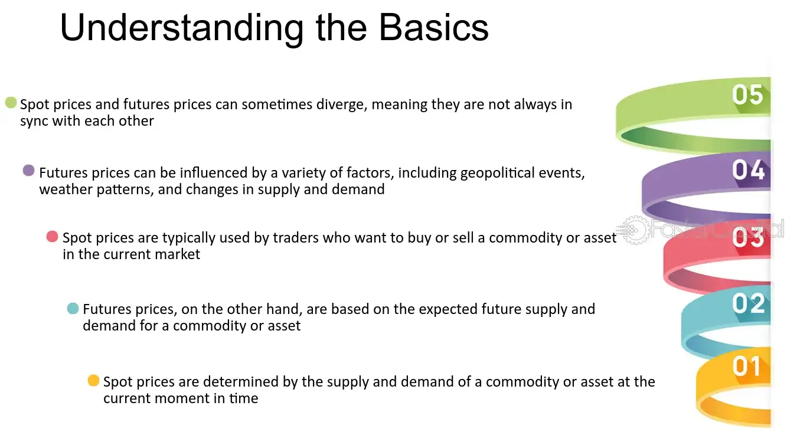

## Table of Contents

## What is a commodity?

A commodity is a basic good that is used in everyday life and can be bought and sold. These goods are usually the same no matter where you buy them from. Examples of commodities include things like oil, gold, wheat, and coffee. They are important because they are used to make many other products or are needed for daily life.

Commodities are traded on special markets called commodity markets. These markets help set the prices for these goods. The prices can change a lot because they depend on things like how much of the commodity is available and how much people want to buy it. For example, if there is a lot of wheat but not many people want to buy it, the price might go down. If there is not enough oil and many people want it, the price might go up.

## What is the difference between spot and futures prices?

Spot price is the price you pay to buy a commodity right now. It's like going to the store and buying something off the shelf. If you want to buy gold today, the spot price is what you would pay for it today. This price can change a lot because it depends on how much of the commodity is available and how much people want to buy it right now.

Futures price is different. It's the price you agree to pay for a commodity at a future date. It's like making a deal to buy something months from now at a price you agree on today. People use futures prices to plan and protect themselves from big price changes. For example, a farmer might agree to sell their wheat at a futures price to know how much money they will get, even if the spot price changes later.

## How are commodity spot prices determined?

Commodity spot prices are determined by how much of the commodity is available and how much people want to buy it right now. If there is a lot of a commodity, like oil, and not many people want to buy it, the spot price will be low. But if there is not much of the commodity and a lot of people want to buy it, the spot price will be high. This is called supply and demand.

Other things can also affect spot prices. For example, if there is a problem with getting the commodity from one place to another, like a storm stopping oil shipments, the spot price might go up because there is less available. Also, if something happens that makes people think they will need more of the commodity in the future, like a new law about using more renewable energy, the spot price can change even if the supply and demand right now are the same.

## How are commodity futures prices determined?

Commodity futures prices are set by what people think the price of the commodity will be in the future. This guess is based on things like how much of the commodity people think will be around later and how much they think people will want to buy it. For example, if people think there will be a lot of wheat next year but not many people will want to buy it, the futures price for wheat might be low.

Other things can also change futures prices. News about the weather, new laws, or problems with getting the commodity from one place to another can make people change their guesses about future prices. If a big storm is coming that might hurt the wheat crop, the futures price for wheat might go up because people think there will be less wheat available. So, futures prices are always changing as people get new information and change their minds about what will happen in the future.

## What factors influence commodity spot prices?

Commodity spot prices are mainly influenced by how much of the commodity there is and how much people want to buy it right now. This is called supply and demand. If there is a lot of a commodity, like oil, and not many people want to buy it, the spot price will be low. But if there is not much of the commodity and a lot of people want to buy it, the spot price will be high.

Other things can also affect spot prices. For example, if there is a problem with getting the commodity from one place to another, like a storm stopping oil shipments, the spot price might go up because there is less available. Also, if something happens that makes people think they will need more of the commodity in the future, like a new law about using more renewable energy, the spot price can change even if the supply and demand right now are the same.

## What factors influence commodity futures prices?

Commodity futures prices are set by what people think the price of the commodity will be in the future. This guess is based on how much of the commodity people think will be around later and how much they think people will want to buy it. For example, if people think there will be a lot of wheat next year but not many people will want to buy it, the futures price for wheat might be low.

Other things can also change futures prices. News about the weather, new laws, or problems with getting the commodity from one place to another can make people change their guesses about future prices. If a big storm is coming that might hurt the wheat crop, the futures price for wheat might go up because people think there will be less wheat available. So, futures prices are always changing as people get new information and change their minds about what will happen in the future.

## How do spot and futures prices interact in the market?

Spot and futures prices work together in the market. The spot price is what you pay to buy a commodity right now, like buying gold today. The futures price is what you agree to pay for the same commodity at a future date, like agreeing to buy gold in six months. These two prices are connected because what people think about the future can affect what they are willing to pay now. If people think the price of oil will go up in the future, they might be willing to pay more for it now, which can push the spot price up.

The interaction between spot and futures prices can help people make better guesses about the future. For example, if the futures price for wheat is much higher than the spot price, it might mean that people think there will be less wheat available in the future. This can help farmers decide how much to plant and help businesses plan how much to buy. So, by looking at both spot and futures prices, people can get a better idea of what might happen with the price of commodities over time.

## What are the advantages of trading commodity futures over spot?

Trading commodity futures has some big advantages over trading spot. One big advantage is that futures let you plan for the future. When you buy a futures contract, you agree on a price today for something you will get later. This can help you know what you will pay or get paid in the future, even if prices change a lot. For example, a farmer can sell wheat futures to know how much money they will get, even if the price of wheat goes down later.

Another advantage is that futures can help you make money from price changes without having to buy the actual commodity. This is called speculation. If you think the price of oil will go up, you can buy oil futures and sell them later at a higher price. You don't need to store oil or worry about moving it around. This can be easier and cheaper than buying and selling the actual commodity on the spot market.

## What are the risks associated with trading commodity futures?

Trading commodity futures can be risky because prices can change a lot. If you agree to buy something in the future at a certain price, but the price goes down before you get it, you might end up paying more than it's worth. This is called price risk. For example, if you buy a futures contract for oil and the price of oil drops, you could lose money when you have to buy the oil at the higher price you agreed on.

Another risk is called leverage. When you trade futures, you don't have to pay the full price right away. You only need to put down a small amount of money, called a margin. This can make your gains bigger if prices go your way, but it can also make your losses bigger if prices go against you. If the price moves a lot, you might have to put in more money to keep your position, and if you can't, you could lose a lot.

Also, futures markets can be hard to understand and predict. Things like weather, politics, and big economic changes can affect prices in ways that are hard to guess. If you don't know a lot about the market or don't have good information, you might make bad choices and lose money. So, it's important to be careful and learn as much as you can before trading commodity futures.

## How can one use futures prices to predict future spot prices?

You can use futures prices to guess what the spot price might be in the future. Futures prices are what people think a commodity like oil or wheat will cost at a later time. If the futures price for oil is high, it might mean that people think oil will be more expensive in the future. This can give you a clue about what the spot price might be when that time comes. But remember, it's just a guess, and a lot can change between now and then.

Sometimes, the difference between the spot price and the futures price can tell you something too. If the futures price is a lot higher than the spot price, it might mean that people think there will be less of the commodity available in the future, so the spot price could go up. But if the futures price is lower, it might mean the opposite. Still, it's not a perfect way to predict the future because many things can change, like the weather, new laws, or big events that affect how much of the commodity there is or how much people want it.

## What are some advanced strategies for trading commodity futures based on spot-futures price relationships?

One advanced strategy for trading commodity futures based on spot-futures price relationships is called spread trading. This means you buy and sell futures contracts at the same time but with different delivery dates. For example, if you think the difference between the spot price and the futures price will get smaller, you might buy the spot and sell the futures. If you're right, you can make money from the change in the difference between the two prices, even if the overall prices don't change much. This can be less risky than just betting on one price going up or down because you're looking at how the prices move compared to each other.

Another strategy is called arbitrage. This is when you find a way to buy a commodity on the spot market and sell it on the futures market, or the other way around, to make a profit from the price difference. If the futures price is a lot higher than the spot price, you could buy the commodity now and sell a futures contract to deliver it later. If everything goes as planned, you can make money from the difference. But arbitrage needs quick action and good information because the price differences that make it work can go away fast.

A third strategy is using technical analysis to predict how the spot and futures prices might change. This means looking at past price data to find patterns that can help you guess what might happen next. For example, if you see that the futures price often goes up when the spot price reaches a certain level, you might use that information to decide when to buy or sell. This strategy can help you make better guesses about the future, but it's not perfect because markets can be unpredictable and past patterns might not always repeat.

## How do global economic events affect the spread between commodity spot and futures prices?

Global economic events can really shake up the spread between commodity spot and futures prices. When something big happens, like a war or a big change in a country's economy, it can make people think differently about the future. If there's a war in an oil-producing country, people might worry that there won't be enough oil later. This can make the futures price for oil go up a lot more than the spot price because people are willing to pay more to make sure they get oil in the future. On the other hand, if a big economy like the United States goes into a recession, people might think they won't need as much of a commodity like copper, so the futures price might not go up as much as the spot price, making the spread smaller.

These events can also change how easy it is to move commodities around the world. If there's a new trade agreement or a big storm that stops ships from moving, it can affect how much of a commodity is available right now and how much people think will be available later. For example, if a storm stops oil shipments, the spot price might go up because there's less oil right now. But if people think the storm will pass quickly, the futures price might not go up as much, making the spread between the two prices bigger. So, global economic events can make the spread between spot and futures prices change in different ways, depending on what people think will happen next.

## What is the process of deciphering spot prices?

Spot prices represent the current market price at which a particular commodity can be bought or sold for immediate delivery and payment. In commodity trading, the spot price is fundamental to understanding market dynamics, as it reflects real-time supply and demand conditions. These prices are determined by the forces of the open market, influenced by various factors, such as geopolitical events, weather patterns, and economic data releases.

Compared to futures prices, spot prices capture the immediate nature of transactions. While a futures contract involves an agreement to buy or sell a commodity at a predetermined price at a future date, spot transactions settle instantly. This immediate settlement often means that spot prices are more volatile than their futures counterparts, as they directly respond to short-term market fluctuations.

Discrepancies between spot and futures prices arise from several factors. One primary reason is the cost of [carry](/wiki/carry-trading), which includes storage, insurance, and interest costs. This cost is represented mathematically in the formula for the futures price ($F$) as follows:

$$
F = S \times (1 + r)^t
$$

where:
- $S$ is the spot price,
- $r$ is the risk-free interest rate,
- $t$ is the time to maturity of the futures contract.

If the futures price is higher than the spot price adjusted for the cost of carry, it may indicate a contango market, where future prices are higher due to expectations of increased prices or costs. Conversely, a backwardation scenario occurs when the spot price is higher, reflecting a premium on immediate delivery due to current high demand or supply disruptions.

Examples of the impact of spot prices on financial markets include the oil industry, where sudden geopolitical tensions may cause a spike in spot oil prices, affecting transportation costs and inflation. Similarly, in agricultural commodities, unexpected weather conditions can alter crop yields, affecting spot prices and thereby influencing the revenues and profitability of producers and associated sectors.

Overall, understanding the mechanisms behind spot prices offers traders and investors insights into immediate and future market conditions, allowing for more informed decision-making in commodity trading.

## What is the Intersection of Futures and Spot Prices?

The relationship between futures and spot prices in commodity markets is a critical aspect of understanding price dynamics and market behavior. Futures contracts, as derivative instruments, derive their value from the underlying spot prices of commodities. They offer market participants a mechanism for price discovery and risk management, while spot prices reflect the current market price at which a commodity can be bought or sold for immediate delivery.

### Interaction Between Futures and Spot Prices

Futures and spot prices are inherently linked through the cost-of-carry model, which posits that the futures price $F$ is equal to the spot price $S$ plus the cost of carrying the commodity until the delivery date. This can be mathematically expressed as:

$$
F = S \times e^{(r + c - y)t}
$$

where $r$ is the risk-free interest rate, $c$ is the storage cost, $y$ is the convenience yield, and $t$ is the time to maturity.

### Arbitrage Opportunities

Arbitrage plays a crucial role in aligning futures and spot prices. When there is a discrepancy between the calculated futures price and the actual futures price, traders can execute [arbitrage](/wiki/arbitrage) strategies to exploit these price differences. For instance, if the futures price is higher than the expected fair value given the current spot price and the cost-of-carry model, an arbitrageur could sell the overpriced futures contract and buy the underlying spot commodity, thus profiting from the price differential. These arbitrage activities help in correcting mispricings and moving the market towards equilibrium.

### Futures Basis

The futures basis is defined as the difference between the spot price and the futures price:

$$
\text{Basis} = S - F
$$

The basis is a crucial indicator in trading strategies, often used to forecast price movements, assess storage decisions, and plan hedging strategies. A positive basis, known as "backwardation," indicates that the spot price is higher than the futures price, often reflecting supply constraints or high demand. Conversely, a negative basis, or "contango," suggests that futures prices exceed spot prices, typically due to expectations of lower future demand or higher future supply.

### Case Studies: Futures and Spot Price Dynamics

To illustrate real-world interactions, consider the [crude oil](/wiki/crude-oil) markets. During periods of geopolitical instability, spot prices may surge due to immediate supply concerns, pushing futures markets into backwardation. Conversely, in times of stable supply and anticipated future production increases, contango may dominate.

Another example is agricultural commodities, where weather patterns have a significant impact. A sudden drought can cause immediate spikes in spot prices due to scarcity, with futures prices adjusting as the market anticipates long-term effects.

By understanding the interplay between futures and spot prices, market participants can effectively navigate commodity markets, making informed decisions that leverage arbitrage opportunities and basis dynamics.

## References & Further Reading

[1]: Hull, J. C. (2017). ["Options, Futures, and Other Derivatives"](https://www.semanticscholar.org/paper/Options%2C-Futures%2C-and-Other-Derivatives-Hull/89bdee500c8623864fc9eb7a471546aa713acc44) (9th Edition). Pearson.

[2]: Geman, H. (2005). ["Commodities and Commodity Derivatives: Modelling and Pricing for Agriculturals, Metals and Energy"](https://download.e-bookshelf.de/download/0000/5675/90/L-G-0000567590-0015270354.pdf). Wiley.

[3]: Chan, E. P. (2009). ["Quantitative Trading: How to Build Your Own Algorithmic Trading Business"](https://github.com/ftvision/quant_trading_echan_book). John Wiley & Sons.

[4]: Jovanovic, F., & Legrand, C. (2014). ["A History of the Theory of Investment: Myths, Truths, and the All-Important Role of Speculation"](https://ehjournal.biomedcentral.com/articles/10.1186/s12940-024-01136-5). Columbia University Press.

[5]: Moles, P., & Terry, N. (1997). ["The Handbook of International Financial Terms"](https://www.oxfordreference.com/abstract/10.1093/acref/9780198294818.001.0001/acref-9780198294818). Oxford University Press. 

[6]: López de Prado, M. (2018). ["Advances in Financial Machine Learning"](https://www.amazon.com/Advances-Financial-Machine-Learning-Marcos/dp/1119482089). Wiley Finance.

[7]: Chincarini, L., & Kim, D. (2006). ["Quantitative Equity Portfolio Management: An Active Approach to Portfolio Construction and Management"](https://archive.org/details/quantitativeequi0000chin_c9d6). McGraw-Hill Education.