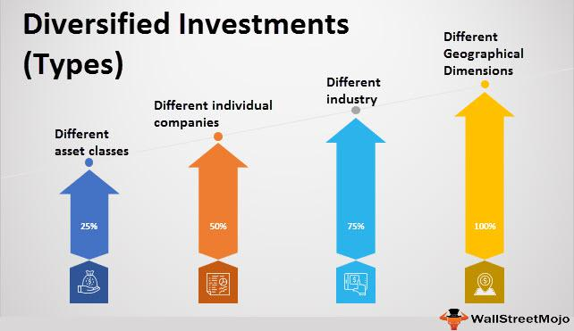

In today's dynamic financial environment, the importance of a well-rounded investment strategy cannot be overstated. Diversification, an investment strategy widely embraced by investors across the globe, aims to spread risk by allocating investments across various financial instruments, industries, and other categories. This approach reduces the impact of a poor performance in any single investment, allowing for a more stable long-term return on investment.

Algorithmic trading, a method of executing trades using automated pre-programmed algorithms, has transformed how investment portfolios are managed. Leveraging advanced technologies and vast datasets, algorithmic trading facilitates swift and precise trading decisions, enabling investors to efficiently enhance their diversification strategies. By analyzing market conditions in real-time and making trades based on pre-set criteria, algorithms allow for rapid adjustments in portfolio composition, optimizing performance while minimizing risk.



This article explores the intricate relationship between diversification, portfolio management, and algorithmic trading, detailing how they work in synergy to create robust investment strategies. Emphasizing the potential of technology-driven methods, we examine how these elements, when combined, provide investors with enhanced capabilities to navigate the complex financial landscape.

## Table of Contents

## Understanding Diversification in Portfolio Management

Diversification is a fundamental risk management strategy in portfolio management that involves allocating investments across a variety of financial instruments, asset classes, industries, and geographies. The primary rationale for diversification is its ability to reduce unsystematic risk, the risk inherent to a specific company or industry, which can be mitigated through careful diversification.

In essence, a diversified portfolio is designed to yield higher average returns while posing lower risk than any individual investment within the portfolio. This strategy leverages the fact that different asset types often react differently to the same economic event, potentially offsetting losses in one area with gains in another. For example, equities and bonds might respond differently to changes in interest rates, thereby balancing the overall impact on the portfolio.

The fundamental principle underpinning diversification is rooted in modern portfolio theory, which suggests that asset classes and individual investments often exhibit varying levels of correlation with one another. By including assets with low or negative correlations, investors can reduce the overall volatility of the portfolio. Mathematically, the variance (risk) of a two-asset portfolio is explained by the formula:

$$
\sigma_p^2 = w_1^2 \sigma_1^2 + w_2^2 \sigma_2^2 + 2w_1w_2\sigma_1\sigma_2\rho_{12}
$$

where $\sigma_p^2$ is the portfolio variance, $w_1$ and $w_2$ are the weights of the assets in the portfolio, $\sigma_1$ and $\sigma_2$ are the standard deviations of the assets, and $\rho_{12}$ is the correlation coefficient between the two assets. Ideally, by selecting assets with correlations less than one, the portfolio’s overall risk can be minimized compared to the risk of holding individual assets.

Diversification strategies typically encompass a broad range of asset classes, such as equities, fixed income securities (bonds), commodities, and real estate. Each asset class offers distinct benefits: equities provide growth potential, bonds offer income generation and decreased [volatility](/wiki/volatility-trading-strategies), commodities serve as a hedge against inflation, and real estate can offer both income and capital appreciation. Additionally, sector and geographic diversification are employed to spread risks associated with specific industries or regions.

For instance, investing across different sectors such as technology, healthcare, and financial services can shield a portfolio from sector-specific downturns. Similarly, geographical diversification involves spreading investments across various global markets, mitigating risks related to country-specific economic or political issues, and exploiting international growth opportunities.

Overall, while diversification does not eliminate risk entirely, it serves as a foundational strategy in portfolio management aimed at optimizing returns while minimizing exposure to individual asset risks. Through a well-structured diversification framework, investors can better align their portfolios with their long-term financial objectives and risk tolerance levels.

## The Role of Algorithmic Trading in Enhancing Diversification

Algorithmic trading, or 'algo trading,' fundamentally transforms the landscape of portfolio diversification by employing sophisticated algorithms and mathematical models to execute trades according to predefined criteria. The core advantage of this approach lies in its capacity to process enormous volumes of data with remarkable efficiency, thereby enabling a more comprehensive and effective diversification of investment portfolios.

One significant benefit of [algorithmic trading](/wiki/algorithmic-trading) is its ability to dynamically adjust portfolios in response to real-time market conditions. This adaptability ensures that investment strategies remain optimized, balancing potential returns against risk exposure. By consistently analyzing market trends and price movements, algorithms can facilitate adjustments that might be too complex and time-consuming for manual processing. As markets fluctuate, algorithmic trading allows for prompt rebalancing of asset allocations, ensuring that diversification strategies remain aligned with current market dynamics.

Furthermore, algorithmic trading provides investors with increased exposure to a variety of asset classes, global markets, and distinct trading strategies. This expanded reach enhances the speed and effectiveness of diversification efforts, as algorithms can be programmed to track and engage in multiple markets simultaneously. For instance, an algorithm can be designed to identify [arbitrage](/wiki/arbitrage) opportunities across international stock exchanges, investing in both equity and derivative instruments. This broadens the scope of potential investments and reduces the reliance on any single market or asset class.

In practical terms, algorithmic diversification can be exemplified through a simple Python implementation using libraries such as NumPy and pandas to calculate optimal asset allocations. Below is a basic illustration:

```python
import numpy as np
import pandas as pd
from scipy.optimize import minimize

# Sample data: expected returns and covariance matrix of assets
expected_returns = np.array([0.05, 0.10, 0.15])
cov_matrix = np.array([[0.005, -0.010, 0.004],
                       [-0.010, 0.040, -0.002],
                       [0.004, -0.002, 0.023]])

# Function to calculate portfolio variance
def portfolio_variance(weights, cov_matrix):
    return np.dot(weights.T, np.dot(cov_matrix, weights))

# Constraints: weights must sum to 1
constraints = {'type': 'eq', 'fun': lambda x: np.sum(x) - 1}
# Bounds for weights: no short selling, weights between 0 and 1
bounds = tuple((0, 1) for _ in range(len(expected_returns)))

# Initial guess for weights
init_guess = np.ones(len(expected_returns)) / len(expected_returns)

# Optimize weights to minimize variance
opt_results = minimize(portfolio_variance, init_guess, args=cov_matrix,
                       method='SLSQP', bounds=bounds, constraints=constraints)

print("Optimal Weights:", opt_results.x)
```

This code snippet demonstrates how an algorithm could be used to minimize portfolio variance, thereby optimizing asset distribution for risk-adjusted returns. By embracing such automated strategies, investors harness the power of technology to achieve enhanced diversification across their portfolios.

In summary, algorithmic trading significantly enhances portfolio diversification by optimizing asset allocation in real-time and expanding access to diverse markets and trading strategies. Its capacity to deal with complex datasets and execute trades at high speeds offers investors an invaluable tool in managing modern investment portfolios efficiently and effectively.

## Strategies for Effective Portfolio Diversification Using Algorithms

Multi-Asset Diversification involves using algorithms to efficiently manage trades across a variety of asset classes such as equities, bonds, commodities, and foreign exchange. This strategy is designed to smooth investment performance by reducing the volatility associated with any single asset class. Algorithms are capable of processing vast datasets to identify optimal entry and [exit](/wiki/exit-strategy) points for each asset class, thus ensuring balanced exposure across different markets. This approach not only helps in mitigating risks but also enhances the potential for steady returns by capitalizing on different market cycles.

Sector Diversification is achieved through algorithmic strategies that allocate investments across various sectors. These algorithms can adjust allocations based on sector performance metrics and broader economic indicators such as GDP growth rates, interest rates, and inflation. By continuously monitoring sector-specific data, these algorithms ensure that investments are dynamically shifted towards sectors showing strong potential, while reducing exposure to underperforming sectors. This technique helps in capturing the economic value associated with specific industries, thereby optimizing the overall portfolio performance.

Geographical Diversification employs algorithms to tap into international markets, thereby reducing region-specific risks. Algorithms can analyze geopolitical events, currency exchange rates, and regional economic data to determine the best geographical distribution of assets. This strategy allows investors to capitalize on global growth opportunities while hedging against risks posed by local economic downturns or political instability. By spreading investments internationally, portfolios can benefit from a diversified range of growth drivers and economic environments.

Strategy Diversification involves employing multiple algorithmic strategies to handle different market conditions. Common strategies include mean reversion, which seeks to capitalize on price anomalies by assuming prices will revert to their historical means, and [momentum](/wiki/momentum)-based strategies that buy securities with rising prices and sell those with declining prices. These strategies can be implemented through Python with libraries such as `pandas` for data handling and `numpy` for mathematical operations. An example of a simple mean reversion strategy in Python could involve calculating the historical mean of a security's price and executing trades based on deviations from this mean:

```python
import pandas as pd
import numpy as np

# Sample data
data = {'Price': [100, 105, 102, 108, 107, 111, 110]}
df = pd.DataFrame(data)

# Calculate the mean price
mean_price = np.mean(df['Price'])

# Implement mean reversion logic
df['Signal'] = np.where(df['Price'] > mean_price, 'Sell', 'Buy')
```

Employing these diverse algorithmic strategies ensures flexibility in adapting to various market conditions, thereby improving the robustness and resilience of the investment portfolio.

## Risk Management in Diversified Algorithmic Portfolios

Effective risk management is a cornerstone of successful diversification in investment portfolios, particularly when utilizing algorithmic trading. Algorithms play a pivotal role in managing risk exposure by maintaining alignment with investment goals while navigating market fluctuations.

One critical component of risk management is portfolio rebalancing. Algorithmic trading systems can automatically adjust the allocation of assets to ensure the portfolio remains consistent with the intended risk profile. This dynamic process involves constantly assessing market conditions and recalibrating investments to reflect these changes without manual intervention. For example, if a particular asset class within the portfolio appreciates significantly, rebalancing algorithms might sell a portion of those assets to purchase undervalued ones, thus maintaining the desired asset allocation. In Python, rebalancing could be implemented as follows:

```python
def rebalance_portfolio(portfolio, target_allocation):
    total_value = sum(asset['value'] for asset in portfolio)
    for asset in portfolio:
        target_value = total_value * target_allocation[asset['name']]
        asset['value'] = target_value
    return portfolio

# Example usage
portfolio = [{'name': 'stocks', 'value': 5000}, {'name': 'bonds', 'value': 2000}]
target_allocation = {'stocks': 0.6, 'bonds': 0.4}

rebalanced_portfolio = rebalance_portfolio(portfolio, target_allocation)
```

Hedging strategies are another key element embedded in algorithms to shield portfolios against significant market volatility. By employing derivative instruments such as options and futures, algorithms can lock in prices or create protective buffers during unpredictable periods. These hedging mechanisms help safeguard the portfolio's value against adverse market movements.

Algorithmic systems can exploit complex mathematical models to evaluate risk and trigger hedges at optimal times, ensuring continuous protection. This strategic use of hedges can be viewed as a form of insurance, allowing portfolios to withstand market uncertainties while focusing on long-term growth objectives.

As the financial markets evolve, the integration of advanced technologies in risk management through algorithmic diversification will likely develop further, providing investors with robust tools to mitigate risks efficiently.

## Future Implications of Algorithmic Diversification

As algorithmic trading evolves, its impact on portfolio diversification is anticipated to expand significantly, providing investors with increasingly sophisticated tools for risk management. This progress is driven largely by advancements in [machine learning](/wiki/machine-learning) (ML) and [artificial intelligence](/wiki/ai-artificial-intelligence) (AI), which are progressively being integrated into algorithmic trading strategies. These technologies empower algorithms to process and analyze vast datasets, identify complex patterns, and generate predictive insights that traditional methods may overlook.

Machine learning models, particularly those based on supervised and unsupervised learning techniques, can refine portfolio diversification by predicting asset price movements and market trends with greater accuracy. For instance, supervised learning models use historical data to predict future price changes, thereby assisting in asset allocation decisions. Unsupervised learning, on the other hand, can discover hidden correlations between diverse financial instruments, enabling more effective diversification.

The integration of AI into trading algorithms also facilitates adaptive learning, where strategies can continuously evolve based on real-time market feedback. This dynamic adjustment capability allows portfolios to remain aligned with changing market conditions, optimizing performance while mitigating risk. For example, [reinforcement learning](/wiki/reinforcement-learning)—a form of AI where algorithms learn optimal actions through trial and error—can be employed to adaptively manage portfolios in response to market volatility.

Python, a widely used programming language in the finance industry, offers several libraries like TensorFlow, PyTorch, and Scikit-learn that enable the implementation of sophisticated ML models for these purposes. A simple illustration of leveraging Python in algorithmic diversification could involve using a random forest model to predict asset returns, thereby guiding diversification decisions:

```python
from sklearn.ensemble import RandomForestRegressor
from sklearn.model_selection import train_test_split
import numpy as np

# Sample data representing asset features and returns
X = np.random.rand(1000, 10)  # Features
y = np.random.rand(1000)      # Returns

# Split data into training and testing sets
X_train, X_test, y_train, y_test = train_test_split(X, y, test_size=0.2, random_state=42)

# Train Random Forest model
model = RandomForestRegressor(n_estimators=100, random_state=42)
model.fit(X_train, y_train)

# Predict returns and guide diversification
predictions = model.predict(X_test)
```

Algorithmic diversification thus highlights a leap in portfolio management, offering improved performance and reduced risk through innovative strategies. As AI technologies advance, the precision and efficiency of these algorithms are expected to enhance further, making diversified, algorithm-driven portfolios a cornerstone of modern investment strategy. This fusion of algorithmic trading and AI not only promises to revolutionize how investors diversify but also ensures robust financial outcomes amidst a continuously evolving market landscape.

## Conclusion

Diversification remains a cornerstone of a well-constructed investment strategy, and with the advent of algorithmic trading, it has reached new heights of efficiency and precision. By employing algorithmic strategies, investors can seamlessly expand their asset classes, optimizing their exposure to various sectors, and even extending their reach into global markets. This technological advancement enables a more sophisticated approach to portfolio management, minimizing risk while enhancing potential returns.

Algorithms, tailored to specific investment criteria, facilitate the fine-tuning of portfolios by swiftly adapting to market dynamics. This adaptability ensures that investments are not only aligned with an investor’s personal goals but are also responsive to emerging market opportunities. Consequently, investors are positioned to achieve long-term financial stability and growth.

Moreover, as machine learning and artificial intelligence continue to mature, they promise to further enhance the capabilities of algorithmic trading strategies. These advancements are expected to bring about more precise predictive insights, allowing for even more robust diversification efforts.

In conclusion, the synergy of diversification and algorithmic trading equips investors with powerful tools to navigate the complexities of modern financial markets. By embracing these innovations, investors can safeguard their portfolios against volatility while capitalizing on growth opportunities, ensuring their investments remain robust and growth-oriented.

## References & Further Reading

[1]: [Bergstra, J., Bardenet, R., Bengio, Y., & Kégl, B. (2011). "Algorithms for Hyper-Parameter Optimization."](https://dl.acm.org/doi/10.5555/2986459.2986743) Advances in Neural Information Processing Systems 24.

[2]: ["Advances in Financial Machine Learning"](https://www.amazon.com/Advances-Financial-Machine-Learning-Marcos/dp/1119482089) by Marcos Lopez de Prado

[3]: ["Evidence-Based Technical Analysis: Applying the Scientific Method and Statistical Inference to Trading Signals"](https://www.amazon.com/Evidence-Based-Technical-Analysis-Scientific-Statistical/dp/0470008741) by David Aronson

[4]: ["Machine Learning for Algorithmic Trading"](https://github.com/stefan-jansen/machine-learning-for-trading) by Stefan Jansen

[5]: ["Quantitative Trading: How to Build Your Own Algorithmic Trading Business"](https://www.amazon.com/Quantitative-Trading-Build-Algorithmic-Business/dp/1119800064) by Ernest P. Chan