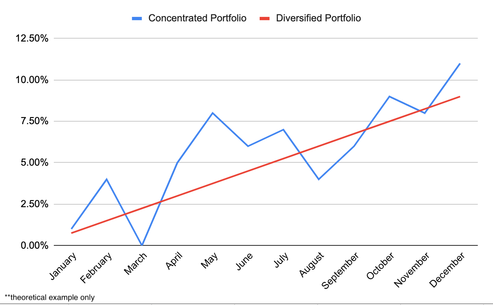

## Table of Contents

## What is a concentrated investment portfolio?

A concentrated investment portfolio is when you put a lot of your money into just a few investments instead of spreading it out over many. This means you might own only a handful of stocks or other assets, rather than a wide variety of them. It's like betting big on a few horses in a race instead of betting a little on many horses.

This kind of portfolio can be riskier because if one of your big investments does badly, it can really hurt your overall performance. But, on the flip side, if one of your investments does really well, it can make your portfolio grow a lot more than if you had spread your money around. It's a strategy that can lead to big wins or big losses, so it's important to think carefully before choosing to go this route.

## What is a diversified investment portfolio?

A diversified investment portfolio is when you spread your money across many different types of investments. This means you might own stocks, bonds, real estate, and maybe even some commodities like gold. The idea is to not put all your eggs in one basket, so if one type of investment goes down in value, the others might stay the same or even go up, helping to balance things out.

This approach is usually seen as less risky than having a concentrated portfolio because it reduces the impact of any single investment doing poorly. If you own a lot of different things, a problem in one area, like a drop in tech stocks, won't hurt your whole portfolio as much. Diversification can help you sleep better at night, knowing that your investments are spread out and less likely to all fail at the same time.

## What are the basic differences between concentrated and diversified portfolios?

A concentrated portfolio means you put most of your money into just a few investments. It's like betting on a few horses in a race. This can be riskier because if one of your big investments does badly, it can really hurt your whole portfolio. But if one of your investments does really well, it can make your portfolio grow a lot more than if you had spread your money around. It's a strategy that can lead to big wins or big losses.

On the other hand, a diversified portfolio means you spread your money across many different types of investments. It's like betting on a lot of horses in a race. This is usually seen as less risky because it reduces the impact of any single investment doing poorly. If you own a lot of different things, a problem in one area, like a drop in tech stocks, won't hurt your whole portfolio as much. Diversification can help you feel more secure, knowing that your investments are spread out and less likely to all fail at the same time.

In simple terms, a concentrated portfolio is like focusing on a few big bets, while a diversified portfolio is like spreading your bets to cover more ground. Each has its own way of dealing with risk and potential rewards, and choosing between them depends on what you're comfortable with and what your goals are.

## How does risk vary between concentrated and diversified portfolios?

In a concentrated portfolio, you put a lot of your money into just a few investments. This can be riskier because if one of those investments goes down, it can really hurt your whole portfolio. Imagine if you put all your money into one company's stock and that company does badly - you could lose a lot. But, on the other hand, if one of your few investments does really well, it can make your portfolio grow a lot more than if you had spread your money around. So, a concentrated portfolio can lead to big wins or big losses.

In a diversified portfolio, you spread your money across many different types of investments. This is usually seen as less risky because it reduces the impact of any single investment doing poorly. If you own a lot of different things, like stocks, bonds, and real estate, a problem in one area won't hurt your whole portfolio as much. For example, if tech stocks go down, your bonds or real estate might still be doing okay. This way, diversification helps you feel more secure because your investments are spread out and less likely to all fail at the same time.

## What are the potential returns from a concentrated versus a diversified portfolio?

A concentrated portfolio can lead to big wins or big losses. If you put a lot of your money into just a few investments and one of them does really well, your whole portfolio can grow a lot. For example, if you invest heavily in a company that suddenly becomes very successful, your returns could be much higher than if you had spread your money around. But, if one of your big investments does badly, it can really hurt your portfolio. So, while you might see higher potential returns with a concentrated portfolio, you also face a higher risk of losing money.

A diversified portfolio usually offers more steady but less spectacular returns. When you spread your money across many different types of investments, you're less likely to see huge gains from any single investment. But, you're also less likely to see big losses. If some of your investments do well while others do poorly, they can balance each other out, leading to more consistent, though possibly smaller, returns over time. This approach is often seen as safer because it reduces the risk of your whole portfolio being affected by the poor performance of just one investment.

## Can you explain the concept of correlation in the context of diversified portfolios?

In a diversified portfolio, correlation is about how different investments move in relation to each other. If two investments have a high correlation, it means they tend to go up or down at the same time. For example, if you own two tech stocks and the tech industry is doing well, both stocks might go up together. But if the tech industry does badly, both stocks might go down together. This is not great for diversification because if one investment does badly, the other one might too, and that can hurt your whole portfolio.

On the other hand, if two investments have a low correlation, it means they don't move in the same way. For example, if you own a tech stock and a bond, they might not go up or down at the same time. When the stock market is doing badly, bonds might still be doing okay, or even going up. This is good for diversification because it means that if one part of your portfolio is doing badly, another part might be doing well, helping to balance things out. So, when you're building a diversified portfolio, you want to pick investments that have low correlation with each other to reduce risk and make your portfolio more stable.

## How does an investor's risk tolerance affect the choice between concentrated and diversified portfolios?

An investor's risk tolerance is how much risk they are willing to take with their money. If you have a high risk tolerance, you might be okay with the ups and downs of a concentrated portfolio. This means you are willing to put a lot of your money into just a few investments, hoping for big wins even though it could also lead to big losses. People with a high risk tolerance might believe in their choices strongly and are ready to ride out the tough times for the chance of big rewards.

On the other hand, if you have a low risk tolerance, you might prefer a diversified portfolio. This means you spread your money across many different types of investments to keep things more stable. With a diversified portfolio, you're less likely to see big gains from any one investment, but you're also less likely to see big losses. People with a low risk tolerance want to feel more secure and are more comfortable with the idea of steady, smaller returns rather than the rollercoaster of a concentrated portfolio.

## What are the tax implications of managing concentrated versus diversified portfolios?

When you have a concentrated portfolio, you might have to pay more in taxes. This is because if one of your big investments does really well and you decide to sell it, you could owe a lot of taxes on the big profit you made. Also, if you need to sell one of your few investments to get some money, you might not be able to do it in a way that saves you on taxes. For example, if you sell a stock that's gone up a lot, you'll have to pay taxes on the gain, and you might not have other losses to balance it out.

A diversified portfolio can help you manage your taxes better. Since you have many different investments, you can pick and choose which ones to sell to keep your taxes low. If some of your investments have gone down in value, you can sell those to get a tax break, which can help offset the taxes you owe on the investments that have gone up. This way, you can manage your portfolio in a way that helps you pay less in taxes over time.

## How do market conditions influence the performance of concentrated and diversified portfolios?

Market conditions can really affect how well a concentrated portfolio does. If the market is doing well and the few investments you've picked are popular, your portfolio can grow a lot. But if the market turns and those investments do badly, your whole portfolio can lose a lot of value. For example, if you put a lot of money into tech stocks and the tech industry has a bad year, your portfolio could take a big hit. So, a concentrated portfolio can be like a rollercoaster, with big ups and downs depending on what's happening in the market.

On the other hand, a diversified portfolio is usually less affected by market swings. Because you have your money spread out over many different types of investments, if one part of the market does badly, other parts might still be doing okay. For example, if the stock market is down, your bonds or real estate might still be doing well. This means your portfolio can be more stable and less likely to lose a lot of value all at once. So, while a diversified portfolio might not grow as fast in a good market, it's also less likely to fall as hard in a bad one.

## What are the long-term effects of choosing a concentrated versus a diversified portfolio?

Over the long term, choosing a concentrated portfolio can lead to very different results than a diversified one. If you pick the right investments and they do well for many years, a concentrated portfolio can grow a lot more than a diversified one. For example, if you put a lot of money into a company that becomes very successful over time, you could end up with a lot more money than if you had spread your investments around. But, if one or more of your big investments do badly over the years, your whole portfolio could lose a lot of value. This means that while a concentrated portfolio can lead to big wins, it can also lead to big losses over the long term.

On the other hand, a diversified portfolio is usually more stable over the long term. Because you have your money spread out over many different types of investments, the ups and downs of the market don't affect your whole portfolio as much. If one part of your portfolio does badly, other parts might still be doing okay, which helps to balance things out. This means that over many years, a diversified portfolio might not grow as fast as a concentrated one when things are going well, but it's also less likely to lose a lot of value when things are going badly. So, while the long-term growth might be more steady and slower, it's also more predictable and less risky.

## How can advanced portfolio management techniques be applied differently to concentrated and diversified portfolios?

Advanced portfolio management techniques can be used differently for concentrated and diversified portfolios. For a concentrated portfolio, techniques like active management are often used. This means you keep a close eye on your few investments and make quick decisions to buy or sell based on how they're doing. You might also use stop-loss orders to protect against big losses. This is important because if one of your big investments starts to go down, you want to be able to act fast to limit the damage. Another technique is rebalancing, but it's trickier with a concentrated portfolio because you have fewer investments to work with. You might need to sell some of your winners to buy more of your losers, which can be hard if you believe strongly in your picks.

For a diversified portfolio, advanced techniques focus more on maintaining balance and reducing risk. One common technique is asset allocation, where you decide how much of your money to put into different types of investments like stocks, bonds, and real estate. This helps you spread out your risk and keep your portfolio stable. Rebalancing is easier and more important in a diversified portfolio because you can adjust your investments more smoothly to keep your desired mix. You might also use techniques like tax-loss harvesting, where you sell investments that have gone down in value to get a tax break, which can help you manage your taxes better over time. Overall, the goal with a diversified portfolio is to keep things steady and minimize the ups and downs.

## What are the latest research findings on the performance of concentrated versus diversified portfolios?

Recent research shows that concentrated portfolios can sometimes do better than diversified ones, but it depends a lot on the choices you make. If you pick a few investments that do really well over time, your portfolio can grow a lot more than if you spread your money around. Studies have found that some of the best-performing portfolios are concentrated in just a few stocks that become big winners. But, it's also riskier because if you pick the wrong investments, your portfolio can lose a lot of value. So, while concentrated portfolios can lead to big wins, they can also lead to big losses, and it's hard to know ahead of time which will happen.

On the other hand, research also shows that diversified portfolios tend to be more stable and less risky over the long term. By spreading your money across many different types of investments, you can reduce the ups and downs of the market. This means your portfolio might not grow as fast as a concentrated one when things are going well, but it's also less likely to lose a lot of value when things are going badly. Studies have found that diversified portfolios often perform better during tough market conditions because they can balance out losses in one area with gains in another. So, while the long-term growth might be slower and steadier, it's also more predictable and less risky.

## What is Understanding Diversification in Portfolio Management?

Diversification is a fundamental risk management strategy in portfolio management that involves allocating investments across a variety of financial instruments, asset classes, industries, and geographies. The primary rationale for diversification is its ability to reduce unsystematic risk, the risk inherent to a specific company or industry, which can be mitigated through careful diversification.

In essence, a diversified portfolio is designed to yield higher average returns while posing lower risk than any individual investment within the portfolio. This strategy leverages the fact that different asset types often react differently to the same economic event, potentially offsetting losses in one area with gains in another. For example, equities and bonds might respond differently to changes in interest rates, thereby balancing the overall impact on the portfolio.

The fundamental principle underpinning diversification is rooted in modern portfolio theory, which suggests that asset classes and individual investments often exhibit varying levels of correlation with one another. By including assets with low or negative correlations, investors can reduce the overall volatility of the portfolio. Mathematically, the variance (risk) of a two-asset portfolio is explained by the formula:

$$
\sigma_p^2 = w_1^2 \sigma_1^2 + w_2^2 \sigma_2^2 + 2w_1w_2\sigma_1\sigma_2\rho_{12}
$$

where $\sigma_p^2$ is the portfolio variance, $w_1$ and $w_2$ are the weights of the assets in the portfolio, $\sigma_1$ and $\sigma_2$ are the standard deviations of the assets, and $\rho_{12}$ is the correlation coefficient between the two assets. Ideally, by selecting assets with correlations less than one, the portfolio’s overall risk can be minimized compared to the risk of holding individual assets.

Diversification strategies typically encompass a broad range of asset classes, such as equities, fixed income securities (bonds), commodities, and real estate. Each asset class offers distinct benefits: equities provide growth potential, bonds offer income generation and decreased [volatility](/wiki/volatility-trading-strategies), commodities serve as a hedge against inflation, and real estate can offer both income and capital appreciation. Additionally, sector and geographic diversification are employed to spread risks associated with specific industries or regions.

For instance, investing across different sectors such as technology, healthcare, and financial services can shield a portfolio from sector-specific downturns. Similarly, geographical diversification involves spreading investments across various global markets, mitigating risks related to country-specific economic or political issues, and exploiting international growth opportunities.

Overall, while diversification does not eliminate risk entirely, it serves as a foundational strategy in portfolio management aimed at optimizing returns while minimizing exposure to individual asset risks. Through a well-structured diversification framework, investors can better align their portfolios with their long-term financial objectives and risk tolerance levels.

## References & Further Reading

[1]: [Bergstra, J., Bardenet, R., Bengio, Y., & Kégl, B. (2011). "Algorithms for Hyper-Parameter Optimization."](https://dl.acm.org/doi/10.5555/2986459.2986743) Advances in Neural Information Processing Systems 24.

[2]: ["Advances in Financial Machine Learning"](https://www.amazon.com/Advances-Financial-Machine-Learning-Marcos/dp/1119482089) by Marcos Lopez de Prado

[3]: ["Evidence-Based Technical Analysis: Applying the Scientific Method and Statistical Inference to Trading Signals"](https://www.amazon.com/Evidence-Based-Technical-Analysis-Scientific-Statistical/dp/0470008741) by David Aronson

[4]: ["Machine Learning for Algorithmic Trading"](https://github.com/stefan-jansen/machine-learning-for-trading) by Stefan Jansen

[5]: ["Quantitative Trading: How to Build Your Own Algorithmic Trading Business"](https://www.amazon.com/Quantitative-Trading-Build-Algorithmic-Business/dp/1119800064) by Ernest P. Chan