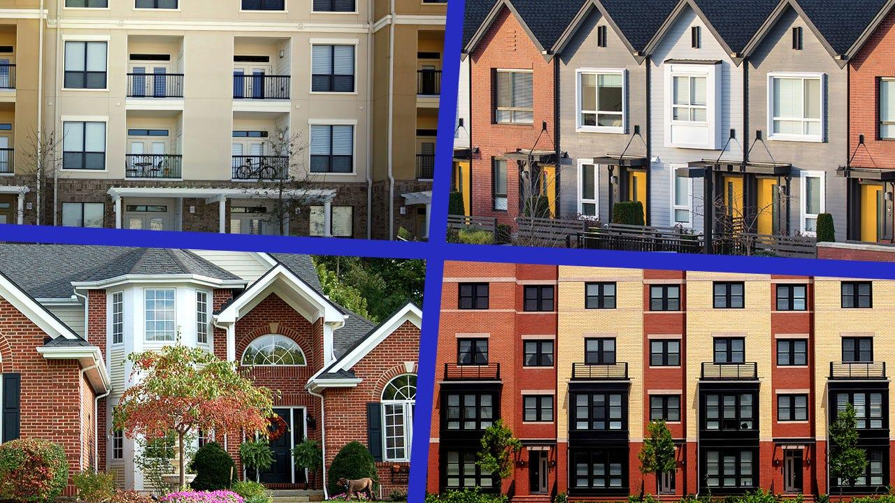

## Table of Contents

## What is a condo?

A condo, short for condominium, is a type of home that people own. It's different from a house because in a condo, you own your own space, but you share common areas like hallways, pools, and gyms with other owners. These common areas are managed by a group called the condo association, which everyone in the condo pays fees to.

Living in a condo can be good for people who don't want to take care of a big yard or fix things around a house. The condo association usually handles repairs and upkeep of the building and shared spaces. But, you have to follow the rules set by the association, and you might have less privacy than in a house.

## What is a townhouse?

A townhouse is a type of home where you own the whole house from the ground to the roof. It's usually connected to other houses on one or both sides, but you don't share walls with them inside your home. Each townhouse has its own entrance and often a small yard or garden. This is different from an apartment or condo where you only own your space inside a larger building.

Living in a townhouse can feel like living in a house but in a closer community. You might have a homeowners association (HOA) that takes care of things like the outside of the buildings and common areas. The HOA can have rules you need to follow, and you might have to pay fees to them. But, you usually have more space and privacy than in a condo or apartment.

## What is a house?

A house is a type of home where you own the whole building and the land it sits on. It's different from a condo or townhouse because you don't share walls with neighbors, and you have more control over what you do with your property. A house usually has its own yard, which can be big or small, and you're responsible for taking care of it and the house itself.

Living in a house can give you more privacy and space than living in a condo or townhouse. You can make changes to your house and yard without having to ask permission from a homeowners association, though you still need to follow local laws. But, owning a house means you have to handle all the repairs and maintenance yourself, which can be a lot of work and cost more money than living in a condo or townhouse.

## What are the key differences between condos, townhouses, and houses?

A condo is like owning a part of a big building. You own your space inside, but you share common areas like hallways and pools with other owners. A group called the condo association takes care of these shared spaces and you pay fees to them. Living in a condo means less work on upkeep but you have to follow the association's rules. A townhouse is different because you own the whole house from the ground to the roof, but it's usually connected to other houses on the sides. You have your own entrance and often a small yard. Like a condo, you might have a homeowners association that looks after the outside and common areas, and you pay fees to them. But, you usually have more space and privacy than in a condo.

A house is when you own the whole building and the land it's on. You don't share walls with neighbors and you have more control over your property. You have your own yard, which can be big or small, and you take care of everything yourself. Living in a house gives you the most privacy and space, but it also means you have to do all the repairs and maintenance, which can be a lot of work and cost more money.

The main differences between these types of homes are how much space and privacy you get, who takes care of the upkeep, and how much control you have over your property. A condo gives you the least space and privacy but also the least work. A townhouse is in the middle, with more space and privacy than a condo but less than a house. A house gives you the most space and privacy but also the most responsibility for upkeep.

## How does the ownership structure vary among condos, townhouses, and houses?

In a condo, you own your own space inside the building, but you don't own the whole building or the land it sits on. You share common areas like hallways, pools, and gyms with other owners. A group called the condo association manages these shared spaces and everyone who owns a condo pays fees to this group. This means you have less control over your property because you have to follow the rules set by the condo association.

A townhouse is different because you own the whole house from the ground to the roof, but it's usually attached to other houses on one or both sides. You have your own entrance and often a small yard. Like a condo, you might have a homeowners association (HOA) that takes care of things like the outside of the buildings and common areas. You pay fees to the HOA and have to follow their rules, but you have more control over your property than in a condo.

In a house, you own the whole building and the land it sits on. You don't share walls with neighbors and you have full control over what you do with your property. You don't have a condo association or HOA telling you what to do, but you're responsible for taking care of everything yourself, including repairs and maintenance. This gives you the most control over your property but also the most responsibility.

## What are the typical maintenance responsibilities for owners of condos, townhouses, and houses?

In a condo, the owner is usually responsible for taking care of the inside of their own space. This means fixing things like the walls, floors, and appliances inside their unit. The condo association takes care of the outside of the building and shared areas like hallways, pools, and gyms. The association uses the fees that owners pay to do things like painting the building, fixing the roof, and keeping the pool clean. So, condo owners have less maintenance work to do compared to other types of homes.

In a townhouse, the owner takes care of the inside of their home and often the yard or garden that comes with it. They might also need to fix things on the outside of their part of the building, like their front door or windows. But, there's usually a homeowners association (HOA) that takes care of the outside of the whole row of townhouses and any shared spaces. The HOA uses the fees that owners pay to do things like mowing the lawn in common areas and painting the outside of the buildings. So, townhouse owners have more maintenance work than condo owners but less than house owners.

In a house, the owner is responsible for taking care of everything. This means fixing anything that breaks inside the house, like the plumbing or the heating system, and also taking care of the outside, like the roof, the yard, and the driveway. There's no condo association or HOA to help with these things, so house owners have the most maintenance work to do. But, they also have the most control over their property and can make changes without asking anyone else.

## How do the costs compare among condos, townhouses, and houses, including purchase price, monthly fees, and taxes?

The cost of buying a condo is usually lower than buying a townhouse or a house. Condos are smaller and you only own your space inside the building, not the whole building or the land. But, you have to pay monthly fees to the condo association. These fees can be a lot of money, and they pay for things like fixing the roof and keeping the pool clean. You also have to pay property taxes on your condo, but they are usually less than for a house because you don't own the land.

Townhouses are often more expensive to buy than condos because you own the whole house from the ground to the roof. You might also have to pay monthly fees to a homeowners association (HOA), but these fees are usually less than condo fees. The HOA fees pay for things like mowing the lawn in common areas and painting the outside of the buildings. Property taxes for townhouses are usually more than for condos but less than for houses.

Houses are usually the most expensive to buy because you own the whole building and the land it sits on. You don't have to pay monthly fees to a condo association or HOA, but you do have to pay for all the repairs and upkeep yourself, which can cost a lot of money. Property taxes for houses are usually the highest because you own the land. So, while you don't have monthly fees, the overall cost of owning a house can be more than owning a condo or townhouse.

## What are the pros and cons of living in a condo versus a townhouse versus a house?

Living in a condo has some good things and some not so good things. One good thing is that it's usually cheaper to buy a condo than a townhouse or a house. Also, you don't have to do as much work to take care of it because the condo association handles things like fixing the roof and keeping the pool clean. But, you have to pay monthly fees to the condo association, which can be a lot of money. And, you have less privacy and space because you share walls and common areas with other people. You also have to follow the rules set by the condo association, which can be strict.

Living in a townhouse is different. It's often more expensive than a condo, but you own the whole house from the ground to the roof. You might have a small yard, which is nice. You still have to pay monthly fees to a homeowners association, but they are usually less than condo fees. The HOA takes care of the outside of the buildings and any shared spaces. You have more space and privacy than in a condo, but less than in a house. You also have to follow the HOA's rules, but they might not be as strict as a condo association's rules.

Living in a house gives you the most space and privacy. You own the whole building and the land it sits on, so you can do whatever you want with it, as long as you follow local laws. But, houses are usually the most expensive to buy. You don't have to pay monthly fees to a condo association or HOA, but you have to take care of everything yourself, which can be a lot of work and cost a lot of money. You're responsible for all the repairs and upkeep, like fixing the roof and mowing the lawn. So, while you have the most freedom, you also have the most responsibility.

## How does the potential for appreciation differ among condos, townhouses, and houses?

The potential for a condo to go up in value can be different from a townhouse or a house. Condos might not go up in value as much because they are part of a big building and you only own your space inside. Also, the condo association's rules can affect how much the condo is worth. But, if the area around the condo gets nicer or more popular, the condo's value can go up.

Townhouses might go up in value more than condos because you own the whole house from the ground to the roof. They can be seen as a step between a condo and a house. If the neighborhood gets better or more people want to live there, the value of a townhouse can go up. But, like condos, the rules and fees from the homeowners association can affect how much the townhouse is worth.

Houses usually have the most potential to go up in value because you own the whole building and the land it sits on. If you take good care of the house and the neighborhood gets better, the value can go up a lot. But, if the area doesn't get better or if you don't take care of the house, the value might not go up as much. So, houses can have the biggest increase in value, but it depends on a lot of things.

## What are the zoning and regulatory considerations for condos, townhouses, and houses?

Zoning and regulatory rules can be different for condos, townhouses, and houses. Condos are usually in areas zoned for multi-family housing, which means many people can live in the same building. There are a lot of rules that come with owning a condo. The condo association has its own set of rules that owners have to follow, like what you can do inside your unit and how you can use the shared spaces. There are also city and state laws that can affect condos, like how tall the building can be or how many units it can have.

Townhouses are often in areas zoned for multi-family or attached single-family housing. This means you own your own house, but it's connected to other houses. Like condos, townhouses might have a homeowners association with rules about what you can do with your home and the outside of the building. These rules can affect things like the color you can paint your house or what kind of changes you can make. Local zoning laws can also limit how many townhouses can be built in an area and how they can be used.

Houses are usually in areas zoned for single-family homes, which means one house per piece of land. You have the most freedom with a house because you don't have a condo association or homeowners association telling you what to do. But, you still have to follow local zoning laws, which can affect things like how big your house can be, how close it can be to other houses, and what you can do with your yard. These rules can be different depending on where you live, and they can change over time.

## How do condos, townhouses, and houses cater to different lifestyle needs and preferences?

Condos are great for people who want less work and more time for other things. If you live in a condo, you don't have to worry about fixing the roof or mowing the lawn because the condo association takes care of that. You just pay a monthly fee, and they handle it. Condos are usually smaller, so they are good for people who don't need a lot of space or want to live in a busy area like downtown. But, you have to follow the condo association's rules, and you might not have as much privacy because you share walls and common areas with other people.

Townhouses are good for people who want more space than a condo but don't want to take care of a big yard like a house. You own the whole house from the ground to the roof, and you might have a small yard or garden. A homeowners association might take care of the outside of the building and any shared spaces, so you still don't have to do as much work as with a house. Townhouses are often in neighborhoods that are a bit quieter than where condos are, but you still have to follow the HOA's rules. They are a good middle choice if you want more space and privacy than a condo but less work than a house.

Houses are perfect for people who want a lot of space and privacy. You own the whole building and the land it sits on, so you can do whatever you want with it, as long as you follow local laws. You don't have to pay monthly fees to a condo association or HOA, but you have to take care of everything yourself. This means fixing the roof, mowing the lawn, and doing all the repairs. Houses are usually in quieter areas, and they are good for people who like having a big yard or want to make a lot of changes to their home. But, they can be a lot of work and cost more money.

## What are the investment implications and rental potential for condos, townhouses, and houses?

Investing in a condo can be a good choice if you want to spend less money upfront. Condos are usually cheaper to buy than townhouses or houses. You can rent out your condo to make money, but you have to follow the rules set by the condo association. These rules might say you can't rent your condo at all, or they might limit how long you can rent it for. Also, the monthly fees you pay to the condo association can make it harder to make a profit from renting. But, if the area around the condo gets nicer or more popular, the value of your condo might go up, which can be good for your investment.

Townhouses can be a good investment if you want something in the middle. They cost more than condos but less than houses. You own the whole house, so you might be able to rent it out more easily than a condo. But, you still have to follow the rules set by the homeowners association, which might limit how you can rent it. The HOA fees are usually less than condo fees, so it might be easier to make a profit from renting a townhouse. If the neighborhood gets better or more people want to live there, the value of your townhouse might go up, helping your investment grow.

Houses can be the best choice for investment if you want the most control and potential for value to go up. They are usually the most expensive to buy, but you own the whole building and the land it sits on. This means you can rent out the house without as many rules to follow, which can make it easier to make money. You don't have to pay monthly fees to a condo association or HOA, but you have to take care of everything yourself, which can cost a lot of money. If you take good care of the house and the area around it gets better, the value of your house can go up a lot, making it a good long-term investment.

## What are the key differences between a condo, a townhouse, and a house?

When comparing condos, townhouses, and detached houses, key differences emerge, largely shaped by cost implications, ongoing fees, and personal responsibility in property management. 

Initial costs for condominiums are generally lower, primarily because of shared land ownership. Unlike detached houses and townhomes, where purchasing the land is part of the sale, condo buyers invest in the unit itself while sharing ownership of the community areas. The correlation between property type and initial costs can be depicted using this simplified equation for the average initial cost:

$$
\text{Initial Cost} = \text{Unit Cost} + \text{(Shared Land Cost) for Townhouses/Houses}
$$

Whereas, for condos, the shared land cost is often embedded in community fees rather than the initial purchase.

Ongoing fees also play a significant role in distinguishing these property types. Condominium owners incur monthly Homeowners Association (HOA) dues that cover maintenance, insurance, and often utilities for shared spaces or facilities. Similarly, townhouse owners typically face HOA fees but usually at a reduced rate compared to condos due to partial land ownership. Detached houses, though, stand apart here, as they often have minimal or no mandatory HOA fees, translating to fewer predictable ongoing costs, albeit with increased individual financial responsibility for maintenance.

The degree of personal responsibility for maintenance and property care further distinguishes these housing options. Detached homeowners enjoy complete autonomy over their property, which provides freedom for modifications but requires handling all upkeep and maintenance tasks. Conversely, condo owners concentrate on maintaining the interior of their units, with external and communal maintenance managed by the association. Townhouse owners find themselves between these categories, maintaining their unit and the attached land while contributing to the upkeep of communal areas.

In summary, the choice among condos, townhouses, and detached houses involves assessing not only initial purchase costs and ongoing financial obligations but also understanding the extent of maintenance responsibilities each demands. These key differences significantly impact the financial planning, lifestyle, and autonomy each buyer seeks in their future home.

## References & Further Reading

[1]: Albrecht, E. (2020). ["The Complete Guide to Homeownership: Condo, Townhouse, or Single Family?"](https://www.mckissock.com/blog/appraisal/fannie-mae-issues-ansi-guidance-on-condos-and-more/) Forbes.

[2]: Hannigan, M. (2019). ["Should I Buy a Condo, Townhouse, or House?"](https://www.zillow.com/learn/should-i-buy-a-condo-or-a-house/) Investopedia.

[3]: Leigh, J. (2021). ["Condo vs. Townhouse: Understanding the Differences."](https://www.bhg.com/condo-vs-townhouse-7975568) Bankrate.

[4]: Chatzky, J. (2018). ["Guide to Buying a Home: Condo, House, or Townhouse?"](https://themortgagereports.com/guide/buying-a-home) NBC News.

[5]: Rubenstein, S. (2017). ["Deciding Between a House, Townhouse, or Condo."](https://www.eclipsejetpilots.org/forums/74-2017-Election?s=92df3695998b1f7313555bfc5dc11a62) The New York Times.