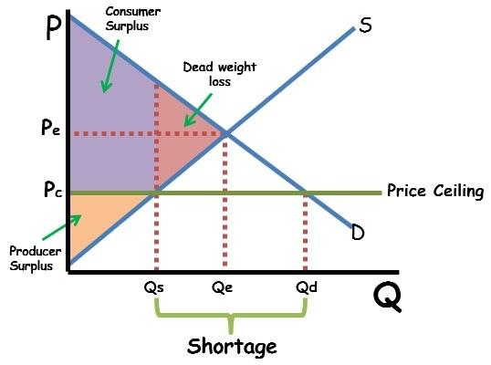

## Table of Contents

## What is consumer surplus?

Consumer surplus is the difference between what consumers are willing to pay for a product or service and what they actually end up paying. Imagine you really want a new book that you think is worth $20, but you find it on sale for $15. The $5 difference is your consumer surplus because you're getting more value than what you paid for.

This concept is important because it shows how much benefit consumers get from buying things at lower prices. It helps economists understand how changes in prices affect people's happiness and spending habits. When prices drop, consumer surplus usually goes up, meaning people feel they are getting a better deal.

## What is economic surplus?

Economic surplus is the total benefit that society gets from doing business. It's made up of two parts: consumer surplus and producer surplus. Consumer surplus is how much more value people think they are getting from a product than what they actually pay for it. Producer surplus is how much more money sellers make from selling a product than it costs them to make it. When you add these two together, you get the economic surplus, which shows how well the economy is doing in making people happy and businesses profitable.

Think of economic surplus like a pie that gets bigger when the economy is doing well. If the price of something goes down, people can buy more of it and feel they are getting a better deal, which makes the consumer surplus part of the pie bigger. If businesses can sell more at a higher price than it costs them to make the product, their part of the pie, the producer surplus, grows too. The bigger the economic surplus, the more everyone benefits from the economy working smoothly.

## How is consumer surplus calculated?

To calculate consumer surplus, you need to know two things: the highest price someone is willing to pay for a product and the actual price they pay. The difference between these two prices is the consumer surplus. Imagine you're at a store looking at a toy. You think the toy is worth $30 to you, but the store is selling it for $20. Your consumer surplus for that toy would be $10 because you're getting $10 more in value than what you're paying.

You can also show consumer surplus on a graph. On the graph, the vertical axis shows the price, and the horizontal axis shows the quantity of the product. The demand curve on this graph shows how much people are willing to pay at different quantities. The consumer surplus is the area between the demand curve and the price line, up to the quantity sold. If the price line is lower than the demand curve, the area between them forms a triangle. This triangle represents the total consumer surplus for everyone buying the product.

## How is economic surplus calculated?

Economic surplus is calculated by adding consumer surplus and producer surplus together. Consumer surplus is the difference between what people are willing to pay for a product and what they actually pay. Producer surplus is the difference between the price sellers get for their product and the cost to make it. To find the total economic surplus, you add these two surpluses up. This shows how much extra value both buyers and sellers are getting from the market.

You can also see economic surplus on a graph. The graph has a demand curve, which shows what people are willing to pay, and a supply curve, which shows the cost to make the product. The consumer surplus is the area between the demand curve and the price line, while the producer surplus is the area between the price line and the supply curve. The total economic surplus is the sum of these two areas. When prices and costs change, the size of these areas can change too, showing how much total benefit the market is creating.

## What are the key differences between consumer surplus and economic surplus?

Consumer surplus is about how much more value people think they are getting from something than what they actually pay for it. Imagine you buy a toy for $10, but you think it's worth $15. That $5 difference is your consumer surplus. It shows how happy people are with the deals they get. If prices go down, people feel they are getting more for their money, so consumer surplus goes up.

Economic surplus, on the other hand, looks at the whole picture. It adds up the consumer surplus and the producer surplus, which is how much more money businesses make from selling something than it costs them to make it. So, if you buy that toy for $10 and the business made it for $5, they have a $5 producer surplus. Economic surplus shows how well the whole economy is doing by adding up how much both buyers and sellers benefit. It's like a total score of how happy everyone is with the market.

## Can you provide an example of consumer surplus in a real-world market?

Imagine you're at a grocery store looking to buy some strawberries. You think a box of strawberries is worth $5 because you really love them, but when you get to the store, you see they're on sale for $3. The difference between what you're willing to pay ($5) and what you actually pay ($3) is your consumer surplus, which in this case is $2. This means you feel like you're getting a good deal because you're paying less than what you think the strawberries are worth.

This example shows how consumer surplus works in a real-world market. When prices drop, like in this case with the strawberries, people feel they are getting more value for their money. This makes them happier with their purchase and can lead to them buying more strawberries or other items at the store. It's a simple way to see how much extra benefit people get from lower prices.

## Can you provide an example of economic surplus in a real-world market?

Imagine a farmer's market where a local farmer sells apples. You think a bag of apples is worth $6 to you, but you find it being sold for $4. Your consumer surplus is $2 because you're paying less than what you think the apples are worth. Now, let's say it costs the farmer $2 to grow and bring those apples to the market. When the farmer sells the apples for $4, they make a $2 profit, which is their producer surplus. The economic surplus in this market is the total of both surpluses: your $2 consumer surplus plus the farmer's $2 producer surplus, making a total of $4.

This example shows how economic surplus works in a real-world setting. The total economic surplus of $4 means both you and the farmer are better off because of the transaction. You get more value than you pay for, and the farmer earns more than it costs to produce the apples. This total benefit to both buyers and sellers is what economists call economic surplus, and it shows how well the market is working to make everyone happier.

## How do changes in market conditions affect consumer surplus and economic surplus?

When market conditions change, it can affect consumer surplus and economic surplus in different ways. If the price of a product goes down, like during a sale, people feel they are getting more for their money. This means their consumer surplus goes up because they're paying less than what they think the product is worth. For example, if you think a shirt is worth $20 but it's on sale for $15, your consumer surplus is $5. If more people buy the shirt because of the lower price, the total consumer surplus in the market increases. But if the price goes up, consumer surplus goes down because people are paying more, and they might buy less, making the total consumer surplus smaller.

Changes in market conditions also affect economic surplus, which is the total of consumer surplus and producer surplus. If the price of a product drops, consumer surplus goes up, but producer surplus might go down because businesses are making less money per item sold. However, if they sell more items because of the lower price, their total producer surplus could still go up. For example, if a store sells a toy for $10 instead of $15, and it costs them $5 to make, their producer surplus per toy is $5 instead of $10. But if they sell twice as many toys, their total producer surplus might still be higher. Economic surplus is the sum of both, so it can go up or down depending on how these changes balance out.

## What role do government policies play in influencing consumer surplus and economic surplus?

Government policies can have a big impact on consumer surplus and economic surplus. For example, if the government puts a tax on a product, like a soda tax, it can make the price go up. When prices go up, people usually buy less, and their consumer surplus goes down because they're paying more for the same thing. But the tax money can be used for things like building roads or schools, which might make people happier in other ways. So, the total economic surplus might still go up if the benefits from the tax money are big enough.

On the other hand, if the government gives a subsidy to farmers to grow more food, it can lower the price of food. When prices go down, people can buy more food and feel they are getting a better deal, so their consumer surplus goes up. Farmers might also sell more food because of the lower price, which can increase their producer surplus. If both consumer and producer surplus go up, the total economic surplus in the market can increase. Government policies can change how much value people get from buying things and how much money businesses make, which affects the overall health of the economy.

## How can businesses use the concept of consumer surplus to improve their pricing strategies?

Businesses can use the concept of consumer surplus to make smart choices about their prices. If a business knows that people think their product is worth more than what they are charging, they can keep the price low to attract more customers. This makes customers happy because they feel they are getting a good deal, and it can lead to more sales. For example, if a coffee shop knows people are willing to pay $5 for a cup of coffee but they sell it for $3, they can sell more cups and make more money overall, even if they make less on each cup.

On the other hand, if a business sees that people are willing to pay a lot more than the current price, they might raise the price a bit to make more money per item without losing too many customers. This can help them increase their profits. For instance, if a toy store finds out that kids and parents are willing to pay $30 for a popular toy but it's currently priced at $20, they might raise the price to $25. This way, they make more money on each toy sold, and if the demand stays high, their total profit goes up. By understanding consumer surplus, businesses can find the best price to make both their customers and themselves happy.

## What are the limitations of using consumer surplus and economic surplus as measures of economic welfare?

Using consumer surplus and economic surplus to measure how well an economy is doing has some problems. One big issue is that it can be hard to know exactly how much people think something is worth. People's feelings about what they are willing to pay can change a lot, and it's not easy to measure this accurately. Also, these measures don't think about things like how fair the economy is. If rich people get most of the consumer surplus, it might not make the whole society better off, even if the total number looks good.

Another problem is that consumer and economic surplus don't take into account other important parts of life, like the environment or how happy people are. For example, if a factory makes a lot of pollution but also creates a big economic surplus, the numbers might look good, but people's health and the planet could be suffering. These measures focus on money and what people buy, but they don't tell the whole story of what makes a good life. So, while they can be useful, they should be used carefully and with other ways of looking at how well an economy is doing.

## How do advanced economic models incorporate consumer surplus and economic surplus in welfare analysis?

Advanced economic models use consumer surplus and economic surplus to figure out how well off people are in an economy. These models try to show how changes in prices or policies affect the extra value people get from buying things and the extra money businesses make from selling them. By adding up consumer surplus and producer surplus, economists can see the total benefit to society from the market. These models use math and graphs to predict how different things might change these surpluses, helping to understand if a policy or a change in the market will make people better off or worse off.

However, these models also try to include other important factors that affect people's lives. For example, they might look at how changes in the economy affect the environment or people's happiness. Some models use special techniques to put a value on things like clean air or free time, which are not bought and sold in markets but still matter a lot to people. By doing this, economists can get a fuller picture of how well an economy is doing, not just in terms of money and buying things, but also in terms of overall quality of life.

## What is Understanding Consumer Surplus?

Consumer surplus is a fundamental economic concept defined as the difference between the highest amount consumers are ready to pay for a product or service and the actual amount they pay. This discrepancy highlights the extra benefit, or value, consumers receive because they pay less than their maximum willingness to pay. For example, if a consumer is willing to purchase a concert ticket for $100 but acquires it for $80, the consumer surplus is $20.

This concept is crucial for firms when devising pricing strategies that not only maximize revenue but remain enticing to consumers. By understanding the consumer surplus, businesses can:

1. **Set Optimal Prices**: By estimating the maximum price consumers are willing to pay, businesses can set prices closer to this level to capture more revenue, while still leaving room for consumer surplus to motivate purchase decisions.

2. **Segment the Market**: Identifying different consumer groups according to willingness to pay allows businesses to apply differential pricing strategies, leading to increased total revenue capture.

3. **Enhance Product Offering**: Insights from consumer surplus can provide guidance on enhancing product features or services, thus increasing the consumers’ perceived value without proportionately increasing costs.

In financial markets, consumer surplus plays an indirect, yet impactful role. It influences investor behavior by affecting demand and pricing for securities. For instance, if investors perceive a stock to offer high value relative to its current market price, this "surplus" perception can lead to increased demand, driving up stock prices. Conversely, a lower perceived surplus might lead to selling pressure.

Mathematically, consumer surplus (CS) can be represented as the area under the demand curve and above the price level, up to the quantity purchased. The demand curve is typically downward sloping, reflecting the inverse relationship between price and quantity demanded. For a linear demand curve, consumer surplus is calculated using:

$$

CS = \frac{1}{2} \times \text{Quantity} \times (\text{Maximum Price Willing to Pay} - \text{Market Price})
$$

In practice, firms may leverage data analytics and [machine learning](/wiki/machine-learning) techniques to estimate consumer surplus more accurately, thus making more informed strategic decisions. The understanding and application of consumer surplus are essential for maximizing both business profitability and consumer satisfaction while navigating complex market dynamics.

## References & Further Reading

[1]: Bergstra, J., Bardenet, R., Bengio, Y., & Kégl, B. (2011). ["Algorithms for Hyper-Parameter Optimization."](https://dl.acm.org/doi/10.5555/2986459.2986743) Advances in Neural Information Processing Systems 24.

[2]: ["Advances in Financial Machine Learning"](https://www.amazon.com/Advances-Financial-Machine-Learning-Marcos/dp/1119482089) by Marcos Lopez de Prado

[3]: ["Evidence-Based Technical Analysis: Applying the Scientific Method and Statistical Inference to Trading Signals"](https://www.amazon.com/Evidence-Based-Technical-Analysis-Scientific-Statistical/dp/0470008741) by David Aronson

[4]: ["Machine Learning for Algorithmic Trading"](https://github.com/stefan-jansen/machine-learning-for-trading) by Stefan Jansen

[5]: ["Quantitative Trading: How to Build Your Own Algorithmic Trading Business"](https://www.amazon.com/Quantitative-Trading-Build-Algorithmic-Business/dp/1119800064) by Ernest P. Chan