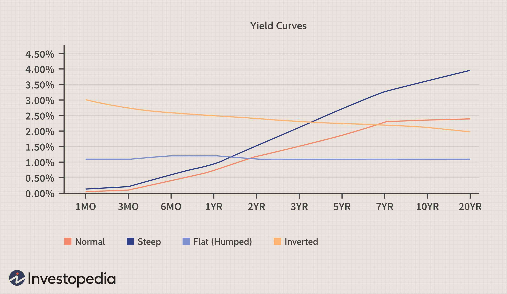

## Table of Contents

## What are corporate bonds?

Corporate bonds are like loans that companies take from investors. When a company needs money, it can borrow from people who want to invest their money. In return, the company promises to pay back the money with interest over a certain period of time. These bonds are a way for companies to get the funds they need to grow or manage their operations, and for investors to earn a return on their money.

There are different types of corporate bonds, and they can be safe or risky. Some bonds are backed by the company's assets, which means if the company can't pay back the money, investors might get something in return. Other bonds are just based on the company's promise to pay, which can be riskier. The interest rate on a bond usually depends on how risky it is; the riskier the bond, the higher the interest rate the company has to pay to attract investors.

## What are stocks?

Stocks are pieces of a company that you can buy. When you buy a stock, you own a small part of that company. Companies sell stocks to get money to grow their business. People buy stocks hoping that the company will do well, and the value of the stock will go up. If the company does well, the price of the stock usually goes up, and you can sell it for more than you paid. But if the company does badly, the stock price can go down, and you might lose money.

There are two main ways to make money from stocks. One way is by selling the stock for a higher price than you bought it. This is called capital gains. The other way is by getting dividends. Dividends are payments that some companies make to their stockholders from their profits. Not all companies pay dividends, but those that do give their stockholders a share of the company's earnings. Stocks can be risky because their value can go up and down a lot, but they can also be a good way to grow your money over time if you choose the right companies.

## How do corporate bonds and stocks generate income for investors?

Corporate bonds generate income for investors by paying them interest regularly, usually every six months, until the bond matures. When you buy a corporate bond, you're lending money to the company, and in return, the company agrees to pay you back with interest. The interest payments are like a steady income for the investor. Once the bond reaches its maturity date, the company pays back the original amount you lent them. So, with corporate bonds, you get income from the interest payments over time and the return of your initial investment at the end.

Stocks can generate income for investors in two main ways. The first way is through capital gains, which means you buy a stock at one price and sell it later at a higher price. If the company does well and its stock price goes up, you can make money by selling your stock for more than you paid for it. The second way stocks can generate income is through dividends. Some companies share their profits with stockholders by paying them dividends, usually every three months. Not all companies pay dividends, but those that do give their investors a regular income. So, with stocks, you can make money from the increase in stock price and from dividend payments.

## What are the risk levels associated with corporate bonds compared to stocks?

Corporate bonds are generally seen as less risky than stocks. When you buy a corporate bond, you're lending money to a company, and the company promises to pay you back with interest. This promise makes bonds more predictable because you know how much interest you'll get and when you'll get your money back. But, there's still some risk. If the company runs into big trouble and can't pay back the bond, you might lose your money. But usually, bonds are safer because they have a set interest payment and a maturity date when you get your money back.

Stocks, on the other hand, are riskier. When you buy a stock, you own a piece of the company, and the value of that piece can go up or down a lot. If the company does well, the stock price can go up, and you can make a lot of money. But if the company does badly, the stock price can drop, and you could lose a lot of your investment. Stocks don't have a guaranteed return like bonds do, so they can be more unpredictable. But because they're riskier, they also have the potential to give you bigger returns if things go well.

In short, corporate bonds are usually safer and give you a steady income from interest, while stocks are riskier but can offer bigger rewards if the company does well. Your choice between them depends on how much risk you're willing to take and what kind of return you're looking for.

## How does the liquidity of corporate bonds compare to that of stocks?

Stocks are usually more liquid than corporate bonds. This means it's easier and faster to buy and sell stocks. When you want to sell a stock, you can usually find someone to buy it quickly because there are a lot of people trading stocks every day on big stock markets like the New York Stock Exchange or NASDAQ. This makes it easy to turn your stock into cash whenever you need to.

Corporate bonds, on the other hand, can be less liquid. It might take longer to find someone who wants to buy your bond, especially if it's not a very common one. Bond markets are not as busy as stock markets, so there might not be as many people looking to buy or sell bonds at any given time. This means that if you need to sell your bond quickly, you might have to sell it for less than you wanted, or wait longer to find a buyer.

## What are the tax implications of investing in corporate bonds versus stocks?

When you invest in corporate bonds, the interest you earn is usually taxed as regular income. This means you'll pay taxes on the interest at the same rate you pay on your wages or salary. The tax rate can be high, depending on your income level. If you sell a bond for more than you paid for it, you might also have to pay capital gains tax on the profit, but this is less common with bonds because they're usually held until they mature.

With stocks, the tax rules can be a bit different. If you earn dividends from your stocks, these are often taxed at a lower rate than regular income, especially if they're qualified dividends. This can be a big advantage for stock investors. When you sell a stock for a profit, you'll pay capital gains tax on that profit. If you hold the stock for more than a year before selling, you'll pay a long-term capital gains tax rate, which is usually lower than the short-term rate you'd pay if you sold the stock within a year of buying it.

In summary, the tax treatment of corporate bonds and stocks can impact your after-tax returns. Bonds generally face higher tax rates on their interest income, while stocks can offer more favorable tax treatment on dividends and long-term capital gains. Understanding these differences can help you make better investment choices based on your tax situation.

## How do interest rate changes affect corporate bonds and stocks differently?

When interest rates go up, it usually affects corporate bonds more directly than stocks. If you own a bond that pays a fixed interest rate, and new bonds start offering higher rates because of the rise, your bond becomes less attractive to other investors. This means if you want to sell your bond before it matures, you might have to sell it for less than you paid for it. So, the value of your bond can go down when interest rates go up. On the other hand, if interest rates go down, the value of your bond can go up because it's now paying a higher rate than new bonds.

Stocks can also be affected by interest rate changes, but in a different way. When interest rates go up, it can make borrowing more expensive for companies. This might slow down their growth and make their profits smaller, which can cause their stock prices to go down. Also, when interest rates rise, other investments like bonds start looking more attractive because they offer higher returns with less risk. This can make people move their money from stocks to bonds, which can also push stock prices down. But when interest rates go down, it can help companies borrow more easily and grow, which might make their stock prices go up.

## What role do corporate bonds and stocks play in diversifying an investment portfolio?

Corporate bonds and stocks play important roles in diversifying an investment portfolio. Diversification means spreading your money across different types of investments to reduce risk. When you include both corporate bonds and stocks in your portfolio, you're mixing safer, steady income investments with riskier, growth-oriented investments. Corporate bonds can provide regular interest payments and help balance out the ups and downs of the stock market. This can make your overall portfolio more stable because even if stock prices drop, you still get income from your bonds.

Stocks, on the other hand, can offer the potential for higher returns over time. While they are riskier and their prices can go up and down a lot, they can help your portfolio grow more than it would with just bonds. By having some of your money in stocks, you're giving your portfolio a chance to benefit from the growth of successful companies. When you combine stocks with corporate bonds, you're not putting all your eggs in one basket. This mix can help protect your money and still give you a chance to grow it, making your investment strategy more balanced and potentially more rewarding in the long run.

## How can the performance of corporate bonds and stocks be evaluated over time?

The performance of corporate bonds over time can be evaluated by looking at the interest they pay and how their prices change. When you get interest payments regularly, you can see how much income the bonds are giving you. If you hold onto the bond until it matures, you'll get your money back, so you know what you'll get in the end. But if you want to sell the bond before it matures, you'll need to check its market price. If interest rates go up, the price of your bond might go down, and if rates go down, the price might go up. You can also compare the bond's return to other investments to see if it's doing well.

Stocks are a bit different because their performance depends a lot on the company's success and the stock market's ups and downs. To evaluate stocks, you can look at how much the stock price has gone up or down over time. If you sell the stock for more than you paid, that's a capital gain, which is good. You can also check if the company pays dividends and how much they've been paying over time. If the dividends are steady or growing, that's a positive sign. Comparing the stock's performance to the overall market or similar companies can help you see if it's doing better or worse than others. Both bonds and stocks need to be looked at over time to really understand how well they're doing.

## What are the differences in voting rights and control over the company between bondholders and shareholders?

When you buy stocks, you become a shareholder, which means you own a part of the company. Shareholders usually get to vote on important company decisions. They can vote on things like who should be on the board of directors, big changes to the company, or even if the company should be sold. This gives shareholders some control over what the company does. The more shares you own, the more votes you have, so big shareholders have more say in the company's decisions.

On the other hand, when you buy corporate bonds, you become a bondholder. Bondholders don't get to vote on company decisions. They are more like lenders to the company, and their main concern is getting their interest payments on time and getting their money back when the bond matures. Bondholders don't have any control over the company's decisions, but they have a more secure position because the company has to pay them back before it can pay shareholders if things go wrong.

## How do credit ratings impact the investment decisions in corporate bonds compared to stocks?

Credit ratings are really important when you're thinking about investing in corporate bonds. They tell you how likely it is that the company will be able to pay back the money it borrowed from you. If a bond has a high credit rating, like AAA, it means the company is seen as very safe and likely to pay you back. This makes the bond less risky, but it also means the interest rate might be lower because the company doesn't have to pay as much to get people to lend them money. If a bond has a low credit rating, like BB or lower, it's seen as riskier because there's a bigger chance the company might not be able to pay you back. To make up for this risk, these bonds usually offer higher interest rates to attract investors.

Credit ratings don't affect stocks in the same direct way. When you buy stocks, you're buying a piece of the company, and you're hoping the company will do well and the stock price will go up. Credit ratings can still matter for stocks, but more indirectly. If a company's credit rating goes down, it might mean the company is having financial trouble, which could make the stock price go down too. But stocks are more about the company's overall performance and future growth, not just its ability to pay back debt. So, while credit ratings can give you some information about a company's health, they're not as crucial for deciding whether to buy or sell stocks as they are for bonds.

## What advanced strategies can investors use to hedge risks when investing in both corporate bonds and stocks?

One advanced strategy to hedge risks when investing in both corporate bonds and stocks is to use options. Options are like contracts that give you the right to buy or sell a stock or bond at a certain price before a certain date. You can buy put options on your stocks, which let you sell the stock at a set price even if the market price drops a lot. This can help protect your stock investments from big losses. For bonds, you can use interest rate swaps to hedge against changes in interest rates. This means you can exchange your fixed interest payments for variable ones, which can help if interest rates go up and make your bonds less valuable.

Another strategy is to use diversification not just between stocks and bonds, but within each type of investment. For stocks, you can invest in different industries and sizes of companies, so if one sector does badly, others might do well and balance it out. For bonds, you can buy bonds with different credit ratings and maturity dates. Mixing high-rated bonds with some riskier ones can help you get higher returns while still keeping some safety. Also, you can use asset allocation strategies, where you decide how much of your money goes into stocks and how much into bonds based on your risk tolerance and investment goals. This way, you can adjust your portfolio over time to keep it balanced and reduce risk.

Lastly, you can use a strategy called dollar-cost averaging. This means you invest a fixed amount of money at regular intervals, no matter what the market is doing. By doing this, you buy more stocks or bonds when prices are low and fewer when prices are high, which can help reduce the risk of investing a large amount at the wrong time. This strategy can work well for both stocks and bonds and help smooth out the ups and downs of the market.

## What are the differences between investing in stocks versus corporate bonds?

Stocks and corporate bonds are key components of an investment portfolio, each serving distinct financial objectives and risk profiles. Typically, stocks offer the potential for higher returns compared to corporate bonds. This potential arises from the nature of stocks as equity investments, granting shareholders ownership in a company and enabling them to benefit from its growth and profitability. Historically, the annualized return on stocks in the U.S. has averaged around 7-10%, depending on the time frame and market conditions. However, this comes with a trade-off of higher volatility and increased exposure to market fluctuations.

Corporate bonds, on the other hand, are debt instruments that provide a fixed income stream through interest payments, known as coupons, and eventual return of principal upon maturity. Their generally lower returns compared to stocks are offset by greater stability and predictability in income; hence, they are often considered safer investments. The typical yield on corporate bonds can vary, often ranging from 3-6%, influenced by factors such as the credit rating of the issuing corporation and prevailing interest rates.

Investors must align their selection of stocks or corporate bonds with their risk tolerance and investment objectives. For instance, an investor with a high-risk tolerance and a long-term growth goal may opt for a higher allocation of stocks to capitalize on growth opportunities. Conversely, an investor seeking capital preservation and consistent income might favor corporate bonds.

Market conditions also play a crucial role in this decision-making process. During periods of economic expansion, stocks may perform well, offering attractive growth prospects. However, in times of economic uncertainty or rising interest rates, corporate bonds may offer a more secure alternative due to their fixed income characteristics.

Diversification strategies are paramount for mitigating risk and enhancing potential returns within a portfolio. By investing in a diversified mix of stocks and bonds, investors can balance the pursuit of capital appreciation with the need for income and reduced volatility. Diversification reduces the overall portfolio risk according to the principles of modern portfolio theory. A diversified portfolio can be mathematically represented by the following formula for portfolio variance:

$$
\sigma_p^2 = \sum_{i=1}^{n} \sum_{j=1}^{n} w_i w_j \sigma_{i} \sigma_{j} \rho_{ij}
$$

where:

- $\sigma_p^2$ is the portfolio variance.
- $w_i$ and $w_j$ are the portfolio weights for asset $i$ and $j$.
- $\sigma_i$ and $\sigma_j$ are the standard deviations of asset $i$ and $j$.
- $\rho_{ij}$ is the correlation coefficient between asset $i$ and $j$.

This formula underscores the importance of asset allocation and correlation in managing investment risk. By carefully considering these factors, investors can optimize portfolio performance over varying market cycles.

In conclusion, while stocks and corporate bonds each offer distinct advantages, a judicious blend of both based on an investor's unique financial goals and risk preferences can effectively contribute to a balanced and resilient investment strategy.

## How can algorithmic trading be integrated into investment strategies?

Algorithmic trading offers a systematic approach to enhancing investment strategies by harnessing computational power to execute trades with speed and precision. This integration allows investors to optimize their portfolios through advanced techniques such as [statistical arbitrage](/wiki/statistical-arbitrage), trend following, and mean reversion.

**Statistical Arbitrage:** This technique involves taking advantage of price discrepancies between correlated assets. By using statistical models, traders can identify and execute trades on temporary mispricings in the market. For instance, consider two stocks $A$ and $B$ which historically have a strong positive correlation. If $A$ suddenly underperforms relative to $B$, an algorithm can trigger a trade to buy $A$ and short sell $B$, anticipating convergence of their prices.

**Trend Following:** This strategy capitalizes on the momentum of asset prices, presuming that those which are climbing will continue to rise and those which are falling will continue to decline. Algorithms analyze historical price data to identify trends and execute trades accordingly. This can be represented by a moving average crossover system:

$$
\text{Signal} = 
    \begin{cases} 
      \text{Buy} & \text{if Short-Term MA crosses above Long-Term MA} \\
      \text{Sell} & \text{if Short-Term MA crosses below Long-Term MA}
    \end{cases}
$$

Here, the short-term moving average (Short-Term MA) might be calculated over a 15-day period, while the long-term (Long-Term MA) might be over 50 days.

**Mean Reversion:** This technique is based on the assumption that asset prices will revert to their historical means over time. Algorithms designed for mean reversion track the deviation of an asset’s price from its average and initiate trades to exploit these deviations. If the price is significantly higher than its average, the algorithm might short the asset, expecting it to drop, and vice versa.

However, while algorithmic trading presents several technological advantages, it also bears potential downsides. A critical consideration is the associated risk due to algorithmic malfunctions or unpredicted market conditions, which may lead to significant losses. Moreover, high-frequency trading can introduce excessive volatility into the markets.

Investors need to balance these benefits and risks by incorporating adequate oversight measures and robust risk management frameworks into their investment strategies. Continuous monitoring and adjustment of algorithms are crucial to respond to changing market dynamics effectively. Employing stop-loss orders, diversifying strategies, and using [backtesting](/wiki/backtesting) to validate algorithms before deployment are some of the practices that help manage potential downsides while exploiting the advantages of algorithmic trading.

Ultimately, successful integration of algorithmic trading into investment strategies requires a harmonious blend of sophisticated technology and diligent risk management to navigate the complexities and efficiently capitalize on market opportunities.

## References & Further Reading

- For a comprehensive understanding of stocks, corporate bonds, and algorithmic trading, Investopedia offers numerous articles and tutorials that cover fundamental concepts and advanced strategies in these areas. Visit [Investopedia](https://www.investopedia.com) for more information.

- "The Intelligent Investor" by Benjamin Graham is a classic financial textbook that provides insights into stock market investing principles, making it an essential read for investors aiming to deepen their knowledge of stocks.

- "Corporate Bonds: Structure and Analysis" by Richard C. Wilson and Frank J. Fabozzi explores the intricacies of corporate bonds, offering valuable insights into their structure, risk assessment, and role in asset allocation.

- "Algorithmic Trading: Winning Strategies and Their Rationale" by Ernie Chan provides a detailed examination of algorithmic trading strategies, offering practical insights into execution, risk management, and backtesting.

- The U.S. Securities and Exchange Commission (SEC) offers a wealth of information on regulatory frameworks governing stocks, bonds, and trading practices. Visit the [SEC's website](https://www.sec.gov) to access these resources.

- For those interested in the quantitative aspects of market analysis, "Quantitative Finance for Dummies" by Steve Bell provides an accessible introduction to key concepts and mathematical techniques relevant to both stocks and bonds.

- Online platforms like Coursera and edX offer courses on financial markets and algorithmic trading, providing structured learning through institutions such as the University of Geneva and the New York Institute of Finance.

These resources collectively provide a solid foundation for anyone seeking to expand their understanding of stocks, corporate bonds, and algorithmic trading, and their application in investment strategies.

