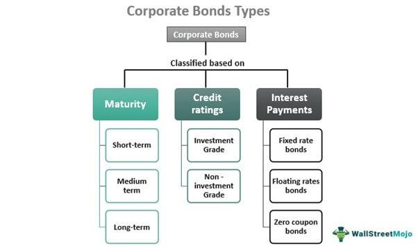

High-yield bonds, corporate investments, equities, and algorithmic trading are critical components of modern financial markets, each playing a distinct role in investment portfolios. High-yield bonds are debt securities issued by companies with lower credit ratings, offering higher interest rates to compensate for increased risk. Corporate investments are strategies employed by firms to allocate resources into various assets or projects, aiming for growth and expansion. Equities, commonly known as stocks, represent ownership in a corporation and are considered a major component of investment portfolios due to their potential for high returns. Algorithmic trading involves the use of computer algorithms to execute buy and sell orders at high speed and efficiency, revolutionizing the way financial markets operate.

The importance of understanding these instruments and strategies cannot be understated, as they each provide unique benefits and risks that can significantly impact investment decisions. High-yield bonds can enhance returns but come with a risk of default; corporate investments are essential for a company's strategic growth; equities offer potential for capital appreciation but are subject to market volatility. Algorithmic trading has gained prominence due to its ability to process vast amounts of data and execute trades in milliseconds, providing a competitive edge to investors seeking efficiency and speed in execution.

In recent years, there has been a growing trend towards incorporating algorithmic trading in financial markets. This rise is driven by advancements in technology and data analytics, enabling traders and firms to leverage sophisticated algorithms for decision-making. The integration of algorithmic trading across different asset classes underscores a shift towards more data-driven and automated trading strategies.

This article will explore these financial instruments and strategies in depth. From understanding the characteristics and market dynamics of high-yield bonds to the types and strategic importance of corporate investments, the examination of equities in investment portfolios, and the rise of algorithmic trading, each section aims to provide a comprehensive overview. The article will also discuss the integration of algorithmic trading into investment strategies and consider the regulatory and ethical implications that accompany these advancements. Understanding these elements is crucial for investors to make informed decisions in a rapidly evolving financial landscape.

## Table of Contents

## Understanding High-Yield Bonds

High-yield bonds, often referred to as "junk bonds," are fixed-income securities issued by corporations that are rated below investment grade by credit rating agencies such as Moody's or Standard & Poor's. These bonds carry a higher risk of default compared to investment-grade bonds, which is why they tend to offer higher yields to compensate investors for this increased risk. The interest rates on high-yield bonds are generally higher due to the issuer's lower creditworthiness, reflecting the necessity for higher returns to attract investors.

The primary characteristic that sets high-yield bonds apart is their credit rating. Typically, bonds with a rating below BBB- by Standard & Poor's, or Baa3 by Moody’s, fall into this category. Despite their lower credit ratings, some of these bonds are considered "fallen angels," which were initially investment-grade but have been downgraded.

**Risks and Rewards**

Investing in high-yield bonds involves unique risks and rewards. The most prominent risk is credit risk, or the chance that the issuer will default on its obligations. Consequently, the yield offered by these bonds acts as a premium to offset potential losses. Market risk, including [interest rate](/wiki/interest-rate-trading-strategies) fluctuations and changes in economic conditions, also significantly impacts high-yield bond prices. During economic downturns, default rates on high-yield bonds can increase, leading to potential losses. 

However, the rewards can be substantial, as these bonds often provide higher yields compared to investment-grade bonds and government securities. Investors who can effectively manage the associated risks might benefit from enhanced income and potential capital appreciation. In some cases, investing in a diversified portfolio of high-yield bonds can provide attractive returns, especially in an environment of rising interest rates where other fixed-income investments may suffer.

**Current Market Landscape**

The market for high-yield bonds has grown significantly, particularly in sectors such as energy and telecommunications. The expansion of the high-yield market is attributed to a combination of low-interest rates globally, which drives investors seeking higher returns towards riskier assets. Market dynamics have been influenced by macroeconomic factors such as central bank policies and geopolitical events, which can impact bond valuations and investor confidence.

**Investor Profiles**

High-yield bonds attract various types of investors. Institutional investors, such as mutual funds, pension funds, and insurance companies, are significant players due to their capacity to absorb the potential risks and the need for higher returns to meet their obligations. Additionally, individual investors seeking income in a low-yield environment or those pursuing a diversified portfolio might find high-yield bonds appealing. However, these investors must have a higher risk tolerance to accommodate potential [volatility](/wiki/volatility-trading-strategies) and credit risks.

**Impact of Market Conditions**

Market conditions play a crucial role in the performance of high-yield bonds. Economic growth typically favors high-yield bonds, as improved corporate profitability can reduce default risks. Conversely, economic downturns and tightening monetary policies may lead to increased defaults and volatile bond prices. Additionally, changes in interest rates can inversely affect bond prices, as seen with most fixed-income securities. In rising rate environments, high-yield bond prices might face pressure, although their higher coupon payments can offer some mitigation against rising yields.

In conclusion, while high-yield bonds present opportunities for substantial returns, they require careful analysis of market conditions and issuer credit risk. Investors must weigh the potential risks against the benefits when considering these investments as part of their broader portfolio strategy.

## Corporate Investments and Their Types

Corporate investments play a pivotal role in facilitating company growth and expansion. These investments refer to the deployment of capital by a corporation in various asset classes to achieve specific strategic objectives. Corporate investments can be broadly categorized into two main types: equity financing and debt issuance.

**Equity Financing** involves raising capital through the sale of shares, either privately or publicly. This method provides companies with the necessary funds to invest in new projects, research and development, or expanding their operational capacities. In exchange for capital, investors receive ownership stakes in the company, with the expectation of earning returns through dividends or capital appreciation. Equity financing is crucial for companies that aim to maintain a healthy balance sheet without incurring additional debt.

**Debt Issuance**, on the other hand, allows companies to raise funds by issuing bonds or taking loans. This method enables companies to access large amounts of capital without diluting ownership. Debt comes with the obligation to repay the principal amount along with interest, which can be an advantage during periods of low interest rates. Issuing debt is often preferred by established companies with steady cash flows, as it provides a predictable cost of capital and may offer tax advantages.

Corporate investments are vital for a company’s strategic direction as they allow firms to align their financial resources with long-term goals. By strategically choosing between equity and debt, companies can optimize their capital structure, improve operational efficiencies, and enhance competitive positioning. Corporate investments also play a critical role in mergers and acquisitions, which are key avenues for growth and diversification.

Several factors influence corporate investment decisions. These include the cost of capital, expected returns, market conditions, and the company’s current financial health. Companies must also consider regulatory environments, risks, and the potential impact on shareholder value. Decision-makers typically conduct rigorous financial analysis and forecasts to ensure that investments align with corporate objectives.

Recent trends in corporate investments vary across sectors but are often driven by technological advancements and globalization. In the technology sector, for instance, there has been an increase in equity financing to support innovation and product development. On the contrary, traditional sectors such as manufacturing might rely more on debt issuance to enhance capacity and reduce operational costs. Additionally, there is a growing emphasis on sustainable and social investments, reflecting a broader shift towards corporate responsibility and long-term value creation.

In summary, corporate investments, through equity financing and debt issuance, are fundamental to shaping a company’s growth trajectory and strategic direction. These investments require careful consideration of various influencing factors and are subject to evolving trends across sectors, underscoring their dynamic nature in the corporate finance landscape.

## Equities: A Major Component of Investment Portfolios

Equities, commonly referred to as stocks, represent ownership interests in corporations. Investors purchasing equities acquire a proportional share of the company's profits and assets, typically manifested through dividends and stock price appreciation. Equities play a pivotal role in investment portfolios, largely due to their potential for generating substantial returns over time. Historically, equities have outperformed other asset classes such as bonds and cash, although they also entail a higher degree of volatility and risk. 

The potential returns from equity investments can be substantial, primarily through capital gains and dividends. Capital gains occur when the stock's market value appreciates, while dividends are regular payments made by the company to its shareholders from its earnings. However, these returns are subject to market fluctuations, economic cycles, and company-specific risks, including poor management decisions or deteriorating market conditions. Consequently, investors in equities face the potential risk of significant capital loss, particularly over short-term horizons.

Equities are crucial for diversification and risk management in investment portfolios. Diversification involves spreading investments across various asset classes to mitigate risk, as not all investments will perform poorly simultaneously. By incorporating equities, investors can balance the lower risk of fixed-income securities with the growth potential of stocks. This blend can protect against inflation and provide higher returns over long investment horizons. The principle of diversification often utilizes the correlation coefficient, where equities with low or negative correlations to other asset classes are ideal for reducing overall portfolio risk.

Recent market trends significantly impact equity investments. In recent years, the global equity markets have been influenced by various factors, including technological advances, geopolitical tensions, and economic policies, such as interest rate adjustments by central banks. Technological stocks gained prominence due to digital transformation trends, while sustainability concerns have fueled interest in environmental, social, and governance ([ESG](/wiki/esg-investing)) investing. Additionally, the COVID-19 pandemic caused unprecedented volatility, leading investors to reassess asset allocations and seek resilient industries.

Market indices serve as vital benchmarks for evaluating the performance of equity markets. Major indices, such as the S&P 500, FTSE 100, and Nikkei 225, aggregate the performance of selected stocks, providing a snapshot of market trends. These indices help investors understand market dynamics, facilitating informed decision-making. Index funds and exchange-traded funds (ETFs), which track these indices, offer investors exposure to a broad market with lower costs than actively managed funds.

In conclusion, equities are a significant component of investment portfolios due to their ability to deliver high returns and diversify risk. However, they require a thoughtful understanding of market trends and economic factors that influence stock prices. By leveraging market indices, investors can effectively track and evaluate performance within equity markets.

## The Rise of Algorithmic Trading

Algorithmic trading refers to the use of computer algorithms to automate trading activities in financial markets. These algorithms are based on predefined instructions for variables such as timing, price, and quantity, allowing trades to be executed with minimal human intervention. By using sophisticated mathematical models and leveraging large datasets, [algorithmic trading](/wiki/algorithmic-trading) aims to identify profitable opportunities more efficiently than manual trading.

In modern financial markets, algorithmic trading plays a crucial role due to its speed and efficiency. Algorithms can process and analyze market data at a pace far superior to human capabilities, executing trades in fractions of a second. This rapid execution reduces the risk of price fluctuations between the decision to trade and the actual transaction. Consequently, algorithmic trading enhances market [liquidity](/wiki/liquidity-risk-premium) and can tighten bid-ask spreads, contributing to the overall efficiency of markets.

Despite its benefits, algorithmic trading presents certain challenges and risks. One significant concern is the potential for amplified market volatility. Algorithms, if not properly calibrated, may react to market anomalies or news events too aggressively, leading to sudden market movements. Additionally, the flash crash of 2010 exemplified how algorithmic trading systems can contribute to dramatic short-term volatility in financial markets. There are also concerns about fairness, as access to high-frequency trading platforms and technology may not be evenly distributed among market participants.

Technological advancements have been pivotal in the ascent of algorithmic trading. Improvements in computational power, data storage, and [machine learning](/wiki/machine-learning) algorithms have made it possible to design more sophisticated trading strategies. Machine learning, in particular, allows trading systems to adapt and learn from new data, enhancing their predictive accuracy and efficiency.

Algorithmic trading significantly impacts market liquidity and volatility. By consistently providing buy and sell orders, these systems increase liquidity, making it easier for other market participants to execute trades. However, the presence of algorithms can also lead to volatility if many systems make similar decisions simultaneously. This dual impact underscores the complexity of algorithmic trading's role in financial markets.

As financial technologies continue to evolve, the integration of algorithmic trading in various investment strategies is likely to deepen, affecting how markets operate and investors engage with them.

## Integrating Algorithmic Trading into Investment Strategies

Investors and firms are increasingly integrating algorithmic trading into their investment strategies, leveraging its speed, precision, and systematic approach to optimize their portfolio management. Algorithmic trading, often recognized for its capacity to process vast datasets and execute orders at millisecond intervals, is particularly advantageous in markets such as high-yield bonds and equities.

One common algorithmic strategy employed in trading high-yield bonds is statistical [arbitrage](/wiki/arbitrage). This technique uses mathematical models to identify mispricing between high-yield bond securities and their derivatives, exploiting these discrepancies for profit. Another prevalent strategy is market-making, where algorithms continuously provide buy and sell quotes to capture the bid-ask spread, thereby improving market liquidity.

In equities, quantitative strategies such as [trend following](/wiki/trend-following) and mean reversion are frequently implemented. Trend-following algorithms capitalize on [momentum](/wiki/momentum) in stock prices, while mean reversion strategies predict that stocks will revert to their historical average prices, thereby executing trades accordingly.

Algorithmic trading has significantly transformed investment decision-making processes. By removing emotional biases and human errors, algorithms facilitate more disciplined and data-driven investment decisions. This shift enables traders to focus on developing and refining trading models rather than executing trades manually.

Data analytics and machine learning play a crucial role in enhancing these trading algorithms. Machine learning algorithms can identify patterns and correlations within large datasets that traditional statistical methods might overlook. For instance, a machine learning model trained on past market data can predict market movements and adjust trading strategies dynamically, optimizing for various market conditions. This adaptability is further enhanced by techniques such as natural language processing, which allows algorithms to interpret news articles and social media sentiment to predict market trends.

A notable example of successful algorithmic trading integration is the case of Renaissance Technologies, a [hedge fund](/wiki/hedge-fund-trading-strategies) renowned for its heavily algorithm-driven trading strategies. Their Medallion Fund, for instance, has consistently delivered exceptional returns, attributed mainly to its reliance on complex mathematical models and algorithmic trading frameworks.

Incorporating algorithmic trading into investment strategies requires careful calibration and continuous monitoring. While algorithms excel in executing trades with high precision and speed, they must be supervised to prevent negative outcomes from unforeseen market conditions or errors in algorithm design. As the technology continues to evolve, its integration within investment portfolios is expected to expand, further shaping the landscape of modern finance.

## Regulatory Considerations and Ethical Implications

The regulatory framework governing high-yield bonds, equities, and algorithmic trading is essential in maintaining market integrity and protecting investors. High-yield bonds, also known as junk bonds, are subject to the Securities Act of 1933 and the Securities Exchange Act of 1934 in the United States, which mandate disclosures and aim to prevent fraud by requiring issuers to provide detailed financial information. Equities are similarly regulated under these acts, with additional oversight by the Securities and Exchange Commission (SEC) to ensure transparency and fairness in the markets.

Algorithmic trading, which uses computer algorithms to automate trading decisions, falls under specific regulatory scrutiny due to its potential impact on market dynamics. In the U.S., this includes oversight by the SEC and the Commodity Futures Trading Commission (CFTC). These agencies enforce rules such as the Market Access Rule (Rule 15c3-5) and Regulation National Market System (Reg NMS), designed to prevent excessive volatility and promote fair market access.

Ethical considerations are paramount in algorithmic trading and corporate investments. Algorithms must be designed to prevent manipulative practices like spoofing and layering—strategies used to deceive market participants by creating false demand or supply signals. Ethical corporate investments require transparent decision-making processes that consider the long-term impacts on stakeholders beyond mere profitability.

The financial markets have recently seen regulatory changes addressing emerging technologies and systemic risks. For example, the European Union's Markets in Financial Instruments Directive II (MiFID II) introduces extensive requirements for algorithmic trading, including testing, monitoring, and risk management procedures. Similar reforms are taking place globally to adapt to technological advancements and ensure robust market oversight.

Compliance and risk management are critical in algorithmic trading. Automated systems must incorporate real-time monitoring and risk assessment tools to adapt to market conditions swiftly and mitigate potential systemic disruptions. Organizations must establish compliance frameworks that include periodic audits and updates to algorithms based on evolving market regulations.

Striking a balance between innovation and regulation is crucial for ensuring market integrity. While innovation drives efficiency and market participation, unchecked technological developments can pose risks such as market abuse or flash crashes. Regulators aim to encourage technological advancements that enhance market functioning while instituting safeguards against potential abuses.

In summary, a well-defined regulatory framework, coupled with ethical considerations and robust compliance mechanisms, is vital for sustaining trust and efficiency in financial markets dominated by high-yield bonds, equities, and algorithmic trading. These measures help secure a stable investment environment conducive to innovation and growth.

## Conclusion

High-yield bonds, corporate investments, equities, and algorithmic trading are pivotal components of modern investment strategies, each contributing unique benefits and risks. High-yield bonds offer potential high returns, albeit with increased risk, appealing to investors willing to accept credit risk for greater reward. Corporate investments, encompassing equity financing and debt issuance, drive business growth and strategic direction, influenced by various economic and sector trends. Equities remain essential for portfolio diversification and risk management, providing investors with opportunities for significant returns correlating with market dynamics.

Algorithmic trading has revolutionized how assets, including high-yield bonds and equities, are traded, enhancing speed, efficiency, and accuracy. As technology advances, the integration of sophisticated algorithms employing data analytics and machine learning is becoming more commonplace, offering traders enhanced decision-making tools. However, challenges such as market volatility and regulatory compliance persist, necessitating a balanced approach.

The interconnectedness of these financial instruments and strategies underscores the complexity of contemporary investment landscapes. As these areas continue to evolve, several trends and developments are noteworthy. The ongoing digital transformation promises further advancements in algorithmic trading and analytics, while environmental, social, and governance (ESG) factors increasingly influence corporate investment decisions.

For investors, remaining informed about these dynamic components is crucial. Strategies should be flexible, embracing technology and innovation while maintaining awareness of associated risks and regulatory landscapes. Continued education and adaptation to market changes will equip investors to effectively navigate these financial domains, capitalizing on opportunities while mitigating potential downsides.

In conclusion, the financial ecosystem comprising high-yield bonds, corporate investments, equities, and algorithmic trading is continually evolving. By understanding the interplay between these elements and staying abreast of technological and market trends, investors can make informed decisions that align with their financial goals and risk tolerance in a rapidly changing environment.

## References & Further Reading

[1]: ["High Yield Bond Market Primer"](https://pitchbook.com/leveraged-commentary-data/high-yield-bond-primer) by SIFMA Research

[2]: Larcker, D. F., & Tayan, B. (2016). ["Corporate Governance Matters: A Closer Look at Organizational Choices and Their Consequences"](https://books.google.com/books/about/Corporate_Governance_Matters.html?id=msofCgAAQBAJ) (2nd Edition). FT Press.

[3]: Fabozzi, F. J. (2013). ["Bond Markets, Analysis, and Strategies"](https://books.google.com/books/about/Bond_Markets_Analysis_and_Strategies_ten.html?id=bQpNEAAAQBAJ) (8th Edition). Pearson.

[4]: Alexiou, C., & Sofoklis, V. (2009). ["Determinants of Bank Profitability: Evidence from Greece"](https://www.semanticscholar.org/paper/Determinants-Of-Bank-Profitability%3A-Evidence-From-Alexiou-Sofoklis/3403566303f327ac33d7ea6e45f90a63fbff2101). Economic Annals.

[5]: Aldridge, I. (2013). ["High-Frequency Trading: A Practical Guide to Algorithmic Strategies and Trading Systems"](https://www.amazon.com/High-Frequency-Trading-Practical-Algorithmic-Strategies/dp/1118343506) (2nd Edition). Wiley Finance.