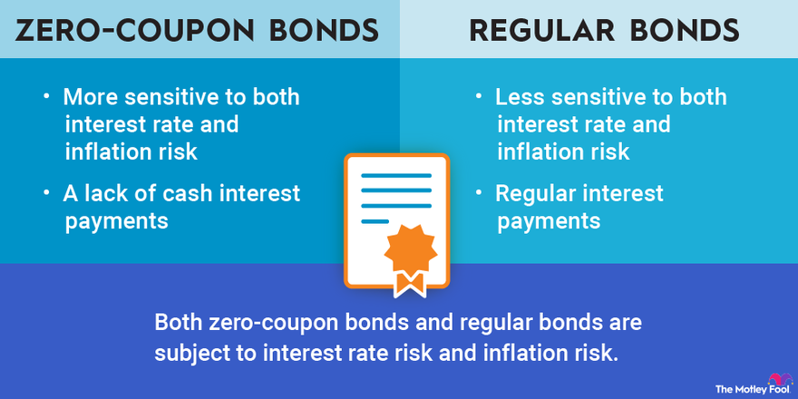

In the world of fixed-income investments, understanding the nuances of different bond types can significantly influence decision-making processes. Zero-coupon bonds and coupon bonds are two prominent types of bonds, each with unique characteristics and implications.

Zero-coupon bonds are issued at a discount and mature at their face value, offering a lump sum to investors at maturity without periodic interest payments. In contrast, coupon bonds provide regular interest payments throughout their lifespan, offering an income stream that can be attractive in a low-interest-rate environment. These distinctions make it crucial for investors to assess which bond type aligns better with their financial goals and cash flow requirements.



Furthermore, the rise of algorithmic trading is profoundly impacting bond markets by enhancing speed and efficiency in transactions that were traditionally slower. This technological advancement is reshaping how bonds are traded, leading to increased market liquidity and pricing transparency. However, with these opportunities come challenges, such as the potential for market manipulation and the need for strong regulatory frameworks.

This article aims to provide clarity and comprehension regarding zero-coupon and coupon bonds, while also examining the transformative role of algorithmic trading in the bond market. By considering these factors, both novice and experienced investors can make more informed decisions, capitalizing on new opportunities while navigating the associated challenges.

## Table of Contents

## Understanding Zero-Coupon Bonds

Zero-coupon bonds, also known as discount bonds, are a unique type of fixed-income security that diverges from traditional, interest-bearing bonds by not offering periodic interest payments to investors. Instead, these bonds are initially sold at a price significantly lower than their face value. At maturity, the bondholder receives a single payment equal to the bond's face value. This structure inherently ensures that the potential for return is embedded in the difference between the purchase price and the maturity value.

For investors, zero-coupon bonds present particular appeal due to their predictable nature and potential for significant returns, especially when held to maturity. They are often utilized for long-term financial objectives, such as saving for education or retirement, given their capacity to provide a lump sum in the future. This makes them attractive for individuals looking to grow their wealth over time without the necessity of periodic income.

### Mechanics of Zero-Coupon Bonds

To understand how zero-coupon bonds work, consider the bond's pricing formula:

$$
P = \frac{F}{(1 + r)^n}
$$

where:
- $P$ is the present price of the bond,
- $F$ is the face value of the bond,
- $r$ is the annual yield or interest rate,
- $n$ is the number of years to maturity.

The bond is purchased at $P$, and the holder will receive $F$ at maturity. The return on investment is determined by the difference between $F$ and $P$, compounded over the bond's duration.

### Benefits of Zero-Coupon Bonds

Zero-coupon bonds offer distinct advantages. Firstly, they provide certainty regarding future cash flows, which is especially beneficial for investors aiming at meeting specific financial goals. Additionally, because no periodic interest is paid, investors do not face the risk of having to reinvest coupon payments at potentially lower interest rates, which can affect overall returns.

### Potential Drawbacks

Despite their advantages, zero-coupon bonds are not without risks. Primarily, they are susceptible to [interest rate](/wiki/interest-rate-trading-strategies) fluctuations. As interest rates rise, the price of existing zero-coupon bonds typically falls, given their fixed yield. This interest rate risk is especially pertinent when an investor needs to sell the bond before maturity, potentially realizing a loss if rates have increased.

Another consideration is the tax implication in certain jurisdictions. Although no cash interest is paid until maturity, bondholders may incur tax liabilities annually on the implied interest, known as "phantom income." This can present cash flow challenges unless managed carefully.

### Interest Rate Risk and Reinvestment Risk

Zero-coupon bonds mitigate reinvestment risk, as there are no periodic cash flows that require reinvestment at current interest rates. However, the absence of periodic payments means that all value is tied to the bond's maturity, increasing exposure to interest rate risk over the bond's life. Investors must therefore consider their willingness and ability to hold the bond until maturity to avoid potential capital losses.

In summary, zero-coupon bonds offer a structured path to achieving long-term investment goals, providing clear advantages in terms of capital growth. However, understanding and managing the associated risks, primarily those related to interest rates and taxation, is essential for maximizing their benefits.

## Exploring Coupon Bonds

Coupon bonds are a type of fixed-income security that provide investors with periodic interest payments, commonly referred to as coupon payments, throughout the life of the bond. These payments represent the bond's nominal coupon rate, which is determined at issuance, typically expressed as a percentage of the bond's face (or par) value. For instance, a bond with a face value of $1,000 and a 5% annual coupon rate will pay $50 each year until maturity, in addition to the return of the principal amount at maturity.

In a low-interest-rate environment, coupon bonds are particularly attractive due to their ability to generate consistent income streams for investors. This consistent income becomes a valuable feature when alternative investment opportunities offer lower returns.

### Coupon Rates and Their Impact

The coupon rate is a critical [factor](/wiki/factor-investing) that influences the attractiveness and valuation of a coupon bond. It directly affects the bond's pricing and yield. The yield of a bond is influenced by the prevailing market interest rates; when market interest rates rise, the price of existing bonds with fixed lower coupon rates typically falls, and vice versa. This inverse relationship is fundamental to understanding interest rate risk associated with coupon bonds.

Bond ratings also play a significant role in determining a bond's coupon rate and, consequently, its investment appeal. Higher-rated bonds, considered to be safer investments, often come with lower coupon rates compared to lower-rated bonds, which must offer higher coupon rates to compensate for the increased default risk.

### Scenarios: Coupon Bonds vs. Zero-Coupon Bonds

Coupon bonds might outperform zero-coupon bonds in scenarios where the investor's goal is to obtain regular income. This is particularly true for investors who rely on bonds for retirement income or other routine financial needs. Conversely, zero-coupon bonds may be preferable in a situation where the investor can reinvest interest income at higher prevailing rates, offering the possibility of compounded returns.

### Types of Coupon Bonds

There are various types of coupon bonds, each with unique features:

1. **Fixed-Rate Bonds**: These bonds have a constant coupon rate throughout the bond's life, providing predictable cash flows. This characteristic makes them suitable for investors seeking stability and certainty in income.

2. **Floating-Rate Notes (FRNs)**: These bonds have adjustable coupon rates that fluctuate based on a reference interest rate, such as the LIBOR or the U.S. Treasury rate. The flexibility of floating-rate notes can protect investors against rising interest rates, as the coupon payments increase with upward movements in benchmark rates.

By understanding the nature of coupon bonds, including their coupon rates, bond ratings, and different types, investors can make informed decisions best suited to their financial objectives and market conditions.

## Comparing Zero-Coupon Bonds and Coupon Bonds

When evaluating zero-coupon bonds and coupon bonds, investors must prioritize their financial objectives, cash flow necessities, and risk tolerance. The primary distinction between these two types of bonds lies in their payment structure. Zero-coupon bonds are sold at a discount and do not provide periodic interest payments; they instead offer a single lump sum payment at maturity. Conversely, coupon bonds pay interest at regular intervals throughout the life of the bond, making them appealing to investors seeking consistent income streams.

#### Key Differences

**Maturity:**
Zero-coupon bonds typically have longer maturities, which aligns with financial goals requiring significant sums at a future date, such as funding education or retirement. The maturity value is predetermined; however, investors face the disadvantage of waiting until the bond's maturity to access any gains. In contrast, coupon bonds make periodic interest payments, offering [liquidity](/wiki/liquidity-risk-premium) throughout the bond's term.

**Tax Implications:**
Tax treatment distinguishes these bonds further. The interest accrued on zero-coupon bonds is subject to annual taxation, even though no physical payment is received until maturity, known as phantom income. Coupon bonds, however, incur taxes on the actual interest received during each period, providing a clearer link between cash flow and tax liability.

**Return Potential:**
Return potential in zero-coupon bonds largely depends on the difference between purchase price and face value, influenced by prevailing interest rates. Coupon bonds, while offering interest income, do not typically exhibit the same potential rapid price appreciation as zero-coupon bonds, especially in decreasing rate environments.

#### Interest Rate Sensitivity and Market Conditions

Interest rate sensitivity, commonly known as duration, is more pronounced in zero-coupon bonds due to their lack of interim cash flows, rendering them highly susceptible to interest rate fluctuations. For coupon bonds, duration levels can be managed using different structures, such as fixed-rate or floating-rate notes, which can mitigate interest rate risk.

```python
# Python code for calculating bond duration
def bond_duration(face_value, coupon_rate, interest_rate, years):
    duration = 0
    for t in range(1, years + 1):
        duration += (t * (coupon_rate * face_value)) / ((1 + interest_rate) ** t)
    duration += (years * face_value) / ((1 + interest_rate) ** years)
    duration /= face_value * coupon_rate
    return duration

# Example: Calculate the duration of a 5-year coupon bond
face_value = 1000
coupon_rate = 0.05
interest_rate = 0.03
years = 5

duration = bond_duration(face_value, coupon_rate, interest_rate, years)
print("Bond Duration:", duration)
```

#### Historical Performance

Examining historical performance, zero-coupon bonds tend to excel in declining interest rate environments as their price is much more sensitive to interest rate changes due to longer duration. In contrast, in stable or rising interest rate environments, coupon bonds outperform by providing consistent income and lower [volatility](/wiki/volatility-trading-strategies).

#### Portfolio Diversification

Diversifying bond portfolios by incorporating both zero-coupon and coupon bonds can balance the risks and rewards associated with different economic conditions and investment horizons. Zero-coupon bonds offer growth potential suited for long-term goals, while coupon bonds ensure income and liquidity, achieving a combined strategy that takes advantage of both stable and dynamic market conditions. 

Overall, understanding the unique characteristics of each bond type enables investors to craft tailored strategies that align with evolving financial landscapes and personal goals.

## The Role of Algorithmic Trading in Bond Markets

Algorithmic trading is transforming bond markets by increasing the speed and efficiency of transactions, which were traditionally characterized by slower, over-the-counter (OTC) mechanisms. The integration of algorithms allows for the automation of trading processes, enabling a rapid execution of trades based on pre-defined criteria. These algorithms utilize complex mathematical models and statistical analysis to identify trading opportunities, thereby enhancing liquidity and pricing transparency in the bond market.

Liquidity has been a long-standing issue in bond markets, primarily due to the heterogeneity of bond issues and the smaller number of active participants compared to equity markets. Algorithmic trading addresses these challenges by facilitating quicker buy and sell executions, which can attract more participants. As market liquidity improves, the bid-ask spreads tend to narrow, thus providing more favorable pricing to investors. Algorithms can assess vast amounts of data almost instantaneously to determine the best price, which benefits both market-makers and investors.

Moreover, [algorithmic trading](/wiki/algorithmic-trading) leverages big data analytics to enhance decision-making processes. By analyzing historical price patterns, interest rate movements, economic indicators, and other market variables, algorithms can predict future price movements with a higher degree of accuracy. This data-driven approach enables traders to execute orders at the most opportune moments, optimizing returns and mitigating risks.

However, the widespread adoption of algorithmic trading introduces certain challenges. One of the primary concerns is market manipulation, where algorithms can be programmed to artificially influence prices or create false market signals. Events such as the 2010 Flash Crash have underscored the potential risks associated with high-frequency trading strategies that rely on algorithms. To mitigate these risks, robust regulatory frameworks are essential to monitor and govern algorithmic activities, ensuring fair market practices.

Emerging trends in algorithmic trading for bond markets include the development of [machine learning](/wiki/machine-learning) algorithms that can improve predictive accuracy over time. These advanced algorithms learn from new data inputs, continually refining their trading strategies. Additionally, there is a growing interest in using blockchain technology to enhance transparency and reduce settlement times in bond trading. As these technologies evolve, they are likely to further reshape bond markets, making them more efficient and accessible.

In conclusion, the role of algorithmic trading in bond markets is significant, offering both opportunities and challenges. As technology continues to advance, investors must remain informed about the latest developments to effectively navigate this dynamic landscape.

## Conclusion

Both zero-coupon and coupon bonds present distinct advantages tailored to diverse investment strategies and objectives. Zero-coupon bonds provide a straightforward, long-term growth potential without the need for reinvestment of periodic income, making them suitable for investors focused on future financial goals, such as retirement or saving for higher education. Conversely, coupon bonds deliver regular interest payments, offering a consistent income stream that can be particularly attractive in stable or low-interest rate environments.

Understanding the distinct features of each bond type is crucial to making informed investment decisions. Zero-coupon bonds, purchased at a discount and maturing at face value, offer the benefit of compounding interest but are sensitive to interest rate fluctuations. Coupon bonds, with their fixed or variable interest payments, provide immediate liquidity but may be more affected by inflationary pressures.

In addition to these traditional securities, the rise of algorithmic trading is transforming bond markets by introducing unprecedented speed and efficiency. This technological advancement enhances market liquidity and pricing transparency, allowing investors to execute trades with accuracy and reduced transaction costs. Algorithms can process vast quantities of data rapidly, enabling more strategic investment decisions that traditional methods might miss.

Investors should remain informed about such technological advancements and be prepared to adjust their strategies in response to market evolution. Staying up-to-date with the latest developments in algorithmic trading and its impact on the bond market is essential for optimizing investment outcomes.

Ultimately, employing a balanced approach that embraces both traditional strategies and innovative technologies is key to successful bond investing. By diversifying their portfolios with a mix of zero-coupon and coupon bonds and leveraging the potential of algorithmic trading, investors can navigate the complexities of bond markets more effectively, positioning themselves to take advantage of new opportunities while mitigating risks.

## References & Further Reading

[1]: ["Fixed Income Analysis, Second Edition"](https://www.amazon.com/Fixed-Income-Analysis-Frank-Fabozzi/dp/047005221X) by Frank J. Fabozzi

[2]: ["Bond Markets, Analysis, and Strategies, Ninth Edition"](https://www.amazon.com/Bond-Markets-Analysis-Strategies-9th/dp/0133796779) by Frank J. Fabozzi

[3]: ["The Handbook of Fixed Income Securities"](https://www.amazon.com/Handbook-Fixed-Income-Securities-Ninth/dp/1260473899) by Frank J. Fabozzi

[4]: ["Algorithmic Trading and DMA: An introduction to direct access trading strategies"](https://archive.org/details/algorithmictradi0000john) by Barry Johnson

[5]: ["The Basics of Algorithmic Trading: Concepts and Examples"](https://www.investopedia.com/articles/active-trading/101014/basics-algorithmic-trading-concepts-and-examples.asp) by Charles D. Kirkpatrick in Financial Analysts Journal