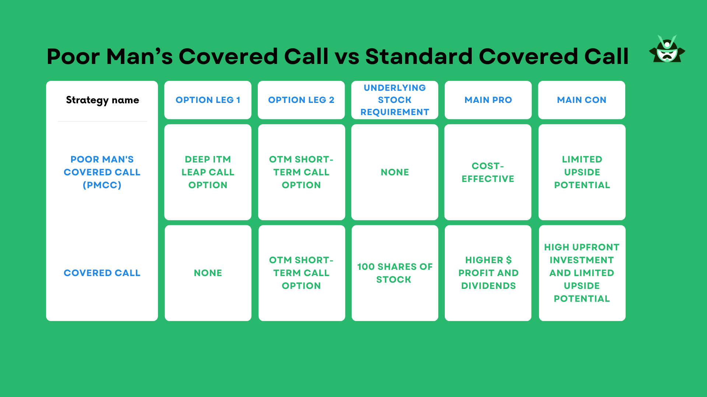

Options trading presents a complex landscape, often challenging for newcomers due to its variety of strategies and sophisticated mechanisms. Understanding fundamental differences between strategies such as covered calls and regular calls is essential for traders aspiring to successful engagements in this financial domain. Covered calls can act as income-generating strategies, with traders selling call options on stocks they own, while regular calls offer a speculative approach to profit from potential stock price increases.

Algorithmic trading, commonly known as algo trading, has significantly impacted the execution of these strategies. By leveraging the power of algorithms, traders can automate and optimize trading decisions, addressing market conditions with high precision and speed far beyond human capabilities. This article seeks to clarify these concepts and elucidate their interconnected nature, examining the potential benefits and considerations associated with each strategy. It will also illustrate the transformative role of algorithmic trading in enhancing the effectiveness of options strategies, offering traders tools and techniques to refine and improve their trading processes.



## Table of Contents

## What is Options Trading?

Options trading involves the buying and selling of options contracts, which are financial derivatives providing the buyer with the right, but not the obligation, to buy or sell an underlying asset at a predetermined price, known as the strike price, on or before a specified expiration date. The flexibility inherent in options contracts makes them a popular tool for numerous trading strategies.

There are two primary types of options: call options and put options. A call option gives its holder the right to purchase an underlying asset, whereas a put option entitles the holder to sell an asset. These instruments serve varied purposes in financial markets. Call options are often utilized by traders anticipating a rise in the price of the underlying asset, enabling them to profit from upward price movements without committing to a full purchase. Conversely, put options are typically employed by those expecting a decline in asset prices.

Traders employ options for a range of objectives, including hedging, speculation, and generating enhanced returns while managing risk. Hedging involves using options to protect against unfavorable price movements, acting as a form of insurance for an existing portfolio. For example, purchasing a put option can act as a hedge against potential losses from a decline in the value of an asset already held.

Options also appeal to speculators who aim to capitalize on market fluctuations with potentially significant profits. The leverage provided by options allows traders to control a larger position than they could with direct asset purchases, thus amplifying potential returns and risks.

Additionally, options offer the chance to generate income. Strategies such as selling covered call options enable investors to earn premiums on stocks they already own, contributing to portfolio income while maintaining downside protection.

Options trading involves careful consideration of factors such as asset price [volatility](/wiki/volatility-trading-strategies), time to expiration, and market conditions. These elements influence the pricing of options contracts, which can be calculated using models such as the Black-Scholes formula:

$$
C = S_0N(d_1) - X e^{-rT}N(d_2)
$$

Where:
- $C$ is the call option price,
- $S_0$ is the current price of the asset,
- $X$ is the strike price of the option,
- $r$ is the risk-free interest rate,
- $T$ is the time to expiration,
- $N(d)$ is the cumulative distribution function of the standard normal distribution,
- $d_1$ and $d_2$ are calculated as follows:

$$
d_1 = \frac{\ln(\frac{S_0}{X}) + (r + \frac{\sigma^2}{2})T}{\sigma\sqrt{T}}
$$
$$
d_2 = d_1 - \sigma\sqrt{T}
$$

Understanding these concepts and calculations is crucial for anyone engaging in options trading, as it enables informed decision-making and strategic planning.

## Understanding Covered Calls

A covered call is a financial strategy employed by investors to generate additional income through option premiums while potentially selling an underlying stock at a predetermined price. In this strategy, the investor writes (sells) a call option against shares they already own. This positions the investor to receive a premium from the buyer of the option in exchange for the buyer's right to purchase the stock at the strike price before the option expires.

For example, assume an investor owns 100 shares of Company X, which are currently valued at $50 per share. The investor decides to write a call option with a strike price of $55, expiring in one month, and receives a premium of $2 per share. If the stock's market price remains below $55, the option is likely to expire worthless, allowing the investor to retain both the premium and the stock. Alternatively, if the stock's price surpasses $55, the buyer of the option may exercise their right, and the investor must sell their shares at the strike price, ensuring a profit from both the sale and the received premiums.

Covered calls serve as a conservative investment strategy. They are most beneficial for investors seeking to augment their income through their existing stock holdings, without the intention of significant speculative risk. The risk involved is limited because it involves stocks already owned, and the primary downside is the potential opportunity cost if the stock price appreciates significantly beyond the strike price, capping the maximum possible gain.

This strategy can also be advantageous in a neutral to slightly bullish market environment, where significant stock price surges are not anticipated. It offers a balance between risk and reward, providing a steady income stream while allowing the investor to participate in potential stock price increases up to the strike price.

## Exploring Regular Calls

A regular call, also referred to as a long call, is a fundamental options strategy that enables the holder to purchase a stock at a specified price, known as the strike price, before the option's expiration date. This strategy is attractive to traders who anticipate that the stock price will exceed the strike price, as it offers the potential for substantial profit. The basic premise is to leverage the stock's upward movement to attain a favorable position in the market.

The appeal of regular calls lies in the potential for significant profit. When a stock's market price exceeds the strike price of a call option, the option is said to be "in the money." In this scenario, the holder can purchase shares at the lower strike price and sell them at the higher market price, capturing the price difference as profit. Theoretically, this profit potential is unlimited, as the stock price could rise infinitely.

However, the simplicity and potential of regular calls are balanced by their speculative nature. Unlike covered calls, where risk is cushioned by ownership of the underlying asset, regular calls involve a higher degree of market speculation. The trader's risk is confined to the premium paid for the option; this upfront cost represents the maximum loss possible if the stock price does not meet expectations.

To effectively employ a regular call strategy, traders need to accurately predict market movements. This requirement underscores the importance of sound analysis and forecasting abilities. Market indicators, historical price patterns, and broader economic conditions can all be considered when making these predictions.

In practical terms, the payoff for a regular call can be represented mathematically as follows:

$$
\text{Payoff} = \max(0, S_t - K) - P
$$

Where:
- $S_t$ is the stock price at expiration
- $K$ is the strike price of the option
- $P$ is the premium paid for the option

This equation highlights that the key to realizing profit is for $S_t$ to be greater than $K + P$, ensuring that the strike price plus the premium is covered by the increased value of the stock.

In conclusion, while regular calls offer enticing possibilities for profit in rising markets, their speculative nature necessitates well-researched market predictions and a clear understanding of the associated risks.

## The Role of Algo Trading in Options

Algorithmic trading is revolutionizing the options market by leveraging computational power to automate and enhance trading decisions. Unlike traditional trading methods reliant on human intuition and manual execution, [algorithmic trading](/wiki/algorithmic-trading) employs complex algorithms that can process vast amounts of market data and execute trades at speeds unattainable by human traders.

For options trading, the implementation of algorithmic strategies can significantly improve decision-making processes and execution efficiencies. Algorithms can rapidly assess market conditions, such as volatility, [liquidity](/wiki/liquidity-risk-premium), and price movements, to identify optimal moments for executing trades. This capability is particularly advantageous when dealing with strategies like covered calls or regular calls, where timing and precision are critical to maximizing returns and minimizing risk.

One of the key benefits of algorithmic trading in options is the management of large volumes of trades with high precision. Algorithms can execute a series of orders simultaneously or in quick succession while adhering to the constraints and rules set by the trader. This reduces the potential for human error and ensures that trades are executed with the intended parameters.

Furthermore, algorithmic trading reduces transaction costs through efficient order execution. By optimizing the timing and size of trades, algorithms minimize the market impact and adverse price movements that can occur with large trades. This is essential for maintaining profitability, especially in markets with tight spreads and high competition.

Backtesting is another vital advantage provided by algorithmic trading. Traders can simulate historical market conditions to evaluate the performance of their trading strategies before applying them in real-world scenarios. This allows for the refinement of strategies and improved predictive accuracy, thereby enhancing potential outcomes. By analyzing past data, traders can adjust their algorithms to better capture market opportunities and mitigate risks.

In conclusion, the application of algorithmic trading in options empowers traders with significant benefits such as enhanced execution speed, accuracy, and strategic optimization. As technology continues to advance, traders who embrace algorithmic solutions are likely to maintain a competitive edge in the fast-paced options market.

## Integrating Covered Calls with Algo Trading

Integrating algorithms into the process of selling covered calls allows traders to enhance their decision-making capabilities through automation. By using predefined criteria such as market conditions or volatility levels, algorithmic trading systems can automate the execution of selling covered calls, ensuring that these trades are carried out efficiently and consistently.

Algorithms are capable of rapidly adjusting positions in real-time to optimize income potential. They can analyze vast amounts of market data and make informed choices about when to enter or [exit](/wiki/exit-strategy) a position, thus mitigating the risks associated with sudden market shifts. This agility is particularly beneficial in volatile markets, where human traders might struggle to react swiftly enough to capture optimal pricing.

The use of algorithms in trading facilitates a disciplined approach, which is essential for maintaining consistency. By removing emotional biases from trading decisions, algorithms ensure that strategies are executed based on logical criteria rather than subjective judgment. This systematic approach can help minimize common psychological pitfalls in trading, such as panic-driven decisions or overconfidence.

Furthermore, traders employing algorithms can set up strategies to roll over calls as they near expiration. Rolling over involves closing an existing option position and opening a new one with a later expiration date and possibly a different strike price. This tactic enables traders to adapt to evolving market situations, attempting to maximize gains or minimize losses based on current conditions.

The integration of algorithmic trading in managing covered calls not only streamlines operations but also offers the potential for improved financial outcomes. By [backtesting](/wiki/backtesting) different strategies, traders can evaluate the historical performance of their algorithms and adjust parameters to refine these strategies before implementing them in live markets. This helps in creating robust trading systems that are well-equipped to handle the dynamism of financial markets.

## Optimizing Regular Calls with Algo Strategies

Algorithmic trading significantly enhances the ability to optimize regular call options by leveraging advanced data analysis and automated execution. This approach allows traders to identify lucrative opportunities based on a comprehensive evaluation of market indicators and patterns.

### Indicators and Pattern Monitoring

Algorithmic systems are designed to process vast amounts of data quickly, identifying relevant market trends and indicators that may signal optimal times to purchase regular call options. These indicators can include moving averages, relative strength index (RSI), and bollinger bands, among others. For example, a sudden increase in trading [volume](/wiki/volume-trading-strategy) combined with a bullish moving average crossover might prompt the algorithm to execute a long call trade, anticipating a rise in the underlying stock price.

### Real-Time Data Execution

Algos operate with the advantage of executing trades in real-time, reducing delays that could occur manually. This capability is especially beneficial in fast-paced market environments, where momentary price changes can impact potential profitability. For instance, an algorithm coded to execute trades when the stock price reaches a specified threshold can do so within milliseconds, locking in favorable positions more efficiently than manual trading.

### Automating Regular Calls

One of the primary advantages of using algorithmic trading for regular calls is the ability to automate strategy implementation. By defining precise entry and exit criteria within the algorithm's coding, trades are only executed when conditions align perfectly with the trader’s strategy. Here is a simple Python example utilizing a trading library like `pandas` and a theoretical API for trade execution:

```python
import pandas as pd
import numpy as np
from trading_api import execute_trade, get_stock_data

# Hypothetical function to identify buy signals based on moving averages
def identify_trading_opportunity(stock_data):
    short_window = 40
    long_window = 100
    signals = pd.DataFrame(index=stock_data.index)
    signals['signal'] = 0.0

    # Create short simple moving average and long simple moving average
    signals['short_mavg'] = stock_data['close'].rolling(window=short_window, min_periods=1).mean()
    signals['long_mavg'] = stock_data['close'].rolling(window=long_window, min_periods=1).mean()

    # Create signals
    signals['signal'][short_window:] = np.where(signals['short_mavg'][short_window:] > signals['long_mavg'][short_window:], 1.0, 0.0)

    # Generate trading orders
    signals['positions'] = signals['signal'].diff()

    return signals

# Example execution
stock_code = 'AAPL'
stock_data = get_stock_data(stock_code)
signals = identify_trading_opportunity(stock_data)

# Place trade if there's a signal
if signals['positions'].iloc[-1] == 1.0:
    execute_trade(stock_code, 'buy')

```

### Backtesting Capabilities

Before deploying strategies in live markets, backtesting allows traders to simulate their algorithms using historical data to refine strategies and improve expected outcomes. This process involves running the algorithm on a set of past market data to assess its efficacy and adjust accordingly. A robust backtesting routine can evaluate the strategy's performance over various market conditions, offering insights into potential risk and reward.

By embracing algorithmic trading for regular call options, traders can harness computational power to exploit market inefficiencies, achieve faster execution, and refine strategies with precision, ultimately improving the likelihood of successful outcomes.

## Pros and Cons of Algo Trading in Options

Algorithmic trading has transformed options trading by enhancing execution speed, accuracy, and the management of complex strategies. These advantages contribute to reduced emotional bias in decision-making, as the trading process becomes more streamlined and systematic. Furthermore, algorithms can process large datasets swiftly, identifying patterns and opportunities that might elude manual trading approaches. For example, by using statistical models and [machine learning](/wiki/machine-learning), algos can fine-tune strategies, adjusting for market volatility and price changes to optimize trades.

However, algorithmic trading is not without its challenges. One significant concern is the potential for algorithm failures, which can result in large-scale financial losses or missed opportunities. Technological dependencies mean that traders must rely on robust and often costly infrastructure to support their trading systems. This involves maintaining high-performance computers, secure networks, and stable connectivity, which are critical for ensuring uninterrupted trading activities.

The complexities involved in setting up and maintaining these systems require significant expertise and resources. Algo trading systems must be continuously monitored to prevent and address potential errors and disruptions promptly. Traders must invest in skilled IT personnel and resources to ensure the algorithms operate correctly, and adjustments are made as necessary to accommodate evolving market conditions.

Hence, traders must weigh these factors carefully when considering the integration of algorithmic trading into their options strategies. While the benefits in terms of speed, precision, and reduced emotional influence offer compelling advantages, the risks associated with technological dependencies, system failures, and resource commitments cannot be overlooked. Recognizing these pros and cons allows traders to make informed decisions and optimize their strategies effectively.

## Conclusion

Options trading, encompassing strategies such as covered calls and regular calls, provides investors with distinctive avenues to augment their portfolios. Covered calls allow investors to generate additional income on stocks they already own by selling call options, while regular calls enable traders to benefit from anticipated stock price increases by purchasing call options. Both tactics present opportunities to capitalize on market movements with varying levels of risk and return.

Incorporating algorithmic trading into these options strategies can markedly enhance their execution's efficiency and effectiveness. Algorithms can automate trading decisions by analyzing vast amounts of market data in real time, thus quickly identifying optimal moments for buying or selling options. This capability supports precise execution of trades, minimizes human error, and reduces transaction costs. For instance, traders can use algorithms to automatically adjust covered call positions based on market conditions, or to execute regular call trades at opportune times to maximize potential profits.

Despite the inherent complexities of algorithmic trading, the advantages are pronounced, equipping traders with powerful tools to achieve greater success. Automation allows for the management of complex strategies with accuracy and speed that is unattainable manually, thus opening avenues for more sophisticated trading approaches. Additionally, the ability to backtest strategies with historical data before live execution provides valuable insights into prospective returns and risk management, enabling traders to refine and optimize their approaches.

As technology continues to evolve, traders who remain informed and adaptable in their strategic applications will find themselves at a considerable advantage. Embracing technological advancements, such as algorithmic trading, in options trading not only provides competition edge but also significantly enhances the potential for success in financial markets.

## References & Further Reading

[1]: Chance, D. (2018). ["Options and Options Trading: A Simplified Course."](https://books.google.com/books/about/Options_and_Options_Trading.html?id=5_OUS9qdxfQC) Wiley.

[2]: Black, F., & Scholes, M. (1973). ["The Pricing of Options and Corporate Liabilities."](https://www.cs.princeton.edu/courses/archive/fall09/cos323/papers/black_scholes73.pdf) Journal of Political Economy, 81(3), 637-654.

[3]: Whaley, R. E. (2006). ["Derivatives on Market Volatility: Hedging Tools Long Overdue."](https://www.researchgate.net/publication/277429711_Understanding_the_VIX) Journal of Derivatives.

[4]: Pardo, R. (2008). ["The Evaluation and Optimization of Trading Strategies."](https://onlinelibrary.wiley.com/doi/book/10.1002/9781119196969) Wiley.

[5]: Chande, T. S. (2014). ["Beyond Technical Analysis: How to Develop and Implement a Winning Trading System."](https://archive.org/details/beyondtechnicala0000chan) Wiley.