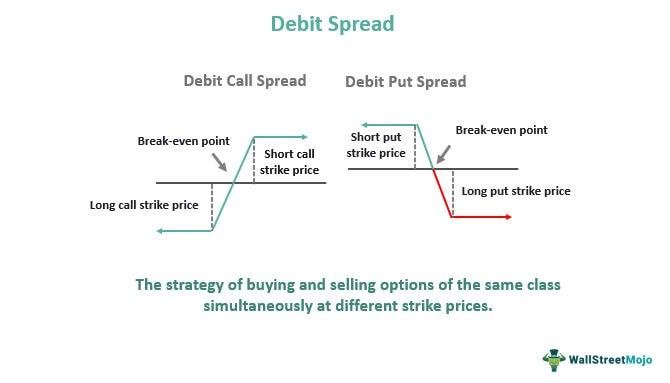

Options trading has emerged as a prominent component of modern investment strategies, captivating a diverse range of investors from individual traders to institutional participants. Options are financial derivatives that offer the buyer the right, but not the obligation, to buy or sell an underlying asset at a predetermined price within a specified time frame. This flexibility comes with the potential for significant returns, as well as the ability to hedge against potential losses in various market conditions.

Central to options trading strategies are credit spreads and debit spreads, which play a crucial role in optimizing risk and reward profiles. Credit spreads involve options strategies where a trader simultaneously buys and sells options of the same class, differing in strike price and/or expiration date, with the net effect being an immediate inflow of cash or "credit". The primary types include bull put spreads, wherein a trader expects a moderate rise in the price of the underlying asset, and bear call spreads, utilized when a trader predicts a decline or stagnation in price.



Conversely, debit spreads occur when the trader ends up with a net cash outflow after implementing the option strategy. This involves purchasing an option with a higher premium and selling another with a lower premium. Types of debit spreads include bull call spreads, aimed at capitalizing on an expected increase in the underlying asset's price, and bear put spreads, used when anticipating a decline in price. These spread strategies are crucial as they help limit potential losses while maintaining a strategic upside in various market scenarios.

The landscape of financial markets is increasingly influenced by the rise of algorithmic trading. Algorithmic trading uses computer algorithms to execute trades at high speed and efficiency, allowing traders to implement complex strategies, such as credit and debit spreads, with enhanced precision and reduced emotion-driven errors. As technology evolves, algorithms have become integral, facilitating the real-time analysis of large datasets and the execution of sophisticated trading strategies.

This article will cover several key topics regarding credit and debit spreads, providing a comprehensive understanding of their mechanics, types, benefits, risks, and suitable market conditions. Furthermore, it will explore the distinct differences between these strategies, including considerations relevant to risk, reward, and market outlook. We will discuss the role of algorithmic trading in optimizing these strategies and consider the integration of machine learning within algorithmic applications specific to options trading. Finally, the article will highlight real-world examples of successful algorithmic trading implementations and provide practical guidance for both novice and experienced traders.

## Table of Contents

## Understanding Credit Spreads

Credit spreads are options strategies that involve the simultaneous purchase and sale of options with the same expiration date but different strike prices, resulting in a net credit to the trader's account. These strategies seek to profit either from the passage of time (time decay), a decline in implied volatility, or minimal movement in the underlying asset's price. Credit spreads play an essential role in risk management, as they allow traders to define their risk up front.

### Types of Credit Spreads

There are two primary types of credit spreads used by options traders: bull put spreads and bear call spreads.

#### Bull Put Spread

A bull put spread, also known as a put credit spread, involves selling a put option and purchasing a put option with the same expiration date but a lower strike price. This strategy profits when the underlying asset's price remains above the higher strike price, allowing both options to expire worthless. The trader keeps the net credit received from opening the position. 

**Example**: Suppose a trader believes that the stock price of XYZ Corp, currently at $50, will stay above $48 over the next month. The trader could:

- Sell a 50-strike put option for a premium of $3.
- Buy a 48-strike put option for a premium of $1.

The net credit received is $2 ($3 - $1) per share. The maximum profit is the initial net credit received, and the maximum loss occurs if the stock price falls below $48, which would be the difference between the strike prices minus the net credit ($2 - $2).

#### Bear Call Spread

A bear call spread, also referred to as a call credit spread, involves selling a call option and buying another call option with the same expiration date but a higher strike price. This strategy benefits when the underlying asset's price remains below the lower strike price, causing both options to expire worthless and allowing the trader to retain the net credit received. 

**Example**: If a trader anticipates that the stock price of ABC Inc., currently at $55, will stay below $57:

- Sell a 55-strike call option for a premium of $4.
- Buy a 57-strike call option for a premium of $2.

The resulting net credit is $2 per share. The maximum profit is the net credit received, while the maximum loss happens if the stock price climbs above $57, calculated as the difference in strike prices minus the net credit ($2 - $2).

### Benefits and Risks of Credit Spreads

Credit spreads are popular among traders for their defined risk and reward potential. The maximum potential loss is capped at the difference in strike prices minus the net credit received, offering more predictable outcomes than some other options strategies. Additionally, because the strategy earns a premium at the initiation of the trade, it benefits from time decay, which can erode the value of options over time.

However, credit spreads are not without risk. If the underlying asset moves significantly in an unfavorable direction, the strategy can incur losses. Volatility changes can also affect the spread's profitability. Traders must be vigilant about the implied [volatility](/wiki/volatility-trading-strategies) levels when initiating these trades.

### Market Conditions for Credit Spreads

Credit spreads are particularly effective in stable or slightly trending markets. Bull put spreads are suitable when the trader expects the underlying asset to rise or remain stable, while bear call spreads are advantageous when the trader anticipates a decline or stabilization in price. Sound judgment about market conditions and trends is crucial for the successful application of credit spreads, as they are inherently based on market directionality predictions.

In summary, understanding the mechanics and strategic application of credit spreads can help traders effectively harness these tools for potential profit while managing risks, particularly in market environments that favor stability or slight movements.

## Exploring Debit Spreads

Debit spreads are a popular type of options trading strategy characterized by the simultaneous purchase and sale of options of the same class (puts or calls), same expiration date, but different strike prices. In debit spreads, the premiums paid for buying the options exceed the premiums received from selling the options, resulting in a net outflow of cash — hence the term "debit."

### Types of Debit Spreads

#### Bull Call Spreads

A bull call spread is created by purchasing a call option at a lower strike price while simultaneously selling a call option at a higher strike price. Both options have the same expiration date. This strategy is employed when the trader is moderately bullish on the underlying asset. The maximum profit in a bull call spread is the difference between the strike prices of the two call options minus the net premium paid. The potential loss is limited to the net premium paid.

*Example:*

Assume a stock is trading at $50. A trader believes the stock will rise but wants to limit their investment. They might buy a call option with a $50 strike for $5, while selling a call option with a $55 strike for $2. The net premium paid is $3. If the stock price rises to $55 or above, the maximum profit is $2 ([$55 - $50] - $3) per share.

#### Bear Put Spreads

Conversely, a bear put spread involves buying a put option with a higher strike price and selling a put option with a lower strike price. This strategy is used when a trader anticipates a moderate decline in the underlying asset's price. The maximum gain is the difference between the strike prices minus the net premium, and the potential loss is capped at the net premium paid.

*Example:*

If a stock is trading at $100, a trader might buy a put with a $100 strike for $6 and sell a put with a $95 strike for $2, resulting in a net premium of $4. If the stock falls to $95 or below, the maximum profit is $1 ([$100 - $95] - $4) per share.

### Advantages and Disadvantages

**Advantages:**

1. **Limited Risk:** The risk in debit spreads is limited to the net premium paid, making it a suitable choice for risk-averse traders.
2. **Lower Capital Requirement:** Compared to outright option buying, debit spreads require less capital due to the reduced premium outlay.
3. **Clear Risk-Reward Ratio:** The maximum gain and loss are defined upfront, aiding in planning and strategy.

**Disadvantages:**

1. **Limited Profit Potential:** The profit is capped, which might not capture the full benefit if the underlying asset makes a substantial move.
2. **Net Premium Cost:** Since debit spreads involve a net cash outflow, they can be costly depending on the difference in option premiums.
3. **Need for Accurate Forecasts:** Successful deployment requires accurate prediction of the market direction within a specified range.

### Suitable Market Environments for Debit Spreads

Debit spreads are advantageous in trending markets where the trader can predict the direction of price movement with a reasonable degree of certainty. Bull call spreads are ideal in modestly bullish environments, while bear put spreads are suited for moderately bearish conditions. They are less effective in highly volatile markets or when no discernible trend is present, as the capped profit potential might not compensate for the risk involved. Adjusting the choice between bull call and bear put spreads based on market sentiment is crucial for maximizing their efficacy.

## Key Differences Between Credit and Debit Spreads

Credit and debit spreads are fundamental options trading strategies that provide traders with distinct risk-reward profiles and market outlook potentials. Understanding the key differences between these spreads is crucial for investors to tailor their strategies to specific market conditions and personal risk tolerance.

Credit spreads involve the simultaneous selling and buying of options of the same class (puts or calls) with different strike prices, netting an upfront credit to the trader's account. These spreads are primarily used by traders aiming to capitalize on time decay and price stability, as they typically profit from stagnant or mildly directional market movements. The most common forms of credit spreads are bull put spreads and bear call spreads.

In contrast, debit spreads require a net investment because they involve buying an option with a higher premium and selling an option with a lower premium. Debit spreads are designed to benefit from more pronounced market movements in the anticipated direction, with bull call spreads and bear put spreads being the common types. 

### Risk and Reward

Credit spreads generally offer limited potential profit, equating to the initial credit received, while the risk can be more substantial, typically the difference between the strike prices minus the net credit. This creates a risk-reward ratio that may favor traders who are confident in minimal price movements. Conversely, debit spreads permit a higher potential reward, as profits can exceed the initial outlay up to the difference in strike prices if the market moves favorably. However, the maximum loss in debit spreads is constrained to the net debit paid.

### Market Outlook

Credit spreads are often employed in neutral or moderately bullish/bearish markets, capitalizing on time decay—an intrinsic aspect of options whereby their value decreases as expiration nears. Debit spreads, by contrast, suit more directional market outlooks, where significant upward or downward movements are projected.

### Time Decay and Implied Volatility

Time decay (theta) favors credit spreads as the options sold will lose value more rapidly than those bought, enhancing profitability if the underlying asset remains stable. Debit spreads, negatively impacted by time decay, require more precise timing to succeed, as the bought option loses value faster than offset by the sold option.

Implied volatility impacts both credit and debit spreads, though in opposing manners. Credit spreads benefit from higher implied volatility at initiation, as it increases premium values and thus the credit received. Conversely, a decrease in implied volatility over time aids the position. Debit spreads thrive on an increase in implied volatility, potentially escalating the bought option’s value and improving the spread's profitability.

### Choosing Between Credit and Debit Spreads

When selecting between these strategies, investors should assess their market outlook, risk appetite, and trading objectives. For more conservative traders, credit spreads might be preferable due to their profit from time decay and less dependence on market movement. In contrast, traders anticipating substantial price movement might opt for debit spreads to leverage significantly higher potential returns. Understanding these nuances empowers traders to optimize options strategies aligning with their market analysis and financial goals.

 to Algorithmic Trading

Algorithmic trading, often referred to as algo trading, is a method of executing trades using computerized algorithms and pre-programmed instructions. These algorithms consider variables such as time, price, and [volume](/wiki/volume-trading-strategy), enabling traders to implement strategies without human intervention. Algo trading has become indispensable in modern financial markets due to its ability to handle large volumes of transactions rapidly and efficiently.

In today's trading environment, algorithms are integral to executing complex trading strategies, including options trading strategies like credit and debit spreads. For credit spreads, algorithms can be programmed to identify optimal market conditions for implementing bull put spreads or bear call spreads. In the case of debit spreads, algorithms can efficiently manage bull call spreads or bear put spreads, ensuring trades are executed when specific criteria are met.

The benefits of [algorithmic trading](/wiki/algorithmic-trading) are considerable, primarily its speed and accuracy. Algorithms can process vast amounts of market data and execute trades at a pace far beyond human capability. This rapid execution minimizes slippage—the difference between the expected price of a trade and the actual price. Algo trading also reduces the emotional biases that often influence trading decisions, promoting a more disciplined approach.

However, the use of algorithmic trading is not without challenges and risks. Market volatility can lead to significant losses if algorithms are not properly calibrated to respond to sudden changes. Additionally, technological failures, such as connectivity issues or software bugs, can disrupt trading activities, leading to financial repercussions. The complexity of developing reliable algorithms also poses a barrier, requiring a deep understanding of both programming and financial markets. Furthermore, the increasing reliance on algo trading has raised concerns about market stability, as evidenced by occurrences like the Flash Crash of May 2010. Traders and firms must therefore balance the advantages of algo trading with careful management of associated risks to ensure effective implementation.

## Leveraging Algorithmic Trading for Option Spreads

Algorithmic trading has become a cornerstone in the execution of options strategies, particularly for optimizing credit and debit spreads. This approach leverages the power of algorithms to analyze vast amounts of market data and execute trades with precision and speed that surpasses human capabilities.

### Role of Algorithms in Analyzing Market Data and Executing Trades

Algorithms in trading are employed to sift through comprehensive datasets, identifying patterns and signals that can inform trading decisions. For credit and debit spreads, algorithms can swiftly evaluate market conditions, such as volatility and [liquidity](/wiki/liquidity-risk-premium), to identify optimal entry and [exit](/wiki/exit-strategy) points. By automating this analysis, algorithms reduce the complexity and time required to make informed decisions.

A key advantage of using algorithms is their ability to perform high-frequency trading ([HFT](/wiki/high-frequency-trading-strategies)), allowing traders to exploit even minor price inefficiencies in the market. This is particularly advantageous for options trading, where the speed of execution can significantly impact the profitability of spread strategies. Furthermore, algorithms can continuously monitor the market, adjusting positions as needed to mitigate risk and capitalize on favorable conditions.

### Integration of Machine Learning in Algorithmic Trading for Options

Machine learning (ML) enhances algorithmic trading by enabling the development of adaptive models that learn from historical data and predict future market trends. In the context of option spreads, ML algorithms can be trained to recognize complex patterns that are indicative of profitable opportunities for credit or debit spreads.

For example, supervised learning algorithms such as decision trees or support vector machines can be trained on labeled datasets to forecast underlying asset price movements. Unsupervised learning methods, such as clustering, can group similar market conditions, aiding in strategy selection.

Here’s a basic Python example using a decision tree to predict asset movement:

```python
from sklearn.model_selection import train_test_split
from sklearn.tree import DecisionTreeClassifier
import numpy as np

# Sample market data (features) and respective asset movement (target)
data = np.array([[0.8, 1.2, 0.5], [0.9, 1.3, 0.7], [0.7, 1.0, 0.4]])
target = np.array([1, 0, 1])  # 1: Upward movement, 0: Downward

# Splitting data into training and test sets
X_train, X_test, y_train, y_test = train_test_split(data, target, test_size=0.2)

# Initializing and training the decision tree classifier
clf = DecisionTreeClassifier()
clf.fit(X_train, y_train)

# Making predictions
predictions = clf.predict(X_test)
```

### Real-World Applications and Success Stories

Several financial institutions and hedge funds have successfully employed algorithmic trading in their options strategies. For instance, the integration of algorithms has enabled firms to identify and exploit [arbitrage](/wiki/arbitrage) opportunities that would be impractical to capitalize on manually. Additionally, [machine learning](/wiki/machine-learning)-driven algorithms have proven effective in dynamically adjusting option positions based on real-time market conditions, leading to improved risk-adjusted returns.

One notable success story includes the use of algorithmic systems by quantitative hedge funds, which utilize sophisticated statistical models to generate returns independent of market direction. These systems are particularly adept at optimizing spread strategies by continuously reassessing market conditions and auto-adjusting trading parameters to maintain optimal exposure.

In summary, the synergy between algorithmic trading and options strategies like credit and debit spreads offers a powerful mechanism for enhancing trading efficiency and effectiveness. As the financial markets continue to evolve, the integration of advanced analytics and machine learning in trading algorithms will likely become increasingly essential for traders seeking to maintain a competitive edge.

## Conclusion

In conclusion, options trading has emerged as a vital component of modern financial markets, offering investors diverse strategies to optimize returns and manage risks. Central to these strategies are credit and debit spreads, each presenting unique mechanics and strategic benefits. Understanding these spreads is not merely a theoretical exercise but a practical necessity for investors seeking to make informed decisions. Credit spreads provide opportunities for profiting from stagnant or slightly bullish price movements with limited risk, while debit spreads are advantageous in scenarios where clear directional price movement is anticipated.

Equally crucial is the integration of algorithmic trading in options strategies. Algorithms bring speed, precision, and the ability to process vast quantities of market data, enhancing the effectiveness of options trading strategies like credit and debit spreads. The use of machine learning and data analysis within algorithms simplifies complex trading decisions and can significantly enhance trading performance.

For beginners and seasoned traders alike, continuous learning and adaptation are key. Exploring resources, simulations, and expert insights can deepen one's understanding of options and algorithmic trading. New traders are encouraged to start with foundational knowledge, gradually integrating algorithmic tools as their proficiency grows. Leveraging platforms that provide educational content and simulations can offer critical practical exposure, reducing potential risks associated with live trading.

As technology and financial strategies evolve, staying abreast of new developments and continuously refining one's approach can lead to sustained success in options trading.

## FAQs

### FAQs

**1. What are credit spreads and debit spreads?**

Credit spreads involve selling one option and buying another with the same expiration but a different strike price, resulting in a net credit to the trader's account. Common types include bull put spreads and bear call spreads. Conversely, debit spreads incorporate buying an option while selling another option with the same expiration but a different strike price, leading to a net debit. Bull call spreads and bear put spreads are typical debit spreads.

**2. How do market conditions influence the choice between credit and debit spreads?**

Credit spreads are ideal in neutral to slightly bullish or bearish markets, as traders profit from the premiums collected and can benefit from time decay. Debit spreads, however, are favored in markets where a significant price movement in the underlying asset is anticipated because they profit from capitalizing on the directional movement after paying the premium.

**3. How can algorithmic trading optimize options strategies like credit and debit spreads?**

Algorithmic trading enhances options strategies by automating execution, thus removing human emotion and error. Algorithms can analyze large data sets quickly, identify the best opportunities for spread strategies, and execute trades at optimal prices. They can also manage positions in real-time to adjust for fluctuations in market conditions, guided by predefined parameters and risk management protocols.

**4. What role does time decay play in credit and debit spreads?**

Time decay, or theta, erodes the value of options as they approach expiration. Credit spreads benefit from time decay since the value of the options sold diminishes faster, increasing the spread's profitability. In contrast, debit spreads are adversely affected by time decay, as the options purchased lose value, necessitating a price movement in the underlying for profits.

**5. Are there any tips for beginners in options trading and utilizing algorithmic trading?**

Beginners should start by familiarizing themselves with the basics of options and options spreads, using educational resources and paper trading to gain practical experience without financial risk. For algorithmic trading, learning programming languages like Python can be beneficial. Tools such as Jupyter Notebook can be used to experiment with algorithms. Additionally, understanding statistical analysis and risk management is crucial, as is starting with simple strategies before progressing to complex multi-legged trades. Subscription to financial data platforms can provide valuable real-time data for practice and strategy development.

## References & Further Reading

[1]: Bergstra, J., Bardenet, R., Bengio, Y., & Kégl, B. (2011). ["Algorithms for Hyper-Parameter Optimization."](https://dl.acm.org/doi/10.5555/2986459.2986743) Advances in Neural Information Processing Systems 24.

[2]: ["Advances in Financial Machine Learning"](https://www.amazon.com/Advances-Financial-Machine-Learning-Marcos/dp/1119482089) by Marcos Lopez de Prado

[3]: ["Evidence-Based Technical Analysis: Applying the Scientific Method and Statistical Inference to Trading Signals"](https://www.amazon.com/Evidence-Based-Technical-Analysis-Scientific-Statistical/dp/0470008741) by David Aronson

[4]: ["Machine Learning for Algorithmic Trading"](https://github.com/stefan-jansen/machine-learning-for-trading) by Stefan Jansen

[5]: ["Quantitative Trading: How to Build Your Own Algorithmic Trading Business"](https://github.com/LucindaYa/quant-resources/blob/master/Quantitative%20Trading%20How%20to%20Build%20Your%20Own%20Algorithmic%20Trading%20Business.pdf) by Ernest P. Chan