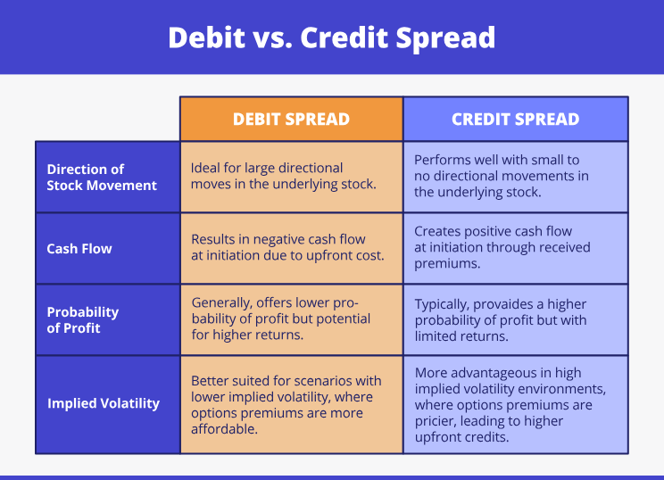

## Table of Contents

## What is a credit spread?

A credit spread is a type of options trading strategy where you buy and sell options at the same time to make money from the difference in their prices. It's called a "credit" spread because you get money, or a credit, when you set up the trade. You do this by selling an option that costs more and buying an option that costs less. The difference between what you get from selling and what you pay for buying is the credit you keep.

This strategy is often used when you think the price of the underlying asset, like a stock, won't move much. If the price stays within a certain range, you can keep the credit as profit. However, if the price moves a lot in the wrong direction, you could lose money. So, it's important to understand the risks and have a plan for managing them.

## What is a debit spread?

A debit spread is another options trading strategy where you pay money upfront to set up the trade. You do this by buying an option that costs more and selling an option that costs less. The difference between what you pay for the option you buy and what you get from the option you sell is the debit, or the cost of the trade.

This strategy is often used when you think the price of the underlying asset, like a stock, will move in a certain direction. If the price moves the way you expect, you can make money. The profit comes from the difference between the prices of the two options when you close the trade. However, if the price doesn't move as expected, you could lose the money you paid upfront. So, it's important to understand the risks and have a plan for managing them.

## How do credit and debit spreads differ in terms of initial cost?

Credit and debit spreads differ in their initial cost in a simple way. When you set up a credit spread, you get money right away. This happens because you sell an option that costs more and buy an option that costs less. The difference between what you get from selling and what you pay for buying is the credit you keep. It's like getting paid to start the trade.

On the other hand, when you set up a debit spread, you have to pay money upfront. This is because you buy an option that costs more and sell an option that costs less. The difference between what you pay for the option you buy and what you get from the option you sell is the debit, or the cost of the trade. It's like paying a fee to start the trade.

## What are the potential profit and loss scenarios for credit spreads?

When you use a credit spread, you get money upfront, which is the maximum profit you can make. This happens if the price of the underlying asset stays within a certain range until the options expire. For example, if you set up a credit spread and get $100, that's the most you can earn. If the price doesn't move much and stays where you want it to, you keep the whole $100 as profit when the options expire.

However, there's also a risk of losing money with a credit spread. The most you can lose is the difference between the strike prices of the options you bought and sold, minus the credit you received. If the price of the underlying asset moves a lot in the wrong direction, you could lose money. For example, if the difference between the strike prices is $500 and you got $100 upfront, the most you could lose is $400. It's important to watch the price and have a plan to manage the risk.

## What are the potential profit and loss scenarios for debit spreads?

When you use a debit spread, you pay money upfront, and that's the most you can lose. If the price of the underlying asset moves the way you expect it to by the time the options expire, you can make money. The profit comes from the difference between the prices of the two options when you close the trade. For example, if you paid $100 to set up the trade and the price moves in your favor, you might be able to sell the spread for more than $100, and the difference is your profit.

However, if the price doesn't move as you expected, you could lose the money you paid upfront. The most you can lose is the debit you paid to set up the trade. For example, if you paid $100 to start the trade and the price doesn't move in your favor, you could lose the entire $100. It's important to watch the price and have a plan to manage the risk.

## How do the risk profiles of credit and debit spreads compare?

Credit spreads and debit spreads have different risk profiles. With a credit spread, you get money upfront, which is the maximum profit you can make if things go well. But if the price of the stock moves a lot in the wrong direction, you could lose money. The most you can lose is the difference between the strike prices of the options you bought and sold, minus the money you got upfront. So, the risk is that the stock moves against you, but your loss is capped at a certain amount.

On the other hand, with a debit spread, you pay money upfront, and that's the most you can lose. If the price of the stock moves in the direction you expect, you can make money. The profit comes from selling the spread for more than you paid. But if the price doesn't move as you hoped, you could lose the money you paid upfront. So, the risk is that the stock doesn't move in your favor, and your loss is limited to what you paid to set up the trade.

Both strategies have their own risks and rewards. Credit spreads are good if you think the stock won't move much, while debit spreads are good if you think the stock will move in a certain direction. It's important to understand these risks and have a plan to manage them, no matter which strategy you choose.

## What are the key factors to consider when choosing between a credit and a debit spread?

When choosing between a credit and a debit spread, you need to think about what you believe the stock will do. If you think the stock won't move much and will stay in a certain range, a credit spread might be a good choice. This is because you get money upfront, and if the stock stays where you want it to, you keep that money as profit. But, if the stock moves a lot in the wrong direction, you could lose money. So, you need to be okay with the risk that the stock might move against you, but remember, your loss is capped at a certain amount.

On the other hand, if you think the stock will move in a certain direction, a debit spread could be better. With a debit spread, you pay money upfront, and if the stock moves the way you expect, you can make money. The profit comes from selling the spread for more than you paid. But, if the stock doesn't move as you hoped, you could lose the money you paid upfront. So, you need to be comfortable with the risk that the stock might not move in your favor, but your loss is limited to what you paid to set up the trade.

In the end, it's important to consider your view on the stock's future movement and your comfort with the potential risks and rewards. Both strategies have their own pros and cons, and understanding these can help you make a better choice. Always have a plan to manage the risks, no matter which strategy you pick.

## How do market conditions affect the choice between credit and debit spreads?

Market conditions can play a big role in deciding between credit and debit spreads. If the market is calm and not moving much, a credit spread might be a good choice. This is because you get money upfront, and if the stock stays in a certain range, you keep that money as profit. But, if the market suddenly starts moving a lot, a credit spread could be risky because you could lose money if the stock moves in the wrong direction. So, when the market is stable, a credit spread can be a smart move.

On the other hand, if you think the market will move in a certain direction, a debit spread might be better. With a debit spread, you pay money upfront, but if the stock moves the way you expect, you can make money. This strategy can be useful when you have a strong belief about where the market is headed. For example, if there's good news coming out that you think will make the stock go up, a debit spread could help you profit from that move. But, if the market doesn't move as you hoped, you could lose the money you paid upfront. So, understanding the market's direction and your comfort with the risks is key when choosing between these two strategies.

## What are the tax implications of trading credit versus debit spreads?

When you trade credit and debit spreads, you need to think about taxes. Both types of spreads are treated as options for tax purposes. If you hold the spreads for less than a year, any profit you make is taxed as short-term capital gains. This means you'll pay your regular income tax rate on the money you make. If you hold the spreads for more than a year, the profit is taxed as long-term capital gains, which usually have a lower tax rate. So, how long you hold your spreads can make a big difference in how much tax you pay.

The money you get or pay upfront for credit and debit spreads also matters for taxes. With a credit spread, you get money upfront, but you might have to pay taxes on that money right away, even if you haven't closed the trade yet. With a debit spread, you pay money upfront, so you can't take a tax deduction for that until you close the trade and see if you made a profit or a loss. Keeping good records and understanding how these rules apply to your trades can help you manage your taxes better.

## How can advanced traders use credit and debit spreads in combination with other strategies?

Advanced traders can use credit and debit spreads together with other strategies to make their trades even better. For example, they might use a credit spread to make money from a stock that they think won't move much, and at the same time, they could use a debit spread on another stock that they think will go up or down. By doing this, they can take advantage of different market conditions and make money in more ways. They might also use other options strategies like straddles or strangles to bet on big moves in the market, while using spreads to manage their risks.

Another way advanced traders can use spreads is to create what's called an "iron condor." This is a strategy where you set up both a credit spread and a debit spread at the same time, betting that the stock will stay in a certain range. If the stock stays where you want it to, you can make money from both spreads. This can be a good way to make money in a calm market. But, if the stock moves a lot, you could lose money, so it's important to watch the market and be ready to adjust your trades. By combining spreads with other strategies, advanced traders can create more complex trades that fit their goals and manage their risks better.

## What are the common mistakes beginners make when trading credit and debit spreads?

One common mistake beginners make when trading credit and debit spreads is not understanding the risks. They might think that because their loss is capped, they can't lose much money. But, even though the loss is limited, it can still be a lot if the stock moves the wrong way. Beginners also might not have a plan for what to do if the trade goes against them. It's important to know when to cut your losses and get out of a trade that's not working.

Another mistake is not paying attention to how much time is left until the options expire. Beginners might set up a trade and then forget about it, only to find out that they lost money because they didn't adjust the trade as the expiration date got closer. It's important to keep an eye on your trades and be ready to make changes if the market moves or if time is running out. Also, beginners sometimes don't think about the costs of trading, like commissions and fees. These can add up and eat into your profits, so it's important to keep them in mind when you're planning your trades.

## How do professional traders optimize their use of credit and debit spreads in different market environments?

Professional traders use credit and debit spreads in smart ways depending on what the market is doing. If the market is calm and not moving much, they might use credit spreads a lot. They know that if the stock stays in a certain range, they can keep the money they got upfront as profit. But they also watch the market closely and are ready to adjust their trades if the market starts moving. They might use stop-loss orders or other ways to cut their losses if things go wrong. By doing this, they can make money in a stable market while keeping their risks under control.

On the other hand, if the market is moving a lot, professional traders might use debit spreads more. They look for stocks that they think will go up or down and use debit spreads to bet on those moves. If they're right, they can make money from the difference between the prices of the options they bought and sold. But they also know that the market can be unpredictable, so they have plans to manage their risks. They might set up different trades to balance out their risks or use other options strategies to make the most of big market moves. By understanding the market and being ready to adjust, they can use debit spreads to their advantage.

## References & Further Reading

[1]: Bergstra, J., Bardenet, R., Bengio, Y., & Kégl, B. (2011). ["Algorithms for Hyper-Parameter Optimization."](https://dl.acm.org/doi/10.5555/2986459.2986743) Advances in Neural Information Processing Systems 24.

[2]: ["Advances in Financial Machine Learning"](https://www.amazon.com/Advances-Financial-Machine-Learning-Marcos/dp/1119482089) by Marcos Lopez de Prado

[3]: ["Evidence-Based Technical Analysis: Applying the Scientific Method and Statistical Inference to Trading Signals"](https://www.amazon.com/Evidence-Based-Technical-Analysis-Scientific-Statistical/dp/0470008741) by David Aronson

[4]: ["Machine Learning for Algorithmic Trading"](https://github.com/stefan-jansen/machine-learning-for-trading) by Stefan Jansen

[5]: ["Quantitative Trading: How to Build Your Own Algorithmic Trading Business"](https://github.com/LucindaYa/quant-resources/blob/master/Quantitative%20Trading%20How%20to%20Build%20Your%20Own%20Algorithmic%20Trading%20Business.pdf) by Ernest P. Chan