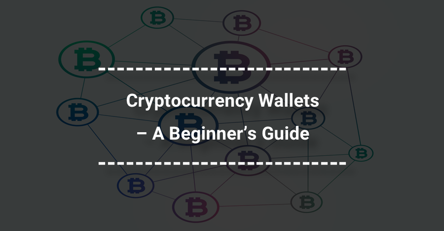

As the world of cryptocurrency continues to evolve, finding the right crypto wallet is crucial for managing digital assets. In 2024, the landscape of crypto wallets is rapidly expanding with a variety of options catering to different user needs. Cryptocurrency wallets are essential tools for investors, acting as gateways to store, send, and receive digital currencies securely. These wallets come in multiple forms, including hardware, software, mobile, and web solutions, each addressing user preferences in terms of security and convenience.

With the fast-paced development in the crypto industry, it is important to identify wallets that excel in security, usability, and innovative features to safeguard assets against potential risks such as hacking and theft. This article highlights some of the best cryptocurrency wallets available to investors and traders, focusing on key attributes that ensure a seamless crypto management experience.



Moreover, the article explores how algorithmic trading is enhancing the crypto trading experience. Algorithmic trading, which employs computer algorithms to execute trades at high speeds, is gaining traction in the crypto space. It streamlines trading operations by analyzing vast amounts of data to improve efficiency and accuracy. As more traders implement algorithmic strategies, both beginners and seasoned investors can potentially capitalize on market movements more effectively. Understanding these sophisticated trading methods, alongside selecting the right wallet, is integral for optimizing one's approach to cryptocurrency trading in 2024.

## Table of Contents

## Understanding Cryptocurrency Wallets

Cryptocurrency wallets are essential tools for the secure storage and management of digital assets. These wallets can be broadly categorized into four types: hardware, software, mobile, and web wallets. Each type offers distinct features and security measures, catering to different user preferences and needs.

Hardware wallets are physical devices that store private keys offline, making them one of the most secure options available. By keeping private keys isolated from the internet, hardware wallets minimize the risk of online hacking and malware attacks. Popular hardware wallets like Ledger Nano S and Trezor are well-regarded for their robust security protocols and support for a wide range of cryptocurrencies.

Software wallets are applications installed on a computer or mobile device. They offer ease of use and accessibility, making them a popular choice for many cryptocurrency users. However, they are more vulnerable to cyber threats compared to hardware wallets since they are connected to the internet. Despite this, many software wallets implement strong encryption and security features to safeguard user funds. Examples of software wallets include Exodus and Electrum.

Mobile wallets are a subtype of software wallets designed specifically for smartphones. They provide convenient access to digital assets on the go, enabling users to conduct transactions wherever they are. Mobile wallets often include features like QR code scanning for easy payments. Nonetheless, the security of mobile wallets largely depends on the security of the mobile device itself. Mycelium is a well-known mobile wallet that offers advanced security features for Bitcoin and Ethereum holders.

Web wallets are hosted on cloud servers, allowing users to access their digital assets through a web browser. They are highly accessible and user-friendly, appealing to beginners and those who prefer not to manage wallet software themselves. However, as web wallets store private keys online, they present a higher risk of cyber attacks. Users need to rely on the security policies and practices of the wallet service provider. Coinbase Wallet is an example of a web wallet that offers a low-cost solution with extensive support for various digital currencies.

Choosing the right [cryptocurrency](/wiki/cryptocurrency) wallet requires careful consideration of several factors. Ease of use is paramount for individuals who may not have extensive experience with digital assets. Supported cryptocurrencies vary significantly among wallets, and users should ensure their chosen wallet supports the assets they hold or plan to acquire. Security features are crucial, as secure storage of private keys is fundamental to protecting one's investments.

In summary, the selection of a cryptocurrency wallet involves balancing convenience, security, and functionality. Whether opting for the high security of a hardware wallet, the accessibility of a software or mobile wallet, or the convenience of a web wallet, users must assess their specific needs and risk tolerance to find a suitable option.

## Best Crypto Wallets for 2024

In 2024, the expanding cryptocurrency landscape necessitates reliable wallets for secure digital asset management. Here are some of the top crypto wallets that have gained recognition for their reliability and advanced features:

1. **Guarda Wallet**  
   Guarda Wallet is renowned for its robust security measures and extensive cryptocurrency support. It accommodates over 400,000 digital currencies, offering versatility for users with diverse portfolios. This wallet emphasizes privacy by providing a non-custodial service, ensuring users have full control over their private keys. Guarda also supports various blockchain networks, making it a popular choice for those who require comprehensive coverage of their digital assets.

2. **Exodus Wallet**  
   Exodus Wallet stands out for its intuitive user interface, making it ideal for beginners venturing into cryptocurrency. This wallet provides comprehensive support across multiple cryptocurrencies, allowing users to easily manage their assets. Its built-in exchange feature enables seamless trading between supported coins directly within the wallet, enhancing user convenience. Exodus emphasizes security by offering a non-custodial experience, ensuring users hold their own private keys.

3. **Electrum**  
   Electrum is widely regarded as one of the best wallets for Bitcoin enthusiasts. Its lightweight nature ensures fast synchronization times, providing a smooth user experience. Electrum is respected for its robust security features, such as two-[factor](/wiki/factor-investing) authentication and multi-signature support. It is designed with a focus on Bitcoin, offering advanced functionalities like hardware wallet integration, making it a preferred option for Bitcoin purists.

4. **Mycelium**  
   Mycelium is a mobile-first wallet that caters to both Bitcoin and Ethereum holders with advanced features. It offers a range of tools for experienced users, such as local trader options and integration with hardware wallets for enhanced security. Mycelium prioritizes user privacy and offers a hierarchical deterministic (HD) wallet structure, which generates a new address for each transaction to maintain anonymity.

5. **Coinbase Wallet**  
   Coinbase Wallet is known for being a low-cost solution with comprehensive support for various digital currencies. It is particularly appealing for users already integrated within the Coinbase ecosystem due to its seamless connectivity with the exchange platform. This wallet supports decentralized applications (dApps) and provides a user-friendly interface, making it suitable for users new to decentralized finance (DeFi). Coinbase Wallet also offers a non-custodial option, allowing users to maintain control of their private keys.

Choosing a cryptocurrency wallet in 2024 involves evaluating factors such as security, ease of use, and the range of supported cryptocurrencies. Each of these wallets offers unique strengths, ensuring users can find an option tailored to their needs and preferences.

## How to Choose the Right Crypto Wallet

Selecting the right cryptocurrency wallet requires careful consideration of multiple factors, primarily centered around frequency of use, security requirements, and desired level of autonomy. When determining the frequency of use, consider whether the wallet will facilitate daily transactions or primarily serve as a storage solution for long-term holdings. For frequent transactions, a mobile or web wallet might offer the necessary convenience and speed, whereas hardware wallets are often preferred for securing long-term investments due to their offline nature and enhanced security measures.

Security is paramount in the selection process. Evaluate the wallet's security features, including two-factor authentication, multi-signature capabilities, and encryption protocols. Given the persistent threat of cyberattacks, prioritize wallets that offer robust security measures to safeguard against unauthorized access and potential breaches.

Additionally, the choice between custodial and non-custodial wallets is critical. Custodial wallets hold users' private keys, offering ease of use and a higher level of built-in customer support but at the cost of reduced autonomy. Conversely, non-custodial wallets grant users full control over their private keys, aligning with the decentralized ethos of cryptocurrencies but requiring users to manage their own security protocols effectively.

Ultimately, the decision hinges on balancing ease of use with security. For those who value convenience and are less technically inclined, a custodial wallet with excellent customer support might be preferable. However, individuals prioritizing security and control may opt for a non-custodial wallet, fully managing their private keys and related security measures. By carefully weighing these factors, users can select a wallet that aligns with their specific needs and risk tolerance in managing digital assets.

## The Rise of Algorithmic Trading in Crypto

Algorithmic trading has emerged as a transformative force in cryptocurrency markets, revolutionizing the way trades are executed and assets are managed. Utilizing computer algorithms, this approach automates the trading process, enabling the execution of orders at a speed and efficiency unattainable by human traders. The foundation of [algorithmic trading](/wiki/algorithmic-trading) lies in its ability to process vast amounts of data rapidly, responding to market changes in real-time. This capability is paramount in cryptocurrency markets, which are renowned for their [volatility](/wiki/volatility-trading-strategies) and 24/7 operation.

At its core, algorithmic trading relies on predefined instructions and advanced mathematical models to determine trade signals and execution strategies. These algorithms can consider a wide array of factors, including price, [volume](/wiki/volume-trading-strategy), timing, and other market conditions, to make informed trading decisions. The primary advantage is the elimination of emotional biases, a common issue with manual trading, leading to more consistent and objective trade execution.

Python, a popular programming language in data science and finance, is frequently used to develop trading algorithms due to its rich libraries and frameworks. Here is a basic example of how one might use Python to implement a simple moving average crossover strategy, a common type of trading algorithm:

```python
import pandas as pd
import numpy as np

# Sample market data
data = pd.read_csv('market_data.csv')  # Replace with your market data
short_window = 40
long_window = 100

# Calculate moving averages
data['Short_MA'] = data['Close'].rolling(window=short_window, min_periods=1).mean()
data['Long_MA'] = data['Close'].rolling(window=long_window, min_periods=1).mean()

# Generate signals
data['Signal'] = 0
data['Signal'][short_window:] = np.where(data['Short_MA'][short_window:] > data['Long_MA'][short_window:], 1, 0)

# Generate trading orders
data['Position'] = data['Signal'].diff()

# Display signals
print(data[['Close', 'Short_MA', 'Long_MA', 'Signal', 'Position']])
```

In recent years, traders are increasingly adopting algorithmic strategies to capitalize on market volatility. Crypto markets are inherently volatile, with prices often experiencing large swings within short periods. Algorithmic trading provides the agility necessary to respond to these rapid changes, executing trades with precision based on pre-set criteria. This precision enhances trading efficiency and can lead to improved execution quality, minimizing slippage and optimizing the entry and [exit](/wiki/exit-strategy) points of trades.

The adoption of algorithmic trading is further driven by the growing availability of data and the advancement of computational power. As more traders and institutions enter the crypto space, the use of algorithmic strategies is likely to increase, enabling market participants to manage risk more effectively and exploit opportunities that arise from fragmented markets and [liquidity](/wiki/liquidity-risk-premium).

Overall, the rise of algorithmic trading in crypto represents a significant shift toward more automated and data-driven trading approaches, offering a competitive edge in an increasingly complex and fast-paced market environment.

## Integrating Wallets with Algo Trading

Integrating cryptocurrency wallets with algorithmic trading platforms significantly enhances the trading experience by facilitating automated and strategic execution of trades directly from the wallet. This approach leverages the agility and processing power of algorithmic systems to capitalize on market movements, allowing traders to execute trades with precision and optimal timing.

At the core of this integration lies the ability to seamlessly connect a crypto wallet, where digital assets are stored, with a trading algorithm that operates on a set of predefined rules. This setup enables traders to deploy complex strategies without the need for constant manual intervention. For instance, a Python-based trading algorithm can be deployed to track the market and execute trades based on specific technical indicators or market conditions. Here is an illustrative example of a simple algorithmic trading strategy:

```python
from binance.client import Client
import talib
import numpy as np

# Initialize Binance client
client = Client(api_key='your_api_key', api_secret='your_api_secret')

# Fetch historical data
klines = client.get_historical_klines("BTCUSDT", Client.KLINE_INTERVAL_1HOUR, "1 day ago UTC")

# Convert to numpy array and compute indicators
closes = np.array([float(kline[4]) for kline in klines])
rsi = talib.RSI(closes, timeperiod=14)

# Define buy/sell strategy based on RSI
def strategy():
    current_price = closes[-1]
    last_rsi = rsi[-1]

    if last_rsi < 30:
        print(f"Buy signal at price {current_price}")
    elif last_rsi > 70:
        print(f"Sell signal at price {current_price}")

strategy()
```

The integration of wallets with algorithmic trading platforms ensures that when a trading signal is triggered, the transaction is executed directly from the wallet, minimizing delays and slippage. This capability is particularly advantageous in highly volatile markets where speed is critical to take advantage of rapid price swings.

As technology advances, more cryptocurrency wallets are incorporating features that support direct integration with trading platforms. This trend is expected to proliferate, providing traders with a streamlined process for managing digital assets. Enhanced security measures are also being implemented to ensure that these automated transactions remain secure and that user funds are protected from unauthorized access.

Ultimately, this integration empowers traders by enhancing efficiency and providing the tools required to manage trades effectively, thus optimizing their trading strategies and protecting their investments in the ever-evolving cryptocurrency landscape.

## Conclusion

Choosing the right cryptocurrency wallet is crucial for securing and managing digital assets in 2024. As the landscape of digital currencies continues to evolve, a well-selected wallet provides not only security but also flexibility in managing and trading cryptocurrencies. With advancements in technology, particularly the integration of algorithmic trading capabilities within these wallets, the dynamics of crypto investing are being transformed.

Algorithmic trading introduces a level of precision and efficiency that was previously unattainable through manual trading methods. By connecting wallets directly to algorithmic trading platforms, investors can automate complex trading strategies, execute trades based on predetermined criteria, and respond swiftly to market fluctuations. This integration empowers traders to optimize their activities, potentially increasing returns while simultaneously minimizing risk.

For instance, an investor might employ a simple Python script to exploit the [arbitrage](/wiki/arbitrage) opportunities between currency pairs. Such a script would monitor real-time price feeds and automatically execute trades when a profitable price difference is identified across exchanges. This can be implemented with only a few lines of code:

```python
def check_arbitrage_opportunity(wallet):
    exchange1_price = wallet.get_price('BTC', 'Exchange1')
    exchange2_price = wallet.get_price('BTC', 'Exchange2')

    if exchange1_price < exchange2_price:
        wallet.trade('buy', 'BTC', exchange1_price, 'Exchange1')
        wallet.trade('sell', 'BTC', exchange2_price, 'Exchange2')
    elif exchange2_price < exchange1_price:
        wallet.trade('buy', 'BTC', exchange2_price, 'Exchange2')
        wallet.trade('sell', 'BTC', exchange1_price, 'Exchange1')

# Execute the function every minute.
import time
while True:
    check_arbitrage_opportunity(user_wallet)
    time.sleep(60)
```

Investors leveraging the dual benefits of a secure cryptocurrency wallet and sophisticated trading algorithms are better positioned to navigate the volatile crypto markets. The enhanced security features of modern wallets also ensure that holdings are protected against cyber threats, thereby safeguarding the investor's assets.

In summary, the synergy between cryptocurrency wallets and algorithmic trading opens new opportunities for investors in 2024. An informed selection of wallets and the deployment of robust trading strategies not only secure digital assets but also unlock the potential for optimized trading performance. As the technology progresses, staying ahead in the crypto investment landscape demands both innovation and vigilance.

## References & Further Reading

[1]: Nakamoto, S. (2008). ["Bitcoin: A Peer-to-Peer Electronic Cash System."](https://nakamotoinstitute.org/library/bitcoin/)

[2]: Antonopoulos, A. M. (2017). ["Mastering Bitcoin: Unlocking Digital Cryptocurrencies."](https://books.google.com/books/about/Mastering_Bitcoin.html?id=IXmrBQAAQBAJ) O'Reilly Media.

[3]: Ledger. (n.d.). ["Hardware Wallets."](https://shop.ledger.com/pages/hardware-wallet)

[4]: Metzger, M. (2020). ["Algorithmic Trading in Crypto Market: Advantages and Challenges."](https://journals.sagepub.com/doi/full/10.1177/17456916231185057) Investopedia.

[5]: Campesato, O. (2020). ["Artificial Intelligence, Machine Learning, and Deep Learning."](https://www.degruyter.com/document/doi/10.1515/9781683924654/html?lang=en) Mercury Learning and Information.

[6]: Trezor. (n.d.). ["Trezor Hardware Wallet (Official) | The original and most secure hardware wallet."](https://trezor.io/)

[7]: Acheson, N. (2019). ["The Basics of Bitcoins and Blockchains: An Introduction to Cryptocurrencies and the Technology that Powers Them."](https://www.amazon.com/Basics-Bitcoins-Blockchains-Introduction-Cryptocurrencies/dp/1633538001) Mango Publishing.