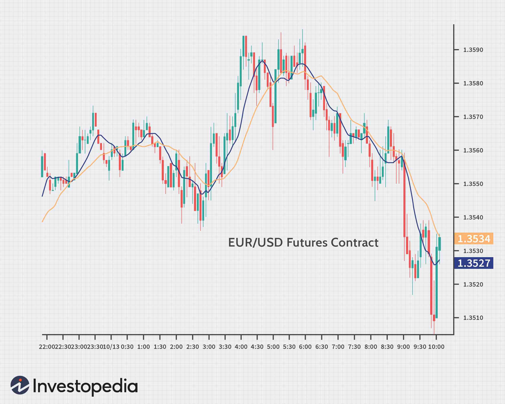

In this article, we aim to explore three significant aspects of foreign exchange transactions: currency futures, spot forex, and algorithmic trading. The foreign exchange market, commonly known as forex, is the largest financial market globally, with a daily trading volume exceeding $6 trillion, as reported by the Bank for International Settlements in 2019. This market is characterized by a wide range of trading instruments that cater to the diverse needs of traders, from individuals to large financial institutions.

One of the key considerations for traders is understanding the differences between currency futures and spot forex. Currency futures are standardized contracts traded on centralized exchanges, obligating the exchange of a specific currency amount at a future date and price. In contrast, spot forex involves the immediate exchange of currencies at the current market rate, offering a decentralized trading environment. Knowing these differences can assist traders in selecting the appropriate trading approach based on their risk preferences and strategic goals.



Moreover, the integration of algorithmic trading into the forex market has transformed how trades are executed. Algorithmic trading uses computer programs to make trading decisions and execute orders, thus enhancing efficiency and execution speed. This technological advancement has significantly changed the trading landscape, allowing for more precise risk management and operational efficiency.

This article aims to provide comprehensive insights into these facets of foreign exchange transactions, enabling traders to make informed decisions. We will examine the nuances and benefits of each trading method alongside adopting algorithmic strategies, which offers a sophisticated approach to navigating the complex forex market. By understanding these aspects, traders can better align their strategies with the constantly evolving market conditions.

## Table of Contents

## Understanding Currency Futures

Currency futures are standardized contracts that obligate parties to exchange a specific quantity of one currency for another at an agreed-upon price on a predetermined future date. These derivatives are instrumental in the financial markets as they allow traders and institutions to hedge against potential adverse movements in currency exchange rates. Such contracts help mitigate risks associated with currency fluctuations, thus serving as a crucial tool for risk management.

Currency futures are predominantly traded on centralized exchanges such as the Chicago Mercantile Exchange (CME), which provides a regulated and transparent trading environment. The centralization of these markets ensures consistent monitoring and reduces counterparty risks, offering traders a layer of security that is not always present in over-the-counter (OTC) markets. Consequently, currency futures are often favored by institutional investors and large-scale traders who value the price stability offered by these regulated platforms.

One of the core characteristics of currency futures is their standardized nature. Each contract specifies the exact amount of a currency to be exchanged, the currency's base price, and a fixed expiration date. Standardized contract sizes facilitate ease of transaction and valuation, enabling traders to strategize with precision. For example, the Euro [FX](/wiki/fx-anomaly) futures contract on the CME specifies a standard size of 125,000 euros per contract, allowing substantial exposure management to currency movements.

The inherent leverage in futures contracts, whereby a trader can control a large amount of currency with a relatively small initial margin, amplifies both potential profits and risks. This leverage is attractive to traders who seek to maximize their returns, though it necessitates a robust risk management strategy to prevent significant losses.

In summary, currency futures provide a structured and regulated avenue for managing currency risk, with standardized contracts contributing to their appeal amongst institutional entities. The transparency, centralized trading venues, and potential for price stability make currency futures a compelling instrument for those involved in foreign exchange trading.

## Exploring Spot Forex

Spot [forex](/wiki/forex-system) refers to the trading of currency pairs at their current market prices, with transactions commonly settling within two business days. This market is characterized by its decentralized nature, which contributes to its high [liquidity](/wiki/liquidity-risk-premium) and broad accessibility. It facilitates participation from a diverse range of traders, from individual retail traders to large institutional investors.

One of the notable attributes of the spot forex market is its liquidity. The decentralized structure ensures that there are typically many buyers and sellers available at any given time, enabling trades to be executed quickly and efficiently. As a result, traders benefit from tighter spreads—the difference between the bid and ask price—which enhances the cost-effectiveness of trades.

Flexibility is another key feature of spot forex trading. Unlike other markets, spot forex does not have set contract sizes, offering traders the ability to specify the size of their trades according to their individual needs and risk management strategies. This is particularly appealing to retail traders who may not want to commit to large contract sizes, as well as to institutions that need to tailor their trading volumes to meet specific strategic goals.

The spot forex market is also highly sensitive to real-time economic events and news. Factors such as [interest rate](/wiki/interest-rate-trading-strategies) changes, economic reports, geopolitical developments, and other macroeconomic indicators can significantly influence currency values, often causing rapid price movements. Traders in the spot forex market, therefore, need to remain informed and capable of reacting quickly to such events.

Operating 24 hours a day, the spot forex market spans various time zones, beginning in Asia and continuing through Europe and North America. This around-the-clock trading capability provides continuous opportunities for trading, allowing participants to respond instantly to market movements triggered by economic reports or unexpected news releases from any part of the world.

In summary, spot forex is distinguished by its liquidity, flexibility, and susceptibility to real-time financial developments. These characteristics make it an attractive option for traders seeking immediate execution and the ability to capitalize on short-term price movements in the global currency markets.

## Key Differences Between Currency Futures and Spot Forex

Currency futures and spot forex represent two distinct mechanisms for exchanging currencies, each with unique features that cater to different trading objectives. A primary distinction lies in the timing of transaction execution. Currency futures are agreements to exchange currencies at a predetermined future date, while spot forex involves immediate currency exchanges, typically settling within two business days. This intrinsic difference introduces varying strategies for traders, depending on their time horizon for holding a position.

Currency futures are traded on regulated exchanges such as the Chicago Mercantile Exchange (CME). This centralization offers a level of transparency and regulation that can be reassuring to traders, particularly institutional investors. In contrast, spot forex transactions occur over-the-counter (OTC) in a decentralized market, which, while offering greater accessibility and liquidity, lacks the same level of regulation. As a result, the regulatory environment for spot forex can vary significantly between jurisdictions.

Another substantial difference pertains to contract specifications. Currency futures have standardized contract sizes and specifications, which can make them more suitable for large-scale traders and institutions. In contrast, spot forex offers more flexibility in trade volumes. Traders can exchange varying amounts of currency, making it more accessible to retail investors and those seeking to trade smaller quantities.

The choice between engaging in futures or spot forex transactions is influenced by several factors, including an individual's risk tolerance, available capital, and overarching trading strategy. Futures might appeal to those seeking protection against currency [volatility](/wiki/volatility-trading-strategies) over the long-term, often using the contracts for hedging purposes. Conversely, spot forex might attract traders looking for the ability to react swiftly to short-term market movements, capitalizing on the high liquidity and round-the-clock trading opportunities that the decentralized market affords.

In conclusion, the selection between currency futures and spot forex is largely dictated by a trader's specific needs and objectives. Both avenues offer unique advantages and cater to distinct market participants.

## Role of Algorithmic Trading

Algorithmic trading employs sophisticated computer programs to execute trades based on specific, pre-defined rules. This approach enhances trading efficiency by significantly reducing execution time and minimizing the likelihood of human error. In the high-[volume](/wiki/volume-trading-strategy) and rapidly changing forex market, [algorithmic trading](/wiki/algorithmic-trading) systems (often called algos) enable automated decision-making, allowing for rapid execution of trades that would be challenging for manual traders to replicate.

These algorithms can process vast amounts of financial data at high speed, identifying profitable trading opportunities by analyzing patterns and trends that might be obscure or invisible to the human eye. Traders employ various strategies, such as moving averages, [arbitrage](/wiki/arbitrage), and mean reversion, which are incorporated into algorithms to systematically identify and capitalize on potential gains. Python, with its extensive libraries and frameworks such as NumPy for numerical computations and pandas for data analysis, is frequently used in developing these sophisticated trading algorithms. Here is a simple example of an algorithmic trading strategy in Python using a moving average crossover:

```python
import pandas as pd
import numpy as np

# Sample market data for illustration
market_data = pd.DataFrame({
    'Close': [101.0, 102.2, 103.5, 104.0, 103.3, 104.5, 106.0]  # Closing prices of a currency pair
})

# Calculating moving averages
market_data['Short_MA'] = market_data['Close'].rolling(window=2).mean()
market_data['Long_MA'] = market_data['Close'].rolling(window=3).mean()

# Trading logic based on moving average crossover
market_data['Signal'] = np.where(market_data['Short_MA'] > market_data['Long_MA'], 1, 0)
market_data['Position'] = market_data['Signal'].diff()

print(market_data)
```

Moreover, algorithmic trading supports high-frequency trading, which includes executing large numbers of orders at extremely fast speeds. This method allows traders to accumulate profits from small price discrepancies. 

Backtesting, another crucial aspect of algorithmic trading, involves testing a trading algorithm against historical market data to ascertain its viability. It allows for the refinement of algorithms before they are deployed in real trading scenarios, minimizing risk and enhancing potential profitability.

Despite its advantages, algorithmic trading is not without challenges. The reliance on technology introduces potential risks, such as system malfunctions or coding errors, which may lead to unintended trading outcomes. Additionally, the initial investment in computing infrastructure and the ongoing need for technical maintenance can be substantial. In response, regulatory bodies have imposed scrutiny on algorithmic trading practices to prevent unfair market manipulation and ensure a level playing field. 

Overall, as the forex market continues to evolve, algorithmic trading stands as an essential tool for traders looking to enhance their trading strategies through technology.

## Advantages and Disadvantages of Algo Trading in Forex Markets

Algorithmic trading in forex markets offers several compelling advantages, making it a preferred choice for many traders. One of the primary benefits is the capacity to execute trades at optimal prices, providing a safeguard against adverse market conditions. This advantage is primarily due to the ability of algorithms to operate at a speed and efficiency unmatched by human traders. Algorithms can quickly analyze large sets of data, identify trading signals, and execute orders in milliseconds, capitalizing on fleeting opportunities that might be missed by manual trading. 

The ability to manage vast quantities of data allows for more comprehensive market analysis and informed decision-making. For example, algorithms can process and respond to real-time news events, economic data releases, and market trends, enabling traders to swiftly adjust their positions. This feature is particularly advantageous in the forex market, known for its high volatility and fast-paced environment. Python, with its extensive libraries like Pandas for data analysis and NumPy for efficient numerical computation, provides a robust platform for developing and testing trading algorithms.

```python
import pandas as pd
import numpy as np

# Example: Calculating moving averages to identify potential trade signals
data = pd.read_csv('forex_data.csv')
short_window = 40
long_window = 100

signals = pd.DataFrame(index=data.index)
signals['signal'] = 0.0

# Calculate the short and long moving averages
signals['short_mavg'] = data['close'].rolling(window=short_window, min_periods=1).mean()
signals['long_mavg'] = data['close'].rolling(window=long_window, min_periods=1).mean()

# Generate signals: 1 for buy, 0 for hold/sell
signals['signal'][short_window:] = np.where(signals['short_mavg'][short_window:] > signals['long_mavg'][short_window:], 1.0, 0.0)

# Create a DataFrame with the positions
signals['positions'] = signals['signal'].diff()
```

Despite these advantages, algorithmic trading is not without its challenges. Reliance on technology means that traders encounter risks such as system malfunctions or connectivity issues, which can lead to significant losses. Additionally, the initial setup for an algorithmic trading system requires substantial investment in both infrastructure and expertise. Adequate risk management and robust testing are essential to mitigate these potential drawbacks.

Furthermore, regulatory scrutiny is increasing as authorities strive to prevent market manipulation and maintain market fairness. In many jurisdictions, algorithmic traders must adhere to specific rules and regulations designed to ensure transparency and stability in financial markets. Compliance with these regulations is vital, as non-compliance can result in hefty fines and other penalties.

In conclusion, while algorithmic trading offers significant opportunities for increased efficiency and execution precision, traders must be mindful of the associated risks and regulatory requirements. Proper understanding and cautious implementation of algorithms can lead to substantial benefits in the dynamic forex markets.

## Conclusion

Navigating the forex market necessitates a comprehensive understanding of currency futures, spot forex, and algorithmic trading. Each instrument presents distinct advantages and challenges that cater to various trading objectives and market conditions. Currency futures offer standardized contracts and reduced counterparty risk due to centralized exchange trading, making them appealing for those seeking regulated environments and price certainty. Conversely, spot forex provides flexibility in trade volumes and the benefit of 24-hour market access, which can be advantageous for traders who require liquidity and real-time response to economic events.

Algorithmic trading presents an advanced methodology to forex trading, leveraging computational efficiency for rapid trade execution and data analysis. However, successful implementation requires a solid grasp of both the algorithms themselves and the forex market dynamics they operate within. Traders must be cautious of potential technical malfunctions and ensure compliance with regulatory frameworks designed to mitigate the risk of market manipulation.

The ever-evolving landscape of technology in financial markets suggests that continual learning and adaptation are vital for enhancing trading outcomes and improving risk management strategies. Staying abreast of technological innovations and regulatory developments can empower traders to harness the full potential of these trading instruments while safeguarding against associated risks.

## References & Further Reading

[1]: Bank for International Settlements. (2019). ["Triennial Central Bank Survey of Foreign Exchange and Over-the-counter (OTC) Derivatives Markets in 2019."](https://www.bis.org/statistics/rpfx19.htm)

[2]: Hull, J. C. (2017). ["Options, Futures, and Other Derivatives"](https://books.google.com/books/about/Options_Futures_and_Other_Derivatives_eB.html?id=2iopDwAAQBAJ) (10th Edition). Pearson.

[3]: Katz, J. O., & McCormick, D. L. (2000). ["The Encyclopedia of Trading Strategies"](https://www.amazon.com/Encyclopedia-Trading-Strategies-Jeffrey-Ph-D/dp/0070580995) McGraw-Hill.

[4]: ["Trading and Exchanges: Market Microstructure for Practitioners"](https://www.amazon.com/Trading-Exchanges-Market-Microstructure-Practitioners/dp/0195144708) by Larry Harris

[5]: Aldridge, I. (2013). ["High-Frequency Trading: A Practical Guide to Algorithmic Strategies and Trading Systems"](https://books.google.com/books/about/High_Frequency_Trading.html?id=8QpIsVUMhmEC) (2nd Edition). Wiley.