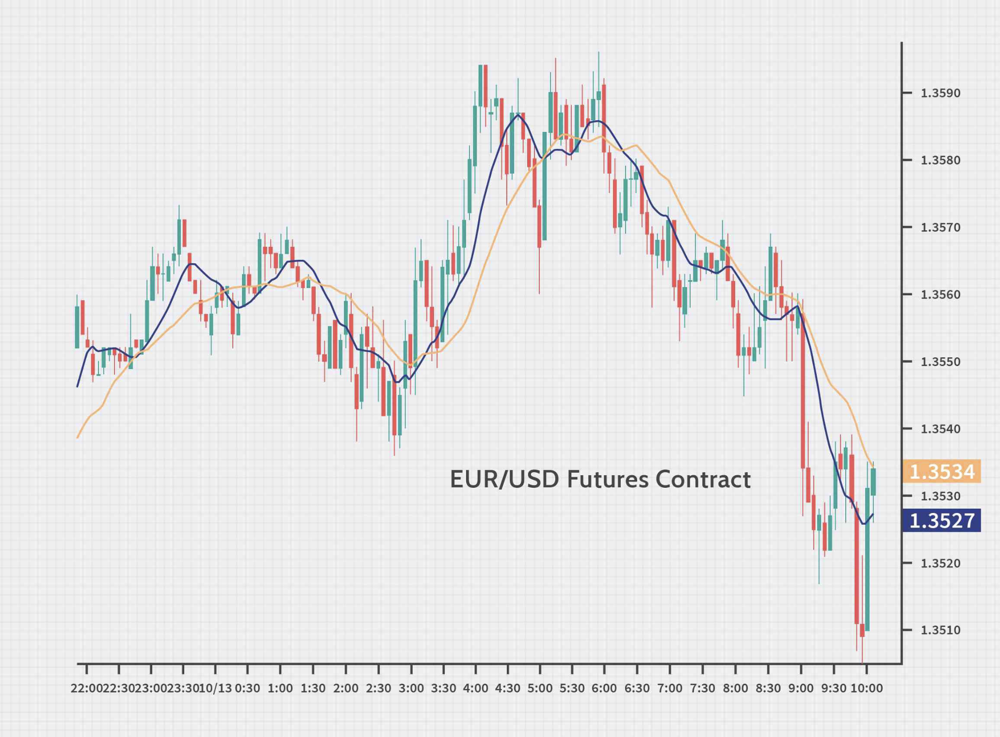

## Table of Contents

## What are currency futures and how do they differ from spot forex?

Currency futures are contracts that let you buy or sell a specific amount of a currency at a set price on a future date. They are traded on exchanges, like the Chicago Mercantile Exchange. People use currency futures to protect against changes in currency values or to bet on how currencies will move. For example, if you think the value of the Euro will go up compared to the US Dollar, you can buy a Euro futures contract. If the Euro does go up, you can make money.

Spot forex, on the other hand, is the buying and selling of currencies for immediate delivery. When you trade spot forex, the exchange happens right away, usually within two business days. This is different from currency futures, where the exchange happens in the future. Spot forex is traded over-the-counter, meaning it happens directly between two parties, often through banks or brokers. It's used a lot by businesses that need to convert money quickly or by traders looking to make short-term profits from small changes in currency values.

## How does the trading process work for currency futures versus spot forex?

When you trade currency futures, you do it on an organized exchange. You agree to buy or sell a certain amount of a currency at a set price on a specific future date. To start, you need to put down a small amount of money, called margin, which is like a deposit. If the price moves against you, you might need to add more money to your account, a process known as a margin call. Trading happens during specific hours when the exchange is open, and the contract details are standardized, so everyone knows exactly what they're trading. At the end of the contract, you either take delivery of the currency or settle the difference in cash.

Spot [forex](/wiki/forex-system) trading is different because it happens directly between two parties, usually through a broker or bank, and it's not on an exchange. When you trade spot forex, you're buying or selling currencies right away, with the transaction usually completing within two business days. You don't need a margin in the same way as futures, but you might use leverage, which lets you control a large amount of currency with a smaller amount of money. Spot forex markets are open 24 hours a day during the business week, so you can trade whenever you want. The prices can change quickly, and you can close your position at any time before the settlement date.

## What are the key advantages of trading currency futures over spot forex?

Trading currency futures has some clear benefits compared to spot forex. One big advantage is that futures are traded on an organized exchange, which makes everything more clear and safe. You know exactly what you're getting because the contract details are the same for everyone. This can make things easier and less risky. Also, with futures, you can use margin, which means you only need to put down a small amount of money to start trading. This can help you manage your money better and maybe even make bigger profits.

Another advantage is that currency futures can help you plan for the future. Because you're agreeing to buy or sell at a certain price on a certain date, you can protect yourself from sudden changes in currency values. This is really helpful if you're a business that needs to know what your costs will be in the future. Plus, the rules about margin calls in futures trading can help you keep better control over your risks, making sure you don't lose more money than you can handle.

## What are the main disadvantages of currency futures compared to spot forex?

One downside of currency futures is that they are not as flexible as spot forex. With futures, you have to wait until the contract's end date to settle, which can be weeks or months away. This means you can't close your trade whenever you want like you can with spot forex. Also, futures contracts have fixed sizes, so if you want to trade a smaller or larger amount, you might have to buy or sell multiple contracts, which can be tricky.

Another disadvantage is that trading futures can be more complicated. You need to understand how margin works and be ready for margin calls, which means you might have to add more money to your account if the trade goes against you. This can be stressful and requires more careful management of your money compared to spot forex, where you usually don't have to worry about margin calls in the same way.

## How does liquidity differ between currency futures and spot forex markets?

The spot forex market usually has more [liquidity](/wiki/liquidity-risk-premium) than the currency futures market. Liquidity means how easy it is to buy or sell something without the price changing a lot. In the spot forex market, lots of people and big banks are trading all the time, which makes it very liquid. You can usually trade large amounts of currency quickly without worrying about the price moving too much.

On the other hand, the currency futures market can be less liquid. This is because futures are traded on exchanges, and not as many people trade them compared to spot forex. The liquidity can also depend on which currency pair you're trading. Some futures contracts, like those for major currencies, might be more liquid, but others might not be traded as often. This means you might have a harder time buying or selling futures, and the price might change more when you do.

## What role do leverage and margin requirements play in currency futures and spot forex trading?

Leverage and margin are important in both currency futures and spot forex trading, but they work a bit differently. In spot forex, leverage lets you control a big amount of money with just a little bit of your own. For example, if you have a leverage of 50:1, you can trade $50,000 with just $1,000 of your own money. This can make your profits bigger, but it also makes your losses bigger if the trade goes against you. In spot forex, you don't usually have to worry about margin calls, but you can lose more than you put in if the trade goes really badly.

In currency futures, margin works as a kind of deposit you need to put down to start trading. It's usually a small percentage of the total value of the contract. If the price moves against you, you might get a margin call, which means you need to add more money to your account to keep the trade going. This can help you manage your risk better, but it also means you need to be ready to put in more money if things don't go your way. So, while leverage in futures can also help you make bigger profits, the margin system adds an extra layer of risk management that you don't see in spot forex.

## How do the contract sizes and expiration dates of currency futures compare to spot forex?

Currency futures have fixed contract sizes and expiration dates, which makes them different from spot forex. For example, one Euro futures contract might be for 125,000 Euros. This means if you want to trade a different amount, you have to buy or sell more than one contract. Also, futures contracts have a set end date, like the third Wednesday of the month. You can't just close your trade whenever you want; you have to wait until the contract ends or trade out of it before that date.

On the other hand, spot forex lets you trade any amount of currency you want, and it's much more flexible. You can buy or sell as little or as much as you need, from a few dollars to millions. Plus, with spot forex, you can close your trade at any time before the settlement date, which is usually two business days after you make the trade. This makes spot forex easier to use if you need to make quick changes or if you're not sure how long you want to keep your trade open.

## What are the typical costs and fees associated with trading currency futures and spot forex?

When you trade currency futures, you have to pay a few different fees. One is the commission, which is what you pay the broker for making the trade. This can be a set amount or a percentage of the trade. Another cost is the exchange fee, which goes to the exchange where the futures are traded. You might also have to pay for things like data feeds or software to help you trade. And don't forget about the margin interest if you're using borrowed money to trade. All these costs can add up, so it's important to know what you're paying for.

With spot forex, the costs are a bit different. Instead of a commission, you usually pay a spread, which is the difference between the price to buy and the price to sell a currency. This spread is how brokers make money, and it can change depending on how much the currency is being traded. You might also have to pay for things like swap fees if you keep a trade open overnight, or fees for using the trading platform. Overall, the costs in spot forex can be lower than futures if you're trading a lot, but it's still good to check all the fees so you know what you're getting into.

## How does the regulatory environment impact trading in currency futures versus spot forex?

The regulatory environment for currency futures is pretty strict because they are traded on exchanges. This means there are rules set by government bodies like the Commodity Futures Trading Commission (CFTC) in the U.S. These rules help make sure that trading is fair and safe. For example, there are limits on how much you can trade to stop one person from controlling the market too much. Also, the exchanges have their own rules to keep everything in order. This can make trading futures feel safer, but it also means you have to follow a lot of rules.

Spot forex, on the other hand, is less regulated because it's traded over-the-counter, not on an exchange. This means the rules can be different depending on where you are and who you're trading with. In the U.S., the National Futures Association (NFA) and the CFTC set some rules, but they're not as tight as for futures. This can make spot forex more flexible, but it also means there's more risk. You have to be careful to pick a good broker because there might not be as much protection if something goes wrong.

## What strategies can be employed in currency futures that might not be applicable or effective in spot forex?

One strategy you can use with currency futures but not as easily with spot forex is hedging. Hedging means you make a trade to protect against a risk. For example, if you're a business that will get paid in Euros in three months, you can buy a Euro futures contract now to lock in the price. This way, if the Euro goes down, you're still safe because you have the futures contract. With spot forex, you can't lock in a price for the future as easily because it's all about trading right now.

Another strategy is called spreading, where you buy one futures contract and sell another at the same time. This can help you make money from the difference in prices between the two contracts. For example, you might buy a Euro futures contract and sell a British Pound futures contract if you think the Euro will do better than the Pound. This kind of strategy works well with futures because they have set contract sizes and dates, which makes it easier to plan. In spot forex, it's harder to do this because you can't easily set up trades for the future in the same way.

## How do market participants, such as hedgers and speculators, utilize currency futures and spot forex differently?

Hedgers and speculators use currency futures and spot forex in different ways. Hedgers use currency futures to protect themselves from changes in currency values. For example, a company that knows it will need to buy Euros in the future can buy a futures contract now to lock in the price. This way, if the Euro goes up, the company is safe because it already has the futures contract. Hedgers like futures because they can plan for the future and know exactly what they will pay or get paid. In spot forex, hedgers might use it to convert money quickly, but it's harder to plan for the future because you can't lock in prices the same way.

Speculators, on the other hand, use both currency futures and spot forex to try to make money from changes in currency values. In futures, speculators might buy a contract if they think a currency will go up, hoping to sell it later at a higher price. They like futures because they can use margin to control a big amount of money with a small deposit, which can lead to big profits if they're right. In spot forex, speculators trade currencies right away, trying to make money from small changes in prices. They like spot forex because it's open 24 hours a day and they can close their trades whenever they want, which can be good for short-term trading.

## What advanced risk management techniques are available in currency futures that might not be as effective or available in spot forex?

One advanced risk management technique available in currency futures is the use of margin calls. When you trade futures, you have to put down a small amount of money called margin. If the price moves against you, you might get a margin call, which means you need to add more money to your account to keep the trade going. This helps you manage your risk better because it forces you to think about how much you're willing to lose. In spot forex, you don't have margin calls in the same way, so it can be harder to keep your losses under control.

Another technique is using futures to set up complex strategies like spreads. With futures, you can buy one contract and sell another at the same time, which can help you make money from the difference in prices between the two contracts. This can be a good way to manage risk because you're not just betting on one currency going up or down; you're betting on how two currencies will move compared to each other. In spot forex, it's harder to do this because you can't easily set up trades for the future in the same way, so your risk management options are more limited.

## References & Further Reading

[1]: Bank for International Settlements. (2019). ["Triennial Central Bank Survey of Foreign Exchange and Over-the-counter (OTC) Derivatives Markets in 2019."](https://www.bis.org/statistics/rpfx19.htm)

[2]: Hull, J. C. (2017). ["Options, Futures, and Other Derivatives"](https://books.google.com/books/about/Options_Futures_and_Other_Derivatives_eB.html?id=2iopDwAAQBAJ) (10th Edition). Pearson.

[3]: Katz, J. O., & McCormick, D. L. (2000). ["The Encyclopedia of Trading Strategies"](https://www.amazon.com/Encyclopedia-Trading-Strategies-Jeffrey-Ph-D/dp/0070580995) McGraw-Hill.

[4]: ["Trading and Exchanges: Market Microstructure for Practitioners"](https://www.amazon.com/Trading-Exchanges-Market-Microstructure-Practitioners/dp/0195144708) by Larry Harris

[5]: Aldridge, I. (2013). ["High-Frequency Trading: A Practical Guide to Algorithmic Strategies and Trading Systems"](https://books.google.com/books/about/High_Frequency_Trading.html?id=8QpIsVUMhmEC) (2nd Edition). Wiley.