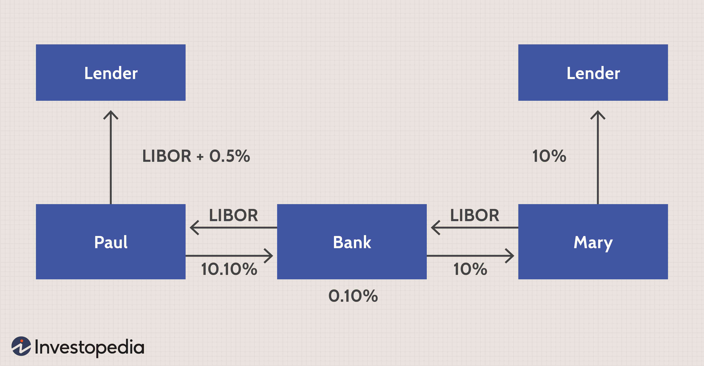

Financial derivatives are powerful tools in the world of finance, offering a range of options for managing risk and enhancing investment returns. These financial instruments derive their value from the performance of underlying assets, indexes, or interest rates, which allows investors to engage in activities such as hedging risk, speculating on price movements, or increasing leverage. Among the various types of financial derivatives, interest rate swaps and currency swaps hold a significant position due to their widespread use and importance in financial markets.

Interest rate swaps are agreements where two parties exchange cash flows based on differential interest rates, typically involving a fixed rate and a floating rate tied to a benchmark. These swaps are pivotal in managing interest rate exposure effectively, providing institutions with the ability to adjust their interest rate risks without altering their principal financial holdings.



Currency swaps, on the other hand, involve the exchange of principal and interest payments in one currency for equivalent amounts in another currency. This type of swap plays a critical role for companies dealing with foreign exchange exposure and optimizing their debt profiles across multiple jurisdictions. Multinational corporations often employ currency swaps to manage cross-border currency risks efficiently.

To understand and navigate the complexities of these financial instruments, it is essential to also consider the growing influence of algorithmic trading. This approach uses sophisticated computer algorithms to execute trades swiftly and at optimal conditions, enhancing market liquidity and transaction efficiency, especially in the derivatives market.

In this guide, we explore the key aspects of interest rate swaps and currency swaps, along with examining the role of algorithmic trading in these complex financial instruments. A comprehensive understanding of these concepts is crucial for individuals and organizations either participating in or contemplating involvement in financial markets. This article aims to provide an overview of these instruments, their use cases, benefits, and risks, thereby serving as a foundational resource for leveraging their full potential in financial strategies.

## Table of Contents

## Understanding Financial Derivatives

Financial derivatives are sophisticated financial instruments that derive their value from the performance of an underlying asset, index, or rate. These instruments are used extensively by investors and institutions for various purposes such as hedging risks, speculating on future market movements, and increasing leverage. There are several common forms of derivatives, each serving unique roles in financial markets and requiring distinct strategies for trading and risk management.

Derivatives can be broadly categorized into options, futures, swaps, and forwards. Options grant the buyer the right, but not the obligation, to buy or sell an underlying asset at a predetermined price before the contract expires. Futures are standardized contracts obligating the buyer to purchase, or the seller to sell, an asset at a set price at a future date. Forwards, similar to futures, are customized contracts traded over-the-counter (OTC) rather than on exchanges, allowing for tailored terms and greater flexibility.

Swaps, another critical type of derivative, involve the exchange of cash flows or other financial elements between parties. Swaps are widely used for managing [interest rate](/wiki/interest-rate-trading-strategies) and currency risks. For instance, an interest rate swap might involve exchanging a fixed-rate interest payment for a floating rate, helping institutions manage exposure without altering their underlying assets. Currency swaps entail exchanging principal and interest payments in differing currencies, addressing foreign exchange risk for multinational organizations.

The utilization of financial derivatives offers several advantages, such as allowing for risk transfer and the potential for high returns through leveraging. However, derivatives also present significant risks. These include market risk from adverse price movements, credit risk from the potential default of a counterparty, and the possibility of substantial losses due to leverage.

Effective risk management frameworks are crucial when engaging with derivatives to mitigate these risks. This involves a thorough understanding of the specific purpose and mechanism of each derivative type, as well as their potential impacts on an investment portfolio.

Swaps, particularly those linked to interest rates and currency exchanges, are pivotal in global finance. Their ability to provide tailored risk management solutions makes them a focal point for this exploration of financial derivatives.

## What is an Interest Rate Swap?

An interest rate swap is a financial derivative that involves the exchange of interest cash flows between two parties. The most common arrangement is where one party pays a fixed interest rate, while the other pays a floating interest rate tied to a benchmark index, such as the London Interbank Offered Rate (LIBOR) or its successors like the Secured Overnight Financing Rate (SOFR). 

### Structure and Mechanics

In a standard interest rate swap, there are typically two legs: 
1. **Fixed Leg**: One participant agrees to pay a predetermined fixed interest rate on a notional principal amount.
2. **Floating Leg**: The other participant pays a floating rate, often reset periodically and based on a reference benchmark, such as LIBOR. The floating rate payment adapts to market conditions, thus varying over the swap’s duration.

Despite the use of a notional principal, it is worth emphasizing that this amount is not exchanged between the two parties. The notional value merely serves as a reference for calculating the size of the interest payments.

### Example Calculation

Suppose Party A agrees to pay a 3% fixed annual rate to Party B on a notional principal of USD 10 million for a period of 5 years. In return, Party B pays a floating rate, for example, LIBOR + 0.5%. If LIBOR is 2.5% in the first year, then Party B would pay (2.5% + 0.5%) = 3% to Party A.

Here's how the cash flow for the first year would look like:
- **Fixed Payment**: Party A pays 3% of USD 10 million = USD 300,000.
- **Floating Payment**: Party B pays 3% of USD 10 million = USD 300,000.

In this instance, the net cash flow is zero since both payments are equal, but this scenario changes as LIBOR fluctuates.

### Risk Management and Financial Strategy

Interest rate swaps are predominantly employed to manage interest rate exposure. Corporations and financial institutions use interest rate swaps to hedge against fluctuations in interest rates that could impact their interest rate-sensitive liabilities or assets. By engaging in a swap, entities can achieve more predictable cash flows or alter the proportion of their exposure to fixed or floating rates.

A critical advantage of interest rate swaps lies in their ability to adjust interest exposure without modifying the underlying obligations or assets on a corporation's balance sheet. For example, a company with a floating rate debt can use a swap to pay fixed rates, thus stabilizing its interest expenses despite market [volatility](/wiki/volatility-trading-strategies).

### Importance in Risk Management

Interest rate swaps are a crucial tool in financial risk management. They aid in:
- **Hedging**: Protecting against interest rate volatility that can affect cash flows.
- **Speculative Purposes**: Allowing speculative plays on the movement of interest rates.
- **Asset-Liability Management**: Aligning the interest rate profile of assets and liabilities.

To summarize, interest rate swaps are instrumental in offering flexibility and precision in financial risk management, allowing entities to take proactive measures in managing their exposure to interest rate changes. Their application reflects a strategic maneuver to optimize financial efficiency and stability within the dynamic landscape of global finance.

## Exploring Currency Swaps

Currency swaps involve the exchange of principal and interest payments between two parties in different currencies. These financial instruments play a crucial role in managing foreign exchange risk and optimizing debt profiles for companies engaged in international operations. Unlike interest rate swaps, which typically involve only the exchange of interest payments, currency swaps are more complex due to the involvement of both principal and interest. This complexity arises from the need to account for fluctuations in exchange rates over the life of the swap.

A standard currency swap transaction begins with the exchange of principal amounts in two different currencies at the prevailing spot exchange rate. Throughout the duration of the swap agreement, each party pays interest on the principal amount they have received, calculated using agreed-upon interest rates. Finally, at the conclusion of the swap term, the principal amounts are exchanged back between the parties at either the original spot rate or a predetermined rate.

The principal elements of a currency swap make them especially beneficial for multinational corporations. Companies with operations in multiple countries often face significant exposure to exchange rate volatility, which can unpredictably impact their financial outcomes. Currency swaps enable such firms to stabilize cash flows by locking in exchange rates for both principal and interest payments. This stability is essential for strategic financial planning and budgeting, as it mitigates the impact of adverse currency movements on earnings.

From a strategic standpoint, currency swaps can be employed to achieve more favourable borrowing rates. For example, a corporation in the United States that can borrow in U.S. dollars at lower interest rates than a European counterpart may enter into a currency swap with a European company to secure a lower overall borrowing cost in euros. In return, the European company benefits from the comparatively lower interest rates on its dollar-denominated debt. This practice is known as [arbitrage](/wiki/arbitrage), where parties exploit price differentials in different markets to achieve more advantageous financial terms.

Currency swaps also help manage regulatory and geopolitical risks associated with foreign currencies. By locking in exchange rates for extended periods, firms can reduce exposure to sudden regulatory changes or economic crises affecting currency stability.

Overall, currency swaps serve as a sophisticated financial tool enabling corporations to manage currency risks, lower borrowing costs, and operate more effectively in international markets. Their strategic benefits are accompanied by complexities that require careful management to avoid potential pitfalls associated with exchange rate fluctuations and counterparty risks.

## The Role of Algorithmic Trading in Derivatives

Algorithmic trading, commonly referred to as algo trading, utilizes sophisticated computer algorithms to automate the trading process, achieving optimal execution with remarkable speed and precision. This approach has become increasingly prominent in the derivatives market, including the trading of complex instruments such as interest rate swaps and currency swaps. By leveraging technology, algo trading has introduced significant enhancements in [liquidity](/wiki/liquidity-risk-premium) and efficiency, fundamentally transforming the trading landscape for these financial derivatives.

At its core, [algorithmic trading](/wiki/algorithmic-trading) involves the use of pre-programmed instructions to execute trades. These algorithms are capable of analyzing vast quantities of market data to identify trends and trading opportunities within milliseconds. This rapid data processing allows for quick decision-making and execution, which is crucial in the fast-paced environment of derivatives trading.

In the context of interest rate and currency swaps, algorithmic trading offers notable advantages. One primary benefit is the enhancement of market liquidity. As algorithms execute trades rapidly and efficiently, they facilitate a higher [volume](/wiki/volume-trading-strategy) of transactions, ensuring that counterparties can engage in swaps more readily. This increased liquidity lowers transaction costs and narrows bid-ask spreads, benefiting all market participants.

Moreover, algo trading contributes to greater market efficiency. Algorithms can integrate a multitude of factors, including interest rate differentials, currency fluctuations, and macroeconomic indicators, enabling them to determine the most favorable conditions for executing swaps. This level of analysis and precision helps in optimizing trade outcomes and reducing latency, further aligning trade prices with true market values.

However, the integration of technology in derivatives trading is not without challenges. One significant issue is the complexity of developing and maintaining efficient algorithms capable of handling the intricacies of swap transactions. This requires sophisticated programming skills and a deep understanding of both financial markets and computational techniques. Additionally, the high level of automation and speed introduces systemic risks. Flash crashes and market anomalies can occur if numerous algorithms react collectively to market signals, potentially destabilizing the market.

Furthermore, algorithmic trading in the derivatives market demands robust risk management frameworks. The automation of trade execution necessitates stringent monitoring systems to manage counterparty credit risk, market risk, and operational risk. Advanced analytics and continuous oversight are essential to mitigate these risks and ensure the reliability of algorithmic strategies.

In conclusion, algorithmic trading is revolutionizing the landscape of interest rate and currency swaps by enhancing liquidity and efficiency. While the benefits are substantial, the adoption of algo trading in derivatives markets requires cautious implementation and risk management to address its inherent challenges. As technology continues to evolve, it remains critical for market participants to stay informed and adapt their strategies to leverage the full potential of algorithmic trading.

## Benefits and Risks of Trading Swaps

Swaps are integral to modern financial markets, offering several advantages, including risk management, cost reduction, and flexibility in structured finance. They enable entities to adapt to changes in interest rates or currency values without directly altering their asset portfolios.

**Advantages of Swaps**

1. **Risk Management**: Swaps are primarily used for hedging purposes. Interest rate swaps allow entities to convert floating-rate loans to fixed-rate loans, thereby mitigating the risk of interest rate fluctuations. Similarly, currency swaps can protect companies from adverse movements in foreign exchange rates. By locking in exchange rates and interest rates, companies can stabilize cash flows and financial results.

2. **Cost Reduction**: By engaging in swaps, entities can potentially lower their financing costs. For example, a company that is able to borrow at a favorable fixed rate but requires floating rate payments can engage in a swap to achieve a lower effective rate than would be possible through direct borrowing in the floating rate market.

3. **Flexibility and Tailored Solutions**: Swaps are custom contracts that can be structured to meet specific financial needs. This flexibility allows entities to tailor solutions based on their unique risk profiles and financial objectives, unlike standardized financial instruments.

**Risks of Swaps**

1. **Counterparty Risk**: One of the primary risks associated with swaps is counterparty risk, which is the risk that the other party in the contract will default on their obligations. Mitigation strategies include the use of credit support annexes (CSAs), which are part of ISDA Master Agreements, to provide for collateralization of net exposures.

2. **Market Volatility**: Swaps are exposed to market risk due to fluctuations in interest rates and currency values. Sudden and extreme movements can lead to substantial variation in the value of swap agreements. It is crucial to employ robust risk management strategies to monitor and manage these exposures.

3. **Complex Valuation Challenges**: The valuation of swaps can be complex as they depend on various factors such as interest rate curves, currency rates, and credit spreads. Accurate valuation requires sophisticated financial models and an understanding of the underlying assumptions.

**Mitigating Risks**

Effective risk management in swap trading involves a combination of strategies:

- **Diversification**: Spreading exposures across various counterparties and markets can reduce risk concentration.
- **Use of Collateral**: Implementing collateral agreements to secure obligations and mitigate counterparty risk.
- **Robust Modeling and Analysis**: Employing advanced analytical tools and stress testing to understand potential risks and outcomes. Python and other programming languages can be utilized to simulate various market scenarios and assess the impact on swap positions.

```python
import numpy as np

# Simulate interest rate paths for swap valuation
def simulate_interest_rates(initial_rate, volatility, n_steps, seed=42):
    np.random.seed(seed)
    dt = 1  # assume one-year time step
    rates = [initial_rate]
    for _ in range(n_steps):
        rate_change = np.random.normal(0, volatility * np.sqrt(dt))
        rates.append(rates[-1] + rate_change)
    return rates

# Example usage
initial_rate = 0.05  # 5%
volatility = 0.01  # 1% annual volatility
n_steps = 5  # For a 5-year swap
interest_rates = simulate_interest_rates(initial_rate, volatility, n_steps)

print("Simulated Interest Rates:", interest_rates)
```

Engaging in swaps requires careful analysis of the cost-benefit profile to make informed decisions. Financial managers must weigh potential strategic benefits against the inherent risks and the complexity of these instruments. Understanding and managing these elements effectively can unlock the full potential of swaps, while minimizing exposure to unwanted financial risk.

## Conclusion and Future Trends

As global markets continuously evolve, financial derivatives such as interest rate and currency swaps remain central to financial strategies. Their ability to manage risk, provide cost efficiency, and increase flexibility solidifies their importance in today's financial landscape. As these instruments are integral to balancing global financial systems, a comprehensive understanding of their applications and intricacies is crucial.

The advent of technology, particularly algorithmic trading, is significantly transforming how derivatives markets operate. Algorithmic trading, through the use of complex computer algorithms, can execute trades at optimal conditions and unparalleled speeds. This technology enhances liquidity and efficiency, particularly in complex instruments like swaps. By analyzing vast datasets in real-time, algorithmic systems can identify trends and opportunities almost instantaneously, providing a competitive edge in trading operations.

Staying informed on regulatory changes is equally critical for entities engaged in derivatives trading. Regulations can vary across jurisdictions and often adapt to evolving market conditions and technological advancements. As such, financial professionals need to be continuously aware of the regulatory landscape to navigate compliance successfully and mitigate potential legal risks.

The future trajectory of derivatives is likely to be shaped by further integration of technological advancements and regulatory frameworks, which could redefine efficiency and security in trading practices. The expansion of technology will not only expedite trading processes but will also provide deeper analytical insights, driving strategic decision-making.

In conclusion, mastering derivatives is crucial for efficiently harnessing their potential within financial markets. This article offered an essential overview of the derivatives landscape, focusing on swaps and the transformative role of technology in their trade. As these instruments redefine risk management and financial strategies, an informed approach will enable market participants to maximize their benefits while effectively managing associated challenges.

## References & Further Reading

[1]: ["Swaps and Derivatives: Accounting Policies and Procedures"](https://kpmg.com/us/en/frv/reference-library/2023/handbook-derivatives-hedging-accounting.html) by Lou R. Amend

[2]: Hull, J. (2017). ["Options, Futures, and Other Derivatives"](https://books.google.com/books/about/Options_Futures_and_Other_Derivatives.html?id=yfr0DQAAQBAJ). Pearson.

[3]: ["Interest Rate Swaps and Other Derivatives"](https://www.investopedia.com/terms/i/interestrateswap.asp) by Howard Corb

[4]: ["Algorithmic Trading: Winning Strategies and Their Rationale"](https://www.wiley.com/en-us/Algorithmic+Trading%3A+Winning+Strategies+and+Their+Rationale-p-9781118460146) by Ernie Chan

[5]: Choudhry, M. (2010). ["The Bond and Money Markets: Strategy, Trading, Analysis"](https://www.sciencedirect.com/book/9780750646772/the-bond-and-money-markets). Butterworth-Heinemann.

[6]: ["Financial Risk Management: Applications in Market, Credit, Asset, and Liability Management"](https://www.amazon.com/Financial-Risk-Management-Applications-Liability/dp/1119135516) by Jimmy Skoglund and Wei Chen

[7]: Veronesi, P. (2016). ["Fixed Income Securities: Valuation, Risk, and Risk Management"](https://archive.org/details/fixedincomesecur0000vero). Wiley.