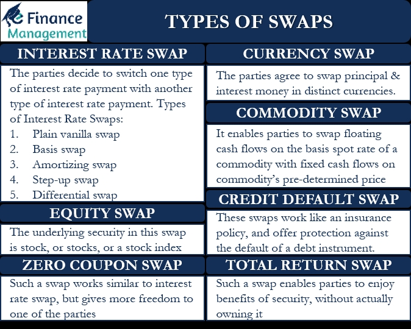

## Table of Contents

## What is a currency swap?

A currency swap is an agreement between two parties to exchange a specific amount of one currency for another currency at a set rate, and then reverse the transaction at a later date. This helps companies manage their exposure to currency fluctuations. For example, if a U.S. company wants to expand in Europe, it might need Euros. By entering into a currency swap, the company can get Euros now and agree to pay back the equivalent amount in dollars later.

Currency swaps can be useful for businesses that operate internationally. They help reduce the risk of currency value changes, which can affect profits. The terms of the swap, like the exchange rate and the dates of the transactions, are set at the beginning, so both parties know what to expect. This makes planning easier and can protect against sudden changes in currency values.

## What is an interest rate swap?

An interest rate swap is a deal between two parties to exchange one type of interest payment for another. Usually, one party pays a fixed interest rate, while the other pays a variable interest rate that can change over time. This helps businesses manage the risk of interest rates going up or down. For example, a company might have a loan with a variable interest rate. By doing an interest rate swap, it can switch to paying a fixed rate instead, which makes budgeting easier.

Interest rate swaps are common in financial markets because they help companies control their costs. If a company thinks interest rates will go up, it can use a swap to lock in a lower rate now. On the other hand, if a company believes rates will fall, it might choose to pay a variable rate to take advantage of lower rates later. The terms of the swap, like the rates and the duration, are agreed upon at the start, so both parties know what to expect.

## How do currency swaps and interest rate swaps differ in their basic structure?

Currency swaps and [interest rate](/wiki/interest-rate-trading-strategies) swaps are both financial tools used to manage risk, but they work in different ways. A currency swap involves exchanging one currency for another at the start of the agreement and then reversing the exchange at a later date. This helps businesses that need to operate in different countries by locking in exchange rates and reducing the risk of currency value changes. For example, a company might swap dollars for euros now and agree to swap back to dollars later, which can help with planning and budgeting in foreign markets.

On the other hand, an interest rate swap is about exchanging different types of interest payments, usually between a fixed rate and a variable rate. This tool is useful for managing the risk of interest rate changes. If a company has a loan with a variable interest rate, it might use an interest rate swap to switch to paying a fixed rate, which makes it easier to predict future costs. Unlike currency swaps, interest rate swaps don't involve exchanging different currencies; they focus on the interest payments on loans or bonds.

## What are the primary purposes of using currency swaps?

Currency swaps are mainly used by businesses to manage the risk of currency value changes. When a company does business in different countries, it might need to use different currencies. If the value of one currency goes up or down compared to another, it can affect the company's profits. By using a currency swap, a company can lock in an exchange rate now and know how much money it will have later. This makes it easier to plan and budget for the future without worrying about sudden changes in currency values.

Another important use of currency swaps is to help businesses get the money they need in the right currency. For example, if a U.S. company wants to expand in Europe, it will need Euros. By entering into a currency swap, the company can get Euros now and agree to pay back the equivalent amount in dollars later. This can be a big help for businesses that need to operate in different countries and want to make sure they have the right currency at the right time.

## What are the main reasons for entering into an interest rate swap?

Companies use interest rate swaps to manage the risk of interest rates going up or down. When a company has a loan with a variable interest rate, it might worry about the interest rate going up and making the loan more expensive. By doing an interest rate swap, the company can switch to paying a fixed interest rate instead. This makes it easier to plan and budget because the company knows exactly how much it will have to pay each time.

Another reason for using an interest rate swap is to take advantage of expected changes in interest rates. If a company thinks interest rates will go down, it might choose to pay a variable rate so it can benefit from the lower rates later. On the other hand, if the company believes rates will go up, it can use a swap to lock in a lower rate now. This helps the company save money and manage its finances better in the long run.

## How do the cash flows differ between currency swaps and interest rate swaps?

In a currency swap, the cash flows involve exchanging one currency for another at the beginning of the agreement. After that, the parties usually exchange interest payments in their respective currencies during the life of the swap. At the end, they swap back the principal amounts in the original currencies. So, the cash flows include both principal and interest, and they are in different currencies. This helps companies manage their money when they need to work in different countries.

In an interest rate swap, the cash flows are all about interest payments, and they are usually in the same currency. One party pays a fixed interest rate, and the other pays a variable interest rate. There's no exchange of principal at the start or end, just the interest payments during the life of the swap. This helps companies control their costs when they have loans or bonds with different types of interest rates.

## What are the risks associated with currency swaps?

Currency swaps come with risks because the value of money can change. If the exchange rate moves a lot, one side might end up paying more than they expected. For example, if a company swaps dollars for euros and the euro gets stronger, the company will need more dollars to swap back at the end. This can make the swap more expensive and hurt the company's profits.

Another risk is that the other side of the swap might not be able to pay back. If the company or bank you're swapping with runs into money problems, they might not be able to give you your money back. This is called credit risk, and it can be a big problem if the other side can't pay. Companies have to be careful and check if the other side is trustworthy before they agree to a swap.

## What risks are involved in interest rate swaps?

Interest rate swaps have risks because the interest rates can change a lot. If a company switches to paying a fixed rate and then the variable rate goes down, the company might end up paying more than if it had kept the variable rate. On the other hand, if the company keeps paying a variable rate and the interest rates go up a lot, it will have to pay more money. This can make it hard for the company to plan and budget because it's not sure how much it will have to pay.

Another risk is that the other side of the swap might not be able to pay. If the bank or company you're swapping with runs into money problems, they might not be able to make their interest payments. This is called credit risk, and it can be a big problem if the other side can't pay. Companies need to check if the other side is trustworthy before they agree to a swap to avoid this risk.

## How do currency swaps affect a company's balance sheet?

When a company does a currency swap, it changes how the money looks on its balance sheet. At the start of the swap, the company swaps one currency for another. This means the company's balance sheet will show more of the new currency and less of the old one. If the company swaps dollars for euros, the balance sheet will have more euros and fewer dollars. This can affect how much money the company seems to have because the value of the currencies can change.

During the life of the swap, the company will also have to make interest payments in the new currency. These payments can change the company's cash and debt levels on the balance sheet. At the end of the swap, the company swaps back to the original currency. This final swap can make the balance sheet look different again, depending on how the exchange rates have changed. If the new currency got stronger, the company might need more of the original currency to swap back, which can affect the balance sheet.

## What impact do interest rate swaps have on financial statements?

Interest rate swaps can change how a company's financial statements look. When a company does an interest rate swap, it might switch from paying a variable interest rate to a fixed one, or the other way around. This change affects the company's income statement because the interest expense will be different. If the company is now paying a fixed rate, the interest expense will be the same every time, making it easier to predict future costs. But if the company is paying a variable rate, the interest expense can go up or down, which can make the income statement more unpredictable.

The balance sheet can also be affected by interest rate swaps. Even though the principal amount of the loan doesn't change, the way the interest is paid can change the company's cash flow and debt levels. For example, if the company is paying a fixed rate and the variable rate goes down, the company might have more cash on hand because it's not paying as much interest as it would have. On the other hand, if the variable rate goes up, the company might have less cash. The company also has to report the fair value of the swap on the balance sheet, which can change over time and affect the company's overall financial position.

## What are some advanced strategies that involve combining currency and interest rate swaps?

Companies sometimes use a mix of currency and interest rate swaps to manage their money better. One strategy is called a cross-currency interest rate swap. In this, a company swaps one currency for another and also swaps the interest payments. For example, a U.S. company might swap dollars for euros and switch from paying a variable interest rate in dollars to a fixed rate in euros. This helps the company deal with both currency changes and interest rate changes at the same time. It can make planning easier because the company knows exactly how much it will pay in euros, even if the dollar's value changes.

Another strategy is to use a quanto swap, which is a bit more complicated. In a quanto swap, a company gets payments in one currency but based on the interest rate of another currency. For example, a company might get payments in dollars but based on the euro interest rate. This can help the company if it thinks the euro interest rate will be better than the dollar rate. By using these advanced strategies, companies can manage their money in different countries and handle changes in both currency values and interest rates. This can make their financial planning more stable and predictable.

## How do regulatory environments influence the use of currency swaps versus interest rate swaps?

The rules and laws set by governments can affect how companies use currency swaps and interest rate swaps. Different countries have different rules about these financial tools. For example, some countries might have strict rules about how much risk a bank can take with currency swaps. This can make it harder for companies to use currency swaps because they might have to find a bank that is willing to take the risk. On the other hand, interest rate swaps might be easier to use because the rules might be less strict. Companies need to know the rules in each country they work in to decide which swaps to use.

Regulations can also change over time, which can make companies change their strategies. For example, if a country makes new rules about how much money banks can use for currency swaps, companies might have to use interest rate swaps instead. This can make it harder for companies to plan because they have to keep up with the changing rules. But if the rules are clear and stable, companies can use both currency and interest rate swaps more easily to manage their money.

## References & Further Reading

[1]: ["Swaps and Derivatives: Accounting Policies and Procedures"](https://kpmg.com/us/en/frv/reference-library/2023/handbook-derivatives-hedging-accounting.html) by Lou R. Amend

[2]: Hull, J. (2017). ["Options, Futures, and Other Derivatives"](https://books.google.com/books/about/Options_Futures_and_Other_Derivatives.html?id=yfr0DQAAQBAJ). Pearson.

[3]: ["Interest Rate Swaps and Other Derivatives"](https://www.investopedia.com/terms/i/interestrateswap.asp) by Howard Corb

[4]: ["Algorithmic Trading: Winning Strategies and Their Rationale"](https://www.wiley.com/en-us/Algorithmic+Trading%3A+Winning+Strategies+and+Their+Rationale-p-9781118460146) by Ernie Chan

[5]: Choudhry, M. (2010). ["The Bond and Money Markets: Strategy, Trading, Analysis"](https://www.sciencedirect.com/book/9780750646772/the-bond-and-money-markets). Butterworth-Heinemann.

[6]: ["Financial Risk Management: Applications in Market, Credit, Asset, and Liability Management"](https://www.amazon.com/Financial-Risk-Management-Applications-Liability/dp/1119135516) by Jimmy Skoglund and Wei Chen

[7]: Veronesi, P. (2016). ["Fixed Income Securities: Valuation, Risk, and Risk Management"](https://archive.org/details/fixedincomesecur0000vero). Wiley.