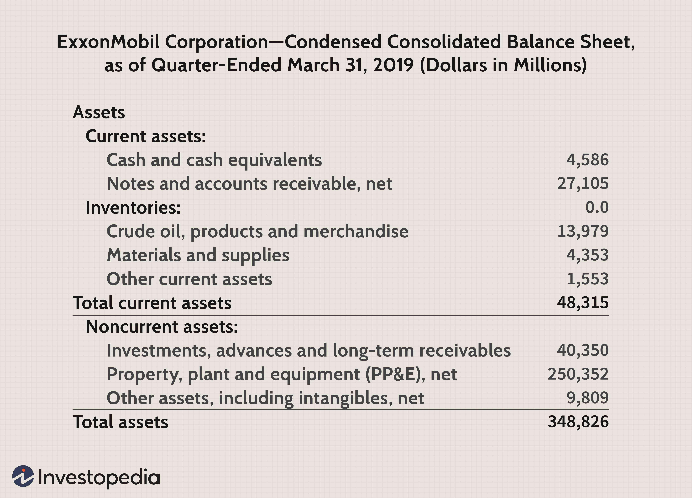

The world of finance encompasses a multitude of intricate concepts that must be organized effectively for improved comprehension and analysis. One such essential concept is asset classification, which plays a pivotal role in financial management. This article aims to elucidate the differences between noncurrent and current assets, examining how these categories impact decision-making in the financial sector. Furthermore, the importance of these classifications will be discussed in the context of algorithmic trading, where mathematical models and computer programs are employed to optimize trading strategies.

Asset classification can significantly aid traders and financial analysts in making informed decisions by providing clarity on the nature and purpose of different assets. The distinction between noncurrent assets, which provide value over a longer term, and current assets, expected to be liquidated within a year, helps in understanding a company's financial health and operational needs. Recognizing these differences is fundamental for anyone involved in financial analysis or trading, as it enables strategic planning and efficient resource allocation.

In the fast-paced environment of algorithmic trading, understanding asset classifications becomes even more crucial. These classifications inform trading algorithms on how to tailor strategies based on asset characteristics, thereby optimizing trade execution and risk management. As we explore these classifications, it becomes evident that their implications extend beyond mere categorization, affecting both financial reporting and the execution of sophisticated trading strategies. By dissecting the intricacies of asset classification, we aim to provide financial practitioners with the insights necessary to enhance their analytical capabilities and strategic approaches in the evolving landscape of financial markets.

## Table of Contents

## Understanding Asset Classification

Assets represent resources with economic value owned by individuals or organizations. These resources are integral to financial management as they symbolize potential economic benefits. Asset classification is the process of organizing these resources into categories based on their characteristics. This systematic organization is pivotal in numerous financial domains, including analysis, risk management, and strategic planning.

The primary classifications of assets are noncurrent assets and current assets. Noncurrent assets, often referred to as fixed assets, include resources that offer long-term value and are typically not converted into cash within a year. Examples encompass property, plant, equipment, patents, and trademarks. On the other hand, current assets are resources likely to be converted to cash or exhausted within a year. These include cash, inventory, accounts receivable, and marketable securities.

Proper asset classification allows financial analysts and management to assess an organization's financial health more accurately. For instance, by clearly distinguishing between current and noncurrent assets, a firm can better manage liquidity and solvency, ensuring it meets short-term financial obligations while maintaining a stable long-term asset base. This classification also aids in risk management, providing insights into the company's ability to withstand market fluctuations and financial challenges.

Furthermore, asset classification supports strategic planning by offering a clear picture of the resources available for investment and operational activities. By understanding the nature and classification of assets, organizations can make informed decisions on capital investments, financial structuring, and operational strategies, ultimately contributing to the company's overall efficiency and financial success.

## Noncurrent Assets: Definition and Examples

Noncurrent assets, frequently referred to as fixed assets, represent resources that provide enduring value over an extended period, typically exceeding one year. These assets are integral components of a company's operations, primarily utilized to generate revenue over the long term rather than being quickly converted into cash. They play a crucial role in assessing a company's long-term stability and strategic capital investments.

Noncurrent assets encompass a variety of components, including tangible and intangible resources. Tangible noncurrent assets include property, plant, and equipment (PP&E). These are physical assets used in business operations, such as manufacturing facilities, office buildings, machinery, and vehicles. Proper management of these assets involves regular maintenance, depreciation accounting, and strategic upgrades to ensure they continue to contribute effectively to the company's productivity and revenue generation.

Intangible noncurrent assets, on the other hand, consist of non-physical items that provide value, such as patents, trademarks, and goodwill. Patents offer exclusive rights to inventions, allowing companies to protect and capitalize on their innovations. Trademarks protect brand identity, which can significantly influence consumer behavior and company reputation. Goodwill arises during acquisitions and represents the value of a company's brand, customer base, and other intangible benefits beyond the identifiable assets.

Effective management of noncurrent assets is pivotal for maintaining a firm's financial health. This involves strategic decisions regarding asset acquisition, utilization, and disposal. Companies must ensure accurate accounting for depreciation and amortization to reflect the reduction in asset value over time and optimize tax implications. Furthermore, assessing the return on investment for capital expenditures related to noncurrent assets aids in aligning them with the company's long-term strategic goals.

Overall, noncurrent assets are vital indicators of a company's ability to sustain operations and generate revenue over the long haul. Their strategic management can significantly influence a firm's financial stability, operational efficiency, and competitive advantage in the market.

## Current Assets: Definition and Examples

Current assets are resources that a company expects to convert into cash or consume within one year. These assets are fundamental for assessing a company's [liquidity](/wiki/liquidity-risk-premium) and its ability to meet short-term financial commitments. They provide a snapshot of the firm’s operational efficiency and cash flow management. 

A clear understanding of current assets includes recognizing key components such as cash, inventory, accounts receivable, and marketable securities. Cash is the most liquid asset and is immediately available for use in transactions. Inventory, which includes raw materials and finished goods, reflects the items a company intends to sell within the business cycle. Accounts receivable consist of money owed to the company by customers who have purchased goods and services on credit; it is an indication of expected incoming cash. Lastly, marketable securities are liquid financial instruments that can be quickly converted into cash with minimal impact on their market price.

Effective management of current assets is critical to ensure that a company can efficiently handle its immediate financial obligations, such as paying suppliers, employees, and other short-term liabilities. Proper management includes maintaining optimal cash levels, managing inventory turnover rates, and ensuring timely collection of receivables. 

Calculating important ratios such as the current ratio and quick ratio can help assess the liquidity provided by current assets. The current ratio is defined as:

$$
\text{Current Ratio} = \frac{\text{Current Assets}}{\text{Current Liabilities}}
$$

This ratio provides insights into the company's ability to pay off its short-term liabilities with its current assets. Moreover, understanding current assets is vital for managing day-to-day operations, facilitating strategic decision-making, and ensuring the organization is not only solvent but also poised for opportunities that require quick financial maneuvers. Overall, adept handling of current assets supports sustained business operations and financial health.

## The Role of Asset Classification in Financial Reporting

Asset classification plays a pivotal role in financial reporting and analysis, serving as a fundamental component that aids stakeholders in appraising a company's economic health. This process involves categorizing a company's assets into distinct groups, primarily current and noncurrent assets, which are essential for constructing accurate and meaningful financial statements such as balance sheets and income statements.

The differentiation between current and noncurrent assets is critical for understanding key financial metrics such as liquidity, solvency, and cash flow. Current assets, due to their short-term nature, provide insight into a company's ability to meet immediate obligations. They reflect the liquidity status of the company by indicating the resources that are readily convertible into cash within a year. Noncurrent assets, on the other hand, are long-term resources contributing to a company's capital stability and potential for future revenue.

This distinction is especially useful when assessing a company's solvency—the ability to meet its long-term obligations. An analysis of noncurrent assets can elucidate how well-equipped a company is to sustain operations and grow over time, providing investors and analysts with a clearer picture of potential risks and opportunities.

The necessity of standardized asset classification is underscored by regulatory requirements which mandate transparency and comparability across financial disclosures. Regulatory bodies, such as the Securities and Exchange Commission (SEC) in the United States or the International Financial Reporting Standards (IFRS) globally, impose guidelines that ensure assets are consistently categorized. This uniformity is essential for ensuring that financial statements fairly represent the company's financial position and for facilitating meaningful comparison between different firms.

In summary, precise asset classification underpins the integrity and clarity of financial reporting, enabling investors, analysts, and regulatory bodies to make well-informed decisions regarding a company's financial performance and position. Through stringent adherence to classification standards, firms can maintain robust and transparent reporting practices.

## Algorithmic Trading and Asset Classification

Algorithmic trading utilizes computer algorithms to execute trades automatically based on defined parameters and criteria. The efficacy of these algorithms is significantly influenced by the classification of assets into noncurrent and current categories, as these classifications impact the strategies deployed by the algorithms.

Different asset types necessitate distinct trading strategies due to their inherent characteristics. Noncurrent assets, typically held for longer periods, often require strategies focused on long-term investment horizons and capital appreciation. In contrast, current assets, which are generally liquid or expected to be utilized within a year, are more suitable for short-term trading strategies.

Understanding the nature of these assets enables algorithms to optimize both trade execution and risk management. For instance, algorithms can be programmed to assess the liquidity risk associated with current assets and adjust trading strategies accordingly to maximize profit while minimizing potential downsides. Conversely, for noncurrent assets, algorithms might emphasize strategies that align with projected market trends and economic forecasts.

Accurate asset classification facilitates the development of adaptive algorithms that can respond to varying market conditions. For example, during periods of market [volatility](/wiki/volatility-trading-strategies), an algorithm can prioritize current assets for rapid trading to take advantage of short-term price fluctuations, whereas a more stable market environment might see a shift towards investing in noncurrent assets for potential long-term gains.

Algorithmic trading benefits from precise asset classification through enhanced trade efficiency and improved decision-making accuracy. By segmenting assets based on liquidity and time horizon, algorithms can be tailored to specific market environments, thereby improving overall performance. This approach not only boosts the speed and precision of trade executions but also enhances the ability of traders to manage portfolios effectively.

In summary, the interplay between asset classification and [algorithmic trading](/wiki/algorithmic-trading) underscores the importance of understanding asset characteristics. By leveraging these insights, algorithmic trading systems can be optimized to navigate complex financial markets, aligning trading methodologies with asset-specific criteria to yield superior outcomes.

## Case Studies and Examples

Several case studies illustrate the significance of asset classification in enhancing algorithmic trading strategies. One notable example is the utilization of noncurrent assets for formulating long-term investment strategies. Noncurrent assets, often associated with sustained economic benefits, are less susceptible to short-term market volatility. By focusing on these assets, algorithmic trading systems can develop investment strategies that capitalize on long-term trends and stability. For instance, a trading algorithm might analyze historical data of a company's property and equipment values to predict future stability and growth potential. This allows traders to make informed decisions that align with long-term investment goals.

Conversely, current assets are integral to short-term trading strategies. With their high liquidity and rapid turnover, current assets like cash and marketable securities can be easily converted into cash or equivalents, providing liquidity for agile trading maneuvers. Algorithmic trading programs often exploit this characteristic by incorporating real-time data feeds and rapid execution capabilities to capitalize on short-lived market opportunities. A practical example can be seen in trading firms utilizing algorithms to optimize the trade of inventories and accounts receivable, leveraging their liquidity to respond promptly to market fluctuations.

Successful trading firms have adeptly leveraged asset classification to gain strategic advantage. For instance, companies employing sophisticated algorithms utilize asset classification to allocate resources effectively between long-term and short-term strategies. They achieve this by categorizing their asset base, allowing them to tailor trading strategies to respective asset characteristics. This strategic advantage is often demonstrated in the form of optimized portfolio allocation, where algorithms dynamically adjust investment weights, balancing long-term stability with short-term gains.

The practical applications of asset classification in these case studies underscore its value in refining trading operations. By systematically categorizing assets, trading entities can enhance decision-making accuracy, optimize resource allocation, and ultimately improve financial outcomes. The strategic importance of asset classification in trading is clear, highlighting the necessity for rigorous classification methodologies within algorithmic systems.

## Conclusion

Asset classification, particularly the bifurcation into noncurrent and current assets, is a cornerstone of financial management and trading. By effectively categorizing assets, traders and financial analysts can greatly enhance their strategies. This classification aids in understanding the liquidity, solvency, and long-term financial health of a company, thereby supporting informed decision-making.

In algorithmic trading, the role of asset classification is pivotal. Algorithms rely on accurate data to optimize execution and manage risk. The benefits seen in trading underscore the importance of precise asset classification. Understanding the nature of noncurrent and current assets allows algorithms to adapt and respond to market dynamics effectively. This adaptability leads to improved efficiency in trade execution and boosts the accuracy of decision-making processes.

As financial markets continue to evolve, the principles of asset classification will remain critical. Regulatory requirements reinforce standardized classifications, ensuring transparency and comparability in financial reporting. A comprehensive understanding enables traders to maintain financial stability and leverage opportunities presented by shifting market conditions.

Ultimately, mastering asset classification serves a dual purpose: it provides a framework for financial reporting and enhances the robustness of trading strategies. As such, it remains an indispensable tool for achieving financial success and stability.

## References & Further Reading

[1]: ["Algorithms for Hyper-Parameter Optimization."](https://papers.nips.cc/paper/4443-algorithms-for-hyper-parameter-optimization.pdf) Bergstra, J., Bardenet, R., Bengio, Y., & Kégl, B. (2011). Advances in Neural Information Processing Systems 24.

[2]: ["Advances in Financial Machine Learning"](https://www.amazon.com/Advances-Financial-Machine-Learning-Marcos/dp/1119482089) by Marcos Lopez de Prado

[3]: ["Evidence-Based Technical Analysis: Applying the Scientific Method and Statistical Inference to Trading Signals"](https://www.amazon.com/Evidence-Based-Technical-Analysis-Scientific-Statistical/dp/0470008741) by David Aronson

[4]: ["Machine Learning for Algorithmic Trading"](https://github.com/PacktPublishing/Machine-Learning-for-Algorithmic-Trading-Second-Edition) by Stefan Jansen

[5]: ["Quantitative Trading: How to Build Your Own Algorithmic Trading Business"](https://books.google.com/books/about/Quantitative_Trading.html?id=j70yEAAAQBAJ) by Ernest P. Chan