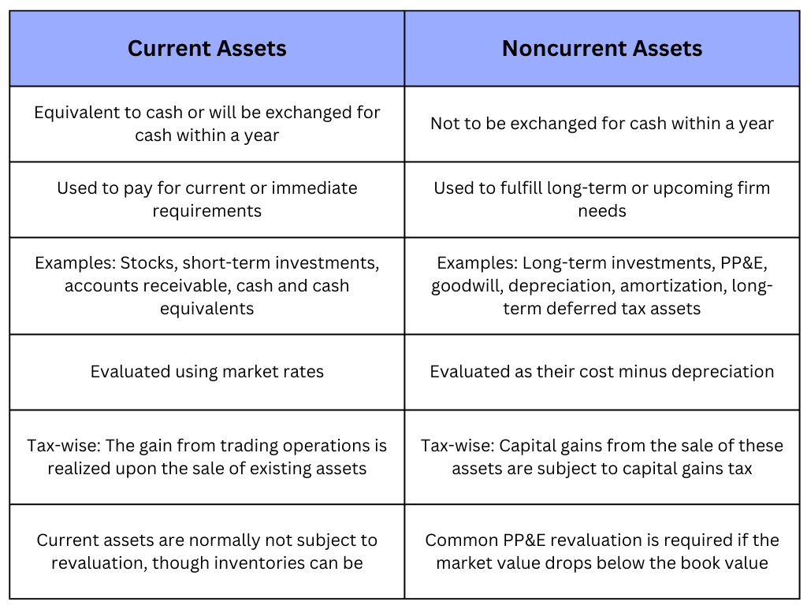

## Table of Contents

## What are assets in accounting?

In accounting, assets are things that a company owns and that have value. These can be physical items like buildings, machinery, and inventory, or non-physical items like patents, trademarks, and money that people owe the company. Assets are important because they help a company do its business and make money.

Assets are shown on a company's balance sheet, which is a report that shows what the company owns and owes at a certain time. They are usually divided into two types: current assets and non-current assets. Current assets are things that can be turned into cash within a year, like cash itself, money in the bank, and inventory. Non-current assets are things that will be used for more than a year, like buildings and equipment. By keeping track of assets, a company can see how well it is doing and plan for the future.

## How are assets classified in a balance sheet?

Assets on a balance sheet are divided into two main groups: current assets and non-current assets. Current assets are things that a company can turn into cash within one year. This includes cash, money in the bank, money that people owe the company (accounts receivable), and things the company has to sell (inventory). These assets help the company run day-to-day and pay for short-term needs.

Non-current assets are things that the company will use for more than one year. These include big things like buildings and machines (property, plant, and equipment), as well as things you can't touch like patents and trademarks (intangible assets). Sometimes, non-current assets also include money that other people owe the company but won't pay back for a long time (long-term investments). These assets are important for the company's long-term growth and operations.

By looking at these two types of assets, you can see what the company owns and how it plans to use these things to make money now and in the future.

## What is the difference between current and noncurrent assets?

Current assets are things a company can turn into cash within a year. They help the company pay for day-to-day needs and keep the business running smoothly. Examples of current assets include cash, money in the bank, money people owe the company (accounts receivable), and things the company has to sell (inventory). These assets are important because they show how well a company can handle its short-term money needs.

Non-current assets, on the other hand, are things a company will use for more than a year. They are important for the company's long-term plans and growth. Examples of non-current assets include big things like buildings and machines (property, plant, and equipment), and things you can't touch like patents and trademarks (intangible assets). These assets help the company make money over a longer period and are crucial for its future success.

## Can you provide examples of current assets?

Current assets are things a company can turn into cash within a year. They help the company pay for everyday needs and keep the business going. Some examples of current assets are cash, which is money the company has right now, and money in the bank, which is money the company can use easily. Another example is accounts receivable, which is money that people owe the company and will pay back soon. 

Inventory is also a current asset. It's the things the company has to sell, like products in a store or materials to make products. For example, if a company sells shoes, the shoes sitting on the shelves are part of its inventory. These current assets are important because they show how well a company can handle its short-term money needs.

## Can you provide examples of noncurrent assets?

Noncurrent assets are things a company will use for more than a year. They help the company grow and make money over a long time. One example of a noncurrent asset is property, plant, and equipment. This includes big things like buildings, land, and machines that the company uses to make its products or provide its services. For example, if a company makes cars, the factory where the cars are made is a noncurrent asset.

Another example of a noncurrent asset is intangible assets. These are things you can't touch but still have value, like patents and trademarks. A patent is a special right that lets a company be the only one to make or sell a new invention for a while. A trademark is a special symbol or name that shows a product comes from a certain company. These intangible assets help the company stand out and make money over many years.

Sometimes, noncurrent assets also include long-term investments. These are money or other things the company owns but won't turn into cash for a long time. For example, if a company buys stocks in another company and plans to keep them for many years, those stocks are a noncurrent asset. These long-term investments help the company plan for its future and keep growing.

## How do current assets affect a company's liquidity?

Current assets are really important for a company's liquidity. Liquidity means how easily a company can turn its stuff into cash to pay bills or buy things it needs right away. When a company has a lot of current assets like cash, money in the bank, money people owe them, and things they can sell, it can pay its short-term bills easily. This makes the company more liquid, which is good because it means they can handle money problems without worrying too much.

Having a good amount of current assets also helps a company feel more secure. If something unexpected happens, like a big bill coming out of nowhere, the company can use its current assets to cover it. For example, if a company has a lot of cash or things it can sell quickly, it won't have to borrow money or sell important long-term stuff to pay its bills. So, current assets make a company more flexible and ready for anything that comes up.

## What role do noncurrent assets play in a company's long-term strategy?

Noncurrent assets are really important for a company's long-term plans. They are things like buildings, machines, and even things you can't touch like patents and trademarks. These assets help the company make money over a long time. For example, if a company buys a new factory, they can use it to make more products and grow their business. Or if they have a patent, it means they can be the only ones to sell a special product, which can help them make more money over many years.

Having noncurrent assets also shows that a company is thinking about the future. It means they are willing to spend money now to make more money later. For instance, if a company buys a lot of new machines, it's because they want to make their products faster and better, which can help them beat their competition. By investing in noncurrent assets, a company can set itself up for success and keep growing for a long time.

## How are current and noncurrent assets valued on the balance sheet?

Current assets on a balance sheet are valued at what they are worth now or what they can be sold for soon. Cash is easy because it's already worth its face value. Money in the bank is also simple because it's just the amount in the account. For money people owe the company, called accounts receivable, the company guesses how much they will actually get back. Things the company has to sell, called inventory, are valued at what they cost to buy or make, or at what they can be sold for, whichever is less. This way, the company knows how much money it can get quickly to pay for its short-term needs.

Noncurrent assets are trickier because they are used for a long time. Big things like buildings and machines, called property, plant, and equipment, are valued at what they cost minus how much they have worn out, called depreciation. This shows how much they are still worth after being used. Things you can't touch, like patents and trademarks, called intangible assets, are valued at what they cost when the company got them, minus how much their value has gone down over time, called amortization. Sometimes, noncurrent assets also include long-term investments, which are valued at what they are worth now or what the company paid for them, depending on the type of investment. This helps the company plan for its future and see how its long-term stuff is doing.

## What are the accounting standards for classifying assets as current or noncurrent?

In accounting, the main rule for deciding if an asset is current or noncurrent comes from the International Financial Reporting Standards (IFRS) and the Generally Accepted Accounting Principles (GAAP) in the United States. Both sets of rules say that a current asset is something a company can turn into cash within one year or one business cycle, whichever is longer. This includes things like cash, money in the bank, money people owe the company, and things the company has to sell. These assets help the company pay for its day-to-day needs and keep the business running smoothly.

Noncurrent assets, on the other hand, are things the company plans to use for more than one year. This includes big things like buildings and machines, called property, plant, and equipment, as well as things you can't touch, like patents and trademarks, called intangible assets. Sometimes, noncurrent assets also include long-term investments, which are things the company owns but won't turn into cash for a long time. These assets are important for the company's long-term plans and help it grow and make money over many years.

## How do changes in current and noncurrent assets impact financial ratios?

Changes in current and noncurrent assets can affect a company's financial ratios a lot. Financial ratios help people see how well a company is doing by comparing different numbers from its financial reports. When current assets like cash and things the company can sell change, it can change ratios like the current ratio and the quick ratio. The current ratio shows if a company can pay its short-term bills by comparing current assets to current liabilities. If current assets go up, the current ratio might go up too, which makes the company look better at paying its short-term bills. The quick ratio is similar but doesn't count inventory, so if a company has more cash or money people owe them, the quick ratio can go up and show the company is more liquid.

Changes in noncurrent assets also matter for financial ratios, but they affect different ones. Noncurrent assets like buildings and machines can change ratios like the debt-to-equity ratio and the return on assets ratio. The debt-to-equity ratio shows how much a company is borrowing compared to what the owners put in. If a company buys more noncurrent assets with borrowed money, this ratio can go up, which might worry people because it means the company is using more debt. The return on assets ratio shows how good a company is at making money from its assets. If noncurrent assets go up but the company doesn't make more money, this ratio can go down, which can make the company look less good at using its assets to make a profit.

## What are the tax implications of holding current versus noncurrent assets?

When a company holds current assets, it can affect their taxes in a few ways. Current assets like cash and inventory can be used to pay for things that the company needs right away, which means they can help lower the company's taxable income. For example, if a company buys more inventory, they can deduct the cost of that inventory from their income, which can lower their taxes. Also, if a company sells things from its inventory, they have to pay taxes on the money they make from those sales. So, changes in current assets can change how much tax a company has to pay.

Noncurrent assets, like buildings and machines, have different tax effects. When a company buys a noncurrent asset, they can't deduct the whole cost right away. Instead, they have to spread out the cost over many years through something called depreciation. This means they can deduct a little bit of the cost each year, which can lower their taxes a bit each year. If a company sells a noncurrent asset, they might have to pay taxes on any money they make from the sale, but they can also use the depreciation they took before to lower the tax they owe. So, noncurrent assets can help a company plan their taxes over a long time.

## How do companies manage the balance between current and noncurrent assets for optimal financial health?

Companies manage the balance between current and noncurrent assets by looking at their short-term and long-term needs. For short-term needs, companies need enough current assets like cash and inventory to pay bills and keep the business running smoothly. They keep an eye on how much cash they have and how quickly they can turn things like inventory into money. If they have too little, they might not be able to pay their bills on time. If they have too much, they might be missing out on using that money to grow the business. So, companies try to find the right amount of current assets to stay liquid without tying up too much money.

For long-term needs, companies invest in noncurrent assets like buildings and machines to grow and make money over time. They think about how these assets will help them in the future and plan their spending carefully. If they buy too many noncurrent assets, they might not have enough money for day-to-day needs. But if they don't buy enough, they might miss out on chances to grow. Companies use financial planning and forecasting to figure out the best mix of current and noncurrent assets. This helps them stay healthy financially and ready for both the short-term and the long-term.

## What are Current Assets: Definition and Examples?

Current assets are resources that a company expects to convert into cash or consume within one year. These assets are fundamental for assessing a company's [liquidity](/wiki/liquidity-risk-premium) and its ability to meet short-term financial commitments. They provide a snapshot of the firm’s operational efficiency and cash flow management. 

A clear understanding of current assets includes recognizing key components such as cash, inventory, accounts receivable, and marketable securities. Cash is the most liquid asset and is immediately available for use in transactions. Inventory, which includes raw materials and finished goods, reflects the items a company intends to sell within the business cycle. Accounts receivable consist of money owed to the company by customers who have purchased goods and services on credit; it is an indication of expected incoming cash. Lastly, marketable securities are liquid financial instruments that can be quickly converted into cash with minimal impact on their market price.

Effective management of current assets is critical to ensure that a company can efficiently handle its immediate financial obligations, such as paying suppliers, employees, and other short-term liabilities. Proper management includes maintaining optimal cash levels, managing inventory turnover rates, and ensuring timely collection of receivables. 

Calculating important ratios such as the current ratio and quick ratio can help assess the liquidity provided by current assets. The current ratio is defined as:

$$
\text{Current Ratio} = \frac{\text{Current Assets}}{\text{Current Liabilities}}
$$

This ratio provides insights into the company's ability to pay off its short-term liabilities with its current assets. Moreover, understanding current assets is vital for managing day-to-day operations, facilitating strategic decision-making, and ensuring the organization is not only solvent but also poised for opportunities that require quick financial maneuvers. Overall, adept handling of current assets supports sustained business operations and financial health.

## References & Further Reading

[1]: ["Algorithms for Hyper-Parameter Optimization."](https://papers.nips.cc/paper/4443-algorithms-for-hyper-parameter-optimization.pdf) Bergstra, J., Bardenet, R., Bengio, Y., & Kégl, B. (2011). Advances in Neural Information Processing Systems 24.

[2]: ["Advances in Financial Machine Learning"](https://www.amazon.com/Advances-Financial-Machine-Learning-Marcos/dp/1119482089) by Marcos Lopez de Prado

[3]: ["Evidence-Based Technical Analysis: Applying the Scientific Method and Statistical Inference to Trading Signals"](https://www.amazon.com/Evidence-Based-Technical-Analysis-Scientific-Statistical/dp/0470008741) by David Aronson

[4]: ["Machine Learning for Algorithmic Trading"](https://github.com/PacktPublishing/Machine-Learning-for-Algorithmic-Trading-Second-Edition) by Stefan Jansen

[5]: ["Quantitative Trading: How to Build Your Own Algorithmic Trading Business"](https://books.google.com/books/about/Quantitative_Trading.html?id=j70yEAAAQBAJ) by Ernest P. Chan