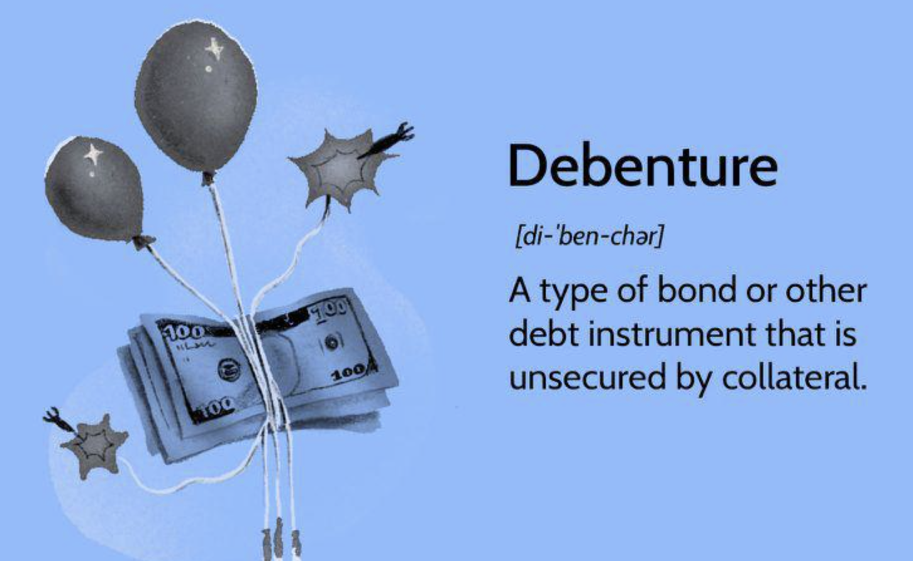

## Table of Contents

## What are debentures?

Debentures are a type of debt instrument that companies use to borrow money from the public. When a company issues debentures, it is essentially taking out a loan from investors. In return, the company promises to pay back the borrowed amount on a specific date and also pays interest to the investors at regular intervals, usually every year or every six months. Unlike shares, debentures do not give the investor any ownership in the company.

Debentures can be secured or unsecured. Secured debentures are backed by the company's assets, which means if the company fails to repay the loan, the assets can be sold to pay the investors. Unsecured debentures, on the other hand, do not have this backing and are riskier for investors. Companies often use debentures to raise funds for expansion, new projects, or to manage their cash flow. They are a popular way for companies to get the money they need without giving up ownership.

## What are bonds?

Bonds are a type of loan that people can buy from governments or companies. When you buy a bond, you are lending money to the issuer, like a government or a company. In return, they promise to pay you back the money you lent them on a certain date, called the maturity date. They also pay you interest regularly, usually every year or every six months, until the bond matures.

Bonds can be safe investments because they often come with a promise to pay back the money. Governments usually have a good track record of paying back their bonds. Companies might offer higher interest rates on their bonds to attract investors, but they can be riskier if the company has financial problems. People buy bonds to earn interest and to keep their money safe, especially when they want to invest without taking too much risk.

## How do debentures differ from bonds in terms of security?

Debentures and bonds are both ways for companies or governments to borrow money, but they can differ in terms of security. A debenture can be either secured or unsecured. If it's secured, it means the company has promised to use some of its assets as a backup plan. If the company can't pay back the money, those assets can be sold to help pay the investors. But if a debenture is unsecured, there's no such backup plan, making it riskier for the people who buy them.

Bonds, on the other hand, are usually thought of as more secure. Many bonds are backed by the issuer's promise to pay, and some are even backed by specific assets or the full faith and credit of a government. This means that if you buy a government bond, you're generally seen as having a safer investment because governments rarely fail to pay back their debts. So, while both debentures and bonds can be secure, bonds are often seen as less risky, especially if they come from a stable government.

## What are the typical interest rates for debentures versus bonds?

Interest rates for debentures can vary a lot depending on how safe the company is and how the economy is doing. If a company is risky, it might have to offer higher interest rates to get people to buy its debentures. For example, a small, new company might offer 8% or more, while a big, well-known company might only need to offer around 4% to 6%. The economy also matters; if things are going well, rates might be lower, but if things are uncertain, rates might go up.

Bonds usually have lower interest rates than debentures because they're often seen as safer. Government bonds, especially from stable countries, might offer rates as low as 1% to 3%. Company bonds can be a bit higher, maybe around 3% to 5% if the company is strong. But if the bond is from a riskier company, the rate could go up to 6% or more. Just like with debentures, the economy plays a big role in setting these rates.

## How does the maturity period of debentures compare to that of bonds?

The maturity period for debentures can be short or long, depending on what the company needs. Usually, debentures can last anywhere from a few years to over 10 years. If a company wants to raise money quickly, it might issue debentures with a shorter maturity, like 2 to 5 years. But if the company is planning something big and needs money for a longer time, it might go for debentures that last 10 to 30 years.

Bonds also have different maturity periods, but they often come in a few common lengths. Government bonds can be short-term, lasting a few months to a few years, or long-term, lasting 10 to 30 years. Company bonds tend to have longer maturities, often between 5 to 30 years. The choice of maturity depends on what the issuer needs the money for and how long they want to borrow it for. Both debentures and bonds give investors a chance to earn interest over time, but the length of time can vary a lot.

## What are the tax implications of investing in debentures versus bonds?

When you invest in debentures, the interest you earn is usually considered regular income. This means you have to pay taxes on it at your normal income tax rate. If you get a lot of interest from debentures, it can push you into a higher tax bracket, which means you might have to pay more in taxes. Some debentures might offer tax benefits, but it depends on the specific terms and the country you live in. Always check with a tax advisor to understand how your debenture investments will affect your taxes.

For bonds, the tax treatment can be a bit different. The interest you earn from bonds is also taxed as regular income, similar to debentures. However, some bonds, like government bonds, might have special tax treatments. For example, in some countries, interest from certain government bonds might be tax-free or taxed at a lower rate. Company bonds don't usually have these special treatments, so you'll pay regular income tax on the interest. It's always a good idea to talk to a tax professional to get a clear picture of how your bond investments will impact your taxes.

## How do the credit ratings of debentures and bonds affect their investment appeal?

Credit ratings are like report cards for debentures and bonds. They tell investors how likely it is that the company or government will pay back the money they borrowed. If a debenture or bond has a high credit rating, it means it's seen as safe and reliable. Investors like these because they feel more secure that they will get their money back with interest. A high rating can make the debenture or bond more appealing, even if the [interest rate](/wiki/interest-rate-trading-strategies) is lower, because the risk is lower.

On the other hand, if a debenture or bond has a low credit rating, it means there's a higher chance the issuer might not pay back the money. To attract investors, these might offer higher interest rates to make up for the extra risk. Some investors might be okay with this because they're looking for higher returns, but others might stay away because they don't want to take the chance. So, the credit rating can really change how appealing a debenture or bond is to different kinds of investors.

## What are the conversion options available for debentures and bonds?

Some debentures come with the option to convert them into shares of the company. This means that instead of getting your money back when the debenture matures, you can choose to get shares in the company instead. This can be a good deal if the company is doing well and its share price is going up. But if the company is not doing so well, you might prefer to get your money back instead. The choice to convert depends on what you think is best for your investment.

Bonds usually don't come with conversion options like debentures do. When you buy a bond, you expect to get your money back with interest when it matures. Some special types of bonds, called convertible bonds, do let you turn them into shares, but these are less common. Most of the time, if you want to invest in something that can be converted into shares, you would look at debentures instead of regular bonds.

## How does the liquidity of debentures compare to that of bonds in the secondary market?

Debentures and bonds can both be traded in the secondary market, but their [liquidity](/wiki/liquidity-risk-premium) can be different. Liquidity means how easily you can buy or sell something without affecting its price too much. Debentures might be less liquid because they are often issued by companies, and not as many people might want to buy them. If a company isn't well-known or if its debentures are seen as risky, it can be harder to find someone to buy them from you. This means you might have to wait longer or accept a lower price to sell your debentures.

Bonds, especially those issued by governments, tend to be more liquid. Many people and institutions are interested in buying government bonds because they are seen as safe investments. This means you can usually sell your government bonds more easily and at a price closer to what you paid for them. Company bonds can be less liquid than government bonds but might still be easier to trade than debentures, depending on the company's reputation and the bond's credit rating. Overall, bonds generally have better liquidity in the secondary market compared to debentures.

## What are the regulatory differences between issuing debentures and bonds?

When a company wants to issue debentures, it has to follow certain rules set by the government or financial authorities. These rules can be different depending on where the company is located. For example, in some places, companies need to get approval from a regulatory body before they can issue debentures. They also have to give a lot of information to investors about the risks and how they plan to use the money. This is to make sure that investors know what they are getting into and that the company is being honest about its financial situation.

Bonds also have to follow rules, but these can be different from the ones for debentures. Governments usually have their own set of rules for issuing bonds, which are often less strict because governments are seen as safer borrowers. Companies issuing bonds have to follow similar rules to those for debentures, like getting approval and providing information to investors. But the details can vary, and sometimes bonds might have more specific regulations, especially if they are issued in different countries or if they are special types of bonds like municipal bonds.

## How do debentures and bonds fit into different investment strategies?

Debentures can be a good choice for people who want to earn more money from their investments but are okay with taking a bit more risk. They usually offer higher interest rates than bonds, which can be attractive if you're looking to grow your money faster. But because they can be riskier, especially if they're not backed by the company's assets, they might fit better in a strategy where you're willing to take chances for potentially bigger rewards. If you believe in the company's future and think it will do well, converting your debentures into shares could also be a way to benefit from the company's growth.

Bonds, on the other hand, are often seen as safer investments. They're a good fit for people who want a steady income without too much risk. Government bonds, in particular, are very safe because governments usually pay back their debts. If you're planning for retirement or just want to keep your money safe, bonds can be a big part of your strategy. They offer regular interest payments, which can help you live off your investments or save up over time. While they might not grow your money as fast as debentures, their reliability makes them a cornerstone for many conservative investment plans.

## What are the advanced risk management considerations when choosing between debentures and bonds?

When choosing between debentures and bonds, one important risk to think about is how likely the company or government is to pay you back. Credit ratings can help you understand this risk. Bonds from strong governments usually have high ratings, which means they are safer. Debentures from smaller or less stable companies might have lower ratings, making them riskier. If you want to keep your money safe, you might prefer bonds with high ratings. But if you're okay with taking more risk for a chance at higher returns, debentures could be a better fit.

Another thing to consider is how easy it will be to sell your investment if you need to. Bonds, especially government ones, are usually easier to sell because lots of people want to buy them. This makes them more liquid, which can be important if you might need your money back quickly. Debentures can be harder to sell, especially if they're from a company that's not well-known. This lower liquidity means you might have to wait longer or accept a lower price if you need to sell. So, if having quick access to your money is important, bonds might be the better choice.

## References & Further Reading

[1]: Fabozzi, F. J., & Mann, S. V. (2012). ["The Handbook of Fixed Income Securities,"](https://www.amazon.com/Handbook-Fixed-Income-Securities-Ninth/dp/1260473899) 8th Edition. McGraw-Hill Education.

[2]: Lopez de Prado, M. (2018). ["Advances in Financial Machine Learning."](https://www.amazon.com/Advances-Financial-Machine-Learning-Marcos/dp/1119482089) Wiley.

[3]: Aronson, D. (2006). ["Evidence-Based Technical Analysis: Applying the Scientific Method and Statistical Inference to Trading Signals."](https://www.amazon.com/Evidence-Based-Technical-Analysis-Scientific-Statistical/dp/0470008741) Wiley.

[4]: Chan, E. P. (2008). ["Quantitative Trading: How to Build Your Own Algorithmic Trading Business."](https://github.com/egorpe/EPChan-QuantitativeTrading/blob/master/example7_6.m) Wiley.

[5]: Jansen, S. (2020). ["Machine Learning for Algorithmic Trading."](https://github.com/stefan-jansen/machine-learning-for-trading) Packt Publishing.

[6]: Hull, J. C. (2018). ["Options, Futures, and Other Derivatives."](https://www.semanticscholar.org/paper/Options%2C-Futures%2C-and-Other-Derivatives-Hull/89bdee500c8623864fc9eb7a471546aa713acc44) Pearson.

[7]: Narang, R. K. (2009). ["Inside the Black Box: A Simple Guide to Quantitative and High-Frequency Trading."](https://onlinelibrary.wiley.com/doi/book/10.1002/9781118267738) Wiley.