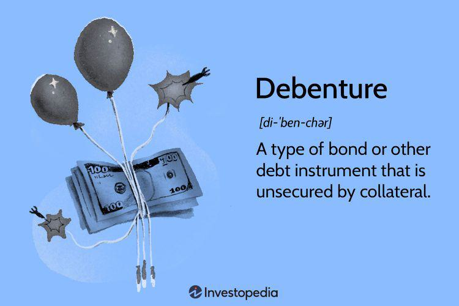

The financial instruments market plays a crucial role in the global economy, serving as a fundamental platform for raising capital and managing risk. It includes a variety of products such as stocks, bonds, debentures, derivatives, and more, each offering unique attributes catering to diverse investment strategies and risk appetites. This diversity provides opportunities for investors to tailor their portfolios to align with their financial objectives, and to manage risk through informed decision-making.

Debentures and bonds are essential components of the debt securities market. Bonds are typically secured debt instruments, often issued by governments and corporations to raise long-term capital. Debentures, on the other hand, can be either secured or unsecured and are used by corporations to borrow money. These instruments are attractive to investors seeking regular interest income and relative safety compared to equity investments. Understanding the distinctions between bonds and debentures, such as their risk profiles, security, and convertibility options, is vital for effective portfolio management. Debentures, for instance, offer flexibility with variations like convertible and non-convertible forms, providing investors with opportunities for conversion to equity or fixed returns until maturity.



Algorithmic trading has become increasingly prominent within financial markets, driven by technological advancements and the pursuit of increased efficiency and accuracy in trading activities. By using complex algorithms and high-speed computing, this form of trading executes large orders based on a range of predetermined criteria, exploiting market inefficiencies and responding to market movements within fractions of a second. The precision and speed offered by algorithmic trading can optimize trading strategies, including those involving debentures and bonds, by improving liquidity and minimizing transaction costs.

For investors, understanding debentures, bonds, and algorithmic trading is crucial to making informed and strategic investment decisions. This article will discuss the specificities of debentures and bonds, explore the intricacies of algorithmic trading, and examine how these components can be integrated for enhanced investment outcomes. By the end of this exploration, investors will be better equipped to navigate the financial instruments market, leveraging these sophisticated tools for portfolio diversification and risk management.

## Table of Contents

## Understanding Debentures and Bonds

Debentures and bonds play a crucial role in the financial markets by offering mechanisms for raising capital and providing investment opportunities. Although they are often used interchangeably, debentures and bonds have distinct characteristics.

Debentures are a type of debt instrument unsecured by physical assets or collateral. They rely on the creditworthiness and reputation of the issuer, typically a corporation or government, and carry a fixed interest rate. Debentures serve as a convenient tool for raising capital, allowing institutions to fund projects or manage debt without having to part with equity. This aligns their interests with those of the investors seeking fixed returns.

In contrast, bonds are often secured by specific assets, providing an additional layer of security for investors. This makes bonds generally considered less risky compared to unsecured debentures. Secured bonds are backed by collateral, meaning that in the case of issuer default, bondholders have a claim on the company's assets to recoup their investments. Conversely, unsecured debentures offer no such claim, exposing investors to higher risk but potentially higher returns.

Various types of debentures cater to different investment strategies and issuer needs. Convertible debentures provide the option to convert debt into equity shares after a specified period or upon reaching predetermined conditions, combining features of both equity and debt. Non-convertible debentures do not offer this conversion feature and usually compensate with a higher [interest rate](/wiki/interest-rate-trading-strategies). Debentures can also be either secured or unsecured, with secured ones backed by the issuer's specific assets, offering more protection to investors compared to unsecured ones.

Investing in debentures offers both risks and benefits. The primary advantage is the potential for higher returns, especially with unsecured or convertible debentures. Investors also gain predictable income streams through fixed interest payments. However, the risks include the issuer's potential default and interest rate fluctuations that may affect the debenture's market value. Therefore, investors must carefully assess the issuer's creditworthiness and economic conditions before investing.

Understanding these instruments, their characteristics, and associated risks is crucial for making informed investment decisions and effectively managing a diversified portfolio.

## Algorithmic Trading in the Financial Market

Algorithmic trading, often referred to as algo trading, represents a modern innovation in the financial market, where computer algorithms execute trades at speeds and frequencies that humans cannot match. As of 2023, its relevance has grown significantly, reshaping how securities, including debentures and bonds, are traded. 

Algorithms in trading are essentially predefined sets of rules and mathematical models that enable computers to [carry](/wiki/carry-trading) out trading activities automatically. These algorithms can analyze enormous datasets, identify trends, and execute buy or sell orders based on market conditions. This capability optimizes the trading of debentures and bonds by enabling traders to take advantage of even the smallest price discrepancies, which are often unnoticed in manual trading.

The advantages of [algorithmic trading](/wiki/algorithmic-trading) are manifold. Speed is one of the most prominent benefits, as algorithms can analyze and execute trades in milliseconds. This rapid execution can make a significant difference in a market where price changes occur in fractions of seconds. Precision is another crucial advantage as algorithms minimize human errors, executing trades exactly as programmed without deviation. Additionally, algorithmic trading allows for comprehensive market analysis. By leveraging big data and [machine learning](/wiki/machine-learning) techniques, algorithms can parse complex market conditions, identify patterns, and forecast future movements more accurately than traditional methods.

The introduction of algorithmic trading has notably affected the [liquidity](/wiki/liquidity-risk-premium) and [volatility](/wiki/volatility-trading-strategies) of markets involved in trading debentures. Enhanced market liquidity results from the [high frequency](/wiki/high-frequency-trading) of trades executed by algorithms, which ensures that buy and sell orders are continually matched. However, this can also lead to increased volatility. Algorithms that react to the same market signals simultaneously can cause rapid fluctuations in prices, necessitating robust risk management strategies.

Several algorithmic trading strategies are employed in the financial market. Arbitrage exploits price differences of identical or similar financial instruments across different markets. Mean reversion is based on the concept that prices and returns eventually return to their mean or average level. Momentum trading involves algorithms spotting and capitalizing on emerging trends, predicting that they will continue. A sample Python implementation of a simple [momentum](/wiki/momentum) trading strategy might involve calculating a moving average and executing trades based on its convergence or divergence from the current market price:

```python
import numpy as np

def moving_average(prices, window_size):
    return np.convolve(prices, np.ones(window_size)/window_size, mode='valid')

def momentum_strategy(prices, short_window, long_window):
    short_ma = moving_average(prices, short_window)
    long_ma = moving_average(prices, long_window)

    signals = np.zeros(len(short_ma))
    signals[short_ma > long_ma] = 1   # Buy signal
    signals[short_ma < long_ma] = -1  # Sell signal

    return signals

# Example price data and strategy execution
prices = np.random.rand(500) * 100  # Simulated price data
signals = momentum_strategy(prices, short_window=20, long_window=50)
```

In conclusion, algorithmic trading has introduced a paradigm shift in how debentures and bonds are traded, offering speed, precision, and advanced market analysis. While enhancing market liquidity, it also brings challenges such as increased volatility. The continuous evolution of algorithmic models promises further innovation, creating opportunities and challenges for investors.

## Integration of Algo Trading with Debenture Investments

Algorithmic trading is revolutionizing the approach to debenture investments by employing sophisticated algorithms and computing power to analyze market conditions and execute trades with unmatched speed and accuracy. This integration optimizes investment strategies by leveraging technology to make data-driven decisions, thereby enhancing the potential for returns while minimizing human error and emotional biases.

### Enhancing Debenture Investment Strategies

Algorithmic trading systems are designed to process vast amounts of financial data at high speeds, allowing for real-time market analysis and decision-making. These algorithms use historical data and statistical models to predict market trends, optimize timing for transactions, and select the best debentures for investment. In this context, algorithmic trading can enhance debenture investment strategies by evaluating interest rate trends, credit risk assessments, and market liquidity conditions to select suitable instruments.

Python, a programming language widely used in finance, provides tools such as libraries for machine learning (e.g., scikit-learn) and data analysis (e.g., pandas, NumPy) to develop models that can enhance debenture trading. For example, a simple Python snippet to execute algorithmic trading might look like this:

```python
import numpy as np
import pandas as pd

# Sample data representing debenture yields
data = pd.DataFrame({
    'date': pd.date_range(start='1/1/2023', periods=100),
    'yield': np.random.rand(100) * 5 + 2  # Random yields between 2% and 7%
})

# Calculate moving average to identify trends
data['moving_avg'] = data['yield'].rolling(window=5).mean()

# Example trading strategy: Buy when yield is above moving average
data['signal'] = np.where(data['yield'] > data['moving_avg'], 'Buy', 'Hold')

print(data[['date', 'yield', 'moving_avg', 'signal']].tail())
```

### Benefits of Integrating Technology

Integrating algorithmic trading with traditional debenture investments offers several advantages. The primary benefit is speed. Algorithms can execute trades in milliseconds, capturing opportunities that would be impossible to harness manually. Precision is another advantage; algorithms can be customized to follow strict guidelines, ensuring consistency in trading behavior.

High-frequency trading ([HFT](/wiki/high-frequency-trading-strategies)), characterized by rapid buying and selling, exerts significant influence on price points and market dynamics. HFT algorithms can exploit small price discrepancies between debentures, enhancing liquidity by increasing the number of transactions. However, the rapid pace can also introduce volatility, which may affect pricing unpredictably, representing a challenge for investors.

### Risks and Challenges

Despite the advantages, algorithmic trading in debentures is not without its risks. One significant concern is the over-reliance on algorithms, which may lead to systemic risks if the models fail or encounter unforeseen market conditions. Moreover, algorithmic trading can be susceptible to market manipulation techniques, such as quote stuffing or spoofing.

Another challenge is maintaining and updating algorithms to cope with changing market environments and regulations, which can increase operational costs. Furthermore, with high-frequency trading, there is a risk of exacerbating market downturns, as the rapid unwinding of positions can lead to liquidity shortages and price crashes.

In conclusion, while algorithmic trading holds substantial promise for enhancing debenture investment strategies through enhanced analysis and transaction efficiency, investors must be cognizant of the potential risks. Balancing technological integration with traditional investment wisdom remains crucial for maximizing returns and mitigating risks in the debenture market.

## Advantages and Risks of Combining Debentures with Algo Trading

Combining debentures with algorithmic trading presents a unique opportunity for optimizing investment returns by harnessing the precision and efficiency of modern technology. Algorithmic trading involves the use of complex algorithms to execute trades at speeds and frequencies that are impossible for human traders. This capability enables investors to capitalize on minute market movements, thereby optimizing the returns on investment in debentures. Debentures, being typically lower in volatility compared to equities, can particularly benefit from such precision-based trading approaches.

Algorithmic systems can assess vast amounts of data quickly, enabling precise decision-making. For instance, using historical price data, machine learning algorithms can predict market trends and fluctuations. A simple Python snippet for a basic algorithm might look like this:

```python
import numpy as np
from sklearn.linear_model import LinearRegression

# Simulated data
debenture_prices = np.array([...])  # Array of historical debenture prices
time = np.arange(len(debenture_prices)).reshape(-1, 1)

# Linear regression model
model = LinearRegression()
model.fit(time, debenture_prices)

# Predict future prices
future_times = np.array([...]).reshape(-1, 1)  # Future time indices
predicted_prices = model.predict(future_times)
```

This code illustrates a basic linear regression model to predict future debenture prices. While simplistic, it highlights how algorithms can process historical data to anticipate price movements.

However, algorithmic trading also entails significant risks, particularly due to the potential for erratic market behavior and the mechanical nature of algorithm-based decisions. Algorithms operate based on predefined criteria and data; if market conditions change unexpectedly, these algorithms might make incorrect trades. Additionally, high-frequency trading can exacerbate market volatility, especially in less liquid markets like those for certain debentures.

Managing investment risks requires a balanced approach, incorporating both automated and human supervision. Diversified strategies can mitigate potential downsides. Investment in a mix of various assets, such as equities and fixed-income securities alongside debentures, can cushion the portfolio against market fluctuations. Furthermore, implementing stop-loss limits in the trading algorithms is a practical measure to control downside risk.

Looking towards the future, the integration of more advanced technologies such as [artificial intelligence](/wiki/ai-artificial-intelligence) and machine learning holds immense potential for further refining algorithmic trading strategies with debentures. With continuous development, these technologies could significantly enhance the accuracy and efficiency of trading algorithms, offering investors new ways to maximize returns and manage risks. Investors who adopt these methodologies may be better positioned to adapt to the evolving landscape of financial markets, ensuring more robust and adaptive portfolio strategies in the coming years.

## Conclusion

The financial instruments market, featuring debentures, bonds, and algorithmic trading, plays a pivotal role in modern investment strategies. Debentures, often juxtaposed with bonds, serve as critical tools for raising capital, each with inherent characteristics and risks. Bonds typically represent secured debt, backed by the physical assets of issuing entities, whereas debentures offer unsecured investment options, adding a nuanced layer of risk and return dynamics. Understanding these distinctions enables investors to better evaluate opportunities and potential risks associated with each instrument.

Algorithmic trading has increasingly revolutionized the way investors approach the market, particularly in the trading of debentures and bonds. By leveraging technological advances, algorithmic trading offers advantages such as enhanced speed, precision, and extensive market analysis unavailable through traditional trading methods. Its integration within debenture investment strategies can lead to data-driven decision-making, optimizing portfolio performance through high-frequency and strategic trading practices. However, algorithmic systems also bring potential risks, requiring investors to balance technological efficiency with prudent risk management.

In considering the integration of algorithmic strategies with debenture investments, the potential for optimized returns is significant. By adopting algorithmic trading methodologies, investors can achieve greater precision and efficiency, allowing for adaptability in rapidly changing markets. Nonetheless, reliance on algorithms introduces challenges, particularly concerning market fluctuations and the inherent limitations of algorithmic predictions. Successful integration demands a diversified strategy to manage these risks effectively, ensuring resilience against market volatility.

The future landscape of financial instruments is poised for continued evolution, driven by technological advancements. This evolution offers promising opportunities for portfolio diversification and enhanced performance. Investors are encouraged to consider incorporating these innovative strategies into their portfolios, leveraging the strengths of both traditional and modern investment techniques. As technology and markets continue to evolve, staying informed and adaptable will remain crucial for optimizing investment outcomes in the dynamic world of debentures, bonds, and algorithmic trading.

## References & Further Reading

[1]: Fabozzi, F. J., & Mann, S. V. (2012). ["The Handbook of Fixed Income Securities,"](https://www.amazon.com/Handbook-Fixed-Income-Securities-Ninth/dp/1260473899) 8th Edition. McGraw-Hill Education.

[2]: Lopez de Prado, M. (2018). ["Advances in Financial Machine Learning."](https://www.amazon.com/Advances-Financial-Machine-Learning-Marcos/dp/1119482089) Wiley.

[3]: Aronson, D. (2006). ["Evidence-Based Technical Analysis: Applying the Scientific Method and Statistical Inference to Trading Signals."](https://www.amazon.com/Evidence-Based-Technical-Analysis-Scientific-Statistical/dp/0470008741) Wiley.

[4]: Chan, E. P. (2008). ["Quantitative Trading: How to Build Your Own Algorithmic Trading Business."](https://github.com/egorpe/EPChan-QuantitativeTrading/blob/master/example7_6.m) Wiley.

[5]: Jansen, S. (2020). ["Machine Learning for Algorithmic Trading."](https://github.com/stefan-jansen/machine-learning-for-trading) Packt Publishing.

[6]: Hull, J. C. (2018). ["Options, Futures, and Other Derivatives."](https://www.semanticscholar.org/paper/Options%2C-Futures%2C-and-Other-Derivatives-Hull/89bdee500c8623864fc9eb7a471546aa713acc44) Pearson.

[7]: Narang, R. K. (2009). ["Inside the Black Box: A Simple Guide to Quantitative and High-Frequency Trading."](https://onlinelibrary.wiley.com/doi/book/10.1002/9781118267738) Wiley.