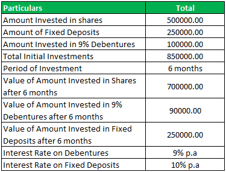

Investing involves choosing among various financial instruments to achieve specific financial goals. Each investment option typically caters to a different type of investor, depending on factors such as risk tolerance, investment horizon, and desired returns. Among the myriad of investment opportunities available, fixed deposits, debentures, and algorithmic trading stand out as unique options that cater to diverse investor profiles.

Fixed deposits, often referred to as time deposits, are considered low-risk investments, especially for those prioritizing security and consistent returns. They offer a fixed interest rate over a specified period, providing a predictable income stream. These instruments appeal to conservative investors seeking safety over higher returns, as they are typically insured by government bodies, such as the Federal Deposit Insurance Corporation (FDIC) in the United States.

In contrast, debentures represent unsecured debt instruments used by corporations or governments to raise capital. These carry a higher risk compared to secured bonds because they are not backed by physical assets; instead, they rely on the issuer's creditworthiness. As a result, debentures may offer higher returns to compensate for this additional risk. They are attractive to investors seeking more substantial potential gains, albeit with an accompanying increase in risk.

Algorithmic trading, often abbreviated as algo trading, has gained traction among professional traders and financial institutions. This modern investment approach uses pre-programmed strategies and computer algorithms to execute trades based on predefined criteria. Its appeal lies in its ability to offer speed, precision, and the elimination of emotional decision-making. This option attracts those with a tolerance for technological adaptation and a preference for efficiency in executing trading strategies.

Understanding the characteristics, benefits, and inherent risks associated with fixed deposits, debentures, and algorithmic trading is crucial for making informed investment decisions. This article provides an overview of these distinct investment options, exploring their unique features and the various factors investors should consider when choosing among them. By doing so, investors can better align their selections with their financial goals and risk tolerance, ultimately achieving a more balanced and effective investment portfolio.

## Table of Contents

## Understanding Fixed Deposits

Fixed deposits, often referred to as time deposits, are a popular investment option offered by banks and financial institutions. They provide investors with a fixed interest rate over a specific period, which is agreed upon at the time of investment. This type of investment is considered low-risk and is often used by individuals seeking a safe and predictable return on their savings.

One of the primary features of fixed deposits is their low-risk nature, which is largely due to the insurance provided by government bodies, such as the Federal Deposit Insurance Corporation (FDIC) in the United States. The FDIC insures deposits up to a certain limit, providing a layer of security to investors. This insurance mitigates the risk of loss in case the financial institution experiences insolvency.

When investing in fixed deposits, it is crucial for investors to understand the terms associated with the investment. These terms include the [interest rate](/wiki/interest-rate-trading-strategies), which remains constant throughout the deposit period, and the maturity period, which is the duration for which the funds are locked in. Common maturity periods range from a few months to several years, and the interest rate typically correlates with the length of the term—the longer the maturity, the higher the interest rate offered.

Investors should also be aware of the potential penalties associated with early withdrawal of funds from a fixed deposit. Since these deposits are intended to remain intact for the agreed-upon term, withdrawing funds prematurely can result in penalties which might include a reduction in the interest earned or a fixed fee. Consequently, it is important to plan the deposit period carefully and choose a term that aligns with the investor's financial goals and [liquidity](/wiki/liquidity-risk-premium) needs.

In summary, fixed deposits are a stable and low-risk investment option, offering insured returns and predictable outcomes. However, investors must carefully consider the interest rates, maturity periods, and penalties for early withdrawal to maximize their investment's benefits.

## Exploring Debentures

Debentures are unsecured debt instruments issued by corporations or governments to raise capital. Unlike secured bonds, debentures do not have collateral backing them, which means that they rely heavily on the creditworthiness and reputation of the issuer. This lack of security makes debentures riskier compared to secured debt instruments, as the investors' returns are dependent on the issuer's financial stability and ability to repay the debt. Consequently, debentures often offer higher yields to compensate for the increased risk.

Debentures possess several key features that distinguish them from other types of debt instruments. They may come with either fixed or floating interest rates. Fixed interest rates provide investors with a predictable stream of income throughout the life of the debenture, while floating rates may vary based on changes in a benchmark interest rate, such as LIBOR or the federal funds rate.

Additionally, debentures may offer the possibility of conversion into equity shares of the issuing organization. This convertible feature provides investors with the potential for capital appreciation if the company's stock performs well. Conversion conditions, such as conversion price and period, are typically predefined in the debenture agreement. This feature provides both risks and potential rewards, as the investment may initially start as a debt instrument offering regular interest payments but could later convert into equity with the associated risks and potential for profit linked to stock ownership.

The evaluation of debentures involves assessing the issuer's creditworthiness, which can be indicated by ratings from credit rating agencies such as Moody's, Standard & Poor's, or Fitch. High credit ratings suggest a lower risk of default, while lower ratings imply higher risk. Investors must balance the potential for higher returns against the possible trajectory of default, assessing both the economic environment and the specifics of the issuer.

In summary, debentures are versatile financial instruments that offer varying degrees of risk and return, depending on their structural features and the issuer's credit quality. These characteristics make them a potentially lucrative, albeit riskier, investment for those with the appropriate risk tolerance and insight into creditworthiness factors.

## Algorithmic Trading: A Modern Approach

Algorithmic trading, often known as algo trading, involves the use of computer algorithms to automate trading processes. This modern approach employs pre-programmed instructions based on various financial criteria—such as timing, price, and [volume](/wiki/volume-trading-strategy)—to execute trades. By relying on a set of predefined rules, [algorithmic trading](/wiki/algorithmic-trading) minimizes human intervention, offering benefits such as speed, precision, and the elimination of emotional biases in decision-making processes.

Algo trading has gained significant popularity among professional traders and financial institutions. The key advantage lies in its ability to swiftly process vast quantities of market data and execute trades at optimal prices. This efficiency is critical in markets where the speed of execution can significantly impact profitability. Moreover, by removing emotion-driven decisions, algo trading provides a level of discipline that is hard to achieve through manual trading.

There are several strategies within algorithmic trading that cater to different investment goals. One prominent strategy is trend-following, which relies on identifying and capitalizing on market trends. Trend-following algorithms analyze historical data to detect patterns and align trades with ongoing market movements, thus attempting to profit from continuing trends.

Another common strategy is [arbitrage](/wiki/arbitrage), where algorithms are designed to exploit price discrepancies of the same asset in different markets. By executing high-frequency trades, these algorithms aim to buy low and sell high simultaneously across different platforms, capturing profit from minute price differences.

Additional strategies include market-making, where algorithms provide liquidity by quoting both buy and sell prices, and mean reversion, which assumes that prices will eventually revert to their historical averages. Each strategy carries its risk-reward profile and requires a deep understanding of market dynamics to be effective.

By leveraging these sophisticated strategies, algorithmic trading tailors investment approaches to meet diverse financial goals. However, investors need to maintain a robust understanding of market conditions and ensure that their algorithms are well-tested and equipped to handle [volatility](/wiki/volatility-trading-strategies) and unexpected market events. As such, algorithmic trading represents a fusion of technology and financial acumen, driving innovation in investment strategies.

## Comparing the Investment Options

Each investment option presents unique benefits and caters to different investor preferences. Fixed deposits are favored for their stability and low risk, as they provide a guaranteed return over a specified period. This predictability is particularly appealing to risk-averse investors who prioritize capital preservation. The low-risk nature is amplified by deposit insurance in many countries, which protects investors up to a certain amount should a bank default.

Debentures, on the other hand, are unsecured debt instruments that offer potentially higher returns. They rely on the issuer's creditworthiness, presenting higher risk compared to fixed deposits. The interest rate on debentures may be fixed or floating, and they can sometimes be converted into equity shares, providing an additional avenue for growth if the issuing company's stock appreciates. Investors seeking higher yields, and who are comfortable with risk, may find debentures an attractive component of their portfolio.

Algorithmic trading represents a modern investment approach characterized by automatically executing trades through pre-programmed software based on specific criteria. This method offers substantial benefits, including speed, accuracy, and the elimination of emotional bias in trading decisions. By leveraging algorithms, investors can capitalize on market inefficiencies, employ strategies like trend-following and arbitrage, and adapt quickly to market movements.

When choosing among these options, investors must thoroughly assess their risk tolerance and financial objectives. For those with a low-risk appetite, fixed deposits might be the preferred choice. Conversely, investors willing to accept greater risk for the possibility of higher returns might consider debentures. Those intrigued by technology and seeking to enhance trading efficiency could explore algorithmic trading.

Market trends and conditions also play a significant role in decision-making. For instance, in a low-interest-rate environment, the appeal of fixed deposits might diminish, pushing investors towards higher-yielding options like debentures or algorithmic strategies. Conversely, volatile markets might strengthen the case for algorithmic trading due to its ability to swiftly execute trades and adapt strategies in response to rapid market changes.

Ultimately, the decision to opt for traditional or modern investment methods hinges on a combination of personal risk tolerance, financial goals, and current market conditions. A well-considered investment strategy that incorporates both stable and dynamic elements can effectively balance risk and reward, leading to more robust portfolio results.

## Conclusion

Fixed deposits, debentures, and algorithmic trading each contribute uniquely to an investment portfolio. These options cater to varying investor objectives, ranging from pursuing stability and security to seeking higher returns and leveraging modern technology. By meticulously evaluating the inherent characteristics of each investment avenue, investors can devise a balanced portfolio that reflects their individual risk tolerance and financial aspirations.

Fixed deposits are synonymous with a low-risk, stable return investment, primarily appealing to conservative investors. They offer certainty through a predetermined interest rate, albeit at the cost of lower potential returns and limited liquidity. Debentures, in contrast, provide opportunities for higher returns, contingent on the issuer's creditworthiness. The inclusion of fixed or floating interest rates and conversion features adds layers of risk and reward, appealing to those who are willing to embrace moderate risk in pursuit of enhanced yields.

Algorithmic trading stands at the forefront of modern investing, utilizing sophisticated algorithmic strategies to maximize trading efficiency and precision. This approach suits investors seeking to capitalize on speed and technology to optimize trading outcomes, largely free from emotional biases.

To maximize investment outcomes, staying informed on market trends, economic indicators, and technological advances is crucial. This proactive approach allows for timely adjustments to investment strategies, ensuring alignment with evolving market conditions and investment goals. By dynamically balancing these diverse investment options, investors can achieve a diversified portfolio that not only mitigates risk but also enhances potential returns, accommodating both stable and dynamic investment strategies.

## References & Further Reading

[1]: Merton, R. C. (1992). ["Continuous-Time Finance"](https://archive.org/details/continuoustimefi0000mert_u0y5). Wiley-Blackwell.

[2]: Mishkin, F. S. (2019). ["The Economics of Money, Banking, and Financial Markets"](https://www.pearsonhighered.com/assets/preface/0/1/3/4/0134855388.pdf). Pearson.

[3]: Chance, D. M., & Brooks, R. (2015). ["An Introduction to Derivatives and Risk Management"](https://books.google.com/books/about/Introduction_to_Derivatives_and_Risk_Man.html?id=b8PgBQAAQBAJ). Cengage Learning.

[4]: Fabozzi, F. J. (2007). ["Fixed Income Analysis"](https://www.amazon.com/Fixed-Income-Analysis-Frank-Fabozzi/dp/047005221X). CFA Institute Investment Series.

[5]: Aldridge, I. (2013). ["High-Frequency Trading: A Practical Guide to Algorithmic Strategies and Trading Systems"](https://www.amazon.com/High-Frequency-Trading-Practical-Algorithmic-Strategies/dp/1118343506). Wiley Trading.