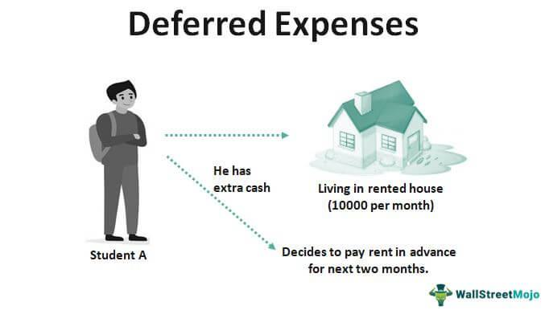

This article explores the role of deferred and prepaid expenses in financial accounting with a special focus on their application in algorithmic trading. Understanding these expenses is crucial for accurate financial reporting and strategic planning. Deferred expenses, which are costs incurred but not immediately expensed, can significantly influence a company’s balance sheet over multiple accounting periods. On the other hand, prepaid expenses, such as insurance premiums or rent payments made in advance, are recognized as current assets and impact short-term financial statements as they are consumed. 

Algorithmic trading, characterized by high-frequency trade execution using automated systems, necessitates precise financial tracking. Misclassification of deferred and prepaid expenses can lead to inaccurate financial statements, affecting decision-making processes and strategic outcomes in such fast-paced environments. By accurately managing these expenses, companies can better allocate capital, optimize financial strategies, and enhance operational efficiency. This article aims to demystify these concepts, addressing their financial implications, accounting practices, and strategic advantages, ultimately providing business insights that can support the financial health of companies engaged in algorithmic trading.



## Table of Contents

## Understanding Deferred Expenses in Financial Accounting

Deferred expenses, often referred to as deferred charges, represent costs that a company has incurred but has not yet recognized as expenses on its financial statements. These expenses are considered long-term assets on the balance sheet because they provide future economic benefits and their impact is spread over several accounting periods rather than being recognized immediately. This approach is consistent with accrual accounting principles, which dictate that expenses should be matched with the revenues they help generate.

The process of handling deferred expenses involves the initial recording of an incurred cost as an asset, which is then gradually expensed over the periods in which the related benefits are realized. Common examples of deferred expenses include costs related to bond issuance, startup costs for new business ventures, and certain advertising expenses that have long-term implications.

For instance, when a company issues bonds, it may incur significant costs such as underwriting fees, legal fees, and other administrative expenses. These issuance costs do not provide any immediate direct benefit and are thus recorded as a deferred expense. Over the life of the bond, these costs are amortized, meaning a portion of the deferred expense is recognized as an expense in each accounting period until the bond matures.

Similarly, startup costs for new business operations are often substantial and can encompass a range of expenditures, including legal fees for establishing a new entity, market research, and the initial cost of employee training. Given these costs do not correlate immediately with revenues, they are capitalized as deferred expenses and expensed gradually as the business begins to realize its revenue potential.

Advertising costs can also serve as deferred expenses when a company anticipates that the advertising campaign will benefit the business over multiple periods. For example, a comprehensive advertising campaign designed to build brand awareness might be expected to generate sales well beyond the current fiscal year. In such cases, the costs may be amortized over the periods during which the revenues are expected to be derived.

The concept of deferred expenses is integral to financial accounting as it underpins the matching principle, ensuring that income statements accurately reflect the costs associated with generating specific revenues. This not only aids in achieving a more accurate picture of a company’s financial performance over time but also supports strategic financial planning by aligning costs with the revenues they are intended to produce.

## The Role of Prepaid Expenses

Prepaid expenses are financial transactions where payments are made in advance for goods or services to be received or used within a fiscal year. As part of a company’s current assets, prepaid expenses initially appear on the balance sheet and are gradually expensed on the income statement as the benefit from the goods or services is realized. This classification is crucial as it reflects the true nature of expenses, offering insights into the company’s short-term financial health and enabling more precise budgeting and planning.

Examples of prepaid expenses commonly found in business operations include insurance premiums, rent payments, and taxes. For instance, if a company pays an annual insurance premium upfront, the total cost is recorded as a prepaid expense and expensed monthly over the policy period. The accounting entry begins with a debit to the prepaid expense account, increasing the asset, and a corresponding credit to cash or accounts payable, reflecting the cash outflow or liability.

By allocating these expenses across the period they pertain to, businesses align with the matching principle of accounting, which ensures that expenses are recognized in the same period as the revenues they help generate. This methodology not only enhances the accuracy of financial reporting but also aids in effective short-term financial planning. By recognizing prepaid expenses, businesses avoid inflating current period expenses, thus preventing distorted views of profitability.

The practical impact of managing prepaid expenses can be further illustrated through an example in Python, showcasing how to automate part of the accounting process:

```python
def update_prepaid_expense(prepaid_balance, monthly_expense):
    """
    Update prepaid expense balance monthly.

    :param prepaid_balance: Initial prepaid expense balance
    :param monthly_expense: Monthly allocation of expense
    :return: Updated balance after monthly expense
    """
    return prepaid_balance - monthly_expense

# Example Usage
initial_balance = 12000  # Assume a 10k annual prepaid expense
monthly_allocation = 1000
updated_balance = update_prepaid_expense(initial_balance, monthly_allocation)
print(f"Updated Prepaid Expense Balance: ${updated_balance}")
```

This code snippet updates the prepaid expense account by allocating a fixed monthly expense, thereby automating a part of the tracking process. Accurate management and recording of prepaid expenses require rigor in financial processes, ensuring that all advance payments are accounted for and appropriately expensed according to the consumption or benefit received. 

Understanding and managing prepaid expenses equip businesses with the tools to create precise short-term forecasts and budgets, essential for maintaining financial stability and achieving operational goals. Aligning assets with actual consumption patterns not only aids in financial transparency but also underpins sound fiscal management strategies.

## Key Differences Between Deferred and Prepaid Expenses

Deferred expenses and prepaid expenses are two fundamental concepts in financial accounting, each with distinct characteristics and implications for a company's financial statements. Understanding the key differences between these two types of expenses is crucial for proper financial reporting and strategic decision-making.

Deferred expenses, also known as deferred charges, are considered long-term assets. These costs are incurred but not recognized as expenses immediately; instead, they are capitalized and gradually amortized over time. This approach aligns with the accrual accounting principle, where expenses are matched with the revenue they generate. Examples include costs incurred for issuance of bonds, startup costs, and certain types of advertising expenses. These expenses appear on the balance sheet as long-term assets and are systematically reduced through amortization, impacting the income statement incrementally over multiple periods.

In contrast, prepaid expenses are payments made in advance for goods or services to be received within a future, typically short-term, period. As current assets, they are recorded on the balance sheet and converted into expenses as the underlying goods or services are consumed. Common prepaid expenses include insurance premiums, rent, and taxes. Prepaid expenses are important for short-term financial planning, as they affect the net income promptly when the associated benefits expire.

The primary differences between deferred and prepaid expenses stem from their classification on the balance sheet and their impact on the income statement. Deferred expenses, due to their long-term nature, affect net income over an extended period, spreading their cost more evenly, which can stabilize reported earnings. Prepaid expenses, on the other hand, directly influence net income in the short term, as the associated costs are recognized as expenses once the benefits are realized.

From an accounting compliance perspective, accurately classifying expenses as deferred or prepaid is essential. This classification ensures adherence to established accounting standards, such as the Generally Accepted Accounting Principles (GAAP) or International Financial Reporting Standards (IFRS), depending on the jurisdiction. Misclassification can lead to misleading financial statements, which can affect stakeholders' perceptions and financial decisions.

In summary, understanding the differences between deferred and prepaid expenses allows businesses to achieve precise financial reporting. Effective classification and management of these expenses are vital for maintaining compliance with accounting standards and for providing a truthful depiction of a company’s financial position and performance.

## Impact on Financial Statements

Proper management of deferred and prepaid expenses is essential for ensuring that both income statements and balance sheets are accurate reflections of a company's financial health. Deferred and prepaid expenses have distinct impacts on financial statements due to their different natures and timing in expense recognition.

Deferred expenses, often classified as long-term assets, are costs incurred but not yet fully expensed. These expenses are amortized over time, matching the expense to the revenue they help generate, which adheres to the accrual accounting principle. This allocation results in a gradual reduction of net income over multiple accounting periods. For example, consider the issuance of premium advertising in a long-term contract. The initial outlay for the campaign is recognized as a deferred expense and amortized over the duration of its utility.

Prepaid expenses, on the other hand, are payments made in advance for goods or services that will be consumed within a year. They are treated as current assets until the benefit is realized, turning them into expenses in shorter periods. This transition can affect the net income more immediately compared to deferred expenses. For instance, an insurance premium paid in advance for an annual policy is recorded as a prepaid expense and expensed monthly as time elapses.

### Journal Entries and Adjustments

The recording and adjustment of these expenses in accounting require careful journal entries. For prepaid expenses, at the time of payment, the entry is a debit to the prepaid expense account and a credit to cash. As the service is consumed, an adjustment is made, debiting the expense account and crediting the prepaid expense account. 

```plaintext
# Example of journal entry for prepaid expenses upon payment
Prepaid Expense  XXX
     Cash                        XXX

# Adjusting entry for recognition of expense
Expense Account      XXX
     Prepaid Expense       XXX
```

For deferred expenses, the initial journal entry involves a debit to the deferred expense account and a credit to cash. Over the useful life of the asset, an amortization entry is made periodically by debiting the expense account and crediting the deferred expense account.

```plaintext
# Example of journal entry for deferred expenses
Deferred Expense  XXX
     Cash                     XXX

# Adjusting entry for amortization of deferred expense
Expense Account      XXX
     Deferred Expense       XXX
```

### Impact on Cash Flows

Mismanagement or misclassification of these expenses can have significant impacts on cash flow statements. Deferred expenses, under amortization, contribute to non-cash expenses on the income statement, while prepaid expenses affect cash outflows at the time of payment but not at the expense recognition point. This distinction highlights the difference in cash flow implications where deferred expenses may increase operational cash flow in periods of amortization through the activity sections in a cash flow statement.

### Implications of Misclassification

Misclassifying these expenses can distort financial reporting and lead to improper strategic decisions. For example, recording a deferred expense as a prepaid expense could prematurely affect net income, leading to inaccurate short-term profitability analysis. Conversely, classifying prepaid expenses as deferred could inflate the balance sheet with improper current assets, potentially misleading stakeholders regarding [liquidity](/wiki/liquidity-risk-premium). Such errors necessitate strict compliance with accounting standards (such as GAAP or IFRS) and continuous training for accounting personnel to ensure that financial statements reflect true economic performance. Proper classification and management lead to transparent and reliable financial records crucial for stakeholders and regulatory bodies alike.

## Strategic Importance in Algorithmic Trading

In [algorithmic trading](/wiki/algorithmic-trading), the precise management of deferred and prepaid expenses holds significant strategic importance. These accounting elements can greatly influence decision-making processes and financial strategies within trading operations. By accurately tracking these expenses, algorithmic trading entities can optimize their capital allocation and implement more effective financial tactics.

Deferred expenses, which are recorded as long-term assets, can be strategically leveraged to smooth out financial performance over time, and in doing so, they help maintain a consistent appearance on financial statements. This, in turn, allows trading firms to focus on long-term strategies without abrupt financial disruptions. On the other hand, prepaid expenses, recognized as current assets, impact short-term financial planning and need to be effectively managed to ensure short-term liquidity and operational efficiency are not compromised.

The fast-paced nature of algorithmic trading necessitates frequent adjustment of financial statements. Given that trades can be executed in fractions of a second, ongoing monitoring and updating of deferred and prepaid expenses become crucial to ensure financial records accurately reflect current economic realities. Maintaining updated and accurate records not only aids compliance but also improves the ability to forecast financial standing and make strategic decisions rapidly.

Moreover, advanced algorithmic models can optimize the timing of expense recognition. By integrating predictive analytics, these models can assess potential financial impacts arising from expense recognitions and adjust trading strategies accordingly. This capability enables trading firms to preemptively adapt to financial shifts, minimizing risks and maximizing returns. Utilizing such models in conjunction with robust financial practices enhances the overall strategy, facilitating improved decision-making and competitive advantage in the trading market.

Algorithmic traders can benefit from using Python for developing predictive models to evaluate expense impacts. The following example uses Python's pandas library to compute the expected impact of deferred expenses on future cash flows:

```python
import pandas as pd

# Example dataframe of monthly deferred expenses and expected returns
data = {
    'Month': ['Jan', 'Feb', 'Mar', 'Apr'],
    'Deferred Expense': [1000, 1500, 2000, 2500],
    'Expected Return': [12000, 13000, 12500, 13500]
}

df = pd.DataFrame(data)

# Calculate the deferred expense impact rate
df['Deferred Impact Rate'] = df['Deferred Expense'] / df['Expected Return']

# Calculate adjusted anticipated cash flow after deferred expense impact
df['Adj Cash Flow'] = df['Expected Return'] - df['Deferred Expense'] * df['Deferred Impact Rate']

print(df)
```

By following best practices and tapping into predictive modeling, algorithmic trading firms can mitigate risk and create more resilience in their financial operations through meticulous management of deferred and prepaid expenses.

## Best Practices for Managing Deferred and Prepaid Expenses

To effectively manage deferred and prepaid expenses, organizations should establish clear internal policies that prioritize the regular review and adjustment of these financial entries. This ensures that expenses are accurately reflected in financial statements over time, maintaining compliance with accounting standards and optimizing financial reporting.

Advanced software tools are invaluable for tracking and reporting expenses accurately. These tools can automate the process of allocating expenses to the correct accounting periods, minimizing human error and increasing efficiency. Implementing software that supports this functionality allows for real-time updates to financial data and provides management with timely insights into their expense management practices.

Training staff members on the nuances of deferred and prepaid expenses is essential. Accounting teams should have a deep understanding of how to handle these expenses, including the criteria for categorization, methods of amortization and recognition, and the specific impacts on financial statements. Workshops and continuous education programs can equip the staff with the necessary skills and knowledge to manage these entries effectively.

Strategic planning should also encompass the management of deferred and prepaid expenses, integrating these practices into broader financial goals. For instance, organizations can align their expense management strategies with budgetary planning, ensuring that forecasts and actuals are consistent with the timing of expense recognition. This strategic alignment can enhance financial predictability and strengthen decision-making processes.

By focusing on these best practices, businesses can optimize their management of deferred and prepaid expenses, improving financial accuracy and contributing to strategic financial objectives.

## Conclusion

Deferred and prepaid expenses are integral components of financial accounting, with a substantial impact on both short-term and long-term financial health. For businesses, particularly those engaged in algorithmic trading, an understanding of these expenses is imperative. Algorithmic trading requires swift decision-making and strategic planning, aspects that rely heavily on the accuracy and timeliness of financial information.

Deferred expenses, representing costs incurred but not yet expensed, have the potential to affect future financial periods. They are typically capitalized and amortized over time, making their management crucial for maintaining accurate long-term financial projections. Prepaid expenses, on the other hand, encompass payments made for goods or services to be consumed within a year. These are treated as current assets and directly influence short-term financial operations and cash flow management.

For algorithmic trading firms, precise tracking and reporting of deferred and prepaid expenses are paramount. These firms often operate under stringent financial constraints and regulatory mandates, necessitating meticulous financial disclosures. The ability to manage these expenses effectively can lead to optimized capital allocation, reduced operational risks, and improved overall financial strategy. Accurate recording of these expenses allows firms to maintain compliance with accounting standards, thus supporting transparent financial reporting and enhancing investor confidence.

In conclusion, the adept management of deferred and prepaid expenses contributes significantly to the financial robustness of a company. For algorithmic trading entities, it is essential for ensuring operational efficiency and financial transparency. Through meticulous accounting practices, firms can gain strategic advantages and realize improved financial performance.

## References & Further Reading

[1]: ["Intermediate Accounting"](https://biz.libretexts.org/Bookshelves/Accounting/Intermediate_Financial_Accounting_1__(Arnold_and_Kyle)) by Donald E. Kieso, Jerry J. Weygandt, and Terry D. Warfield

[2]: ["Financial Accounting and Reporting"](https://www.investopedia.com/terms/f/financialaccounting.asp) by Barry Elliott and Jamie Elliott

[3]: ["Algorithmic Trading: Winning Strategies and Their Rationale"](https://www.wiley.com/en-us/Algorithmic+Trading%3A+Winning+Strategies+and+Their+Rationale-p-9781118460146) by Ernest P. Chan

[4]: ["Auditing: A Risk-Based Approach to Conducting a Quality Audit"](https://books.google.com/books/about/Auditing_A_Risk_Based_Approach_to_Conduc.html?id=9_q5V0K-cMcC) by Karla M. Johnstone, Audrey A. Gramling, and Larry E. Rittenberg

[5]: ["The Basics of Understanding Financial Statements"](https://online.hbs.edu/blog/post/how-to-read-financial-statements) by Mariusz Skonieczny