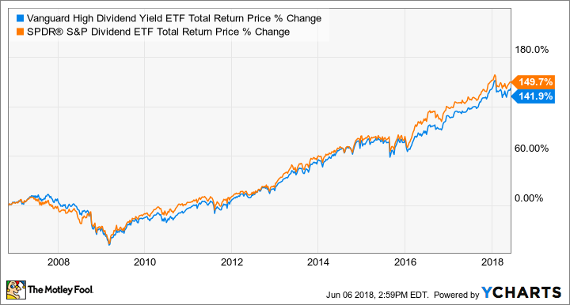

In today's ever-evolving financial landscape, investors are constantly searching for the best strategies to maximize their returns. Among the popular options are Dividend ETFs, the S&P 500, and algorithmic trading. Each approach offers unique advantages and challenges, making it crucial for investors to understand how they compare.

Dividend ETFs are exchange-traded funds that focus on stocks with a history of consistent dividend payments, appealing to those seeking income along with potential capital appreciation. This strategy provides diversification across different sectors while offering a steady income stream. In contrast, the S&P 500 index consists of 500 of the largest publicly traded companies in the United States, representing a substantial portion of the U.S. stock market. Investing in the S&P 500 provides broad market exposure and has historically delivered substantial long-term returns, making it a favored choice for passive investors.



Algorithmic trading, on the other hand, leverages advanced computer programs to automate trading decisions based on predefined criteria. This method allows for rapid execution of trades and processing of large volumes of data. Although algorithmic trading can offer advantages such as speed and precision, it also comes with specific risks, including regulatory considerations and potential market impact.

This article aims to provide a comprehensive comparison of these investment strategies by examining their key characteristics, risks, and potential returns. Understanding the intricacies of Dividend ETFs, S&P 500 investments, and algorithmic trading enables investors to make informed decisions suited to their financial goals.

## Table of Contents

## Understanding Dividend ETFs

Dividend ETFs, or Exchange-Traded Funds, are investment instruments that primarily focus on acquiring stock in companies known for consistent dividend payments. These funds offer investors a meaningful income stream, derived from the dividends paid by the underlying companies in the ETF's portfolio. By investing in a collection of dividend-paying stocks, Dividend ETFs enable investors to attain diversification across various sectors and industries, reducing the risk associated with investing in a single company or sector.

The appeal of Dividend ETFs lies in their capacity to provide investors with a balance between regular income and potential for capital appreciation. This combination is especially attractive to income-focused investors, such as retirees or those seeking to supplement their income, as it allows them to benefit from both the dividends and any potential increase in the value of the ETF's shares over time.

There are various types of Dividend ETFs available to cater to different investor preferences and objectives. High-yield dividend ETFs focus on stocks that offer higher-than-average dividend yields. These can provide greater income but may also come with increased risk compared to other dividend stocks. Growth-oriented dividend ETFs, on the other hand, concentrate on companies that not only pay dividends but also exhibit strong potential for earnings growth, potentially leading to increased dividends over time. Additionally, international dividend ETFs seek to provide exposure to dividend-paying companies outside of the investor's home country, offering opportunities for global diversification.

When evaluating Dividend ETFs, it is important for investors to consider several key factors. Expense ratio is a critical consideration, as it represents the cost of managing the [ETF](/wiki/etf-trading-strategies). Lower expense ratios mean that less of an investor’s return is consumed by fees. Dividend yield, which is the annual dividend payment expressed as a percentage of the ETF's share price, is another vital metric; it provides insight into the income an investor might expect. Lastly, the overall performance of the ETF, which includes both the income generated from dividends and the capital appreciation or depreciation of the ETF’s share price, is an essential measure of its success over time.

In summary, Dividend ETFs offer a compelling investment option for those seeking a mix of regular income and growth potential, in a diversified and managed investment vehicle. Understanding the different types and evaluating key factors can help investors make informed decisions that align with their income needs and financial goals.

## Exploring the S&P 500

The S&P 500 is a benchmark index that stands as one of the most prominent indicators of the U.S. economy, consisting of 500 of the largest publicly traded companies. A crucial aspect of the S&P 500 is its market capitalization-weighted methodology, meaning that companies with larger market capitalizations have a more significant influence on the index's performance. This method ensures that substantial shifts in major corporation stocks, such as Apple or Microsoft, markedly impact the overall index behavior.

Investing in the S&P 500 offers investors a comprehensive representation of the U.S. equity market, covering approximately 80% of the market capitalization of all publicly traded stocks in America. This broad exposure makes it a cornerstone for diversified investment portfolios. Historically, the S&P 500 has yielded impressive returns over the long term. According to data from Standard & Poor's, the average annual return for the index has been around 10-11% since its inception. However, it is important to note that past performance does not guarantee future results, and the index can be subject to significant short-term [volatility](/wiki/volatility-trading-strategies).

For individual investors, engaging with the S&P 500 can be facilitated through S&P 500 ETFs (Exchange-Traded Funds) or index funds. These financial products aim to replicate the performance of the S&P 500 by holding a similar portfolio of stocks, thereby allowing investors to gain access to the benefits of the index without needing to directly purchase all 500 stocks. One of the most popular S&P 500 ETFs is the SPDR S&P 500 ETF Trust (SPY), managed by State Street Global Advisors.

Understanding the historical performance and the inherent volatility associated with S&P 500 investments is essential for making informed decisions. Since the S&P 500 encompasses a variety of industries, its volatility can be influenced by sector-specific events as well as broader economic conditions.  

Assessing the risks related to S&P 500 investments is crucial. While its diversification across different sectors is advantageous, the index is still subject to systemic risks that affect the broader market, including economic downturns, geopolitical instability, and [interest rate](/wiki/interest-rate-trading-strategies) fluctuations. The historical standard deviation of the index, which serves as a proxy for volatility, has been roughly around 15-20%, requiring investors to evaluate their risk tolerance before committing capital.

## Unpacking Algorithmic Trading

Algorithmic trading involves the use of computer programs to automate trading decisions, with actions based on predefined criteria. This trading method utilizes sophisticated algorithms to sift through vast amounts of market data at high speeds, identifying investment opportunities, and executing trades with remarkable precision. The technical framework behind [algorithmic trading](/wiki/algorithmic-trading) relies on the ability to process data rapidly, thereby offering traders a competitive advantage in terms of speed and efficiency.

### Key Advantages

One of the most significant benefits of algorithmic trading is its ability to handle substantial data volumes at impressive speeds. By automating trade execution, it reduces human errors and allows for consistent application of trading strategies. Algorithmic systems can be programmed to operate on specific criteria or adapt to real-time changes, ensuring adherence to investment strategies without subjective biases.

For instance, algorithmic trading strategies may include statistical [arbitrage](/wiki/arbitrage), [market making](/wiki/market-making), and [trend following](/wiki/trend-following). Algorithms may be designed to recognize patterns or discrepancies in the market, often executing trades at optimal prices. Python, a popular language in financial programming, can be used to formulate these algorithms. Below is an example snippet of a simple moving average crossover strategy in Python:

```python
import numpy as np
import pandas as pd

# Sample DataFrame with price data
data = {'price': [5.1, 5.5, 5.7, 5.9, 5.4, 5.8, 6.1]}
df = pd.DataFrame(data)

# Calculate moving averages
df['SMA_short'] = df['price'].rolling(window=3).mean()
df['SMA_long'] = df['price'].rolling(window=5).mean()

# Define trading signals based on SMA crossover
df['signal'] = np.where(df['SMA_short'] > df['SMA_long'], 1, -1)
```

### Risks and Considerations

Despite its advantages, algorithmic trading carries inherent risks. The major risk involves technology malfunctions, including software bugs or hardware failures, which can lead to unintended trades and financial losses. Furthermore, the rapid execution of trades can exacerbate market volatility or contribute to flash crashes, where large sell-offs occur within seconds.

Market conditions can also affect algorithmic performance. Traders must account for slippage—in which there is a difference between the expected and actual transaction price—as well as latency delays in order execution. Successful algorithmic trading thus requires robust technology infrastructure capable of handling high-frequency data and operating with minimal latency. 

### Regulatory Perspective

Regulatory considerations play a crucial role in algorithmic trading. Financial authorities impose rules and monitoring systems to prevent market abuse and ensure fair trading. Compliance with these regulations requires transparency in the algorithmic models used and the ability to track and audit trades.

Regulation may also focus on curbing the potential adverse impact algorithmic trading could have on market stability. For instance, certain jurisdictions have implemented circuit breakers to limit excessive market movements triggered by algorithmic trading.

In summary, while algorithmic trading offers significant benefits in terms of speed and efficiency, successful implementation demands careful consideration of trading strategies, market conditions, regulatory requirements, and robust technological infrastructure.

## Comparing Investment Strategies

When comparing Dividend ETFs, the S&P 500, and algorithmic trading, it is essential to analyze the distinct characteristics and potential synergies inherent in each strategy to align them with individual investment goals effectively.

Dividend ETFs are strategically structured to cater to income-focused investors by providing regular dividend payments. These exchange-traded funds, by investing in stocks known for consistent dividend distributions, offer the allure of lower market volatility and a stable cash flow. Such consistency is advantageous for those relying on investment returns for ongoing income, as it minimizes the uncertainty associated with fluctuating stock prices. Additionally, the diversification offered by Dividend ETFs across multiple sectors decreases risk by not tying the entire investment to the performance of a single company or industry.

Investing in the S&P 500, a benchmark index representing 500 of the largest publicly traded companies in the United States, primarily serves investors interested in broad market exposure and capital growth over the long term. The S&P 500 has historically provided substantial returns, usually outpacing inflation and enhancing wealth over several decades. Investors can easily access this index via ETFs and index funds, allowing for a passive investment strategy that incurs relatively low fees compared to actively managed funds. The volatility of the S&P 500 reflects the overall market conditions, thus, while it offers significant growth potential, investors should be prepared for market fluctuations.

Algorithmic trading presents a different approach, attracting technologically inclined investors who prioritize speed, data processing, and often more dynamic trading strategies. By leveraging advanced algorithms, this method can process large volumes of market data to identify and capitalize on investment opportunities almost instantaneously. This capability makes it suitable for those focused on active management and willing to invest in the necessary infrastructure and technical expertise. However, the risks associated with algorithmic trading, such as technological failures and market impact, require careful consideration and robust system oversight.

Potential synergies between these strategies might involve using Dividend ETFs for consistent income alongside S&P 500 investments to achieve capital growth, or integrating algorithmic trading to enhance active management practices within a diversified investment portfolio. The choice among these strategies will depend on the investor's risk tolerance, investment horizon, and financial objectives. Balancing the contrasting elements of income stability, growth potential, and technological prowess can help investors construct a portfolio aligned with their aspirations and adapted to varying market conditions.

## Key Factors in Decision-Making

When selecting an investment strategy, it is essential to evaluate a variety of factors that can significantly impact financial outcomes. A primary consideration is risk tolerance, which refers to an investor's capacity and willingness to endure market volatility and potential losses. This tolerance varies among individuals based on factors such as age, income, and financial stability. Younger investors may have a higher risk tolerance due to a longer investment horizon, while retirees might favor more conservative approaches to protect their assets.

The time horizon is another crucial [factor](/wiki/factor-investing), as it influences the suitability of different investment strategies. Short-term objectives might necessitate more liquid and low-risk options, whereas long-term goals allow for higher-risk investments with the potential for greater returns. For instance, while Dividend ETFs can offer steady income over time, investments in the S&P 500 are typically aligned with long-term growth aspirations.

Understanding the tax implications and cost structure associated with each strategy is paramount for optimizing returns. Different investments are subject to varying tax treatments which can affect net gains. For example, the qualified dividends from certain Dividend ETFs may benefit from favorable tax rates compared to ordinary income. Additionally, assessing the expense ratios of ETFs, management fees, and transaction costs is essential to ensure that these do not disproportionately erode returns.

Investors might consider blending strategies to balance risk and return effectively. By incorporating Dividend ETFs focused on income generation and S&P 500 constituents for growth potential, investors can potentially achieve a more diversified portfolio. This approach can mitigate the risks associated with any single strategy, thus optimizing overall portfolio performance.

Technological advancements and current market trends are particularly relevant in algorithmic trading, a field characterized by rapid changes and innovation. Staying informed about technologies that drive algorithmic trading, such as [machine learning](/wiki/machine-learning) and high-frequency trading algorithms, can provide investors with competitive insights and enhanced decision-making tools.

Finally, consulting with a financial advisor can be invaluable in navigating the complexities of investment choice. Advisors can offer expertise tailored to individual circumstances, assisting in aligning an investment plan with personal financial goals. They can provide strategic insights into market conditions and recommend adjustments to strategies as needed, providing an extra layer of security and optimized planning.

## Conclusion

Dividend ETFs, the S&P 500, and algorithmic trading each offer distinct paths to achieving financial success, catering to different investor needs and ambitions. Understanding the unique features and potential benefits of each strategy is crucial in aligning investment choices with individual risk profiles and goals. Dividend ETFs attract investors seeking steady income and reduced volatility through diverse sector exposure, while the S&P 500 appeals to those pursuing broad market exposure and long-term growth through passive investing in a robust index. Algorithmic trading, on the other hand, is suited for tech-savvy investors who prioritize precision, speed, and data-driven investment strategies.

This comprehensive comparison underscores the importance of due diligence and personalized investment planning. Thorough research and understanding of these options can help mitigate risks and enhance returns. Investors are encouraged to consider their risk tolerance, financial objectives, and time horizon while selecting an appropriate strategy or blending different approaches.

Ultimately, the right combination of investment strategies can offer a balanced approach to achieving both income and growth. For instance, incorporating Dividend ETFs for income stability and combining them with the growth potential of the S&P 500 index could serve as a robust investment portfolio. Meanwhile, algorithmic trading could add value through tactical market engagement and active management.

As financial markets continue to evolve, staying informed and adaptable is paramount for successful investing. The dynamic nature of markets demands continuous learning and agility in adjusting strategies as needed. Embracing technological advancements, monitoring market trends, and seeking professional financial advice are vital steps towards maintaining an effective investment strategy in the ever-changing financial landscape.

## References & Further Reading

[1]: ["Investing in Dividend ETFs: A Beginner's Guide"](https://www.dividend.com/how-to-invest/the-dividend-com-guide-to-investing-in-etfs/) by Morningstar

[2]: ["The Little Book of Common Sense Investing: The Only Way to Guarantee Your Fair Share of Stock Market Returns"](https://www.amazon.com/Little-Book-Common-Sense-Investing/dp/1119404509) by John C. Bogle

[3]: ["Algorithmic Trading: Winning Strategies and Their Rationale"](https://books.google.com/books/about/Algorithmic_Trading.html?id=_-zc3SK2vrYC) by Ernest P. Chan

[4]: ["SPDR S&P 500 ETF Trust (SPY) Overview"](https://www.ssga.com/us/en/intermediary/etfs/spdr-sp-500-etf-trust-spy) by State Street Global Advisors

[5]: Bodie, Z., Kane, A., & Marcus, A. J. (2013). ["Investments"](https://www.amazon.com/Investments-10th-Zvi-Bodie/dp/0077861671). McGraw-Hill Education.

[6]: Hasbrouck, J., & Saar, G. (2013). ["Low-latency Trading"](https://www.sciencedirect.com/science/article/abs/pii/S1386418113000165). The Journal of Financial Markets.