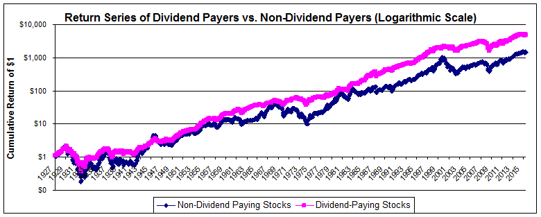

## Table of Contents

## What is a dividend?

A dividend is money that a company pays to its shareholders. When a company makes a profit, it can choose to share some of that profit with the people who own its stock. This payment is called a dividend. Shareholders receive dividends based on how many shares of the company's stock they own.

Dividends are usually paid out regularly, often every three months. Not all companies pay dividends, though. Some companies, especially newer ones, might use all their profits to grow the business instead of paying dividends. Companies that do pay dividends often do so to attract investors who are looking for a steady income from their investments.

## What is the difference between dividend-paying and non-dividend-paying companies?

Dividend-paying companies are businesses that share a part of their profits with their shareholders. They do this by paying out dividends, which are usually given every few months. These companies often attract investors who want a regular income from their investments. This can be good for people who need money regularly, like retirees. Also, dividend-paying companies are often seen as more stable and financially healthy because they can afford to share their profits.

Non-dividend-paying companies, on the other hand, do not give out dividends. Instead, they keep all their profits to reinvest in the business. This can help the company grow faster or pay off debts. These companies might appeal to investors who are looking for the company's stock price to go up over time. They are often newer or in industries where growth is more important than giving out dividends. This can be riskier but might lead to bigger rewards if the company does well.

## How do dividend-paying companies generate income for investors?

Dividend-paying companies generate income for investors by sharing their profits. When a company makes money, it can decide to give some of that money back to the people who own its stock. This payment is called a dividend. Investors get these dividends based on how many shares they own. So, if you own a lot of shares, you get more money. This can be a good way for investors to earn regular income without selling their shares.

These dividends are usually paid out every few months, like a regular paycheck. This can be really helpful for people who need money coming in regularly, like people who are retired. It's like getting a little bonus from the company just for owning its stock. Because of this, dividend-paying companies often attract investors who want a steady and predictable income from their investments.

## What are the potential benefits of investing in dividend-paying companies?

Investing in dividend-paying companies can give you regular income. When you own stocks in these companies, you get paid dividends, which are like little payments from the company's profits. This can be really helpful if you need money coming in regularly, like if you're retired. It's like getting a small paycheck just for holding onto the stock, without having to sell any of your shares.

Another benefit is that dividend-paying companies are often seen as more stable and financially healthy. If a company can afford to pay dividends, it usually means they're doing well and making good profits. This can make their stock seem safer to investors. Plus, over time, many dividend-paying companies also raise their dividends, which means your income from them can grow, helping you keep up with inflation.

Lastly, reinvesting dividends can help your investment grow even more. Instead of taking the dividend money as cash, you can use it to buy more shares of the company. This is called dividend reinvestment. Over time, this can lead to owning more and more shares, which means even bigger dividend payments in the future. It's a way to make your money work harder for you.

## What are the potential drawbacks of investing in dividend-paying companies?

One potential drawback of investing in dividend-paying companies is that they might not grow as fast as companies that don't pay dividends. When a company decides to pay out dividends, it's using money that could have been used to grow the business. Companies that keep all their profits and reinvest them might be able to expand faster, which can lead to bigger increases in their stock price. So, if you're looking for your investment to grow quickly, dividend-paying companies might not be the best choice.

Another risk is that dividends can be cut or stopped. If a company runs into financial trouble, it might need to save money by not paying dividends. This can be a shock if you were counting on that regular income. It can also make the stock price drop because investors might sell their shares if they think the company is in trouble. So, it's important to know that even though dividends can seem like a steady income, they're not always guaranteed.

## How do non-dividend-paying companies typically reinvest their profits?

Non-dividend-paying companies often use their profits to grow their business. They might spend the money on things like new equipment, opening new stores, or developing new products. This can help them get bigger and reach more customers. By reinvesting profits, these companies hope to make even more money in the future. It's like planting seeds with the profits, hoping for a bigger harvest later on.

Another way non-dividend-paying companies reinvest their profits is by paying off debts. When a company has less debt, it saves money on interest payments, which can help it become more financially stable. Some companies might also use their profits to buy other businesses. This can help them grow quickly and get into new markets. By not paying dividends, these companies can focus on making their business stronger and more valuable over time.

## What are the potential benefits of investing in non-dividend-paying companies?

Investing in non-dividend-paying companies can lead to bigger growth in the value of your investment. Since these companies keep all their profits, they can use that money to make their business grow faster. They might spend it on new projects, opening new stores, or buying other companies. This can make the company bigger and more valuable over time. If the company does well, the price of its stock could go up a lot, which means you could make more money when you sell your shares.

Another benefit is that non-dividend-paying companies often focus on long-term growth. They might be newer companies or in industries where growing fast is more important than paying out dividends. If you believe in the company's future, investing in it could pay off big in the long run. This type of investment might be riskier, but it can also lead to bigger rewards if the company becomes very successful.

## What are the potential drawbacks of investing in non-dividend-paying companies?

One big drawback of investing in non-dividend-paying companies is that they might be riskier. These companies often use all their profits to grow the business, which can be a good thing if they do well. But if they don't, their stock price could go down a lot. This means you could lose money if you need to sell your shares when the price is low. It's like betting on a horse that might run fast but could also fall.

Another downside is that you won't get any regular income from dividends. If you need money coming in regularly, like if you're retired, investing in non-dividend-paying companies might not be the best choice. You'll have to wait until the company's stock price goes up to make money, and that can take a long time. It's like planting a tree and waiting for it to grow before you can enjoy any fruit.

## How do tax implications differ between dividend-paying and non-dividend-paying companies?

When you invest in dividend-paying companies, you have to pay taxes on the dividends you receive. The government sees these dividends as income, so you'll need to report them on your tax return. The tax rate on dividends can be different from your regular income tax rate, and it depends on your total income and how long you've held the stock. Sometimes, dividends are taxed at a lower rate, which can be good for you. But remember, you'll need to pay these taxes every year you get dividends, even if you don't sell your shares.

On the other hand, if you invest in non-dividend-paying companies, you don't have to worry about paying taxes on dividends because there aren't any. Instead, you'll only have to pay taxes when you sell your shares and make a profit. This is called capital gains tax. If you hold onto the stock for more than a year before selling, you might pay a lower tax rate on your profit. But if you sell the stock in less than a year, the tax rate could be higher. So, with non-dividend-paying companies, you can choose when to sell and pay taxes, which might help you plan better.

## What role does a company's growth stage play in deciding whether to pay dividends?

A company's growth stage is very important when deciding if it should pay dividends. When a company is young and still growing, it often needs all its money to expand. This means it might not pay dividends because it wants to use its profits to open new stores, make new products, or buy other businesses. By keeping all the money, the company hopes to grow bigger and more successful in the future.

As a company gets older and more stable, it might start paying dividends. Once a company is well-established and not growing as fast, it might have extra money that it can share with its shareholders. Paying dividends can attract investors who want a steady income, and it shows that the company is doing well financially. So, the stage of a company's growth can really affect whether it decides to pay dividends or not.

## How can an investor's financial goals influence their choice between dividend-paying and non-dividend-paying companies?

An investor's financial goals can really affect whether they choose to invest in dividend-paying or non-dividend-paying companies. If someone needs regular money coming in, like if they're retired, they might prefer dividend-paying companies. These companies give out part of their profits as dividends, which can be like getting a little paycheck every few months. This can help someone who needs a steady income without selling their shares.

On the other hand, if an investor is looking for their money to grow a lot over time, they might go for non-dividend-paying companies. These companies use all their profits to make the business bigger and better. This can be riskier, but if the company does well, the value of the stock could go up a lot. So, someone who is okay with waiting and wants big growth might choose non-dividend-paying companies to try and make more money in the long run.

## What are some advanced strategies for balancing a portfolio between dividend-paying and non-dividend-paying stocks?

One advanced strategy for balancing a portfolio between dividend-paying and non-dividend-paying stocks is called the "bucket strategy." This means you split your money into different "buckets" based on when you'll need it. You might put money you need soon into dividend-paying stocks because they give you regular income. But money you won't need for a long time can go into non-dividend-paying stocks. These can grow a lot over time, even though they don't give you money right away. By using this strategy, you can make sure you have money coming in when you need it and also have the chance for big growth later on.

Another strategy is called "dividend reinvestment." With this, you take the dividends you get from dividend-paying stocks and use them to buy more shares. This can help your investment grow even faster because you're buying more stock without spending extra money. You can balance this with non-dividend-paying stocks, which you hope will go up in value over time. By doing both, you can enjoy the benefits of regular income and the potential for big growth. It's like having the best of both worlds in your portfolio.

## What is the key to understanding dividend-paying companies?

Dividend-paying companies play a pivotal role in the investment landscape by offering shareholders regular income through dividend distributions. These distributions are typically cash payments made on a quarterly or annual basis and are derived from the company's earnings. Such a strategy is especially appealing to risk-averse investors who prioritize income stability and predictability in their investment portfolios.

Dividend-paying entities often signal robust financial health and profitability. By consistently generating sufficient profits to return a portion to shareholders, these companies demonstrate operational efficiency and a stable earnings trajectory. This financial transparency and reliability act as a magnet for investors who value predictable returns, offering them not just potential capital gains but also a steady income stream.

Prominent examples of firms that embrace dividend distribution include industry stalwarts such as Coca-Cola and Microsoft. Coca-Cola, a leading beverage company with a diverse global portfolio, has a long-standing tradition of issuing dividends, reflecting its stable cash flow and market dominance. Similarly, Microsoft, a titan in the technology sector, combines innovation with fiscal prudence, allowing it to reward investors regularly while continuing to invest in future growth opportunities.

For such companies, dividends represent a strategic financial tool. They sanction earnings distribution while simultaneously differentiating themselves from companies that either reinvest all profits for growth or lack the consistent earnings necessary to support dividend payments. While dividend distributions may appear to reduce the capital available for reinvestment, they more accurately point to a balanced approach that satisfies shareholder expectations for immediate returns while sustaining long-term corporate strategies.

The valuation of dividend stocks is often guided by models such as the Gordon Growth Model, which posits that the price $P$ of a dividend-paying stock can be evaluated using the formula:

$$
P = \frac{D_1}{r - g}
$$

where:
- $D_1$ is the expected dividend in the next period,
- $r$ denotes the required rate of return, and
- $g$ symbolizes the dividend growth rate.

This model underscores the relationship between the anticipated growth in dividends and investors' required rate of return, making dividend analysis a critical component of valuation in the context of dividend-paying stocks.

Overall, investing in dividend-paying companies remains a cornerstone strategy for many, bifurcating risk with the promise of consistent income while offering a lens through which financial stability can be assessed.

## References & Further Reading

[1]: Gitman, L. J., & Zutter, C. J. (2012). ["Principles of Managerial Finance."](https://archive.org/details/principlesofmana13edgitm_l9n6) Pearson Education Limited.

[2]: Damodaran, A. (2002). ["Investment Valuation: Tools and Techniques for Determining the Value of Any Asset."](https://archive.org/details/investmentvaluat0000damo_n6k9) John Wiley & Sons.

[3]: Arnott, R. D., & Asness, C. S. (2003). ["Surprise! Higher Dividends = Higher Earnings Growth."](https://www.jstor.org/stable/4480452) Financial Analysts Journal.

[4]: ["Algorithmic Trading and DMA: An Introduction to Direct Access Trading Strategies"](https://www.amazon.com/Algorithmic-Trading-DMA-introduction-strategies/dp/0956399207) by Barry Johnson

[5]: ["The Intelligent Investor: The Definitive Book on Value Investing. A Book of Practical Counsel"](https://www.amazon.com/Intelligent-Investor-3rd-Ed/dp/0063356724) by Benjamin Graham

[6]: Bodie, Z., Kane, A., & Marcus, A. J. (2014). ["Investments"](https://books.google.com/books/about/EBOOK_Investments_Global_edition.html?id=BMsvEAAAQBAJ) (10th ed.). McGraw-Hill Education.