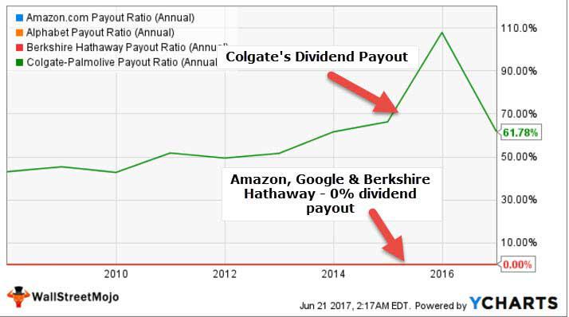

Investing wisely is crucial for optimizing portfolio returns, especially when considering different types of companies. Investment strategies vary significantly between companies that pay dividends and those that do not, each offering distinct advantages and risks. Dividend-paying companies often provide regular income through distributions, making them appealing to investors seeking stability and consistent returns. These companies, such as Coca-Cola or Microsoft, usually signal strong financial health and profitability.

On the other hand, non-dividend-paying companies reinvest earnings to fuel growth, potentially offering significant capital appreciation over time. These firms are typically found in high-growth sectors like technology and biotech and attract investors who are more focused on long-term value appreciation rather than immediate income. Companies like Amazon exemplify this model by prioritizing reinvestment over dividends to secure market leadership.



Algorithmic trading plays an increasingly significant role in managing investments, providing powerful tools for both types of investment strategies. Leveraging technology, algorithmic trading employs computer programs to execute trades based on predefined criteria, minimizing human error, and optimizing returns by swiftly analyzing large amounts of data. This enhanced precision can be valuable for managing portfolios that include both dividend-paying and growth-focused non-dividend-paying stocks.

Ultimately, investors need to weigh the unique benefits and risks associated with each type of investment to align with their financial goals. Considering factors like individual risk tolerance, market conditions, and financial targets is essential for crafting a balanced and robust portfolio strategy. Whether prioritizing steady income or long-term growth, investors can benefit from a nuanced understanding of these strategies.

## Table of Contents

## Understanding Dividend-Paying Companies

Dividend-paying companies play a pivotal role in the investment landscape by offering shareholders regular income through dividend distributions. These distributions are typically cash payments made on a quarterly or annual basis and are derived from the company's earnings. Such a strategy is especially appealing to risk-averse investors who prioritize income stability and predictability in their investment portfolios.

Dividend-paying entities often signal robust financial health and profitability. By consistently generating sufficient profits to return a portion to shareholders, these companies demonstrate operational efficiency and a stable earnings trajectory. This financial transparency and reliability act as a magnet for investors who value predictable returns, offering them not just potential capital gains but also a steady income stream.

Prominent examples of firms that embrace dividend distribution include industry stalwarts such as Coca-Cola and Microsoft. Coca-Cola, a leading beverage company with a diverse global portfolio, has a long-standing tradition of issuing dividends, reflecting its stable cash flow and market dominance. Similarly, Microsoft, a titan in the technology sector, combines innovation with fiscal prudence, allowing it to reward investors regularly while continuing to invest in future growth opportunities.

For such companies, dividends represent a strategic financial tool. They sanction earnings distribution while simultaneously differentiating themselves from companies that either reinvest all profits for growth or lack the consistent earnings necessary to support dividend payments. While dividend distributions may appear to reduce the capital available for reinvestment, they more accurately point to a balanced approach that satisfies shareholder expectations for immediate returns while sustaining long-term corporate strategies.

The valuation of dividend stocks is often guided by models such as the Gordon Growth Model, which posits that the price $P$ of a dividend-paying stock can be evaluated using the formula:

$$
P = \frac{D_1}{r - g}
$$

where:
- $D_1$ is the expected dividend in the next period,
- $r$ denotes the required rate of return, and
- $g$ symbolizes the dividend growth rate.

This model underscores the relationship between the anticipated growth in dividends and investors' required rate of return, making dividend analysis a critical component of valuation in the context of dividend-paying stocks.

Overall, investing in dividend-paying companies remains a cornerstone strategy for many, bifurcating risk with the promise of consistent income while offering a lens through which financial stability can be assessed.

## Investment Considerations for Non-Dividend-Paying Companies

Non-dividend-paying companies allocate their earnings towards internal expansion opportunities rather than distributing them as dividends to shareholders. This reinvestment strategy aims to enhance capital growth by increasing the company's valuation over time. Such companies are typically characterized by their presence in high-growth sectors, such as technology and biotechnology, where the potential for innovation and market disruption is substantial.

Due to their focus on reinvesting earnings, these companies may attract investors who prioritize long-term value accretion over immediate income. They offer potential for significant capital appreciation by fueling research and development, expanding market reach, and investing in infrastructure. By reinvesting profits, these firms can develop new products, improve operational efficiencies, and capture larger market shares, thereby increasing their intrinsic value.

Investors in non-dividend-paying companies often have a higher risk tolerance, as the lack of dividend income means they rely on eventual capital gains as their primary return on investment. Thus, the appeal of non-dividend-paying stocks lies in their capacity for exponential growth, which can lead to substantial returns if the companies successfully execute their growth strategies.

The technology and biotechnology sectors are particularly conducive to this investment approach. Companies within these industries frequently possess the ability to scale rapidly, driven by advancements and innovations that cater to evolving consumer demands and technological landscapes. For example, firms developing cutting-edge software or breakthrough medicines often choose to reinvest profits into expanding their capabilities and enhancing their competitive positioning.

Investors considering non-dividend-paying companies should conduct thorough due diligence to assess the company’s growth prospects, management effectiveness, and market potential. Analyzing financial statements for indicators of prudent reinvestment strategies and sustainable growth patterns can provide insights into the company's long-term viability.

In summary, non-dividend-paying companies appeal to investors seeking capital appreciation by leveraging earnings for strategic reinvestment, predominantly within dynamic and rapidly evolving industries. This approach requires a long-term perspective and a comprehensive understanding of the potential risks and rewards associated with such investment opportunities.

## The Appeal of Growth Stocks Without Dividends

Growth stocks, characterized by their focus on reinvestment to drive expansion and innovation, offer investors the potential for substantial capital gains. These stocks typically belong to companies that prefer to reinvest their profits into their operations rather than distribute them as dividends. This reinvestment strategy is often employed to develop new products, penetrate additional markets, or acquire other companies, thus fostering long-term growth prospects.

Amazon Inc. is a quintessential example of a company that has consistently reinvested its earnings over the years to maintain its competitive edge and secure market leadership. Instead of paying dividends to its shareholders, Amazon channels its profits back into its business to enhance its logistics network, expand its product offerings, and explore technological advancements. This approach allows Amazon to sustain a rapid growth trajectory, ultimately enhancing shareholder value through stock price appreciation.

Investors seek [growth stocks](/wiki/growth-stocks), particularly during bull markets when economic conditions are favorable, and market optimism prevails. In such conditions, growth stocks can experience significant appreciation, leading to substantial portfolio enrichment. The underlying principle for investors is the expectation that the increase in stock value will outweigh the absence of dividend payments, yielding a positive return on investment over time.

Quantitatively, the appeal of growth stocks can be considered through metrics such as the Price-to-Earnings (P/E) ratio, where a high ratio suggests significant growth potential relative to earnings. Investors may also analyze the Price/Earnings to Growth (PEG) ratio, which accounts for both the company's growth rate and earnings performance. Such metrics aid in evaluating whether a growth stock's valuation aligns with its growth prospects.

Overall, the decision to invest in growth stocks hinges on an investor's appetite for risk and their investment horizon. While growth stocks can offer pronounced returns, they also come with [volatility](/wiki/volatility-trading-strategies). Hence, these stocks are more suited for investors who prioritize long-term capital gains over immediate income.

## Risks Associated with Non-Dividend Stocks

Non-dividend-paying stocks, often seen in high-growth sectors such as technology and biotechnology, can present a unique set of risks due to their inherent reliance on growth projections and market conditions. These stocks typically reinvest earnings into the company rather than distributing them to shareholders in the form of dividends, which can lead to increased volatility.

One primary concern for investors is the absence of a steady income stream. Dividend-paying stocks provide regular cash flow, which can help mitigate market fluctuations and provide a buffer during economic downturns. Non-dividend stocks, however, lack this consistent income, making them less attractive to investors who depend on regular payouts for [liquidity](/wiki/liquidity-risk-premium) or lifestyle needs.

Additionally, overvaluation poses a significant risk for non-dividend stocks. Given the growth-centric focus of these companies, investor sentiment can heavily influence their stock prices. During periods of heightened optimism, stock prices may rise to levels that are not sustainable based on the underlying company's fundamentals or realistic future earnings potential. This discrepancy can lead to inflated valuations, ultimately resulting in sharp corrections when market conditions change or when actual performance fails to meet high expectations.

Analyzing these stocks requires careful consideration of projected growth rates and market positions. Investors should be wary of extraordinarily high price-to-earnings (P/E) ratios, as they might indicate inflated prices based on robust growth assumptions that might not materialize. For example, if a non-dividend stock's P/E ratio is significantly higher than industry averages, this could signal overvaluation driven by speculative growth expectations.

Mitigating these risks involves comprehensive due diligence. Investors can employ various valuation models to assess the sustainability of growth claims. Techniques such as discounted cash flow (DCF) analysis can help estimate the present value of the company's projected cash flows, providing a more grounded assessment of its intrinsic value. By incorporating sensitivity analyses, investors can better understand how changes in growth assumptions impact valuation.

In summary, non-dividend-paying stocks can potentially lead to significant capital gains, but investors must navigate the risks of volatility, absence of regular income, and overvaluation. Careful evaluation of growth prospects and intrinsic value is essential in managing these risks effectively.

## Algorithmic Trading: Enhancing Investment Strategies

Algorithmic trading employs advanced technology to make investment management in both dividend and non-dividend stocks more effective and efficient. By utilizing computer programs, trades are executed based on predefined criteria, ensuring precision and minimizing the inefficiencies typically associated with manual trading. This method is particularly advantageous as it can significantly reduce human error while optimizing returns by rapidly analyzing large datasets.

One of the critical advantages of [algorithmic trading](/wiki/algorithmic-trading) is its ability to process and react to market data much faster than human traders. It achieves this through high-frequency trading algorithms, which can execute thousands of trades in a fraction of a second. This speed allows traders to capitalize on even the smallest market fluctuations, which can cumulatively lead to substantial gains.

Algorithmic trading systems are often designed based on a set of rules that include timing, price, quantity, or any mathematical model. For instance, a common strategy is mean reversion, which is based on the assumption that the price of a stock will revert to its average over time. Traders might develop algorithms to buy stocks when they fall below their average price and sell when they rise above it. This can be mathematically expressed in Python as follows:

```python
import numpy as np

def mean_reversion_strategy(prices, window=20):
    mean_prices = prices.rolling(window=window).mean()
    signals = np.where(prices < mean_prices, 1, -1)  # Buy below the mean, sell above the mean
    return signals
```

In addition to speed and efficiency, algorithmic trading provides the advantage of [backtesting](/wiki/backtesting). Investors can test their strategies against historical data to gauge potential effectiveness without risking actual capital. This simulated environment enables refinements and adjustments before deploying strategies in real-time markets.

Moreover, algorithmic trading systems can utilize [machine learning](/wiki/machine-learning) to adapt to changing market conditions. They can identify complex patterns in data that may not be apparent to human traders, and adjust strategies dynamically. Techniques such as regression analysis, support vector machines, and neural networks are commonly employed.

In conclusion, the integration of algorithmic trading into investment strategies enables investors to manage portfolios with increased precision and potentially enhanced returns. By analyzing vast amounts of data swiftly, algorithmic trading systems offer a compelling advantage, especially in the fast-paced world of stock markets, making them critical tools for modern investors.

## Integrating Algo Trading with Dividend and Growth Strategies

Algorithmic trading has become an indispensable tool in modern investment strategies, especially when integrating it with dividend and growth-oriented stocks. For dividend-paying stocks, algorithmic trading systems can be programmed to automatically reinvest dividends received. This automated reinvestment is critical for maximizing the benefits of compounding, which can significantly enhance portfolio growth over time. By utilizing algorithms, investors ensure that dividends are reinvested promptly and consistently, thereby optimizing the compounding effect without the delays inherent in manual processes.

In the domain of growth stocks, which typically do not pay dividends, algorithmic trading plays a crucial role in managing volatility and capturing [momentum](/wiki/momentum). Algorithms can analyze vast amounts of market data to identify emerging trends, allowing investors to exploit price fluctuations efficiently. For example, machine learning models can be applied to historical stock prices, trading volumes, and other financial indicators to predict future movements. This data-driven approach enables traders to time their entries and exits more precisely, capitalizing on upward momentum during bullish phases while mitigating losses during downturns.

To illustrate, consider a Python-based trading algorithm that could be implemented to manage both dividend and growth stocks:

```python
import pandas as pd
import numpy as np
from sklearn.linear_model import LinearRegression

def predict_trends(stock_data):
    stock_data['Returns'] = stock_data['Close'].pct_change()
    stock_data.dropna(inplace=True)

    X = stock_data.index.values.reshape(-1, 1)
    y = stock_data['Returns'].values

    model = LinearRegression()
    model.fit(X, y)
    trend_prediction = model.predict(X)

    return trend_prediction

# Sample dividend reinvestment algorithm
def reinvest_dividends(cash_balance, dividend_received, stock_price):
    shares_purchased = (cash_balance + dividend_received) // stock_price
    new_cash_balance = (cash_balance + dividend_received) % stock_price

    return shares_purchased, new_cash_balance
```

This code snippet demonstrates a simplistic approach to predicting market trends using linear regression and simulating dividend reinvestment. While the model can be far more sophisticated, involving various signals and parameters, it highlights how algorithmic automation can handle the complexity of financial data.

Blending traditional investment approaches with algorithmic trading offers a balanced strategy that benefits from both stability and growth. Traditional methods, grounded in [fundamental analysis](/wiki/fundamental-analysis), provide insights into a company's long-term viability and intrinsic value. In contrast, algorithmic trading adds a layer of computational efficiency and speed, enabling quick responses to market changes. Together, these strategies create a diversified portfolio management approach that leverages the strengths of both systems, catering to an investor's risk tolerance and financial objectives.

## Conclusion

Both dividend-paying and non-dividend-paying stocks present distinct opportunities and challenges that cater to different investor preferences. Dividend-paying stocks are generally preferred by those seeking a steady income stream and stability. They are often associated with well-established companies that demonstrate consistent profitability. On the other hand, non-dividend-paying stocks attract investors looking for capital appreciation through reinvestment in growth opportunities. These stocks often belong to younger companies in high-growth sectors, where the potential for price appreciation can be significant.

Algorithmic trading offers a compelling tool for navigating these investment landscapes by augmenting traditional strategies with advanced data analysis and execution capabilities. Algorithms can enhance investment precision by swiftly analyzing vast datasets, identifying trends, and executing trades based on predefined criteria. This technological approach minimizes human error and can lead to improved returns by optimizing buy and sell decisions in response to market conditions.

When constructing a portfolio, investors should take into account their risk tolerance, financial objectives, and current market conditions. This involves balancing the predictable income from dividend stocks with the growth potential of non-dividend stocks. By integrating algorithmic trading, investors can reinforce their strategies, ensuring timely and accurate execution of trades aligned with their financial goals.

## References & Further Reading

[1]: Gitman, L. J., & Zutter, C. J. (2012). ["Principles of Managerial Finance."](https://archive.org/details/principlesofmana13edgitm_l9n6) Pearson Education Limited.

[2]: Damodaran, A. (2002). ["Investment Valuation: Tools and Techniques for Determining the Value of Any Asset."](https://archive.org/details/investmentvaluat0000damo_n6k9) John Wiley & Sons.

[3]: Arnott, R. D., & Asness, C. S. (2003). ["Surprise! Higher Dividends = Higher Earnings Growth."](https://www.jstor.org/stable/4480452) Financial Analysts Journal.

[4]: ["Algorithmic Trading and DMA: An Introduction to Direct Access Trading Strategies"](https://www.amazon.com/Algorithmic-Trading-DMA-introduction-strategies/dp/0956399207) by Barry Johnson

[5]: ["The Intelligent Investor: The Definitive Book on Value Investing. A Book of Practical Counsel"](https://www.amazon.com/Intelligent-Investor-3rd-Ed/dp/0063356724) by Benjamin Graham

[6]: Bodie, Z., Kane, A., & Marcus, A. J. (2014). ["Investments"](https://books.google.com/books/about/EBOOK_Investments_Global_edition.html?id=BMsvEAAAQBAJ) (10th ed.). McGraw-Hill Education.