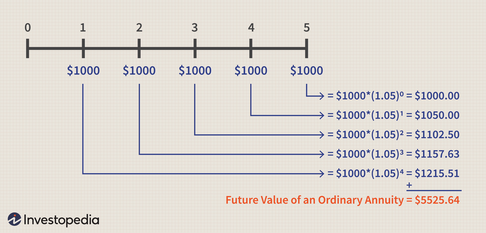

Retirement planning represents a critical phase of personal finance, where the choice of investment vehicles plays a pivotal role in determining financial security during later years. As individuals transition into retirement, selecting the appropriate mix of investment options becomes essential to maintain their desired lifestyle while safeguarding against economic uncertainties. This article aims to explore three significant investment strategies—dividend stocks, annuities, and algorithmic trading—each offering distinct benefits and considerations within the context of retirement planning.

Dividend stocks provide an appealing avenue for retirees seeking a dual benefit of steady income and potential capital growth. Companies with a consistent history of dividend payouts allow investors to receive regular income streams without liquidating their principal. This characteristic is particularly attractive, as it offers continuity in cash flow while retaining ownership of the underlying assets—potentially resulting in capital appreciation over time.

Annuities, on the other hand, introduce a different form of security. These insurance products promise guaranteed income, generally for life, in exchange for an upfront payment. The predictability and stability of annuities are compelling for retirees concerned about longevity risk, as they offer peace of mind through assured payments. However, understanding the types of annuities—fixed, variable, or indexed—as well as their associated costs is crucial for effective incorporation into a retirement plan.

Furthermore, algorithmic trading provides a modern approach to investment management in retirement. By leveraging computer programs to automate trade executions based on predefined criteria, algorithmic trading can optimize portfolio allocations responsively to market fluctuations. This method promotes a disciplined investment strategy, which can potentially enhance returns by minimizing emotional biases in trading decisions.

Understanding the nuances of dividend stocks, annuities, and algorithmic trading enables retirees or those near retirement to make informed decisions that align with their individual financial objectives. By integrating the stable income of dividends with potential equity growth or annuity security, along with the efficiency of algorithmic trading, retirees can devise a strategy tailored to their specific risk tolerance and income requirements. In doing so, retirees can not only safeguard their financial well-being but also aim to maximize returns throughout their retirement years.

## Table of Contents

## Dividend Stocks in Retirement Planning

Dividend stocks are a popular choice among retirees due to their ability to provide a consistent income stream alongside the potential for capital growth. When selecting dividend stocks for retirement planning, it is crucial to focus on companies that have a reliable history of dividend payouts. This approach allows retirees to earn regular income without the need to liquidate their investment principal, which is important for maintaining financial stability during retirement.

Key considerations when evaluating dividend stocks include factors such as dividend yield, payout ratio, and the company's overall financial health. Dividend yield, calculated as the annual dividend payment divided by the stock's price, provides insight into the income generated by the investment relative to its cost. A higher dividend yield can be attractive, but it is important to ensure that the yield is sustainable. This sustainability is often assessed through the payout ratio, which measures the proportion of earnings distributed as dividends. A moderate payout ratio typically indicates that a company retains enough earnings to reinvest in growth while still rewarding shareholders.

The financial health of the company is another critical aspect, as it influences both the sustainability of dividend payments and the potential for future capital appreciation. Companies with strong balance sheets, stable cash flows, and a competitive position in their industry are generally better candidates for long-term dividend investing.

While dividend stocks can offer substantial benefits, they also [carry](/wiki/carry-trading) inherent market risks. Therefore, it is advisable for retirees to diversify their dividend stock portfolio across various sectors to mitigate the potential [volatility](/wiki/volatility-trading-strategies) that may affect specific industries. Diversification can help reduce overall risk and contribute to a more stable income flow.

An effectively structured dividend stock portfolio can significantly enhance a retirement income strategy by providing a blend of predictable income and opportunities for asset growth. This combination not only helps in meeting day-to-day financial needs but also supports the preservation and potential increase of the portfolio's value over time, aligning with retirees' goals for a secure financial future.

## The Role of Annuities in Retirement

Annuities are financial products that provide retirees with a predictable and stable income stream, often for life, in exchange for an initial lump sum payment. This feature makes them particularly appealing to individuals looking to mitigate longevity risk—the possibility of outliving one's savings. 

When considering annuities, it is essential to understand the variations available, as each type can serve different retirement needs. Fixed annuities offer returns at a guaranteed rate, ensuring stable income regardless of market conditions. Variable annuities, conversely, link returns to the performance of an investment portfolio, providing the potential for higher income at the risk of variability. Indexed annuities are a middle ground, with returns tied to a stock market index, allowing for participation in upside growth while limiting downside risk through guarantees.

The costs and fees associated with annuities can be significant, often including administrative fees, mortality and expense risk charges, and investment management fees. These expenses can impact the net returns and should be meticulously considered prior to committing to an annuity plan. Transparency in these charges is crucial for making informed decisions.

Despite these costs, the value of annuities in retirement planning cannot be understated, providing a steady income stream that is unaffected by market fluctuations. This guaranteed lifelong income is a source of great comfort for many retirees, as it alleviates the anxiety of financial insecurity in later years. Annuities, when selected judiciously, offer peace of mind by securing a consistent financial foundation throughout retirement.

## Algorithmic Trading for Retirement Portfolio Management

Algorithmic trading utilizes computer programs to execute trading strategies automatically, based on specific, predetermined criteria. This automated approach can be highly beneficial for retirees in managing their retirement portfolios by enhancing efficiency and potentially optimizing returns.

One of the primary advantages of [algorithmic trading](/wiki/algorithmic-trading) for retirees is its ability to optimize portfolio management. By automating decisions, algorithmic trading systems can quickly adapt to changing market conditions and reallocate resources more efficiently than manual trading. This rapid adaptability helps in maintaining an optimal balance of assets, potentially reducing the risk of significant losses during market volatility.

Furthermore, algorithmic trading provides a disciplined, systematic approach to investment, which helps remove emotional biases that often impact human traders. Retirees may particularly benefit from this objectivity, as emotions can frequently cloud judgment and lead to suboptimal trading decisions. By adhering strictly to predefined rules and strategies, algorithmic trading ensures that investment decisions are made based on data-driven insights rather than emotional reactions.

However, retirees should exercise caution and work closely with financial advisors to develop algorithms that align with their specific risk tolerance and financial goals. Each retiree's financial situation is unique, requiring tailored strategies that consider both current and future income needs. Financial advisors can help design, test, and refine these algorithms to maximize their effectiveness and safety, taking into account individual risk profiles.

Despite its potential advantages, algorithmic trading is complex and demands continuous monitoring and adjustments. Market dynamics can shift rapidly, necessitating the regular evaluation and tweaking of the algorithms to ensure alignment with evolving financial situations and objectives. This complexity underscores the importance of allowing sufficient time and resources to oversee the algorithmic trading process, ensuring it operates in harmony with broader retirement planning strategies.

In conclusion, while algorithmic trading offers promising opportunities for enhancing retirement portfolios, retirees should approach it with an understanding of its intricacies and inherent risks. Engaging with knowledgeable professionals can help navigate these complexities and integrate algorithmic trading into a comprehensive retirement strategy that aligns with personal financial goals and risk tolerance.

## Comparing Dividend Stocks, Annuities, and Algorithmic Trading for Retirement

When planning for retirement, evaluating the benefits and risks of different investment options—namely dividend stocks, annuities, and algorithmic trading—is crucial for achieving financial security and peace of mind. Each investment vehicle offers distinct advantages that cater to varying needs and preferences.

**Dividend Stocks** provide a dual benefit of generating steady income streams through regular payouts and the potential for capital appreciation. For retirees, they can offer a reliable source of income without the need to liquidate principal assets. However, the inherent market risks associated with stocks require careful management. Factors such as dividend yield, payout ratio, and the financial health of companies are vital considerations when constructing a dividend stock portfolio. Moreover, diversification across multiple sectors is important to mitigate volatility and protect against sector-specific downturns.

**Annuities**, on the other hand, focus on stability and income predictability. They offer guaranteed periodic payments in exchange for a lump sum investment, reducing longevity risk—one of the primary concerns for retirees. The various types of annuities, such as fixed, variable, and indexed, cater to different risk appetites and retirement needs. Despite their appeal, the associated costs and fees can be substantial. It is critical for retirees to evaluate these costs against the benefits of secure, lifelong income streams.

**Algorithmic Trading** introduces a modern approach to managing retirement portfolios. By using technology to automate trading based on predefined criteria, it removes emotional biases from investment decisions and may enhance returns. When effectively implemented, algorithmic trading can optimize resource allocation and react to market dynamics efficiently. However, the complexity and need for continuous monitoring make it imperative for retirees to collaborate with knowledgeable financial advisors to tailor these strategies to their specific risk tolerance.

Balancing these diverse strategies can lead to a well-rounded portfolio, providing a mix of growth potential and income stability. While dividend stocks offer growth and income, annuities deliver security, and algorithmic trading can enhance return efficiency. The decision on the right combination depends on individual financial objectives, risk tolerance, income requirements, and prevailing market conditions.

Furthermore, retirees must carefully consider tax implications, fees, and inheritance considerations. These factors can significantly impact net returns and the overall effectiveness of a retirement strategy. Personalized retirement plans, tailored to specific lifestyle and financial circumstances, offer the best opportunity for achieving long-term security and peace of mind in retirement.

By thoughtfully integrating these investment approaches, retirees can create a comprehensive retirement plan that balances risk and reward, ensuring financial stability in their later years.

## References & Further Reading

[1]: ["Advances in Financial Machine Learning"](https://www.amazon.com/Advances-Financial-Machine-Learning-Marcos/dp/1119482089) by Marcos Lopez de Prado

[2]: ["Machine Learning for Algorithmic Trading"](https://github.com/stefan-jansen/machine-learning-for-trading) by Stefan Jansen

[3]: ["Quantitative Trading: How to Build Your Own Algorithmic Trading Business"](https://www.amazon.com/Quantitative-Trading-Build-Algorithmic-Business/dp/1119800064) by Ernest P. Chan

[4]: ["The Intelligent Investor: The Definitive Book on Value Investing"](https://www.amazon.com/Intelligent-Investor-3rd-Ed/dp/0063356724) by Benjamin Graham

[5]: ["A Random Walk Down Wall Street: The Time-Tested Strategy for Successful Investing"](https://www.amazon.com/Random-Walk-Down-Wall-Street/dp/0393358380) by Burton G. Malkiel

[6]: ["Understanding Annuities"](https://www.fidelity.com/learning-center/personal-finance/retirement/what-is-an-annuity) by Christine Benz, Morningstar

[7]: ["The Role of Dividends in Retiree Portfolios"](https://www.forbes.com/sites/investor-hub/article/how-to-retire-dividends-how-much-you-need/) by Wade Pfau, Forbes

[8]: Bergstra, J., Bardenet, R., Bengio, Y., & Kégl, B. (2011). ["Algorithms for Hyper-Parameter Optimization."](https://dl.acm.org/doi/10.5555/2986459.2986743) Advances in Neural Information Processing Systems 24.