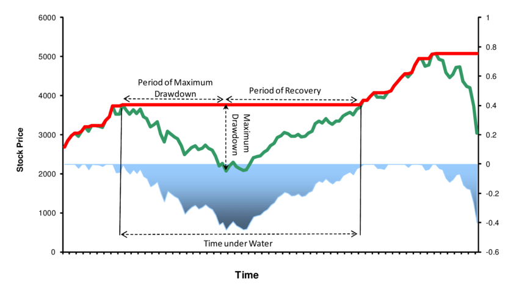

## Table of Contents

## What is a drawdown in the context of finance?

A drawdown in finance is when an investment or a trading account loses value from its highest point to its lowest point before it starts to recover. Imagine you have $100 and it grows to $150. If it then drops to $100, that $50 drop from $150 to $100 is called a drawdown.

Drawdowns are important because they show how risky an investment can be. A bigger drawdown means the investment can lose a lot of value quickly, which can be scary for investors. By looking at past drawdowns, investors can get a better idea of how much they might lose in the future and decide if they are okay with that risk.

## How do drawdowns differ between banking and trading?

In banking, a drawdown usually refers to when someone takes money out of their loan or credit line. Imagine you have a home loan and you take out some of the money to fix your house. That's a drawdown. Banks care about drawdowns because they need to make sure people can pay back the money they take out. If too many people take out money and can't pay it back, the bank can get into trouble.

In trading, a drawdown is different. It's about how much money you lose in your trading account from its highest value to its lowest before it goes up again. Let's say you start trading with $1,000 and it grows to $1,200. If it then drops to $900, that $300 drop from $1,200 to $900 is a drawdown. Traders watch drawdowns closely because they show how risky their trading strategy is. A big drawdown can mean a lot of stress and worry about losing money.

## What are the common causes of drawdowns in banking?

In banking, drawdowns happen when people take money out of their loans or credit lines. A common cause is when someone needs money for something important, like fixing their house or paying for school. If a lot of people take out money at the same time, it can create a big drawdown for the bank. This can be risky if the bank doesn't have enough money to cover all the loans.

Another cause of drawdowns in banking is when the economy is not doing well. During tough times, more people might need to use their loans to get by. If many people are struggling and can't pay back what they borrowed, it can lead to bigger drawdowns. Banks have to be careful and plan for these situations to make sure they don't run out of money.

## What are the typical reasons for drawdowns in trading?

Drawdowns in trading happen when the value of a trader's account drops from its highest point to its lowest before it starts to go up again. One common reason for this is when the market goes down. If a trader has bought stocks or other things that lose value, their account will also lose value. This can happen because of bad news about a company, changes in the economy, or other things that make people want to sell their investments.

Another reason for drawdowns is when a trader makes a mistake. Trading can be tricky, and even experienced traders can get it wrong sometimes. If a trader buys something at the wrong time or doesn't have a good plan, they might lose money. Using too much borrowed money, or leverage, can also make drawdowns bigger because it means the trader can lose more than they started with.

Sometimes, drawdowns happen because of things a trader can't control, like sudden events or big changes in the market. For example, if there's a surprise event like a natural disaster or a big political change, it can cause the market to move a lot and lead to drawdowns. Traders need to be ready for these surprises and have a plan to handle them.

## How can drawdowns impact the financial stability of a bank?

Drawdowns can hurt a bank's financial stability if too many people take money out of their loans at the same time. Imagine a bank has given out a lot of home loans and many people decide to use that money to fix their houses or pay for other big things. If the bank doesn't have enough money to cover all these drawdowns, it can get into trouble. Banks need to keep some money on hand to make sure they can give out what people have borrowed, so big drawdowns can make it hard for them to stay stable.

If the economy is doing badly, drawdowns can be even more of a problem. When people are struggling to make ends meet, they might need to take more money out of their loans just to get by. If a lot of people can't pay back what they borrowed, the bank's money can start to run low. This can make the bank less stable because it has less money to lend out and might have to borrow money itself, which can be risky. So, banks need to be careful and plan for times when drawdowns might be bigger than usual.

## What are the effects of drawdowns on a trader's portfolio?

Drawdowns can really shake up a trader's portfolio. When the value of a trader's account goes down a lot, it can be scary and stressful. The trader might start to doubt their trading plan and think about selling everything to stop the losses. But if they do that, they might miss out on the chance for their investments to go back up. So, drawdowns can make traders feel unsure and might make them change their plans in ways that aren't good for them in the long run.

Also, drawdowns can mess up a trader's money plans. If a big drawdown happens, the trader might not have enough money to keep trading the way they want to. They might need to use more of their own money or borrow more, which can be risky. Plus, if the trader is counting on the money in their portfolio for things like paying bills or saving for the future, a big drawdown can make those plans harder to stick to. So, drawdowns can affect not just the trader's feelings but also their money situation.

## What strategies can banks use to manage and mitigate drawdowns?

Banks can manage drawdowns by keeping a close eye on how much money people are taking out of their loans. They need to make sure they always have enough money on hand to cover these drawdowns. One way to do this is by setting limits on how much money people can take out at one time. This helps the bank stay stable even if a lot of people want to use their loans at the same time. Another way is by having good rules about who can get a loan and how much they can borrow. By being careful about who they lend to, banks can lower the chance of big drawdowns.

Another strategy is for banks to have a strong plan for when the economy is not doing well. During tough times, more people might need to take money out of their loans, which can lead to bigger drawdowns. Banks can prepare for this by saving up extra money during good times. They can also buy special insurance that helps them if a lot of people can't pay back their loans. By planning ahead, banks can handle drawdowns better and keep their money safe.

## What trading techniques can be employed to minimize drawdowns?

One way to minimize drawdowns in trading is by using something called stop-loss orders. A stop-loss order is like a safety net that automatically sells your investment if it drops to a certain price. This can help stop your losses from getting too big. Another technique is to spread out your money across different types of investments, which is called diversification. If one investment goes down a lot, the others might not go down as much, so your overall losses won't be as bad.

Another helpful technique is to use less borrowed money, or leverage. When you borrow a lot of money to trade, your losses can get bigger if things go wrong. By using less leverage, you can keep your drawdowns smaller. Also, having a clear trading plan and sticking to it can help. If you know when to buy and sell based on your plan, you can make better choices and avoid big losses. So, by being careful and having a good strategy, you can keep your drawdowns in check.

## How do regulatory requirements affect drawdown management in banking?

Regulatory requirements can help banks manage drawdowns better. Rules set by governments and financial watchdogs make sure banks have enough money to cover the loans people take out. For example, banks have to keep a certain amount of money on hand, called reserves. This helps them handle drawdowns without running out of money. Also, rules about how much risk banks can take make them think carefully about who they lend to and how much they let people borrow. This can stop big drawdowns from happening in the first place.

Sometimes, these rules can make things a bit harder for banks. They have to follow a lot of rules and keep good records to show they are doing things right. This can take time and money, but it's important for keeping the bank safe and stable. By following the rules, banks can be better prepared for drawdowns and make sure they have enough money to handle them. In the end, these regulations help protect both the bank and the people who borrow money from it.

## What role does risk management play in controlling drawdowns in trading?

Risk management is super important for controlling drawdowns in trading. It's all about making smart choices to keep losses small. Traders use risk management to decide how much money they're okay with losing on each trade. They might use stop-loss orders, which are like safety nets that automatically sell an investment if it drops too much. This can help stop a big drawdown before it gets too bad. Also, traders spread out their money across different investments, which is called diversification. This way, if one investment goes down a lot, the others might not go down as much, so the overall loss isn't as big.

Another part of risk management is using less borrowed money, or leverage. When traders borrow a lot of money to trade, their losses can get bigger if things go wrong. By using less leverage, they can keep their drawdowns smaller. Having a clear trading plan and sticking to it is also key. If traders know when to buy and sell based on their plan, they can make better choices and avoid big losses. So, by being careful and having a good strategy, traders can use risk management to keep their drawdowns in check and protect their money.

## Can you compare historical drawdown events in banking and trading, and their outcomes?

In banking, one of the biggest historical drawdown events was the 2008 financial crisis. It started when a lot of people couldn't pay back their home loans. Banks had given out too many risky loans, and when people started to default, the banks lost a lot of money. This led to huge drawdowns for many banks, some of which even went bankrupt. Governments had to step in with bailouts to help the banks and stop the whole financial system from falling apart. The crisis showed how important it is for banks to manage their loans carefully and have enough money on hand to handle big drawdowns.

In trading, the 1987 stock market crash, also known as Black Monday, is a famous example of a big drawdown. On October 19, 1987, stock markets around the world dropped a lot, with the U.S. market falling by about 20% in one day. Many traders lost a lot of money because they were using a lot of borrowed money, or leverage. The big drawdown caused panic and made people sell their investments quickly, which made the drop even worse. After the crash, rules were changed to try to stop such big drawdowns from happening again. Traders learned to be more careful about how much they borrow and to have better plans for managing risk.

## How do advanced statistical models help in predicting and managing drawdowns in both sectors?

In banking, advanced statistical models help predict and manage drawdowns by looking at lots of data to see how likely it is that people won't be able to pay back their loans. These models can figure out which loans are risky and help banks decide who to lend money to and how much. By using these models, banks can set aside enough money to cover big drawdowns if they happen. This helps the bank stay safe and stable even when the economy is not doing well. The models also help banks follow the rules set by governments, making sure they have enough money on hand to handle drawdowns without getting into trouble.

In trading, these models are used to predict how the market might move and how big drawdowns could be. Traders use them to make better decisions about when to buy and sell investments. By understanding the risks better, traders can set up stop-loss orders and other safety nets to keep their losses small. The models also help traders figure out how much borrowed money, or leverage, to use, which can stop drawdowns from getting too big. Overall, these statistical models help traders manage their portfolios better and feel more confident, even when the market is going up and down a lot.

## What is a Financial Drawdown?

A financial drawdown refers to the peak-to-trough decline experienced by an investment or portfolio over a specified time period. This metric is crucial for investors and financial analysts as it provides a quantitative measure of the loss from the highest value reached (peak) to the lowest point (trough), before a new peak occurs. The drawdown percentage can be calculated using the formula:

$$
\text{Drawdown (\%)} = \left( \frac{\text{Peak Value} - \text{Trough Value}}{\text{Peak Value}} \right) \times 100
$$

Drawdowns play a vital role in risk management strategies, helping investors to assess the potential severity of losses they might encounter. This information is integral to determining the resilience and [volatility](/wiki/volatility-trading-strategies) of an investment or portfolio, guiding decision-making on whether it aligns with an investor's risk appetite and financial goals.

Understanding drawdowns enables investors to evaluate the sustainability and performance of investment strategies by monitoring the frequency and extent of losses. A portfolio witnessing frequent or substantial drawdowns may signal higher volatility, suggesting the need for adjustments or diversification to mitigate risks. Conversely, minimal drawdown levels might indicate a stable and robust investment approach.

Across various financial sectors, drawdowns are assessed differently, depending on the nature of the investment and the typical market conditions. In the trading sector, drawdowns could highlight potential flaws in trading strategies or unfavorable market dynamics. In banking, careful monitoring of drawdowns can assist in managing [liquidity](/wiki/liquidity-risk-premium) and ensuring financial stability, particularly in loan portfolios and credit lines. Algorithmic traders focus on optimizing their algorithms to handle drawdown phases effectively, employing techniques such as [backtesting](/wiki/backtesting) to predict potential risks and enhance strategy robustness.

Overall, the concept of financial drawdowns is indispensable in risk management, offering insights into possible adverse scenarios and aiding in the execution of informed investment decisions that align with an individual's or institution's financial strategies and objectives.

## What are Trading Drawdowns?

A drawdown in trading occurs when an investor's capital diminishes due to a succession of unsuccessful trades. It reflects the peak-to-trough decline of an investment's value before any new peaks are achieved. Analyzing drawdowns is integral for traders as it enables effective risk management, helping them sustain their investment portfolios during turbulent market periods.

The severity of a drawdown can act as a diagnostic tool, highlighting potential flaws in trading strategies or adverse market conditions. For example, if a trader experiences a significant drawdown, it could be indicative of systemic issues such as inadequate stop-loss mechanisms or poor entry and [exit](/wiki/exit-strategy) strategies. Thus, tracking drawdowns helps in pinpointing these weaknesses, providing traders with insights into necessary adjustments.

Recovering from and minimizing the impact of drawdowns involves a variety of strategies. A common tactic is the implementation of stop-loss orders, which automatically sell a security when its price drops to a predetermined level. This helps limit losses by cutting the trade before the drawdown deepens further. Moreover, traders often diversify their portfolios across different asset classes to mitigate individual asset risks. By spreading risks, traders can soften the blow of a major loss in a single sector or security.

Psychological resilience is equally vital for traders coping with drawdowns. Large drawdowns can be emotionally taxing, potentially leading to irrational decision-making. Maintaining discipline and adhering to a well-defined trading plan are essential strategies that promote both financial and emotional endurance. Cognitive biases, such as loss aversion, need to be managed to avoid compounding losses through impulsive trading decisions.

In assessing trading drawdowns, several key metrics are utilized. The maximum drawdown (MDD) is a critical measure, representing the largest peak-to-trough decline in portfolio value observed over a specific period. The formula for maximum drawdown is:

$$
\text{MDD} = \frac{\text{Trough Value} - \text{Peak Value}}{\text{Peak Value}} \times 100\%
$$

This metric is valuable for traders as it quantifies the worst-case scenario of capital erosion, allowing for an assessment of the potential risk exposure.

Additionally, traders examine recovery time, which is the period needed to recover from a drawdown and return to peak portfolio value. Longer recovery times can signal inefficiencies in trading strategies, urging a revision of risk management techniques.

In conclusion, comprehending trading drawdowns is crucial for maintaining both psychological and financial resilience. By analyzing drawdowns and implementing robust strategies such as stop-loss orders and portfolio diversification, traders can better manage risks and enhance their chances of long-term success in the financial markets.

## What are Algorithmic Trading Drawdowns?

Algorithmic trading, characterized by the use of computers to execute a trading strategy based on a predetermined set of rules, inherently faces periods of drawdowns. These are crucial moments when the automated trading system experiences a decline in capital from a peak to a trough. Understanding and managing drawdowns is essential for ensuring the long-term success and profitability of such trading systems.

Measuring and controlling drawdowns is integral to the development and refinement of trading algorithms. A drawdown is quantitatively expressed as the percentage decline from the peak value to the trough value over a specified period. It is calculated as:

$$
\text{Drawdown} = \frac{\text{Peak Value} - \text{Trough Value}}{\text{Peak Value}} \times 100\%
$$

Algorithm developers use this metric to assess the risk and volatility associated with their strategies. High drawdowns may suggest the need for improvement in the algorithm to make it more resilient against adverse market conditions.

To enhance their trading systems, traders employ various techniques to reduce the impact of drawdowns. Optimization processes are central to these efforts, allowing adjustments in algorithm parameters to balance risk and return. Sensitivity analysis can also be conducted to identify how different market conditions impact the drawdown, and iterative simulations aid in refining strategies.

Backtesting is pivotal in predicting and managing drawdowns. By applying the algorithm to historical market data, traders can observe its performance over time, noting periods of significant drawdowns and their causes. This data-driven approach allows the identification of weaknesses and aids in the calibration of the algorithm to better handle future market scenarios. Furthermore, [machine learning](/wiki/machine-learning) methods are often employed to improve predictive capabilities and adapt to new patterns in financial data.

Machine learning enhances the robustness of [algorithmic trading](/wiki/algorithmic-trading) strategies by incorporating predictive models capable of learning from continuous data streams. Models such as recurrent neural networks (RNNs) or [long short](/wiki/equity-long-short)-term memory (LSTM) networks can capture temporal dependencies in financial market data, improving the prediction of drawdown occurrences. Implementing such advanced techniques helps traders craft more resilient algorithms capable of minimizing drawdowns' adverse effects.

In conclusion, a comprehensive understanding of drawdowns can significantly bolster the robustness of algorithmic trading strategies. Through meticulous measurement, optimization, and the application of advanced predictive models, traders can design systems better equipped to withstand financial fluctuations, thereby ensuring more stable and profitable trading operations.

## References & Further Reading

[1]: Bergstra, J., Bardenet, R., Bengio, Y., & Kégl, B. (2011). ["Algorithms for Hyper-Parameter Optimization."](https://papers.nips.cc/paper/4443-algorithms-for-hyper-parameter-optimization) Advances in Neural Information Processing Systems 24.

[2]: ["Advances in Financial Machine Learning"](https://www.amazon.com/Advances-Financial-Machine-Learning-Marcos/dp/1119482089) by Marcos Lopez de Prado

[3]: ["Evidence-Based Technical Analysis: Applying the Scientific Method and Statistical Inference to Trading Signals"](https://www.amazon.com/Evidence-Based-Technical-Analysis-Scientific-Statistical/dp/0470008741) by David Aronson

[4]: ["Machine Learning for Algorithmic Trading"](https://github.com/stefan-jansen/machine-learning-for-trading) by Stefan Jansen

[5]: ["Quantitative Trading: How to Build Your Own Algorithmic Trading Business"](https://www.amazon.com/Quantitative-Trading-Build-Algorithmic-Business/dp/1119800064) by Ernest P. Chan