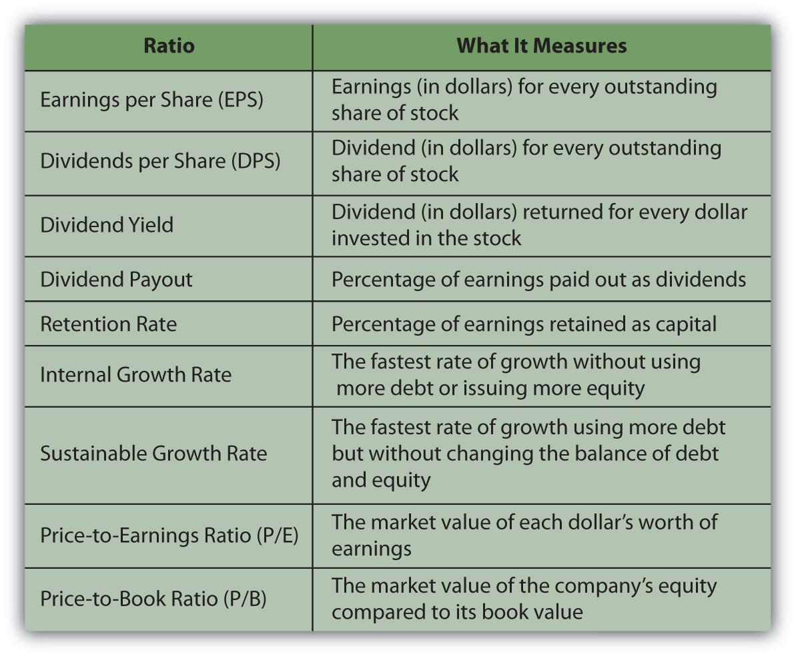

The financial world is filled with numerous metrics and ratios that help investors evaluate the profitability and potential of companies. Two key financial metrics that play crucial roles in shaping investment decisions are Earnings Per Share (EPS) and Dividends Per Share (DPS). Both EPS and DPS are pivotal in helping investors assess the financial health and potential returns of their investments. In addition to these traditional financial ratios, the integration of algorithmic trading has significantly transformed the landscape of investment.

Earnings Per Share (EPS) is an important indicator of a company's profitability. It is calculated by taking the net income of a company, subtracting any preferred dividends, and dividing the result by the average number of outstanding shares. Mathematically, EPS can be represented as:



$$
\text{EPS} = \frac{\text{Net Income} - \text{Preferred Dividends}}{\text{Average Outstanding Shares}}
$$

This ratio provides insight into how much profit is allocated to each share of stock and is frequently used by analysts to determine the value of a company's stock.

On the other hand, Dividends Per Share (DPS) indicates the cash distribution a shareholder receives from a company's earnings and is expressed as the total dividends declared per share over a defined period. DPS helps income-focused investors evaluate a company's ability to generate cash returns on their investments and assess its dividend policy. 

Algorithmic trading, commonly referred to as 'algo trading,' leverages computer programs to execute trades at optimal times based on pre-designed criteria. This method of trading allows market participants to process large data volumes swiftly and perform trades with precision. The strategic use of algorithms can incorporate real-time financial metrics, such as EPS and DPS, to forecast stock performance effectively.

This article explores the significance of EPS and DPS and their application within algorithmic trading strategies, providing investors with enhanced tools for making informed decisions. Understanding these financial indicators and the role of algo trading is essential for navigating the modern investment landscape.

## Table of Contents

## Understanding Earnings Per Share (EPS)

Earnings Per Share (EPS) is a crucial financial metric employed by analysts and investors to gauge a company's profitability and determine its stock value. EPS is calculated using the formula:

$$
EPS = \frac{{\text{Net Income} - \text{Preferred Dividends}}}{{\text{Average Outstanding Shares}}}
$$

This ratio offers insights into how much profit a company allocates to each share of its stock. A higher EPS typically indicates a more profitable company, which can influence investor perception and decision-making.

It is important to note that EPS can be affected by the issuance of new shares, a process known as dilution. When a company issues additional shares, the number of shares outstanding increases, potentially reducing the EPS. This dilution can impact an investor's view of the stock's value, as it suggests that each share now represents a smaller portion of the company's earnings.

Evaluating EPS allows investors to understand a company's financial health and track its profitability trends over time. For instance, a growing EPS over consecutive quarters may indicate a company's strong financial performance and potential for growth, making it attractive to investors seeking income and capital appreciation.

Incorporating EPS into investment decisions provides a more nuanced picture of a company's financial status. Analysts often compare a company's EPS with its historical performance or with peer companies within the same industry to assess its relative standing. Moreover, changes in EPS can inform investors about a company’s operational efficiency and viability in the market.

By leveraging EPS data, investors can make more informed decisions, aligning their portfolios with companies that demonstrate consistent profitability and sustainable growth trajectories. This makes EPS a vital tool for anyone engaged in stock analysis and investment planning.

## Exploring Dividends Per Share (DPS)

Dividends Per Share (DPS) is a financial metric that measures the amount of dividends allocated to each outstanding share of a company's stock over a specific period. It serves as an important indicator for income-focused investors, as it reveals the cash inflow received by shareholders from their investment. Calculating DPS involves dividing the total dividends declared by a company by the number of outstanding shares:

$$
\text{DPS} = \frac{\text{Total Dividends}}{\text{Total Outstanding Shares}}
$$

This metric is crucial in assessing a company's dividend policy, which influences its attractiveness to investors seeking regular income streams. Companies with high DPS often appeal to those who prioritize immediate returns over long-term growth prospects.

Understanding DPS assists investors in evaluating a company's capacity to generate shareholder cash flow. For instance, a firm with a steady or increasing DPS over time is generally perceived as financially healthy and committed to distributing profits to investors. In contrast, companies that refrain from paying dividends might choose to reinvest earnings into growth opportunities, suggesting a focus on expansion rather than immediate returns.

Investors who utilize dividend growth models prioritize DPS in their calculations to estimate the present value and future performance of a company's stock. Such models often assume that dividends will grow at a consistent rate, and they use this growth rate to project future profits. By predicting these cash flows, investors can determine the intrinsic value of a stock, which aids in making informed investment decisions.

In summary, DPS is a vital metric that reflects a company's ability and willingness to distribute profits to its shareholders. It offers insights into corporate financial policies and helps investors evaluate potential income and growth prospects.

## Key Differences Between EPS and DPS

Earnings Per Share (EPS) and Dividends Per Share (DPS) are critical financial metrics, each serving distinct purposes in evaluating a company's financial performance. Despite their related nature, they address different aspects of profitability and shareholder value.

EPS, or Earnings Per Share, measures the portion of a company's net income allocated to each share of common stock. It is calculated using the formula:

$$
\text{EPS} = \frac{\text{Net Income} - \text{Preferred Dividends}}{\text{Average Outstanding Shares}}
$$

This metric provides insight into a company's profitability from the perspective of individual shareholders. By focusing on the earnings available to each share, EPS allows investors to gauge the company's financial health and profitability trends over time. EPS is a critical [factor](/wiki/factor-investing) influencing stock pricing, as it reflects a company's ability to generate profits and sustain growth.

On the other hand, DPS, or Dividends Per Share, signifies the amount of cash dividends distributed to each share over a specified period. DPS is calculated as:

$$
\text{DPS} = \frac{\text{Total Dividends Paid}}{\text{Total Number of Outstanding Shares}}
$$

DPS is vital for income-focused investors who prioritize dividend income over capital gains. It reflects a company's commitment to sharing profits with its shareholders, offering a direct measure of the cash flow returned to investors. Companies that consistently provide high DPS are often seen as stable investments with reliable income streams.

While EPS indicates the portion of earnings attributable to each share, it does not account for dividend payouts. Consequently, EPS is a broader measure of overall profitability, whereas DPS concentrates specifically on income distribution. EPS tends to have a more pronounced effect on share prices by highlighting profitability trends, whereas DPS primarily concerns income returns to shareholders.

Investors often consider both EPS and DPS to gain a comprehensive understanding of a company's financial status. EPS alone may not fully capture shareholder value if significant earnings are not distributed as dividends. Conversely, focusing solely on DPS could overlook the broader earnings potential of the company. Therefore, balancing these metrics allows for a more nuanced evaluation of a company's financial performance and its strategies regarding earnings distribution.

## The Role of Algorithmic Trading

Algorithmic trading, commonly referred to as 'algo trading', harnesses the power of computer programs to automate trading activities by executing trades at optimal times based on pre-defined criteria. This technology has transformed the financial markets, largely due to its ability to process enormous volumes of data with unmatched speed and precision. 

Central to the effectiveness of [algorithmic trading](/wiki/algorithmic-trading) is its capacity to incorporate complex data inputs, such as Earnings Per Share (EPS) and Dividends Per Share (DPS). By inputting these metrics, algorithms can enhance predictions about stock performance and facilitate data-driven investment decisions. EPS and DPS provide insights into a company's financial health and distribution of profits, permitting algorithms to assess and adjust trading strategies dynamically. 

Traders use algorithms to exploit real-time financial patterns and discrepancies in stock prices, often executing trades faster than any human could, thereby seizing opportunities for profit that might otherwise be missed. For example, an algorithm might detect an increase in EPS as a prompt for a buy signal, factoring in historical data and market trends to make informed decisions instantly.

Moreover, the strategic use of EPS and DPS within these frameworks assists investors in optimizing returns while effectively managing risk. By constantly analyzing fluctuations in these metrics, algorithms can predict future performance and potential market movements. This predictive ability allows traders to act preemptively, positioning themselves advantageously against market changes.

The integration of EPS and DPS data into trading algorithms can be illustrated through a simplified Python code snippet that triggers buy or sell actions based on changes in these financial metrics:

```python
def trading_algorithm(eps, dps, historical_data):
    # Define threshold for EPS and DPS changes
    eps_threshold = 0.05
    dps_threshold = 0.03

    # Calculate percentage change in EPS and DPS
    eps_change = (eps - historical_data['eps']) / historical_data['eps']
    dps_change = (dps - historical_data['dps']) / historical_data['dps']

    # Decision making based on threshold
    if eps_change > eps_threshold and dps_change > dps_threshold:
        return "Buy"
    elif eps_change < -eps_threshold or dps_change < -dps_threshold:
        return "Sell"
    else:
        return "Hold"

# Example usage
current_eps = 2.50
current_dps = 1.00
historical_eps_dps = {'eps': 2.30, 'dps': 0.95}

action = trading_algorithm(current_eps, current_dps, historical_eps_dps)
print(action)
```

In this script, the algorithm evaluates changes in EPS and DPS relative to their historical values. Actions are triggered based on predefined threshold values, guiding traders in executing buy, sell, or hold decisions.

In conclusion, algorithmic trading, when combined with the analysis of EPS and DPS, provides a powerful mechanism for investors to enhance their trading strategies. The ability to quickly adapt to market signals and leverage detailed financial insights ensures that traders can optimize their positions in an increasingly fast-paced and data-driven marketplace.

## Combining EPS, DPS, and Algo Trading for Investment Strategies

In today's fast-paced financial markets, effectively combining the analysis of Earnings Per Share (EPS) and Dividends Per Share (DPS) with algorithmic trading techniques empowers investors to adapt their strategies to dynamic market conditions. Earnings Per Share is utilized to assess profitability, while Dividends Per Share reflects the cash flow returned to shareholders. Integrating these metrics with algorithmic trading allows investors to leverage real-time data and enhance their decision-making processes.

Algorithmic trading, known for its ability to process vast datasets and make rapid trading decisions, excels at interpreting changes in EPS and DPS. This immediate adaptability offers a competitive advantage over traditional manual trading. When EPS or DPS figures are released, algorithms can swiftly react to potential profit opportunities, executing trades based on pre-set criteria.

To maintain the effectiveness of these algorithms, continuous updating is essential. As financial reports and data evolve, algorithms should be recalibrated to incorporate the latest EPS and DPS [statistics](/wiki/bayesian-statistics). This ensures alignment with current market realities and enhances the potential for profit.

Striking a balance between traditional financial metrics and advanced technology is crucial. While EPS and DPS provide fundamental insights into a company's financial health, algorithmic trading introduces speed and precision. Investors who effectively integrate these elements into their strategies often achieve more robust and comprehensive outcomes, maximizing returns while managing risks efficiently.

Adapting to changing market conditions requires a dynamic approach. By understanding and utilizing the interactions between profitability measures and real-time trading algorithms, investors can gain a distinct advantage, seizing opportunities quickly and adjusting strategies as necessary. This synergy between financial analysis and technological execution is vital for navigating today's volatile markets successfully.

## Conclusion

Earnings Per Share (EPS) and Dividends Per Share (DPS) are fundamental metrics that remain essential in evaluating a company's financial health and its policy regarding shareholder returns. EPS provides insights into a company’s profitability, indicating the portion of a company's profit allocated to each outstanding share of common stock. In contrast, DPS highlights the company's commitment to sharing profits with shareholders through dividends, providing a direct measure of cash returned to investors on a per-share basis.

Incorporating these metrics within algorithmic trading frameworks enables more dynamic and data-driven investment strategies. Algorithmic trading, characterized by using computer programs to execute trades based on pre-defined criteria, leverages the analytical power of EPS and DPS data to enhance decision-making processes. The integration amplifies the ability to analyze real-time financial patterns, offering opportunities to optimize returns and manage risk effectively.

Navigating the volatile financial markets demands a blend of [fundamental analysis](/wiki/fundamental-analysis)—understanding market conditions, company performance, and economic factors—and innovative trading solutions such as algorithmic trading. The synergy between traditional financial metrics like EPS and DPS and automated trading technology results in a comprehensive approach to modern investing.

By understanding the complex interplay between EPS, DPS, and algorithmic trading, investors can refine their strategies, enhance their decision-making, and improve investment outcomes. This strategic combination not only aids in monitoring a company's financial status but also in capitalizing on market inefficiencies. 

As trading practices evolve, they promise increased efficiency and greater opportunities in leveraging financial data. The continual advancement of technologies in trading ensures that investors can keep pace with dynamic market changes, potentially leading to more successful investment strategies and better engagement with the financial markets.

## References & Further Reading

[1]: ["Advances in Financial Machine Learning"](https://www.amazon.com/Advances-Financial-Machine-Learning-Marcos/dp/1119482089) by Marcos Lopez de Prado

[2]: ["Evidence-Based Technical Analysis: Applying the Scientific Method and Statistical Inference to Trading Signals"](https://www.amazon.com/Evidence-Based-Technical-Analysis-Scientific-Statistical/dp/0470008741) by David Aronson

[3]: ["Machine Learning for Algorithmic Trading"](https://github.com/PacktPublishing/Machine-Learning-for-Algorithmic-Trading-Second-Edition) by Stefan Jansen

[4]: ["Quantitative Trading: How to Build Your Own Algorithmic Trading Business"](https://www.amazon.com/Quantitative-Trading-Build-Algorithmic-Business/dp/1119800064) by Ernest P. Chan

[5]: Bodie, Z., Kane, A., & Marcus, A. J. (2014). "Investments." McGraw-Hill Education. 

[6]: Schwert, G. W. (2003). ["Anomalies and market efficiency,"](https://papers.ssrn.com/sol3/papers.cfm?abstract_id=338080) Handbook of the Economics of Finance. 

[7]: Barber, B. M., & Odean, T. (2001). ["Boys will be boys: Gender, overconfidence, and common stock investment."](https://academic.oup.com/qje/article/116/1/261/1939000)00061-2) The Quarterly Journal of Economics.