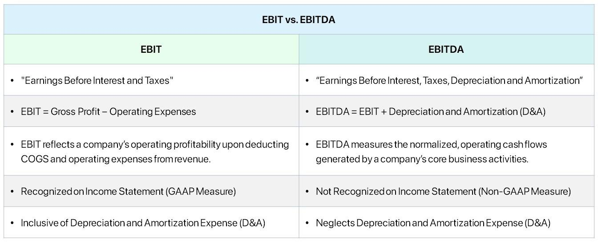

## Table of Contents

## What does EBIT stand for?

EBIT stands for Earnings Before Interest and Taxes. It is a way to measure a company's profit by looking at how much money it makes from its main business activities before taking away the costs of interest and taxes. This helps people see how well the company is doing at making money from what it does, without the influence of how it is financed or taxed.

People often use EBIT to compare different companies because it takes out the effects of different tax rates and debt levels. For example, if two companies are similar but one has a lot of debt and the other does not, looking at EBIT can help you see which one is better at making money from its business, not just from how it manages its debt. This makes it easier to understand the true performance of a company's core operations.

## What does EBITDA stand for?

EBITDA stands for Earnings Before Interest, Taxes, Depreciation, and Amortization. It is a way to measure how much money a company is making from its main business activities before taking away the costs of interest, taxes, and the expenses from wearing out or using up assets over time (depreciation and amortization).

People use EBITDA to get a clearer picture of a company's operating performance without the impact of how it is financed, its tax situation, or how it accounts for the gradual reduction in value of its assets. It's especially useful for comparing companies in the same industry because it removes these additional factors, making it easier to see which company is better at making money from what it does day to day.

## How is EBIT calculated?

To calculate EBIT, you start with a company's total revenue. From this, you subtract all the costs that the company has to run its main business, like the cost of goods sold, salaries, rent, and other operating expenses. What you're left with is the company's operating profit, which is another name for EBIT. So, EBIT is simply total revenue minus operating expenses.

EBIT is useful because it shows how well a company is doing at making money from its main business activities, without the effects of how it pays for its operations or its tax situation. For example, if a company has a lot of debt, it will have high interest payments, but these don't affect the EBIT number. This makes it easier to compare different companies, because you can see which one is better at running its business, not just at managing its debt or taxes.

## How is EBITDA calculated?

To calculate EBITDA, you start with a company's total revenue. From this, you subtract all the costs that the company has to run its main business, like the cost of goods sold, salaries, rent, and other operating expenses. This gives you the company's operating profit, which is also known as EBIT. To get to EBITDA, you then add back the money the company has spent on depreciation and amortization. These are costs that show how much the value of the company's assets has gone down over time, but they don't involve any actual money going out of the company.

EBITDA is useful because it shows how much money a company is making from its main business activities before taking away the costs of interest, taxes, and the expenses from wearing out or using up assets over time. This makes it easier to compare different companies because it takes out the effects of how they are financed, their tax situation, and how they account for the gradual reduction in value of their assets. For example, if two companies are similar but one has a lot of debt and the other does not, looking at EBITDA can help you see which one is better at making money from its business, not just from how it manages its debt or taxes.

## What is the main difference between EBIT and EBITDA?

The main difference between EBIT and EBITDA is that EBITDA adds back depreciation and amortization to EBIT. EBIT, or Earnings Before Interest and Taxes, shows how much money a company makes from its main business activities before taking away the costs of interest and taxes. It helps people see how well the company is doing at making money from what it does, without the influence of how it is financed or taxed.

EBITDA, or Earnings Before Interest, Taxes, Depreciation, and Amortization, goes a step further by also adding back the costs of depreciation and amortization to EBIT. Depreciation and amortization are expenses that show how much the value of the company's assets has gone down over time, but they don't involve any actual money going out of the company. By adding these back, EBITDA gives a clearer picture of how much cash the company is generating from its main business activities, making it easier to compare different companies, especially in industries where assets wear out quickly.

## Why might a company prefer to use EBIT over EBITDA?

A company might prefer to use EBIT over EBITDA because it gives a more accurate picture of the company's actual operating performance. EBIT, or Earnings Before Interest and Taxes, shows how much money the company is making from its main business activities before taking away the costs of interest and taxes. This means it includes the costs of depreciation and amortization, which are real expenses that show how much the company's assets are wearing out over time. By including these costs, EBIT gives a better idea of the company's true profit from its operations, which is important for understanding its financial health.

On the other hand, EBITDA, or Earnings Before Interest, Taxes, Depreciation, and Amortization, adds back depreciation and amortization to EBIT. This can make a company's earnings look higher than they really are, because it doesn't account for the costs of maintaining or replacing assets. Some companies might use EBITDA to make their performance look better, especially if they have a lot of expensive equipment that depreciates quickly. But for a more realistic view of how well a company is doing at making money from its business, EBIT is often a better choice.

## Why might a company prefer to use EBITDA over EBIT?

A company might prefer to use EBITDA over EBIT because it shows how much money the company is making from its main business activities without including the costs of depreciation and amortization. These costs can be big for companies that have a lot of equipment or other assets that wear out over time. By not counting these costs, EBITDA gives a clearer picture of how much cash the company is generating from its day-to-day operations. This can be really helpful for comparing different companies, especially in industries where assets wear out quickly, like manufacturing or transportation.

Also, EBITDA can make a company's earnings look better because it adds back those depreciation and amortization costs. This can be useful when a company wants to show investors or lenders how much money it is making before it has to spend on replacing its equipment or other assets. It's like looking at the company's income before it has to pay for things that will wear out. This can be a good way to see the company's potential to generate cash, but it's important to remember that it's not the whole story because it leaves out some real costs that the company will eventually have to pay.

## How do EBIT and EBITDA affect a company's valuation?

EBIT and EBITDA can affect a company's valuation because they show how much money the company is making from its main business activities. When people want to know how much a company is worth, they often look at these numbers. EBIT tells you how much money the company makes before paying interest and taxes, which is important because it shows how well the company is doing at making money from what it does every day. If a company has a high EBIT, it might be valued higher because it shows that the company is good at making money from its business.

EBITDA goes a step further by adding back the costs of depreciation and amortization to EBIT. These costs are about how much the company's equipment and other assets are wearing out over time. By not counting these costs, EBITDA can make a company's earnings look higher, which might make the company seem more valuable. Investors and buyers might use EBITDA to compare different companies, especially in industries where equipment wears out quickly. But it's important to remember that EBITDA doesn't show the whole picture because it leaves out some real costs that the company will eventually have to pay.

## Can you provide an example of how EBIT and EBITDA can differ significantly for the same company?

Imagine a company called Big Truck Inc. that makes and sells big trucks. They have a lot of expensive equipment that they use to build these trucks, and this equipment wears out over time. In one year, Big Truck Inc. made $10 million from selling trucks. But, they had to spend $6 million on things like salaries, rent, and other costs to run their business. This leaves them with an EBIT of $4 million, which is their earnings before they pay interest and taxes.

Now, let's look at their EBITDA. The company also had to account for $2 million in depreciation because their equipment is getting older and less valuable. When you add this $2 million back to their EBIT, their EBITDA becomes $6 million. This is a big difference! The EBIT shows that after paying for all the costs of running the business, including the wear and tear on their equipment, they made $4 million. But the EBITDA makes it look like they made $6 million because it doesn't count the cost of the equipment wearing out. This example shows how EBIT and EBITDA can be very different for the same company, especially when they have a lot of equipment that depreciates quickly.

## What are the limitations of using EBIT and EBITDA for financial analysis?

Using EBIT and EBITDA for financial analysis can be helpful, but they have some limitations. One big problem is that they don't show the whole picture of a company's finances. For example, EBIT doesn't include the costs of interest and taxes, which are real expenses that affect how much money a company actually keeps. If a company has a lot of debt, its interest payments can be a big deal. And taxes are something every company has to pay, so leaving them out can make a company look more profitable than it really is.

EBITDA has its own issues too. It adds back depreciation and amortization, which are costs for how much a company's equipment and other assets are wearing out over time. These are real costs that the company will eventually have to pay to replace or fix their equipment. By not counting these costs, EBITDA can make a company's earnings look higher than they really are. This can be misleading, especially for companies that have a lot of expensive equipment that needs to be replaced often. So, while EBIT and EBITDA can be useful for comparing companies, it's important to look at other numbers too to get a full understanding of a company's financial health.

## How do industry standards influence the choice between EBIT and EBITDA?

Industry standards can play a big role in whether a company chooses to use EBIT or EBITDA. In some industries, like tech or service companies, where they don't have a lot of expensive equipment that wears out, EBIT might be more common. These companies don't have big depreciation costs, so using EBIT gives a good picture of how they're doing at making money from their business. On the other hand, in industries like manufacturing or transportation, where companies have a lot of equipment that gets old and needs replacing, EBITDA might be more popular. These companies have big depreciation costs, so using EBITDA helps them show how much cash they're making before they have to spend on new equipment.

Also, what's common in an industry can affect how investors and analysts look at a company. If everyone in the industry uses EBITDA, then a company might use it too, just so they can be compared easily with others. But if EBIT is the standard, then using EBITDA might make the company look different in a way that could be confusing. So, companies often follow what's normal in their industry to make sure they're showing their financial health in a way that makes sense to everyone looking at their numbers.

## What advanced financial metrics can be derived from EBIT and EBITDA, and how are they used in expert financial analysis?

From EBIT and EBITDA, experts can derive advanced financial metrics like EBITDA margin and EBIT margin. These margins help show how much profit a company is making from its sales before it pays for things like interest, taxes, and the cost of its equipment wearing out. The EBITDA margin is calculated by dividing EBITDA by total revenue, and it tells you what percentage of each dollar of revenue is left as profit before those costs. The EBIT margin does the same thing but includes the costs of equipment wearing out, giving a more conservative view of profit. These margins are really helpful for comparing how well companies in the same industry are doing at making money.

Another useful metric is the debt/EBITDA ratio, which shows how many years it would take a company to pay off its debt using its EBITDA. This is important because it helps investors and analysts see if a company has too much debt compared to how much money it's making. A lower ratio means the company can pay off its debt faster, which is usually a good sign. These advanced metrics help experts look deeper into a company's financial health, beyond just the basic numbers, to understand things like profitability, efficiency, and risk. By using these metrics, analysts can make better decisions about whether a company is a good investment or not.

## What is the understanding of EBIT and EBITDA?

EBIT, which stands for Earnings Before Interest and Taxes, is a key financial metric used to assess a company's operational performance. It is calculated by taking the company's total revenue and subtracting the operating expenses, excluding interest and tax expenses. The formula is expressed as:

$$
\text{EBIT} = \text{Revenue} - \text{Operating Expenses}
$$

EBIT provides insight into a company's ability to generate income from its core operations, disregarding the effects of capital structure and tax jurisdiction. This makes it a valuable measure for evaluating operational efficiency and profitability.

EBITDA, or Earnings Before Interest, Taxes, Depreciation, and Amortization, extends the EBIT metric further by removing the non-cash expenses related to depreciation and amortization. This additional adjustment provides a clearer representation of a company's cash flow potential. The formula for EBITDA is:

$$
\text{EBITDA} = \text{EBIT} + \text{Depreciation} + \text{Amortization}
$$

By excluding depreciation and amortization, EBITDA focuses on the true cash generation capability of the business, offering insights into operational performance while neutralizing the impacts of accounting practices and capital investments. This viewpoint is especially beneficial for comparing companies across different industries where capital structures and accounting methods can vary significantly.

Both EBIT and EBITDA have their unique advantages and applications in financial analysis. EBIT is often preferred when evaluating a company’s operational efficiency and core business profitability, as it encompasses all operating expenses. It is useful in industries where depreciation and amortization do not significantly affect net income.

EBITDA, on the other hand, is highly valued in industries with substantial fixed assets and depreciation or amortization expenses, such as telecommunications or utilities. It offers a purer view of financial performance by reflecting cash flow generation, making it pertinent for assessing a company's ability to service debt or reinvest in growth opportunities.

However, there are limitations to each metric. EBIT may not adequately represent cash flow, as it does not account for non-cash expenses like depreciation and amortization. Thus, it might overstate the company's financial flexibility. EBITDA, although providing a clearer view of cash flow, may overlook essential capital reinvestment needs and can mislead stakeholders about a company’s long-term profitability if used in isolation.

In scenarios where a business is capital-intensive or has significant asset depreciation, EBITDA is often favored to gauge cash availability and operational cash flow capabilities. Conversely, for evaluating companies in sectors with minimal depreciation and low capital expenditure, EBIT offers a direct perspective on profit-driven operations.

In summary, both EBIT and EBITDA are crucial metrics, each providing distinctive insights into a company’s financial health and operational efficiency. The selection of either metric should align with the specific analytical context and industry characteristics to draw meaningful conclusions about financial performance.

## References & Further Reading

[1]: ["Valuation: Measuring and Managing the Value of Companies"](https://www.mckinsey.com/capabilities/strategy-and-corporate-finance/our-insights/valuation-measuring-and-managing-the-value-of-companies) by McKinsey & Company

[2]: Penman, S. H. (2013). ["Financial Statement Analysis and Security Valuation"](https://www.mheducation.com/highered/product/financial-statement-analysis-security-valuation-penman/M9780078025310.html). McGraw-Hill Education.

[3]: Bodie, Z., Kane, A., & Marcus, A. J. (2014). ["Investments"](https://www.mheducation.com/highered/product/investments-bodie-kane/M9781264412662.html). McGraw-Hill Education.

[4]: ["CFA Institute's CFA Program Curriculum"](https://www.cfainstitute.org/en/programs/cfa/curriculum) - Financial Reporting and Analysis Volume

[5]: Hull, J. C. (2018). ["Options, Futures, and Other Derivatives"](https://www.semanticscholar.org/paper/Options%2C-Futures%2C-and-Other-Derivatives-Hull/89bdee500c8623864fc9eb7a471546aa713acc44). Pearson Education.