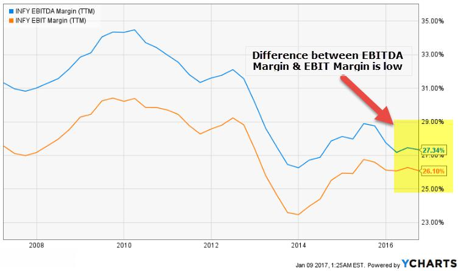

In the contemporary landscape of financial markets, the ability to accurately assess the financial health of companies is indispensable for making well-informed investment decisions. This necessity is accentuated by the adoption of sophisticated strategies, such as algorithmic trading, which rely on critical financial metrics. Among these metrics, Earnings Before Interest and Taxes (EBIT) and Earnings Before Interest, Taxes, Depreciation, and Amortization (EBITDA) stand out for their ability to provide insights into a company's operational effectiveness and cash flow potential.

EBIT serves as an indicator of a company's profitability from operations, excluding the costs of capital structure and tax effects. It is calculated as:



$$
\text{EBIT} = \text{Revenue} - \text{Operating Expenses}
$$

EBITDA further refines this analysis by removing non-cash expenses, such as depreciation and amortization, thereby presenting a clearer perspective on cash flow from operations:

$$
\text{EBITDA} = \text{Revenue} - \text{Operating Expenses} + \text{Depreciation} + \text{Amortization}
$$

While EBIT and EBITDA offer pivotal standalone insights, their integration into algorithmic trading frameworks heralds a transformative approach to investment strategy. Algorithmic trading capitalizes on the speed and precision of computer systems to execute trades based on pre-defined criteria. Within this context, EBIT and EBITDA can serve as fundamental data inputs, allowing traders to build models that capture financial health and operational efficiency, enhancing trading decisions.

As financial markets continue to evolve, the convergence of traditional financial analysis with cutting-edge technology provides unprecedented opportunities for optimizing investment outcomes. This article will explore the utilization of EBIT and EBITDA in this evolving landscape of [algorithmic trading](/wiki/algorithmic-trading), shedding light on how these metrics can be powerful tools in enhancing algorithmic models and strategies.

## Table of Contents

## Understanding EBIT and EBITDA

EBIT, which stands for Earnings Before Interest and Taxes, is a key financial metric used to assess a company's operational performance. It is calculated by taking the company's total revenue and subtracting the operating expenses, excluding interest and tax expenses. The formula is expressed as:

$$
\text{EBIT} = \text{Revenue} - \text{Operating Expenses}
$$

EBIT provides insight into a company's ability to generate income from its core operations, disregarding the effects of capital structure and tax jurisdiction. This makes it a valuable measure for evaluating operational efficiency and profitability.

EBITDA, or Earnings Before Interest, Taxes, Depreciation, and Amortization, extends the EBIT metric further by removing the non-cash expenses related to depreciation and amortization. This additional adjustment provides a clearer representation of a company's cash flow potential. The formula for EBITDA is:

$$
\text{EBITDA} = \text{EBIT} + \text{Depreciation} + \text{Amortization}
$$

By excluding depreciation and amortization, EBITDA focuses on the true cash generation capability of the business, offering insights into operational performance while neutralizing the impacts of accounting practices and capital investments. This viewpoint is especially beneficial for comparing companies across different industries where capital structures and accounting methods can vary significantly.

Both EBIT and EBITDA have their unique advantages and applications in financial analysis. EBIT is often preferred when evaluating a company’s operational efficiency and core business profitability, as it encompasses all operating expenses. It is useful in industries where depreciation and amortization do not significantly affect net income.

EBITDA, on the other hand, is highly valued in industries with substantial fixed assets and depreciation or amortization expenses, such as telecommunications or utilities. It offers a purer view of financial performance by reflecting cash flow generation, making it pertinent for assessing a company's ability to service debt or reinvest in growth opportunities.

However, there are limitations to each metric. EBIT may not adequately represent cash flow, as it does not account for non-cash expenses like depreciation and amortization. Thus, it might overstate the company's financial flexibility. EBITDA, although providing a clearer view of cash flow, may overlook essential capital reinvestment needs and can mislead stakeholders about a company’s long-term profitability if used in isolation.

In scenarios where a business is capital-intensive or has significant asset depreciation, EBITDA is often favored to gauge cash availability and operational cash flow capabilities. Conversely, for evaluating companies in sectors with minimal depreciation and low capital expenditure, EBIT offers a direct perspective on profit-driven operations.

In summary, both EBIT and EBITDA are crucial metrics, each providing distinctive insights into a company’s financial health and operational efficiency. The selection of either metric should align with the specific analytical context and industry characteristics to draw meaningful conclusions about financial performance.

## The Role of Algorithmic Trading in Finance

Algorithmic trading, often referred to as algo trading, involves the use of pre-programmed instructions to execute trades in financial markets. These instructions are based on factors such as timing, price, quantity, and numerous other mathematical models. The goal is to capitalize on the speed and efficiency of computers to make decisions and execute trades much faster than a human trader could. The impact on modern financial markets has been profound, enhancing [liquidity](/wiki/liquidity-risk-premium), tightening spreads, and increasing the overall efficiency of markets. One key advantage of algorithmic trading is the reduction of human error, ensuring that decisions are made under consistent criteria and free from emotional biases.

There are several types of algorithms commonly used in trading. Trend-following algorithms analyze historical data to identify and capitalize on market trends. These may involve techniques such as moving averages, support levels, and resistance levels to predict future movements. Arbitrage algorithms exploit price discrepancies between different markets or instruments, executing trades to profit from these differences. Market-making algorithms provide liquidity by placing both buy and sell orders simultaneously, [earning](/wiki/earning-announcement) a profit from the spread between bid and ask prices.

In the development and refinement of trading algorithms, quantitative data and financial metrics are crucial. Metrics such as EBIT and EBITDA provide insights into a company’s financial health and performance, allowing algorithms to assess value beyond just price movements. By integrating these metrics, algorithms can identify undervalued or overvalued stocks, offering more sophisticated strategies that can potentially improve profit margins.

To integrate EBIT and EBITDA into trading algorithms, one might define conditions under which a trade should occur based on these metrics. For instance, an algorithm could be designed to purchase a stock when its EBITDA margin is above a certain threshold relative to its industry peers, indicating strong operational performance and potentially undervalued stock. Similarly, a trade might be triggered if a company’s EBIT has shown consistent growth over a series of quarters, signaling operational efficiency and growth potential.

Quantitative traders use algorithms incorporating EBIT and EBITDA to optimize their strategies and enhance decision-making processes. For example, hedge funds might use a multifactor model that combines these metrics with others like price-to-earnings ratios or debt-to-equity ratios to assess the financial soundness of potential investments and make informed trading decisions. In another scenario, an algorithm might track changes in these metrics over time, using them as leading indicators to anticipate and react to market movements.

By utilizing actionable quantitative data like EBIT and EBITDA, algorithmic trading not only helps in realizing immediate trading opportunities but also contributes to long-term investment strategies. This innovative approach allows traders to harness fundamental financial data, transforming it into practical trading signals that align with the growing sophistication and technological integration in financial markets.

## Integrating EBIT and EBITDA into Algorithmic Trading Strategies

EBIT (Earnings Before Interest and Taxes) and EBITDA (Earnings Before Interest, Taxes, Depreciation, and Amortization) can play crucial roles as inputs in developing sophisticated algorithmic trading strategies. These financial metrics provide insight into a company’s operating performance and cash flow, serving as valuable indicators in evaluating investment opportunities and risks.

**Methodologies to Convert Financial Metrics into Trading Data**

To effectively incorporate EBIT and EBITDA into trading algorithms, traders employ various methodologies to convert these traditional financial metrics into actionable data. One common approach is normalization, where EBIT and EBITDA values are adjusted to a common scale, often by dividing by revenue, to facilitate comparison across companies. This results in EBIT margin and EBITDA margin, useful metrics for identifying companies with superior operational efficiencies.

Another method involves using historical EBIT and EBITDA data to derive predictive models that forecast future trends. Techniques such as regression analysis or [machine learning](/wiki/machine-learning) models like Random Forest or Neural Networks can be employed to identify patterns and predict future performance based on past data.

**Case Studies and Examples**

Incorporating EBIT and EBITDA into trading models can yield significant results, as demonstrated in various case studies. For example, a quant fund might develop a model where companies with consistently high EBITDA margins are flagged as potential investment targets, leading to successful long-term investment strategies.

Another example could be a strategy centered around the EBIT growth rate. By focusing on companies with accelerating EBIT growth, traders could capitalize on trends that suggest expanding operational performance, thereby capturing stocks poised for potential [breakout](/wiki/breakout-trading) due to underlying business strength.

**Challenges in Integration**

While the integration of EBIT and EBITDA into trading algorithms is promising, it is not without challenges. One of the primary issues is data frequency; financial metrics like EBIT and EBITDA are typically reported quarterly or annually, which can lead to less timely signals compared to daily or intraday trading data. This discrepancy necessitates using these metrics in conjunction with more frequent trading signals or indicators.

Data accuracy also poses a challenge. Discrepancies in accounting methods across companies can result in inconsistent EBIT and EBITDA figures, potentially skewing analyses. Traders must ensure rigorous data validation and cleansing processes to mitigate these issues.

**Future Potential and Trends**

Looking ahead, the integration of EBIT and EBITDA in algorithmic trading is set to expand as more sophisticated analytical tools and techniques become available. With advancements in [artificial intelligence](/wiki/ai-artificial-intelligence) and big data analytics, it is possible for traders to more accurately forecast financial metrics and correlate them with stock performance.

There is also a growing interest in incorporating non-financial data sources, such as sentiment analysis from news or social media platforms, to augment traditional metrics like EBIT and EBITDA. This fusion of various data types could lead to even more robust and adaptive trading algorithms.

In summary, EBIT and EBITDA provide a strong foundation for developing algorithmic trading strategies by offering insights into operational efficiency and cash flow potential. As technologies evolve and data integration techniques improve, the potential to leverage these fundamental metrics in algorithmic trading will likely continue to grow, offering exciting opportunities for traders and investors alike.

## Benefits and Risks

Incorporating EBIT (Earnings Before Interest and Taxes) and EBITDA (Earnings Before Interest, Taxes, Depreciation, and Amortization) into algorithmic trading strategies offers significant benefits, particularly in terms of predictive accuracy and risk management. By integrating these financial metrics, traders can attain more precise forecasts of a company's operational efficiency and cash flow potential, enhancing decision-making processes. EBIT and EBITDA enable algorithms to discern companies with robust earnings potential, thus optimizing trade timing and capital allocation.

However, potential risks and limitations exist, chiefly stemming from an over-reliance on historical data. Historical performance, while informative, may not always predict future market movements due to varying economic conditions and unforeseen events. Financial markets are inherently volatile, meaning that what once was a profitable pattern may not necessarily apply in the future. This [volatility](/wiki/volatility-trading-strategies) introduces an element of unpredictability, prompting traders to adopt diversified strategies to safeguard against potential pitfalls.

To effectively balance qualitative and quantitative analyses in algorithm-based trading, it is crucial to incorporate a holistic approach. Qualitative insights, such as management capabilities and market trends, should complement the quantitative rigor of EBIT and EBITDA computations. Integrating multiple data types ensures a comprehensive view of market conditions, reducing the risk of algorithmic misjudgments.

Best practices for continuous monitoring and adaptation of trading algorithms include regular performance reviews and updates to reflect evolving market conditions. Algorithms should be agile, capable of adjusting parameters and incorporating new data inputs dynamically. This adaptability helps maintain competitive advantage and relevance in fast-changing markets.

Backtesting—a crucial step in algorithm development—plays an essential role in validating algorithm robustness and reliability. By simulating trading strategies on historical data, traders can identify potential flaws and strengths within the algorithms. Backtesting provides a critical assessment avenue, allowing for iterative refinement before live deployment. A successful backtest may use Python libraries such as pandas, NumPy, and [backtrader](/wiki/backtrader) to analyze and simulate trading strategies:

```python
import pandas as pd
import numpy as np
from backtrader import Cerebro

# Load historical data
data = pd.read_csv('historical_prices.csv')

# Implement a simple EBIT/EBITDA-based strategy
def calculate_signals(data):
    data['Signal'] = np.where(data['EBITDA'] > data['EBIT'], 1, -1)
    return data

# Instantiate a cerebro instance for backtesting
cerebro = Cerebro()
cerebro.add_strategy(calculate_signals)

# Add backtesting data
cerebro.add_data(data)

# Run backtest
cerebro.run()
```

Through this thorough examination and methodical testing, traders can ensure their strategies are not just mathematically sound but also adaptable to real-world scenarios, providing a balanced and informed approach to algorithmic trading.

## Conclusion

Earnings Before Interest and Taxes (EBIT) and Earnings Before Interest, Taxes, Depreciation, and Amortization (EBITDA) are pivotal metrics in assessing financial performance, offering investors and analysts a depiction of a company's profitability and operational efficiency. These metrics strip away factors outside core operations, providing a cleaner view of financial health. In the context of algorithmic trading, EBIT and EBITDA's role extends into the strategic domain where quantitative insights are paramount.

By incorporating EBIT and EBITDA into trading algorithms, investors and traders can potentially gain a significant edge. These metrics facilitate the identification of undervalued or overvalued stocks by focusing on operational income, enabling more informed decision-making amidst the noise of market activities. Algorithmic trading leverages these insights, marrying them with data-driven strategies to enhance trading performance and optimize portfolio management.

The intersection of finance and technology demands continuous adaptation and learning. Financial markets evolve rapidly, as do the algorithms that navigate them. Investors and traders must update and refine their strategies continually. This commitment to progression ensures that algorithms remain robust and responsive to new patterns and opportunities emerging in the market.

Algorithmic trading's dynamic nature underscores the necessity for perpetual refinement. As algorithms adapt to historical and real-time data, the incorporation of financial metrics like EBIT and EBITDA remains crucial. With ongoing advancements in computing power and machine learning techniques, the potential for more sophisticated, accurate trading models is vast.

In conclusion, the integration of fundamental financial metrics with technology-driven trading solutions represents an innovative prospect for modern finance. As these domains converge, opportunities abound for those who embrace continuous learning and adaptation, leveraging the best of both analytical rigor and technological ingenuity. This fusion opens up new avenues for enhanced financial analysis and strategic investment, promising a future where finance and technology work in harmony to deliver superior outcomes.

## References & Further Reading

[1]: ["Valuation: Measuring and Managing the Value of Companies"](https://www.mckinsey.com/capabilities/strategy-and-corporate-finance/our-insights/valuation-measuring-and-managing-the-value-of-companies) by McKinsey & Company

[2]: Penman, S. H. (2013). ["Financial Statement Analysis and Security Valuation"](https://www.mheducation.com/highered/product/financial-statement-analysis-security-valuation-penman/M9780078025310.html). McGraw-Hill Education.

[3]: Bodie, Z., Kane, A., & Marcus, A. J. (2014). ["Investments"](https://www.mheducation.com/highered/product/investments-bodie-kane/M9781264412662.html). McGraw-Hill Education.

[4]: ["CFA Institute's CFA Program Curriculum"](https://www.cfainstitute.org/en/programs/cfa/curriculum) - Financial Reporting and Analysis Volume

[5]: Hull, J. C. (2018). ["Options, Futures, and Other Derivatives"](https://www.semanticscholar.org/paper/Options%2C-Futures%2C-and-Other-Derivatives-Hull/89bdee500c8623864fc9eb7a471546aa713acc44). Pearson Education.