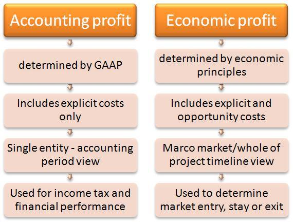

Profit is a critical financial metric used to evaluate the financial health of a business. It reflects a firm's ability to generate income relative to its expenses, directly influencing strategic decisions and stakeholder confidence. However, profit can be measured in multiple ways, primarily through economic profit and accounting profit. Each of these profit metrics provides unique insights into a company's performance, shaped by the types of costs considered in their calculations.

Economic profit offers a comprehensive perspective by accounting for both explicit and implicit costs, including opportunity costs. It represents the revenue remaining after covering all necessary expenses, plus the cost of foregone opportunities. On the other hand, accounting profit focuses on a more narrow set of data, subtracting only explicit costs from total revenue, such as wages, rent, and raw materials. It serves as the conventional metric for external financial reporting.

This article explores the differences between economic profit and accounting profit, how they are calculated, and their significance to businesses. We will also examine the impact of algorithmic trading on these profit metrics. Algorithmic trading, with its automated processes driven by complex algorithms, poses unique challenges for profit calculation, particularly in distinguishing between explicit and implicit costs.

Understanding these concepts is crucial for investors and businesses aiming to make informed decisions. By recognizing the nuances between economic and accounting profits, one can better assess an organization's financial health and strategic potential. This understanding is especially important in dynamic industries such as finance, where market conditions and technological advancements continuously influence profitability.

## Table of Contents

## What is Economic Profit?

Economic profit is a comprehensive measure of a firm's financial performance, accounting for both explicit and implicit costs. Explicit costs are direct, out-of-pocket expenses such as wages, materials, and rent. Implicit costs, on the other hand, represent the opportunity costs of utilizing resources in a particular way instead of the next best alternative. This dual consideration provides a broader and more nuanced understanding of a company's profitability than traditional accounting measures.

Mathematically, economic profit is expressed as:

$$
\text{Economic Profit} = \text{Total Revenue} - (\text{Explicit Costs} + \text{Implicit Costs})
$$

In contrast to accounting profit, which focuses solely on explicit costs, economic profit includes potential revenue from resources that could have been used differently. This metric is particularly useful for evaluating the true profitability of a business decision or project by revealing potential revenue streams from alternative uses of resources.

### Advantages of Economic Profit

1. **Comprehensive Insight:** By considering opportunity costs, economic profit provides a fuller picture of a firm's profitability. This aspect is crucial for strategic decision-making, as it highlights the possible gains or losses from alternative allocations of resources.

2. **Resource Allocation:** Economic profit is instrumental in assessing whether resources are used most efficiently. If a firm’s economic profit is negative, it suggests that resources might be better utilized in another venture or investment.

3. **Long-term Perspective:** This measure aids in evaluating long-term business viability and sustainability beyond immediate financial gains or losses.

### Limitations of Economic Profit

1. **Subjectivity of Implicit Costs:** Determining the exact value of opportunity costs can be subjective and complex. Estimating what a resource could earn in its next best use may vary depending on market conditions and assumptions.

2. **Complexity in Calculation:** Accounting for implicit costs requires detailed knowledge and understanding of potential alternatives, making the calculation of economic profit more intricate than that of accounting profit.

3. **Lack of Standardization:** Unlike accounting profit, which is standardized across financial statements for regulatory compliance, economic profit lacks universally accepted standards, potentially leading to inconsistencies in its assessment.

### Example Calculation

Consider a firm with a total revenue of $500,000. Its explicit costs, such as salaries and rent, amount to $300,000. The firm also considers its implicit costs, including foregone income from an alternative investment, which totals $50,000. The economic profit would be calculated as follows:

$$
\text{Economic Profit} = \$500,000 - (\$300,000 + \$50,000) = \$150,000
$$

In this example, the economic profit indicates that the firm has a positive profitability after accounting for both types of costs, suggesting it is effectively utilizing its resources. This comprehensive profitability measure enables businesses and investors to make more informed, strategic economic decisions.

## Understanding Accounting Profit

Accounting profit, also referred to as net income, represents the financial gain obtained by a business after deducting explicit costs from total revenue. Explicit costs include operational expenses such as salaries, rent, materials, and utilities—expenses that are directly incurred and easily quantifiable. The formula for accounting profit can be expressed as:

$$

\text{Accounting Profit} = \text{Total Revenue} - \text{Explicit Costs} 
$$

Unlike economic profit, accounting profit does not take into consideration opportunity costs. Opportunity costs refer to the potential benefits a business foregoes when choosing one alternative over another. Consequently, while accounting profit provides a clear picture of a company’s financial transactions and operational efficiency, it may not fully capture the broader financial implications of business decisions.

Accounting profit is crucial for financial reporting and regulatory compliance. It is reported in a company's income statement and used by stakeholders—including management, investors, creditors, and tax authorities—to gauge financial performance and health. Accounting profit serves as a key metric for assessing a company's ability to generate profits relative to its expenditures, ensuring transparency and accountability in reporting.

For day-to-day business operations, accounting profit is essential for making short-term financial decisions, such as budget planning, cost control, and performance evaluation. It enables businesses to track the effectiveness of their operations, identify areas for cost reduction, and inform strategy development. Although it might not account for all economic factors, accounting profit remains a vital tool for internal and external stakeholders in measuring a company’s financial success.

## Key Differences Between Economic and Accounting Profit

Economic and accounting profit are fundamental concepts in financial analysis, each serving a specific purpose and calculated using distinct methodologies. 

Economic profit is a measure that encompasses both explicit costs, which are direct, out-of-pocket expenses, and implicit costs, which represent the opportunity costs of utilizing resources in one manner over alternative avenues. The formula for calculating economic profit is:

$$
\text{Economic Profit} = \text{Total Revenue} - (\text{Explicit Costs} + \text{Implicit Costs})
$$

This comprehensive approach provides insight into the actual profitability by considering foregone opportunities. Economic profit is instrumental for internal strategic decision-making, as it analyzes the potential benefits of different resource allocations or investment opportunities, highlighting inefficiencies that might not be apparent when evaluating only explicit costs.

Conversely, accounting profit, also known as net income, focuses exclusively on explicit costs—those that are directly incurred and easily quantifiable. The formula for accounting profit is:

$$
\text{Accounting Profit} = \text{Total Revenue} - \text{Explicit Costs}
$$

This measure is critical for regulatory reporting and calculating tax liabilities, as it adheres to standardized accounting principles that ensure consistency and comparability across businesses. Accounting profit provides a clear picture of a company's operational efficiency and performance over a specific period, thereby satisfying external stakeholders like investors, creditors, and regulatory authorities.

The differences between these two profit metrics impact how businesses approach financial analysis. Economic profit, by including opportunity costs, encourages businesses to examine the broader implications of their financial decisions, promoting long-term sustainability and strategic growth. Companies often use economic profit to assess the viability of expansion projects, mergers, or acquisitions, as it provides a deeper understanding of potential gains or losses beyond surface-level accounting figures.

In contrast, accounting profit is crucial for compliance and transparency. It allows businesses to accurately report financial results to stakeholders, maintain trust, and fulfill legal obligations. While accounting profit may not capture the full economic reality, its simplicity and adherence to established guidelines make it essential for day-to-day operations and short-term financial planning.

In summary, while economic and accounting profit both evaluate profitability, they cater to different needs and audiences. Economic profit offers a comprehensive analysis for internal strategic initiatives, while accounting profit caters to external reporting and compliance requirements. Understanding these differences enables businesses to employ the appropriate profit metric based on their specific strategic and operational objectives.

## Algorithmic Trading and Profit Calculations

Algorithmic trading employs algorithms to automate trading processes, fundamentally altering how economic and accounting profits are calculated. The revenue generated through [algorithmic trading](/wiki/algorithmic-trading) arises primarily from capital gains, dividends, and interest. These revenue streams, however, are countered by various costs that are particularly pertinent in an algorithmic context. 

Costs in algorithmic trading include technology infrastructure, transaction fees, and implicit costs such as the opportunity cost of capital. Technology infrastructure costs encompass expenses related to maintaining high-speed internet connections, purchasing proprietary software, and employing data analysis tools that enable firms to process vast amounts of market data in real-time. Transaction fees consist of brokerage fees and exchange fees incurred with each trade executed by the algorithm.

Implicit costs, often overlooked yet critical, include the opportunity cost of capital. This represents the potential returns from alternative investments that could have been pursued with the firm's capital. In algorithmic trading, the rapid execution of trades might lead to significant capital allocation decisions that bear substantial implicit costs, especially if those funds could have yielded higher returns elsewhere. 

In evaluating the effectiveness of their strategies, trading firms often rely on economic profit measures. Economic profit, which factors in both explicit and implicit costs, offers a comprehensive assessment of a strategy’s true profitability. For instance, consider a case study of a trading firm deploying a high-frequency trading strategy. If the explicit costs (like transaction and technology costs) are $100,000, and the revenue from capital gains and dividends is $150,000, the accounting profit would be $50,000. However, if the implicit costs (including opportunity cost of capital) amount to $30,000, the economic profit would only be $20,000.

This distinction is critical for strategic decision-making. An algorithmic trading firm might choose one strategy over another, not just by comparing accounting profits, but by evaluating the economic profit to capture the fuller picture of profitability. By recognizing the significance of implicit costs, firms can optimize their capital allocation to enhance long-term value. 

Such nuanced profit calculations allow firms to refine their trading strategies to maximize gains while minimizing hidden costs. In doing so, they can ensure that every aspect of their operations—from technology investment to capital allocation—contributes positively to their bottom line.

## Example Scenario: Economic vs. Accounting Profit

Consider a trading firm faced with the decision of undertaking one of two projects: Project A or Project B. Both projects require an initial investment and are expected to generate revenue over a five-year period. To evaluate which project provides better long-term value, we will calculate both economic and accounting profits for each project and analyze the differences.

### Project Details

- **Project A:**
  - Initial Investment: $1,000,000
  - Annual Revenue: $300,000
  - Annual Explicit Costs: $100,000
  - Opportunity Cost: $50,000 (for capital that could be used elsewhere)

- **Project B:**
  - Initial Investment: $1,000,000
  - Annual Revenue: $350,000
  - Annual Explicit Costs: $150,000
  - Opportunity Cost: $75,000

### Calculation of Accounting Profit

Accounting profit is derived by subtracting explicit costs from revenue. For each project over the five-year period, accounting profit is calculated as follows:

$$
\text{Accounting Profit} = \text{Annual Revenue} - \text{Annual Explicit Costs}
$$

- **Project A:**
  - Annual Accounting Profit = $300,000 - $100,000 = $200,000
  - Total Accounting Profit over 5 years = $200,000 * 5 = $1,000,000

- **Project B:**
  - Annual Accounting Profit = $350,000 - $150,000 = $200,000
  - Total Accounting Profit over 5 years = $200,000 * 5 = $1,000,000

### Calculation of Economic Profit

Economic profit accounts for both explicit and implicit costs, including opportunity costs. It is calculated as follows:

$$
\text{Economic Profit} = \text{Annual Revenue} - \text{Annual Explicit Costs} - \text{Opportunity Cost}
$$

- **Project A:**
  - Annual Economic Profit = $300,000 - $100,000 - $50,000 = $150,000
  - Total Economic Profit over 5 years = $150,000 * 5 = $750,000

- **Project B:**
  - Annual Economic Profit = $350,000 - $150,000 - $75,000 = $125,000
  - Total Economic Profit over 5 years = $125,000 * 5 = $625,000

### Analysis and Conclusion

In terms of accounting profit, both Project A and Project B appear identical, each yielding $1,000,000 over five years. However, when opportunity costs are considered in calculating economic profit, Project A generates a higher total economic profit ($750,000) compared to Project B ($625,000). 

The inclusion of implicit costs such as opportunity costs reveals that Project A offers better long-term value for the trading firm. This example highlights the importance of considering economic profit, providing a more comprehensive view of profitability when making strategic business decisions. By evaluating both accounting and economic profits, businesses can gain valuable insights into the true economic value of their projects.

## Conclusion

Accounting profit, defined as the difference between total revenue and explicit costs, serves as a crucial metric for external reporting and meeting regulatory requirements. Its clear, straightforward nature provides a reliable snapshot of a company's financial health and is integral in preparing financial statements, determining tax obligations, and communicating results to stakeholders. However, its limitation lies in its exclusion of implicit costs, such as the opportunity cost of capital, which can significantly impact a company's true financial picture.

Economic profit, on the other hand, extends beyond this simplicity by integrating both explicit and implicit costs. By considering opportunity costs, it provides a more comprehensive view of profitability and aids in strategic decision-making. The formula for calculating economic profit is:

$$
\text{Economic Profit} = \text{Total Revenue} - (\text{Explicit Costs} + \text{Implicit Costs})
$$

In dynamic sectors such as algorithmic trading, where rapid decision-making and strategic flexibility are crucial, understanding both economic and accounting profit is invaluable. Algorithmic trading firms often rely on sophisticated models and data insights to maximize profits. Here, recognizing the implicit costs, like the potential gains from alternative investments, can be pivotal in evaluating the effectiveness of trading strategies and ensuring sustainable growth.

Investors and businesses should weigh both economic and accounting profit perspectives when evaluating a company's profitability. Economic profit offers insights into potential future gains by assessing all resource costs, enabling firms to make more strategic investments. Meanwhile, accounting profit remains essential for short-term analysis and meeting operational financial obligations.

A comprehensive understanding of both profit types can foster informed decision-making, enhance competitive advantages, and support long-term financial success. Therefore, businesses and investors who integrate both perspectives are better positioned to assess true profitability and drive innovation and resilience in their operations.

## References & Further Reading

[1]: ["Profitability Analysis: An International Perspective"](https://www.jstor.org/stable/40227673)- A book providing insights into profit analysis, relevant to understanding economic and accounting profit differences.

[2]: ["Advances in Financial Machine Learning"](https://www.amazon.com/Advances-Financial-Machine-Learning-Marcos/dp/1119482089) by Marcos Lopez de Prado - This book explores machine learning applications in financial trading, relevant to algorithmic trading.

[3]: ["Quantitative Trading: How to Build Your Own Algorithmic Trading Business"](https://www.amazon.com/Quantitative-Trading-Build-Algorithmic-Business/dp/1119800064) by Ernest P. Chan - Provides foundations for setting up algorithmic trading systems, linking to cost considerations.

[4]: ["Algorithmic Trading: Winning Strategies and Their Rationale"](https://www.amazon.com/Algorithmic-Trading-Winning-Strategies-Rationale-ebook/dp/B00CY5HC0U) by Ernest P. Chan - Discusses strategies and their financial calculations in trading.

[5]: ["Machine Trading: Deploying Computer Algorithms to Conquer the Markets"](https://www.amazon.com/Machine-Trading-Deploying-Computer-Algorithms/dp/1119219604) by Ernest P. Chan - Explores deploying algorithms and integrating economic perspectives in trading.