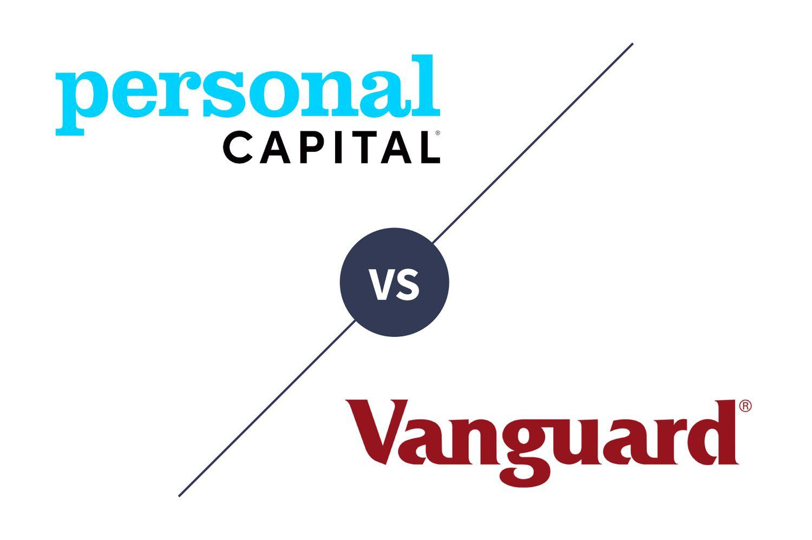

## Table of Contents

## What are Empower and Vanguard Personal Advisor Services?

Empower, previously known as Personal Capital, is a financial service that helps people manage their money. It offers tools to track your spending, see all your accounts in one place, and get advice on investing. Empower also has financial advisors who can help you plan for things like retirement or buying a house. You can use their app or website to check your finances anytime.

Vanguard Personal Advisor Services is another service that helps you with your money, but it focuses a lot on investing. It uses technology and human advisors to give you personalized advice based on your goals and how much risk you're willing to take. Vanguard is known for its low-cost investment options, which means you can invest without spending a lot on fees. Like Empower, you can access your account online or through an app.

## How do the fee structures of Empower and Vanguard compare?

Empower charges a fee based on the total amount of money you have them manage. If you have less than $1 million, the fee is 0.89% of your assets each year. If you have more than $1 million, the fee goes down to 0.79%. This means if you have $100,000 with Empower, you would pay $890 in fees each year. The fees are taken out of your account automatically.

Vanguard Personal Advisor Services has a different approach. They charge a flat fee of 0.30% of your assets per year, no matter how much money you have with them. So, if you have $100,000 with Vanguard, you would pay $300 in fees each year. Like Empower, these fees are taken out of your account automatically. This makes Vanguard's fees lower than Empower's for most account sizes.

## What investment options are available through Empower and Vanguard?

Empower offers a variety of investment options to help you grow your money. You can invest in things like stocks, bonds, and ETFs (exchange-traded funds). They also have mutual funds and a mix of different investments that they put together for you, called portfolios. These portfolios can be set up to match how much risk you want to take and what you're saving for, like retirement or buying a house. Empower's advisors can help you pick the right investments for your goals.

Vanguard Personal Advisor Services also gives you a lot of choices for investing. They focus a lot on their own low-cost index funds and ETFs. These are funds that try to match the performance of the overall market instead of trying to beat it. Vanguard also lets you invest in individual stocks and bonds if you want. Like Empower, they can set up a personalized portfolio for you based on your goals and how much risk you're comfortable with. Their advisors will help you choose the best investments for your needs.

## How do the minimum account requirements differ between Empower and Vanguard?

Empower has a minimum account requirement of $100,000 to use their wealth management services. This means you need to have at least that much money to start using their financial advisors and get help with your investments. If you have less than $100,000, you can still use Empower's free tools to track your spending and see all your accounts in one place, but you won't get the personalized advice.

Vanguard Personal Advisor Services has a lower minimum account requirement. You can start using their services with just $50,000. This makes it easier for more people to get personalized investment advice and help with their financial goals. Like Empower, Vanguard also offers tools to help you manage your money, but their focus is more on investing and keeping costs low.

## What kind of financial planning tools do Empower and Vanguard offer?

Empower offers a lot of tools to help you manage your money. They have a dashboard where you can see all your accounts in one place, like your bank, investments, and credit cards. This makes it easy to track your spending and see where your money is going. They also have tools to help you plan for the future, like calculators for retirement and savings goals. If you want, their advisors can give you personalized advice based on your situation. You can use these tools on their website or app, so you can check your finances anytime.

Vanguard Personal Advisor Services also gives you tools to manage your money, but they focus more on investing. They have a tool that helps you set up a plan based on what you want to achieve and how much risk you're okay with. You can see how your investments are doing and make changes if you need to. They also have calculators to help you figure out how much you need to save for retirement or other goals. Like Empower, you can use these tools online or through their app, and their advisors can help you make the best choices for your money.

## How do the tax strategies of Empower and Vanguard Personal Advisor Services compare?

Empower focuses on helping you save on taxes by using strategies like tax-loss harvesting. This means they sell investments that have gone down in value to reduce your taxes. They also look at your whole financial picture to find other ways to save on taxes, like choosing the right types of accounts for your investments. Their advisors can give you personalized advice based on your situation, but you need to have at least $100,000 to use these services.

Vanguard Personal Advisor Services also uses tax-loss harvesting to help you save on taxes. They focus on keeping your costs low, which means more of your money can grow over time. Vanguard's advisors will look at your goals and how much risk you're okay with to set up a plan that works best for you. You can start using their services with just $50,000, which makes it easier for more people to get help with their taxes and investments.

## What are the user experiences like with Empower versus Vanguard?

Empower's user experience is designed to be easy and helpful. When you use Empower, you can see all your money in one place. Their app and website are simple to use, so you can check your spending and investments anytime. If you have at least $100,000, you can talk to their advisors who give you personal advice. People like that Empower's tools help them see where their money goes and plan for the future. But, some users find that the fees are a bit high if they don't have a lot of money to invest.

Vanguard Personal Advisor Services also focuses on making things easy for you. Their app and website let you see how your investments are doing and make changes if you need to. They have a lower minimum of $50,000, so more people can use their advisors. Vanguard is known for keeping costs low, which many users like because it means more money stays in their pockets. Users appreciate the personalized plans and the focus on long-term investing. However, some people might find that Vanguard's tools are more focused on investing and less on overall money management compared to Empower.

## How do the performance histories of Empower and Vanguard's portfolios compare?

Empower's portfolios have done well over time, but how well they do can change depending on what you invest in and how the market is doing. They focus on a mix of different investments to help you reach your goals. Some people like that Empower tries to beat the market, but it can be a bit riskier. If you look at the past few years, Empower's portfolios have had good returns for many people, but remember, past results don't mean the future will be the same.

Vanguard Personal Advisor Services' portfolios are known for being steady and reliable. They focus a lot on low-cost index funds, which try to match the market instead of beating it. This usually means less risk and lower fees. Over the years, Vanguard's portfolios have had good, steady growth. Many people like Vanguard because it's simple and you know what you're getting. Just like with Empower, past performance doesn't guarantee future results, but Vanguard's approach has worked well for a lot of people.

## What level of human advisor interaction can clients expect from Empower and Vanguard?

With Empower, if you have at least $100,000, you can talk to a human advisor. They will help you plan your money and investments. You can call them or meet with them online. They will look at your whole financial picture and give you advice that fits your goals. If you have less than $100,000, you can still use Empower's tools to track your money, but you won't get to talk to an advisor.

Vanguard Personal Advisor Services also lets you talk to a human advisor, but you only need $50,000 to start. Their advisors will help you pick the best investments for you based on what you want to achieve and how much risk you're okay with. You can call them or meet online. Vanguard's focus is on keeping costs low and helping you invest for the long term. Their advisors are there to guide you and make sure your plan stays on track.

## How do Empower and Vanguard approach risk management in their services?

Empower helps you manage risk by looking at your whole money situation. They ask you about your goals and how much risk you want to take. Then, they make a plan that fits you. They use different kinds of investments to spread out the risk, so if one thing goes down, other things might go up. They also keep an eye on your investments and make changes if they need to. If you have at least $100,000, their advisors can help you understand and manage your risk better.

Vanguard Personal Advisor Services focuses on keeping your risk low and steady. They use low-cost index funds that try to match the market, which usually means less risk. They ask you about your goals and how much risk you're okay with, then they make a plan that fits you. They keep checking your investments to make sure they're doing what you want. If you have at least $50,000, their advisors will help you manage your risk and make sure your plan stays on track.

## What advanced features do Empower and Vanguard offer for expert investors?

Empower has some cool tools for people who know a lot about investing. They let you see all your money in one place, which can help you make smart choices. They also have a tool called tax-loss harvesting that can save you money on taxes. If you have at least $100,000, you can talk to their advisors who know a lot about investing and can give you advice that fits what you want. They can help you pick the right investments and change your plan if you need to.

Vanguard Personal Advisor Services also has some good stuff for expert investors. They focus on low-cost index funds, which can be a smart way to invest without spending a lot on fees. They have a tool that helps you set up a plan based on what you want to achieve and how much risk you're okay with. If you have at least $50,000, their advisors can help you make the best choices for your money. They can show you how to use tax-loss harvesting and other ways to save on taxes, and they'll keep an eye on your investments to make sure they're doing what you want.

## How do the two services integrate with other financial tools and platforms?

Empower makes it easy to connect with other money tools and apps. You can link your bank accounts, credit cards, and investments to see everything in one place. This helps you keep track of your spending and make smart choices about your money. Empower also works with other investment platforms, so you can move money around easily if you need to. If you use other apps to manage your money, Empower can fit right in and make your financial life simpler.

Vanguard Personal Advisor Services also connects well with other financial tools. You can link your bank accounts and other investments to get a full picture of your money. They focus a lot on investing, so they work well with other investment apps and platforms. This makes it easy to see how your investments are doing and make changes if you need to. Vanguard's tools are designed to help you manage your money in a way that fits with other apps you might be using.

## References & Further Reading

[1]: Financial Industry Regulatory Authority (FINRA). ["Algorithmic Trading: Rule and Guidelines."](https://www.finra.org/rules-guidance/key-topics/algorithmic-trading)

[2]: Vanguard. ["Vanguard Personal Advisor Services Product Disclosure Statement."](https://investor.vanguard.com/my-account/log-on)

[3]: Easley, D., López de Prado, M. M., & O'Hara, M. (2012). ["The Volume Clock: Insights into the High-Frequency Paradigm."](https://papers.ssrn.com/sol3/papers.cfm?abstract_id=1695596) The Journal of Portfolio Management, 39(1), 19-29.

[4]: Frino, A., Mollica, V., & Webb, R. I. (2014). ["The Impact of Co-location of Securities Exchanges' and Traders' Data Centers on Market Liquidity."](https://link.springer.com/article/10.1007/s10436-014-0258-4) Review of Quantitative Finance and Accounting, 45(4), 1073–1091.

[5]: Securities and Exchange Commission (SEC). ["Rule 15c3-5: Risk Management Controls for Brokers or Dealers with Market Access."](https://www.sec.gov/files/rules/final/2010/34-63241.pdf)